# The History of Medenia

_by Brittany in_ ___Dark Ages___

## Foreword

In my travels of these lands, I have gathered an immense amount of information--the inner workings of cultures, the essence of plants and animals, and the paths to great powers, just to name a little. But perhaps the greatest treasure I have stumbled upon is the privilege to stop and reflect. I am very lucky to be able to ponder about Aislings as a whole, and just as importantly, myself as an individual.

On a breezy day several Deochs ago, I stumbled upon an epiphany. My realization was this: Aislings are so concerned about our distant past in Temuair that we often forget about the history that we are overlooking in Medenia. I raced through the Loures Castle gates and clambered up the stairs to the Library, after which I began tearing the books from their shelves. The tomes that graced the History shelves contained only words of Danaan, struggles with the forces of darkness, and the races that dwelled not too far from my home in Mileth. I was appalled; it was impossible that we had collected so little "new" history since the breaking of the Seal.

I tightened the laces on my boots, filled my pack with supplies, and suddenly found myself upon the deck of a ship in Loures Harbor. I went to the other continent and traversed the trails that our ancestors surely did. I spoke to the natives and scoured the remaining ruins for any evidence of the past. When I felt my journey had ended for a while, I took a step back and ogled at the stack of parchment that laid before me.

I offer my findings to the nobles of Temuair and hope that one day we may have all the answers. Welcome to the history of Medenia...as we know it so far.


Regards,  
Brittany Hamaru, Deoch 108  

---

## Speculation: The Beginning & Elemental Spirits

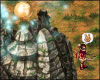

### The Beginning?

Perhaps the first question that is asked when considering the birth of Medenia is not when she came about, but how. Luckily, the origins of the continent are much less shrouded in mystery than Temuair's origins; the elemental spirits of Medenia are very forthcoming to those seeking their knowledge. After a small amount of reverence, I was very fortunate to hear the Earth Spirit speak.

The Earth Spirit alludes to the beginning of time, which Aislingkind refers to as the Grinneal period. In Temuair, it was the beginning of the worship of gods. It was also the time in which the elements of fire, wind, water, and earth were bestowed upon the lands(1). It was not the blessings of the gods who brought the elements to the lands--it was the work of the elemental spirits. Yes, during what was predicted around Grinneal 26900, the elemental spirits also touched Medenia's sister continent. However, the Earth Spirit explains that the spirits decided their stay in Temuair would not be permanent. They left the continent in the hands of the gods and moved on to new life established in a place free from the gods' influence. This land was Medenia, though the name of the continent was probably not decided until much later. The Earth Spirit had nothing more to say, but I propose that the elemental spirits were likely gone from Temuair by the Fifth Aeon. While it is not clear whether the god Grinneal is thought to have had a hand in the creation of life on Medenia as he did in Temuair, it is assumed that life in Medenia as a whole is slightly younger than life in Temuair because the elemental spirits did not make the continent hospitable until later. That fact, however, does not mean the quality of life is any less rich in Medenia; while the elemental spirits are seemingly unable to grant the spark to its mundanes as Deoch has done, the mundanes have created history of their own. Other civilizations have also sprung up as time has progressed.

### The Elemental Spirits

With the knowledge that the elemental spirits are responsible for the livelihood of all Medenian creatures, it is prudent that I share what little information I have gathered about them before continuing further. The Earth, Fire, and Water Spirits are curious, arcane entities whose true origins remain mostly a mystery among mundanes and Aislings alike. While to Aislings the spirits physically appear as individuals, all spirits refer to themselves as "we," as if there is more than one life form within their physical shells. The only exception to these observations is with the Water Spirit, who corrects herself when speaking to Aislings.

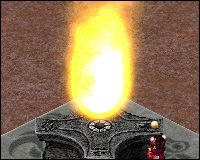

Other information about the elemental spirits is equally as objective. Mundanes and Aislings have revered the spirits since discovering them in what is now Noam, Hwarone, and the Water Dungeon, respectively. It is also thought that other spirits corresponding to the remaining elements are waiting to be found in unexplored regions of the continent as well. We currently rely on the spirits for their protection; this is provided in the form of precious items that are forged into even more powerful equipment. The Earth and Water Spirits are also known for bestowing us with additional privileges (there is more information on these spirits in the Water Dungeon section). There is also more information about the Fire Spirit in the coming pages. However, let's press on to a subject that is more familiar to Aislingkind: mundanes.

### The Birth of Mundanes

The minute quantity of information on the first non-spirit civilization of Medenia is that which has been passed down through the generations. While one race claims to have been the first to be born in Medenia, another claims otherwise. The only solid evidence that I could find came from a rather uncanny source: a book. While a book may not seem uncanny to those that have seen a multitude of books in Temuair, the finding is most strange in Medenia; this particular book would be the only one I would find in my entire trek of the continent. In Asilon I stumbled upon the Mysterious Book, quite literally, as I sought a cure for one of the villager's ailments. The pages were essentially scraps of parchment barely held together by a decrepit twine. I spoke to the closest villager I could find, an old mundane by the name of Jelus. He took the book and his eyes became wide; I had found a book written by an ancient civilization called the Golkatians. Jelus attempted to translate the book with the little knowledge given to him by his grandfather, but only managed to decipher a few words: "Dioram," "deadly to those alive," and "Ease the Stones." Well, it was a start.

According to Historian Arachne(2), Jelus also explained to her that a pristine city of gold once existed in Medenia an undetermined amount of time in the past. Mundanes began to worship the elemental spirits during this time, but it was also a time of great unrest. The mundanes became corrupted (due much in part to the Metal Spirit's mischief) and the remaining elemental spirits sundered the city into the sea. The surviving mundanes fled the city and took up homage elsewhere on the continent. These mundanes very well may be the Goltakians Jelus spoke about so seriously.

From that information, I will next attempt to explain how Medenian mundanes diversified.

---

## Civilization: Mundane Beginnings

Was it an accident that the mundanes of Medenia were chosen to look structurally identical to those found in Temuair? Did Grinneal or the elemental spirits predict that civilizations would collide at some distant point in time? These are not questions I sought to answer during my journey, but they brought about an interesting aspect of history: that Temuairan and Medenian mundanes progressed similarly while being completely separate from one another. I propose that mundanes began to appear on the continent sometime between what we know as the beginning of the Sixth Aeon and the end of the Seventh Aeon. It is reasonable that the elemental spirits would have fully departed Temuair by this time and focused their energies into making Medenia a hospitable place.

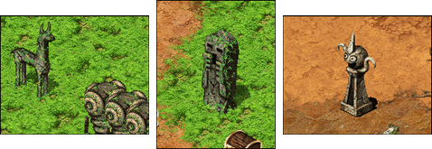

I have gathered from ancient relics and Jelus's story with Arachne that the Golkatians were a spiritual and, later, a nomadic race. Signs of their reverence and travels can be found dotting the Asilon and Noam plains and prairies. Judging from the amount of mundanes currently found in the lands, the civilization was no doubt a small tribe comprised of only a few families. It is predicted that the Golkatians spent the Eighth Aeon exploring, discovering, and reproducing. Finally, once the people had reached decent numbers, they began to abandon their nomadic roots. Families split off as they reached lands they fancied, and finally the mundanes erected boundaries and discovered politics.

From the amount of relics found, I predict the Golkatians probably began their journey after the fall of their city in the region we call Noes. This region includes the towns of Asilon and Noam. From there, they most likely traveled west along the coast and began settling the Alsaids region in what is now called Hwarone. The more adventurous mundanes branched out and settled the farther regions of Selaime, which includes the recently explored Aman Jungle. I predict that the regions of Andarion, Nageling, and Silion are comprised of younger establishments that took more time to settle; the terrain becomes much more unforgiving after crossing the Aman Jungle and even Aislings have yet to explore farther than the twisted trap of trees. Certainly all of these changes must have occurred by the beginning of the Tenth Aeon, when the exploration of Medenia by Aislings would soon be afoot. I have drawn on the map below to better illustrate these happenings.

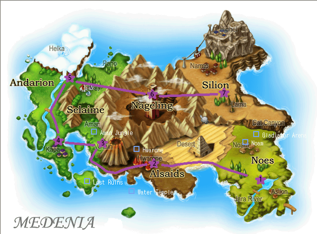

Other than what is taught in folklore, there is very little evidence to support when the other races--the Andor ants and Veltain Grimlocks--arrived on Medenia. However, some research shows that those races also began with simple societies. There is more on this in the coming pages.

While brief, that is a summary of much of the general information I have gathered on the origins of Medenian mundanes. Now, let's explore some of the more interesting historical occurrences of the established towns. 

---

## Mundane Progression: Buildings, Medicine, and Politics

As Aislings push farther and farther westward, we discover the diversity of the plants, animals, and style of the mundanes we encounter. There is no doubt that although the tribes of mundanes originated from common ancestors, they have metamorphosed into groups of people that are entirely unique. In the coming paragraphs, I will attempt to explain the historical significance of events that occurred before and after Aislings arrived on the continent. These events are surely what led to the formation of the towns as we know them today.

### Asilon and Noam

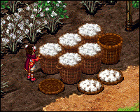

It is appropriate to begin with Asilon and Noam because, as mentioned before, it is speculated that these areas are where mundanes first appeared. The villages were also the only two areas readily available to Aislings after the breaking of the Seal of Medenia in Deoch 35(3).

When mundane nomadic habits were lost, the villagers adapted by hunting and raising crops. Namely, the mundanes of Asilon began cultivating cotton and other plants, such as sunflowers, for clothing and food. Buildings, simple at first, were erected by molding together mud blocks. Later, a more complex structure of wooden frames, stairs, and windows were built in addition to the blocks.

Politics in Asilon and Noam has not progressed much. To this day, Asilon and Noam retain no more than a simple ranking system where a village leader, often the oldest or wisest of the groups, makes decisions. Merchants appear to take the secondary rank, as they bring in all of the economic progress, and other townspeople fill the lower rank. The current leader of Asilon is Jelus, and the current leader of Noam is Kabok. Probably the most interesting aspects of Asilon and Noam, however, are their spirituality and reliance on one another. It is not clear why Asilon and Noam are divided into two separate regions, but they often act as one. 

When it comes to historical occurrences, Asilon and Noam have several notable events. The first that comes to mind is the struggle between mundanes that occurred a few Deochs before Aislings arrived on the continent. I am, of course, referring to the situation between Cruvano, his fiance Celina, and the evil sorcerer Darni. Cruvano willingly tells the tale to Aislings from his hut just outside the Asilon armory; apparently Celina, now a mudling, was once a wonderfully beautiful mundane. The pair of mundanes were very much in love. However, another mundane by the name of Darni also wished to gain Celina's affection, though she did not care for him. Furious at her rejection, Darni aspired to become a powerful sorcerer so that he could take Celina by force. After many Deochs, Darni achieved such power, though his power was thought to have arisen from dark magics. When Celina refused him a second time, Darni cast a spell that would eventually change Celina into a mudling unless she agreed to kiss him each day. Celina, adamant with her decision but filled with grief for Cruvano, eventually became the mudling she is today. Cruvano remains heartbroken for his dear fiance, but through Aisling assistance, a cure may soon be possible.

This situation leads to the second and probably most important historical event of the region. This event is the discovery of the Dioram. I happened upon this information after hearing about the Mysterious Book from Jelus, the same day as when I set out to find a cure for Celina. The old man hastily sent me to his friend, Kabok, who was much more knowledgeable about ancient happenings than we were. According to Kabok, the Dioram is an elixir that is rumored to be only a myth, but is in fact real.  I beckoned for more information; the cursed placed upon Celina was quickly taking its toll.

Kabok explained that the Dioram is a powerful substance that has flowed underground for as long as the Elemental Spirits have been enriching the lands with their power. As mentioned before, this may have been as early as the Sixth Aeon. The liquid functions as a conduit between the Spirits, allowing them to influence lands distant from where they dwell. This is how the six elements of Earth, Wind, Water, Fire, Metal, and Nature appear in all regions of the continent (though I predict the elemental properties of a certain Spirit are dominant in a region where a Spirit dwells). While the Dioram cannot be channeled to the surface by ordinary means, Kabok told me that he would allow me to bring a small amount of the liquid to the surface to help the ailing Celina. To do this, I had to engage in a Golkatian ritual that involved fox ribs...but I will not go into detail here. Kabok explain that the liquid, in the hands of mundanes and Aislings able to purify it, may pose a threat to the lives of all living creatures. I gathered the impure substance in a bottle and administered it to Celina, who magically showed improvement. I left the hut in Asilon with a smile on my face, hoping the sighing mudling eventually returned to her beautiful self. My smile was short lived, however, when I crossed the town and spotted something rather peculiar relaxing by the dome shaped huts. The gray-skinned lifeform was not shy; in fact, it waved me over and introduced itself. Its name was Mephit.

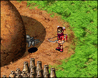

This introduction marked another notable event in Medenian history. As I spoke to Mephit, it explained its kind was what we normally call demons. Him and another demon, Morwin, had emerged from a realm called Crionor to satisfy their curiosity on the events in Medenia. Normally, Mephit said, creatures are not able to escape from their realms and travel to others; some strange force had been making the transition easier. The same was true when the Creants first appeared in Temuair and attempted to capture the power of the Elemental Spirits, though the demon could not recall from which realm the Creants had escaped. Mephit did not say exactly when it arrived in our realm, but I had not expected it to understand our methods of keeping time. I predict that both demons came to Medenia from Crionor late in the Eighth Aeon, when it was first recorded that lifeforms were capable of shifting realms(4). Curiously, this is also the time period where the element of Darkness was discovered. To thank the demon for its information, I gave it ten Charred Bones to replenish its strength. I bit my lip and hoped I had not made a mistake.

At the end of these quests, I had only more questions: why was there so little information about the Goltakin peoples? Were their lives extinguished by the power of the Dioram? Does Temuair also have an underground source of elemental energy? What was the strange force that allowed demons and other creatures to come to our realm? ...should we be afraid that they are doing so? I hopped upon Habab's handy caravan to Hwarone, where I hoped to find more answers.

### Hwarone

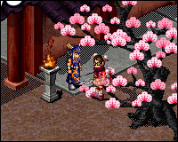

Hwarone, a town nestled between the foot of a volcano and a sweltering desert, is home to some of the most colorful mundanes found on the continent. Aislings needed roughly fifteen Deochs to cross the desert and thusly discovered the town in Deoch 50(5).

The Hwarone mundanes' ancestors, so I'm told, were an ingenuous bunch who thrived from the fertile grounds offered at the bottom of the volcano. Despite choosing their location within the proximity to a dangerous force of nature, the Hwaronians were instantly at ease when they found the sanctuary of the Fire Spirit within walking distance of their home. The mundanes erected a more formal shrine for the spirit and gave reverence to the powerful entity, who is thought to be solely responsible for keeping the lava at bay. The shrine still stands today.

I am told by the townspeople, namely Mank the Gatekeeper, that the distant history of Hwarone is one of success. The lands, so fertile, were once covered in hardy cherry blossom trees that still dot the area. The Golkatian ancestors were thought to have etched the smooth stone streets from the very rock that had spilled from the volcano and constructed the city walls from cherry blossom trees they cleared. Fine accessories, such as fire fonts, poles for decoration, and signs were created easily because of the generous amount of malleable stone and heat at the mudanes' disposal. Today, Hwarone functions as a site for imports and offers and array of expensive upgrades and trinkets for Aislings. Soon after the discovery of the city, the mundanes also constructed a unique style of government that Aislings were invited to join.

However, Hwarone has written its own list of troubles. When the townspeople began to better explore their surroundings at the time of Aisling appearance, they discovered two valuable resources: Andor and the Veltain Mines. The reason for the invasion of Veltain was simple; the mines were a rich source of ore, which is much more easy to work with than stone. The mundanes still often require the Veltain Ore to craft many of the Aisling weapons in their smithy. Hwarone's invasion of Andor is much more unclear because many of the items crafted by the Hwaronians are often far superior to those found in Andor. However, I suspect the invasion may have occurred because of the appearance of the Conix in the hive (there is more information on this occurrence in coming pages). Perhaps the Hwaronians are seeking enlightenment of their own...but regardless, Aislings first frayed against Andor when discovering the hive, shortly after the breaking of the Seal. They continued the fight and officially joined the battle against the Veltain grimlocks when Hwarone organized its parliament and military in Deoch 61(6).

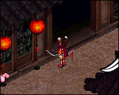

Hwarone also has problems at home. When Aislings first stumbled upon the city, they were quick to notice that the town Magistrate was speaking gibberish. It was at this time that Aislings had a reason to venture into the nearby Desert Dunes. The Dunes were the only source for ginseng, which were boiled down and mixed into an elixir to cure the Magistrate's condition.  It was later discovered that the Magistrate's favorite beverage, Black Sun Tea, had been contaminated with an unknown substance--perhaps a poison meant to kill him. It is still unclear who planted the substance in the Magistrate's tea, or why, but the mundanes are currently amassing their army to protect against an attack on their city. However, I fear that the enemy may already be within the city walls.

An even more sinister situation lies just outside of Hwarone. I spoke to Cheung, the Hwarone Innkeeper, and asked her about the decrepit building that seemed to be abandoned outside the city walls. Cheung explained that the rather large building belonged to the former magistrate of the town, who went by the name of Guaili. Apparently the mundane was a very poor magistrate, but instead focused his energies on other disciplines--namely, the study of magics. After the passing of several Deochs (or cycles, as the mundanes prefer to call them), the home eventually became what it is today. Cheung was unsure exactly how the home became so corrupted, so groups of Aislings offered to help solve the mystery. They climbed to the top of the home, slaying hordes of cursed guard dogs and possessed dolls, and finally arrived in Guaili's study. What Guaili had become was frightening; he was no longer a mundane, but a monstrous figure whose body had been possessed by some form of dark energy. When the robed figure attacked the weakest of the Aislings, the stronger members of the group had no choice but to defend their own. Guaili fell in Deoch 50, but the Cursed Home remained. It can only be assumed that the dark energy contained within the building was not lost, and for some reason lingers...

Luckily, the history of Hwarone was pretty straightforward. At the end of my journey, I wondered if the dark energy discovered by Guaili was connected to the demon invasion. At the very least, I hoped the magistrate's meddling with magic hadn't caused something much worse.


### Aman Jungle

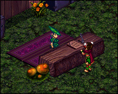

Nestled comfortably between Tavaly Ridge and the western portion of the Nageling Bowl is the swampy Aman Jungle, home of rugged Amanites.  Several Deochs passed while Aislings were exploring the Water Dungeon and Lost Ruins, so there is no surprise that we only stumbled upon Aman Jungle in Deoch 94(7).

While appearing to be less advanced than the other areas, the Aman Jungle society is developed a great deal in its own right. The Amanites prosper by living on what the land has provided for them; they cook meals by stewing frog meat, help their tribe members who suffer from insomnia sleep with a simple spore remedy, and provide banking to traveling Aislings. The Aman Jungle is also the site of some of the most powerful skills and spells offered to Aislings thus far. Still, due to its geographic seclusion, the Aman Jungle society probably has not progressed much since its founding.

Unlike in other societies, the Amanites have lived harmoniously with other nations for as long as Medenian history has been recorded. Only until recently has this peace been disturbed, but only within the ranks of the Aman Jungle peoples. Several Deochs ago (the exact Deoch is unknown because this information is hearsay from the Hostile Chief), the Hostile Chief reigned as Aman Jungle's leader. When he and his friend Vortigern had a terrible argument, the Hostile Chief left Aman Jungle to created a new tribe of his own. The Hostile Chief did not have to travel a great distance from his former home; on the outskirts of Aman Jungle, he was able to acquire followers and establish a new home. The area the Hostile Chief called home was befittingly dubbed the Hostile Grounds. In the Hostile Chief's absence, Vortigern rose to power and was named the chief of Aman Jungle. Despite the two chiefs' differences, though, Aman Jungle's outlook is positive. Through some heavy investigating and persuasion, Aislings succeeded in convincing Vortigern and the Hostile Chief to apologize to one another. The chiefs soon arranged a reunion, and the bonding of the two tribes meant that Aislings may one day see the Aman peoples united once more. 

As a tribe who has not progressed much in terms of shelter or defense, the Amanites were devastated when the local flora and fauna began acting strangely in Deoch 107. Frogs began multiplying to incredible numbers and ferociously protected their watery nests from Aisling invasion. Dendrons, once shy but powerful creatures, rooted themselves in the middle of open trails where Aislings often walked. Elemus, once noble mounts for many of the Aman people, suddenly shook off their leafy saddles and ran deep into the thicket of vines. The Amanites were desperate; they recruited every Aisling they could to contain the growth of the pests and to return their precious Elemus to the town. Even Aislings that were previously viewed as too weak to join the fray were recruited. Such an explosion of Aisling activity lead to the increased exploration of the outskirts of Aman Jungle, thus leading to the discovery of the Yowien Territory.

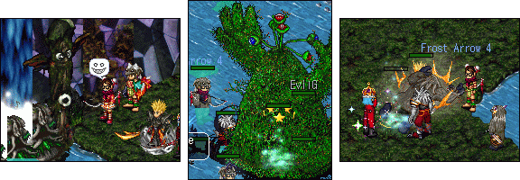

The Yowien Territory was once inhabited by the Aman peoples, but was quickly abandoned when the united tribe became two. Two smaller, separate tribes were not prepared to take on the devastation that hordes of dendrons, Yowien trees, and primate-like Yowiens left in their wake. With the reuniting of the chiefs, however, Aislings were deemed trustworthy enough to begin exploring this area in Deoch 107(8). Aislings were taken aback when they discovered that the Yowien people, once a part of the Aman Jungle tribe, had split off to create a tribe of their own. This tribe had seemingly adapted to the dangers of the area, though it still suffered from minor problems (such as relationship scuffles and losing their property due to the multitude of creatures nearby).

Today, Aislings are returning the Yowien people their lost possessions and slaying any offending creatures; they do so happily because the Yowiens offer some of the best equipment that has been discovered thus far.

Now that we have studied the wonders of Medenia's mundane civilizations, we will move onto the notes I gathered for less populated locales.

---

## Lost in Time: Relics of the Past

Now that we have taken a look at the towns populated by mundanes, it is only befitting that we pay respects to the areas on the Medenian map that do not have a great deal of mundane activity. As one may guess, these places are not considered hospitable for daily mundane life for one reason or another - but the mainly because the inhabitants within are much too dangerous.

### Andor


Thanks to a great deal of research by Historian ObiWan(9), we know that Andor was originally a hive comprised solely of underground tunnels in which the ants lived. At this time, the ant society was segregated into several tribes lead by the fittest and most powerful ants. This primitive behavior succeeded in sustaining the ant race for a great amount of time. Eventually, however, a new form of life found his way into the tunnels. Referred to as simply as "the man with the dark light," it is not clear from ant folklore whether this form of life was a mundane or otherwise. The man with the dark light exposed the ants and their offspring to the Conix, thus making the insects more intelligent and physically gifted, and soon disappeared from Andor history afterwards.

While the ants suffered unwelcomed side effects from ingesting the Conix (such as the corruption of their larvae), their newly found intelligence meant that their way of life quickly changed. The ant tribes joined into a single unit and appointed the Andor Queen as leader. Then the ants set their goal: to dig into the very earth that surrounded them, in order to reach the world above the ground and learn why their larvae suffered. It is not clear how long the ants were digging, but Aislingkind discovered that the colony had breached the surface of the Noam Plains in Deoch 42(10).

The ants, fearful of invasion, attacked Aislings on sight and continue to do so today. Despite the ants' violence, Aislings were not deterred; they continued exploring the hive and over 150 large chambers were discovered. Along the way, Aislings acquired many items crafted by the ants, such as earrings and armors that were considered quite powerful before the discovery of the Water Dungeon and Lost Ruins. Fueled by the urge to gain even more power, Aislings slayed the first Andor Queen and King ants upon their arrival to the bottom most cavern. Luckily, the Andor society continues to thrive because there is no shortage of ants able to replace the deceased Queen and King. 

With the establishment of the Hwarone military, the Hwaronian mundanes also decided to join in the desecration of the hive once it was discovered that Aislings were finding such treasures within. However, due to the fact that the Hwaronians have little use for any Andorian treasures Aislings have presented them with so far, I speculate that the mundanes may be searching for fragments of the Conix. Perhaps we should pray that the Conix fragments are never discovered...or in the event that they are found, that the Hwaronians learn from history and destroy them.

### Desert Dunes

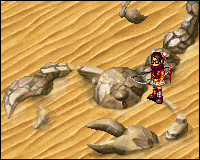

Aislings, ever excited to explore and discover, took only a few sparse Moons after the discovery of Andor to find themselves in the Desert Dunes (that is, the two locations were discovered in the same Deoch)(11). The location was probably considered one of the most dangerous locations of its time, considering its discovery resulted in many Aisling deaths; not only were Aislings forced to deal with the highly aggressive desert monsters, but they also had to contend with the sweltering desert heat that drained them of their life as time passed.

With the establishment of improved caravans soon after the discovery of Hwarone, Aislings no longer needed to brave the wild creatures or the scorching heat except to collect ginseng from cacti. That meant that the Desert Dunes returned to how it had been found: a deserted wasteland. Interestingly enough, however, are the landmarks that prove that a civilization once flourished in these barren lands. Dotting the expanse are gigantic scorpion statues carved from a white stone that does not appear to have originated in the Dunes. The same white stone also composes the structure of a giant pyramid found directly in the middle of the area. Upon inspection of the sands and the pyramid, no evidence was found that any intelligent life had ever existed except for five statues erected in the visage of Aislings. These statues still stand at the heart of the pyramid's maze. Intrigued, I sought out the Hwaronian mundanes during the ending Sun of Deoch 105.


Unfortunately, every Hwaronian was stumped when bombarded with questions about the pyramid. Exasperated, I slouched against a cherry blossom tree in the Blossom Garden. Just as I began drifting into a comfortable sleep, I heard a soft rustling and bolted upright. I turned my head and was almost not able to contain my gasp when I saw where the sound had originated: there, against the backdrop of the beautiful blossoms, stood a fiery-haired grimlock. The creature came only two steps closer and reached toward me with its pointed fingers. It turned its outreached hand over, slowly, as if it was very concerned that I see what it was holding. Soon, the grimlock carefully placed the contents of its palm onto the dirt, turned, and scampered into the safety of the forest. I burst to my feet and scrambled for the item: a yellowed piece of parchment, folded many times into a small square.

 I unfolded the square to reveal a page of symbols - presumably the Veltain grimlocks' written language - with scribbled translations aside them. The following is what I managed to make out:

>"lads once plenful water so pure
until he arrivd with powr great
dark flue into food
into hom , into we
now hom gone
we gone , we chang"

After reading what I could, I felt sick to my stomach. Why did the worker grimlock have the note? Who had written the message, and who tried to translate the grimlock language to Aisling tongue? Was it possible that the Desert Dunes was once the site of more than just rocks and sand? Had the man with the dark light also invaded these peoples' home, thus leading them to their destruction? Only more research will tell, though the positioning of the sand whirlpools indicates that there may be some truth involved in all this - don't rivers also have a tendency to wind?

### Veltain Mines

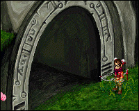

While Hwaronian mundanes attempted to harvest the Mines' treasures Deochs before Aislings ventured into the Alsaids region, they were met with little success. Aislings were invited to begin mining alongside the mundanes in Deoch 57(12). When Aislings first visited the Mines, they were met with heavy resistance, as well. The Veltain grimlocks launched a heavy assault against the invaders, ensuring that their exploration was slowed. However, once Aislings began to thin the grimlocks' unruly numbers, complete scouring of the tunnels was afoot.

Aislings soon found that the Veltain Mines were comprised of four main areas. First, of course, Aislings found the gigantic doorway leading into the foyer; the foyer appeared to have been chiseled directly from the stone at the foot of the Alsaids Volcano. Attached to this foyer were three smaller, more compact tunnels in which the Veltain grimlocks worked and lived. Due to the magical barriers over the second and third doorways, those tunnels were not readily available for exploration, so Aislings poured into the first tunnel to study the grimlock society. Due to the grimlocks' aggression, it was difficult to determine when or where the grimlocks had originated or if they wished to form partnerships. As a result, Aislings simply plowed through the grimlock forces, taking their possessions and raiding the Mines of their ore.

Eventually, Aislings reached the end of the first tunnel and dropped through a hole into the chamber below. The tunnel had truly ended, as the chamber was only a single room; this was when Aislings were forced to fight Gan, the "shovel boy." Having his chamber invaded, Gan begrudgingly attacked Aislings, snarling through warped teeth and swinging his weapon in grimlock style. Aislings, seeing that Gan was quite obviously a mundane child, tried their best to repel Gan's attacks and speak to him. However, the boy did not seem to understand their tongue. Furthermore, his dirty skin and beady eyes signaled that the boy may had spent most of his life in the tunnels. Perhaps the mundane boy was found and was being raised by the grimlocks... so Aislings did not kill Gan, but defended themselves; this lead to Gan's weakening. With the last of his strength, Gan teleported Aislings back to the Veltain Mines foyer, where it was discovered that the barrier to the second tunnel had been weakened. It was determined at that moment that Gan was undoubtedly attempting to protect the tunnels.

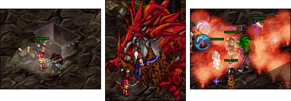

Inside the second tunnel, a new set of grimlocks were discovered - their stark purple hair signaled that they were an entire new species. The same cycle in which Aislings explored the tunnels, exterminated the grimlocks, and found a new chamber was repeated. However, this time, Aislings found Morg. It is also not clear where Morg originated, though Aislings predicted that the creature erupted from beneath the very earth to protect the mines. Its fiery breath and rock-encased body may be evidence to prove this theory true. When Morg was finally defeated, the last tunnel was revealed - along with even more new species of grimlocks and the Veltain Queen. The Queen grimlock proved to be a fearsome adversary as she used her grimlock magic to summon fiery puffs of steam from the ground. Aislings have yet to fully defeat her; when she becomes weak, Aislings are sent back to the Mines foyer and the process begins anew.

Aislings continue their raids of the Veltain Mines today, constantly in search of Veltain Ores. It is uncertain whether the Mines will someday be picked clean, or whether the grimlock species will be defeated completely...but hopefully Aislings will be able to reconcile their differences and make peace with the grimlocks before the creatures are exterminated.

### Water Dungeon

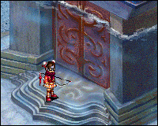

The Noam mundanes were whispering about the Water Dungeon long before Aislings discovered the temple in Deoch 69(13). The mundanes do not currently recollect how long ago the temple was erected,  but they do share how they believe the Water Spirit came to be.

The common belief is that a young husband and wife from many generations before today's mundanes were unable to conceive a child. The couple established their home closely to the Earth Spirit and prayed fervently every day, hoping that the spirit's good graces would bestow them the child they longed for so greatly. After many Deochs of reverence, the Earth Spirit indeed granted the couple with their highly sought after gift. However, the child was not born by normal means; it is said that the baby girl was found nestled in a basket woven from the very roots of trees found in the Noam Plains. The child's gossamer hair is said to have flowed longer than any infant's and spilled over the rim of her basket, shimmering in the sunlight that beamed down upon her.

The couple and their child lived happily for several Deochs before it was noticed that the child did not grow as rapidly as normal mundanes did. In fact, despite the fact that her parents had grown gray and wrinkled, the child had barely learned to walk. A few Deochs later, the child saw the death of the her beloved mother. Some Deochs after that, her father also passed. By this time, it is said that the girl had the visage of a very young girl but the intelligence of a mundane of many Deochs. Stricken by the loss of her parents, the girl wept solemnly against the cool stone of the Earth Spirit shrine at nighttime. The Earth Spirit, being a kind entity, is said to have illuminated the night sky with humming energy and spoken to the girl. The Earth Spirit took pity on her and explained that she had been created for more than the purpose of bringing the mundanes happiness; she had been born to save an entire race.

The girl despaired; she asked the Earth Spirit why they would allow her to learn of love for the people and creatures around her if she were only meant to serve a higher purpose. It is said that the Earth Spirit had only one more profound statement as they enveloped the girl with their energy, lifting her from the rich soil of the Noam Plains: "because we wanted you to know the goodness that lies in the heart of all of our creations." With that, the girl was taken away in a ball of energy and carried southwest, never to be seen in Noam again. The Noam inhabitants cannot recall how much time has passed since that fateful night.


After fully exploring Hwarone and the Veltain Mines, Aislings moved their journey into the sea. Roughly twelve Deochs of sailing and fishing later, the submerged Water Dungeon was discovered. Aislings equipped their Breath Rings and dove into the crystalline waters, parting the golden sand and revealing the entranceway to the abandoned temple. The tentative explorers were awestruck when they passed through that magical barrier and removed their rings; inside, intricate fountains gushed into sparkling pools. Smooth, stone pillars with magically bobbing heads marked the entranceway, and finally, the Water Spirit was discovered.

There is evidence to suggest the Water Spirit that Aislings are familiar with is the girl of Noam legends. For example, the Water Spirit has the visage of a young girl, despite the fact that she is engulfed in powerful energies that keep her suspended in air. This occurrence is much different than what is found with the other spirits, who appear as giant fonts of pure energy. Furthermore, the Water Spirit speaks to Aislings while being aware that individual Aislings refer to themselves as "I." While the spirit begins to refer to herself as "we," as the other spirits do, she quickly corrects herself. Perhaps the passage of time with her spirit powers has ensured that she is losing touch with the mind that once was considered mundane.

Further curiosities are plentiful. From speaking with the Water Spirit, Aislings quickly discovered that it was the spirits (presumably the Earth and Water Spirits) who erected the Water Dungeon. The Water Spirit continues to explain that the Dungeon was erected to imprison all of the most evil creatures from the sea; perhaps the spirits had foreseen that Aislings would be endangered by these creatures while exploring Medenia's seas. As if this fact had not been surprising enough, the Water Spirit also mentioned that she has a twin sister who sacrificed herself to trap a Sea Elemental Creant deep within the Dungeon. Aislings currently quest to free the Water Spirit's sister from the clutches of the Sea Elemental Creant, but so far, have been unsuccessful at doing so. The Creant is becoming weaker with every assault, however, so perhaps one day Aislingkind shall see the sisters reunited once more.


Before we move on, it may be necessary to mention that the creatures locked away in the Water Dungeon act strangely. There is a distinct hierarchy in which subordinates follow the orders from higher ranking creatures, and so forth. The Sea Elemental Creant, who acts as a general of sorts, rallies the lower ranks. Additionally, Aislings have been known to hear the creatures murmur curious sections of phrases; "for the Eight-Legged Prince," "lost at sea," and "distant shore" are the most notable. Was something valuable taken from these creatures? Did the struggle to keep the item of worth corrupt them? Perhaps Aislings will discover the answer these questions with more research.

### Lost Ruins


After the discovery of the Water Dungeon, Aislings spent a great deal of time skimming the coasts of the Medenian continent for more underwater treasures. However, they were distracted when their ships began running aground a few clicks west of the Water temple. Eventually, Aislings banded together to explore the bundle of small islands here, and thus the Lost Ruins were discovered in Deoch 83(14).

The first explorers ventured inland and first discovered a camp where only three mundanes lived. The mundanes were strange from what Aislings had experienced previously, as the mundanes did not hail from any particular nation or social group; there was an old man who seemed highly interested in the ruins, and a lorekeeper who sought information about rare fauna that may have been inhabiting the area. There was also a cow farmer, who had already established a small herd on the outskirts of the area and was readily available to recruit Aislings to protect his bovine. Upon talking to all of these mundanes, Aislings quickly learned that something was amiss on the island.

Soon, Aislings fought their way through the local band of assassins, vanquished oversized versions of of creatures they had seen before, and recorded that there were three separate ruins sites on the island. There were two underground paths with stone tablets that told the history of the ruins, as well. Aislings shared this information with old man Nairn, and with a small amount of additional research, found that the Lost Ruins were once a site of worship. Nairn also helped Aislings surmise that the giant creatures that protected the ruins were not indigenous to the area; they had been summoned by the ruins to protect the area's hidden secrets.  Aislings were not deterred. With the help of Nairn's magic spell, they set off to the deepest set of ruins and performed an ancient ritual that had been found amongst the stone tablets found prior. Inside the portal that sucked them in, Aislings fought the Dung Lord, which did its best to prevent Aislings from reaching the innermost sanctum. But the Dung Lord, a fearsome creature of times long past, fell quickly to the powerful Aislings. The explorers reached the final unexplored area, the true "Lost Ruins," and blanched when they saw their final foe: Law.

The Aislings that found Law were frightened for their lives because the mundane's reputation preceded him; he had first appeared on Oren Island around Deoch 30 and spent time as the Burgess there(15). Around that time, the mundane began to act strangely and publicly displayed his disgust for Aislings. Law continued his rampage by murdering Cedric, the former mundane Burgess of Mileth(16,17). Appalled by the Oren mundane's actions, Aislings went to war against him and his army of Dark Aislings in Deoch 34(18). When he and his Dark Aislings were defeated, Law escaped to Medenia, where he was never seen again until Aislings defeated the Dung Lord. When Aislings arrived in the Lost Ruins, Law gloated that they would soon join Cedric in the afterlife - a comment that he must have regretted as Aislings cut him down.

Law fell for good in Deoch 83, but Aislings were not finished visiting the Lost Ruins. They still return to the ruins to gather precious equipment, such as Fire Serpent Boots and Monarch Rings. Aislings are still investigating the appearance of giant creatures in the ruins, as well; perhaps further research in the matter will solve how the demons in Asilon were able to venture into our realm.

This concludes the compiling and research I have done over Medenian history. I will end with just a few statements on Medenia's possible future.

---

## Speculations of Medenia's Future

### The Future?

With what we have seen from Medenia's history so far, we may find ourselves at a standstill when determining the continent's future; after all, there is so much negativity at every turn. The early civilization of mundanes is thought to have had their grand city destroyed by their corruption. The towns are being invaded by demons, and the different races inhabiting the continent are warring between themselves. The Water Spirit struggles to keep the ancient evils of the sea locked away within her dungeon. Amongst all these happenings, Aislings contribute by mining areas clean of their resources and killing their inhabitants, ultimately earning themselves hatred from other races. Will these events cause another great war? Will the societies that are currently established also fold in upon themselves and take part of the Aisling race with them?

I am faithful that every form of life may once again see harmony in Medenia. However, such a goal will not be achieved without a great deal of toil. For the Medenian mundanes, this may mean giving up the search for powers greater than they have already discovered. For other species, achieving peace may mean forming alliances with those they currently wage war against. I am confident that Aislings may be the top contributors to Medenia's future - after all, it is the Aisling race that was bestowed the gift of the Spark, and it is Aislings who continue to discover new peoples, innovation, and ways of thinking. It is ultimately our decision on how to use these gifts.

While I have recorded a great deal of information in the previous pages, I feel our work as Historians is nowhere near complete in Medenia; more and more questions arise every day as Aislingkind treks the continent. I hope that my research inspires Nobles and other curious Aislings to use their intellectual gifts and find the answers to these questions. Perhaps the information we find will someday be the key to the continent's salvation...or its doom.

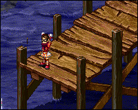

---

## Timeline

Because the Table of Contents does not display the contents of my research chronologically, I have constructed this timeline to aid readers on the true order of events. Considering much of Temuairan and Medenian history have occurred simultaneously, I have adopted a style like that compiled from Seanchas Temuair and Speculations on Aosda (please see item 19 on the Credits and References page). I feel it is best that we learn when Medenia's events occurred from a point of view we already understand well.

### First through Fourth Aeons

There is no recorded Medenian history from the First Aeon to the Fourth Aeon (speculated to be Grinneal 1 - Grinneal 22000).

### Fifth Aeon (Grinneal 26900)

The Elemental Spirits bless Temuair with the elements. Around the same time, The Elemental Spirits leave Temuair in order to enrich the continent of Medenia.


### Sixth and Seventh Aeons (Grinneal 32092 - Danaan 1584)

The Goltakians, the first mundane race, appears in the early Sixth Aeon. The Goltakians spend the remainder of this Aeon and much of the next in their "golden city" - erecting places of worship, hunting, and reproducing. The mundane city is later destroyed and the Goltakians are scattered.

### Eighth and Ninth Aeons (Danaan 1703 - Danaan 2871)

During the Eighth Aeon, the Goltakians become enlightened and begin to travel great distances. Later, during the Ninth Aeon, Goltakians forsake their nomadic roots and begin to settle in towns. Demons begin appearing in Medenian towns.


### Tenth Aeon (Danaan 2903 - present)

- ___Deoch 35___: Aislings break the Seal of Medenia and appear on the continent for the first time. Noam and Asilon are the first towns to be discovered.
- ___Deoch 42___: Andor rises from beneath the earth and Aislings begin to wage war against the ants. Moons later, the Desert Dunes are discovered.
- ___Deoch 50___: Aislings cross the Desert Dunes and discover Hwarone. Guaili, the magistrate and owner of the Cursed Home, attacks Aislings and falls.
- ___Deoch 57___: Veltain Mines is discovered. 
- ___Deoch 61___: Hwarone establishes its parliament and military. Aislings are invited to join the ranks; war between Hwarone, the Veltain grimlocks, and the Andor ants begins.
- ___Deoch 69___: The Water Dungeon is discovered. The weakening of the Sea Elemental Creant begins.
- ___Deoch 83___: The Lost Ruins are discovered. Aislings discover the whereabouts of Law and slay him.
- ___Deoch 94___: Aman Jungle is discovered. Aislings strive to make peace between the two conflicted tribes and begin mining precious crystals from the Crystal Caves.
- ___Deoch 105___: A a note scribbled on an ancient slip of parchment is discovered. The note may allude to the downfall of the Desert Dunes society.
- ___Deoch 107___: Yowien Territory is discovered.

---
## Credits

I extend a huge thank you to the incredibly helpful Carrots in Cult de Carrot; their assistance in digging up lost documents and finishing quests is very much appreciated!

I would also like to express my thanks to all of the Mileth College Nobles who assisted me in the proofreading and editing of this entry (namely, Etna Demonia and MaeSen Lo'tihah).

Credit is also due to myself, of course! While some of the described sections in this work are compiled from the research of others, much of my research is original. The data covering the origins of Medenia, the Elemental Spirits, the branching out of mundanes, all of the mundane towns, Veltain Mines, Water Dungeon, Lost Ruins, and the Yowien Territory have not been compiled before this time. Please take the time to enjoy the information and do some research for yourself - you may be surprised at what you find!

References (In Order of Appearance)
(Due to the floating nature of the mundane-maintained references, they may or may not appear on the pages described; the pages have been listed to aide the Aislings needing to check my integrity at the immediate time this work is entered in the Mileth College).


1. Aeife, "Grinneal - Beginning"  
   Adoption of the time in which the Elemental Spirits were thought to have graced the continents with their power.  

2. Arachne, "Medenia: Genesis" - Pinned on the Mileth Library board, posts 168-172.  
   Arachne's research covering the origins of the Medenian continent and possibly the first civilization of mundanes is a precious gem and is paraphrased in my work.

3. Mundanes, "The Seal to Medenia has been broken!!" Mundane news, page 47 ` 04.07.03 on the Dark Ages website `.  
   The mundane record of the breaking of the Seal.

4. Katrionah, "Decent into Darkness: The Eigth Aeon of Temuair"  
   The recorded time in which the darkness element was discovered and creatures were thought to begin shifting realms.

5. Mundanes, "New Management" Mundane news, page 34 ` 04.01.05 on the Dark Ages website `.  
   The mundane record of the discovery of Hwarone.

6. Mundanes, "Hwarone City Parliament" Mundane news, page 28 ` 08.01.06 on the Dark Ages website `.  
   The mundane record of the establishment of Hwarone government.

7. Mundanes, "Issue 7.29" Mundane news, page 7 ` 08.19.10 on the Dark Ages website `.  
   The mundane record of the discovery of Aman Jungle.

8. Mundanes, "Yowien Territory Discovered" Mundane news, page 1 ` 05.04.12 on the Dark Ages website `.  
   The mundane record of the discovery of the Yowien Territory.

9. ObiWan, "The Rise of Andor"  
   My research revolving around Andor summarizes a great deal of ObiWan's work.

10. Mundanes, "Medenian Discoveries, Deoch 42" Mundane news, page 40 ` 04.07.04 on the Dark Ages website `.  
   The mundane record of the discovery of Andor.

11. Mundanes, "Desert Dunes" Mundane news, page 42 ` 08.12.04 on the Dark Ages website `.  
   The mundane record of the discovery of Desert Dunes.

12. Mundanes, "Veltain Mines" Mundane news, page 30 ` 01.11.06 on the Dark Ages website `.  
   The mundane record of the discovery of the Veltain Mines.

13. Mundanes, "Mundane Updates" Mundane news, page 23 ` 08.14.07 on the Dark Ages website `.  
   The mundane record of the discovery of the Water Dungeon.

14. Mundanes, "Mundane Updates" Mundane news, page 12 ` 05.04.09 on the Dark Ages website `.  
   The mundane record of the discovery of the Lost Ruins.

15. Mundanes, "Law's Intro" Mundane news, page 54 ` 09.18.02 on the Dark Ages website `.

16. Written statements `information gathered from the 'Events of Temuair' board, posts 403 to 408`: Eduardo, Law

17. Mundanes, "Death of Cedric" Mundane news, page 50 `12.22.02 on the Dark Ages website`.

18. Mundanes, "Law's Invasion" Mundane news, page 58 `02.25.03 on the Dark Ages website`.

19. Mundane Library, "Temuair Timeline (compiled from Speculations on Aosda and Seanchas Temuair)"  
   Credit is due to the mundanes for composing this timeline. Though it details Temuairan history, I have used similar format and dates in order to better outline Medenian history.

20. Verbal statements ` in-game information gathered from NPCs`: Earth Spirit, Cruvano, Jelus, Kabok, Morwin, Mephit, Cheung, Vortigern, Hostile Chief, Water Spirit, and Nairn.

***

```
*Librarian Notes*

This entry has been edited to conform to Library formatting.
The original can be found at http://historyofmedenia.weebly.com/index.html .
```

