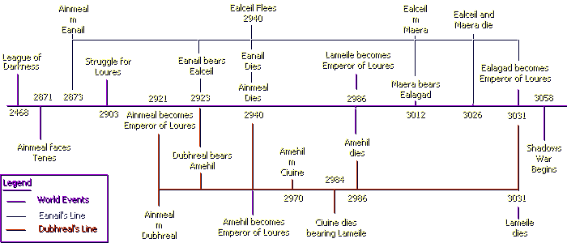
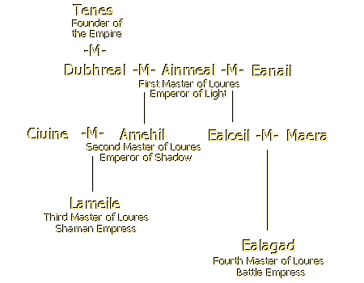

# The Blood of the Forgotten Empire: The Journals of the Ministers Beanlar

_Compiled by Chloe in_ ___Dark Ages___

> _A Note on Naming: All names in this document are the Adult names. Mundane tradition says that upon a child’s twelfth year he is given a name to signify both his status and community opinion of him. As these documents were all written from a political standpoint, the private or childhood names are never mentioned._

_Historians and Bards have long disagreed on how the empire fell apart. The debate is aided by the fact that most historical documents were rendered useless to us in the Shadows War. Often, we don’t even have the names of the rulers! Yet it was that key century that defined our civilization, where the history of mundanes lies... and all Aislings were once mundane._

_This split interested me, as an observer of a world growing increasingly political, so I decided to seek out the knowledge I knew was buried in King Bruce’s library. The vaults of Loures have been barely touched... partially due to the guards in the way. Luckily, my charm and special brandy (Undine vintage mixed with some roots whose virtues I keep to myself) enabled me to loosen the guards’ watchfulness and get the time I needed. The documents I found there were incredible... especially a journal from a political family whose influence went back centuries, the Beanlar. Each Emperor kept a member of this family as a key Minister, and each Minister kept a journal. It is these journals that I found, and although the end of it is garbled in a mad script I could not decipher, much of the missing knowledge was here. It details not only the rise and consolidation of power, but also the family politics that were key to the power of darkness within our kingdom. It culminates in the reign of Empress Ealagad, whose name we know in legends of political power to this day. In the following document I have tried to outline, as briefly as possible, the basics of politics during the beginning of the Tenth Aeon of Temuair. May it serve as a warning to us all..._

Timeline | Family Tree
---------|-------------
|

### The League of Darkness
Lord Tenes, whose name means firm grip, was renowned as a man of unstoppable ambition. This reputation was greatly enhanced and encouraged by his wife, Lady Dubhreal, or Dark Star. When they were married is unclear, as is her origin. There are those who say she was half dubhaim, and this is what the Beanlar believe, as her actions justified this belief. Their power had been secure since 2468, when they signed the Pact of Anaman and gave the inhuman a leading hand in mundane politics. It is said that Dubhreal had no small part in the convincing of the other lords to sign this pact, for she saw the possibilities for evil it entailed. The League of Darkness comprised all ten kingdoms: Mileth, Rucesion, Loures, Suomi, Gear Inbhir, Niara, Massai, Feasgar, Glaic, and the dark Isle of Man. Although there was no emperor in name, Tenes wielded the influence of one.

### The Rise of Ainmeal
Tenes’ power was first tested by Lord Ainmeal, an unknown noble, in 2871. Ainmeal, named for the noblest of birds, the Swan, had raised a small army and was successfully attacking forts on Mileth’s southern border. The fighting was easy, as loyalty to Tenes was through fear alone. Tenes would have allowed some raiding, if reports of Ainmeal’s charisma and strange charisma had not made him wary. He dispatched his finest troops, therefore, and Ainmeal barely escaped with his life.

Yet the damage was done. A significant challenge was afoot, and Tenes and Dubhreal began to prepare for war. Ainmeal’s bravery caught the attention of the Fae, who realized that one had emerged who may be able to counter the growing darkness of the League’s reign. They therefore began helping him to prepare for the decades of battle awaiting him. The young lord’s confidence and grace in battle drew many to him, including several of the Fae. Eanail, or Bird’s Breath, a Fae renowned for her wisdom and kindness, fell in love with Ainmeal. Their love match was celebrated in 2873. As part of the ceremony, Eanail renounced her immortality so that she would die the moment her husband did not return from Chadul’s kingdom.

Thirty years passed, in which both Tenes and Ainmeal prepared for a war to decide the fate of the empire, and more importantly, whether dark or light would hold sway. Minor battles were fought, but the bulk of the Lords’ energies were elsewhere. Tenes worked on preparing elemental attacks, while Ainmeal negotiated secretly with Tenes’ allies to divide them against each other.

### Struggle for Loures
In 2903, Ainmeal struck. He launched an attack directly on the impregnable castle at Loures, while Tenes rained magic down on his enemy. Yet Ainmeal was protected by Danaan, and the attacks had little effect on his army, for morale was high and the Fae’s spells of protection strong. While Ainmeal diverted Tenes, his spies in each allies’ camp began the far more deadly work of destroying loyalties. The entire empire erupted in chaos as the political system was overturned and chaos reigned. Each kingdom made due as it could against internal and external invasions, but Tenes and Ainmeal seemed balanced until 2919 when Suomi, carrying its material power as well as the silent power of Undine, came to Ainmeal’s side. The war ended two years later when Ainmeal killed Tenes on the battlefield and was crowned Emperor of Loures. 

### Consolidation of Power
Emperor Ainmeal now began consolidating his power, for he knew that without clear leadership the Empire was doomed. According to Imperial tradition he was required to marry his predecessor’s widow, Dubhreal, to validate his claim on the throne. There was a complication, however, as Ainmeal was not only married to but in love with Eanail, his Fae wife. To enable the transition of power to continue, a compromise was reached in which Ainmeal was allowed to have two wives: one "political" or "church" wedding before the gods (Dubhreal) and his Fae love match to Eanail. Dubhreal and Ainmeal’s marriage was celebrated the same year he became Emperor, 2921.

Great political damage had been caused by the decades of war. Temuair was no longer unified, but split into 6 separate kingdoms and Ainmeal’s empire. Ainmeal controlled Mileth, Rucesion, Suomi, and Loures. The city of Undine remained a free agent, rejecting darkness and rule alike. The remains of the League of Darkness split into the separate kingdoms of Massai, Feasgar, and Glaic in the Far East, while the nearby Isle of Man withdrew into a silent brooding on its own evil. The Southern ancient kingdoms of Gear Inbhir and Niara made it clear they wanted nothing more to do with the unrest of the North. Ainmeal was content to strengthen his position and not molest his neighbors, and was dubbed the Emperor of Light, for Danaan’s favor shone on him.

### The Next Generation
By a strange coincidence never fully explained, both Dubhreal and Eanail conceived sons in 2923. The Empire celebrated its good fortune in having not only one, but two, heirs. Dubhreal’s son was first in line, as her marriage with Ainmeal was the one sanctioned by the Gods. Eanail was content, for she had Ainmeal’s love and he spent almost all his time with her, leaving Dubhreal complete control over raising their son.

The two boys were raised apart and never saw one another. When both reached their twelfth year, they were given their adult names by the Council. Dubhreal’s nature was becoming apparent through her son, who was sullen, power-mad, withdrawn, and darkly manipulative. He was therefore named Amehil, or "The Other’s Time." Eanail’s son, however, seemed blessed by Fae, man, and the gods themselves. His nature was open and intelligent, making him beloved by his parents as well as the Council. They named him Ealceil, or "Hidden Swan" as he was never expected to take power.

>_Note: Lord Beanlar here interjects several colorful expressions regarding church vs. love marriages._

After the naming, Dubhreal’s molding of her son became even more secretive while the aging Ainmeal was never seen in her presence, spending all his time with Eanail or improving his beloved Empire.

### The Second Emperor
In Danaan 2940, Emperor Ainmeal died. His beloved wife, as prophesized at their wedding, immediately followed him to Chadul’s realm. What then occurred was something not seen in Temuair for well over six centuries: the peaceful transfer of power. It was not without unpleasantness, however, for upon Amehil’s coronation the environment of Loures became deadly for Ealceil, who had been the target of Dubhreal’s hatred since birth. The now orphaned, but still beloved, Prince was forced to flee every town he entered or face certain death. At the age of 17, with his half-brother now Emperor, Ealceil took refuge with the Fae and was not seen by mundanes for decades.

Amehil, although nominally in control, was truly his mother’s greatest tool. She was the power behind all decrees and her name became almost more feared then that of Sgrios. She began a swift consolidation of power, clearing all of Ainmeal’s council and pressing hard on the subjected kingdoms for tribute. Yet the Empire remained loyal to Emperor Amehil through the memory of his father, something Dubhreal used to great advantage. The influence of darkness could not be hidden, however, and so Amehil became known as the Emperor of Shadow. During this time Imperial politics became a deadly game as its cities began to slowly grow in influence.

Dubhreal began to tire of being the hidden influence behind the throne, craving greater power. In 2970 she arranged for her son to marry a young courtier, Ciuine, whose very name meant "quiet." Dubhreal wanted an heir, not an interfering daughter-in-law. As the woman was beautiful, Amehil agreed, and so married. By all accounts, the ensuing years were hard on Ciuine’s spirit, for Loures had become a dark and fearful place. Those years were also not pleasant for Dubhreal, who was frustrated by the fact that the Empress seemed unable to bear children. Finally, in 2983, the news was announced that at the age of 66, Amehil would have an heir by his 29-year-old wife. The next year Ciuine did indeed bear a daughter, but died a few days later.

Dubhreal was both annoyed and pleased with this result. She was annoyed because both the kingdom and, surprisingly, her son were plunged into mourning for the quiet Empress. This worked to her advantage, however, for she was again given complete control over a child’s upbringing, which pleased her. Finally, in what she saw as a marvelous stroke of luck, her son died two years later leaving her as Regent and protector of his daughter—a virtual Empress. Loures law stated that only an Emperor could rule, but she found a loophole. She proclaimed that this did not imply "male," rather, only the title. Later confusion in the histories results from this exploitation.

### The Third Emperor
At the age of two, Amehil’s daughter was crowned Emperor. As such, she had to be given her adult name. She was christened Lameile, or "The Hand of the Other," for it was now obvious to all not only that Dubhreal had been the true power behind Loures for well over 550 years, but that she was in an unholy alliance with the darker powers.

Dubhreal made her power felt that same year, 2986, by ordering a brutal conquest of the free-spirited city of Undine. Almost all inhabitants were slaughtered as she gloried in her impregnable position. Five years later, in 2991, Undine rebelled with such force and speed that a huge loss was dealt to Loures’ troops. Decades of battles began, in which nothing was sure but the city’s determination to keep fighting.

Lameile was raised in complete seclusion as her mother’s handmaiden. Her name was not even widely known: all considered Dubhreal the Empress. As she grew, Lameile seemed to agree with this judgement, acting according to her mother’s whims without a word, causing the belief to spread that she was possessed. She was thus dubbed the Shaman Empress.

The kingdom became restive, as cities either fought against the terror of Dubhreal or capitulated in fear. Some of the braver citizens began exploring the religion of the old gods, which had been long-since forgotten, having seemingly abandoned Temuair centuries ago. Little progress was made, however, as the Empress’ punishments for such worship were severe. There seemed no end to the darkness.

>_Note: The next sections, until the ascendancy of Ealagad, are in another hand in this journal, that of a female. Her sources seem to be accurate, as she includes many letters substantiating the stories, but the change is peculiar. As the Beanlar clan seems to be meticulous as to accuracy (all their sources match) this can also be assumed to be correct. Who the writer is, I have no idea, but it was obviously someone close enough to Ealagad to find deeply personal stories._

### Ealceil Awakes
Throughout this time, Ealceil remained with his Fae kin. At first, he made attempts to fight against the evil his half-brother was perpetrating, but after vicious reprisals he saw how Dubhreal’s power was growing and decided to wait for a better time. What he did not realize is that time passes slower in the Fae lands then it does elsewhere; twenty years seemed as one to Ealceil. As the Fae wished no harm to come to their hidden swan in the darkening world, they made no effort to correct this assumption.

After what he judged to be about three years, Ealceil decided to check on the status of Temuair. As the Fae wished to minimize the shock, they first took him to a wedding. Mundanes of the old school still kept to the tradition of Fae weddings, for they were seen as love matches not political posturing. As Ealceil wandered among the guests, listening to their conversations, he was dismayed. The spread of darkness in the ensuing 72 years was too much for him to contemplate, and he could barely understand that his half-niece was now Empress and a puppet to Dubhreal, the bane of his youth. It was with difficulty that he began paying attention to the ceremony, which had now begun.

The priestess leading the ceremony was named Maera, a young lady tutored in the old ways and beloved by the Fae, which accounted for their large presence. Ealceil watched her perform the timeless ritual and speak with eloquence of the old gods, and felt love bloom in his heart. After the ceremony he approached her, and thence began a swift courtship, culminating in their wedding early the next year (3012) and Ealceil’s return to the mundane world. Nine months later their daughter, Ealagad, was born.

### The Swan Travels
The Fae took leave of Ealceil mournfully, promising to watch over his daughter, and warning him of the danger to his family if his identity was ever discovered. Ealceil and Maera took this seriously, and so decided to travel constantly to avoid this danger. Maera taught both her husband and her child all she knew of the old gods, and the family began searching for the long-hidden shrines to build faith in the gods again. They saw this as their only hope against the seemingly unstoppable evil of Dubhreal: that and the fact that Lameile had yet to bear an heir.

With this fact in mind, the couple resolved to raise Ealagad as a future Empress. They showed her, over the years, the entire empire and impressed her with the necessity of trusting the gods as well as keeping one eye looking over your shoulder. Ealagad grew into a lovely, but thoughtful child, who knew how to bend people to her will. This was a great asset, as every time the family found a temple they convinced the nearby town to begin worshipping that god and beginning the restoration of the shrine.

### Sgrios
In 3026, Ealagad reached her fourteenth year and Ealceil and Maera decided it was time to show their daughter the last temple of the gods: Sgrios. The year before they had dared the wrath of Deoch, whose dark fire left scars on all of them. Not unwary of the danger, they told their daughter to wait for them on the banks of Rucesion while they crossed the dangerous bridge to the Isle of Man, whose shadowy shores were forever sheathed in shadows. They deemed the risk necessary, as they understood that light cannot exist without dark, which cannot be controlled if it is not understood.

Ealagad therefore began a weary vigil. The townspeople of Rucesion, awed by the brave, if in their minds foolish, family brought her food and blankets. Several days passed, during which Ealagad’s watchfulness was rewarded with nothing but fog and the unearthly howls of the dubhaim. That evening, however, there was movement on the far shore, and Ealagad leaped to the bridge, expecting to welcome her parents. Instead, the leering faces of the dubhaim were seen, carousing and shouting in triumph as they showed the remains of her parents to the young girl. They beckoned her across, and in her despair and weakness, she nearly responded. As her feet touched the bridge, she remembered the flashes of the Fae in the twilight, and the hope she held for the gods’ return, and her eyes brightened. She disdainfully stepped back, and swearing revenge in her heart, turned her back on the disappointed monstrosities.

### The Swan of Steel
In the ensuing days, Ealagad began to show the inhabitants of Rucesion why she was named "The Steel Swan." She mourned for her parents, but began speaking with the wise on how to bring about the return of the gods. They could offer her little help, but much hope, and she left disappointed. She cut her hair and dressed as a boy, to better travel in those dark days, and began returning to the shrines she had found before with her parents. In this she was aided by the Fae, who loved Eanail’s granddaughter.

At each shrine she used her personal charisma and hard work to begin converting the townspeople back to the worship of the old gods. She cleaned every shrine as best she could, removing the defaming marks of the dubhaim, and giving people hope. Years passed this way, and Ealagad grew in knowledge as well as in fame. Some say these efforts must have attracted the notice of the gods, for hope began to spring even in the deepest places, and in Loures, Dubhreal felt her power begin to slip.

### Flight
In 3031, at the age of nineteen, Ealagad had made considerable progress. Every shrine had been discovered, even Deoch’s, although as a dark god he was not looked on in favor by those opposed to Empress Lameile and her grandmother. Omens began to appear, heralding a change. Flocks of swans began flying over the palace of Loures. Lameile, long thought mad by the populace, was fascinated by them. The court was ablaze with tales of Ainmeal, her grandfather, a name long since banned from the palace. Dubhreal was powerless to stop the talk, although punishment was as fast and harsh as ever. Lameile in particular could not hear enough. On the very day Ealagad arrived in Loures, Lameile was seen standing on the Imperial balcony when a huge swan alighted on the railing. As the Court watched, Lameile calmly joined it, and when the swan took flight, so did their Empress. Her motive for suicide is unknown to this day; whether it be from conscience, madness, or divine will. 

Dubhreal did not take the news well. Hearing of Ealagad’s presence and heritage, she ordered Ealagad’s death, but none in the Court obeyed. Her reign was at an end. Realizing this, she fled to the perceived safety of the Isle of Man, the darkest spot in Temuair. Two days later Ealagad was crowned Empress, and three days after that, the remains of Dubhreal washed ashore at Rucesion. Apparently the dubhaim did not give her the welcome she expected.

### ___Consolidation of Power___
Ealagad quickly began reforming her empire. Using her youth, beauty, and charm to her best advantage, she created alliances with the other eight kings, re-making the alliance of Tenes to the glory of Danaan. She even ensured the rebellious city of Undine’s cooperation. Refusing to deal with the entity in control of the Isle of Man, she set the stage for the War to come. The darkness of court intrigue was replaced with an equally uncertain political structure whose aim, that of spreading the light and bringing back the old gods, was clear. Ealagad’s unorthodox and often heavy-handed methods, however, were not always so pristine.

The next 27 years before the onslaught of the Shadows War were filled with alliances, treaties, marriage proposals broken or twisted, and political purges aimed at cleansing the Court of both Dubhreal’s darkness and Ealagad’s enemies. She never married, instead using her status as an additional wedge in negotiations. In this way each kingdom fell under her influence, spreading her sphere of power to all ten kingdoms. It was even rumored that Rucesion’s barrier against the Isle of Man was due to a deal made with that shadowy entity.

>_Note: The journals at this point go into great detail regarding each alliance and its associated intrigues. Although it can make rather sensational reading, it is often gossipy and irrelevant, and so left out of this summary._

### The Shadows War
In 3058, Ealagad and her ministers judged the time was ripe to attack the dubhaim. Their plan had two purposes: to fully awake and strengthen the Temuairan gods by weakening the dubhaim. A three-pronged assault was launched against dubhaim strongholds in Piet, the Kasmanium Mines, and the Isle of Man itself. The forces of Loures encountered little resistance and were doing remarkably well until the dubhaim released their most potent weapon: Madness.

Ealagad’s troops found themselves helpless before this invisible weapon. The Empress and her Court were protected by the most powerful priests in the land, but the impact was felt. The insanity came in waves, and affected all in its invisible path... soldiers, farmers, even the beasts of the field. Cows became carnivorous, young girls acted like old men, soldiers shot flowers instead of goblins. The effects were random and unstoppable, and even when it abated, the damage done was incredible.

As the years passed, priests began to die from the strain, and none could be trained, for as soon as significant learning was completed another wave of madness washed it clean. The dubhaim grew bolder, taking entire towns and creating more deadly monstrosities each year. The Court began to suffer from madness as well. Yet Ealagad, with her iron will, would not capitulate or cease the war, and her resolve gave her people strength. Signs of the gods’ influence began to be apparent... prayers in battle were answered, strange miracles occurred. It became obvious that this was a war between the gods, with the mundane world merely caught between, plagued by the unstoppable madness. The gods seemed unable or unwilling to help.

### End of Journal

_The journals actually continue for nine more volumes, but they are in a strange script, garbled beyond recognition. The only thing I can glimpse is an occasional date... from that I gather that the intelligible parts ended about the year 3067. It can be assumed that the Court was finally overtaken by madness, and although the Beanlar Minister was trying to communicate what was happening, the plague claimed him as well. Many other legal documents exist from the War, all inscrutable—the script is not even constant, it is constantly changing in color, type, even direction. I therefore know nothing of Ealagad’s demise, how her reign came to an end, why the empire perished, or our current king’s lineage. The writer of_ Speculations on Aosda _and_ Seanchas Temuair _seems to have also hit this block, which accounts for the misunderstandings as to the identity of the rulers. Bards seem to be closer to the truth, for once... they get the sex of Lameile and Ealagad correct, at least. It seems that deep-seated legends cannot be erased even by the most powerful waves of madness._

What I find most interesting to our current time is the family politics and how darkness so craftily wove its way into the heart of Loures! Whatever drove Dubhreal and gave her such power must have survived the Shadows War, for we see around us in the new political structures the temptations of the dark. Our history is dark and twisted, filled with political power-plays that make even Aricin turn pale. Yet there is also a strong vein of resistance to the infiltrations of the forces behind the Isle of Man... Ealagad, the Beanlar family, and quiet players like Maera who through patience and persistence helped change the seemingly inevitable descent into darkness. This is the history we must repeat, and so avoid the traps of Dubhreal.

_Composed by Chloe Ta'Null_

***

```
*Librarian Notes*

This work is considered one of the greatest treasures of Temuair.

This entry has been edited to conform to Library formatting.
The original can be found at http://darkages.com/community/his/Chloe_Beanlar.html .
```
