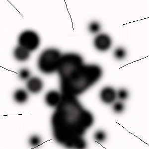
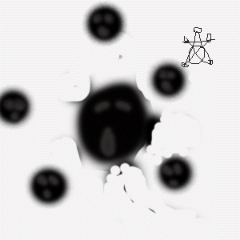
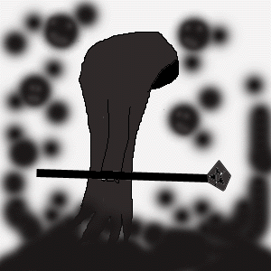

# The Diary of Teirsaes

_Compliation and comments by Deksar math-K'sull in_ ___Dark Ages___

## Introduction  
by Deksar

The origins of this diary are as unreal as the circumstances which they contain. Many moons ago, exploring the castle of the Dubhaim, I found myself in a bit of a predicament. The creatures of darkness were at my feet, and I could not go the direction of the exit. I raced through the halls of the castle, only to find myself nearing a dead end. The dark things came even closer, and I thought this was the end. As I backed into the dead end, my foot got stuck into a loose plate on the ground. A panicked to release my foot from its stone prison caused me to fall over. With the resulting force of my fall, a stone plate shattered and I fell down into a small cavern below. On closer inspection, I hadn't landed into a small cavern at all - more like a series of small tunnels. 

The creatures, thinking me dead from the fall, did not follow. I was very much alive, for I landed on a very convenient pile of hay. This hay was obviously not natural, so this sparked my curiosity. I picked up a handful of hay examined it closely, only to find it was normal hay...but some type of book lay beneath it. This book was the diary of philosopher Teirsaes. It seems he had an uncontrollable curiosity about the dubbhaimid and their habits, lifestyle, and overall existence. For over 2 Deochs he studied the dubbhaim, only to have his diary found by me over 4 Deochs later. I have complied his most noteworthy finds and experiences, censored for younger viewing. I hope this will bring insight into the mystery this diary represents.

---

## Teirsaes's Diary

* Deoch 2, 5th Moon, 18th Sun  
I have almost reached the castle of the dubhaim. I cannot wait to finally quench my thirst, rid me of these incessant longings for the truth. Laugh at me, will they? Finally, I will have proof! I have been chasing Fiosachd for too long...now, let him chase me. I will get what I deserve.

* Deoch 2, 6th Moon, 30th Sun  
The charm from that old wizard seems to be working perfectly. I am virtually invisible to the dubhaim, they just walk right by me. I have gained much information already, and it all supports my theories. I will venture deeper into the castle, for the dubhaim here are of little intelligence. I know there must be an intelligent dubhaim somewhere in here.


* Deoch 2, 7th Moon, 12th Sun  
Perfect. The stronger dubhaim are more intelligent. But they still aren't intelligent enough to see through my disguise. With my ability to blend in, I have reached places other men have only dreamed about. I saw a rare specimen of dubhaim here. About 4 feet tall, 4 feet wide. It resembles some unintelligible darkness, some type of odd floating cloud of evil. Suffice to say, it is almost formless, so I am having a difficult time explaining what it looks like. As for its function, it seems to be feeding the dubhaim energy. I don't understand how or why, as I have just seen it. More on it later, for I must get a closer look at it.

* Deoch 2, 8th Moon, 14th Sun  
It's an overseer. A vessel for evil, I know it now. It contains great deals of dark energy to be distributed between the dubhaim. However, it is very selective on which dubhaim receives this energy. The dubhaim might have to kill many an Aisling before they receive this "Dark Mist's" power. Using another charm, I have stored some of the dark energy for further study. As well, this energy has another use - with it, I am sure the dubhaim will grant me passage into their deepest and most secretive of societies. I am almost prepared for my journey into the depths of the castle. I know, this time, I WILL be revered.

* Deoch 2, 9th Moon, 20th Sun  
I am now in the depths of the castle. Using my charm, I have devised a plan to have no chance of discovery. I am a little concerned the strongest dubhaims can see through this charm, so I am starting a system of tunnels that will go to all locations both above me and serve as an easy escape route and safe dwelling. I have not recorded any dubhaim activity as of yet, as my focus is on the tunnels. With them, I can be sure to finally reach my destination - the lair of the fully sentient dubhaim.

* Deoch 2, 11th Moon, 21st Sun  
With the tunnels complete, my powers of observation have been extended beyond anyone's comprehension. I can see into the most secretive of the dubhaim's little society, and find that something MUST be ruling over them. The higher-level intelligent dubhaim seem to have rituals to a god...probably the Evil God...but...there seems to be sadness in their songs...most curious. As well, I have document five more types of dubhaim, and sketched their appearances to me. I must find who is leading the dubhaim. I am sure it is not the Evil God, for they seem more to obey out of duty then fear...



* Deoch 3  
(Note: For most of this year, Teirsaes talks a good deal about his theories of dubbhaim society, the origins of the dubbhaim, and their purpose. I will be disclosing this in another work, for it is quite long and unrelated to Teirsaes's welfare. However, if you wish to know Teirsaes's true accomplishments, you'd best read it after it is published.)

* Deoch 4, 3rd Moon, 2nd Sun  
Why isn't it working???? The charm! They are attacking in swarms, I am barely avoiding their wrath, o Gertia, I

* Deoch 4, 5th Moon, 6th Sun  
I saw it! The master! I have tried to show what he looks like, but they are after me, and they are getting closer...It's only a time before they find the tun

* Deoch 4, 9th Moon, 16th Sun  
My head! My mind! It HURTS! Make the voices STOP! Why did it do this to me? Why did it curse me? I only wished to know the truth! I know it now, and I will tell everyone, for the dubhaim are the cursed so... (rest is indecipherable nonsense)



* Unknown (There was no date for this entry)  
Mallacht! Mallacht brach! Aisling tinn, codail tinn...an codail deireadh - dubbhaim. Fulaing! Fulaing brach, an mallacht olc. Suil deisionn, "Aisling" - codail cosain, an codail brach! Deoch - codail cabhru...dubbhaim cabhru... (the rest is totally indecipherable...)

---

And that was the last entry from the diary. I presume Teirsaes is dead, or a victim of some far worse fate. However, his findings are astounding...almost unreal. Did this really happen, or is this some kind of a joke played by a priest of Sgrios? What was the "intelligent" dubhaim he talked about? He keeps mentioning that whatever "it", it is not the "Evil God"...so what could it be? I publish his diary entries so that, perhaps, someone can make sense out of this text. What tongue is the last part of the text in? I can't seem to understand...I am sure the key to whatever happened to Teirsaes is in there, but I cannot decipher it...if anyone can decipher the mystery of Teirsaes, I would be most obliged. I will soon have his notes and theories on dubbhaim complied, which may bring even more insight into the truth about what happened with philosopher Teirsaes.

Deksar math-K'sull

***

```
*Librarian Notes*

This entry has been edited to conform to Library formatting.
The original can be found at http://darkages.com/community/his/Deksar_Teirsaes/index.html .
```
