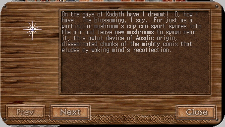
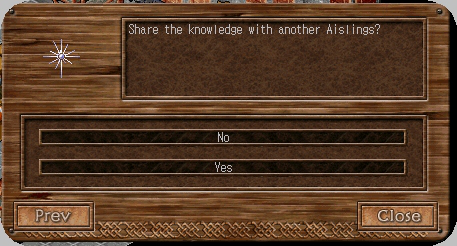
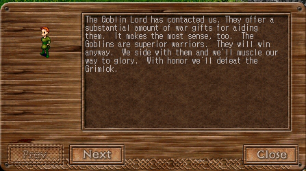

# The History of the Pravat Caves and Other Related Works

_by Etayn in_ ___Dark Ages___


## Part I – Pravat Caves

Although I was barely a child when the “Great War” between the goblins and the grimlok of the Pravat Caves commenced, it has truly been a fascination to me since I first heard of the carnage. Being a Ceannlaidir worshipper all of my life, and eventually (several deochs later) an acolyte, the tales told surrounding this tragedy of Deochs 6 - 16 have always hit very close to home. I recall my late High Priestess, Allita, who used to speak of such tales during her regular masses. After she disappeared from Temuair, I set out to find out as much as I could about the events that transpired during the time before my birth until and throughout my second deoch, and the involvement of the Ceannlaidir faith with the situation surrounding the battles


According to most lore-keepers, the “Great War” began in or about the 16th deoch. Although mundanes seemed to have extensive knowledge of the inner conflict, Aisling-kind was only told very basic but relevant information. According to my research, Phalin, the grimlok queen and Bahadir, the goblin Chief, and their tribes began to fight over an artifact known to Mundanes as “Conix Stones” but considered by both goblins and grimlok alike to be a “Holy Artifact”. Interestingly enough, if one has not researched this item or has not been taught what to look for, you would only find “dark rocks”. However, both of these tribal leaders will recognize the stone on sight. In my studies, I have found that even when taught about this mysterious rock that an Aisling will likely forget all they were taught within a moon’s time, such is the arcane nature of it.

|Bahadir - The Goblin Chief|Phalin - The Grimlock Queen|
|-|-|
|||

When speaking to Evan, the mundane who told of the peril outside the Pravat Caves, he insisted I form an allegiance with one or the other factions. He warned me strongly that if I did not choose a side immediately, that both sides would be out for my blood.


As I was told the Ceannlaidir faith allied with the side of the goblins during the “Great War”, I told Evan that I would seek out Bahadir and gather further information from him. He directed me Westward where I found I could move around the side of the rock formation. There, within a small clearing of grass stood the mighty Bahadir in addition to his constant companion, a goblin soldier. While the beast didn't offer his (It’s?) name, I found it curious that the leader of the goblins would choose a mere soldier over the obviously superior warrior.

|Goblin Soldier|Goblin Warrior|
|-|-|
||

Further investigation into this answered my question. It seems that this particular goblin soldier has insight even into Aisling skills and magics and therefore must be the instructor of the rest of the brood who use these abilities like they were second nature. This one was obviously one of the more intelligent of this species, although goblins, as a whole, are neither un-evolved nor animalistic often speaking in a garbled Temuairan standard tongue.

Bahadir hastily explained to me that during the time of the great conflict, King Bruce wished that Aislings would do their best to drive the goblins from their home for good. As he explained it, many Aislings foolishly lost their lives to the powerful creatures. Regardless of King Bruce’s requirement that an individual was required to be of a certain age and ability, it didn't stop the goblins from trouncing the naive Aisling. After a time, Bahadir said, that even the Earth-Sea Gods, themselves, decided that this battle had gone on long enough and that they should get involved.

The saddest thing about this, to my thoughts, was that while Ceannlaidir allied with Bahadir, Fiosachd, our ally, found his allegiance with Phalin and the grimlok. When I checked further into this information with one who lived during that time, the priestess told me a deeply disheartening tale about the fact that during the time of this conflict Ceannlaidir worshippers and Fiosachd worshipper were routinely banished from one another’s temples without a second thought. I am quite happy that I missed all of that as my family ties are within the Fiosachd faith although, I, myself, am a devoted Ceannlaidir fellow. I cannot imagine the lovely High Priestess Allita of Ceannlaidir, a dear friend of my family and my entrance into the fellowship of the God of War ever looking with anger upon the clergy of the Fiosachd faith.

After I heard Bahadir’s version of the tale, I decided that I should ask Phalin the grimlok queen about their side of the story. Although traversing through grimlok territory was treacherous considering my allegiance with the goblins, I made my way to Phalin’s throne room on the Eastern-most edge of the cave. Similarly, to Bahadir, Phalin keeps a grimlok henchman near her constantly. It only took a moment to realize that this was the instructor to the grimloks in the same way that the goblin soldier has additional skills; this grimlok prole was also knowledgeable in Aisling crafts.

|Grimlok Prole|Grimlok Soldier|Grimlok Warrior|
|-|-|-|
||||

Phalin proudly described a thorough victory of the grimloks over their counterparts the goblins and assured me that after many Aislings had joined them, the goblins were all but excavated from the caves. Perhaps it was my faithful belief in Ceannlaidir, but I could not help but grimace when she spoke of the failure of Ceannlaidir’s own. It did me much good to remind the overly tall Queen that the goblins had returned and that perhaps if a conflict ever arose again she may not be so lucky.

I suppose that Phalin seemed the friendlier of the two leaders, either that or she was much loved being the only female grimlok I saw and therefore had no angst, but I spent a great deal of time in her throne room and she volunteered more information that I had expected. The grimlok, like their feuding neighbors, are rather evolved and speak the Aisling tongue.

According to some historical lore I have found on this subject, it seems that many Aislings are under the false assumption that these two tribal races gather their blessed equipment from Aislings they have slain. This is hardly the case as Phalin pointed out to me. She said that both the grimloks and the goblins offer rewards to Aislings for donating items imbued with the strength of the Earth-Sea Gods, as well as other precious stones. (Incidentally, one may find beryl, rubies and corals alike within Pravat Cave in various conditions, be they unfinished, fragmented, flawed, or finished. An explorer may need another Aisling to identify such treasures that, those understanding gem smithing, can improve upon. As to the untrained eye, they shall only appear as the raw stones.)


The reason for this is that these two races have no quarrel with Aisling-kind and if they had had the choice, they would have wished that Aislings, Mundanes, and the Earth-Sea Gods had stayed out of their business from the beginning. Phalin explained that this civil war was internal and that no other species had any business involving themselves with a sacred object we could never hope to understand.

I suggested to her that mundanes had uncovered information on that very subject and that it was available to our instructors `recognized award winners` in the Library at Loures. Phalin sneered at this and mumbled about the King’s covert involvement. I assured her that these were only unfounded rumors and thought I had better finish my research in Loures before I ended up on a banquet table. For if neither the goblins nor the grimlok had any taste for Aisling flesh, the draco Hatchling that crawls the back part of the caves near the entrance to the Chaos Pits would! (More on these later.) Bidding Phalin and her comrade farewell, I trudged to the capital and turned my eyes towards the dusty writings.

The librarian greeted me warmly but when I spoke of the tribes in Pravat he averted his eyes and spoke only in hushed tones

|The Librarian, Blaise|Blaise's Speech|
|-|-|
|||

He explained that he couldn't tell me the information that I sought but if I could find an Aisling instructor that he might be able to point them in the correct direction. Armed with that knowledge, I sought out one of these elusive recognized Aislings and she was willing to share with me what she could.

|Blaise's Warning|Blaise's Direction|
|-|-|
|||

The helpful instructor read through the tome and shared the information contained within.

|Conix Lore|Conix Lore, continued|Conix Sharing|
|-|-|-|
||||

Did I wish to share this knowledge? I suppose that answer lies here as I tell ye what dark thoughts have enlightened me. The author of this secretive work refers to the Conix stones as disseminated chunks of an Aosdic device. What sort of device could this have been? The writer also eludes a connection between these “sacred artifacts” and the talos and talgonite we use nearly each sun to equip ourselves and advance to the prime of our crafts. As I continued to study, the evidence got more and more curious.

As I mentioned previously, even when taught about this mysterious rock, an Aisling will likely forget all they were taught within a moon’s time, how strange. Interestingly enough, if one has not researched this item or has not been taught what to look for, a seeker would only find “dark rocks”, however both of the tribal leaders in the Pravat Cave will recognize the “stone” on sight. Yet I now hesitate to refer to Conix as a “stone” at all, considering that this elder scholar seemed to think it shares the same qualities as a dark metal.

Our missing author offers that they speak of the times of Kadath. According to known history, the only time any ventured to Kadath (or dark North) was during Grinneal 12345. It is also considered a fact that those who sought this place went mad. It is said this occurred because they felt it was the worldly home of the Gods. What makes that interesting is that the Earth-Sea Gods felt they had an interest in the outcome of the battle between the goblins and the grimlok, so much so they chose sides regardless of their previously accepted allegiances and enmities as in the case with Fiosachd and Ceannlaidir.

What dark magic was afoot unbeknownst to the faiths that assisted these creatures and what had that to do with Phalin’s mention of King Bruce’s involvement in the affair that, coincidentally, had this ancient tome housed covertly within his palace walls? All of these riddles surfaced in my mind adding to my confusion and yet forcing me onward to reveal at least part of the answer.

## Part II – The Kasmanium Mines


A very short distance southeast of the Pravat Caves, are the Kasmanium mines. While at first glance, it seems that the two have nothing to do with each other we must concede that dracos, goblins and grimloks exist in both places but in these mines, there is also the presence of orcs which connects us to the Undine Fields, but more on that shortly.

The main coincidence here, other than what the scholar mentioned regarding the “dark metals”, is that these mines contain a host of dracos. This would be overlooked save that the draco hatchlings in Pravat have to originate somewhere. The fact that this massive beast is referred to as a “hatchling” indicates that it was “hatched” as if from an egg reminiscent of birds. If this is so, how did that egg manage to wind up in the Pravat Caves? The only passage that can be found that would allow creatures to come and go from the Pravat Caves is the Chaos Pit which is tied to the Pravat cave by means of a nearly unknown passage. While this passage may be large enough for an Aisling to travel through, it is obvious that not even a young draco can move through it.


After following all possibilities, the conclusion is apparent and can only be that the goblins are moving these eggs. It is known that this hatchling invariably is hatched in the goblin territories and that the eggs are placed in a specified area that the eventually birthed draco cannot get out of. The question remains what would the goblins want with a creature even they are afraid of, as they must be, considering that in both the Kasmanium Mines and the Pravat Caves the two creatures avoid one another, the dracos always choosing the further depths. If we consider where these hatchlings are housed, one may reason that it is in hopes that the draco will either frighten away or consume any intruder who would attempt to collect Conix “stones” from the goblin territories.

These conditions point out that the grimlok also must have originated from these Kasmanium mines and chose to follow the goblins when they sought out new areas. More evidence on this would be the distinct coloring of both the grimloks and the dracos. It must be that these two have adapted to life underground, as dracos seem to only be able to hover while the size of their wings could easily support flight. It couldn't be the other way around because the grimlok are only present in these two places while the fact that goblins are nomads is undeniably true considering their presence within both areas and even further in Temuair. (Again, more on this later.) Curiosity still abounds as to why the grimloks originally chose to move. If we assume that the goblins have various forms of communities considering their lifestyle and habitation, we must admit that the grimloks seem to be primarily a mining culture. The goblins likely picked up this skill while traveling through the Kasmanium mines from the grimloks. If the grimloks were a mining culture and were satisfied for so long with their talos, talgonite, and hybrasyl what would make them leave the mines in hopes of a new commodity? We return to the scholar’s text for clues.

The writer likens these fragments to “a mushroom” which can spout spores and refers to “disseminated chunks of the Conix”. Disseminated Chunks? Of “The” Conix? Is the author indicating that the Conix originally was one solid mass that spouted and scattered pieces of itself?! Is the Conix…Alive? Are these “seeds”? In horror I continue… Our unknown author speaks of a “blossoming” indicating, alarmingly, that these “seeds” may one day mature! Dear Danaan, to what ends?!

If the goblins new of this… thing… they must have acquired the knowledge from Aosdic sources. The grimloks seeing the goblin’s fascination with this must have followed in order to obtain knowledge and possibly these very same artifacts to use for their own ends. That explains the grimloks, but how did the goblins happen to come upon such knowledge? They must have known of this Conix prior to invading the Kasmanium Mines or else why would they seek out mining skills? So, the goblins were aware of the nature of these “stones” before entering Pravat, or the Kasmanium Mines and therefore must have acquired this information elsewhere, but where?

## Part III – Undine Fields and Astrid


Halfway across Temuair, we find Astrid and Undine Fields. There are no grimloks in this area, however we can find both orcs and goblins in the fields outside of Undine. In no other location save the Kasmanium Mines do we see this particular pairing. This may also be where the rumor of King Bruce’s involvement in the whole Pravat conflict may have originated.

Being near the water, it would be imagined that these unlikely allies could travel from the Undine Fields to the mainland, but that would involve traveling right through the Kingship of Loures. Let us backtrack for just a moment and recall what the orcs were doing in the Undine Fields in the first place. They were sent there along with other mercenaries by King Bruce himself to neutralize during the Undine rebellion. Why wouldn't their old friend Bruce return that favor by granting them free passage and a blind eye through the Southern-most point of Temuair? The answer is that he surely would do such a thing for his “friends”, but apparently not for the goblins who at a very future date would seek invasion of Loures. Perhaps for this complete disregard of them? We shall never know.

Needless to say, the goblins did indeed make it through Loures with, and quite likely with the protection of, their allies the orcs to take up residence in the Kasmanium Mines, where the goblins took up mining and eventually moved along to the Pravat Cave, which ended up being the desired destination all along before moving on to meet with cousins to their race, the Hobgoblins, in the woodlands outside Mileth but we are moving too far ahead of ourselves.

So how did the goblins know to go to Pravat Cave? That question troubled me for a long time. Returning to the source text of our ancient scholar, he indicates that within the Kasmanium Mine there are signs of Aosdic remnants of power. Shall we consider that the goblins had set out for Kasmanium mines with that purpose all along and they found something?

Let us open our minds to the possibility that the dracos were placed in the Kasmanium Mines by the Aosda to protect their remnants of Aosdic “artifacts of power and dread consequences” which the goblins found. The goblins then stole the idea of draconic protection from the Aosda to protect their own artifacts, which, in all reality, are merely pieces of one Aosdic artifact, namely, the “Conix”, which had “spouted spores” in the area that came to be known as “Pravat Cave”.

>“Pravat”, the word itself may be broken down as follows: “Pr(a)” – “For” or even “Before” as in “Pre-“, “(a)Vat” – From, “Exc(avat)e”. So either the individuals who named this place may have given it the title after finding out what lay within, or because they knew there was something there all along. This is only speculation. `Incidentally, it is also “morning” in Bengali, but this is unrelated. `”

It wouldn't be difficult to see why the grimloks would have followed along behind the goblins after finding these remnants. Of course, when the goblins realized they were being tracked, they had reinforcements sent to follow the grimloks with a draco egg in tow. After both sides set up shop in the Pravat Cave, the conflict began over who would own these “Holy Stones”. Another question then… Why do both goblins and grimloks consider these objects holy and why would the Earth-Sea Gods get involved if they were not?

## Part IV – Theological Concerns

Throughout this essay I have touched on the Earth-Sea Gods and their involvement in the conflict at Pravat. I would now like to address this issue in its entirety.

For comprehension's sake, we must walk backward through the maze that began the Aisling involvement with this war. There was a message sent to Aislings through the mundanes known as “The Entreaty”. It was penned by Phalin and worded thusly:


Clearly, as I have stated before, Phalin didn't want the assistance of Aislings in her war. Phalin questions how the goblins came to know of the stone, and while I have my own theories, I questions how the grimlok came to know of it. Also, why did Phalin feel she could call out to Aislings?

As she writes, the grimlok at that time had recently uncovered their history and past. With the help of our unknown author, I reveal the Aosdic history. It seems that the paths of the predecessors of Aislings and the paths of the grimlok were intertwined at some time and in some way. Either that, or Phalin is simply lying. She states that the grimlok history is being taken from them… Could not Aislings claim the same thing? If the holy artifacts of the grimlok are pieces of a far more ancient artifact of the Aosda, our history was being stolen from us and we held the door open for the thieves. If this is so, how vain that Phalin will allow us to use our own artifacts! How kind of her. So, the dupes that we are ran off to help her steal our history in droves. Thankfully, not all of us were so misled. Let us continue…

After speaking with others, I found that a different objective was given to Aislings depending upon their faith. As a Ceannlaidir worshipper, Evan told me a much different tale than the majority of Aislings were.

Evan tells worshippers of each faith a different objective:

|Cail|Ceannlaidir, part 1|Ceannlaidir, Part 2|
|-|-|-|
||||

|Deoch|Fiosachd|Glioca|Luathas|
|-|-|-|-|
|_1_||_1_||

|Gramail|Sgrios, part 1|Sgrios, part2|
|-|-|-|
||||

>_1_ Due to Evan's temporary and mysterious disappearance, the objectives for Deoch and Glioca were not obtained. Memories provided by Nuirrfyd (Cail), Loeghan (Fiosachd), Tormod (Gramail), Blanche (Luathas), Addams (Sgrios)

While I will not attempt to go into the philosophical or religion based meanings for these allegiances (That’s another paper entirely), one stands out. What was told to the Gramail worshippers proves the rumors, that Loures backed the goblins, are fact. This also explains the shaky retort that Loures gave after the conflict was over. I doubt that Loures, unlike the Fiosachd faith had interest in these things because of their market value. Likely it was because of their origin.

If the grimlok queen spoke the truth then why did our unknown author not mention a word about the entire culture? He or she seemed to know a great deal about the origin of the Conix if not its precise location. Perhaps all of the locations were viable because, as they put it, it “spouted”. Considering the chaos pits, were they not at one time blocked by a large obelisk? Could that too have been a shard of this great artifact? Again, we are getting ahead of ourselves. After the patrons of Luathas, Deoch, and others though not to the same degree, did their very best to aid the grimlok, they managed to use our artifact to remove the goblin threat.


Although I am too young to remember the passage being cleared, my mother reminds me that at one time it was a crowded and difficult journey to manage and that the path was indeed a boon to Aislings. As we can see, again the Earth Sea Gods are again connected with this holy artifact. Interestingly enough, there were two other commentaries made surrounding this supposed victory. Naturally the goblin Captain, Bahadir, had a retort. It is the other remark that is curious.

|Even without you|Diplomacy Fragmented|
|-|-|
||

It’s true that the goblins did, in fact, leave Pravat for a time. Their return, however, was imminent. The council of Loures decided to speak out publicly against those who aided the grimlok implicating themselves further into this battle. They mention in their address assistant librarian Marlin. Could he be our unnamed author? As we all know, Marlin is still separated from his beloved Bella in the Loures dungeon. Such punishment for mere rumors, or was it a rumor at all? Could it have been that Marlin was very knowledgeable of Aosdic culture and intended for Aislings to gather the stone to renew that culture or did he have other plans for it entirely? The objective given to Luathas worshippers also touches on this, as Luathas was an Aosda. It is my guess that Luathas knew very well what the artifact was all about, but why would he wish his worshippers to aid another culture in keeping possession of it? Why would he not suggest that they keep the artifacts for themselves or offer it to him in sacrifice? It seems that any answers would lie with Marlin.

|Marlin|Marlin's denial|
|-|-|
|||

But he’s not talking…

## Afterword

Although my interest and research of this subject can and must continue, at this point I have come to several conclusions. Initially, this entire conflict began in Loures. The studies conducted by Marlin at the direction of King Bruce allowed him to uncover the information regarding an Aosdic artifact, “The Conix”. When Bruce was informed of this metal, as Marlin would have explained being an alchemist, he realized the edge that he would have against any rebellion with superior arms and weaponry. When King Bruce hired the goblins to suppress the revolution in Undine, he sent them on to gather additional forces and make their way to the caves to uncover anything of value hidden by the grimlok who resided there. When the goblins reported back that the grimlok had discovered what they referred to as knowledge of a “Holy Artifact” that lay in Pravat, which of course they would call it considering that they had never found anything prior of such quality, King Bruce sent them on to Pravat Cave to collect it for him.

The goblins were told they would have assistance and backing by Mundanes to collect this artifact and that they would be paid well for their loyalty to the King. When Aislings decided to heed the call of both Phalin and Bahadir the King was outsmarted. The reason the Earth-Sea Gods involved themselves and aided the Aislings was to prevent Mundanes from getting their hands on an Aosdic artifact which would allow them to overtake even Aislings. The Earth-Sea Gods were not united in anything except that the “stones” could belong to anyone, accept Mundanes. This is why Loures spoke out against Aislings because after the “stones” were returned to the grimlok, the mundanes had no superiority. The fact is, the grimlok weren't seeking out advanced weaponry and armors, they truly feel that this “stone” is sacred and would not use it in the manner that King Bruce is so concerned with. Perhaps the goblins have come to that conclusion as well, but I wouldn't think so as in our current times, an army amasses outside of Loures not one of our cities. King Bruce insists that they are out for Aisling blood, but is this just another of the King’s plots to lure Aislings into doing his dirty work?

In my endless moons of studying, I have come to realize that regardless of what the vain Aisling might think, there is a great deal more carrying on in Temuair that has absolutely nothing to do with us. In many cases, it appears that we are merely pawns for the agendas of those who cohabitate with us. But I am a scholar, not a revolutionary. I shall leave that to those whose brawn supersedes their intellect.

The Pravat Cave, the Kasmanium Mines, Undine Fields, and Loures are linked along with that which has gone before. What we refer to Aosda and their culture are intertwined with events, places, and cultures within our present time. The choices and allegiances we make, along with the actions that we take may very well gravely affect those that come after us and we should mark well the decisions made by our elders and the imprint they have left for us to follow. Do we wish that those who will follow our reign should struggle as we have and will continue to struggle? Certainly, we need to leave more for them than the Aosdas left for us. Perhaps this essay is a beginning.

_Researched and revealed by Etayn Kendris_
_Scholar_

***

```
*Librarian Notes*

This entry has been edited to conform to Library formatting.
The original can be found at http://www.angelfire.com/realm2/ceannlaidir/pravatcaves.htm .
```
