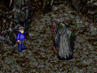
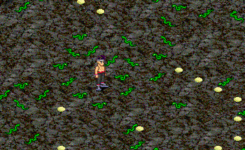
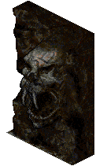
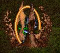
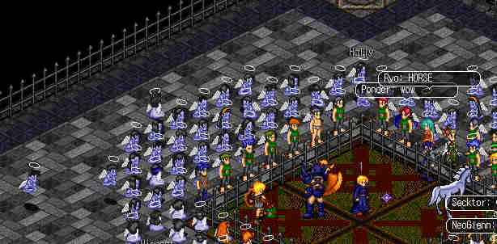
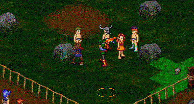
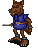
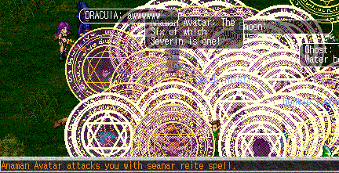
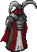

# Chaos Ascendant: A history of the third cycle of the gods (Deochs 17-24)

_By Ramanayan in_ ___Dark Ages___  
_Deoch 33, Spring_

## Introduction

Greetings reader of Temurian history, I have lived as an aisling for a great many deochs and have seen history fade into legend of our beloved land. Sitting in Loures library, unlike many of my fellow historians, I began to compile some of my memories and findings of one of the most violent and chaotic times in aisling history, to give aislings a first hand account of the happenings of the third cycle of the gods of the aisling era.

### Theology of the Octogram and Years

Each year seems to correspond with a particular deity. Deoch 1 is the year of Deoch which then continues each year for each god until Deoch 8 is reached which is the year of Sgrios. Each complete passage through all 8 years is called a cycle. So Deoch 9 would be the year of Deoch. It also appears to have been this way before the aisling era so the first year before Deoch 1, was the year of Sgrios.

Aisling Era Cycles:  
Cycle 1 (Deochs 1-8)  
Cycle 2 (9-16)  
Cycle 3 (17-24)  
Cycle 4 (24-32)  

|Deochs|Years|
|------|------|
|1, 9, 17, 25, 33 | Years of Deoch|
|2, 10, 18, 26 | Years of Glioca|
|3, 11, 19, 27 | Years of Cail|
|4, 12, 20, 28 | Years of Luathas|
|5, 13, 21, 29 | Years of Gramail|
|6, 14, 22, 30 | Years of Fiosachd|
|7, 15, 23, 31 | Years of Ceannlaidir|
|8, 16, 24, 32 | Years of Sgrios|
 
Cycle 5 has just begun which will last from Deochs 33-40.

## Forward: Dawn of a New Age

The 17th Deoch began in what many would call a new age of Temuair. Just recently in the 14th, 15th, and 16th Deochs aislings discovered they could reach new heights and abilities. The monks discovered the Sapphire Stream monastery to meditate, train, and learn many new skills and spells. The arena opened for aislings to test their valor and combat skills against one another in non-lethal duels. Aislings who reached the 99 insight of understanding of their paths now could choose to re-dedicate themselves to a new path or become a master. So as the 17th Deoch began a feeling of adventure and invincibility feel over most aislings.

### Rise of Necromancy

In the 17th Deoch many rumors had been circulating of a mundane who knew the long extinct and forbidden art of Necromancy had been seen wandering though Temuair. Necromancy is the art of summoning the dead, thus making ‘undead’, for use of the Necromancer. The exact details were not known but it was believed to leave the body weak in performing these magics. Finally it was confirmed: the wandering mundane had carved out of stone an area next to the Mileth Sgath Pit. As aislings attempted to enter the hidden entrance all but wizards were pushed away.

The hideous looking creature introduced himself as Gigean and said he would teach the art of Necromancy to wizards. He explained only certain wizards would be able to control the kind of power necromancy unleashed. Those who wished to be become Necromancers would need to be at least insight 25 and have some intelligence and wisdom `25 intel, and 15 wis`. Those who could match this must go out and kill a zombie and bring Gigean back its flesh. After completing this they became necromancers and learned the spell “Spion Torrah” (which means in the old tongue to basically ‘pluck up’) to summon the undead.



A great many wizards became necromancers in these times. It was soon discovered some gods did not approve of necromancy and would not allow their worshipers to become them. Only Ceannladir, Fiosachd, and Sgrios would allow it. The others would need to leave their faiths to become necromancers.

Summoning the undead is by no means easy. To get a good summon (and remain in control) without risk being harmed Gigean had perfected Spion Torrah to work with five items from dead creatures. Each required a certain insight to use and summoned a different kind of monster. The Ghast Skull at insight 25, Gargoyle Skull at insight 50, the Gog’s Maw at insight 75, the Gargoyle Fiend Skull at insight 80, and the Gremlin’s ear at insight 97. Each produced a skeletal warrior varying on the item used. However a Gremlin’s ear could produce the powerful and dreaded Death Knights. The summons would only last about 16 minutes `2 minutes` before being pulled back into the underworld.

Now the items Gigean had requested to use were not exactly common, some being extremely rare. So the dark wizard of Soumi offered a solution: make fakes. Using Kobold Skulls, Branches, Wolfs Skin, he could produce a fake skull that would work for insight 25 and greater Necromancers. Using zombies flesh and branches he could create a fake Gremlin’s ear. However using these items ran some risks. Half the time the items would fail and burn up. There was a two percent chance of being permanently hurt. `-1 stat` There was also a small chance of the summons going out of control. Many necromancers began using these items and began losing their health to the mastery of the dead.

### Chaos Realms

In early Deoch 18 something very strange was happening in Temuair. Small and simple green viper snakes began appearing in places they shouldn’t be. At first they were just small numbers and some thought it had just been a very large breeding season. However soon their numbers became increasingly large. They began to appear in the streets, the towns, the temples, the college, EVREYWHERE! In some places it was bad you couldn’t walk without stepping over one.

Soon after this had begun a circle of stone was discovered the outskirts of the enchanted garden in the eastern woodlands. An odd looking mundane who introduced himself as Coibhi, a druid, explained to aislings that the druid order preferred to remain unseen or invisible but had seen a great imbalance being put onto the lands with the recent rise of Necromancy. Coibhi explained the druids were seeking answers and would share them with aislings in the coming moon.

Some weeks later there was a large earthquake in Pravat, whether it was intentional caused or naturally happened remains a mystery, and in the room where the draco hatchlings often are found a large hole appeared in the wall. As aislings entered they found a remarkable sight. Vipers were all over the floor and along the back wall was a giant monolith that was calling forth the vipers. Finally the source had been found! The Druids explained that monoliths are often the gateways into other worlds and were seeking ways to destroy it. Meanwhile aislings came to attack the monolith and succeeded in killing it. There was now another opening that lead into a realm which we know as the Chaos Realms. The creatures were beyond belief, bone dragons, skeletons and other dreaded and weird looking monsters. The creatures were so strong that no one could take them on.


|
-------------------------|-------------------------
Viper hordes infest the floor of the monolith area|The monolith itself

Soon after the monolith was destroyed a new one reappeared in its place. Coibhi explained that the monolith could only truly be killed by using three items: Granite, Vipers Venom, and Sacred Wax. Aislings traveled far and wide to get these items and eventually a group of four aislings was successful in obtaining the items. The monolith was defeated once and for all and soon after the viper hordes stopped. Those aislings who defeated the monolith had that event on their legends. `Each in the group got the legend mark: “Destroyed Chaos Monolith- Deoch 18, Summer”` With the defeat of the monolith the creatures of chaos began to weaken to a point were only the strongest of aislings could defeat them.

### The Failed Coup

As Deoch 18 turned into Deoch 19 the city of Rucesion was at a crossroads. Rucesion’s two longest serving and respected Judges Twila and Latentaura had become the first Rangers of Temuair. They wandered the lands arresting those who committed acts of sleep hunting. They also kept an eye on nomads and exiled aislings. Rucesion politics slowly had become dominated by officials of the guild Dynasty (this is not the same Dynasty guild as today). The departure of two senior judges did not help the situation. Dynasty used harassment, blackmail, and threats to kept nominal control over Rucesion. On the outside Rucesion seemed fine but the situation was about to explode.

Early into Deoch 19 the situation got completely out of hand as the Dynasty guild launched a massive offensive to crush their political enemies. They used threats, blackmail, just random removals, and even illegal exiles to get their way. For a moment Rucesion politics were completely overthrown. Aislings fled the city for fear of illegal exiles or banishment. Finally Mundane Burgess Eduardo stepped in and arrested those involved in the coup as they had violated mundane law `TOS` which forbids harassment and threats. `each account was also blocked for one week`. To prevent such situations was happening in the future a removal from office law was instated. Rucesion had been saved but the damage had been done.

### Adoration

In early Deoch 20 aislings celebrated the final rite of the Eulogy ritual: The Adoration of Danaan. The Eulogy has three parts: Eulogy, Redemption, and Adoration. The Eulogy is held each 8 Deochs (Deochs 8, 16, 24 etc), the redemption three Deochs after (11,19,27), and the adoration four Deochs after (12,20,28). An aisling may choose to worship at Pravat, Astrid, or Mehadi swamp. At the first ritual he will be given an item and some experience. The aisling then returns with that item to the same location for the redemption and has the item “upgraded” and given additional experience. Finally for the adoration a person with an item from each location goes to Astrid Center and sacrifices the items with a group to complete the ritual. This gives many bonuses. `Legend mark- “Adoration of Danaan- Deoch 12, Summer”, +100 hp and mp, and +2 to all stats` This sweat kiss from Danaan seemed to dispel any bad things would happen soon.

### The Rise of Tagor

In early Deoch 21 the druids began speaking of a coming darkness on the lands. Aislings did not know what the druids meant and waited for the next sign to happen. Several Deochs earlier King Bruce of Loures had decreed a new aisling settable village be established. In Deoch 21 ships began to sail to the long isolated village of Tagor which lies close to the House Macabre. Coibhi warned with the rise of Tagor heralded the coming darkness. At the same time the Goblins launched a new offensive in Pravat Cave which they had left since Deoch 16. The druids warned this was yet another sign.

As aislings entered into Tagor and became citizens they learned of dark and evil past. Tagor was the birthplace of Necromancy. Long ago a mage of the highest order named Lord Macabre began experimenting with ways to keep himself from dying, as he feared death very much. Unfortunately for him he found such a way: He became a lich. The transformation twisted his mind even more. He believed that the living were always dying but the undead live forever. So he began to raise the dead and send them out to kill more people to turn into undead. It seemed nothing could stop him until a strange bearded man from the northern woodlands entered Tagor. In a double moon the hordes had stopped. Although now sick the man had contained the lich’s power to his dwelling: The House Macabre.  The fate of Lord Macabre is unknown although it is believed he sacrificed himself to Chadul and as he was sucked into the ground his essence became the magic of current Necromancy and one of his students, possibly Gigean, carried on his work.

After the evil had been contained to the House Macabre Tagor became isolated from the rest of the world. In Deoch 12 King Bruce of Loures announced the discovery of the Macabre House of Tagor which contained unspeakable horrors. 9 Deochs later the village was re-opened. Aislings also learned from the inn keeper that minor skeletons and zombies would sometimes escape into the village but they could easily be dealt with. However now their numbers were growing larger and at the moment a large mass of skeletons was just outside the village in which became know as the “Lost Souls Path”!

Shortly after the village of Tagor had been re-opened green skeletons began to show up in very small numbers in Mileth, Rucesion, and Loures. This was seen as a sign that chaos was growing in the lands.

### Chadul’s Return

Far away in Kadath, what we mortals know as the home of the gods, unknown to aisling eyes Chadul had awoken from his slumber after his battle with Danaan over 20 years ago. Chadul proposed a challenge to the other gods to prove that his followers in Temuair were stronger and more powerful then theirs. The gods suspected Chadul probably had some other evil scheme going but knew the aislings of Temuair would not allow the dark to win.

Chadul’s challenge went like this: each side would choose an aisling champion; one of light and one of dark. Each champion would choose twelve disciples to follow them. The two groups would engage in contests to see which side was stronger. The side that won each contest would be able to propose a boon to be added or removed from Temuair to the mundanes.

For the light side long time Cail High Priestess Pashura was chosen as a champion. She chose aislings from all walks of life and guilds to be her disciples. They were not as physically strong as the dark side but were more then capable of completing the tasks ahead. Chadul selected the well known wizard dedicated priest Krytos to be his champion. Krytos for the most part choose his disciples from the ranks of the Yakuza guild which was the descendant of Dynasty. The dark side had some of the strongest aislings in Temuair but as time would tell strength was not everything.

Champion of Light|Champion of Dark
---------|--------
Pashura|Krytos

Disciples of Light|Disciples of Dark
------------------|-----------------
Biomagus|Caspian
Deksar|Fluppe
Manipulator|Gaut
Mismom|Khyros
Omner|Kydilias
Shalena|Laizin
Sungam|Luniz
SupraMax|Sachiel
Vamistle|Syroes
Vexed|Thalon
Victorious|Wandion
Wisal|Xilan
                   
 
During this time the druids had been informing the aislings of the many events taking place in Temuair.

Shortly after Krytos had chosen his 12 disciples Chadul granted his followers the ability to summon minor skeletons. The light obtained a spell called banish which would send the skeletons back to the abyss. The side of chaos moved quickly as its disciples summoned dozens of skeletons mainly in Rucesion. The docks soon became crowded with skeletons and no one could escape. The light spell was having no effect and it seemed the skeletons could not be killed! Eventually the banish spell was perfected and the crisis was resolved. The skeletons remained only a minor annoyance in the future.

|
-------------------------|-------------------------
Minor Skeletons|Banishment Spell


## The Contests of Light and Chaos

### The Chrysalis Hunt


Shortly after the champions and disciples had been chosen some aislings when awakening in Temuair `logging on` had large orbs appearing with them. Mundane Burgess of Rucesion Eduardo explained these were known as Chrysalis and would be used for the first contest. Aislings would randomly be given them when they entered Temuair. They would then have the option of giving them to the light or dark side or keeping them for themselves. The side that collected the most would be the winner of the round. Aislings looked toward what appeared to be a popularity contest but then something unexpected happened: The dark side unofficially announced they would not be doing the contest. Many speculate this happened because the dark side simply was not liked by many aislings and not enough would give them Chrysalises. Although others say the dark side had more economic power then the light and could have probably purchased enough to win. It remains debated to this day. When the hunt ended 64 Chrysalises were in Temuair. 35 were with the light, 2 with the dark, and the rest with other aislings. Light won the first round.

### The Kelberoth Hunt


After the Chystalis hunt ended another hunt would begin. However this hunt would be quite different. The mythical kelberoth creature, which a certain monk form is based on, had been reborn with the rise of chaos. These creatures would appear at random anywhere in Temuair. The side that killed the most of them would be declared the winner. When the Kelberoth hunt ended about a double moon later each side had killed one kelberoth. To break the tie each side would choose a disciple to battle to death in a specially built arena. The winner would win the Kelberoth hunt. Aislings thought who would be the judge of this contest? It turned out to be Chadul himself who took a human-like form for the battle.

### The Victorious vs. Kezril Duel

When the arena was completed each side had chosen its respected champion. For the light it was disciple Victorious a master monk dedicated from the warrior class who many believed to be the strongest aisling in Temuair. The dark choose the lesser known but still powerful Kezril, a master wizard dedicated from the priest class. Interestingly Kezril was not actually a dark disciple but still Chadul allowed this. The date of the combat was announced and several mundanes appeared in Mileth, Rucesion, and the Eastern Woodlands to take aislings to the battle ring. Aislings would need to enter as spirits to prevent any interference in the battle.



The first round began. Victorious called upon Glicoa to bless him with invincibility. Kezril could not do any damage to Victorious for a time now. Finally Victorious found a hole in Kezril’s mor dion spells (limited invincibility) and killed him. Light had won the first round. The second round was similar to the first except Victorious was overcome by a lag beast `disconnected`, and thus the round was given to Kezril.

As the third round began the dark side had Victorious excommunicated from the Glicoa fellowship preventing him from using his entreat forcing him to use his dion and iron skill spells. For a time the two could not find holes in each others armor and Chadul began summoning in monsters from the Chthonic Remains, the Chaos Realms, and even some unknown monsters such as Unicorns. Finally Victorious managed to find a hole in Kezril’s dion and killed him again. The forth round ended the same way. Light was declared the winner of the duel and the Kelberoth hunt.

Also during this time strange gemstones began appearing to the champions and disciples of each side. They were small strange green/bluish gems and when used would sometimes grant the user increased resistance to harmful magic `+30% Magic Resistance` for a very short time. Aside from that their use and purpose remained unkown.


### Kick the Kobold
About a moon after the battle Kobolds began infesting one of the areas of the Lost Souls Pass outside of Tagor. Eduardo wrote it was probably Chadul’s doing and some prelude to another contest. That was indeed the case. Soon after Eduardo announced Chadul had constructed an arena for a game called “Kick the Kobold”. The game consisted of two teams on a field. Each team attempted to “kick” Kobolds into each others goal by using skills and such. There would be a total of three games with three rounds each. The winner would be the best two of three. The matches would be held in a specially built arena which could be entered by the stone square in Tagor village.



The first game was won by the light. However what most people remember about this round this round was that Victorious began to slander and threaten Kytros, who in turn began speaking heretically mad at Eduardo, who was hosting the games. Many people were shocked by this display of irrational behavior. The second game, which was not attended by either Champion, was won by the dark side. The final game was won by the light and thus light won the Kick the Kobold matches and the light vs. dark war. They could now bring three boons into Temuair within power of the mundanes.

## A Strange Boy

Shortly before the Kelberoth hunt a strange urchin boy by the name of Nigel had begun randomly appearing to aislings requesting items and promises of a great prize. Nigel had set himself up in one of the abandoned houses in Tagor and only aislings attempting to complete his requests were allowed entry. His requests greatly varied, from bring him a goblin helm, killing creatures, and getting 50 bee stings! Those who completed his strange requests were rewarded with a necklace – one of three kinds, a Tiota, Treas, or Caid. Each aislings necklace varied in what attributes it gave to the user. Some gave little of anything while others gave great bonuses. `+Vitality and Mana, a few gave +1 to a certain stat` An aisling who completed his requests also had the event recorded on their legend. `“Completed Treas Quest – Deoch 22, Spring” or a similar one`

## Celebration
As it happened just after lights final victory over dark the 4th Mileth Festival was about to begin. Coordinated by Mileth Burgesses Omner Garamonde and Feria Onorach it would be the first fair in 10 Deochs, the last being held in Deoch 13. Aislings from all over flocked to the fair to participate in events, play games, sell things, watch plays, and more. Many took this opportunity to celebrate the victory over the dark.

## Chadul’s Revenge

Chadul and his followers had lost the contests of Light and Dark. But they were far from being fair losers. Chadul had a final plan to bring chaos to the lands – he would make it so aislings could kill fellow aislings. He went and schemed with the dwarf Ake, in Abel Dungeon about creating an artifact that could do such while the contests were still going on. Ake said he would do so if 400 gemstones were delivered to him. Chadul sent his messenger to the Dark Champion, Kytros, about gathering the gems. The dark followers gathered the 400 gems very quickly.

Shortly after a dark menacing laugh was heard throughout Temuair. Chadul had gotten the artifact. He then smashed it to bits, and chaos was released on the lands. Aislings now could kill fellow aislings – right while the Mileth Fair was still going on. Only buildings, built by aisling hands, would be protected from the chaos. As chaos ripped throughout the lands battles between aislings began all over, including fighting in many of the town squares.

However quickly the result of the chaos was not as bad as everyone thought. As the first aislings perished they simply turned in spirits – not dead, but not able to do most things of living aislings. Basically all Chadul had done was turn Temuair into a giant arena. The beggars, who collected old items from aislings, thankful for the items offered to restore aislings killed in the chaos. The aisling controlled towns also passed temporary legislation forbidding the killing of fellow aislings. Slowly the effects of chaos became more of an annoyance then a real problem.

As soon as Chadul destroyed the artifact the druids began looking for ways to fix the damage. They asked Ake to make another artifact. Ake said he would but only for another 400 gemstones and they must be given to him by Light Champion Pashura. As aislings donated gemstones to stop the chaos battles began on Abel beach as the dark disciples attempted to stop Pashura from reaching Ake. Despite their efforts a new artifact was produced about a moon later and the chaos had ended.

With chaos removed the gods looked down with an angry wrath on those aislings who had abused their abilities during the chaos `"speed hacking”` and removed most of the dark disciples from existence. `Deleted` The gods then banded together, a thing they rarely did, and banished Chadul to the underworld forever. He has not been heard from since.

## Strange Jester
A few moons after the end of chaos a jester was sighted in Rucesion and then in Piet. He sold very strange clothing items and hats for rouges for outrageous prices. Eduardo said these items probably would not last long being of a very low quality. `These were for Halloween 2001, which included Batman and Joker suits, swim gear, bunny suits, and several hats for rogues.`

## The Eulogy

Deoch 24 soon arrived and the Eulogy would signal the beginning of the end of this cycle. As aislings looked back on the past 8 Deochs they could see these were violent times of chaos. As the first Eulogy dawned in Deoch 8 Kalliope, daughter of Hesperos, slain bard of Undine, wrote an octave to commemorate the first eight Deochs. I have written an octave which would be appropriate for the third cycle.

> __First Cycle__
>
>_One visited us, our flame-licked lover._  
>_Two made us beautiful, each and everyone._  
>_Three showed us the world as it is._  
>_Four showed us the secrets._  
>_Five showed us their use and art._  
>_Six showed us their fineness._  
>_Seven tore us apart._ 
>_Eight led us to the Altar._ 

> ___Third Cycle___
> 
>_Seventeen the dark one came,_  
>_Eighteen showed us his power,_  
>_Nineteen brought us corruption,_  
>_Twenty finished the past,_ 
>_Twenty-one gave the dark a home,_  
>_Twenty-two challenged order,_  
>_Twenty-three tore it apart,_  
>_Twenty-four led us to the altar._  

As preparations began for the Eulogy which would commemorate 24 years since Danaan’s great sacrifice the priests of the Grimlok, Kobolds, and Mukul appeared in the sacred areas of their territory. Pravat Deep, Astrid Center, and the Center of the Medadi Swamp Maze.

The Grimlok at Pravat worship Adranuch, their lady of gold, the Kobolds of Astrid worship Arpina their all mother, and the Mukul worship Matrika, their goddess of the Sun-Heart. All of these appear to be each races own version of Danaan.

Grimlok|Kobold|Mukul|
-------|------|-----|
|||

As the first ritual began a loud rumbling was heard. As before at the previous Eulogies dubhaim poured from the earth- Dunan, Nightgaunts, Lesser Servitors, Servitors, and a dreaded Anaman Avitar took residence at Astrid Center on the Pentagram and called forth more monsters. However the dubhaim were surprised for aislings had grown much stronger since their last meeting at a Eulogy.

At the height of the second ritual the Avitar began to speak louder, speaking of ramblings of the ancient Pact of Anaman, which summoning more monsters around Astrid Center. The creature howled with rage as powerful aislings came to attack it – only to be meet with a deadly spell which reduced all aislings health to near death while having its servants attack them. `It cast a spell which reduced all nearby aislings health to 1`

Aislings battled the Avatar for a long time but finally gained the upper hand, and killed it. Another Avatar appeared in the center of the arena! However it to meet the fate as its predecessor.



Anaman Avatar|Servitor|Lesser Servitor|Dunan|Nightgaunt
-------------|--------|---------------|-----|----------
||||


Finally the monsters ceased appearing as the Eulogy itself finally arrived. Aislings gathered at Pravat, Astrid, and Mehadi to worship Danaan along side the creatures. Each participate was blessed with a wealth of experience, an item to be used at the next ritual, the redemption, and their legends expanded from it.

## Conclusion

With the end of the Eulogy Deoch 24 and the third cycle soon came to an end. Looking back they were violent and difficult times but in the end light had bested the forces of chaos and darkness. For the first time in a long time the future looked bright.

___But every light casts a shadow...___

***

```
*Librarian Notes*

This entry has been edited to conform to Library formatting.
The original can be found at http://www.angelfire.com/scifi/b5rpg/chaos.htm .
```
