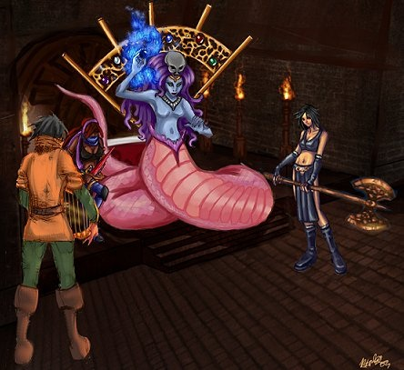

# A History of the Oren and Nobis Islands and Their Connection to the World Abroad

## Foreword

During the preparation of this paper, I found that it was necessary to break apart major themes concerning the development of history in Oren and Nobis. I purposefully wrote in this manner rather than throwing the entire history onto a single timeline and having the reader guess which events were important in terms of cause and effect for each of the two major themes. Because of this segmented nature of my approach, you may find that most of the subsections in the following history will either resume a previous chronology or jump fairly far backwards in time in order to express the start of a fresh and specific time line so that it may begin at the earliest point of note for that particular concept. Do not fret, I have included approximate dates in an attempt to keep the history as clear as possible. I believe that it becomes a less confusing read this way. To reiterate, the temporal juggling was intended by design and not happened upon by sloppiness.

## Introduction

The history of some of Temuair's settlements remain primarily unknown. Where you may be familiar with the legends about heroes from here and there, a few cities (such as the historical juggernaut Loures) have made massively important and well recorded impacts on the various regions of our world. Such events have been noted by more than just one historian over the course of time. The southern islands, on the other hand, has been tragically left unmentioned in the long annals of recorded history despite the rich cultures that have developed there.

The story of Oren's past is as much one of desperation as the modern city is steeped in opulence. It is remarkable that the mundanes  were able to evolve  the region from dire conditions into a prosperous and culturally rich locale where more established cities have floundered throughout the ages. The individual evolution of the region has been preserved fairly well throughout history due to its virtually complete disconnection by the Lynith Channel (south of Lynith Beach, east of the Farriage Ocean) from the rest of Temuair. Oren's inhabitants remained isolated for large swaths of time, and it is because of that remoteness, that important disconnection, that Oren and its sister island Nobis have such unique architecture and clothing styles that are distinctly recognizable from the styles from other villages of Temuair.

The history of Oren Island has been quite different from the giants of well-documented history with reams of  literature we can recall so easily today. What can be compiled of the mundane history in Oren, in fact, does not come from any surviving scrolls or tomes due to the humid climate of the southern regions of the world. Any such parchments that survived the great burning have long since reduced to dust. The earliest histories told of these islands survives only through the tales memorized by the eldest of the surviving villagers and the ruined fragments of tablets, now broken and discarded that lay within the old temple upon the island of Nobis.  It is a history that has been passed down through the generations. Such verbal memories are the only means by which to draw information. Certainly, these stories cannot by any means be considered hard, solid facts with exact dates. It is important, though, to make note of the plausible history of Oren Island before the aging mundanes are lost to us forever beyond the threshold of Sgrios' gloomy halls.

## Original Populating of Oren Island (Grinneal 14000 - Danaan 929)

The Aosdians were the first to settle in the southern islands; naturally they did so aeons before the mundanes and Aislings would ever venture to those sandy shoals. Their labors eventually included the hauntingly beautiful ruins of their civilization that still exist towards the inland portion of the island near the modern small town of Nobis. While the exact date of the erection of this Aosdian settlement is lost to the vast period of time between their disappearance and any tales known by the mundanes of the island, the time period of their residence on the islands can only be guessed by the dilapidated state of the ruins that they left behind and the general knowledge of the Aosdian civilization. Through a quick scouring of the Library of Loures, one can find that written in the books of ancient history, the Aosdian civilization enjoyed a sort of prosperous "pax" just over 14000 years ago `Timeline of Temuair`. Today, we understand that this time period would be around the beginning of the twilight of the grand Aosdian empire `Napie`, because by Danaan 929, the great Aosdian bloodlines and wisdom would be forever lost to the world.

Evidence found within the ruins in the middle of Nobis Island indicate that the settlement may even be much older than Grinneal 14000, and thus it could have been created before the first widely recorded loss of the Aosdian settlements, however not all of the Aosdian strongholds were lost after the cataclysm brought about by the damned voyage to Kadath. Isolated from the other Aosdian settlements and so far to the south were the Aosdians of Oren and Nobis. They lived on, beyond the curse of Kadath, working and studying their magics and ecology in peace. Like many other clustered holdouts of Aosdians, in Grinneal 9000 the Oren and Nobis Aosdians also began to worship the Earth-Sea gods of old `Timeline of Temuair, VanMorgan`.

While in modern times, several scholars have laughingly stated that the Earth-Sea gods were fictitious and the study of their worshipers were simply a waste of time for dreamers and fools, but we would do well to remember that the current Temuairian gods only appeared in the year 1399 of Danaan dating. It is well known that other gods were being worshiped at this time, however until now little has been uncovered of them. Actually, it was not until the rediscovery of the Book of the Black Cow `Maerista` in Pravat, and its insightful translation by Librarian Blaise of Loures and the Aisling Maerista, that the elemental gods were given any credit beyond philosophical amusement. There are significant portions of the tome that describe creatures of great power living beneath the ocean in a great city.

Maerista and Blaise are unsure whether or not this great city that lay beneath the ocean was the inspiration of  the great floating city Hy-Brasyl before it was erected in Danaan 102 `Timeline of Temuair`. However, it is known that at this time the word "Temuair" came to being, suggesting a knowledge of people of the land and people of the sea. Additionally, from the markings on the Aosdian ruins near Nobis, despite being badly eroded by time, indicates that the ruin was a massive stone temple erected in honor of the highly esteemed water goddess, who was possibly a close relative (possibly sister or niece) to the esteemed Manannan mac Lir who was known to have commanded incredible powers of his own in Book of the Black Cow `Maerista`.

As with our modern dieties, the Earth-Sea gods required worshipers and belief in order to grant them their divine powers `VanMorgan`. When the Aosdians vanished from Temuair in Danaan 929 `Timeline of Temuair`, the island's water goddess still lingered on in her temple. So, like the ultimate fate of all of our Temuairian gods, the sea-goddess' power would eventually wain over time without the constant worship of the Oren and Nobis Aosdians. After centuries without followers to pray to her, she vanished from this realm of being and back into the Divine Ether. As one of her final lonely acts within this world, she used her diminishing power to chisel instructions for future denizens of the island to re-summon her upon massive stone tablets within her crumbling temple just in case the Aosdians returned to seek advice from their loving, benevolent goddess.

From the elaborate carvings and a little deductive reasoning, the water goddess of the Nobis temple turns out to be none other than Medusa. It is important to note here that her original Aosdian worship began well before Danaan 1703 which means there had not been the discovery of elemental Darkness and Danaan 1815 nor the rise of Chadul `Timeline of Temuair`. We must concede to the historical fact that during the original worship of Medusa, darkness and entropy of Chadul had not been set loose upon the world and therefore Medusa could not have been corrupted by the element of dubh. It is because of such chaotic darkness that had been presented to the lands of Temuair between her first passing and her first re-summoning which caused Medusa to become the blood-thirsting aberration we refer to as a "creant." Judging by the size and intricacy of the temple erected by her worshipers, it is more likely that she was a benevolent, well loved, and wise being before the malice of elemental darkness penetrated her heart.

## Two Settlements (Danaan 1980 - Danaan 2230)

The mundanes settled in Oren Island many years after the Aosdians. Though the exact cause of their initial exodus from the northern main lands of Temuair is as of yet unknown, there is knowledge of wide-spread strife during the period known to historians as "Darkness" which occurred around the Eighth Aeon in the year Danaan 1980 `Timeline of Temuair`. It is most likely the original mundane population of Oren Island were mundane villagers of the Temuairian main land who had fled for safety and security during the tumultuous time of the Great War between Danaan and Chadul. As mundanes are not ones to tolerate much risk to their livelihoods and well being, clans left on a journey southward far and away from their ancestral homes which would indeed have seemed less risky than remaining where they had lived near the modern cities of Loures and Piet while the creatures of sidh and dubhaimd fought upon their farms and lawns.

Once the mundanes reached their destination upon the southern isles, life would not be as simple as getting back to the old routine. They would not have been able to establish true farms for quite some time, nor would they have solid homes like they once enjoyed in Argmagh. Over centuries in isolation from the rest of Temuair, the clans of mundanes would have mingled and intermarried with the neighboring clans who also found refuge there. Over that time, because of the marriages and population growth, it would make sense for the individual mundane villages to coalesce together in order to form the first large-sized village on the northern shore of the island. This village will eventually be named after the most powerful of the mundane village chieftains, Uaran.

The tales of the mundane islanders say that Uaran held a mighty spear that could tear through the bark of the most wicked treant, that he was swift enough to impale three fish upon it in a single motion while foraging for his people, and, while it may seem like less of a romantic notion, he was also gifted with a fair mind for leading his people. The ability to peacefully resolve most of the disputes which would have otherwise alienated members of the struggling community is likely what made him the tribal chieftain. It would therefore be his bloodline which later became the first and only royal dynasty of modern day Oren.

It is by their very nature difficult for mundanes to accept change and uncertainty. So, uneasy about the new form of leadership that was developing before them, a breakaway sect of the mundane refugees decided that they would prefer to opt out of following chief Uaran. His reign had not been well established throughout all of the refugee clans of the island, and a single new mundane ruler was not easily accepted throughout all of the isle's clans within the first few years of his reign. And so it came to be that the largest of the refugee mundane clans called the "Nobis" people (thought to originally hail from the area around Loures) along with a handful of dissenters left the growing multi-clan town of refugees that had been united under chief Uaran, and they left for a more sheltered, quiet life through the old Aosdian portal on a nearby island surrounded by steep, rocky cliffs.

## The Medusa and Her Son


On the smaller island, the clans people of Nobis would have quickly discovered the ancient ruins completely deserted yet full of tablets and carvings left behind in the Aosdian settlement. With the vague memories and stories describing the romantic notions of the simpler, even-keeled, and Earth-Sea worshiping Aosdians, the mundanes of Nobis soon made arrangements to summon the gentle water goddess Medusa. The ritual tablet left behind during Medusa's last efforts toward true immortality (before she fell into the slumber of the immortal abyss) needed only to have been translated.

As it turns out, the revival of elemental gods by small and desperate mundane clans was rather widespread across Temuair, because there is evidence that Cailites near Undine awoke the old earth God "Tauren", Deochians of Suomi roused the fire god "Shamensyth", and the mundanes of Beal na Carriage called forth the wind goddess "Pheonix." The exact date Medusa's summoning by the mundanes cannot be ascertained, but it would have been early in the rediscovery of temple and Medusa worship. It is likely that Medusa reappeared as a benevolent deity for the mundane peoples of Nobis somewhere between the years 2400 and 2500 in the time of Danaan.

Without realizing that there would be any foul connection to the spread of dubh in the world, the mundanes summoned and resumed the worship of Medusa after the discovery of Kadath, knowledge of darkness, and the arrival of Chadul. Again,  at her original summoning by the mundanes (between 2400 and 2500 Danaan) she would not have immediately been the viscous killer that we recognize her as today. It takes time for powerful beings to become corrupted, but because of their ability to wield such power, they are also susceptible to being affected by the elemental powers that they use. Medusa was unintentionally exposed to the world's inherent darkness which was rampant in the world after Danaan 1703 `Timeline of Temuair`. Having never experienced the likes of elemental darkness before, Medusa was intrigued by the strange new elemental power. Slowly, with constant exposure to the dubh, and the power granted by her new found mundane worshipers, Medusa gorged herself on the dark magic. As she did so, the darkness mutated her from a compassionate sea goddess into a contemptuous creant.

Around Danaan 3250, before the death of Danaan and the beginning of Deoch dating, Medusa took her high priest Colbhana as a consort and bore a male mundane child whom she named Law. Medusa knew while she was still carrying Law within her belly that he would have the power to make great changes in and beyond Temuair `Darkages News Entry`. With this prophecy of her unborn son, the far-sighted Medusa demanded that the legendary Mundane armorer Miraedus (who knew the secrets of armor smithing taught by the Tuatha de Danaan, Dwarves, and Mundane masters) be brought to Nobis by any means necessary in order to begin crafting great masterwork armors. She intended to present to her son with these once he matured to manhood. As Medusa still carried him within her womb, however, Law was unfortunately also subjected to the same toxins of darkness and chaos which had been slowly poisoning Medusa.

After his birth in Danaan 3258, Law was turned over to be raised by specially selected priestesses of Medusa. These nursemaids taught the young Law the art of charisma and the benefits of good manners. They were, however, unable to convince him that the virtues of compassion and generosity were very worthwhile efforts. His easy, refined charm allowed him to gain the respect and admiration of Nobis and later Oren villagers, and eventually he would be offered and presented with the rank of official mundane sponsor of Oren Island. While Law was still just a boy, Miraedus had completed three of the armors he had been charged to create for Law by Danaan 3267. He was forced to vow that he would complete the grand armors and that they would be a magnificent gift to her son when he became a man upon his sixteenth birthday.

Before the time of Law's adulthood came, however, Miraedus had conceded to Medusa's additional demands and crafted an astonishing belt that had been imbued with magnificent powers for the sea-prince. It was designed to have been readily worn with all five of the masterwork armors that he would eventually be able to wear. To his despair, the belt had been Miraedus' greatest single achievement, and it quickly became a staple of the young Law's wardrobe. He would hardly be seen not wearing the belt after he received it from his mother when he turned eleven in Danaan 3269.

Growing crueler by the day, both Law and Medusa lashed out more and more frequently at their cultists and craftsmen. Soon enough, in Summer of 3274 Law was given the full collection of the Grand Master armors and told that he would be well provided for in what ever path he chose. Law, being a fickle and selfish youth borne of wealth, decided that he would rather not choose at that moment. Because of this, Miraedus was not allowed to leave the temple at Nobis, and by 3280 Miraedus was treated more like a prisoner of Medusa than an honored guest. Moreover, she jealously demanded that he created elegant female armors for herself to wear that would be grand enough to rival the splendor of her gifts to her son.

Young, headstrong, and with the over self-assured countenance of a young man, Law pressed his mother to venture out and explore the world. Having kept little from her precious, beloved son, Medusa relented to his will, and Law's first excursion into the world of Mundanes began. He would be an unknown stranger to lands as distant as Feasgar and Undine, but his presence would be felt by those in tune with divine power because of the nature of his divine birth. Law would not return to the island of Nobis until well after his mother had been banished to the Divine Ether by the Temuairian Octave.

During her beloved son's absence, Medusa quickly became lethargic and short tempered. She began to withdraw herself from her followers. Some would say that like any mother, she was merely depressed because she longed for and worried for her wayward son. She was, however a being of terrific power, so during the deepest thralls of her depression, it took mere moons for Medusa's blessing of prolonged youth and protection upon her faithful mundane followers to become perverted by her increasingly wicked nature. Soon the blessings of long fruitful lives became a curse of eternal wasting and blind hatred which consumed her dedicated followers. The devout mundane people of Nobis were therefore transformed into mindless skeletons and gnarled beasts bent on guarding her temple from outsiders. The houses of these mundanes have remained largely vacant since her temple attendants were transformed.

## The Journey of Shamensyth

Shamensyth | Medusa
--------|--------
|

All four of the Temuairian creants, through their connection to the nadurra mysteries, felt the shuddering power of Law upon his birth, and weary of the sudden imbalance of power, the three other creants sent their most devoted followers to watch the events surrounding Oren Island. During an interview, Baldo mentioned that his grandfather had told him that there was a noticeable increase of  strange mundanes coming to the island around Danaan 3270, all of whom would strangely disappear quickly with other strangers that had only arrived around Danaan 3280. This is prior to the official opening of Oren City's ports, and while curious at the time, it was not investigated. It is reasonable to believe that the strangers were the devoted spies of the three other corrupted elemental gods.

Attracted by the growing power of Law, the lure of Miraedus' magnificent armors, and impatient by nature, a darkened elemental god ventured across land and sea. This time, instead of being bound to a single temple as the other elemental gods were, the creature Shamensyth slank his way from the highlands of Suomi, southward to the dense forests of the Emerald Wood. These forests were the edge of the lands controlled by the covetous Lady Phoenix.

Shamensyth, being a fiery trickster, entertained himself by causing mischief. Because the Emerald Wood was so lush and ancient, he wreathed himself in a cloak of flame so that he would leave a burning trail in his wake for the airborne Phoenix to see. The Phoenix was enraged that her beloved woods burned for his absurd amusement, and such was her rage that she swooped in to attack Shamensyth for his vandalism. As the elemental harpy goddess of the wind, her powerful wings only served to feed the fires that the Shamensyth had started, causing an inferno to burn the majority the Emerald Wood to cinders and ash in Summer of Danaan 3290. The remains of the Emerald Wood is known today as the barren desert of Deadwood Forest near Beal na Carriage `Darkages News Entry`. The Phoenix, who had once been worshiped in the forests near the looming sky-towers of Beal na Carriage, bitterly lost the mass majority of her worshipers in the blaze. Flying with unbridled hatred and jealousy among her precious trees in Shinewood Forest, the Phoenix can be found when summoned at her open-air altar. Shamensyth, having been the cause of the massive forest fire, won the attention and disapproval of the god Cail, lord of nature, harmony, and balance.

Untouched by the displeasure of Cail and ire of the Lady Phoenix, Shamensyth needed only to cross the ocean separating Tagor and Oren and take his plunder from the cult of Medusa. The journey over land would have come at a heavy cost for most, but for a creature of flame, the real test would be traversing the Farriage Ocean.

Unable to find or fashion himself a boat after his battle with the Phoenix, the Shamensyth would have been forced to walk across the ocean floor beneath the crushing blue depths. A certain death for most mortals, this path was only even possible for the Shamensyth through the power of the Breath Ring, one of the rings of Lady Phoenix that was kept at her altar to symbolize her mastery over the air. With the panic caused by the hurried evacuation of Beal na Carriage, the ring was left unattended upon its altar. The Shamensyth, without hesitation or respect for the artifact took the ring for his own and continued on his journey. Suns and Moons would pass slowly, but eventually the Shamensyth would take his first steps upon the sands of Oren Island.

Similar to the interference in the nadurra mysteries caused by Law's birth, Medusa would have been able to sense the Shamansyth's journey toward her remote island several suns before his actual arrival. With the emergence of a possible threat, she ordered that the smith Miraedus and his grand armors were to be hidden away deep within her temple labyrinth so that the Shamensyth would never find them.

Miraedus resented what the Medusa had become and loathed that he was to be hidden from Shamensyth as though he was merely a possession. Determined that he would not live the rest of his life as one of her trinkets, while the temple's skeletal guards were loyally stowing away the Medusa's most precious belongings, Miraedus took his chance to escape from Medusa and her shambling cultists. During the inky blackness of a moonless night, he fled from the Nobis temple to the Aosdian portal in the woods. Using a branch laying nearby, he cracked the crystal on the Nobis side of the Aosdian portal, forever disallowing anyone or any thing to travel to Oren Island via the ancient Nobis portal. Miraedus then jogged to the edge of the island where there were very few rocks at the base of the cliff face shore line, after a quick prayer to Gramail,  he dove into the water. Miraedus had to swim all of the way to Oren in order to warn the mundanes there of Shamensyth's imminent arrival.

The very next morning the Shamensyth crept onto the island being welcomed only by the silence of dawn. Unsure about what other powers the Breath Ring commanded, he took a moment to hide the ring by one of the large trees surrounding the shore of the island. Then, seeing the slow awakening of the thriving city, he decided that it would be more amusing to antagonize the mortal citizens of Oren before moving on to battle the Medusa on Nobis.

By sending a meteoric fireball into the city of Oren, Shamensyth made his grand debut to the southern isles in the winter of Danaan 3291. The fireball tragically struck the only library on the two islands. And as the flames and smoke billowed from the shattered windows, it left little doubt that the librarian and his family who lived in a small apartment at the back of the building had been murdered without seeing so much as the hide nor hair of their attacker. This sealed the Shamensyth's fate as an enemy of the Temuairian gods.  Gramail, god of justice, was outraged at the delinquent and deliberate unlawfulness of the actions. Glioca, goddess of love and compassion, would have been dismayed by the deaths of the innocent mundanes. The mundane family had done nothing to upset or even be remotely in the way of the scheme of their murderer. Ceannlaidir, god of war, honor, and valor would have been disgusted with the lack of honor in how the Shamensyth killed the unarmed mundanes. Luathas, god of Gnosis,  would have been wholly infuriated that the Shamensyth would burn the only storehouse of knowledge for hundreds of leagues around.

For the mundanes of Oren, the destruction of the library caused a panic to ripple through the city. Citizens fled from their homes in all directions toward the tree line in order to escape the threat of being directly targeted by the unknown assailant. Many of their homes and shops burned to rubble and ash before Shamensyth became bored and meandered into the woods to the south of the city. It was only then that Miraedus dragged himself onto the Oren shore. Shaking with exhaustion and frustration, he walked straight past the cluster of stunned and frightened mundanes. He grabbed a bucket beside the city hall (near where the Oren Armory stands today), and he went to the beach to fill the bucket with water. Miraedus may not have prepared the Oren citizens in time, but he would certainly help them put out the fires that were consuming their livelihoods.

Other mundanes quickly began to form a bucket line and extinguish the Oren blaze. One of the mundanes was a young man named Duvall, and while lugging a heavy bucket of water from the beach to the next mundane in line, he saw a small object sparkling in the sand. Putting down his bucket, he picked up the small sapphire ring and slipped it onto his finger before returning to the bucket line. He would later find that the ring had a miraculous way of perfectly fitting any finger on which he chose wear it, but it shone most beautifully of all upon the ring finger of his lover and fiancée, Alyana, future mother of Alane the Oren Jeweler.

Not all of the mundanes who were residing on Oren island at the time took up the call to save the city from being consumed by the flames. The strangers that had been appearing for Deochs recognized that there was no time to lose if they were to steal the grand armors for their own gods before the trickster Shamensyth stole them all for himself. These were the people who fled into the forest, straight for the old portal. These were the people that the Shamensyth followed to find the treasures of Medusa.

## The Imprisonment of the Creants

Lady Phoenix | Tauren
--------|--------
|

Once the Shamensyth was transported to the island of Nobis, he cursed his thoughtlessness of dropping the Breath Ring when he saw that the crystal allowing passage back to Oren had been broken. This meant that he would need to save enough of his power in order to warp himself across the surface of the water as he left, and then he would have to find the ring of the Phoenix in order to return to his mountainous home near present day Suomi. Suddenly, it seemed, the marauder's plan was as simple as it once had been.

Within the temple of Medusa, the cultists were still scrambling to sure-up the crumbling walls and protect the gold and treasures that she had been demanding for several years. Shamensyth effortlessly picked off the near-mortal skeletons and monsters that her worshipers had become and meandered easily through the halls of her temple, less interested in a battle than a simple raid. Why fight if he could just steal what he wanted? And soon enough, there was a false panel of wall that had not been completely closed which only partially concealed Miraedus' masterworks, the Grand Master Mystic Helm, the Grand Master Mystic Cap, and both of the Grand Master Divine Mitres that would have belonged to Medusa and her beloved son.

The Shamensyth's power grew when he placed the Grand Master Mystic Helm upon his head, and his lust for more power quickly became the better of him. As lackadaisically as he had wandered into the temple, he was now just as frantic to find more of the miraculous armors to claim for himself. Using more fearsome meteors of flame, he began to recklessly target the walls in an effort to uncover more hidden stashes. Monsters and unmutated mundanes (the strangers that had abandoned Oren to pillage Medusa's temple) were sent scurrying out of the way. Some of the mundanes, in fact, had curiously seemed to survive the choking heat of his flesh-melting fireballs despite being hit by them directly.

The Shamensyth ascended stairs and rounded corridors, and on the third level of the temple he discovered the remains of Miraedus' workshop. Laid before him were the sleek Grand Master Mantle and Grand Master Plate, as well as the powerful Pheonix Claws. He snatched those too, but he did not hear the soft scrape of scales upon ancient stones as he marveled and tinkered with his new found trinkets.

With a hiss of fury, the Medusa sent a torrent of darkness and searing light at the Shamensyth who, being a creature of the flame, was naturally nimble. His thieving done for now, Shamensyth rose to the invitation of battle with the Medusa with a cool grin and a meteor aimed directly for her. Her magic protected her from much of the damage from the direct hit, and in response she summoned hundreds of thousands of poisonous vipers to lash out at him as she targeted him once again with a darkening expression.

For hours, perhaps days, the two fought. Medusa, jealously guarding her treasure, and Shamensyth his future loot. Neither had noticed that, save a few items, they had been stolen away little by little by the mundane followers of Phoenix and Tauren who shuffled quickly out of sight with heavy bags and grim faces. Medusa and Shamensyth fought on all levels, in all yards, in all rooms, and through all of the halls. The jewels of Medusa's massive, ornate headdress were strewn about in all directions, and the grand stone temple, which had not been completely rebuilt to it's former glory, was crumbling under each errant blast and blow. Watching the fearsome two spar, it was easily decided by the Temuairian Octave that the elemental creants who held the armors had too much raw power and should be locked away in the Divine Ether, a world far beyond our own.

Gramail, with the utterance of a single word, stopped time for the battling creants. The eight gods said their words of scorn, others of fury, and Sgrios said a few of praise and admiration. In the end, they would syphon off the divine power that Medusa had obtained until she could no longer remain in the world of Mundanes and Aislings. Sgrios excused himself at this point, and he left the gathering in order to attend to the needs of the souls wandering his hall. Luathas removed the knowledge of summoning her back into the mortal planes from the skeletal priests and gnarled thralls and other corrupted creatures of the Medusa that would return soon enough to serve their vile lady. Having removed the creant herself, Fiosachd was tasked with the duty of ensuring that no one who was not ready to slay her would accidentally be able to resummon the Medusa in her corrupted form.

Being fanciful as he was, Fiosachd summoned drake after drake and offered it a single jewel from Medusa's damaged headdress to protect as the beginning of it's own treasure horde. As soon as each of the little dragons had snatched it away from Fiosachd, he banished it away with an individual piece of bone from the once great dragon named Kopar. Once several drakes had been fooled, and Fiosachd could find no more jewels in the temple, he buried the bones of the great  dragon in the neglected gardens behind the temple and broke the talisman into two pieces. The final jewel, a giant cloudy-white pearl had been obliterated by spells and magic during the battle. His task complete, Fiosachd returned to his fellow gods to discuss what was to be done with the Shamensyth.

Time outside of the temple was still moving on, and during the time it took to hide the summoning trinkets of Medusa, the mundanes who worshiped the Lady Phoenix had managed to reach the charred wood of Beal na Carriage by boat. Other mundanes, who worshiped the once noble Tauren, were also sailing north and had made it well past the harbor of Loures with their loot. They did not know that what they brought their own deities would be the exile that Medusa had just faced.

Returning to the case of the Shamensyth, he who burnt great forests and killed innocents, the gods debated and argued as to how he would be punished. Was banishment enough? In the debate Ceannlaidir broke the trickster's wand in two as he bellowed about his dishonor to Cail who wished the Shamensyth to become the slave of the Lady Phoenix to atone for his destruction of her forests. Luathas shouted that the Shamensyth had robbed the Oren people of their intelligent growth when he burned their library, Deoch was less interested in that until Luathas told him that it was one of the few libraries in the world which contained works of fiction and fantasy. All of the six gods assembled agreed that something must be done, but none agreed what was to be done.

That is, until Glioca, having returned from her nightly sigil as the moon, told the other six gods (as Sgrios had remained to shepherd  lost souls) that the other two creants would soon hold the grand master armors themselves. Gramail was the first to suggest that, as they had been the most wronged, the people of Oren should hold the Shamensyth imprisoned within the sewers that King Oren I had commissioned and built below the city. Once again, the god of tricks, subtlety and luck was put in charge of keeping stray wanderers clear and away from summoning the creant. Weary that they would be arguing like this for all of the remaining elemental gods, they agreed that it would be best this way.

The two halves of the Blazing Wand were the key to holding Shamensyth's energy. He had been banished into the Divine Ether as well in the same manner that was used to banish the Medusa. As the magical rituals of resummoning is tied to possessions, Fiosachd called forth two ghastly jesters to guard the wand. The pair, however, had been brothers in life and were not above attempting to repair the broken implement to gain power for themselves or worse, resummon and attempt to control the Shamensyth with it. The two were tricked, like the drakes in the temple into taking a half of the Blazing wand each, and banished with  pieces of a toy bauble. Impressed and emboldened by his own cleverness, Fiosachd turned room after room into a tightly winding maze and animated several of the same toy baubles so that they would guard the twisting path to the prison of the Shamensyth. The prison: a room so cold and damp that it would never catch fire, and to ensure his internment Gramail, lord of justice, cast a spell of entrapment on the Shamensyth's large cell to never allow his release into the world again.

Still uneasy about how close Shamensyth were to innocents, Glioca completely sealed the maze that was to be his prison underground and created a stone safety shelter where the old library had once stood as well. Below a building façade, a staircase could bring evacuees to a tunnel and out to safety, should they need to escape danger again. 

Displeased with the farce of protecting lives with animated toys flying about to keep out mundanes and Aislings who might release the Shamensyth, Cail and Ceannlaidir volunteered to personally handle the banishment of the other two creants. Cail insisted that large, fierce, native beasts should protect the objects for the Lady Phoenix, and Ceannlaidir entrusted the Tauren's summoning trinkets to only the most fierce beings known: the lion Kelberoth and the great Goblin Warlords. It would not be until Deoch 2 that all of the creants had been contained.

As with the twisted priests of the Medusa cult, the gods agreed that it would be best to force the knowledge of the creants from the aislings and mundanes who might foolishly seek them out before they were ready to defeat them. Luathas, using his power of divine knowledge removed all thoughts of the creants from the memories of the mundanes and aislings in Temuair. He, however, could not remove the memories from the mundanes who had sailed to the distant lands of Medenia and outside of the realms of his influence. The creants would be rediscovered by Aislings, and the mysteries of their summoning `Marcy` would allow for them to acquire Miraedus' grand master armors.

>NOTE:
_Here I must jump backwards in time for the majority of the following paragraphs have little to do with the drama of the creants which unfolded earlier in the reading. Where the grand majority of the previously explained history revolved around the temple standing upon island of Nobis, the following will center around the mundane inhabitants of the island of Oren instead._

## Of Ports, Pubs, Pirates, and Aislings

Isolation was devastating for the refugee groups who had been accustomed to the relative proximity of neighboring cities and towns, and with the previous years of wide-spread harmony only to be crushed with the coming of Chadul and the tumultuous period just before the Great War of Danaan and Chadul `Timeline of Temuair`, the mundanes that managed to evacuate the plains of Ardmagh to Oren were barely scraping out an existence once they made it to the island. Sustenance would have come primarily from fishing, a few vegetable and fruit seeds for planting (these had been carried south during the evacuation), and the rare wild floppy found in the forest to the inland portion of the island. This was a vast difference from the abundance of cereal crops which grew well in the lush farmlands near the modern towns of Piet and Loures. Time would wear on, and after the first two or three generations of mundanes came and went, the peoples of Oren and Nobis islands would have started their own form of normalcy and, having had time to adapt to their new environment, would begin to flourish rather than struggle for survival among the ruins of the old Aosdian settlements (especially when they stopped wasting their time attempting to grow grains in the especially tropical climate).

It wasn't until and around Danaan 2400, that the Oren tribes had mingled enough that the great chieftain Uaran was elected as the first leader of Oren, patriarch of his dynasty. Uaran would sire a single son (his informal name was Bród but will later be known as Oren I) by his wife Bláthnaid in the year Danaan 2436. Recall, the Nobis tribes were re-summoning the fair-minded, benevolent water deity Medusa at around this time. While Uaran was the first in the eventual royal line of Oren Island, the only real feat that he is known for is the unification of the tribes and villages of Oren island and ending the occasional raids of the island's native kobald inhabitants on his people with a peace treaty.

One might wonder why it would be that Oren's civilization seems as advanced or, possibly even more cultured than much of the rest of Temuair, but there is a reason for that. The Oren and Nobis islanders were not a war-like people, having chosen to relocate rather than to be swept up with battle between Danaan and Chadul. Fighting and warfare would continue and intensify in the rest of Temuair until the year Danaan 3058 which is marked as the beginning of the Shadows War and ends in Danaan 3171 `Timeline of Temuair`. Rather than allowing for civilization to improve and grow, much of the labor force in the rest of Temuair would have been either sent off to battle or made to support the war efforts. Instead, fair-minded leadership by wise and far-sighted tribal chieftains paved the road for harmony and the geographic location allowed for a sense of isolation that afforded Oren and Nobis islanders the ability to specialize skills, develop cultural styles and fashions, and cultivate some of the best fruit crops in all of Temuair in relatively little time. The magnificent island leaders had a strong draw toward peaceful diplomacy and public works, allowing those citizens that would have been soldiers time and stability for intellectual and cultural growth. It, however, leaves the vast majority of the long history of the island rather boring due to the lack of events punctuating (such as battles) the easy going routines of the mundanes living there.

The first King Oren, eventual heir of Uaran, and grandfather of the missing King Oren III was crowned sovereign monarch of Oren Island around the time of Danaan 2500. Because of the rare whispers about the might and grandeur of the distant Empire of Loures, King Oren felt that he was required as the mundane in power to prove his kingly might through the exercise of his wealth and his kingly right through the undertaking of many generous and honorable deeds. It was under the reign of King Oren I that the city would hold a public contest for all citizens to design a building solely meant for the public's entertainment in Danaan 2550. The winner, a wizened old man named Habernath, had designed a clever tower maze that the unwise may never manage to solve without some guidance.

Over the long period of time it took to erect the tower maze, Oren's crops grew bountiful, especially the grapes and fruits that had been carried southward during the exodus of the main land, the fishing industry blossomed, and the first true king of the island, King Oren I began building a grand library erected to save the knowledge and wisdom of the verbal history that Oren island's older generations that they had amassed from their forebears. Habernath's Maze still stands in Oren today. Its facade is dark and strikingly different from the modern styles and siding that we see in the more modern structures on Oren because the stones were re-purposed from some of the best remaining, unincorporated pieces of the ancient Aosdian ruins on Oren Island. No one seems to know why the dark rock was used in the ancient ruins much less where they were originally quarried, but they are clearly not native to either the Oren or Nobis islands.

King Oren I would continue to strive throughout his reign to create great public works for the people of Oren. During his rule King Oren I would pull down much of the dangerously deteriorating ancient Aosdian ruins near the coasts for the safety of the Oren people by Danaan 2647, and he had the large city library completed in Danaan 2704. After the library's final shingle had been placed, King Oren I began to devise construction on a massive sewer system to reduce the sewage and flooding issues. The sewers were completed by Danaan 2851, which was well after the death of the great builder-king, so the actual completion was overseen by his son King Oren II twenty-three years after the death of King Oren I.

Though no one went through the darkness and gloom to gaze upon it for decades, as a gift to the memory of the great king, the goddess Glioca placed a beautiful decorative fountain within the depths the sewers. The fountain sits directly beneath the old king's bed chamber within the royal palace, and it was rumored that the sewer water was suddenly transformed from a murky mire of filth to pure and cool as though the king had designed and built a miraculous spring rather than a sewage system the night of the full moon after the sewers were completed in 2851.

King Oren II was inspired by his father's good deeds, however he did not have as many opportunities to improve the island city so starkly as his father had. Once the city's sewer system was completed, King Oren II arranged for the entire city to be paved and an ornamental garden to be planted around a towering statue of his honored father. It was at the time of the statue's unveiling that the people requested that name of the city and island (at the time called "Uaran") became "Oren" after the name of their exalted king rather than the name of his grandfather.

The people, having been given a taste for the finer amenities of civilization, continued to improve the comforts of the growing city. In Danaan 3024 the Oren Bistro, the first restaurant of the islands, was founded, and swiftly became wildly popular with both the locals and occasional mundane visitors who were welcomed to the island.  These visitors, when they returned home, would speak of the Bistro so fondly that it became a destination for the wealthier ilk in Nobis and the more northern lands of Temuair.

By in large the reign of King Oren II was peaceful and fruitful on Oren island. The land prospered, the people flourished, but toward Danaan 3273 and the beginning of the reign of King Oren III, there was a growing influx of Nobis islanders settling in Oren Island City. With so many Nobisians, the king was pressed to find a suitable person to represent the island's affairs abroad who would not displease his Oren subjects nor leave the Nobisians unrepresented. It was when the charismatic young mundane named Law came to the island in the Spring of Danaan 3287 with an entourage on behalf of the people of Nobis King Oren III felt that he had a more than suitable prospective ambassador for all of Oren and Nobis.

Then, in the winter of Danaan 3291, Shamensyth burnt many buildings within the city. King Oren III took his chance to become a great builder like his grandfather had been, however many of the old buildings were made of stone and did not completely burn down as the library had. Another wooden home would replace the old library, its parchments and scrolls lost to time, and like her gift to the late King Oren I, Glioca would place the sealed cellar passageway beneath the home for the citizens to escape in case danger arose once more.

In the calamity Miraedus had arrived ashore to help the Oren islanders through their hardships, but once Law became more powerful upon the island, Miraedus, the legendary armorer, did his best to hide from Law by building a home for himself deep within the wooly jungles of Oren among the tribal Kobalds. He even went so far as to spirit his wife and children out of the city and begin the rumor of his own death so that none would be tempted to come looking for him.

If there is one group of people whom love the sound of good food, plenty of good drink, and an isolated island, it is the pirates. After hearing the fanciful tales of the wonderful islands of the south, a large sailing ship heavy with pirates set sail from Lynith beach `Darkages News Entry` to invade the island of Oren at the end of Deoch 25, just before the affluent merchants asked that Oren Island port be opened up completely to free trade and tourism `Darkages News Entry` in the Winter of Deoch 26 `Darkages News Entry`. The shabby pirate crew may not have been the most skilled sailors upon the seas, but their ferocity with the blade made it unsafe for the citizens of Oren to leave their homes, and it caused King Oren III to barricade himself inside the safety of his palace. Now more than ever, the King relied on the new ambassador to become the public figure which the king lacked the courage to be.

Used to the salty spray of the oceans, the pirates were confused by the sweet, pure water that the Oren Islanders had access to in their wells. The pirate king Rolff sent a contingent of some of the strongest and most feared pirates ashore in order to investigate. After tearing apart several of the shops and storefronts, they came upon the modest home of the mundane Baldo, a simple mason whose job it was to maintain the sewers, and his wife Siggy. Without a thought, they forced their way through the door, slit her throat and left her to die within her own home as they marched down the stairs and into the sewers. Baldo, later discovering the body of his late wife, swore to have vengeance upon all of the pirates that afflicted Oren despite his sore and aging body.

Instances like this grim murder were not uncommon, and had caused many of the mundanes living in Oren to abandon the island for the coast of Loures to found their own port city or to rouse the chilling silence of the abandoned town of Nobis. In hopes to lift the spirits of his citizens after the first Aislings arrived to tour the island and to help rid Oren of the recent pirate infestation, King Oren III planned a grand festival of three Oren Balls which would be held to showcase the splendor of the drink, buildings, fare of the island. While the pirates still marched ashore, the first of the balls `Darkages News Entry` hosted by King Oren III was held only for the most elite of Aislings and Mundanes, but the later soirees `Darkages News Entry, Darkages News Entry` were opened up so that more Aislings may enjoy the beauty, spectacle, and pageantry of the grand ball.

Unfortunately the rest of the world waits for no man, nor party, nor king. As the "official mundane sponsor of Oren Island" while the king was consumed with the piratical threat, Law announced that he would leave the island in order to act as the islander's diplomat and that he would find the future upon the untouched lands of Medenia in Deoch 30. It was not long after Law left the islands that Mileth's beloved mundane, Cedric `Darkages News Entry`, was murdered by Law's hand during his own sabbatical to Medenia in Deoch 32. A shrine dedicated to the memory of Cedric now stands beside the pier where he was last seen walking upon his native Temuairian soil. However, the news of Cedric's death was soon followed the rumor of Law's return, leading an army of dark Aislings.

>"This memorial is dedicated to the memory of Cedric, Mundane Burgess of Mileth. Struck down by the forces of darkness. May the prayers of all who come here provide a beacon of love and light for Cedric's soul."  
>   _Inscription on Cedric's shrine._


Naturally, it was not long before the horrible news made it back to Oren. The king, already unpopular for his cowardly inability to handle the pirate invasion, was again to blame for putting Law into a position where he would be able to get close to the beloved Mileth Burgess Cedric. In his utter shame, King Oren III into went into hiding. The loyal guard, Deos, may not admit it verbally, but he will not deny that the king escaped through a tunnel via the Sealed Cellar, located in the building that was constructed over the ashes of the Oren Library. Deos, instead insists that the king has only just stepped out, though the people of Oren have not seen not hide nor hair of him for over a hundred Deochs.

Since these sad events, the mundanes that live on the islands of Oren and Nobis attempt to keep a sense of normalcy despite the constant threat of pirate attacks and twisted beasts coming down from the ruined temple. Though Oren commanded a strong sense of culture, beautiful architecture, and an abundance of wealth not long ago, many of its homes and shops lay in ruins or simply abandoned. Perhaps it is the will of Gramail that these mundanes continue to follow the path of their ancestors when they abandoned the plains of Ardmagh so long ago, moving on to other lands in the hopes of finding peace and simplicity during desperate times.

# Citation

Mundane testimony from|citizens of Oren and Nobis:
-----------------------|---------------------------
Alane - Oren Island Jewelery Shop `2,9`|Filippo - Tower 1-1 `12,12`
Baldo - Oren Sewers Enterence `3,5`|Jasmine - Oren Island City `55,169`
Brilann - Nobis Tavern `10,2`|Lalerid - Nobis Storage `4,2`
Deos - Oren Island Throne Room `7,5`|Thycan - Nobis Tavern `3,4`
Ertha - Oren Island Shop 2 `3,6`|Uliam - Nobis Weapon Shop `2,4`
   She only appears before and during Oren Balls.|

##### Recognized aisling works:
- Ardis - "The Medusa" ` http://darkages.com/community/art/contest/big/themedusa.jpg `
- Maerista - Book of the Black Cow ` http://www.darkages.com/community/his/Maerista_BlackCow.html `
- Marcy - Remnants of the Creant Antiquities ` http://padrixie.wix.com/artentry#! `
- Napie - Shadows of Aosda ` http://www.darkages.com/community/his/Napie_Aosda.html `
- VanMorgan - On the Death of Gods ` http://www.angelfire.com/wizard2/angelique/vanmorg.html `
- Miscellaneous content and publications:
- News articles ` www.darkages.com `   
  ` Internal links use my copy of the referenced articles from the Kru website. `  
- Timeline of Temuair ` http://www.darkages.com/community/his/Timeline.html `
   ` Internal links use my copy of the timeline  in order to direct reader to the appropriate aeon. `
   ` Information and images from Darkages of www.darkages.com, a product of Kru Interactive. `
   ` NPC interaction about Medusa and the Creants available in Nobis or here. `
   ` A list of all screenshot images taken for this entry can bee seen here. `

Completed in Deoch 135 by Topic Gareth, Suomi Jabberwockysmith.

***

```
*Librarian Notes*

This entry has been edited to conform to Library formatting.
The original can be found at http://milethlibrary.weebly.com/history-of-the-southern-isles.html .
```
