# The Chest

_by Naze of **Dark Ages**_

Once there lived a reasonably well off nobleman. His house was better than
most, but a far cry from the palaces most nobles called their homes. This
didn't sit well with this particular nobleman, especially since his great uncle
had left a considerable fortune in his house, locked tightly in a chest.

The nobleman felt sure that if he could just open this chest, all the riches
within would buy him the status his title surely deserved. He set his vassals
and their servants to the task of opening that chest by any means.

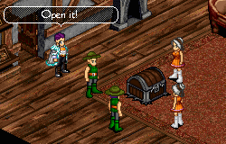

Weeks passed, but the vassals and their entire peasant retinues could not even
budge the chest one inch from where it sat upon the floor of the nobleman's
modest home. Desperate, the noble set a reward for any Aisling who could manage
to release the riches from within the chest.

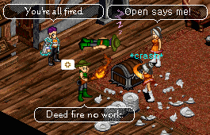

The first to answer the noble's call was a mighty warrior, hefting a giant
stone hammer over one shoulder. He was smiling a confident smile and assured
the noble that the chest would be naught but splinters and flecks of metal when
he was done with it. The nobleman smiled a grin to match the warrior's as the
hammer was raised over the warrior's head, and brought to bear upon the chest.

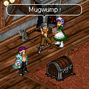

The pair's smiles quickly faded, though, when the hammer bounced off the chest,
not even scratching the lid. Flustered, the warrior took out a smaller axe and
started to chop away, but every blow was deflected off the chest, dealing no
damage.

After a time, the warrior grew so frustrated that he decided to heft the chest
to some remote canyon and toss it in, surely that would do the job. As the
warrior squatted in front of the chest, grabbing both handles on either side,
the nobleman tried to warn the warrior that a legion of peasants could not even
budge the chest, but the warrior scoffed and started to grunt and strain.

A short while later the nobleman heard a sickening popping noise and the
Warrior fell to the floor in front of the chest, screaming in pain, having
failed to even budge the chest. The nobleman sighed, and called for his house
medic to tend to the poor warrior's back and send him on his way.


 Next to the noble's house came a wise and powerful monk, who assured the
nobleman that she would find the proper weak point to strike at the wood of the
chest, and it would surely buckle and fail when so struck. The noble smiled
once more as the monk sat in the lotus position staring at the chest in deep
meditation.

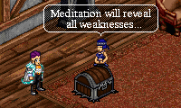

After a time, the monk got to her feet and started to mutter to herself, poking
and tapping at the wood of the chest, mumbling about impossibly perfect wood.
When the nobleman inquired of her progress, the monk became irritated and took
her stance, raising her foot to land the most powerful kick she could against
the lock itself, having found no other weak point.


The kick was masterfully performed, but the force of the blow was once more
deflected, sending the monk flying across the room and through a table. The
nobleman called for his medic once more and once more sought someone to unlock
this elusive treasure.

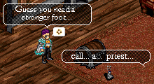

Next at the noble's door was a wizened priest, who claimed
that his deity had spoken to him in a dream, telling him that the key to this
chest was merely mislaid, and if the god were appeased, the location would be
made known.  The noble smiled at this prospect of divine intervention and
invited the priest to stay with him, and ask after any thing he may need.

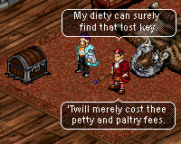

In the weeks to come, the priest kept eating the finest food, accepting tithes
from the nobleman, and spent much time in prayer. When the nobleman finally got
fed up with the priest's excuses of sub-par venison offending his deity, he
demanded the priest locate the key for him or be thrown in irons!

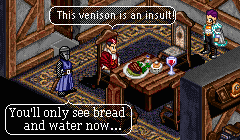

The priest summoned many minions of his patron deity to search the small house
from top to bottom, but succeeded only in making a mess. The nobleman was quite
upset indeed and called for the local guards to haul this confidence artist off
in irons.

Still thinking the key was the solution to the chest, the noble next hired a
rogue who was most skilled with locks that lacked a key. The rogue assured the
noble that there was no lock that she could not overcome, showing a series of
hooks and bits of wire while bearing a cheshire grin.

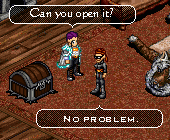

The noble retired for the night, confident the chest would be open come the
dawn. But when the noble came down to the room with the chest the next morning,
he found only a flustered and unkempt rogue, swearing a blue streak. Bits of
metal and other roguely implements lay strewn around the room. Clearly things
had not gone well.

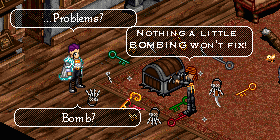

The noble asked the rogue of her progress. She laughed a mad laugh and shouted
about impossibly perfect tumblers and springs. She suddenly stopped mid rant
and that cheshire grin returned to her face.

Upturning her palm, the rogue produced a small bomb, which she placed within
the lock. The fuse was lit and the rogue laughed another mad laugh. When the
smoke cleared from the explosion, however, the chest stood there still, as
immaculate as ever. The rogue swore again and stormed off in a huff.

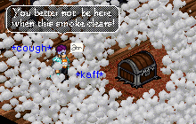

Having tried all other options, the nobleman called upon a wizard to puzzle
upon his dilemma. He fully expected the wizard would probably reduce his entire
house to ashes in a mad fit in the struggles against this impossible chest, but
there were no other options.

The wizard took one look at the chest, and smiled. The noble had seen this too
often by now, and began to plead with the lady to not level his entire house
with some potent magic. The wizard waved her hand over her staff, uttering some
cantrips, ignoring the noble's pleas. When she finished her incantation, she
swung her staff at the chest with minimal force.

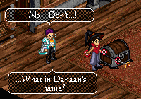

The noble was fully expecting the staff to bounce off the chest as all other
assaults had done, but instead his jaw dropped in disbelief as the staff passed
right through the chest.

Nodding to herself, the wizard began to chant once more. The nobleman barely
managed to string together a few words in his stupefied state when the wizard
cast her spell, and dispelled the illusionary chest.

There, on the floor below, sat a trapdoor. The wizard fished her staff through
the loop and raised the trapdoor to reveal the glittering gold hidden
underneath. The nobleman was still agape, but the lesson this wizard taught him
was surely understood:

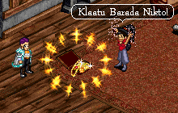

Things are not always what they seem.

***

```
*Librarian Notes*

This entry has been heavily edited to conform to Library formatting.
The original copy of this document has been lost. It has been reconstructed from fragments.
```
