# Ramiel's Blue

_by Ramiel in **Dark Ages**

Once upon a time, in the great city of Mileth, there lived a gloomy peasant boy
named Ramiel. Ramiel's parents, who loved him very dearly, named him after a
very rare plant "ramie", hoping that he will one day grow up to be a tough,
bright and tenacious man. Alas were they disappointed...

Day by day Ramiel wandered in the streets, always looking so depressed and
drown in thought. His family and friends grew concerned about his condition,
but even they couldn't help him out of the problem in his mind.

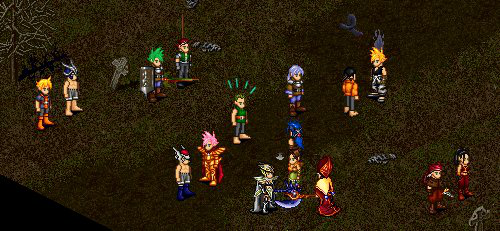 

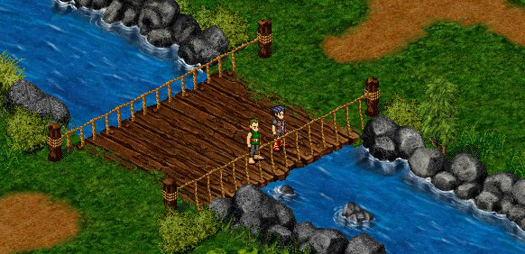

One day Ramiel roamed over the bridge of Mileth River and gazed at his
reflection in the river. He was so deep in thought that he didn't notice
someone standing behind him.

"Greetings young man!"

"Whoa hey!" Ramiel jumped at the sudden hail, "You scared me a bit! Greetings,
sir."

Talking to him appeared to be a man with a shiny armor and some amazingly giant
swords.

"Sorry I scared you over there," said the man apologetically. "My name is
Hikash. What's wrong young man? You seem so perplexed. Is there anything I can
help you with?"

"O thank you sir. Well...” he lowered his head, "I am not sure anyone can help
me...”

"O what's with the pessimism?" Hikash said, "Tell me what's troubling you.
Maybe I can help"

"Well OK." Ramiel paused briefly, "I've been wandering from place to place and
watching people to people. See, my goal is to become the best aisling of this
world. But there is this thing I just can't decide: I don't know what path I
want to be!"

"Ahhh I see," said Hikash with relief. "Well I can't say I am the expert on
path choosing. I am a warrior, so how about I tell you a little bit about my
path?"

"Sure."

"You see, we warriors are the best melee class in this world. Warrior is a path
of bravery and vigor. We also understand weapons and wield them more skillfully
than any other path in this world. I'd say the most strength of our path is the
weapon choices that we have, and the choices become more and more as we gain
insights. Not only do we get to use some of the best weapons that even the most
fierce monsters may fear, but we also get to wear great armors to protect
ourselves from harm," said Hikash, demonstrating some sword skills as he
continued. "Coupled those with our amazing melee skills, we are the best
fighters in Temuair!"

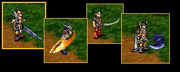

Ramiel pondered over the warrior's words. "So if I want to be a mighty fighter,
and be able to use all those fancy weapons and armors, then warrior is my
choice... But I still don't know what I want." then he walked away.

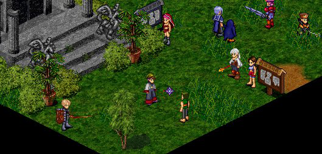

Ramiel walked and walked until he sees Mileth Gate. Standing beside the gate
was the temple of Glioca, the deity of benignity and love. Ramiel stood in
front of the temple and appeared lost in thought, when a priest spotted him
from inside the temple. The priest introduced himself as Ashe.

"Greetings young man. Ah you seem troubled over something. May I ask what it is
that's bothering you?" asked the concerned priest.

"Well, if you want to know... I have this problem and I don't know what to
do...” Ramiel confided his problems to the priest.

"Ahh so you are not sure which path is your path, right?"

"No sir, I am not sure." said Ramiel. "I asked many people, even the attendants
in the temple of choosing. I heard a lot of suggestions. But I still don't know
what path is best for me in order to become a great aisling."

Ashe nodded and smiled. "This is nothing but normal. Many aislings who just
come to this world of Temuair all share the same question: What path should I
choose?"

He paused, then continued, "If your goal is to become a great aisling, what
greater path is out there than the one that allows you to work closely near
gods? The path of priest is the most sacred and probably the most important
path in Temuair. In everyday life, people seek spiritual guidance from us when
they are lost or empty at heart. In battles, we are the ones that keep our
groups alive by healing them and protecting them from harm. We can even do
battle control by hypnotizing or immobilizing our opponents. These are what
make us priests the greatest path in this world"

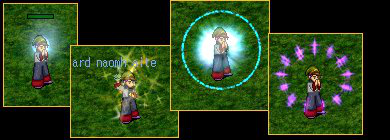

Ramiel nodded. "Yes I agree. Priest is a very important path. If I want to be a
path that will always be needed by people, priest is probably what I want to
be..." he thought," but I still don't know if that's what I want to be."

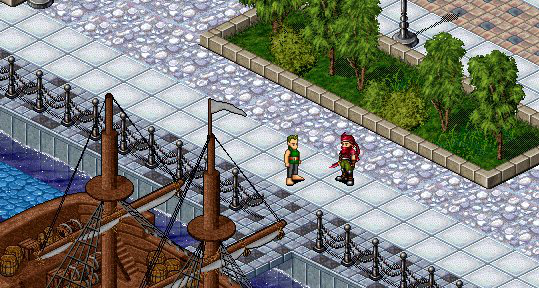

Ramiel kept wandering until he reached the Abel port. As he waited for the ship
to Undine to arrive, he met a rogue who shifted himself like wind.

"Awesome move!"

"Hah thanks! Practice makes perfect." said the rogue, whose name was Gilbert.

"Well you seem to really enjoy your expertise. I wonder if you can help me with
my question...” said Ramiel.

"Sure, I am glad to help"

Ramiel then told him what he had told the others. The rogue pondered for a
short while.

"Hmm interesting. So you want to be a great aisling eh? Well, what will be
greater than being a path of stealth and skills? We might not be the best melee
fighters in this world, but we sure are the most exciting ones! And allow me to
explain. It's every adventurer's dream to explore the world, reach the deepest
crypt, and discover new artifacts. Yet we rogues can accomplish all those
things so easily! Invisibility allows us to travel inside any dungeon like our
backyards, and totally ignore monsters however fierce they may be. We have many
skills to aid us detect monster's possessions and their status. We can snare
them should they chase after us. These advantages, plus our amazing crafting
skills, let us always get our hands on new artifacts firsthand. Being a great
aisling is all about enjoying adventures and new discoveries, don't you think
so?"

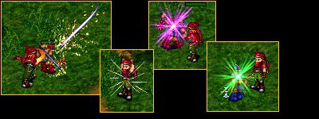

Yes, indeed," said Ramiel. "I would love to have many exciting adventures, if
only I am sure....."

Then he got on the boat to Undine.

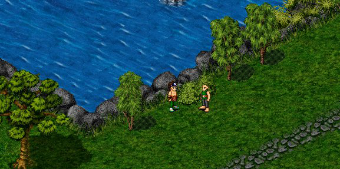

Within about an hour, Ramiel arrived at the city of Undine. Walking to the center lake, he met a monk named Jarron.

"Greetings sir. Sorry to bother your meditation." said Ramiel.

"Not a problem, young one," Jarron stood up and smiled. "I just finished my
daily meditation. Now tell me, what is it that brought you here? People don't
travel for no reasons."

Ramiel then started telling Jarron his problem.

"Then you are lucky to see me today, young Ramiel, because I happen to know the
answer to your problem." said Jarron. "You see, the greatest possible power
ever existed is the power of nature, which is also the source of the
monastery's strength. We study closely the various creatures of this world, and
base our monastery skills on their unique traits. Therefore, we can be as tough
as a draco, as fierce as a kelberoth, or as swift as a white bat. Comparing to
other paths, we monastery can be the most versatile path. We can deal damage as
much as warriors, while being as agile as rogues. We are a tough path to reckon
with."

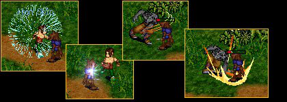

"That is very true about being close to nature," Ramiel agreed, then he lowered
his head. "And if only I can be sure..."

Then Ramiel walked away.

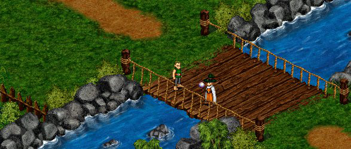

At last, Ramiel came to Suomi, the remote village. As he was about to cross one
of the bridges, he saw a wizard standing on the bridge and contemplating the
deep, blue river.

"Now that's interesting..." Ramiel thought as he approached the wizard.

"Greeting sir. May I ask what you are doing?" asked Ramiel.

"Ah hello young man! Sorry I didn't notice ya. *laughs* Well just contemplating
on one of the million trivial things in this world. *shrugs* Nothing
significant really."

"Well then," said Ramiel, confused, "perhaps you can help me out with my
problem?"

He told the wizard the same question he asked the others.

"Hmm interesting." The wizard pondered for a moment. "It seems to me that your
problem is not because you don't know what to expect from each path, but you
don't know what YOU want."

"Exactly!" Ramiel sighed with relief, "I have asked numerous people. I know the
different strength between each path and what each one of them is all about. I
just don't know if they suit me."

The wizard smiled. "You know, you have a wizardly potential should you choose
our paths."

"Oh how so?" asked Ramiel, curiously.

"Cause you are obviously more of a thinker than a tinker, aren't you?" said the
wizard.

"Huh, well... I guess I am?" said Ramiel.

"Like many of us wizard scholars, you don't take risks easily unless you can
fully understand what you are getting into. But more generally, you just like
to think and question things, however trivial or fundamental they may seem."

"I guess you are right..." said Ramiel, pondering on the wizard's words, "I
like to think about stupid stuff, sometimes even enjoying it."

"Ya we always like to create troubles for ourselves, aren't we?" said the
wizard laughing, "but it is always the trivial things from which the best
knowledge arises, and knowledge is the source of wizards' strength. We are the
masters of manipulating nature's elements, but even though we master elements
by practice, we acquire them by understanding. Later, as we gain more
experience and accomplish more quests, we can even summon elementals.
Ultimately, it is the divine knowledge that we seek."

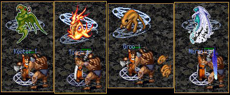

The wizard paused and cleared his throat.

"I don't think there's a simple answer to your question. Some people never even
know what they really want during their whole lives. But the answer usually
lies in the process of seeking it."

"Wow that is intriguing!" said awed Ramiel. "Yes I want to learn more!"

The wizard kindly grinned. "And you don't have to decide right away. You have
all the time in the world."

"Sir, may I ask you to kindly be my mentor?" asked Ramiel.

"Sure, my pleasure"

"Yay! Oh I forgot to introduce myself. My name is Ramiel."

The wizard smiled. "The name is Saradin."

`This entry is incomplete! Apologies.`

***

```
*Librarian Notes*

The original copy of this work is not intact. What we were able to find, is
replicated here. Do you have it? Please contact us.
```
