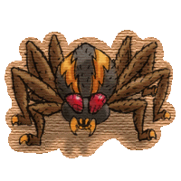
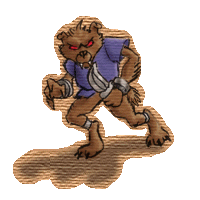
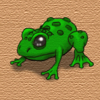

# Bestiary of Temuair

_by Angelic in_ ___Dark Ages___

## Mileth Crypt

Crypt Monsters

###  Rats


The rat is the first monster any young Aisling is likely to encounter in Temuair. This is good because they are also the least dangerous. They are found in the first few levels of Mileth's Crypt. Rats are always passive until provoked. This means that any aisling can walk amongst them without fear, unless they are naive enough to attack one when they are not prepared to fight. Rats can bite back, so watch out.

Rats are a good source of income for a young Aisling. When slain, they often leave behind small bits of rotting food lying around. While not very healthy for an Aisling, this food can be sold to Cian the Alchemist in Mileth for a tidy profit, anywhere from 30 to 250 gold pieces.

|Floor|Experience|
|-|-|
|1|100| 
|2|300|

###  Spiders



Spiders are are the second most common creature in the early levels of the crypt. They are a bit more dangerous and powerful than rats, but overall a good monster to hunt. The majority of Spiders are passive. Occasionally I have come across a hostile Spider, but it is rare. They are usually as safe as rats are.  

Aside from magic items deeper in the crypt, the only things spiders drop are spider's eyes, or spider's silk. This is why they are good for a young Aisling to hunt. These two items go for 500 gold and 1000 gold respectively from Dar the Wizard in Mileth.

|Floor|Experience|
|-|-|
|1|220| 
|2|360|
|3|1,220|
|4|1,940|

###  Centipedes


Centipedes are the first really dangerous creatures you will come across in the crypts. They are the most powerful creatures on the first level of the crypt, and they are also hostile, so they will hunt you down without being provoked. Once you get to the fifth depth of the crypt however they become docile, overshadowed by the more powerful creatures there. 

Centipedes are a bit of a toss up on whether to hunt or not. If looking for money, it can not be denied that the Centipede Gland they leave behind is worth a good 1100 gold to Dar, but it is also rare for centipedes to drop the coveted gland until much deeper in the crypt. Other times, centipedes will drop either the same moldy food rats like to leave behind, or nothing at all. Also note, the gland is something that is required as payment for many of the mundanes to teach an Aisling a skill, so it may be worth more than just money...

|Floor|Experience|
|-|-|
|1|240| 
|2|460|
|3|1,950|
|4|3,250|
|5|3,080|
|6|4,600|

###  Bats


Bats are first found on the third layer of the crypt, They are the most powerful creature of this depth,	Be very wary, this is the first depth where the monsters are magical, and bats are especially fond of casting spells upon unsuspecting aislings. They are hostile, so will use spells upon you from far away, and without provocation or warning.

As for treasure, bats often drop Bat's Wings. These go for 1250 gold pieces to Dar in Mileth. The deeper you go the more often this is dropped, so bats are a good creature to hunt. The third layer is the first in which monsters will often drop magical items and weapons, so keep an eye out for them. Any such items will need to be identified before being put in the bank.

|Floor|Experience|
|-|-|
|3|2,660| 
|4|4,230|
|5|4,850|
|6|6,750|
|7|6,440|
|8|7,940|

###  Scorpions


Scorpions are first encountered on the fifth depth of the crypt. By the time you get this far you should know how to handle yourself well enough that they shouldn't pose too much of a threat, otherwise you had better learn how to run fast.

Scorpions, although rarely relative to other monsters, drop Scorpion's Stings. These are also used to purchase a few different spells, or can be sold to Dar for 5000 gold pieces.

|Floor|Experience|
|-|-|
|5|6,240| 
|6|8,610|
|7|8,500|
|8|11,475|
|9|13,725|
|10|12,420|

###  Great Bats


Great Bats first appear on the seventh depth of the crypt. They seem to have much the same mannerisms as regular bats, but are much meaner. They won't hesitate to blast you with powerful spells, so they are one to watch out for.

The treasure left behind by Great Bats is a good one. Great Bat's Wings can be sold to Dar for 7500 gold pieces.

|Floor|Experience|
|-|-|
|7|11,360| 
|8|14,430|
|9|13,725|
|10|16,800|
|11-12|15,600|
|13-14|17,900|

###  Chests


Chests are first encountered deep within the Crypt, and by this time one ought to have a reasonable idea of how to safely hunt. Yet do not underestimate their sharp and vicious fangs. Their favorite tactic is to try and sneak up on unassuming aislings, but the movements of these monsters is usually enough to make it clear that they are not friendly, yet an aisling who isn't watching may find themselves attacked by what they thought was a piece of furniture.

Like most creatures this deep in the crypt, these chests often hold gold and items of a magical nature for any aisling who slays one to take for their own. Be careful though, the chests and other monsters below the 12th floor of the crypt will start using more powerful magic upon all unwary travelers. This magic includes elemental spells of mor strength, as well as sleep spells.

|Floor|Experience|
|-|-|
|9|17,910| 
|10|21,750|
|11-12|20,900|
|13-14|23,900|
|15-16|21,000|
|17-18|25,606|

###  White Bats


The White Bat is a species of bat that has been warped by the magical forces that can be found deep within the Crypt. These dark forces have twisted the bodies and minds of these creatures, turning many in to aggressive minded monsters that will attack any thing that is hapless enough to wander close by. Though the deeper you get this inclination to attack seems to lesson, they are none-the-less very powerful creatures.

When they do attack, their magically endowed powers come in to full play. Their claws are incredibly sharp and they can swoop in and out of sword's reach very rapidly. Their nature has also imbued them with the ability to cast very damaging spells, and aislings must be extremely careful to try and avoid them. They can often be very difficult creatures to effectively combat.

Yet it is often worth the effort, as they will drop more gold and magical items, in addition to the coveted White Bat's wing, which is needed for several special uses.

|Floor|Experience|
|-|-|
|11-12|22,950| 
|13-14|30,540|
|15-16|28,750|
|17-18|33,100|
|19-20|27,960|
|21-22|31,800|

###  Kardi


The Kardi is a very unusual creature, one that we know very little about. It appears to be a small bird-like being that has no visible means of defense, yet they survive in some of the deepest and most dangerous levels of the crypt. Apparently when excited to the attack or defense, they are very tenacious. They have developed the ability to jump at other creatures with their wickedly sharp claws, and as they slash can rip and tear an aisling apart in moments. Their gentle appearance belies their truly destructive nature.

It is also true that those that live very deep within the crypt, at the edge of their ability to survive, are endowed with even greater magical abilities. Rumors from the few aislings who are able to travel this deep report that the Kardis have been seen exercising the use of ard spells in their defense, this is a power even few aislings can wield. In addition, they have the natural ability to freeze aislings in place, making them unable to move or defend themselves until the ice thaws.

|Floor|Experience|
|-|-|
|15-16|35,490| 
|17-18|40,830|
|19-20|36,825|
|21-22|41,750|
|23-24|36,740|
|25-26|41,140|

###  Maruader


These ghostly apparitions plague the lower depths of the Crypt. They are creatures of magic, and quite likely a byproduct of the dark magical power that emanates from the bottom of the crypt. Their ghostly appearance and ethereal nature often make them hard to spot in poorly lit areas, and they show no understanding of the concept of mercy. They will attack any trespassers, and often tear them to shreds before they have any chance of defending themselves.

It is theorized that they may be servants of the Wraiths and Succubi which live even deeper in the crypt, and that they are used much like guard dogs to warn of an approaching "visitor" to their realm. This is supported by the fact that they are the only creatures that the Wraiths and Succubi allow to live in the areas that they both populate, and that at the very bottom of the crypt the Succubi and Wraiths keep the best Marauders for their defensive strength.

|Floor|Experience|
|-|-|
|19-20|46,530| 
|21-22|52,590|
|23-24|48,075|
|25-26|52,550|
|27-28|45,700|
|29-30|49,660|

###  Succubus


Much can be said about these seductive horrors of darkness. Some believe them to the be ultimate beauty in existence, other believe them to be evil spirits determined to quell the existence of human life, but they are almost universally respected and feared as potent adversaries. Existing only on the deepest levels of the crypt, they can kill an aisling within seconds, using any number of possible means. They are physically strong, and more then capable of casting some of the most powerful magic in existence, and though their favorite tactic is to lure others in to lulled servitude with their unearthly beauty before killing them, they are just as capable of doing so in a stand up fight.

Fear these creatures with your life, and if you see one summoned from their dark home, run as quickly as your feet can carry you. These are not creatures to be toyed with; one look from their eyes can kill a young aisling.

|Floor|Experience|
|-|-|
|23-24|59,010| 
|25-26|65,820|
|27-28|59,625|
|29-30|50,660|

###  Wraith


Wraiths are the most fearsome creatures of the crypt. They are most certainty not of this world, and are likely servants of Sgrios or Chadul, bringing death to all who enter their domain. They wear thick robes that conceal their true nature but it is likely that they are much like the Marauders, ghostly and ethereal. The only thing that anyone can see are their bright eyes that burn through an aisling like a knife. Aislings can become bewitched, and as they stand there watching this creature of ultimate darkness, it will be readying its scythe to cut them down.

These creatures are even more fearful and awesome then the Succubi, fear them with your life! Unless you are a very powerful aisling traveling in a strong group, run upon sight of one of these fearsome abombinations, otherwise it is extremely likely that you will lose your life. These are not creatures to be toyed with, and would take great pleasure in denying any aisling of their life, and bringing another one of their master's scars upon them.

|Floor|Experience|
|-|-|
|27-28|72,990| 
|29-30|64,575|

### Dragon


The Legend of the Dragon is steeped in mystery. It sits at the bottom of the Crypt, encased in stone, and missing its head. Some believe that a Great Hero of ages ago used his magical abilities to turn the Dragon's skin to stone, and then removed the Dragon's head to ensure that it would never again awake. Other Legends point to the Headless Stone Dragon as a prophecy, believing that one-day it shall again awake to rule over Mileth and the surrounding area. The Legends are far too many to discuss here.

|Floor|Experience|
|-|-|
|31|???| 

## Eastern Woodlands

Eastern Woodlands Monsters

###  Vipers


Although many think that the viper would have a dangerous poison bite, it does not. It is actually a rather weak monster, and young aislings may take it on to learn more of the ways of combat. They are passive, and will not attack you until you hit them first.

Vipers often leave behind Viper's Glands. These can be sold to Cian the Alchemist in Mileth for 137 gold pieces.

|Area|Experience|
|-|-|
|1|100| 
|2|340|

###  Wasps


Ahh the wasp. Although rather large, they are only one step up in power from the Viper. Sometimes they will hunt down Aislings, but are much more often than not passive, and can be walked among freely.

 Wasps leave behind a wide variety of treasure, with many uses. The Bee's Sting can be sold to Dar the wizard in Mileth for 400 gold. Raw wax, an item needed to learn a few early priest spells, goes to Devlin the Fae Priestess for 50 gold. She will also buy Raw Honey for 125 gold, but this is a toss up because Aislings can eat Raw Honey to regain vitality. Finally, Royal Wax can be sold to Devlin, yet again, for 600 gold pieces.

|Area|Experience|
|-|-|
|1|220| 
|2|380|
|3|1,060|
|4|1,940|

###  Mantises


Mantises are the first truly hostile creature encountered in the Eastern Woodlands. They attack without warning and blend in very well with the foliage, so are very dangerous. Keep your guard up for these ones.

The treasure that the mantis drops is the Mantis Eye. It is one of the most abundant, and valuable items that can be found in the early areas anywhere in Temuair. They are a very good source of income for any young Aisling that can stand up to the pain mantises like to dish out. Mantis Eyes go to Cian the Alchemist in Mileth for 1500 gold pieces.

|Area|Experience|
|-|-|
|1|260| 
|2|460|
|3|1,950|
|4|3,250|
|5|3,080|
|6|4,460|

###  Wolves


Wolves are first found in the third area of the forest, and like to wield powerful magic against Aislings trespassing in their territory. They are hostile, and like any hostile creature attack on sight in most situations.

An important thing to know, in the third and fourth areas of the Eastern Woodlands, wolves are a very good source of both Holy Hermes and Magus Ares staves. I imagine they like the glittery gems embedded in these powerful magic weapons. Any priest or wizard will be very happy to get one of these.

Wolves drop several different kinds of treasure. Wolf Skins can be sold to Steinar the Abel Armorsmith for 300 gold pieces. Wolf Fur will go to Arnljot the Abel Higgler for 700 gold. Finally, the rare and coveted Wolf's Lock can be sold to Devlin the Fae Priestess of Mileth for 6500 gold pieces! Quite a price for a bit of hair.

|Area|Experience|
|-|-|
|3|2,610| 
|4|4,230|
|5|4,850|
|6|6,750|
|7|6,080|
|8|8,360|

###  Kobolds



Kobolds are some of the first truly intelligent enemies you will have to face in battle. Not only do they stand upright, they wield sharp daggers that hurt much more then the claws of a wolf or mantis. Watch out for them, because in almost all situations, if you see one, another is sneaking up behind you.

Kobolds are a very good source of treasure. Occasionally, when a Kobold is killed, its Skull can be saved and sold to Bodil the Abel Combat Skill Master for 1150 gold pieces. Aside from this, Kobolds like to collect money, and often they will be carrying anywhere between 1000 and 5000 gold pieces on them into battle.

|Area|Experience|
|-|-|
|5|6,240| 
|6|8,610|
|7|8,500|
|8|10,950|
|9|10,950|
|10|12,420|

###  Goblin Soldiers


Goblin Soldiers are fearsome indeed. They are big, very strong, and wield a nasty spiked club. Not only are they fearsome on their own, but they like to employ the same tactics that Kobolds do, most importantly striking in groups. In fact, Goblin Soldiers and Kobolds can often be found working together to kill any aisling that wanders by.

Goblin treasure is nearly identical to that of Kobolds. Not only do they like to carry similar amounts of money with them, the skull of a Goblin can also be sold to Bodil. A Goblin skull will go for 1500 gold pieces.

|Area|Experience|
|-|-|
|7|11,340| 
|8|14,430|
|9|14,235|
|10|16,800|
|11|15,040|
|12|18,500|

###  Goblin Warriors


The Goblin Warrior forms the brunt of the Goblin's military might. They are also among the most respected members of Goblin society, and tend to be able to get away with whatever they want, unless they cross the chief or the guards. Warriors often arm themselves with crude axes, relatively easy for goblin craftsmen to make, and protect themselves with either crude, leather, hide, or metal armor, or even better, they steal it from aislings and other travelers that they have slain.

They are very capable in one-on-one combat, and have a rudimentary understanding of tactics that allows them to coordinate themselves and the lesser soldiers to often ambush a group of aislings, and try to take them down through superior numbers. Though they are not the smartest creatures, they are endowed with innate magical abilities which must be respected. If one moves very deep in to the woodlands they will soon face Goblin Warriors who can wield mor spells, as well as sleep and cradh. These are definitely creatures to treat with respect and caution, until one is used to dealing with them.

They commonly are carrying moderate amounts of gold, as well as varying magic items. Like their smaller brethren, the soldier, it is also easy to remove their skull, which is used in many magical formulas and is somewhat valuable, about 1500 gold each. They can be a good source of revenue for aislings who are strong enough to meet them on the field.

|Area|Experience|
|-|-|
|9|17,910| 
|10|21,750|
|11|20,200|
|12|23,900|
|13|21,000|
|14|25,060|

###  Goblin Guard


he best of the best, when it comes to Goblin warriors, the Guard is basically what we would consider a warrior order within goblin society. It is made up of the meanest, toughest, biggest, and strongest goblins, and their supposed purpose is to protect the Goblin Village and Chief. Yet they are also the most blood thirsty of goblins, and many of them head out to the field to face aislings in combat, to test their own strength, and to kill for sheer pleasure.

These goblins are often massively built, larger then any other goblins, and armed with the best weapons and armor they can come by. In addition, any other goblin will follow a Guard's commands regardless of whether or not they want to, and Guards can often be seen throwing all of the soldiers and warriors in an area at their opponent before they themselves move in to engage them. This tactic can be extremely effective, as by the time the Aislings are done fighting off the swarm of lesser goblins, they will be exhausted, only to look up and see a large lumbering Goblin Guard descending upon them, with mace in hand ready to kill each and every one of them.

They also carry reasonable amounts of gold, and can often be found using magical items, though never very effectively... in addition their skulls are just as valuable as those of other goblins, about 1500 gold a piece.

|Area|Experience|
|-|-|
|11|25,920| 
|12|30,540|
|13|28,750|
|14|32,225|
|15|28,700|
|16|32,600|

###  Hobgoblin


The origin of the sub-species of goblin, known as the hobgoblin is uncertain. They are often twice the size of their smaller brethren, with large muscles and blue skin, yet their mental faculties seem to be even poorer then that of the other goblins. It is largely believed that these creatures have been warped by the dark energy found in certain areas of the woodlands. These mutations have left the Hobgoblins with incredible physical strength and stature that allows them to wield their massive clubs more effectively then the best Goblin soldiers can wield their bladed weapons.

They tend to wander around aimlessly searching for anything they can kill. Most of them are very aggressive and will attack upon sight; a few of the older ones that have wondered deeper in to the woodlands have lost their will to fight, and seem to just wander aimlessly until attacked. They are fearsome creatures, and one ought to be cautious when approaching them. Yet, once an aisling is strong enough, hobgoblins will no longer be a threat.

They are very found of shiny objects, and carry small amounts of gold, as well as other magical items. It seems as if the ones deeper in the woods are especially found of mythril gauntlets, and other mythril equipment, which can often be found on them after they are slain. In addition Hobgoblin skulls are used for their magical properties by mundanes, and can be sold for 2500 gold pieces to Bodil.

|Area|Experience|
|-|-|
|13|35,490| 
|14|40,830|
|15|36,825|
|16|42,800|
|17|35,900|
|18|40,240|

###  Shrieker


The shrieks of these mutant creatures can be heard echoing far from where they are. These cries often send a chill down the spines of aislings, because they know that they are in for trouble if they get much closer. Resembling a mushroom, these creatures seem to have mutated from those fungi. Like the Hobgoblins, it appears that the dark powers within the woodlands have caused this, and their behavior seems to be very similar.

Shriekers are very large, and use their gaping maw to rip and tear their food, often aislings, and can cause incredible amounts of damage in a short period of time. In addition they have an innate control of the elements, and bring magical devastation down upon anyone who gets in their way.

Though they are strong, they are not very smart. They are among the easiest creatures to outmaneuver, and never use any semblance of tactics when they are encountered. They simply rampage around biting at whatever comes in reach.

Their stomachs often contain gold and other magical items, and for some reason the rare Zeus as well. When they are slain it is very easy to remove these, and they can make this creature profitable to fight.

|Area|Experience|
|-|-|
|15|46,530| 
|16|52,590|
|17|47,000|
|18|52,550|
|19|45,760|
|20|49,660|

###  Wisp


Wisps are a magical creature found deep within the woodlands. Their origins are unknown; all that is known is that they have been reported as legends throughout history. They are ethereal beings, who are nothing more then a brilliant shining light, so bright that if looked at directly they can easily blind an aisling.

It seems that they have some kind of territorial instinct, because they will attack any aisling who enters their land. Whether this is because they are aggressively natured, or just because they feel compelled to defend their territory from aislings is unknown, but the truth is that their attacks can be very damaging to anyone unfortunate enough to happen upon them. They use their magical powers to attack aislings with an unseen force. And though it appears nothing is happening, the aisling under attack can feel the pain and their life force being drained.

Wisps are also effective wielders of more traditional magic, and can cast mor and ard spells, as well as freezing their foes. Although the ones encountered early on don't show a very developed ability to wield magic, those in the deeper areas have magical abilities that are definitely to be feared.

|Floor|Experience|
|-|-|
|17|59,010| 
|18|65,820|
|19|58,400|
|20|50,660|

###  Faerie


The Fae are found in only the very deepest regions of the woodlands, and two theories exist concerning their nature. One theory, held primarily by those who hunt here often, believe that the fae in these regions have been twisted by the same dark forces that have twisted the hobgoblins and Shriekers, and are therefore evil creatures. The other theory is that this is the last bastion of the fae, and their warriors fight to defend their people from any intruder.

Theories set aside, the warriors of the fae are very powerful enemies. They dart around quickly, using their small but very refined blades, to slice their opponent apart. Though they are not extremely tough, they are very difficult to hit, giving them even greater survivability then the larger creatures of the woodlands. In addition they are masters of magic, and are not afraid to wield it against any comers.

In general, these are creatures to be greatly feared. Whether or not they have peaceful intentions, they consider all who step in to their territory intruders, and will attack them on sight. Do not go wandering in to the domain of the fae, without a very strong group, unless you don't value your life.

|Floor|Experience|
|-|-|
|19|72,990| 
|20|64,575|

## Piet Dungeon Monsters

Piet Dungeon Monsters

###  Frogs



Frogs are among the many semi-aquatic creatures that make their home in the upper levels of the Piet Sewers. They are large compared to most frogs, and much more fierce.

They are not very aggressive creatures, and will usually not bother anything that leaves them alone. Yet they posses slightly greater intelligence then the average frog and they find many ways of hurting unwary aislings. So though they are the weakest creatures to be found here, a young aisling should be careful when first attacking one.

Frogs are obviously not known for the massive wealth they accumulate, but at times do find items that will be of interest to Aislings, these can be easily recovered when a frog is slain.

|Floor|Experience|
|-|-|
|1-2|3,607| 
|3|4,817|

###  Crabs


Crabs are one of many of the creatures that managed to crawl its way from the nearby ocean in to the tunnels under Piet. They are truly aquatic creatures, preferring to live in areas with substantive water supplies. The tunnels provide them with easy access to large areas of damp tunnel not far from their water holes, in which they can freely roam without fear of dehydration.

Crabs are slightly tougher then Frogs, their hard shells providing them with greater protection and their claws being able to cause much greater damage. Yet they too are relatively weak creatures, and an aisling can usually walk amongst them without fear as long as he leaves them be.

|Floor|Experience|
|-|-|
|1-2|5,238| 
|3|6,858|
|4|6,566|
|5|9,029|

###  Anemones


The Anemones found in the tunnels of Piet have mutated from those found in the ocean. How exactly they found their way in to these tunnels is unknown, but those that survived seem to have slowly developed the ability to survive outside of the water and to maneuver rapidly to entangle their prey. They are much more dangerous then their water-locked brethren, and their plant like appearance often belies their true ferocity.

They are more powerful then either the Frogs or the Crabs, and are the first truly powerful creature that most aislings will encounter in the tunnels. They seem to enjoy hunting aislings as a source of food, using their tentacles and poisonous venom to entangle and then kill an aisling, and then rending them apart with their vicious maw. They move very rapidly considering their growth, seemingly sliding along the ground like a fast moving slug or snail.

Like the other creatures that have lived for such long period down in these tunnels, they seem to be imbued with some form of natural magical ability, and can wield spells that can devastate lower-insight aislings.

|Floor|Experience|
|-|-|
|1-2|6,739| 
|3|9,299|
|4|9,180|
|5|11,826|
|6|10,865|
|7|13,975|

###  Turtles


Turtles are a well-known sight in Temuair, yet the larger breed that habituate areas of the Piet tunnel system are not the same harmless little creatures that we find near ponds and lakes. These massive turtles have thick armor-plated shells that deflect incoming swords like they were sticks, and massive jaws that can easily sever fingers and even entire limbs if an Aisling gets too close.
  
Even their feet have become more dangerous, now mounting large claws that can slice right through light armor and flesh. It is best for young aislings to avoid these creatures if they can; though once an aisling is stronger they will find that the armored shell is not impossible to crack, and once broken through the turtle is nearly helpless.

They rarely have anything of value, though sometimes items of a magic nature can turn up when one is slain.

|Area|Experience|
|-|-|
|4|12,247| 
|5|15,584|
|6|15,471|
|7|18,846|
|8|16,243|
|9|19,332|

###  Brawlfish


Brawlfish are a truly bizarre creature. They have apparently mutated, much like the anemones have, originating from fish that somehow migrated to the tunnel system from the ocean. Either through magical forces or natural selection these creatures grew lungs and adapted to the rigors of surviving on land. They now resemble snakes almost as much as they do fish, slithering around on the floor with the same familiar motion as a viper in the woods.

Yet their method of combat is different, and though they have massive jaws filled with razor-like teeth, they are not capable of the snake's quick strike. Instead they use brute force, attacking with their jaws and massive horn.

When first encountered on the 6th depth of the tunnel system, it is highly advised that an aisling be wary and test his strength against one carefully. Though it is possible to easily defeat them once more experienced, they are very capable of killing aislings who are not ready for them.

|Area|Experience|
|-|-|
|6|19,343| 
|7|23,490|
|8|22,572|
|9|26,649|
|10|23,393|
|11|27,065|

###  Kraken


Nearly every creature found within these tunnels is bizarre in one way or another; the Kraken is no exception. A legendary monster, for centuries it has been a great fear of sailors to run in to one of these while sailing on the Great Oceans of the world. Yet somehow a certain sub-breed have managed to work their way in to the lower-levels of these tunnels, making their home there.

Like their ocean-brethren they attack by using their tentacles to lash out, trying to entangle their foe, and then drag them in toward the massive maw that lies underneath their body. Their beady eyes can be seen for long distances, as they watch their prey and begin to quickly move toward them, using their tentacles in a kind of running lope that is impossible to comprehend. These are creatures that must be feared by most aisling of Temuair, watch yourself when around them.
  
|Area|Experience|
|-|-|
|8|28,026| 
|9|32,983|
|10|31,050|
|11|35,748|
|12|30,996|
|13|34,344|

###  Gruesomefly


One of the most bizarre creatures to be found in Temuair, the Gruesomefly is almost certainty created by some mad-wizard's experiment gone awry. They occupy many of the deepest depths of the tunnel system, where the air and ground have become less humid and therefore unable to sustain the nearly aquatic life found above. Down here the Gruesomefly swoops around carried aloft by two wings, very similar to those of the fae. Having no body, the two wings are simply attached to its skull-like head. It's only additional features are two antennae that protrude from the head, apparently to aid the Gruesomefly in finding prey.
  
Needing no form of physical sustenance, this is a creature that stalks and kills out of sheer pleasure. It's grinning face haunts the minds of many aislings and other creatures that have been victims of its cruel games; often toying with their minds before swooping in for the kill. This is a dangerous creature, and shows no remorse or mercy. When encountered it is probably best to defeat it or run before it has a chance to start attacking with its teeth and magic.

|Floor|Experience|
|-|-|
|10|38,320| 
|11|44,096|
|12|39,771|
|13|45,090|
|14|38,772|
|15|44,431|

###  Rockcobbler


The Rock Cobbler is a creature that seems related to the horses and cows of Temuair. Most likely through dark magic, they have been endowed with a thick armor shell unlike any other natural armor in the world, and massive hoofed feet that can easily trample any aisling who get in it's way. It lives only in the deepest areas of Piet's tunnel system, apparently enjoying the lack of sunlight, and needing little food or water to survive.
  
In areas where these creatures dominate they are found to be extremely territorial, attacking anything that they feel is intruding upon them, this includes aislings. Further down they are not quite as aggressive, and will often let an aisling walk by without taking notice.

These creatures are not inherently evil, and would prefer to live their life out in peace, yet they fight hard to defend what they feel is their land, and they do so well. Their armor-plated hides and stamping feet are a fearsome combination for all but the strongest of aislings to face without fear.

|Floor|Experience|
|-|-|
|12|50,252| 
|13|56,797|
|14|50,760|
|15|56,754|
|16|48,406|
|17|53,633|

###  Gogs


No one is sure where the Gogs first originated. Some attribute it to work of the Dark Gods; others point to magical mutation, and experiments gone wrong. Whatever sparked their creation, there is no denying that these are almost certainty the most bizarre creatures to be found anywhere in Temuair.
 
Massive and covered by purple ruddy skin they move around on three stumpy legs in a manner that seems almost impossible and hides their true maneuverability. They have two mouths, one at the end of their long prehensile tail, and the other occupying a huge cavity in the center of their body. There are no eyes nor any other sign of sensory systems, yet the Gog has no problem finding its way around and engaging other creatures in very deadly combat.

These oddities are to be feared and avoided by all but the most powerful of aislings. They are easily the equal of the nefarious Succubus, and can swallow young aislings in a single bite of their massive maw.

|Floor|Experience|
|-|-|
|14|38,772| 
|15|71,086|
|16|64,395|
|17|54,714|

###  Gremlins


The deadliest creatures to be found in these tunnels, the Gremlin's appear to be distant cousins to the great Draco's and Dragons of ancient lore and legend. They are found only in the deepest levels of the Piet tunnel system, and seem to enjoy hunting Gogs and Rock Cobblers. If any aisling has ever fought either of the Gremlin's primary prey, they can probably imagine how powerful this creature must be to easily bring them down.

They can move very rapidly on their two powerful hind legs, and seem to have a very cunning and keen intelligence, unlike any other creature found here. Once they close with their prey they use their clawed forearms to attack with, as well as their massive legs in both kick and jumping strikes.

Yet neither of these forms of attack are as terrifying as the great beast's massive jaw. Once it gets close enough to its prey it begins lunging forward with its head, tearing huge chunks of meat off and breaking right through almost any form of armor. All aislings, even the most powerful, must beware of this creature. The only way to defeat it, is to work in a group of other equally powerful aislings.

|Floor|Experience|
|-|-|
|16|78,829|
|17|69,741|

## Abel Dungeon Monsters

Abel Dungeon Monsters

###  Leeches


There are three basic types of creatures that occupy the Dungeon beneath Abel's beach. The first of these are the ground crawlers, creatures that slither along the ground with no arms or legs. The Leech is one of these, and although it is the least powerful creature in this dungeon they are still quite fearsome beasts, being more powerful then most Goblin Soldiers.

These leeches are giant cousins to those that find their homes in the swamps and marshes of Temuair, and have grown massive armor plating over their soft bodies. This gives them much better protection, making them more difficult to slay, and giving them ample opportunity to drain their prey of its precious life-blood.

Almost all of these creatures aggressively attack their prey once it they sense it, which can make them quite dangerous when an aisling is already fighting another beast. In addition, it is very important to remember when fighting these creatures that it's critical to avoid allowing their sucker-like jaw to take hold. If it is engaged it is extremely painful to remove, tearing the flesh of the victim and causing considerable damage.

If exploring this dungeon be wary of these beasts on your first encounter; use reasonable caution. The simple appearance of these creatures belies their true strength, and unfortunately, like almost every other type of monster in this dungeon, they carry no gold and only rarely can an item be found in or around them.

|Floor|Experience|
|-|-|
|1|15,600| 
|2|18,500|

###  Glupes


Glupes are a very strange creature, composed entirely of a blue jelly-like substance. Bearing no relation to any normal creatures they are most likely beings twisted or created by magical forces. The only apparent features on their body are their two large eyes, which are fully functional allowing the to easily spot and track any intruders.

They are extremely adept at manipulating their body in to various shapes, using this technique not only to move, but also to form arm-like appendages for clubbing their opponents. These clubbing attacks can be very vicious; hitting with a strength that seems impossible for these creatures to exercise. In addition, their fluidic body allows many attacks to pass clear through them causing little or no damage to the actual creature. This can make wounding them extremely difficult.

Overall the Glupe is a relatively dangerous creature, but after an aisling has learned to effectively fight them, they can be handily dealt with.

|Floor|Experience|
|-|-|
|1|20,900| 
|2|24,675|
|3|21,660|
|4|25,060|

###  Slugs


Slugs are much like the leeches, large versions of their more common cousins. These slugs slide along the ground, looking for almost anything to eat, including aislings. Although it seems difficult for these creatures to be very dangerous they are adept at launching physical attacks, often using their entire body to lunge in to their foe.

Like most of the creatures in this dungeon they also can control the basic forces of magic, and some of the more developed slugs even wield the powerful magic of cradh, pramh, and mor spells of varying elements. These creatures are rather aggressive, and can be very dangerous in large groups. When on lower levels and fighting more powerful creatures, keep your eyes open for groups of slugs moving in to attack you from the side and rear.

|Floor|Experience|
|-|-|
|1|25,950| 
|2|30,540|
|3|28,750|
|4|33,100|
|5|27,960|
|6|32,600|

###  


Spores are the first of the second type of creature, the floating pods. They resemble some form of fungus, floating around using magical energy, and defending themselves by launching clouds of thorn-like spores that can cut through flesh and armor.

Exactly why they attack aislings is unknown, perhaps they feel a collective sense of territory and feel the need to repulse anything that they don't feel belongs there, or perhaps whatever magical energies created them imbued them with aggressiveness against other living creatures. Either way the spores are one of the most common creatures of the dungeon, and often make up the majority of the creatures that a hunting party will encounter.

Like most creatures here, they do not collect gold, and only have very few items.

|Floor|Experience|
|-|-|
|3|40,830| 
|4|40,830|
|5|36,825|
|6|42,800|
|7|35,900|
|8|41,140|

###  Polyps


Polyps are the second of the floating pods and they are nothing short of bizarre. Large yellow creatures that somewhat resemble floating jellyfish, they have a long tentacle that hangs down beneath their body. They use this stinging appendage to attack their prey, trying to entangle and stun them, allowing them to start slowly digesting the victim.

Although they appear to lack any intelligence these creatures are still rather difficult foes, and on the deeper levels of the dungeon they can be lethal opponents for even extremely powerful aislings to battle.

|Floor|Experience|
|-|-|
|5|46,530| 
|6|52,590|
|7|47,000|
|8|53,700|
|9|45,760|
|10|49,660|

###  Dwarves


According to most reports these dwarves are descendants of the ancient Dwarven Empire, but dark magic has twisted them into foul beings of chaos and destruction. Their great strength, endurance, ability to wield magical forces and willingness to attack any aisling who happens their way support this theory. Yet at the same time, others point to the dwarves' willingness to craft powerful Iplet, Emerald, and Hy-Brasyl plate for high insight warriors as a sign that these are not evil beings, but simply dwarves trying to defend their home from surface dwellers.

Either way these creatures are very good at defending themselves. The same massive builds that help them in mining allow them to wear armor and wield massive axes and picks that can easily penetrate most aisling's armor, making these dwarves among the most powerful foes for any aisling. But perhaps their most fearsome ability, is the power of suain, used to freeze an aisling in their tracks. Beware the power of suain, if not careful it will easily decimate an aisling party.

Dwarves often carry large quantities of gold on them, as well as magical items that they have found while digging. If aislings are strong enough to fight them, they are among the most profitable of creatures in this dungeon to fight.

|Area|Experience|
|-|-|
|7|59,010| 
|8|58,400|
|9|58,400|
|10|50,660|

###  Dwarf Soldiers


The largest and most powerful dwarves dedicate their lives to the defense of their brethren, and learn to wield incredibly massive axes that they swing with mighty blows over their head. In addition they wear heavier armor then the smaller dwarves, allowing them to take much more damage.

Besides their amazing physical prowess they are adept at luring aislings in to traps, ambushing them with overwhelming force and using their fearsome magical and physical powers to incapacitate and then destroy.

Using immensely powerful magic including suain, mor cradh, and ard spells, these Dwarves can halt an aisling group in its tracks, and descend upon it with axes and spells flying, ripping it apart before it even has a chance to defend itself.

Beware these dwarves; they show no mercy and no compassion. They will kill without a second thought, and are far mightier then all but the most powerful aislings. Always approach them with caution and care.

|Area|Experience|
|-|-|
|9|72,990| 
|10|64,575|

## Afterword

_Revision History:_
- Volume 1:	
-- Lower levels of Mileth Crypt and the Eastern Woodlands
- Volume 2:	
-- Completed Mileth Crypt and Eastern Woodlands. Added complete Abel Dungeon, and Piet Dungeon


_Volume 1: Compiled by Bentic_  
_Volume 2: Compiled by Angelic_

_Special thanks to the following for assistance:_  
_Dartanian_  
_Mauve_  
_Nenya_  

***

```
*Librarian Notes*

This work is one of the greatest treasures of Temuair.

This entry has been edited to conform to Library formatting.
The original can be found at http://www.darkages.com/2002/community/lore/Angelic_Beast/index.html .
```
