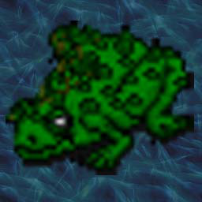
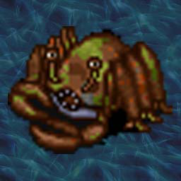
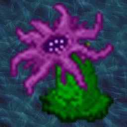
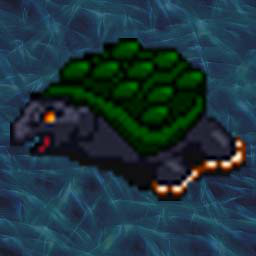
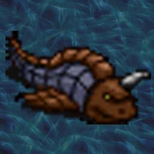
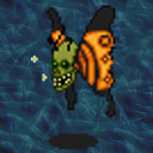
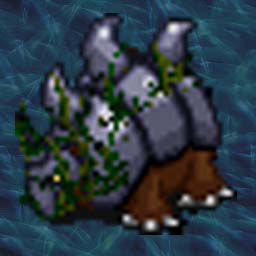

# A Cook's Guide to the Piet Sewers

_by Ariadne in_ ___Dark Ages___

Welcome to the Sewers!

Not too many Aislings ever express much interest in this site, which is a shame, since it is such a great source of certain delicacies not found anywhere else in Temuair. Of course, good eating aside, the sewers hold their fair share of dangers for the unwary. However, I, Ariadne Jaelithe, have undertaken the task to plunge these depths for you and recover this information at great personal risk. In addition to describing the various creatures that live here, I have also included some information on what possible experience you may gain from slaying some of these critters. The usefulness of this information is debatable... for instance, the more insight you have, the less you will receive from these beasts, and if you are in a group you gain even less. Take these numbers then as a guide as to the relative challenge each critter may pose to you.

To reach the sewers, enter Piet and cross the bridge to the west, then head south to reach the southernmost point in town, passing the stables on the way. In appearance the sewers resemble the crypts of Mileth, but don't be fooled... the difference will be apparent once you enter. It has recently come to light that the sewers link up with the Mehadi swamp, which is located near Piet, and bear some remains of the reclusive Mukul civilization. Pith helmet and digging tools in hand, I searched high and low but found no conclusive signs of this civilization. However, not even I can claim to have seen everything there is to see down there. (As an interesting note, pith helmets were available from the bank in Piet for 1 million gold for a time... but I spoke at length with the banker and he told me that too many unprepared Aislings were buying these helmets and going to their deaths in the sewers hoping to find great treasures and lost artifacts. This item has been discontinued as a result. There's just something about a good pith helmet that inspires one to feats of Archaeology.)

Very young Aislings will find themselves unable to enter these sewers. Those I have talked to about it are not in agreement on how much insight you need to be able to get in, but the usual answer is you need thirty insight at least to get in. I found this to be untrue, as I have been there myself with Aislings who had not reached thirty yet. But, due to the difficulty of the creatures you will find there I certainly don't recommend going down there with less than thirty insights if you are alone... and even those who have that much may not be safe going more than a few floors down. After you have been in the sewers for a bit, you will notice that the creatures here don't drop much in the way of treasures. Being sea life there's no need for them to really have any, and many frustrated hunters have given up on visiting this area due to the lack of "loot". The beasts here do occasionally have items of interest, such as gems and consecrated items, but you are better off expecting to receive nothing but the glory of a battle well fought. Also, if you look around you will see signs saying you are in the "Piet Dungeon"... fear not, you are in a sewer.

Well, enough of my ramblings. Below you will find descriptions of most of the creatures I have encountered on my travels through the sewers. I hope you will find them as fascinating as I did. As a last warning, all of the creatures here are fully spell capable... and you will find no 'beag' versions of the attack spells here. Early on, it seems that sal is the spell of choice, but lower down others become just as common. Having a fire attack is also recommended as it seems to work well on these beasts (no surprise, since they are sea creatures mostly). Consider yerself warned...

_Ariadne Jaelithe,_  
_Rogue of Rucesion_

## The Monsters



The FROG is the first creature you are likely to encounter on your visits to the sewers, and is the most "harmless" one you will find there. The favorite attack of these creatures is to lash out with their long tongues (which are not venomous, luckily) to try and draw you into their gaping mouths. This shows the relative stupidity of these beasts as they have no teeth of any kind! Perhaps they expect to "gum" Aislings to death... but don't laugh too hard, as their attacks with their feet are harmful enough. The legs of these frogs also make very good eating. The best recipe for frogs' legs I have seen involves baking them in a pot with Suomi cherry sauce. Some of my friends advocate using Suomi grapes instead of cherries, but I feel the tartness of the cherry does a better job of concealing the legs' occasional muddy flavor. While aggressive at first, these creatures become quite docile by the third floor.

|Floor|Typical Experience|
|-|-|
|1st|3326|
|2nd|3607|
|3rd|4817|



Also encountered at the very beginnings of the sewers is the giant CRAB. These creatures like to swipe with their vise-like pincers and are a little reminiscent of the Mantises from the woodlands. After you kill them, those Aislings who are musically inclined can use their claws like castanets. I do not recommend trying to eat these crabs, however. The muddy flavor sometimes found in the frog is all-pervasive in these crabs and is only removed by boiling the crab for at least a day, which can have the side effect of removing all flavor whatsoever. Those gourmets who eat the crab after a few hours of boiling are recommended to do so with brandy, which helps cleanse the palate. Those who really have a craving for crab are better served by getting some from the Abel fishermen, or by searching the lakes at Undine, which also have a very tasty species. While hostile at first these beasts start to be more passive near the fourth floor.

|Floor|Typical Experience|
|-|-|
|1st|5100|
|2nd|5238|
|3rd|6566|
|4th|6955|



One of the most interesting animals is the ANEMONE. An invertebrate, the normal sized versions of these beasts are immobile, resting on the ocean floor and allowing ocean currents to bring small shrimp and plankton past their ring-shaped mouths. I was unable to determine the origins of these enlarged critters (but a Wizard is to blame, no doubt) but they have their own uses. Killed and dried, these anemones are used by the sewer cleaners of Piet to scrub the sewers when they become clogged. It is the presence of these monsters that makes the lower floors of the sewers so dangerous for young Aislings... in addition to grabbing with their tentacles they also spew spores from their mouths (underwater, these spores turn the surrounding area black to help protect the anemone). These spores do not leave any lasting poisons in your body, but you still suffer coughing fits and should avoid breathing them in, if at all possible. As if these beasts were not deadly enough, they are also very good spell casters- you are more likely to be hit by a spell from one of these than any other creature. Anemones are found all the way down to the sixth floor, and are vicious to the core wherever you find them. (Make no attempts to eat these... they are highly toxic! I had a small piece as a sample and was ill for a week. I have heard rumors that some Monks have the secrets to safely prepare these for Aisling consumption, but no Monk I have ever met has admitted to this ability)

|Floor|Typical Experience|
|-|-|
|1st|6600|
|2nd|6739|
|3rd|9180|
|4th|9299|
|5th|10865|
|6th|11826|



Down on the fourth floor you will start to encounter the lumbering TURTLE. Which is just as well, since the frog has disappeared by this depth. I must confess, I found the turtle to be the best eating out of any creature here. First, get a cauldron large enough to hold the critter full of boiling water. Then, drop in a live turtle (these are quite heavy, and may require as many as four Aislings to lift, unless some of those are warriors). Boil the turtle for at least an hour, then remove it from the cauldron and crack the top and bottom halves of the shell apart. This takes some skill to do, and you must be careful. Sometimes when you attempt to crack the shells apart they break and spill the cooked turtle all over your floor. Once the shells are separated you then eat the turtle straight out of the shell. This serves about 4-6 Aislings and goes well with wine and baguettes. Save the water from the boiling, too, as it makes excellent stock for turtle soup. Dump in some chopped carrots and potatoes and you can have a week's worth of soup for an entire family. These turtles are what I like to think of as "medium aggressive" (as are most of the others that follow), which means that they will tend to leave you alone if you are there minding your own business. Stand next to them and you will likely get attacked, but these beasts are more than happy enough to leave you alone and are not likely to chase you across the room solely to make a meal of you.

|Floor|Typical Experience|
|-|-|
|4th|12247|
|5th|15471|
|6th|15584|
|7th|16243|
|8th|16848|
|9th|19332|



A very deadly (and delicious) relative of the Rucesion bumblefish is the BRAWLFISH. I never found much use for the bumblefish save as a pet, but the brawlfish comes in quite handy. Underwater this beastie will swim up to its prey and attempt to impale it with its horn and rip out gobbets of flesh, but lumbering about the sewers it is quite slow and easily avoided. This horn is still quite troublesome should you choose to engage the fish in melee combat, though, so be warned. Once slain the horn serves as a very good awl for tailoring, and ground up (and taken with water) serves as a cure for headaches (or so I have been told- this may be an old wives' tale). The fillet of this fish is very good, although a bit too salty for my tastes. I have heard that smoked brawlfish fillet is a favorite of King Bruce. I like to take the fillet and treat it with my own special blend of preservatives, then hang the strips outside to dry into jerky. This jerky is very filling and is a "must have" for those long trips to Suomi or other distant parts. No Aisling can call themselves a true gourmet until they have sampled this beast.

|Floor|Typical Experience|
|-|-|
|6th|19343|
|7th|21816|
|8th|22572|
|9th|23393|
|10th|26649|


As you continue down into the lower depths of the sewers, you will encounter the KRAKEN. I have encountered creatures of this size in the waters of Abel, and rarely in the lakes of Undine (where the creatures are brown, and spend their time lazing about on the silty floor), but they have always been quite docile, and even shy of intruders. However, there is nothing docile about those that crawl about the sewers. Their favorite tactic is to grab a victim with several tentacles at once and try to crush them to death, while at the same time drawing the helpless victim straight into its gaping maw (located underneath, where the tentacles connect to the body). I am told that kraken tentacles are a favored treat amongst the Monks of Undine, but since they are typically eaten raw (with rice and cabbage) I declined to find out for myself. Even cooked, I was too revolted by the rubbery consistency to give a recommendation for the kraken as a decent meal. But, to each his own- if you won't be disgusted by the idea of chewing on a nice rubbery tentacle I have been assured that it is worth the swallowing.

|Floor|Typical Experience|
|-|-|
|8th|28026|
|9th|32983|
|10th|31050|



The most bizarre creature I have encountered (at the time of this writing) in the sewers is the GRUESOMEFLY. I have no idea what insect was twisted into this hideous visage (done by a Wizard, I've no doubt), but don't let the beautiful wings fool you, this thing is pure evil. Here you can see it spewing out its foul breath. I have no idea what ill effects being in the full blast of this vapor might do, but the stench was bad enough from where I was standing (a good distance away, I assure you) and I had no desires to find out. Even when it is not exuding these noxious fumes the smell of this creature is putrefying. I recommend fighting this beastie only from a distance, if at all. Like the goblins, these flies have the ability to afflict the unwary with Poisoning spells. Keep a healer or several jars of Personaca Deum handy. I made no attempts to dine on this horror.

|Floor|Typical Experience|
|-|-|
|10th|38329|



The last creature I will discuss here is the ROCK COBBLER. I have plunged as low as the seventeenth floor of the sewers, and a few more additional critters exist (such as the hideous Gog, which looks like a walking mouth). However, these twisted creations have no culinary value, and by the time you can penetrate these floors yourself, you will need no guidance from me to protect yourself there. The rock cobbler (this one here is covered in seaweed... most aren't) is a larger relative of the turtle, and is blessed with armor plating which gives it much needed protection from the krakens and flies. I did make an attempt to eat one of these beasties (I should give some credit here to the warrior Moab... without his superior strength I would not have been able to get many of these monsters off to my kitchen!) but it proved far to difficult to crack this shell open. Not even the most powerful warrior I could reach was able to split this open. In contrast, while on my explorations I witnessed a kraken who had no troubles breaking it open with its powerful tentacles. If any of you ever wonder if turtles make any noises, I assure you they do... the one I saw cried out quite painfully as it was being cracked in half. Sadly, this kraken was very discourteous and did not leave any bits left over for me to sample... ah, what is a chef to do? Being alone, I also did not have the strength to tackle the kraken so I was unable to retrieve the now-empty cobbler shell. I am convinced its durability and natural spikes would make an excellent shield it prepared properly. Perhaps I can return one day with a larger party and try to find out. I have managed to make good bucklers from the weaker turtle shells, but they aren't quite as good as the leather shields which are more common so I didn't try to make a commercial venture out of producing them. Like the Gruesomefly, the Rock Cobbler can also Poison the unwary Aisling.

This concludes my guide to the critters you will encounter on your visit to the Piet sewers. If you have any additional information on these beasts, or comments about them I would be happy to discuss them. I may open a tavern in my home town of Rucesion and might need to make a contract with some Aislings to provide me with these beasts for my menu. In the meantime, good hunting and bon appetit!

_Ariadne Jaelithe_  
_Rogue (and Chef!) of Rucesion_

***

```
*Librarian Notes*

This work is one of the greatest treasures of Temuair.

This entry has been edited to conform to Library formatting.
The original can be found at http://www.darkages.com/2000/community/lore/Ariadne_Sewer/sewerintro.htm .
```
