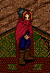

# In Search of Celebrity: An Aisling Guide to Mundane Recognition

_by Barriagh in_ ___Dark Ages___

Introduction
Ah! The grand life of an Aisling is filled with many challenges and rewards. One of the greatest rewards any Aisling can receive is to be recognized by the Mundanes for his or her creative talents. Mundanes hold regular contests so that Aislings may have a chance to become recognized their creativity.

The mundanes have written extensively on this, and therefore I will not spend my ink doing so in this guide. (Please see the Mundane Tome of Aisling Recognition for further details.) This guide is intended to be used by proud Aislings who have already been recognized by the mundanes and wish to claim their prize.

Once one has been recognized, a specific mundane inhabitant of Temuair must be sought out and spoken with briefly. This mundane will then bestow upon an Aisling the full measure of his or her reward as dictated by the extend of talent which was shown. Which mundane it is depends upon which recognition an Aisling has received.

Egil, the mundane Alchemist of Abel, can be quite helpful when it comes to finding the required Mundane, but alas he has grown quite old. With this old age, he has became somewhat feeble-minded. He can only remember which Mundanes can help an Aisling claim his or her reward for the following recognitions: Art/Portrait, History, Lore, and Memory

Below is the complete listing of Mundanes who can help Aislings claim their recognition.

|Art/Portrait||
|-|-|
|__Award Level__|__Mundane__|
|Aisling|Bruce, King of Loures|
|Folk|Huberto, Tailor of Rucesion|
|Village|Argus, Higgler of Undine|
|Clave|Hauk, Boy of Abel|	

|Bard||
|-|-|
|__Award Level__|__Mundane__|
|Aisling|Viveka, Barmaid of Suomi|
|Folk|Frida, Barmaid of Abel|
|Village|Aingeal, Barmaid of Mileth|
|Clave|Colm, Messager of Mileth|

|Event Host||
|-|-|
|__Award Level__|__Mundane__|
|Aisling|Viveka, Barmaid of Suomi|
|Folk|Frida, Barmaid of Abel|
|Village|Aingael, Barmaid of Mileth|
|Clave|Duana, Dancer of Mileth|

|History||
|-|-|
|__Award Level__|__Mundane__|
|Aisling|Jean, Councilor of Loures|
|Folk|Appie, Alchemist of Piet|
|Village|Hadrian, Wizard of Soumi|
|Clave|Damara, Baker of Undine|

|Lore||
|-|-|
|__Award Level__|__Mundane__|
|Aisling|Hali, Tailor of Undine|
|Folk|Antonio, Higgler of Rucesion|
|Village|Bertil, Fae of Suomi|
|Clave|Daithi, Rogue of Mileth|

|Memory||
|-|-|
|__Award Level__|__Mundane__|
|Aisling|No Recognition|
|Folk|No Recognition|
|Village|Alleen, Baker of Piet|
|Clave|Alleen, Baker of Piet|

|Persona||
|-|-|
|__Award Level__|__Mundane__|
|Aisling|No Recogition|
|Folk|Frida, Barmaid of Abel|
|Village|Aingael, Barmaid of Mileth|
|Clave|Duana, Dancer of Mileth|

|Philosophy||
|-|-|
|__Award Level__|__Mundane__|
|Aisling|Jean, Loures Councilor|
|Folk|Kiril, Wizard of Undine|
|Village|Hadrian, Wizard of Soumi|
|Clave|Chloe, Barmaid of Undine|

## Notes on Mundane Titles

Aislings are not the only inhabitants of Temuair to have 'path' related titles. Just as among the Aislings there are monks, priests, rogues, warriors, and wizards, there are among the mundanes numerous professions. These professions include, among others: alchemist, barmaid, and messenger. 

As with Aislings, mundanes generally wear garments which identify them as being of a certain profession. Unlike an Aisling however, a mundane does not have much freedom to choose what type of garment he or she wears. Thus, Mundane bakers throughout Temuair dress in the same fashion. For example, a Mundane baker in Suomi will be dressed exactly like her counterpart in Piet. 

Below are examples of how the various mundanes one needs to meet to receive one's reward appear.

A Mundane Alchemist *

A Mundane Baker

A Mundane Barmaid or Inn Keeper

A Mundane Boy

A Mundane Dancer

A Mundane Fae

A Mundane Higgler or Tailor

King Bruce

A Mundane Messager

A Mundane Rogue

A Mundane Wizard

* Jean, Loures Court Councilor an alchemist as well, and is therefore also dressed in this fashion. 

It is my hope that this simple guide proves informative and saves some deserving Aisling a little frustration the next time his or her talent is recognized.

_Barraigh of Abel_

***

```
*Librarian Notes*

This entry has been edited to conform to Library formatting.
The original can be found at http://www.darkages.com/2000/community/lore/Barraigh_Celebrity/index.htm .
```
