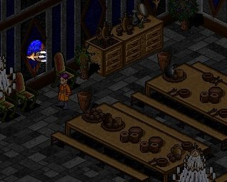
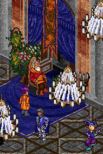

# Welcome to Castle Loures

_by Callum in_ ___Dark Ages___


I stand before the great castle of Loures. It is a great stone structure, built to withstand weather, wear, and war. As the capital of all Loures territories, as well as the home of the king, it is primarily built for protection. But how does such a huge castle operate smoothly and stay so clean? It is because of the diligent work of the dedicated servants of the castle.

"Servants?" You may be thinking. "I've never seen the servants wandering around."

You are correct! You likely haven't seen the servants, but just because you haven't seen them doesn't mean they aren't there. You haven't seen them because they do all of their work behind the scenes. They are not permitted to wander the main halls of the castle. The mundanes' caste system means that often the servant caste offends the Nobility. Instead, there is a secret underground system of tunnels that allow the servants to work undetected and without disturbing anyone, both mundane and Aisling alike.

Today, I will take you on a brief tour of the secret servant passages of Loures. However, please be mindful of the servants and let them go undisturbed in their work. They deserve as much (perhaps more) respect than the Noble class. It is on the shoulders of the Serf caste that the entire empire rests. After all, without the servant class the castle and subsequently the entire empire would cease to function correctly.


Here we have the servant entrance. As the mundanes have a rather strict caste system, the servants are not permitted to enter through the main gates, but rather only at these small wooden doors on either side. I would start the tour from within these doors, but alas they remain constantly locked. Inside these doors, however, begins a vast network of passages, dumbwaiters, the washroom, servant kitchen, and private quarters. Many of those rooms are the personal rooms of the servants themselves, so we will not visit those rooms. I would hate it if anyone invaded my privacy, wouldn't you?


In this room there is the mysterious secret passage to the Labyrinth. This is perhaps the most well-known secret tunnel, but it is not the concern of this particular tour. If you would like to know more about that particular part of the dungeon, there are other texts more appropriate than this one. Here, I am mainly focusing on the servant passages.


In order to gain access to the servant passages, I had to give something in return. This person has a certain penchant for flora, and was willing to assist my research. She wishes to remain otherwise anonymous. However, once given her little "gift" this kind resident gave me the locations of all of the servant entrances. For sake of brevity, I will only take us through the main entrances.



A keen Aisling can predict where some of the secret tunnels may be. Here in the main kitchen is the primary entrance to the servant tunnels. By turning this candle clockwise (on left), it opens a secret door in the pantry (see right). Here, from the kitchen, all of the Royal meals are cooked and transported all throughout the castle. The servants dart in and out of the kitchen without detection. Discretion is a very valuable trait to the servants. If an Aisling or Noble were to see you, most of the time it could mean your job. 


A lowly servant would not wish to gain the ire of the petty mundane nobles...


Despite its suspicious appearance, I assure you, this room is used strictly for storage of extra chairs. Trust me, I asked and asked and asked several times... I was assured that there was no secret about that room. I'm almost disappointed. *shrug*


In this otherwise innocuous looking room, there is yet another tunnel. This time, it is a hidden switch inside of the amphora. I have been told that this tunnel is used to access the nearby living quarters. Those chests of drawers have all of the spare bed linens. Through this passage, the maid servants make the beds and gather the laundry of the residents and guests (with the exception of the king himself. He has his own personal maid/seamstress that deals solely with the kings wardrobe.)


That doorway leads to the king's private chambers. Despite my all-access pass to the palace, I was still unable to gain access to that room. From descriptions I've been given by servants, the chamber contains a gigantic four-post bed, an ornate writing desk, and a window with a wonderful view. According to the king's private seamstress, rather than a closet or armoire to store his clothes, there is a separate adjoined room to contain his wardrobe. Apparently the room is even larger than the library. I do wish I could've been allowed to see such a display of snobbery. But alas, I suppose even a king enjoys his privacy once in awhile. Although, I have never seen him leave his throne...


Aside from the servant passages throughout the castle, I was also informed of the king's secret escape tunnel. According to my source, they lead outside in case the castle is invaded. I assure that the exits of these tunnels are not also usable as entrances. If that were the case, I would've kept them secret. Upon exiting the tunnels, the portals close themselves using a complex spring mechanism that only a Master Rogue could understand, much less construct.



Here, we see a semi-covered passage behind the king. This passage leads to the secret escape passage. It is a series of winding tunnels that go throughout the body of the castle. There are two distinct sections of the tunnels. One is newer, with carpeting and torches on the walls. The other is a dark stone tunnel. Strangely, this tunnel closely resembles the labyrinth built below the castle. This leads me to believe that the stone tunnels were here before the castle and built by the region's previous inhabitants, and the newer section was built later to accommodate the castle's layout. Poorly lit and dusty, it is apparent that this emergency escape route has not been used in many Deochs.


There are two exits from the escape route. The exit from the newer passages (right) leads to just outside of the castle walls, and close to the sanctuary of Gramail. In contrast, The older passages continue for far longer than the newer. After following the dark passages for what seemed to be miles, I finally reached a familiar locale. It seems these tunnels lead to the sewers of Piet! Again, knowing that the tunnels below the castle and the sewers connect, I have grown very suspicious of the original rulers of Loures Castle. Just how ancient are the tunnels and the sewers? What could they have to hide by making these ancient tunnels into the sewers of the kingdom? Curious...


This concludes the tour of the Castle Loures. I hope you have found this to be educational and informative. Perhaps with this newfound insight you will appreciate the hard work and tribulations of the servants in the castle. The mundane caste system oppresses these diligent workers. We as Aislings should show them the proper respect they are due. As the Children of Light, it is our duty to deny their caste system and show the love of Lady Glioca and the peace of Lord Cail to them.

Perhaps in future ventures I will delve deeper into the secrets of these new tunnels under Loures and how they relate to the sewers under Piet; maybe taking a look at such things and comparing it with what is known of the labyrinth we can begin to piece together the history of this land we love.

_Submitted for your approval,_  
_Callumn i'Losuta_  
_Undine Mundane Birth_  
_Loyal to Cail_  

***

```
*Librarian Notes*

This entry has been edited to conform to Library formatting.
The original can be found at http://www.darkages.com/2000/community/lore/Callumn_Loures/index.html .
```
