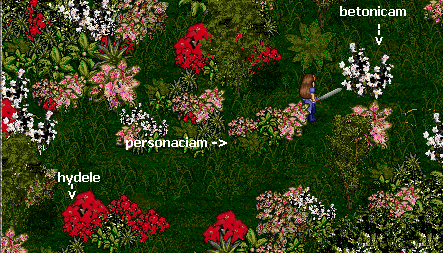
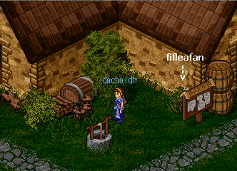
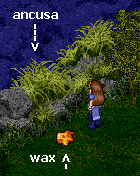

# Herbal Lore

_by Chloe in_ ___Dark Ages___

_Greetings, Seeker of Herbal Knowledge._

_When I was a child I was trained in the ways of the earth and its herbs, both for good and for ill. I grew up immersed in the haze of the Mundane world, where knowing the hidden ways of Nature is essential to survival. This is not a knowledge found in books, for my teachers knew not their letters, but passed it from grandmother to child, tutor to wanderer, through song and tale. My homeland is far from here, a journey of I know not how many moons, for I was lost in the darkness of the North on my way hither. Almost all of what I knew in those times is lost, but some of the ancient lore has remained with me._

_In this new land, where the gift of magick has been brought to my mind, I still find some succor in these remedies when my will is too exhausted to help my fellows. As my land is far distant, my language may seem strange, but I have included it as I fear it is fading from the earth, and so preserve it in what form I can. I have offered rough translations for you, as well as my guidance, in words and rough sketches, to where such herbs can be found in these dark times._

_One ingredient you will find in almost every remedy is that of wine. My people find that not only is it useful for dissolution of many herbs, but that its flavor often hides the bitterness that all these plants possess. Also, it works as an effective pain killer, letting those who are hurt wait more comfortably for the herbs of the earth to do their own gentle magick. It was to my delight and relief to discover that here, in my new home, the virtues of wine are not forgotten._

_May the meager learning of my people, now lost to me, bring thee aid and peace._


 
## Remedy for Snake Bite

Wit ealle wunda ond wit naeddran slitas, genim tysse wyrte seaw te man personaciam ond otrum naman _boete_ nemnet. Syle drincan on ealdon wine. Ealle naedran slitas hyt wunderlice gehaelet.

"With all wounds and for bite of snake, take the juice of this wort which one’s names _personaca_, and by another name beet. Drink it with old wine. It wonderfully heals all bites of snake."

_To Find Personaciam_: Journey first to the Enchanted Woods, and seek there a glade hidden within the many flowers. It seems to be favored by the Fae, for their blessed lands surround it, and the herbs within are of uncommon purity. From the entrance walk forward well nigh 40 paces, and then turn to the left, where you shall see an opening, shaped thus : |_ _|. In this glade you will find a green, retiring plant of delicate leaves. It is the leaves you will wish to extract the juice from, although its root, which we call "beet," is quite tasty in stew. Have a care as you gather this herb, or you may find yourself using this remedy quicker than planned, if one of the vipers takes your coming amiss.

## Remedy for soreness or looseness of teeth

Wit tota sare ond gif hy wagegan, genim tas ylcan wyrte (hydele). Heo of sumre wundurlice mihte helpet. Hyre wose ond hyre dust ys to gehealdenne on wintre for-tam-te he aelcon timan ne atywet. Hyre wos tu scealt on rammes horne gehealden. Drige eac taet dust ond geheald. Witoldlice eac hyt scarplice fremat to tam sylfan bryce mid wine onbyrged.

"For soreness of teeth, and if they wag, take this wort (hydele). Out of some wondrous power it will help. Its ooze and its dust is to be (gathered and) preserved in winter because it does not appear in every season. Its ooze you must store in a ram’s horn. Also dry the dust and keep (it.) Truly, it also effectually performs the same benefit tasted with wine."

_To find hydele_: In the same glade where personaciam is found, you will see a flare of red from a plant with broad petals and firm, thick leaves. Gather the ooze from the stem and leaves, and dry the petals and crush them to dust. Eat not the roots: they have no known value, other than a gift for clearing the digestion in ways no man would willingly endure. To keep the ooze, protecting it in a hollowed pot of mud will suffice: use nothing made by man. Take the dust mixed with wine, but apply the ooze directly to the wagging teeth. This remedy is often useful when dealing with young warriors, who have an uncommon ability to smite themselves with unwieldy swords, and young monks who have not yet mastered the art of the kick.

## Remedy for bad dreams and horrible night walkers

Teos wyrt te man _betonicam_ nemnet, heo bit cenned on maedum ond on claenum dunlandum, ond on gefritedum stowum. Seo deah gehwaeter ge taes mannes sawle ge his lichoman. Hio hyne scyldet wit unhyrum nihtgengum ond wit egeslicum gesihtum ond swefnum. Ond seo wyrt byt swyte haligu ond tus tu scealt niman on augustes monte butan iserne. And tonne ti hi genumene haebbe, ahryse ta moldan of, taet hyre nanwiht on ne clyfie, and tonne drig hi on sceade swyte tearle ond mid wyrt-truman mid ealle gewyrc to duste. Bruc hyre tonne, ond hyre byrig tonne tu beturfe.

"This wort, which is named _betony_, is produced in meadows and in clean open country and in protected places. It is good for both a man’s soul and his body. It shields him against fierce night-walkers (wolves, goblins) and against terrible visions and dreams. And that wort is extremely wholesome, and thus you must gather it in the month of August, without using iron (tools). And when you have gathered it, shakes the soil from it, so that none of it clings to it, and then dry it in the shade as thoroughly as possible, and with the roots work it into dust. Then use it in wine, and taste of it when you have need."

_To find betonicam_: Again, enter this blessed glade. Your first sight will likely be of this wondrous plant: a high spray of white flowers. Take the wine as a last draught before sleep, or with you in a flask on the dangerous, darkened paths. One warning: do not smell the dust, or you will see colorful goblins that do not exist. Its power is always present, but when gathered during the 8th moon, it is truly magickal.

## Remedy for Nosebleed



Gif men blod ut of nosum yrne to swyte, syle him drincan fifleafan on wine, and smyre taet heafud mid tam. Tonne otstandet se blodgyte sona.

"If a person’s blood runs out of his nose too much, give him fiveleaf to drink in wine, and smear the head with it (the wine mixture.) Then the blood rush will stop at once."

_To most effectively use this remedy_: First gather fifleafan, which is commonly found near taverns, especially the more rustic. This is handy, as fights tend to be common near ale houses, and therefore, bloody noses. Crush the green leaves into wine, and force the sufferer to drink of it. Then, tipping his head back, drench the head with the remainder of the wine mixture, and hold the head back for some minutes. Do not regret the loss of wine: no person, however thirsty, will wish to drink this draught a second time.

## Remedy for Burns

Teos wyrt te man ancusa nemnet byt cenned on beganum stowum ond on smetum, and tas wyrte tu scealt niman on tam monte te man martius hatet. Heo ys scearpan leadfon ond turnihtum butan stelan. With forbaernednysse, genim tysse wyrte wyrt-truman ancusa on ele geso-dene ond wit wex gemencgedne, tam gemete te tu plaster otte clytan wyrc. Lege to tam baernytte. Wundorlice hyt gehaelet.

"This wort, which one calls ancusa, is produced in cultivated places and in bare (ones), and you shall gather this wort in the month which is called March. It is of sharp and thorny leaves without a stalk. For severe burn, take a root of this wort ancusa boiled/soaked in oil or mingled with wax in the manner that you make a plaster or poultice. Lay it to the burn. It heals wonderfully."

_Where to find Ancusa_: For the herb to be at its most potent, gather it in the third moon of the year. It is found growing in outlying areas, such as Undine and the lands near the dreaded Kasmanium Mine, on rocks near the water. Taking a stout knife, for the leaves are thick with moisture, cut them loose. Then, combine their insides with wax gathered from the great wasps of the forests. 

It will make an ooze, cool to the touch, that will extract all heat from the burn. Lay this on the maimed area and it will be fully recovered within a day or two. This is most useful, as the ingredients are easily found, and so many creatures attack with fire in our world. Note : you will notice that this is the only remedy that does not require wine. You may discover, however, that pouring wine down the throat of the burn victim will muffle his curses amazingly.



_Here ends the first Herb Journal of Chloe, Priestess of Mileth_

***

```
*Librarian Notes*

This entry has been edited to conform to Library formatting.
The original can be found at http://www.darkages.com/2000/community/lore/Chloe_Herb.html .
```
