# Guide to Feline Menagerie

_by Cittikat in_ ___Dark Ages___

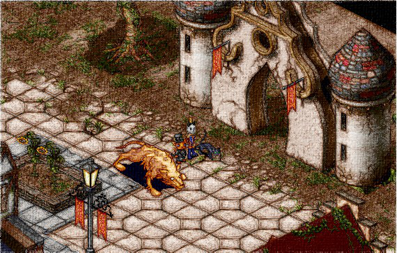

Greetings! As the old saying goes saying goes, "knowledge is power." But, to be knowledgeable about powerful creatures must make someone twice as impressive! 

In this work, Guide to Feline Menagerie, you will find instruction on how to care for and handle one of Temuair's most powerful species--the feline.

## Introduction

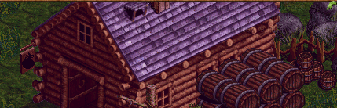

So, you desire to master the exquisite art of feline conservation? A difficult journey lies ahead for those that do; collecting, sustaining and housing numerous felines can be a daunting task. Or, perhaps a casual interest has brought you to this manual instead. Whether your reasoning be cursory or with the intent of mastery, you will find a wealth of feline knowledge ahead.

Temuair is teeming with a variety of exotic creatures, ranging from the vicious Marauder of the Mileth Crypt to the gentle Star Fish of the Lynith Sea. However, no species possesses a richer history than that of the feline. Far before Aislings received their spark and long after, cats have been roaming these lands--some roaming more friendly than others. They have become companions for the lonely and fierce foes for the battle hungry. Yet, questions still remain: How did they come to be? How do I acquire and attend to them?

In this text I, CittiKAT, hope to enlighten you on how to capture and care for these creatures as well as teach you of their historical background. With this information you too can become a feline expert and create your own feline collection or _menagerie_. 
 
## Pet Cat

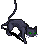

Beginning with the most accessible feline in Temuair, the Pet Cat is purchased at the Tagor Pet Store. This domestic breed is a distant relative of the Black Cat of House Macabre and has been roaming these lands since the tenth aeon. It is rumored that the first domesticated Black Cat  belonged to a young wizard dabbling in the art of necromancy in House Macabre where he spent countless hours studying the undead. When he made his return to his hometown of Abel, he brought back a Black Cat to further aid him in his studies of the black arts.

Areini the Pet Store owner will adopt out a Pet Cat for five million gold coins and ten Spider's Silk to construct a silk toy for your pet; silk toys are among their favorite. You can collect Spider's Silk from the Spiders in Mileth Crypt or the Green Widows of House Macabre. Beyond balls of silk, Pet Cats enjoy playing with Pearl Chain Necklaces and mice found in the Mileth Inn. Beware of taking them out to play with mice in the Mileth Crypt, though, as the Pet Cat is afraid of centipedes.

Diet is simple for the Pet Cat; an order of chicken or beef from your local restaurant will satiate them. If you are looking for a special treat, take them on an outing to the East Woodlands and indulge them with a fresh viper. The Pet Cat is a gentle, submissive creature that will abide by its master's commands without contest. The pet will return to its cage whenever necessary and requires little exercise. This feline makes an excellent companion for any Aisling, whether they are beginning their own feline collection or are in need of company on long adventures.

## Black Cat


Found lurking in House Macabre, these wild felines prefer the quiet solitude of empty spaces. The Black Cat evolved from a lower, now extinct, felinoid creature in the depths of the Cthonic Remains. Once thought to have gone extinct themselves, the Black Cat found refuge in the abandoned houses of House Macabre. They cohabit with Unseeli Wisps and have developed a symbiotic relationship. Unseeli Wisps provide protection for the Black Cats while, in turn, the Black Cats hunt ground dwelling insects for the floating Wisps.

Capturing the Black Cat can be tricky at first but is easily mastered. For best results, construct a cage of strong wood found in the West Woodlands. While dangerous to deal with, Goblins are highly skilled in crafting cages and should be employed to assist in the cage creation when possible. Allow for the cage to open from the top, not the side. Once you possess such a cage, venture to House Macabre and quietly place the cage in one of the pitfalls of an abandoned house. Given enough time, a Black Cat will accidentally fall into this pitfall and land directly into your cage. Be patient, while this method can take many suns to capture a Black Cat, it is worth it to avoid the deep scratch wounds they inflict when directly approached.

The diet of the Black Cat consists mainly of insects and can be supplemented with the occasional morsel of meat. They are best kept in dark places, mimicking their natural environment of House Macabre. Be aware that they are wild creatures and caution should be taken when caring for them in captivity. They are not suggested as personal pets and will escape enclosures if given the opportunity. 

## Pet Bast Cat

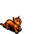

The Pet Bast Cat has deep roots in the city of Hwarone where they are kept as good luck charms and used as hunting aids by the wealthy. Rarely, the Hwarone council will allow new Bast Cat pets to be imported and citizens, as well as visitors, may purchase them from the bank merchant Lau for one million gold coins. The Hwarone council acquires the Pet Bast Cats from a breeder in Cat Canyon. The breeder, a recluse who has had little contact with other Aislings for nearly fifty deochs, trades the pets for food, gold and other items to sustain her breeding farm in the canyon.

Purchasing this pet is effortless when they are in stock. Unfortunately, due to the high demands of the breeder, the council imports them sparingly. To obtain one of these pets it is best to locate an Aisling that is willing to adopt their pet to you.

The diet of the Pet Bast Cat is similar to that of the Pet Cat: chicken and beef. Treats of Cactus Flowers can be given but are rumored to turn the pet wild. Pet Bast Cats are generally well behaved but have been known to run off and cause mischief if not watched carefully. They make excellent pets but should be kept in separate enclosures from their wild cousin the Solt Cat when added to a feline habitat to avoid conflict. 

## Solt Cat


The Solt Cat is best known for its remarkably muscular legs, allowing them to propel through the air in fantastic summersaults. While spectacular, these summersaults can be deadly. This desert dwelling feline is found in the Desert Dunes of Medenia and can be a formidable opponent. The result of an accident, these cats are descendants of the domesticated breed, the Bast Cat, found in the city of Hwarone. During a routine expedition through the Desert Dunes, two hunting Bast Cats ran off into the desert, never to be seen again. Deochs later, wild Bast Cats have taken to the area and now attack any encountered Aisling with fervor. The wild breed was renamed "Solt Cat" after the Aristocrat, Narducio Solt, who owned the two runaway Basts. Embarrassed by his folly, Narducio fled Hwarone and now resides in Oren peddling armors.

To capture a Solt Cat, begin by crafting a net from a Mummy Bandage found in Cthonic Remains. Afterwards, leave an Ice Bottle on the ground beneath a cactus in Desert Dunes. Carefully climb atop the cactus and wait, net in hand, for the Solt Cat to drink from the bottle. The intense temperatures in the desert will ensure that a Solt finds the Ice Bottle quickly. Throw the net over the Solt Cat and gently restrain it to prevent it from thrashing within the net.

The diet of the Solt Cat consists of Cactus Flowers and Ginseng found in the desert. Flowers may be safely collected outside of Noam while Ginseng can be found in the Desert Dunes. They must be kept in enclosures with high walls due to their ability to jump great heights. These cats are recommended for intermediate menagerie owners only and should not be kept as pets.

## Kelberoth

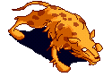

The most fearsome and colossal feline of Temuair, the mighty Kelberoth resides in the ice caves of Mount Giragan. Long ago these ferocious beasts roamed Temuair, terrorizing Aislings and Mundanes alike. During the Light and Dark War, Aislings pushed the Kelberoth to what was thought to be extinction. However, it was discovered that the Tauren creant had found a Kelberoth frozen in the ice caverns of Mount Giragan. He unthawed the beast and trained it to do his bidding. Aislings will encounter the Kelberoth on the way to fight the Tauren; it protects one of two precious items needed to summon the creant.

Capturing a Kelberoth is all but impossible. It is an imposing enemy in battle and should only be approached in a group; young priests beware! It has a particular taste for your blood. While it can be incapacitated with enough force, its size and weight make it overly taxing to get off the mountain. No enclosure would be great enough to house the Kelberoth as it has the unique ability to call for dire wolves to assist it when in distress. Many foolish Aislings have tried to obtain the Kelberoth as a pet; none have survived.

The diet of the Kelberoth consists only of Aislings. When offered other meats, it is apathetic. For this reason and the difficulty in capturing it, it is ill advised to attempt to keep a Kelberoth in captivity.

## BoroNang

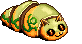

While not a true feline, this felinoid insect is an exotic addition to any menagerie. You can find these creatures in Andor carefully working on maintaining the structure of the ant hill. Little is known about the history of the BoroNang; it is speculated that a devilish Noam resident attempted to cross a Boro and a Bast Cat in the hopes of obtaining the ultimate hunting creature, possessing the hunting instincts of a Bast with the power of a Boro. After many failed attempts, the resulting creatures were abandoned in Andor and further evolved into the BoroNang we see today.

Capturing a BoroNang requires you to be completely invisible and have a thick article of clothing--I suggest a Leather Bliaut--to swiftly cover their mouth. If the BoroNang is allowed to bite you, you will die instantly from the powerful poison it injects. While invisible, throw the clothing over it to prevent it from biting and wrap it tightly to form a muzzle. Once debilitated, you can guide it into a cage or handle it by leash to your destination.

BoroNang survive on tonics found in Andor. A steady stock of green, red and blue tonics are necessary to ensure that the nutritional needs of your BoroNang are met. Occasionally, hitonics and extonics can be given as a supplement. BoroNang need a large area to work in and thus should be housed in wide open enclosures. They are generally harmless when kept in these enclosures, but be cautious to avoid their bite while caring for them. Due to their powerful venom, these should only be kept by expert handlers and not as pets.

## Top Hat Cat

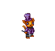

"A cat in a top hat?" most inquire puzzlingly when first meeting this colorful cat. Bred from the utmost sophisticated Pet Bast Cats in Hwarone, the Top Hat Cat has been trained to stand upright and wear a festive suit. The purpose of the Top Hat Cat's breeding was entirely political: a group of Mileth citizens desired to breed an intelligent, all-feline political party to usurp the corrupt Aislings in office. Their popularity as pets, however, tempted the greedy citizens and they are now sold to those eager for companionship. This group of citizens has made such remarkable wealth from selling these cats that they have opened a store, aptly titled the "Item Shop", where they sell other various extravagant items.

There is no need to devise a capture plan for these cats. To place an order for a Top Hat Cat, you must venture to the Item Shop and purchase one with a special currency. In a few suns, your Top Hat Cat will be ready for retrieval at your town's pigeon service. While you are there, you may also purchase dye from the Item Shop to adjust the color of their suit. Different cats have different tastes when it comes to suit color; check with your cat to discover their favorite. 

The Top Hat Cat has luxurious taste. To properly feed it, you will need to make frequent visits to the finest restaurants of Temuair. The famous restaurant in Piet appears to be the favorite choice of the Top Hat Cat. Be cautious when taking this cat on outings as it can soil its garments easily and will throw a violent tantrum. A clean Top Hat Cat is a happy cat! 

## Leopard Buddy

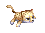

A curious creature, the Leopard Buddy is only satisfied when it rests soundly atop its master's head. Like the Top Hat Cat, it can be found at the Item Shop. When many Aislings began to complain that the Top Hat Cat was too refined for their rough, adventurous lifestyles, the Item Shop attendants came up with the perfect solution: a leopard that sits atop one's head! It's unclear why this was the solution that was reached, but it has been successful nonetheless. The attendants found this inert leopard breed sleeping in the trees of the Aman Jungle. When awoken, they began to throw desperate fits until placed on an Aislings head where they instantly relaxed and began napping.

The Leopard Buddy requires no capturing technique and can be purchased at the Item shop. Seeking a Leopard Buddy in the wild is highly discouraged as the natives of Aman Jungle do not appreciate Aislings rummaging around their homeland.

Having the most eccentric diet of all Temuair's felines, the Leopard Buddy consumes Fior Sals. No comment can be made as to how their desire for Fior Sals came to be, as they do not drink them in the wild, but they survive best on them in captivity. The Leopard Buddy prefers to nap and is highly adverse to exercise, making it the perfect pet for any languid Aisling and requiring minimum upkeep in a habitat.

## Lion Buddy

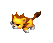

Related to the Leopard Buddy through a distant ancestor, the Lion Buddy can be found in deep tunnels beneath the Asilon Prairies . The only tunneling feline known to exist in Medenia, it spends most of it's time sleeping and eating in the dark. Lion Buddies are born completely white and stay as such for their duration underground but turn a striking golden hue upon exposure to sunlight.

Procurers of this beast must travel deep underground on dangerous missions, so it is discouraged to take it upon oneself to capture them personally. Due to their rarity, this feline is only given away as a special prize when the Item Shop sponsors a Halloween event. You can participate in this event by purchasing a give away bag item sold at the Item Shop.

Caring for your Lion Buddy requires minimal effort. Like their cousin the Leopard Buddy, they prefer to sit atop an Aisling's head; this allows them to bask in the sun and maintain their golden complexion. Their diet consists of Lily Pads and Copar Bones to gnaw on. Frequent access to food is required to mimic their natural feeding cycle. This feline makes a fantastic pet for Aislings and, due to its rarity, makes it an excellent addition to any feline collector.

## Enclosures

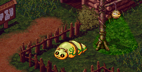

Capturing and feeding your felines is one task, but what is a menagerie without enclosures to keep your collection in? Different felines have different environmental needs and they are appropriately addressed in their given chapters. Common enclosures you will need to consider include: cages, small pens, canyon pens, dark room enclosures and fenced in fields. Cages and fences should be constructed of thick wood from the West Woodlands when harboring wild beasts. Small pens for mild mannered creatures can be crafted from less sturdier woods, such as those found in Shinewood Forest.

If keeping an exhibition out of a town home, cages, small pens and dark room enclosures will be the most practical. This will allow the husbandry of Pet Cats, Pet Bast Cats, Black Cats, Leopard and Lion Buddies. Please be advised to check with the local town's ordinance before constructing outdoor pens as to not unintentionally break town law.

When keeping felines at a farm home, such as those outside Tagor, all types of enclosures are available. This is the suggested setting to own the most complete selection of felines as it allows you to have open fields for BoroNang and deep pit enclosures for Solt Cats. As well, if you are attempting to contain a dreaded Kelberoth despite the danger, the secluded setting will allow for the lowest number of casualties when the beast awakens. 

## Hasty Guide to Felines

Below is an overview of the raw data for the feral cats of Temuair and Medenia as well as the costs of purchasable pets. Keep this cheat sheet handy for optimal success when adventuring to acquire your fuzzy felines. Good luck!

### Feral Beasts

|Image|Name|Level|HP|EXP|Nature|Drops|
|-----|----|-----|--|---|------|-----|
||Black Cat|35|4,000-9,000|8,400|Ele/Ele|Black Cat's Tail <br> |
||Solt Cat|99|120,000-200,000|70,900|Fire/Fire|Empty Bottle <br> 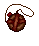|
||Kelberoth|99|1,800,000-5,000,000|1,332,500|Holy/Dark|Tauren Horn <br> 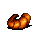|
||BoroNang|99|240,000-257,000|1,910|Dark/Dark|Green Tonic <br>  <br> Red Tonic <br>  |

### Domesticated Pets

|Image|Name|Cost|Dyeable?|Summon?|
|-----|----|----|--------|-------|
||Pet Black Cat|1,000,000 Gold <br>  <br> 10 Spider's Silk <br> |No|No|
||Pet Bast Cat|1,000,000 Gold <br> |No|Yes|
||Top Hat Cat|525 Kruna <br> |Yes|No|
||Leopard Buddy|250 Kruna <br> |No|No|
||Lion Buddy|350 Kruna (Random Item Chance) <br> |No|No|

## Acknowledgments

(( Thank you for taking the time to read my contest entry. All images used in this entry are property of Kru Interactive and are derived from the MMORPG "Dark Ages". The entirety of this entry was a creation by me unless otherwise cited from a work in the Loures Library.))

I'd like to thank my guild, Cult de Carrot, for tolerating a lunatic feline fanatic such as myself. Without them, I'd only be "that crazy cat monk" and not "that crazy cat monk in Cult de Carrot"-- thank you!

Specifically, I'd like to thank the following Aislings for their encouragement and helpful critiques: 
NagisaChan, Firewind, Cazbrileth, MaeSen and BioMagus. 

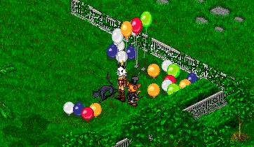

## Conclusion


Maintaining a diverse feline menagerie requires dedication and, above all, a deep caring for the cats that roam Temuair and Medenia. While a few may make fantastic pets for the casual feline enthusiast, many of them require special care and should only be handled by those intending to master the art of feline husbandry. It is important to understand the natural habitat of the felines and to imitate it as closely as possible to provide them with the utmost standard of living. Similarly, diet must be watched with a careful eye. Felines are highly temperamental and prone to intestinal upset if their diet is not strictly adhered to; many of the best intentioned Aislings have had catastrophic failures with their collection by feeding them an inconsistent diet.

Most importantly, enjoy your felines and the company they provide. If you offer them love and respect, they will reciprocate that love and respect back to you; they can be dear friends or terrible nightmares if mistreated. I sincerely hope that the lessons in this guide have taught you the basics of maintaining a zoological garden of frisky felines. I look forward to visiting your collection!

_From one feline enthusiast to another,_  
_Cittikat_

***

```
*Librarian Notes*

This entry has been edited to conform to Library formatting.
The original can be found at http://felinemenagerie5.webstarts.com/index.html .
```
