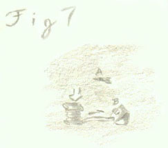

# Snipes and Snares

_by Dartanian in_ ___Dark Ages___

As ye may have guessed, this manual as well as the manuals to come are intended to be read by rogues and rogue hopefuls only.  Those of other paths may try to read the contents within, however it will assist them not.  A rogue that knows his skills well may better employ them to dispatch of dark creatures within.  The word "vulpio" is in an older tongue, meaning "one cunning as a fox" (That is if I looked it up correctly.  I've never been one for these old volumes).  So, a fitting name for a series of books for a rogue by a rogue.  This first volume, "Snipes and Snares" is intended to describe the different traps, how to best employ them to dispatch your foe, and, most importantly, how to well conceal them.

Most people seem to think traps slightly mystical in nature.  On the contrary, the application of traps is quite practical.  It is best that ye carry a bunch of pre-made traps in your packs, as this can save time which can in turn save lives.  Preparing these traps can take some time.  Also, try not to wear gauntlets or greaves while placing traps.  Unless there is some sort of magick imbued on it, most likely your fingers will be much clumsier and ye'll be more apt to make a mistake in placement or the making of it.  As for the greaves, ye do have to stoop down in order to place them, and greaves restrict that kind of movement.  All in all, it's best to keep yourself lightly burdened so ye have enough mobility to place these deadly devices.  And now, without further ado, I give ye...

## The Different Traps

### Needle Trap


This is the simplest of all the traps.  Daithi in Mileth can teach you this skill if ye don't already know it.  It is a must have for all beginning rogues as it can definitely mean the difference between celebrating in a tavern after victory with your friends or celebrating your stupidity with Sgrios.  I think most would prefer the former.  Daithi asks for a dirk in order to make this trap.  What ye want to do is break it.  Might sound strange but the material used for a dirk is cheap and clumsy in that form, but sharpened into barbs, they can be devastating to early monsters.  Later on, they'll simply seem like a pinprick to the creatures, but worry not.  Ye should well have other better traps by that time.  As ye can see from the diagram, the needle trap is nothing more than a hinged pressure plate (Fig 1.A) and a sharp needle (Fig. 1.B) carved and sharpened, then fitted with a hole at the end.  A rod is placed through this whole so it can be attached through the holes on the bottom metal section of the plate.  

As a creature steps on this plate, the plate simply lowers itself onto the needle, causing a slight prick, more painful if the creature is close to the ground such as centipedes or vipers.  This trap is fairly small, only sticking up about two to three inches above the ground when the plate is raised, so it is pretty easy to conceal.  If ye're in a woodland setting, a few leaves or clumps of grass should suffice.  In a more dungeon-like setting, I would replace one of the tiles with this booby trap, as it will blend right in with its surroundings.  I would only recommend travelling to the first or second floors of the crypts with this sort of weapon, since any creature beyond that is much stronger and will shrug this needle off quickly.

### Stiletto Trap


This is your second trap, the stiletto.  Daithi wishes to have Good Snow Secret in order to create this trap.  Take this surigam and stick a rod of about 2" through the center, holding it in place with a piece of cork.  On the other end of the rod, attach the smallest wheel you can find, carved with small notches in it.  Ye'll need another one of these wheels, only larger.  Attach this one to another piece of cork with a hole punctured through it.  Slide the covering for this trap (shown in Fig. 2) over with the cork sticking through the hole and slide the rod through the hole in that piece sticking out.  A complex device to be sure, but it works.  As a passing creature trips the thin rod sticking out, no matter how lightly, the secret inside twirls with amazing speed, slashing wildly at the beast multiple times.  Ye would think after this, creatures would be more cautious to avoid the rods protruding out, but they seem to trigger the traps even more after the first one.  

It seems they are so enraged by the sudden attack that they fail to see more traps ahead and simply trigger them in a row.  Although sticking a mere 3" from the ground, the stiletto trap is difficult to hide because of the rod sticking out.  If the rod is thin, it is more difficult to see, however, so make it as thin as the device can handle.  In a dungeon setting, since the lighting is dim, a black cloth can cover the trap without hindering the effectiveness of the blades.  In woodlands, it is best to hide the trap among flora as it will blend well in that type of setting.  I would recommend only relying on this trap until the 4th section of the forests or 4th floor of the crypts.  It takes an average of 7 to 8 of these devils to dispatch a strong monster four floors down so any more would probably be a waist of time.  One stiletto is about the equivalent, damage-wise, as two needles.

### Bolt Trap


Although this trap looks simpler than the Stiletto, looks are very deceiving.  As a trained rogue, ye should be able to admire the ingenuity behind this device.  At the time of this writing, this is the most damaging trap known.  Fisk in Suomi asks for a Good Blossom Dagger in order to create this wicked too.  As with the dirk, ye'll be shattering this dagger for the metal needed for this trap.  Sharpen the bits into a jagged piece that looks similar to an arrowhead.  This shape may seem easy but it is quite difficult to craft.  Another difficulty ye might have is the trigger bar.  Although thin, it is still a feat to bend this so it'll fit through the small slit.  Also, ye must not bend it too much, lest ye make the trap with a useless trigger.  The launching device (the corner box that the bolt is inserted into) contains a spring-load.  

When the trigger is tripped, this spring is released and the bolt penetrates the creature's flesh.  The major portion of the damage is not done at that point though.  The creature, sensing shock and pain, reels back and thrashes to escape the bolt.  As a result, they are normally freed of the bolt, but with a hunk of skin taken with it.  Not always a pretty sight to see, but effective.  Unfortunately, this trap is difficult to hide in the woodland setting.  A pile that tall is suspicious.  Try hiding the trap behind a tree with the trigger sticking out past it and see if ye can lure the creatures onto it.  The outer casing of this trap is designed to blend in with walls of dungeons so they fit best in those areas.  This trap can kill fairly well even up to the eighth or ninth section of the forest.  However, it is difficult to lay them alone past the 6th area as monsters tend to gang up on ye in the 7th and beyond.  One Bolt is the approximate equivalent, damage-wise, of four stilettos.

### Poison Trap


I have not put a separate diagram in for the poison trap because construction of it is similar to the needle trap (See figure 1) at first.  The same plate is used but set at about an inch lower.  This is due to the fact that ye need to use a needle that is about a quarter of the size of those used in the needle trap (See figure 4.A).  The needle must be so much smaller because it needs to puncture a vein and the poison injected into the bloodstream.  Take the centipede glands and vipers glands that Baltasar in Rucesion desires for the construction of this trap and find the oil sacks that are hidden on each side under the crook in the gland (See fig 4.B).  The venom from these sacks are harmless by themselves.  That's why centipede and viper bites are non-poisonous in nature.  But mixed in the proper ratio, the results can be devastating.  

The correct mixture takes practice to get right, so don't be surprised if your poison seems to have little to no effect at first.  The poison you find on chests have obviously taken years of mastery since they are so lethal.  Once the oils from the glands are mixed, dabble some on the tip of the small needle and set it in wait.  Hiding this trap should be easier to do since it is more compact than its needle counterpart.  Use the same tactic in trying to conceal it as that.

### Blind Trap


This trap is possibly the oddest shaped trap out of all of them.  The plate is mostly just a place to rest the trap until it is needed.  Ye may decide to discard of the plate in favor of easier concealability.  This is fine, except adjust for the recoil that the trap will make when it snaps against the ground.  This trap is fairly simple to make, but operation is a bit more complex.  To make it, Baltasar asks for a Bat's Wing.  Cut this wing open with your dagger and take out the bones.  These bones, when sharpened, will make fine, lightweight shards that will be the backbone of your trap (Figure 5.A).  Attach these bone shards to the wire rectangle at one end of the trap, loosely.  The small plate at the other end acts as the trigger, loosening the spring in the center and flicking the rectangle in an arc.  As the rectangle is triggered, the shards fly off from them to stick in the victim's eyes, temporarily blinding them.  The most difficult part is not the making of this trap, but the aim.  It must be precise depending on the creature ye are fighting.  This trap takes slightly longer than most of the traps to set because of this fact. 

Be careful when setting it that ye do not trip the trap yourself, or the results may be painful.  Fortunately, because of its compact size, this trap is relatively simple to hide.  In dark passages, it can almost be left on its own and even in the woodlands, tall grass should be sufficient to hide it.  If the grass is short, ye might do best to cover it slightly.  However, be mindful of the bone shards and do not cover them or else the trap will misfire for sure.  Make sure the aim is adjusted too before setting it.  The shards are not as effective on a goblin if ye have it set for a centipede's height.

### Sleep Trap


Most novice rogues and also outsiders believe that the sleep trap and blind trap are identical in nature since they both basically stop the creature in their tracks so they simply decide to discard one in favor of the other.  This is not so however.  Each of these traps have a distinct advantage and disadvantage to them. While the blind trap may stop a creature from advancing, the creature is most likely apt to clutch at its eyes painfully and stagger and flail about.  The creature is still difficult to hit because of this.  Also, blindness does not prevent the casting of deadly spells, nor the creature attacking if ye get too close.  They can still attack in the direction that they feel pain.  It might be less effective but they still do it.  A sleep trap, on the other hand, knocks the creature unconscious.  A creature that is curled up on the grass or floor cozily is an easier target to hit since they don't anticipate it at all.  A creature that is blinded can still expect an attack and have defenses up, even if weakened.  

Also, due to the unconscious nature, a creature does not have the awareness to cast the spell.  Now all these reasonings may make the sleep trap seem better.  However, the sleep trap is slightly more mystical in nature where the blind trap is purely physical.  Thus, creatures with magick potential and protection is more apt to shrug the effects of the sleep faster.  The effects of blindness, on the other hand, are generally fixed, and last a decent amount of time as well.  The decision of effectiveness versus protection is up to ye in the end.  To make this trap, bring a scorpion's sting to Baltasar in Rucesion.  He will help ye find the gland in the sting which is a potent, sleep inducing agent. Figure 6 shows a scorpion's sting.  Make an incision where the arrow marked A is.  Ye should find a cherry-sized sack inside it.  Drain this of fluids and a white film should float to the top while a green, brackish liquid settles to the bottom.  Remove the white material as this is what neutralizes the effects of the sleep venom.  It should be in its base form now.  Mixing it with juice from an apple should increase the potency of it.  

Once ye have enough of this concoction, pour it into a small dart (Fig 7.A) with a needle at the edge.  The trigger for this trap actually acts like a small pump.  As the creature steps on it, air is pumped through a small tube, compressing inside the muzzle of the launcher (Fig 7.B).  Eventually, enough pressure builds to shoot the dart out of the muzzle with enough force to embed itself in the skin and tranquillize the target.  The trigger of this trap is relatively small (only about 1" tall) as is the launcher itself, so hiding it should be a fairly simple task.  In fact, it is even easier to hide than the blind trap since enough pressure is built up and the dart is heavy enough that a few obstacles in the launcher's way will not cause a misfire so readily.  As with the blind trap, though, spend a bit of additional time making certain that the angle is properly set.

### Modifications for airborne foes



These traps are practical for ground-based foes, but flying creatures are a bit more of a challenge, and the trigger might have to be adjusted.  It is in these cases that only a magick enchantment will truly suffice to make the trap work.  There are two that are both widely-used and ones that I would recommend, and those are light and athar-based triggers.  The light-based trigger reacts thus.  As long as light is shining on the trigger, the trap will not fire.  Therefore, when a flying creature casts a shadow on the trap, the lighting is upset and the trap triggers.  This is fine, if it is done properly, which takes extensive time.  The sun casts different rays depending on the time of day so the trigger must be offset.  

Another drawback to this method is that at night, your traps basically become useless if they're all enchanted.  Use this method sparingly if ye plan on hunting at night.  Another drawback is that this trap becomes useless underground.  The athar method is getting the trap enchanted so that it detects a disturbance in the air around it.  If there is a disturbance, the trap triggers.  This is good because ye can use it to hunt at night as well as the fact that it needs less adjusting than the light method.  However, a strong gust of wind can also ruin your strategy.  These are best for use indoors where there is no wind.

I hope that this volume is useful for rogues who wish to increase their knowledge of the traps that they may acquire.  Always keep enough materials on hand to make more in case ye run out of them.  Knowledge of your traps is vital to the odds of your survival.  Know your limitations, strengths and weaknesses.  I shall continue working on the next volumes of me manual to describe more of the rogue craft in detail.

```
*Librarian Notes*

This entry has been edited to conform to Library formatting.
The original can be found at http://www.darkages.com/community/lore/Dartanian_Snare/index.html .
```
