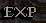
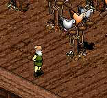

# Glossary of Terms in Temuair
_by Deksar in_ ___Dark Ages___

## Introduction

_La math dhat, everyone. I am Deksar sagart-K'sull, an Aisling and Priest of Glioca. People experienced in the workings of Temuair, or the world the Terrans would call "Dark Ages" may refer to terms that have no clear definition by their name. And as a result of hurried thoughts and quick judgements, "slang", or regional dialect, is created. Although the previous are actual words, their meaning might escape a young Aisling. So, for future reference and easy integration with Temuairan society, I have included Temuairan terms used in the world of Temuair with a brief Terran description of each. Although this is far from being complete, I hope this will help clear up some of the confusion that a new Aisling must be experiencing._

## Section 1: Craft Explanation

Every Aisling needs a craft. When an Aisling starts out they are but a peasant. Ye must then choose yer way in the world of Temuair... a decision that ye cannot ever cancel. I will also explain their roles in battle, whether that be Attacking, Assisting Attacks (Sub-Attack), Defense, or "Going Solo".

|Image|Name|Description|
|-----|----|-----------|
||Monk|A craft which uses its hands as its weapons. Uses a large variety of skills to inflict damage. Also has a good number of spells that can cure status or even protect themselves. Monks are an Attack and Sub-Defense Unit, they can assist with both Offense and Defense, but not as much as a pure Attack or Defense Unit. However they are better at Attacking then helping Defense.|
||Priest|A craft based on healing, curing status, protection, and augmentation. Mainly fights in groups, they are a core to a group's defense. Priests are a Defense Unit, they mainly assist with their defensive capabilities.|
||Rogue|Usually referred to as the "loner" craft. As they are the only craft that can effectively take on enemies all by themselves for most of their life, most Rogues only battle with other crafts if they want a bit more security and companionship then taking on a mission alone. They can be either classified as a Sub-Attack Unit or a Solo Unit.|
||Warrior|Usually referred to as the "tank" craft. Warriors usually take in a lot of damage but are able to withstand it a bit more than the other crafts. Warriors use a good amount of skills and a vast array of weapons and armor to tackle their opponents. Warriors are definitely an Attack Unit, they can easily lead a battle.|
||Wizard|The elemental craft, Wizards can attack with a certain element against an enemy, doing more damage than usual sometimes. As well they attack with spells, which allows them to conserve their health since they attack from a distance. Wizards are definitely a Sub-Attack Unit for the later part of their life, although earlier during a Wizard's life they may find themselves effectively hunting alone.|

## Section 2: Temuairan to Terran speak

|Image|Name|Description|
|-----|----|-----------|
||Age| Although a word used in both Temuair and Terra, the calculations of a person's age differs. In Temuair, age can be one of two things: How long ye have been an Aisling, or yer total age including yer Mundane roots. The first can be found easily displayed on yer legend, such as "Aisling - Deoch 7, Winter". The second is a bit harder, and can only be calculated if ye remembered yer Mundane roots. If ye did, it would be how many years "before Deoch" ye were a Mundane, then how many "Deochs" have since then been done. Say yer Mundane birth was "Before Deoch, 12". Since it is now the 9th Deoch, yer total age would be 21, as ye were supposedly a Mundane up until yer Aisling rebirth.|
||Aisling|1.) One with the spark of Deoch, of inspiration. An "Aisling" is a Mundane touched with this "spark". We are the blessed, the cursed. We have the power to both stop evil and start it. Wield the light and the dark, destroy and create. In plain Terran speak, all "players" of this "game" are "Aislings". <br> 2.) Certain people call themselves "Aislings", but in fact they are more dull and uninspired in nature. So the term "True Aisling" came into being, and is used to describe the more inspired and better example of what an "Aisling" should be. <br> Common Use of 2nd definition: "He is a true Aisling!" "She has the spark of a true Aisling."|
||Aisling Teachers <br> or Mileth College Instructors|An Aisling who has won the Mundane Contest may be able to teach at Mileth College. Although true experience may be gained in the college, "real experience" can also be gained by attending a class.|

  
___A classroom___

|Image|Name|Description|
|-----|----|-----------|
||Atavism Age <br> or Chaos Age|In the Terran world, this was called the time of "Beta Testing". Any time before the 5th Deoch are part of these times of chaos in the world of Temuair from its relative young age. The oldest Aislings come from this time.|
||Aye|Another word not used in the Terran world for thousands as years, this one means "yes" or "I agree".|
||Beothaich Deum|Beothaich Deum is the real name for a potion with a very reddish hue, usually referred to as a "red potion". This potion can save an Aisling from death provided that Aisling is in a group, and the potion is administered in time. Once this potion is identified using some type of Lore, ye can clearly see it is, indeed, a "Beothaich Deum".|
||Betony Deum|Betony Deum is the real name for a potion which looks white. It has healing properties like the Hydele Deum, but only heals your wounds slightly for a more hardened fighter.|
||Circles of Insight <br> or Circle|Ye can wear a different piece of clothing at each circle, it is yer mark of gaining around a certain insight and protects much more then yer original armor. Priests, Wizards, Rogues, and Monks have 6 circles: 1st Insight, 11th Insight, 41st Insight, 71st Insight, 80th Insight, and 97nd Insight. Warriors have 9 Circles: 1st Insight, 24nd Insight, 41st Insight, 56nd Insight, 71st Insight, 80th Insight, 86th Insight, and 97nd Insight.<br> Common Uses: "What circle of insight are ye?" "What circle are ye?"|
||Craft|The profession a young Aisling peasant can assume. Priest, Monk, Rogue, Warrior, or Wizard. Also see Section 1: Craft Explanation.<br> Common Uses: "Which craft do ye want to be?" "What is yer craft?" <br>Slang: "What are ye?"|
||Creatures <br> or Monsters|All "active" or "aggressive" mundanes and other beings are known just as "creatures" to many. These are the poor things Aislings beat up on to gain "combat experience" and bounty. Creatures vary in appearance, intelligence, strength, toughness or health, element of attack and defense, abilities, and fighting style.|
||The Elements| There are 6 different known elements. Srad, or Fire, Sal, or Water, Athar, or Wind, Creag, or Earth, Dubh, or Dark, and Deo, or Light. The four basic elements are Srad, Sal, Athar, and Creag, and these make up the element of Dubh. A belt of any of the basic elements protects from that element, and a necklace of these elements gives your attacks the power of that element. Wizards also can attack with the power of these elements, and even change something's element. A belt or necklace of Darkness, Dubh, gives the force or protection of all Four basic elements. However only beings of darkness can fully understand the power of true "dark magic", so far. Not much is known about the power of Light, Deo, except that Priests can wield its power.|
||Experience <br> Combat Experience|Combat Experience in the world of Temuair is governed by a Terran numerical expression called "Experience" or "Exp", "XP". When enough experience is gained, a person gains an "insight". It is usually referred to by the "To the Next Level", or the Terran numerical amount of how much experience a person needs to gain an "insight". However, this talk is Terran talk, NOT Temuairan. There is no way to represent "experience" with numbers without it being considered "heretical".|
||Faith|Faith in yer god is what ye need to pray for. Fer most worshippers, praying every few days or one Terran day and participating in masses will wield the most amount of faith. With enough Faith, ye can call upon the powers of yer god for certain favors, such as removing a "Scar of Sgrios" from another Aisling or Summoning a vicious beast.|
||Fior|Anything with the word "Fior" in it is a special potion Wizards use to gather back mana from their natural element. <br>Examples: "Fior Sal" "Fior Athar" "Fior Creag"|
||Group <br> Party|A hunting party or group. Some spells are particular and can only affect members that are of yer group. In Terran speak, a "group" is a group of Aislings which share the combat experience from a hunt. The gods once again tell me ye can group someone by "clicking" on the Aisling to bring up the "equipment window", then "clicking" again on the picture of "two people on the lower right", whatever all that means. If I can stop hearing the voices of gods, perhaps I can finish this! <br> Common Uses: "Would ye like to join a group for hunting?" "Would ye like to join my group?"|
||Guiding|The one who initiates ye into a craft is yer "guide" throughout the first part of yer Aisling life. Upon reaching yer 11th insight, that initiate, or even a new guide, can show that ye have gathered up enough experience to become a full member of that craft and gain a sizable reward in the process.|
||Guild <br> or Motley|A Guild is a collection of Aislings with a common goal. It brings Aislings closer together, and supports many different special perks known only to a Guild. A Motley is a smaller guild, with a smaller number of members.|
||Health|Temuairan word for the more common Terran word "hit points", or "HP". Standard Terran numerical representation of someone's general health. It is represented loosely by the blue octagram that ye may see inside yer mind. However I was instructed by the gods that it can be shown numerically by "hitting the 'g' key on your keyboard", whatever that means. Health can regenerate by itself, as time heals all wounds. <br> Common Uses: "What is yer health?" "How healthy are ye?" Slang: "Health?" or "Hp?"|
||Heretics <br> or Heretical Acts|Too much Terran-related or very Terran-related speak ((or otherwise "OOC")) is considered "heretical" and may be punished under both Rucesion and Mileth Law. Note this has nothing to do with a religion's power to declare someone "heretical". Also note that many, but not all, consider heretics while hunting to be much less an infraction. <br> Examples of heretical speak: "plz" "gg" "thx" "what's your other char?" "u want this?"|
||Higgling <br> or Higgler <br> or Banker <br> or Tailor|1). The mundanes can either store your items in their Bank, or gather some fine items like silk from afar at the Tailors. <br> 2). A Rogue, with the help of a Mundane Banker, can "higgle" items. Higgling is like a "searching" job, and requires labor time and some coins to the Mundane, but may give rare and valuable items. Higgling with another Rogue, of course, lets ye search better and ye usually find more items.|
||Hunting <br> The Hunt|Hunting down such things as Rats or Goblins for combat experience and bounty. All creatures drop something or other, which serves some purpose either for learning a spell or skill or just lining an Aisling's pocketbook. <br> Common Uses: "Do ye want to hunt?" "I wish to hunt!" "Can ye PLEASE hunt with me?" "Deksar never goes hunting!"|

  
___A Hunt in the Woodlands___


|Image|Name|Description|
|-----|----|-----------|
||Hydele Deum|Hydele Deum is the real name for a potion which looks quite brown. Indeed, it is sometimes referred to as the "brown potion", especially by and Aisling who do not know what this potion is. A Hydele Deum has healing properties, and fix all your wounds in an instant, restoring your general health to maximum effectientcy.|
||Insight|Temuairan word for "Level". Normally the level of experience a person has achieved, in Temuair it is how many "insights" that person has achieved. In plain Terran speak, "level" is a number which is gained with enough of another number, "experience". Also see Circles of Insight. <br> Common Uses: "What is yer insight?" "How insightful are ye?" Slang: "Insight?" (note this has the dual meaning of "What is yer insight?" and "Gained an insight?")|
||Labour Time|An Aisling is a very busy individual. They cannot labor on chores such as tailoring, making Beothaich Deum, attending classes, etc. for all of time. There is somewhat a finite amount of time every Aisling has to labor on such things. In Terran speak, there is an exact finite amount of time: every 12 Terran hours, Aislings gain 4 days labor time up to a maximum of 5 days labor Time total.|
||Beasts of Lag <br> or Demons of Lag <br> or Falling Unconscious or Fainting <br> Holes in the Floor|There are many different phrases of Temuair to talk about a very annoying and sometimes very dangerous problem of Temuair: The Power of Lagh (or more commonly known as "Lag").|
||Love of the Fae <br> Bond of Love <br> Fae Love|Upon an Aisling's 11th insight, they can declare their love for any Aisling in the Lover's Glade within the Eastern Woodlands. This love can be either intimate or just platonic (love of a friend or brother).|

  
___Love of the Fae___


|Image|Name|Description|
|-----|----|-----------|
||Mana|A common Terran word as well, this word in the Terran world was first known as "Magic Points", or "MP", and evolved into "Mana Points". It represents yer limit, or limit of "will", in controlling the forces of magick in Temuair. In plain Terran speak, a certain amount of "Mana" is needed to cast spells and use certain secrets. When this is depleted, ye cannot use the spell or secret until the Mana is restored. The amount of yer mana is shown in yer mind with the orange octogram, below the blue octogram. But again, instructed by the gods, it can be shown numerically by "hitting the 'g' key on your keyboard", a phrase I still cannot entirely decipher. Wizards can use a special secret and item to restore mana, while others must wait for Mana to regenerate naturally. <br> Common Uses: "Is yer mana drained?" "How is yer mana?" Slang: "Mana?" or "Mana ok?"|
||Marriage|Marriage of two Aislings, a blessed event. This can be done only in a recognized Chapel, such as the one in Mileth Village. Each Aisling much have reached at least the 11th insight to say the vows of holy matrimony.|

  
___Church of Mileth___

|Image|Name|Description|
|-----|----|-----------|
||Mass <br> or Religous Mass|Religious Mass to worship of a god. Mass is conducted by a mass holder, or "high priest/priestess". Ye can gain valuable insight in mass from the mass holder and speakers, and if ye are of that religion's Trinity, ye can gain "real" experience and faith from participating. However, this can be done only once per god per double-moon, or 1 Terran week. Respect must be shown in mass, for priests of that religion have the ability to banish from the temple or even excommunicate a troublemaker. The first is not permanent and only lasts 3 days, or 12 Terran hours, but the latter is permanent. <br> Common Use: (note the common use is slang) "I need to go to mass." "I am holding mass tonight". "Is mass EVER going to start?" (this is very rude and disrespectful)

  
___Religous Mass to Cail___

|Image|Name|Description|
|-----|----|-----------|
||Mentoring|The world of Temuair is not always stable. There are many harsh realities, as any young Aisling who has first experience the scarring of Sgrios. Ye can have a mentor, hopefully one knowledgeable of the world of Temuair. Every double-moon, yer mentor can give ye a lecture for valuable experience for both yerself and yer mentor.|
||Mundane|1.)Very common word used in Temuair society. A Temuairan would describe a "Mundane" as "one without the spark of Aisling, the spark of Deoch, the spark of inspiration". However, Terrans usually describe them as "Non-Player Characters", or "NPCs". They are an Aisling's tool to interacting fully with the world of Temuair. Mundanes take on many jobs, from educating, helping an educator, helping hold a mass, to selling a seemingly endless supply of items (but actually limited) and buying them back with an unlimited supply of capital. In Temuair, Mundanes populated the world long before Aislings came into existence. <br> 2.) Another use for the word "Mundane" is an Aisling who is acting very un-inspired or pretty dull. A "power-hunter" is a great example of a "mundane" Aisling, as they mainly go into battle and do not partake in anything else in Temuair. <br> Common use of 2nd definition: "He is mundane." "She acts very mundane."|
|<br><br><br>|The Mundane Trainers <br>or Teachers <br>or Masters"|Mundanes are very intelligent (although perhaps not as creative), and they teach Aislings secrets and skills if that Aisling has the required strength in certain fields and certain items to sacrifice. There are Priestess Teachers, Rogue Masters, Dark Wizards, and Fighter Trainers which teach secrets and skills. Note that some other mundanes teach secrets and skills, however the previous are the main mundanes which teach. Also note that the regular mundane teachers are usually referred to by what town they are located in. <br> Common Uses: "The Priestess of Piet" "The Rogue of Suomi" "The Fighter of Mileth" Slang: "Piet Priestess" "Suomi Rogue" "Mileth Fighter" or "Mileth Warrior"
||Nae <br> or Nay|Yet another word which has a parallel in Terran ancient history that exists in Temuairan speak. This means "no" or "I disagree".|
||Parceling <br>or Sending a Parcel or Package|The mundanes hold both a carrier pigeon and land parcel transport service. Ye can give the mundanes an item, and for some coins, they will deliver it to another mundane parceller (or just keep it at their stop) until the other Aisling claims it.|
||Personaca Deum|Personaca Deum is the vanilla potion, a potion of curing. It is an anti-toxin, to be percise. It cures a poisoned body. It is also one of the harder potions to make.|
||Paces, the measurement|Every step ye take is 1 "pace". In Terran terms, each "pace" equals a "tile".|
||Resting <br>or Taking a Rest|No Aisling can battle forever, sometimes they need to take a break. Whether this be for repairing their weapons and armor or waiting for their wounds to heal or experience more control over their mana (in Terran speak, regenerate mana), resting is a vital part of the hunt. When a Priest or Priestess says "I need to rest", they usually mean their mana control is dangerously low and just wait for regeneration. An experienced fighter will take this into account and after a long or very intense battle, ask the Priest if they need to rest. <br> Common Uses: "Wait! I need to rest!" "Need a break?" Slang: "Rest?" "Wait! Rest!"|
||Scar of Sgrios|The Scar left by "Sgrios" on yer soul after a brush with death. The Scar of Sgrios can be seen by all Aislings once it is made, but it can be removed by a Gliocan, Deochian, or Cail worshipper. The Scar of Sgrios is mainly a mark of shame or valor whichever way ye look at it, its powers are said to only affect guiding a young Aisling. Also see Sgrios. <br> Common Uses: "Please heal my Scar of Sgrios!" "I got a Scar of Sgrios!" Slang: "Please heal my scar!"|
||Secrets|Secrets tricks of the trade, such as a Rogue's knowledge of Traps. Since these secrets are magickal in nature, yer mana may be consumed by them. Spells are also technically "secrets".|

  
___A Priest's Spells and Secrets___

|Image|Name|Description|
|-----|----|-----------|
||Skills|Skill to use a weapon or technique. These are attacks and techniques which do not need mana to work properly.|

  
___A Rogue's Skills___

|Image|Name|Description|
|-----|----|-----------|
||Soloing <br>or Hunting Solo <br>or Going Solo|Being able to take on creatures alone or "hunt alone", effectively. "Solo" means "one" or "singular". Rogues are most adapt at this.|
||The Spark|The Spark of Deoch or inspiration given to Mundanes to make them Aislings. The one thing that seperates an Aisling from a Mundane. <br> Common Uses: "The spark of Deoch..." "The spark of Aisling..." "The spark of inspiration..."|
||Spells|Temuairan word for any "secret" which is magickal in nature. For instance, "beag ioc" may be a "secret", but it is also a "spell". However a Rogue's "Needle Trap" may be a "secret" but it is NOT a "spell", for it is not exactly magickal in nature. <br> Examples of spells: Beag Ioc, Srad, Deo Saighead, Mor Athar, Armachd, Ao Cradh, Ao Puinsein|
||Temuairan Strengths - Strength, Constitution, etc.|Also see the Terran slang "Stats". The Temuairan word for the common Terran numerical representation of a person's strength, stamina or constitution, wisdom or magic power, intelligence or will, or dexterity, agility, grace. In Terran speak, it is usually referred to by its 3-letter representations, such as "Str", "Con", "Wis", "Int", and "Dex". <br> Common Uses: "How strong are ye?" (Strength) "How wise are ye?" (Wisdom)|
||Temuair <br> or Temuairan|Plain enough, the world of Dark Ages. The adjective is usually said to be "Temuairan". <br> Common Uses: "In all of the world of Temuair..." "This is Temuairan Society".|
||Temple of Choosing|All Aislings must choose their craft here, with a guide. It is located in Mileth Village, east of the "benches".|

  
___The Temple of Choosing, in Mileth___

|Image|Name|Description|
|-----|----|-----------|
||Time <br> or Temuairan Time|Temuairan time is a bit different from Terran time. For every 3 Terran hours, there is 1 Temuairan day. For every 3 and one-half Terran days, there is a Temuairan "Moon". For every 7 Terran days or 1 Terran week, there is a Temuairan "Double-Moon". For every 44 and one half Terran days, there is 1 Temauiran "Deoch", or Year. To simply this whole process, 8 Temuairan hours makes up a day in Temuair. The current time can be acquired using a spell called "Nis", which is obtained through the place where all young Aislings start, the "Tutorial" or here using the Terran gate: `"http://www.mideprovince.com/"`|
||Terran <br> or Terra|The parallel dimension, the 5th dimension, the "real world", "reality". Thought to be a "parallel world" in Temuair, it is still "heretical" to talk too much about the Terran world. The word "Terra" means "Earth". <br> Common Uses: "Well in the Terran world..." "What about the Terran concept of..."|
||Worshippers|Worshipper of a god, such Deoch or Glioca. Sometimes also referred by their god's name, such as a "Gramailite", "Deochian", "Gliocan", etc. <br> Common Uses: "What god do ye worship?" "What are ye a worshipper of?" "Are ye a worshipper of Deoch?"|
||Ye|A word not used in the Terran world as common speech for thousands of years, in Terran speak it means "you". Therefore "yer" means "your", "ye're" means "you're", and etc.|

## Section 3: Various Regions of Temuair

Temuair is a vast world. There are many different places to go, many places that not even the current Aislings have tread for long. Here is a list of all the places in Temuair and their approximate locations. Also note that all towns usually contain a tailor or a mundane that sells clothes, weapon smith (sells weapons), an armorer (sells heavier armor, rings, earrings, and necklaces), and a Temple to a god.

To look at the map created in the Forbidden Library, turn the page over. To find the location of the Forbidden Library, turn to the end of this book.

|Image|Name|Description|
|-----|----|-----------|
||Abel|Part of the Mileth province, Abel is a mundane town. Abel is also a port town, its ports lead to the "Coast of Abel" and "Undine". Abel contains a Rogue Master, a Fighter Trainer, and the Temple of Fiosachd. Its closet Terran equivalent is "Norway" during the Dark Ages. Also see Mileth Village.|
||Astrid|Home of the Kobolds and Goblins of Caroun. It is said Chadul himself is sleeping beneath the octagram in the center of Astrid, as Dubhaimid can be summoned from that spot. The Kobolds of Astrid are Kobolds, Kobold Rogues, Kobold Shaman Pups, and Kobold Shamans. The Goblins of Astrid are Goblin Shamans, Goblin Warriors, and Goblin Guards. As well, regular Wolves are known to frequent the area. Astrid can be reached from Undine or Suomi.|
||Castle of Dubhaim|The Castle of Dubhaim contains many a variety of "Dubhaimid", creatures of darkness and minions of Chadul. There are three separate wings of the castle, each one requiring a different amount of experience to gain entry to without getting instantly killed. Ye must go through Rucesion to get to the Castle of Dubhaim.|
||Coast of Abel <br>or Abel Crypt|The Coast of Abel, or "Abel Crypt" as many like to say, can only be found by taking a boat from Abel. The Coast of Abel contains a cave which leads deep into the earth and a Mundane shop, although the Mundane seems to only sell silence. This cave contains strong monsters, and only a pretty experienced Aisling, around the 50th insight, can venture into its depths. The monsters which populate this dungeon are very strong and numerous, so I can only name a few: Slime, Blue Slime, and Succubus.|
||Eastern Woodlands <br>or The Woodlands|Very common hunting grounds and meeting place, the Eastern Woodlands are frequented by a great number of Aislings. The Eastern Woodlands are home to bees, vipers, wolves, mantises, kobolds, goblins, hobgoblins, and shriekers (strange mushroom-like enemies) to name most. The Eastern Woodlands also contains the Enchanted Garden, a great place for making potions, and the Wasteland, a good place for young Aislings to experience combat.|
||Kasmanium Mines|A place so feared by Aislings and so dangerous, only the most experienced of Aislings can venture into its depths. I cannot tell ye what lies in its walls as I, myself, cannot even wander in less I be killed almost instantly. Only around the 80th insight or above may venture into here. Also see Mileth Village.|
||Loures Capital|The Capital of the Kingdom of Loures. The Kingdom of Loures is ruled by a Mundane King, and includes Loures and Piet. The capital of Loures contains the Temple of Gramail and the castle of Loures. The Terran equivalent of both Piet and Loures is "France" during the Dark Ages.|
||Mehadi Swamp|The Swamp of Mehadi, home to the Mehadi Druids. Mehadi Swamp also contains a garden where special flowers blossom, flowers coveted by many an Aisling. The creatures of Mehadi Swamp are Mehadi Viper, Frog, Turtle, Anemone, Leech, and Gruesome Fly. Ye most go through Piet to get to the Mehadi Swamp.|
||Mileth Crypt <br>or The Crypt|A place both feared and loved by young Aislings. The dungeon most Aislings first experience real combat, the crypt is located in Mileth Village. Its population varies as ye get lower into the crypt, starting with Centipedes, Spiders, and Rats, going on to Bats, Scorpions, Great Bats, White Bats, and even Succubi and Wraiths around the depths of the crypt.|
||Mileth Village|A kind-of capital of the Mileth province, Mileth Village is where every new Aisling starts his or her journey. Mileth Village boasts an Aisling ruling, with Aislings as the "guards" and "demagouges". Mileth's Aisling population is greater than the other Aisling town, Rucesion. Aislings who are Mileth citizens have a Green Banner to the left of their names when viewing their equipment. Spells cannot be cast and Secrets cannot be used in Mileth Village. Mileth contains the "Crypt of Mileth", a great place for young Aislings to gain experience in battle, Temple of Glioca, and a Priestess Teacher, Dark Wizard, Rogue Master, and Fighter Trainer. Note that "Mileth Village" is usually referred to as just "Mileth", and the surrounding area includes the Eastren Woodlands, Pravat Cave, Abel, and the Kasmanium Mines. The closest Terran equivalent of Mileth is Pagan Ireland.|
||Piet|A town in the mundane Kingdom of Loures. Piet contains a Priestess Teacher, the Sewers of Piet, and the Temple of Ceannlaidir. Ye must also go through Piet to get to the Mehadi Swamp, and ye must go through Pravat Cave to get to Piet. The Terran equivalent of both Piet and Loures is "France" during the Dark Ages.|
||Pravat Cave|In Pravat Cave the Goblins and Grimloks are locked in a battle over a mystic and holy stone the call the "calling stone of Conix". At least this is how Evan the Village Boy (a Mundane) talks about it. The population of Pravat Cave is entirely Goblin and Grimlok. An Aisling can choose sides in this ongoing battle, and even retrieve a Conix Fragment, or a fragment of the calling stone, to give to either side. Pravat is also a "shortcut" to Piet. Also see Mileth Village.|
||Rucesion|The only other Aisling-run town besides Mileth Village, boasting the same political system as Mileth, with Aislings as the "guards" and "demagogues". Rucesion is a port town, as its ports go to the kingdom of Loures and the town of Abel. Rucesion contains a Rogue Master, the newly discovered "Black Market", and the Temple of Luathas. As well, ye must go through Rucesion to get to the "Castle of Dubhaim". Rucesion Aislings who are part of Rucesion have a Blue Banner to the left of their names when viewing their equipment. The closest Terran equivalent of Rucesion is "Portugal" during the Dark Ages.|
||Sewers of Piet <br>or Piet Crypt|There are not many Aislings who go hunting down in the Sewers of Piet. Possibly because usually no one ever goes down there, but more likely it’s that awful smell! The Sewers of Piet, sometimes called "Piet Sewers" or "Piet Crypt" are home to many different creatures. To name most are: Frog, Crab, Anemone, Leech, Turtle, Rock Cobbler, and Squid. The Sewers of Piet are, of course, in Piet.|
||Suomi|The most remote town in all of Temuair for an Aisling, yer feet will probably get many a blister walking all that distance! Ye must go through Undine to get to Suomi. Suomi contains a Priestess Teacher, Dark Wizard, Fighter Trainer, Rogue Master, and the Temple of Deoch. Suomi also contains cherry and grape vineyards, which the owners will let ye pick from for a small fee.|
||Undine|A town on the western continent of Temuair, ye can only get to Undine through Abel. Undine is (or was) occupied by the kingdom of Loures, and ye cannot hold a weapon or shield there else ye must face the terrible wrath of the Mundanes! Undine contains a Dark Wizard and the Temple of Cail. Ye must go through Undine to reach Suomi and Astrid. The Terran equivalent of Undine is "Ancient Greece".|

## Section 4: The Gods of Temuair and other Religious Terms

A much more in-depth guide to the gods of Temuair can be found in the "manual" ye must have if ye are here in Temuair. It is called "The Temuairan Pantheon" and it is by the very wise and old Aisling Chloe - it is very informative and worth reading.

|Image|Name|Description|
|-----|----|-----------|
||Cail|God of Nature and the Harmony of Nature, Cail is the son of Glioca and Ceannlaidir. Ceannlaidir refused his son weapons, and so Cail has become the patron god of Monks but not an ally of Ceannlaidir. Cail's allies are Glioca and Luathas. Cail's enemies are Sgrios and Fiosachd. The Temple of Cail is located in Undine, although many of its masses have been held in the actual town of Undine.|
||Ceannlaidir|God of War and Combat, Ceannlaidir lives for battle and is the patron god of Warriors. Ceannlaidir's son is Cail, but he hasn't exactly been the best of fathers so Cail never allied with him. Ceannlaidir's allies are Sgrios and Fiosachd. Ceannlaidir's enemies are Glioca and Luathas. Ceannlaidir's temple is located in Piet.|
||Chadul|The Dark God, the god of hate and fear, The Evil God. Chadul hates everything and wishes it all corrupted by his power. Chadul is an abomination of a god, his powers are beyond all the other gods. The only way the gods of Temuair could stop him was with Danaan's sacrifice to put him into a very deep slumber, supposedly beneath Astrid. Deoch and Sgrios were once loyal minions of his. Deoch and Sgrios were both once, or still are, kin to the Dubhaimid and Chadul rules and controls, and possibly even created, the Dubhaimid. It is quite possible Chadul is even Dubhaimid himself.|
||Danaan|Once the goddess of light and creator of the Mundanes, Danaan sleeps in a deep slumber after her battle with the dark god Chadul. It was her love for Deoch and his love for her that caused Deoch to change from being kin to the Dubhaimid and under servitude to Chadul to the god of light and inspiration. Danaan is also the mother of Glioca.|
||Deoch|Deoch is the god of inspiration, light, and the patron god of all Aislings as it was he who created them, giving them The Spark of Aisling. He was once kin to the Dubhaimid and under servitude to Chadul as the god of debauchery, but was his love for Danaan changed him. His allies are Sgrios, for he was once kin to the Dubhaimid and a close ally to him, and Glioca. His enemies are Luathas and Fiosachd. Deoch's temple lies in Suomi. Also, in respect to Deoch creating the Aislings, all years after Deoch's transformation and a "year" in general is called a "Deoch".|
||Dubhaimid <br> or Dubhaim|The creatures of darkness which call the "Castle of Dubhaim" their home. They are sometimes called just "Dubhaim" because of this. They were supposedly created by the dark god Chadul and feed off of misery and suffering. Worshippers of Sgrios and Shamans of Astrid can summon these vile creatures.|
||Fiosachd|God of Wealth, Fortune, and Stealth, Fiosachd long ago named himself "King of the Rogues", and he is their patron god. Fiosachd's allies are Gramail and Ceannlaidir. Fiosachd's enemies are Deoch and Cail. Fiosachd's temple is located in Abel.|
||Glioca|Glioca is the goddess of love and compassion, and the patron goddess of all Priests and Priestesses. She is also the daughter of Danaan and mother to Cail. Gliocan Priests are widely known for their compassion, mercy, and ability to remove a Scar of Sgrios. Glioca's allies are Deoch and Cail. Glioca enemies are Ceannlaidir and Gramail. The Temple of Glioca lies in Mileth.|
||Gramail|God of Law and Order, Gramail was the oldest Aosda alive. Note that some consider this to be a more "blind justice", taking the very letter of the law into account and trying to put any bias, both positive and negative, aside. Gramail's allies are Fiosachd and Luathas. Gramail's enemies are Glioca and Sgrios. The Temple of Gramail is located at the capital of Loures.|
||Hybrasyl|The legendary home of the current Temuairan gods and the most precious metal in existence. It said all of Temuair was Hybrasyl, but it was split up long ago.|
||Luathas|God of Divine Knowldege or "Gnosis", Luathas was a scholarly Aosda. As Luathas stresses intelligence and constant studying of the world, he is the patron god of Wizards. Luathas's allies are Gramail and Cail. Luathas's enemies are Deoch and Ceannlaidir. Luathas's temple is located in Rucesion.|
||Sgrios|The God of Death, Destruction, and Chaos, it is Sgrios who scars yer soul when ye almost feel the slice of the reaper's scythe. Sgrios is kin the Dubhaimid like Deoch once was. Many worshippers of Sgrios feel that Sgrios is an evil god, that they must cause death and chaos to other Aislings to please him. Sgrios might actually want this, as he gives his worshippers ways to cause all kinds of trouble, including provide real danger to other Aislings. Sgrios's allies are Ceannlaidir, and, because Deoch was once kin of the Dubhaimid and a close ally, Deoch. Sgrios's enemies are Gramail and Cail. The Temple of Sgrios is somewhat a secret location within the Castle of Dubhaim.|
||Summon and Summonings|A worshipper of any faith can summon a creature that will do their bidding if they have enough favor with their god or goddess. Usually summoned creatures are passive towards Aislings, but a summoning of Sgrios may be aggressive and even kill Aislings. However this leaves the summoner vulnerable to attack by other Aislings.|

  
___A Summoning of Sgrios's Hostile Monsters Attack!___

|Image|Name|Description|
|-----|----|-----------|
||Trinity|Ye can attend the mass of an ally or the god ye worship, or one of yer Trinity. Ye can desecrate items of yer god's enemy. Look up a god's name in this book for their trinity, their enemies and allies.|

## Section 5: Terms of Law

|Image|Name|Description|
|-----|----|-----------|
||General Powers of Politics|All Citizens have these powers and rights. They can support an Aisling, Widdle a political opponent reducing their clout slightly, Attack a political opponent reducing their clout greatly, Endow yer own clout to greatly support a political ally, remove someone from office if they have no clout to stop yer action, and renounce their own citizenship. Note ye may get in trouble if ye do the last one in passing or too much.|
||Burgess|A Burgess is the ultimate side of the law makers. A Burgess can remove any law a Demagogue makes and is in charge of leading the Demagogues. Ye must be a Demagogue for quite a few terms to become a Burgess. A male Burgess wears a blue and black blazer with a short red cape, while a female Burgess wears a brilliant pink dress of many small colors and flowery designs and frills.|
||Clout|Simply put, political support from yer fellow Aislings or from some other means, such as Mundanes (through the contest).|
|<br>|Citizens|Ye can be a citizen of either Mileth Village or Rucesion, or a citizen of neither. A citizen has the power to support an Aisling running for any office, giving them clout. Citizens also have the general powers of politics. Ye always start out being affiliated to Mileth, but ye can be admitted to Rucesion by a or by a Respected Citizen of Rucesion.|
||Demagogue|A Demagogue is a true politician, they make the laws. Ye must be a respected citizen for quite a few terms to become a Demagogue. Demagogues also have the power to permanently exile a citizen of their town or even summon Sgath, the Shadow Hunger upon them. Demagogues are also responsible for monitoring the posting boards within their jurisdiction. Ye can recognize a Demagogue by their red coat and cloak with a white rim.|
||Guards|One elected to the station of Guard. A Guard's duty is to settle most Aisling matters, for they have the power to banish an Aisling from the town they are a Guard of. Guards are the enforcers of law. Guards can be recognized by the Guard Tabard, a green robe with metal for the arms and legs, and a scabbard attached to a belt by the waist. The leader of all guards of a town are the Guard Captains.|
||Guard Captains|Leaders of the Guards, ye must be a Guard for a few terms to become a Guard Captain. Guard Captains can be recognized by the Guard Helmet, an iron helmet with a "t"-shape opening.|
||Judge|A Judge is the ultimate side of the law enforcers. A Judge holds trials and interprets law. A Judge is also in charge of keeping the Guard Captains in order. Ye must be a Guard Captain for quite a few terms to become a Judge. I would suppose a Judge would wear a black robe, however I have never seen the Judge's robes. In fact, I believe a Judge gains no robes for his or her position.|

  
___The Courts of Rucesion___

|Image|Name|Description|
|-----|----|-----------|
||Respected Citizens|A citizen respected by the members of their town, they have to admit someone as a Citizen or a Guest. The latter is only fer making an Aisling change his or her name, as only Aisling towns keep records of names. Some towns have laws on admitting citizens and should be followed.|
||Sgath: The Shadow Hunger|Kin to the Dubhaimid, ye do NOT want Sgath summoned on ye. Horrible, HORRIBLE things happen... things I would not like to go into in case anyone younger than 300 Deochs is reading this, including myself. Thankfully a summoning of Sgath has not happened for a long time. A Demagogue would be the one to summon Sgath, if that ever be needed (hopefully not).|

  
___The domain of Sgath - Only an office holder can enter___

## Section 5: Combat Slang

Many a hurried thought passes through the mind of an Aisling during combat. Combat in Temuair is intense, a second more or less used for formulating some semblance of a sentence may mean life or death. For this reason, Aislings developed a "slang" to be used in combat. This slang is usually considered heretical out of combat. Note that since this is slang, ye can make up yer own slang. Just make sure to only use it in combat and that people know what ye are talking about.

|Image|Name|Description|
|-----|----|-----------|
||300k, 1m, 456300, etc.| When someone says something like "600k" or "534" without saying anything else, they are probably referring to their To the Next Level. This is considered very heretical.|
||ABC|Stands for Ao Beag Cradh. See Ao. This is, of course, very heretical.|
||AFK|Stands for "Away From Keyboard". Basically you have left yer keyboard, so your character sits there lifeless. Considered very heretical.|
||Ao|Usually refers to needing the removal of a curse or poison, using "ao cradh" spells or "ao puinsein". A Priest/Priestess or sometimes Monk can remove the curse. <br> Common Uses: "Ao!" "Ao me" "need ao" "ao" "Please ao me"|
||Character <br>or Char|An extremely heretical way to describe one's "brothers and sisters". In Terran terms, it be yer other created Aislings.|
||Gob|Abbreviation of "goblin". More very heretical terms for goblins exist. They are: "gg", goblin guard, "gw" or "war", goblin warrior, "solider", goblin solider (this isn't that heretical), and "hob", hobgoblin.|
||HP|A very heretical word for "Health", usually used by younger Aislings when they do not have enough breathe to say the extra letters. But there still is no excuse, it is considered heretical even in battle by many.|
||Kob|Abbreviation of "kobold".|
||Lag|The greatest curse of an Aisling is known as "lag". Every now and then Aislings seem be afflicted with this, causing them to pause for brief or long periods of time, or even fall unconscious (in Terran speak, "disconnect", "lag out"). This is considered somewhat heretical, although it mostly accepted if you change the wording around, like "The demons of lag are trying to tear me away!". <br> Common Uses: "How's the lag?" "Lag!!" or "lag", "laaagg" meaning "I have lag" "Lagging bad"|
||Lag|If ye are dead and yer group does not have a Beothaich Deum, the Red Potion, to revive ye, then they might say "Log!", which means "Log Out". For some odd reason, if ye log out, ye have a slight change to be revived when ye log back in, if they are quick enough.|
||Lol, Rflol|"Lol" is an abbreviation for "laughing out loud". "Rflol" is an abbreviation for "rolling on the floor, laughing out loud". This is considered extremely heretical unless made an action, like *lol*.|
||Low|Means "low mana". Considered somewhat heretical. Usually anyone only exclaims this if their mana is almost gone.|
||Level <br>or Lvl|Although this is very heretical, an even more heretical way of saying it is "lvl". This is extremely heretical, so "insight" should be used instead at all times, even in combat. <br> Common Heretical Uses: "What is your level?" "Level?" (means both "What is your lvl?" and "Did you gain a lvl?")|
||MP|A very heretical word for "Mana", usually used by younger Aislings when they do not have enough breathe to say 2 more letters... so there is no excuse.|
||Out!|A statement of retreat, it is a command to leave the area. Most creatures will not follow ye if ye leave their specific area. If a Priest or Priestess exclaims this, it could mean they are dangerously low on their mana control and cannot protect anyone, so they ask for a retreat. <br>Common Uses: "Out!" "Let's go out" "Out NOW!"|
||Red!, Red me, Reds|Refers to the Beothaich Deum, a potion of reddish hue. It can save a person from death, so ye may be hearing this slang a lot. It is considered slightly heretical. <br> Common Uses: "Need reds?" "Red check" "I need to go make reds" "Red me!" "Need red!" "Help! Red!"|
||Sham|Usually refers to a Kobold or Goblin Shaman.|
||Shroom|Anything that looks like the mushroom-like enemy, Shrieker.|
||Stats|Usually refers to yer strengths, in the "numerical" expressions. See the Temuairan Equivalence. This is very heretical. <br>Common Heretical Uses: "What are your stats?" "Stats?" "What’s your con?"|
||Tnl|This stands for "To the Next Level", or the amount of experience to yer next insight (or in Terran speak, "level"). This is considered extremely heretical unless asked right. Less heretical alternatives are "Are ye close to insight?", "Are ye close to gaining an insight?". <br> Common Uses: "Tnl?" "What's yer tnl?" "600m tnl" (note: "m" stands for "million") 
||Wanna|Stands for "Want to". Not very heretical, although some could argue. Note that "wanna" is the Terran world is sometimes used in a whiney voice, so this slang word has some negative connotations with it. <br> Common Uses: "Wanna hunt?" "I wanna gain my 1000th insight now!!"|

## Section 6: Misecellenous Terms

All terms I could find no relevance to the previous sections I placed here. There are not many, but a few I would think would be very useful. This section is completely "OOC".

|Image|Name|Description|
|-----|----|-----------|
||Asterisks or *actions*|Anything within an asterisk, such as *smiles* denotes an action in the least heretical sense. Sometimes or ::action:: is used.|
||The Dark Ages|The name of this game you are playing or interested in playing. If you are interested, come join us. The "Dark Ages" was also a time about 1100 years ago, around 900 BC.|
||The Director|The Director of Dark Ages, Dave Kennerly. The one in charge of the "Dark Ages" project, some people just "affectionately" refer to him as "Dave". He also supposedly hosts the contest, to which I am submitting this.|
||The Higher or Other Gods of Temuair|Whoever really maintains and runs Dark Ages is called a "higher" or "other god". Usually called a "Game Master" in most other games, all posts made by the "Mundanes" come from the "higher gods".|
||IC|Used to refer to a "In-Character" state. Statement here are supposed to be "said" by your character, not the "real" you.|
||LoD or Legend of Darkness|Stands for "Legend of Darkness", the Korean version of Dark Ages.|
||Nexon|The corporation who owns and funds Dark Ages.|
||Nexus <br> or NexusTK, Nexus: Kingdom of the Winds|The other main online game of Nexon is Nexus: Kingdom of the Winds. Also sometimes called "NexusTK" or by its Korean version, "Baram".|
||OOC|"Out Of Character", or a statement made by the real person, not persona. Almost all OOC statements are heretical unless they are ((enclosed in double-parentheses)), `[[enclosed in this]]`, <>. Also see "IC".|
||RL|Stands for "Real Life", or the Terran world.|

_Work by Deksar math-K'sull_  
_Scribed in Loures Library with the assist of Jean Caterouge and Lars Tembli_  
_Note given to the Forbidden Library for use of their drawings_  
_9th Deoch, Season of Fall, 9th Moon, 26th Day_  

***

```
*Librarian Notes*

This entry has been edited to conform to Library formatting.
The original can be found at http://www.darkages.com/2000/community/lore/Deksar_Glossary/glossary.html#lol .
```
