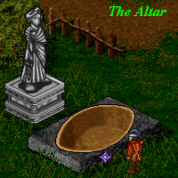

# Aisling's Guide to Ascension

_by Destine in_ ___Dark Ages___

## Introduction

_The one of great insight_  
_after having proven his metal of Hybrasyl, Mythril, or Talgonite,_  
_after a great offering of [untranslated] to the gods,_  
_died._

_He entered the land of the dead,_  
_but instead of submitting to his fate,_  
_he searched among the rubble and found_  
_way that his spirit might cross the Abyss_  
_and arrive at a forbidden home of the gods._  


_There his soul was bare._  
_There he became fiery and great._  
_There he became deep and great._  
_He returned to world, more powerful now_  
_than before he had died._

_Abhul_

This magic lore scroll provides step-by-step instructions to guide Aislings through ascension. In each step, pictures are sketched`screenshots` to help the readers to better understand where and how to proceed next. In addition, this scroll is blessed by the wisdom of Luathas Toiseach to let the readers experience the ascension.

## Step 1: Checking Requirement

Ascension was first discovered by Kiril, Undine master of magic, in Deoch 9. It's a gift from gods to extend Aisling's health and will power beyond their limit. Therefore, in order to ascend an Aisling must have achieved his last circle of 99th insight. In addition, the Aisling must have achieved Aisling of Talgonite, Mythril, or Hybrasyl metal:

+ Talgonite: To become Aisling of Talgonite, one must be of 97th insight or higher. 25 finished Talos gems are also required. Notice that an Aisling will lose certain amount of experience `50 million exp` when achieving Aisling of Talgonite at 97th and 98th insight. An Aisling will lose large amount of experience `100 million exp` when achieving Talgonite at 99th insight.

+ Mythril: To become Aisling of Mythril, one must have mentored students 200 times. The Aisling also must obtain 5 Mythril shields blessed by the same god, namely Glioca, Fiosachd, Cail, Deoch, Gramail, Luathas, Ceannlaidir, and Sgrios. An Aisling does not lose experience when achieving Aisling of Mythril.

+ Hybrasyl: To become Aisling of Mythril, once must be recognized as an Aisling award winner in either philosophy, arts, lore, or history contests. One finished Hybrasyl gem is required. An Aisling does not lose experience when achieving Aisling of Hybrasyl.

## Step 2: Visiting Mileth Crypt - Succubus's Hair

Before an Aisling can start the ascension, one Succubus's hair is needed. Succubus's hair can be found in the corpse of Succubus, who lives beyond the 23rd floor in the Mileth Crypt. Succubus are of 85th insight or higher, and they can cast very deadly spells. Therefore, adventurers must be well prepared and take caution when entering deep crypt to look for hair.


## Step 3: Visiting the Altar - The Sacrifice

After obtaining a Succubus hair, the next step is to offer the Succubus's hair into the altar. Once the Succubus's hair is thrown into the altar, the ascending Aisling will feel the inner abyss for one Temuairan day.

> _A spell will appear on your status bar, one Temuairan day is about 8 Terran hours_

The gods no longer protect you, which means you are vulnerable to Aisling's attack or spells. Ascending Aisling must sacrifice himself and die within this period. Otherwise, the Aisling must restart the process again. It is reminded that all items and garments on the Aisling will not perish after the Aisling dies.




## Step 4: Visiting Sgrios-The Rebirth

After the ascending Aisling dies, you will visit Sgrios. However, do not attempt to talk to Sgrios. Otherwise, Sgrios will cast dia aiseirighadh spell and the you will be sent back to Temuair. Instead, walk in the temple and look for a large stone piles. Walk around the stone piles and you should be transported inside the area enclosed by stones. 

>_This will be clearer if you use Tab view_

Once inside the area, walk around again and you will step through an infinite sea of blackness into an iceland.


## Step 5: Visiting Gramail and Deoch-The Ascension


Once you are transported into ice land, two temples stand in front of you. They are the temple of Deoch Toiseach and Gramail Toiseach. If you wish to increase your health, go to Deoch temple. If will power, go to Gramail temple.

Awaiting in the Deoch temple is Deoch Toiseach, the god of life and inspiration. As you bow in awe and share your experience with him, he will raise your health according to your experience and your current health.

```
You raise your hit points by buying one unit of 50hit points with your experience each purchase. 
The amount of experience required to buy hit points is determined by your current hit points:

current hit points x 500 = experience required to buy 50 hit points

For example, if your current hit points are 6600, it will take 6600 x 500 = 3300000 experience (3.3mil) 
to raise your hit points to 6650, and 6650 x 500 = 3325000 experience (3.325mil) to raise your hit points 
to 6700. You can buy hit points as long as you have sufficient exp.
```

In the Gramail temple stands Gramail Toiseach, the god of law. Gramail will raise your will power according to your experience and your current will power.

```
You raise your mana by buying one unit of 25mana at a time. The amount of experience required 
is determined by your current mana:

current mana x 500 = experience required to buy 25 mana

For example, to raise your mana from 5000 to 5025 it will take 5000 x 500 = 2500000 experience (2.5mil). 
You can buy mana as long as you have sufficient exp.
```

After you are done with ascension, you can choose to descend back to Temuair. You can ascend anytime and any number of times you want, following the same procedure.


## Conclusion


The ascension is a gift from gods to aid Aislings in their journey and exploration in Temuair. Aislings are welcome to try ascension and share their experience with the gods so that new dungeons and quests will be created. Yet, there are still more about ascension than what had been discovered. For now, follow the instructions in the scroll and ascend wisely.

## Appendix: Ascending Simulation

This part of the scroll simulates the actual ascension in as much details as possible. 

`Note: please expect the content of the simulation to be semi-OOC`. 


|Purchase Health|Purchase Mana|
|-|-|
|[](http://www.darkages.com/2000/community/lore/Destine_Ascension/BuyHP.htm)|[](http://www.darkages.com/2000/community/lore/Destine_Ascension/BuyMana.htm)|


>_Editor's Note: The ascension calculators no longer function and have not been included_

***

```
*Librarian Notes*

This entry has been edited to conform to Library formatting.
The original can be found at http://www.darkages.com/2000/community/lore/Destine_Ascension/index.html .
```
