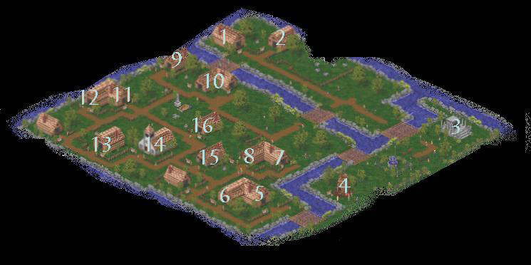

# A Peasant's Introduction to Temuair

_by Duplico in_ ___Dark Ages___

## Introduction

Welcome to my introduction to Temuair.  This is intended as a Lore entry in the monthly contests. You can see the contents on the left side. This manual is separated into three chapters with two or three sections in each chapter. They should be read in order from top to bottom on the contents, excluding the appendices, which should be used for reference. Enjoy it. There are things that are extremely out-of-character. 

P.S. This manual should be viewed in 800x600 resolution in full screen mode.

## So You Think You're an Aisling

>_Aisling_  
>_Ancient Gaelic word meaning "dreamer."_  
>_Member of the Chosen of Temuair_  

_You sleep in your humble room in Riona's inn, preparing for another day of backbreaking labor and slaving in the fields as a Mundane. You awaken with a sparkle in your eyes. The images were so vivid. Were you awake during the night? Or perhaps you are an Aisling. Surely there is another explanation! But there isn't. You have become what all Mundanes have dreamed of becoming; an Aisling. A dreamer. It is now time to join the ranks of the Chosen of Temuair. Even as a Peasant of the Chosen, you have a long way to go..._

Temuair. The world that might have been. Long ago, in this world's middle ages, the Tuatha de Danaan, the children of the light, the fae, or fairies, were born. They were driven out of Gaelic society as evil. But what if they weren't driven out? What if they hadn't been driven out? What if their society had succeeded...?

Hybrasyl. The earliest Temuairan society. Synonymous with peace. There was no disease, no violence. Only Aosda, a peaceful death by the gods. The fae lived in peace. Elements danced wildly in the fields. But then the Dark Age came. A man, loved by all, was found, dead, in a bloody pool in front of the inn. Temuair's unrivaled age of peace had ended. Soon, Hybrasyl would fall. The lands were separated into warring tribes. The age of magic soon begun. But this was not magic of peace. The wizards discovered 4 elements that could be harnessed to their own work:

> Srad, elemental fire.  
> Sal, elemental water.  
> Creag, elemental earth.  
> Athar, elemental air.  

However, soon after this a fifth element, one never before seen, was discovered. Darkness. The pits of evil. Chadul, father of darkness, sent out his legions, crushing all under his metaphorical thumb. He was successfully sealed from our lands, but at great cost. However, everywhere there is shadow, night, dark, darkness still thrives. Danaan, goddess of light, placed a part of herself everywhere across the lands, in lamps, to keep away the night. But everywhere there is a light... there is a shadow.

## A Quick Guide to the Aisling Crafts

>_Danaan_  
>_Ancient Gaelic for Light_  
>_Temuairan Mother Goddess of Light._  

_You emerge from your room and stumble toward your friend Riona's post at the reception desk of the humble inn. "I'm an Aisling!" you manage to gasp to her, still in awe. How could it be this sudden? Just yesterday you were working like a dog in the fields, today you have undergone a rush of insight, a dream, the essence of an Aisling! But you can't live as a peasant forever. There are five Aisling crafts that make you what you are._

There are five Aisling paths that give you unique skills and secrets. Wizards, masters of elemental magics. Priests, healers, and leaders of faith. Monks, reverent nature lovers, strong in martial arts. Rogues, thieves, trappers, distanced fighters; masters of wealth. Warriors, masters of weapons and armor; up-close fighters.

You should stay around the inn and ask other Aislings about the crafts. There's nothing like real-life experience to discover the particulars about a craft. Once you have decided, you should find an Aisling Guide of your particular craft. If you intend to chrystalize '((In-character for register))', seek a Mentor. If you Chrystalize, you will have no problem finding a good mentor. Your guide also makes a good mentor, usually. Once you have a Guide, follow him or her to the Temple of Choosing (3 on the Maps/Reference). The Circles within will guide you to the path. Your guide will also help you find it. There are a number of places where you can find your clothes and spells. These are listed in the Maps/Reference section.

The backbone of increasing your insight is either hunting or questing, depending on you. Many like to find a delicate balance, but I prefer questing, for reasons that any path can do it equally, and the experience comes in one "lump sum" at the end. I also greatly enjoy the chance to role-play that is offered by quests. An excellent piece of lore I have found while in one of my daily browses of the Loures Library is a tome called The Pacifist's Guide to Hunting by Seara NicCiardha. If you feel the same way about hunting as I do, you must definitely see this. I personally like mentorship as a way to gain experience. It certainly makes a difference to students, and this is what I'm trying to do with this tome. The amount of experience won from mentoring is based on the insight gain of the student. The maximum experience won for mentoring for the mentor is nearly 1,200,000 experience! This can be gained if your student rises about 20 insights. Mentoring is an excellent experience for both the Mentor and Mentee.

## Joining a Faith

>_Lothe_  
>_Arguably greatest Gliocan Priest_  
>_Fabled Temuairan Storyteller_  

_You emerge from the Temple of Choosing with your new clothes and craft. Something, however, is missing. You are ready for your adventures, with everything needed. Everything except, perhaps, faith. A faith that gives you completion. You travel to the large Glioca temple just outside of Mileth, and speak to the Temple Patron about gods. Who will you choose? And how do you worship him or her?_

There are seven gods and goddesses in the Temuairan Pantheon.

+ Glioca, goddess of love. The moon goddess. Shrine in loving Mileth.  
+ Luathas, god of Gnosis, Diving Knowledge. Shrine in knowledgeable Rucesion.  
+ Gramail, god of Laws, the weakest of the 7 primary gods. Shrine in ruling Loures.  
+ Ceannlaidir, god of war. Strong. Shrine in proud Abel.  
+ Cail, god of nature, kind, proud, reverent. Shrine by the gentle seas in Suomi.  
+ Deoch, god of Rapture, power, fire, and divine retribution. Shrine in powerful Undine  
+ Sgrios, god of death. Cruel, evil, sadistic. Shrine in darkest Dubhaim, near Rucesion.  

Each has individual abilities, and I, being but a humble Glioca Priest, cannot tell you what the others' are. Consult a Priest of each religion for help. You can recognize them by a legend mark, or asking them. Once you have chosen, consult a Priest of that religion, and he will help you be initiated. Each god have individual animals that their worshippers may summon. For example, Gliocans can summon rats, frogs, and pixies, and Sgrios worshippers can summon Dunan and other evil animals.

The key to worshipping is prayer. In order to pray, you must have Faith. Priests can gain faith in a number of ways, such as desecration, but worshippers may only gain faith through Giving Thanks and Mass. To pray, cast your Prayer Spell, drop your Prayer Necklace under you, and pick it up `((Hold shift and double click it))`. You may also speak to your Temple Patron. You may choose to pray alone or in Fellowship. Fellowship will always work better. If it is your first time to pray, you will Give Thanks, and gain a small amount of faith and experience. Pray again, and you will be able to do a few more things. Entreat and Supplicate are the same. These allow you to do a great many things, such as make yourself invulnerable with a great deal of faith. Seeking Guidance can give you experience. Giving thanks will give you faith.

There are also masses. These are group worships that you may only attend once a double-moon `((week))`. I have found an excellent tome on behavior at masses by Kerani. You should not attend a mass if you don't follow these rules. If I found out you read my introduction and didn't read Kerani's Mass Behavior rules, I may have to see that you're excommunicated. They tend to give you a great amount of experience, and faith. You may consult a Priest of your religion for greater details.

## Learning and Casting a Spell

>_The Old Tongue_  
>_The Language of Ancient Temuair_  
>_Loosely based on Old Gaelic_  

_You, Young Aisling, have done a great many things. Now, however, you must continue on your next step to becoming the avid adventurer that is all Aislings' destiny and birthright. Spells, also known as secrets, are the backbone of Wizards, Priests, and to a lesser extent, even Rogues!_

Dar. Devlin. Master of the Dark Arts. Mundane Fae Priestess. Giver of spells. Giver of spells. Dar, number 1 on your map, gives basic wizard spells, and basic priest offensive spells. Every spell requires a certain insight, and certain stats. If both your insight and stats are what is necessary for the spell, you require certain items to prove your worthiness. I can't give you much help in the way of spells, since they are an extremely personal kind of thing. Find the items necessary and bring them to the mundane. Once you learn a spell, you need to test it. Travel to the Crypt, labeled as "Crypt" on your map. Once you arrive, press "d." Now, right-click your new spell. Type in an incantation which will appear above your character's head in blue when you cast it. There are many ways to cast a spell. One way is to double-click it, then click your target. Another is to click and drag the spell to the target. Spells such as fein forms that don’t have targets don’t have to have the target clicked. Another way is to press the number key of the spell. Example: your first spell is 1, your 10th is 0. Each row holds 11 spells. Skills can be used the same way. Simple, eh? There are many spells for you to learn. The best way to find them is to explore the lands of Temuair. Skills are learned and used in the same way.

## Quests, Experience and the Mileth Fair

>_The Pact of Anaman_  
>_Contract of Evil between the Elders and Darkness_  
>_The Thousand Years of Darkness, beginning of the Dark Age_  

_This is the moment all mundanes and Aislings alike long for. You, having gained at least the first insight into the dream world of the Chosen, are the newest addition to your Craft and your Faith. It is time to embrace your destiny and begin your first adventures. There are many things to do, and even more time. You have unlimited possibilities. However, here we must part. I hope you remember the lessons I have given you as you enter the journey of your own creation. I hope sometime to hear the whispers of your greatness upon the voices of the mundanes and fellow adventurers..._

The ___Mileth Fair___ is a popular event that occurs once every Deoch year `((roughly once every 45 days))`. It is held on grounds just outside of the village and has many fun events. The best are the many booths on the grounds where you can get drunk, make foolish purchases, and be banished for lewd behavior by the common (Thank Danaan!) guards on the grounds. The height of the event is often an auction or some other interesting event of an excellent item. This should definitely be a stop for you.

__Quests__ are some of the most fun parts of Temuair. In addition to giving experience, they tend to give expensive (or at least expensive sounding) items! You should begin your Temuairan career of sorts by speaking to Riona of the Mileth Inn. She will help you define who you are by your Mundane Birth. You tell her the age you were when you became an Aisling and your Mundane birthplace. It's the first of the entertaining legend marks you may receive. Your first real quest is likely to be the Terror of the Crypt quest. It's a simple quest in which you speak to a senile old drunk in the bar who tells you about a terrible dream monster. You must venture into the crypt of Mileth (or garden of the East or alley of Abel) and slay this creature. The Terror of the Crypt is near a pillar straight left from the entrance of the second floor. Another favorite quest is the Dark Maze of Loures, or the Heart Quest. Another excellent "quest" is the Sevti Blossom not-quite-quest.

### The Heart Quest

The heart quest begins in the deepest depths of a cesspool in a place known as the Loures Prison. Inside, a political criminal, unjustly sentenced, and doomed to a lifetime of suffering. The only thing keeping this poor man sane is a lifeline of letters to his beloved Bella, kept going by those who take pity upon him and help him deliver the letters. But, alas, darkness hath befallen this poor man. His letters have not been reaching the beautiful Bella. He teeters on the brink of insanity, and sorrow. You are his last chance to reunite him with his poor Bella. But where is she, and worse, what are these creatures from surely the deepest pits of Chadul's own hell and where have they taken Bella?

+ You'll need: 1 red potion, lots of patience  
+ You'll receive: Access to Dark items, Legend mark, and [each conix worth 20k (Heart of Stone), or a ton of experience(Heart of Fire); choose one]

Your first step is to speak with the man in the first prison cell in the Loures Dungeon. You get there by going straight right and up from the entrance of the castle. Talk to him. Select the following: "The Heart." "Who is Bella?" "I will give the message to Bella."

Now, exit the prison and travel to the first room. You now must visit Jean. He has a small shop near the throne room. Take the stairs. Then take them again. Walk along the hall and turn left in the throne room. Take the door on the left. Speak to Jean. Select the following: "Cycle of Becoming." "Theology of the Conjunction" [select the top choice] [select the top choice] "Quit"

Now, leave and travel to the Enchanted Garden. As soon as you enter go straight to the right ((press up; it looks like the right)). Once you almost reach the corner of the garden, turn left. You should reach a small clearing with a single tree. Step in front of the tree. Walk around that spot until you see a red scarf. Don't take the scarf. You'll need to drop some faerie wine. This will make you lose the red potion. A faerie will appear. You need to ask her about Bella. Twice. Then she'll disappear. Hurry back to the Loures Dungeon.

You'll need to speak to the poor love lost man again. He'll be worried, but you need to ask how you can help, and deliver another message for him. Once you promise to do this, you'll exit the prison, and take the other door directly next to it. You should be in a bed chamber. Be prepared to be attacked by mor cradh (more powerful curse). Step to the bed closest to the door. Step next to the post on the right until you are either attacked by mor cradh, or sense a pulse. If you're mor cradhed, step off that area, and return. Repeat until you sense a pulse and you are given the option to feel it or resist it. You should feel it, and you'll end up in the dreaded Dark Maze! There are two types of monsters in there. The relatively weak Dunan, and the immortal Night Gaunt. If you see the Night Gaunt, don't touch it. Instead, run away. Not to worry, they're only in a single room. The maze is daunting at first, so bring a guide who's been there before for your first trek. But don't worry, in the novice maze there are only 4 looping rooms arranged in a square. The numbers increase as you grow in insight, but it's not that hard. The exits are a bit tricky to find. They vary with your insight, so ask your guide to show it to you. They're usually in the Night Gaunt room. After you find the exit, a Circle like the one in the Temple of Choosing appears. You then have the choice of two ceremonies, or to leave immediately. The items dropped rarely by Dunans in the maze are an excellent source of income, and if you do a ceremony, you may never return to the maze, so I suggest you walk out the door, or if you're a priest or advanced wizard, dachaidh away. Good luck!

### The Sevti Blossom

The Sevti Blossom quest begins in a sick child's bedchamber in the Loures Castle. She is not well. The doctors don't think that she'll live through the night. The is, however, a strange white blossom that is fabled to have healing powers. Jean, a local expert, believes that it will cure the child. Where is this white flower, and how can you get it in time to save the child?

+ You'll need: 5,000 coins, lots of guts, and a need for experience  
+ You'll receive: 150,000 experience points, the knowledge that you helped someone in need, probably a nervous tick from the dangerous swamp, and a lighter wallet

There are a number of steps that can be gone through to play this to its full potential, such as asking Jean about the Mehadi flora, but there are only a few essential steps, outlined here. This quest begins in the dangerous Mehadi swamp, just outside Loures.

## A Crash Course in the Old Tongue

___Graymare & Entreaties___

|Old Tongue Word|English Translation|
|-|-|
|tuatha|child or children|
|danaan|light, or the mother goddess in Temuairan theology|
|ao|Old Tongue prefix for the removal, or banishment of|
|beag|prefix meaning minor, smaller form of a spell|
|mor|prefix meaning more, or slightly greater form of a spell|
|ard|prefix for an even better form of a spell; awesome form|
|io dia|prayer. A spell of the io dia form is cast only through prayer.|
|fas|prefix meaning roughly "domination of" or "increased effect of"|
|comlha|suffix meaning "to the group." A spell of this form affects your group|
|fein|suffix meaning "to self."  A spell of this form only affects you.|
|gar|suffix meaning "cluster." Spells of this form affect several creatures|
|meall|suffix meaning "touching," spells of this form affect creatures by you|
|deum (deur)|suffix meaning "liquid," potions use these spells.|
|lamh|suffix meaning "in sight." A lamh spell affects anything you see.|

___Simple Spells (Priest and Wizard)___

|Craft|Spell|Description|
|-|-|-|
|Wizard|athar|Basic wind/lightning attack. Swift, fast, unlingering. Accurate.|
|Wizard|srad|Basic fire attack. Powerful, unyielding, hot. No lasting effects|
|Wizard|sal|Basic water attack. Yielding, suppressing, suffocating, drowning.|
|Wizard|creag|Basic ground attack. Not as strong, but powerful.|
|Wizard|nadur|Nature. Any nadur spell affects a creature's defensive element.|
|Wizard|leasaich|Charging of an element. This converts fiors, pure elements, into mana.|
|Priest|ioc|Healing spell. Recovers health of your target.|
|Priest|armachd|Armor. Increases your target's ability to receive physical attacks.|
|Priest|beannaich|Speed. Raises your target's ability to make contact with their target.|
|Priest|deireas|This affects your ability to damage your target, such as fas deireas|
|Priest|dall|Blindness. This keeps the target from moving but not attacking.|
|Priest|puinsein|Poison. This slowly saps away your target's health slowly, not killing.|
|Priest|dachaidh|Home. This spell returns you to your home town.|

## Maps and General Reference



|Building Number|Building Description|
|-|-|
|1|Dar's Study - Wizard Basic Spells, Priest basic attack spells|
|2|Cian's Lab - Purchases rotten Crypt items|
|3|Temple of Choosing - Choose a path and Guide young Aislings|
|4|Crypt - Basic hunting grounds. Drops include bug guts and rotten foods|
|5|Devlin - Priest basic healing spells, monk basic spells, wizard dachaidh|
|6|Callough - Weapons Master. Rogue, Monk, and Warrior spells and skills|
|7|Pub - Terror Quest, voting booth|
|8|Bakery - Breads|
|9|Fighter Training. Spells and skills for Rogues, Monks, and Warriors.|
|10|Riona's Inn - Starting point of your journeys. In the yard is the Altar. Learn about it at the Chapel (14)|
|11|Armor Smith - Basic boots, shields, and other fighter accessories.|
|12|Weapons Smith - "Spare a Stick" weapons quest. Basic swords. Stick, Dirk, and Claidheamh|
|13|Messenger - Sends and delivers messages and packages -- for a large fee|
|14|Chapel - (You must register to enter) - Get married or divorced.|
|15|Higgler (bank) - Rogues can higgle (obtain cheap items) here. You may also deposit cash and items here for a modest fee.|
|16|Tailor - You obtain basic Warrior and Priest clothes here.|

___Clothing___

|Path|Insight to Use|Bought in|Male Clothing Name|Female Clothing Name|
|-|-|-|-|-|
|Wizard|1|Abel, Rucesion|Gardcorp|Magi Skirt|
|Wizard|11|Rucesion|Journeyman|Benusta|
|Priest|1|Mileth|Cowl|Gorget Gown|
|Priest|11|Abel, Rucesion|Galuchat Coat|Mystic Gown|
|Rogue|1|Piet, Mileth|Scout Leather (Piet)|Cotte (Mileth only)|
|Rogue|11|Piet, Loures|Dwarvish Leather(Piet)|Brigandine (Loures only)|
|Warrior|1|Mileth, Loures|Leather Tunic|Leather Bliaut|
|Warrior|11|Loures|Jupe|Cuirass|
|Monk|1|Undine|Dobok|Earth Bodice|
|Monk|11|Undine|Colotte|Lotus Bodice|

_Duplico Duclieche_

***

```
*Librarian Notes*

This entry has been edited to conform to Library formatting.
The original can be found at http://www.darkages.com/2000/community/lore/Duplico_Peasant/index.html .
```
