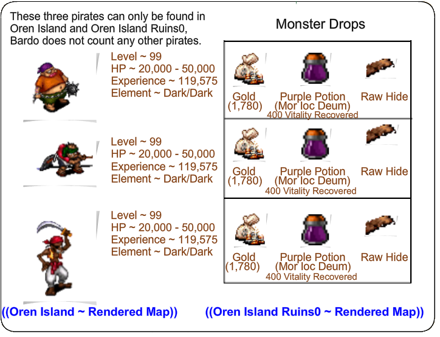
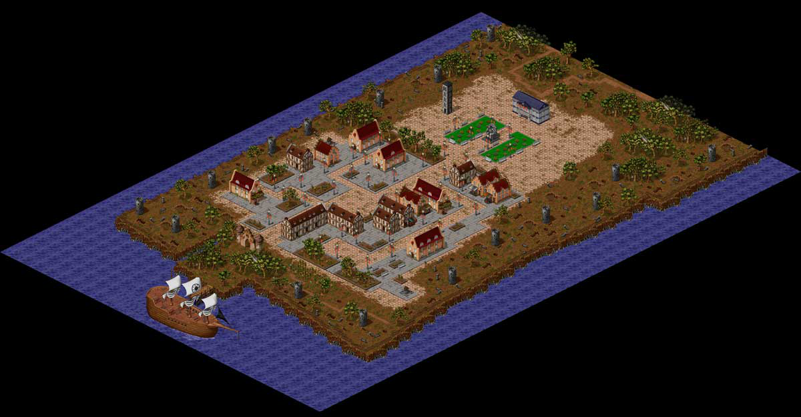
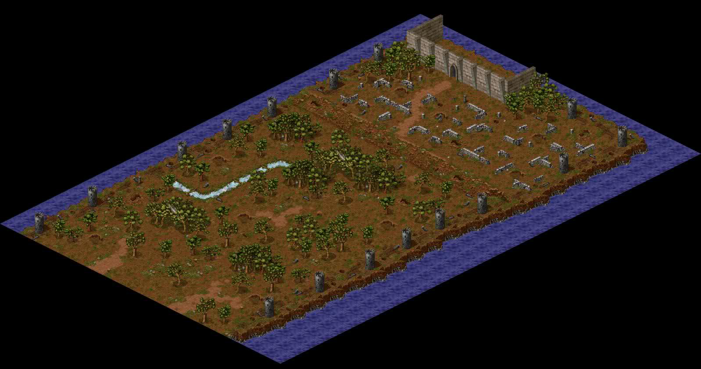
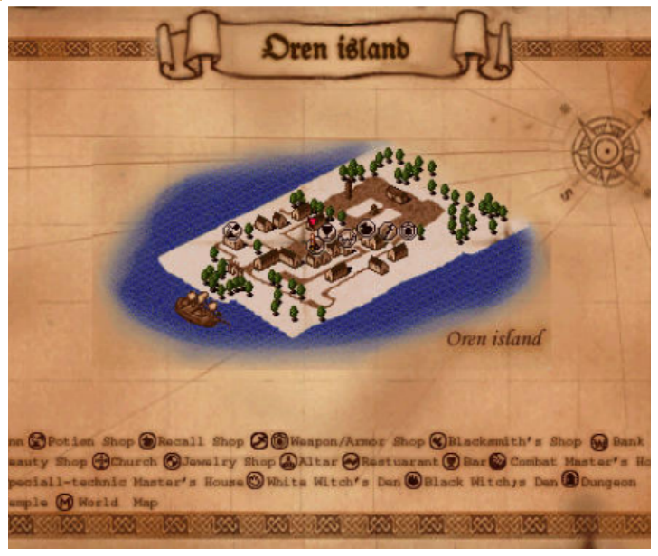

# Oren Pirate Quest

_by Eugorp in_ ___Dark Ages___


Hello! I am eugorP, and this is my Lore on the Oren Pirates Quest! Inside I give a detailed, word for word dialogue from Baldo himself. This Lore is quite interactive, so I hope you enjoy your stay and maybe even learn something while you're here.

`((Note: Some of what Baldo says is grammatically incorrect, nevertheless, I quoted him exactly.))`

The quest is given to you by a very concerned Oren citizen named Baldo. He also refuses to put someone who is not physically ready, in harms way, with that said, you must be at least level 90 to receive his first instruction.

## A Quick Explanation: How to Defeat the Oren Pirates

This guide is for classes that are starting at the minimum requirement for this quest `((lv. 90))`. You will realize that as an Aisling grows, they get stronger. As they get stronger, pirates become weaker to them and will be killed a lot faster and more swiftly. This guide complements pre-master ways to kill. However, after mastering, `((MP))` will be more efficient and you will receive stronger skills.

### Warrior

As a warrior, you may find some difficulty defeating several of the Oren Pirates. They have a moderate amount of Health and hit quite hard. A warrior is best coupled with a priest in this situation as a warrior has very few worth while ranged attacks. The typical strategy for a warrior would be to strike it with your weapon, like any other monster. In between the strikes of your weapon, make sure to use skills, for example Crasher, Wind blade, etc. Have the priest ready to heal you up to full when the time comes. After a few minutes of bashing, the pirate should start shouting as it begins to run off.

### Priest
As a priest, light spells like "Deo Saighead" and "Deo Lamh" against a pirate coupled with Mor Fas Nadur from a wizard is highly efficient.  Against these pirates you are going to need some sort of help, unless you have a lot of patience with mana regeneration. Also, pramh or beag pramh are extremely helpful before each light spell.

A good way for a priest to defeat these Pirates, is to find a corner somewhere, that you can get the pirate stuck on so that it is unable to reach you, cast whichever cradh spell you have on it to lower its armor and allow for more damaging spells. Once you are in a secure area, you may deo saighead the pirate until it is dead.

### Wizard

Because of wizards large arsenal of spells, they are one of the easiest classes to defeat a pirate with. Wizards would follow a priests general strategy of being secure, while untouchable by the pirate (behind a wall or building). Then wizards follow that up with spells such as: mor sal, ard creag etc. Mor fas Nadur on a pirate, for a wizard, is not a very good idea, due to their dark/dark element. After a while of casting spells on the pirate, he will begin to shout and run away, to fall to its death. A wizards only dilemma pre-master is mana.

### Monk

Monks will follow a warrior's general strategy, as far as attacking the monster with assails, coupled with your skills (Kick, High Kick, Wolf fang fist, etc) and possibly a priest to aid you. Because monks get dion and other dion type spells throughout their levels, they can attempt to take on a pirate so - if monks are looking for a struggle. Go with a priest, if they want to take it easy. After a while of attacking, the pirate will begin to shout wildly and run away, only to die.

### Rogue

Rogues, in my opinion have the easiest and most efficient way of defeating these pirates, it is called Maiden Trap and/or Spring Trap. It takes a few traps from a rogue, to send these pirates into a frenzy, only to find death. Rogues can easily take on a pirate alone because of their wide array of traps and immobilizing guile. If in fear of death, the hide ability is very helpful in emergency purposes.

## Oren Pirates Quest

This quest is begun by Baldo, in Oren:

> These wretched pirates are making us prisoners in our own homes. We are too afraid to venture out of our houses. The King won't appear in public for fear of his life. Our businesses are failing cause of them.
>
> I wish nothing more than the see them gone. If you can defeat a couple of them I will be very greatful.  
>
> Care to Help? `((select Yes))`
>
> Good. Now drive some of those pirates out. Everytime you defeat three of them, come back to inform me of your progress.

Upon killing three pirates, Baldo will say:

> Great! Your still alive, tell me of your progress.
>
> _I Killed 3 Pirates_
>
> Wonderful! Great job! You are making Oren Island the wonderful place it used to be.
>
> Keep informing on your progress defeated these barbarians.  The more you subdue, the more likely I'll give a trophy of sorts.

Upon killing three more pirates (6 total), Baldo will say:

> Great! Your still alive, tell me of your progress.
>
> _I killed 3 more Pirates_
>
> Wonderful! Great job! You are making Oren Island the wonderful place it used to be.

Upon killing three more pirates (9 total), Baldo will say:

> Great! Your still alive, tell me of your progress.
>
> _I killed 3 more Pirates_
>
> Wonderful! Great job! You are making Oren Island the wonderful place it used to be.
>
> Here's a gift for you. Take this as a reminder of exploits subduing these pirates.

Baldo will then award you with a Black Pirate Bandana (male) or a Black Pirate Scarf (female).

Upon killing three more pirates (12 total), Baldo will say:

> Great! Your still alive, tell me of your progress.
>
> _I killed 3 more Pirates_
>
> Wonderful! Great job! You are making Oren Island the wonderful place it used to be.

Upon killing three more pirates (15 total), Baldo will say:

> Great! Your still alive, tell me of your progress.
>
> _I killed 3 more Pirates_
>
> Wonderful! Great job! You are making Oren Island the wonderful place it used to be.

Upon killing three more pirates (18 total), Baldo will say:

> Great! Your still alive, tell me of your progress.
>
> _I killed 3 more Pirates_
>
> You truly are a threat to these seadogs.

Baldo will then award you with a Pirate Garb (male) or Pirate Dress (female)

## Bestiary



## Maps

  
___Oren Island___

   
___Oren Ruins___

  
___Oren Map___

## Prizes

There are two prizes that come out of this quest for each gender. 

The first prize for a male is a Black Pirate Bandana (Killing 9 Oren Pirates), and the second prize is a Pirate Garb (Killing 18 Oren Pirates). You can wear these garments at level 11.

The first prize for a female is a Black Pirate Scarf (Killing 9 Oren Pirates) and the second prize is a Pirate Dress (Killing 18 Oren Pirates). You can wear these garments at level 11.

Upon receiving each prize, you are also awarded 200,000 experience. 

As an added bonus, every three pirates you kill, Baldo gives you a legend mark. This legend mark only goes up by increments of three and continues on infinitely after the last prize is received (every three you kill).

"Has Defeated __ of Oren's Pirates"

```
*Librarian Notes*

This entry has been edited to conform to Library formatting.
The original can be found (in flash) at http://eugorp.wix.com/test .
```
