# Aithne im-cànain àrsaidh: Lore of the Old Tongue
 
_by Galadriei in_ ___Dark Ages___ 


During transcribing the ancient scripts i discovered a lot of words in the 'Old Tongue', which were used by people of the first ages. Because many of these words are still used by the mundanes of Temuair although most aislings do not know their meanings, i decided to put a few of them (i hope i got the most important ones) into this lore.

Unfortunately mundanes forgot the right pronunciation of some ancient words; they speak some kind of 'Temuairan slang', simplifications of the ancient words. I put all together in the following tables with a translation into common language, spoken by most aislings.

To further imaginations of certain meanings, i added some drawings. 
  
|Imagination|Old Tongue|Temuair Slang|Translation|
|-|-|-|-|
||aisling||dream|
||àite|aite|place|
||ao||not|
||aonaran||hermit|
||aois-dà|aosda|age-two|
||àrd|ard|high, great|
|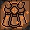|armachd||armour|
|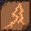|athar||air|
||baiseach|bais|heavy shower|
|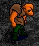|beag|small|
|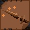|beannachd|beannach|blessing|
||beatha||life|
||beathach||animal, beast
||beothaich||kindle, light|
||breisleach|breisleich|confusion|
||càil|cail|vigour|
||callaid-bhròin||elegy|
||ceannlaidir||obstinate|
||cha-dùil|chadul||no-element, no-hope
||còmhraig||fight, combat|
||còmhla|comlha|together|
|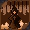|cràdh|cradh|torment|
|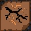|creag||rock|
||dachaidh||home|
||dall||blind|
||daonnan||danaan|always|
||deireas|deiras|injury|
||deò|deo|breath|
||deoch||drink|
||deur|deum|drop|
||dhuit|dhat|to you|
||dia||god|
|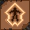|dìon|dion|protection|
||dorcha||dark, dusty|
|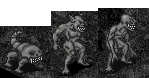|dubh-ainmhidh|dubhaimid|dark beast|
||fàs|fas|grow|
||féin|fein|self|
||fiosachd||divination|
||gar||near|
||gliocas|glioca|wisdom|
||gramail||strong, vigorous
|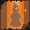|ìoc|ioc|cure|
||ionad||place|
|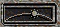|là|la|day|
||lamh||hand|
||leasaich||improve|
|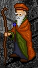|luathas||swiftness|
|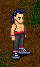|manach||monk|
||math||good|
||meall||lump|
||mór|mor|great|
||nàdur|nadur|nature|
||naomh||holy|
||nochd||night|
|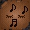|pràmh|pramh|slumber|
||puinneag||beat|
||puinsean|puinsein|poison|
||rath||prosperity|
||saighead||arrow|
|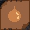|sal||sea|
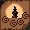|seun||charm|
||sgrios||destroy|
||slàn|slan|healthy|
||spìon|spion|pluck up, pull, tear|
|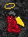|spiorad||spirit|
|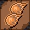|srad||fire|
||strìoch|strioch|streak, line|
||suain||sleep|
||tìr-mùir|temuair|earth-sea|
|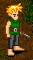|tuatha||people|

Some few words i discovered are of certain dialects: reannán (used was reannan) which means 'star'. Also two words in some of Lethalia's works, which do not have a direct representation in 'old tongue': lioarlan which means 'library' and ynsagh which means 'knowledge'. 
 
If you ever find any further words in ancient language i did not mentioned, tell me and if they are important enough and not too few i will write a second part of the Lore of the Old Tongue.

`all words in 'old tongue' are in fact scottish gaelic, reannán is irish and Lethalia used manx gaelic. if you have comments to the translation, please tell me at least a different root or link to a different gaelic dictionary`

_by Galadriei Altariel_  
_Lady of the Light_  
_Sal Mage of Temuair_  

```
*Librarian Notes*

This entry has been edited to conform to Library formatting.
The original can be viewed here http://www.darkages.com/community/lore/Galadriei_Tongue/index.html .
```