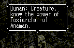
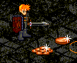
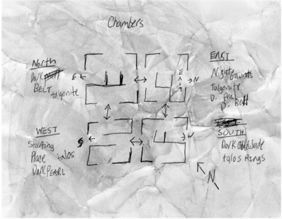
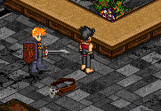
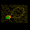
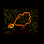
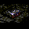

# Treasure Hunters’ Guide to the Lost Labyrinth: A Guide to the Dark Heart

_by Gokuden Ishraki in_ ___Dark Ages___

_On a quest of the Heart, I found myself in the Sgriotic nightmare of Marlin. I stumbled through the chambers of this dark place, seeking to deliver a message to his beloved Bella. In that quest, I came across a new breed of Dubhaimid, imprisoned in this "alternate world", hungry for Aisling flesh. I engaged them in combat, and upon searching them after the battle, I found the most interesting things..._



## Demons of the Labyrinth

__Dunan__

In this nightmare of a place, I have only encountered two forms of neo-Dubhaimid. The first is the Dunan, which are similar to pupa Dubhaimid in form. They are easily dealt with, but are extremely hostile, and attack in great numbers. These Dubhaimid use the spells beag dubh and beag cradh, an attack of dark power and a minor curse. While most battle-hardened warriors can withstand the spells' assault, being surrounded by several Dunan all assailing with dark magic can prove fatal.

__Nightgaunt__

The second type of demon that lurks the twisted corridors of this strange world are the Nightgaunts. They are only present in the East Chamber of the nightmare. Run for thy life if you glance upon these winged aberrations, for to engage one alone is to beg to be delivered to the hungry jaws of Sgrios. In addition to commanding truly demonic strength, their innate dark magic is far stronger than the Dunan that serve under them. They attack with mor dubh, a fierce blast of dark energy, that has sent me to Sgrios many a time with a single casting. These beasts also attack with cradh, a curse that can weaken even the strongest of men. It seems as well, that the effect of the attacks by these hell spawn negate the powers of the grave ring, as two grave rings have failed to aid my escape from death when defeated by these monstrosities.

## Map of the Labyrinth



Lost and confused, I traveled through the labyrinth, seeking out Marlin’s beloved to complete my oath to him. Seemingly a moon had passed, and after constant battles with the neo-Dubhaimid and lack of food, I sat against the wall, contemplating if I would ever escape this maze of shadows.



I soon discovered there were four chambers to that "other world", North, South, East, and West, though direction in this realm is distorted, to say the least. I also discovered that the neo-Dubhaimid of certain chambers carried particular items with them (though items appear in other chambers as randomly as well). In Chamber West, the starting chamber, the demons were more prone to carry Dark Pearl necklaces. In Chamber North, the coveted Dark Belts are prevalent. In Chamber South, searching a fallen neo-Dubhaimid will yield Dark Gold Jade necklaces. In the final chamber, Chamber East, you can find any of the treasures (as well as the exit on its east side), but must contend with the powerful Nightgaunts. In a fit of rage, I did engage a Nightgaunt, and after I slew him, I found the most coveted item of all, the Dark Amber necklace. I strongly believe that they also carry Dark Jade necklaces as well, but *clutches his latest scar* I do not seek to prove my hypothesis alone. In all the chambers, Talos rings can be found, as well as the highly sellable Raw Talgonite, which I have sold for up to 750,000 gold.

## Treasures of the Labyrinth

_The item I originally found was a belt, an ominous looking piece of armor with the skull of a Dubhaimid attached as its buckle. I had not the insight to wear such an item, so I sang the song of Ceannlaidir and was teleported to his shrine in Piet. I spoke to my brother, Gokuden, as his knowledge of things "Dark" was vast._



This is a simple chart showing the items that I have found in my treasure runs in the Lost Labyrinth. I have been told that releasing the dark energy from the neo-Dubhaimid can create other treasures than these, and that every item with an elemental type has a "Dark" counterpart. The treasure hunter in my soul will seek these items out for as long as I am able to lift my sword to hunt.

|Image|Items|Chamber|Properties|
|-|-|-|-|
||Dark Belt|North, East|Added protection from "Dark" elemental spells|
||Dark Amber Necklace*|East|+2 DAM, Adds curse to attack|
||Dark Jade Necklace*|East|+10 HIT, Adds curse to attack|
||Dark Pearl Necklace|West, East|+5 HIT, Adds curse to attack|
||Dark Gold Jade Necklace|South, East|+1 DAM, Adds curse to attack|
||Talos Ring|All Chambers|Adds 100 to Health Points|
||Raw Talgonite|All Chambers|Used in Ring Smithing, used to create Level 97 armor, Aisling of Talgonite status.|

*Indicates item ONLY dropped by Nightgaunts

_Complied from the journal of Hyo Shiroji by Gokuden Ishraki._   
_May Ceannlaidir guide his blade, and Sgrios stay his hunger..._

***

```
*Librarian Notes*

This entry has been edited to conform to Library formatting.
The original can be found at http://www.darkages.com/2000/community/lore/Gokuden_Heart/index.html .
```
