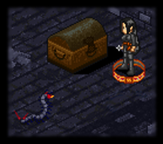

# Arts of the Rogue

_by Gothan in_ ___Dark Ages___

While it is our array of nasty traps and snares that rogues are famous for, one must not overlook the refined arts that characterize our roguishness. We are the masters of trickery and hiding in shadowy crevices, yet this is not all a rogue can do. Talented rogues are adept in gem and ring smithing, tailoring garments, fashioning masterful blades and soori, and lock-picking dungeon chests. When I was young these things mattered little to me, for my traps were the staple of my insights. However, as I learned the many skills unique to rogues, I discovered that these abilities are useful and often rather entertaining.

## Tailoring


Common garments can often be dull or not offer you the protection you need. However, rogues, monks, and skilled warriors can work on these clothes, and improve upon them. By adding extra padding here and there, a bit of stitch work, and an improved design, you can alter clothing to offer more protection to its wearer. These improvements range from simply good and finely crafted clothing, to the beauty and extended protection offered by great and grand garments fashioned by master tailors.

An individual skilled in tailoring can also assist in dyeing clothes. The mundane tailors value their tools, special dyes, and expertise, although they will lend them to a politically respected Aisling. With the use of the chemical dyes and knowledge of the mundane tailor, you can alter the clothing to the color and style unique to a particular city. Thus, the patterns and techniques used in Rucesion will create a garment different than that of Suomi, or any other city. Dyed clothes allow Aislings to stand out and appear unique from other Aislings.

## Higgling


Higgling allows rogues to purchase mundane items that might not be available as common stock in a store. These materials can include fresh berries from the vines of Suomi, wolf pelts from woodland trappers, or the sweet fermented wines made by the Piet goodwives. Although these might not be currently in the shop, a rogue can order them for a small fee of 500 coins through a local higgler. Of course, you must be willing to spend a bit of time waiting for the wares to come in. Other Aislings will often employ a rogue to higgle them some berries or wine to save themselves the trip, which can be a good source of some extra pocket change.

Another useful application of higgling is, for a scant few coins and some time, "pick the brain" of your local higgler to learn some of the properties of items in your possession.

## Gem Smithing


The art of gem smithing allows a rogue to polish uncut and raw gems, or even gem fragments, into valuable finished gems. Finishing gems requires some time, and an assistant will greatly increase your chances of success. To begin, one must first know the gem smithing skill, which is taught by Jilt in Piet.

You may begin by setting up your tools needed in a quiet corner of Temuair, or returning to Jilt's shop to borrow his fine array of gem smithing tools. Then, if you are working with your own tools, sit down and place a coin or two from your purse by your feet. This may seem a bit odd, but it’s a strange trick I find rather helpful. Because each rough gem is shaped differently, you must first fashion a molded stand to hold the gem you are working on. I find that a simple copper coin can easily be worked into a useful gem holder. A rouge should always carry their own smithing set, complete with chisels, a sculpting hammer, rasp and file, picks, clamps, polishing rags, and an eyeglass. You never know when ya need to quickly smith some gems without returning to town. Work slowly and be patient, for one does not wish to risk cracking or even shattering the gem. In time, your skill will improve greatly.

There are three common types of gems: beryl, coral, and ruby. These can be found deep within caves such as those in the Pravat mountains, carried as trinkets on fiends you slay, or stashed in ancient chests deep within crypts and catacombs. These are not difficult to smith, although one must be careful with coral because it has a tendency to splinter. Such gems can be used to decorate fine garments, or be worked into elegant rings. There are also other precious metals, such as the prized Talgonite and Hybrasyl, which are as splendid as they are rare. Masterful gem smiths can finish these raw metals, which can be worked into great sets of armor.

## Creating Rings


As I alluded to, one talent of a skilled gem smith is their ability to work uncut and finished gems into exquisite rings. These delicate workmanships can offer enchanted might or stronger willpower to their wearer. For a small sum of money for tools and supplies, most armorers will lend their instruments to gems smiths who can begin working on a fine ring, and setting gems into it. I highly recommend an assistant for this delicate task, for few can create such finely wrought jewelry on his or her own. With patients, and a bit of luck, you can work almost any kind of gem into a beautiful and beneficial ring.

## Studying Creatures

Ah, yes... such a skill can be an invaluable tool for a rogue. Studying creatures allows you to discern many useful attributes of the monster. A rogue can by observing a creature tell which type of creature it is and how much experience and knowledge would be gained from battling it. With practice, a rogue can determine the health of the creature, and with more skill a rogue can determine the creature’s toughness. Eventually, when the rogue has mastered this skill, they can even discover the attack and defense elements of the fiend. All this information on a creature is an asset to a rogue, and companions they might be hunting with.

## Hairstyling

Rogues have the unique ability to style and dye other Aislings hair. If you are skilled and rather dexterous Cassidy, the higgler in Mileth, will teach you how to properly cut, trim, style, and dye others hair. Hairstyling consumes a bit of time for both the stylist and the Aisling having their hair done. Aislings can choose from a wide variety of styles and colors, and the result is a new rather unique hairdo.

## Soori and Blade Smithing

Although the main weapons of a rogue are their traps, a trusted soori or sharp blade can often mean the difference between life or death. Rogues can smith soori and blades, making them sharper and well balanced, to cause greater damage to their opponents. Any rogue can borrow a weapon smith’s tools to smith the soori or blade. A few hours of labor are required, as well as an assistant if you wish to succeed, but the outcome is an improved good or fine weapon. These blades require more knowledge and insight to wield because of their craftsmanship. Great and grand blades are even further improved than fine weapons, although they cannot be smithed by Aislings.

## Lock-picking



_I remember in my younger years when I crept through the Mileth crypts, and my eyes first laid upon one of those chests. It sat there, massive and rotting from its age, yet sturdy and foreboding. I had just come from the tutelage of Daithi in Mileth, who had taught me how to pick and open locks. I stared at if for a while, its gleaming lock looked nothing like the ones I had practiced on. The padlock however was bolted shut, promising of some unknown treasure inside. I sat in front of it, anxious and a little frightened, and set my thieves picks down in front of me. I went over the diagrams Daithi had shown me in my mind, and began. I pressed a pick in, and quickly found a hidden groove and latch, and another pick ... turned it ... and heard a familiar click. That was it? Instinctively, I reached my hand to lift the latch._

_"Foolish", as Daithi would have ridiculed, for a thin needle sunk deep into my finger. I let out a yelp and drew back my hand, and to my dismay. For the needle, and now the wound, was coated in a strange yet sickly all too well-known umber green substance. My head began to swim and my vision became a little blurry, and slowly my muscles felt cold and weak. I would have collapsed there and rested, were it not for the scratching multi-legged noise I heard behind me. Frightened, I quickly lifted the chest and grabbed whatever was inside, hoping it truly was worth meeting Sgrios again! I scampered off as fast as I could away from the hungry 'pede, and collapsed in the crypt entrance. I was still clutching whatever it was when I regained my health. I turned it over in my hands, a delicate ring made from bright gold metal with a yellow gem set into it, and slipped it onto my finger. It was but a little while before I tempted fate and tried that stunt again!_

After trial, and a good deal of error, a rogue quickly learns the tricks and traps of lock picking chests. If I actually sat down one day and weighed the treasure over the risk to life, I would probably not continue to unlock chests. But it is the fun of it, and the promised rewards for which one seeks. Besides, I think I've acquired a taste for hemloch!

There are a few things a rogue needs to pick locks: a little training (which can be provided by Daithi), a set of thieves picks, a bit o' luck, and perhaps some method of counteracting the curses and traps laid upon the chests. Whatever ye do, if you're in danger, a personaca or hydele deum usually does the trick, and an arcane song at hand is highly suggested.

## Hide in Shadows


Such an ability is a renowned art unique to rogues. Fisk in Suomi can train ye to be a master of the shadows, invisible to the common eye. This ability is useful in so many ways. I have often hidden to travel through dangerous areas, explore unknown reaches, escape from hungry fiends, or lay traps without being preyed upon by what you are hunting. I have also found several humorous uses of this skill, but I'll leave that for ye to find out ...

There are a few things I believe younger rogues should know about the ability to hide. First, any hostile act will call attention to where you are hiding, thus making you visible to enemies. These include throwing a soori, stabbing, and taunting enemies. Hide can be effectively used however to allow you to position yourself to backstab a monster. Speaking while hidden does not give away your position to creatures, although Aislings will be able to hear you and pick out your location. Also, always keep an eye on how long you can continue hiding before you lose concentration and become visible. You do not want to suddenly appear visible when you're in a hostile area.

One last thing to know is that - although I have yet to find monsters that possess these abilities - Aisling monks can use the skill Cat's Hearing and rogues Eisd Creutair to see the invisible. Thus, always be wary of those who might have that ability if you wish to remain hidden. Narve, the Piet fae priestess, can teach ye Eisd Creutair, if you wish to know it. Another point to note it that, unless you are speaking, members of your group will not be able to see you.

## Mending Weapons and Clothing

When wandering through Temuair, or hunting in its monstrous inhabited regions, one's things can become worn and threadbare, and even break if not mended. Although the armorers in Temuair who have devoted their lives to this craft are the most skilled at repairing worn items, you can learn to do so as well. Steinar, the Abel armorer, will gladly teach you the skills needed to mend your soori or blades, and patch worn garments. These skills can be quite useful, since one is not always near an armorer or weapon smith when the hilt of you blade becomes loose or your armor threatens to fall apart. Especially in the middle of a hunt!

I advise that you first practice these skills on common shirts and blades, and become familiar with the techniques. If you begin working on your clothing, and forget a crucial step, you can destroy the garment completely. Woe is the rogue who tried to mend his clothes and weapons while hunting, left out an important element, and had to scurry back to town, naked and unarmed!

_written by the rogue Gothan,_  
Dedicated to all the rougelings who ever asked me questions of these arts...

***

```
*Librarian Notes*

This entry has been edited to conform to Library formatting.
The original can be found at http://www.darkages.com/2000/community/lore/Gothan_Rogue/index.htm .
```
