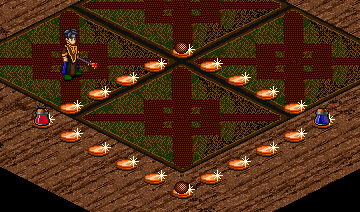
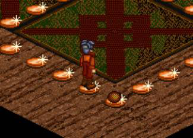
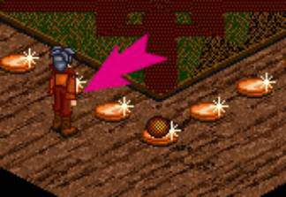

# Temuairan Wrestling

_by Klaudaryn in_ ___Dark Ages___
 
Temuairan wrestling has its roots in an ancient sport practiced for a thousand years prior to the War of the Shadows. The old sport began as a form of martial training for soldiers in times of peace, but soon degenerated into a crude blood sport of pit fighting, where countless fighters were injured, maimed and even killed. The gradual decline in society prior to the War of the Shadows was typified by the attitude of the general populace, who reveled in such bloodletting and senseless brutality.
 
Needless to say, the War of the Shadows hammered in some lessons that could otherwise not be learned, and such incidents of decadence and savagery were soon stamped out by the New Order. Yet the spirit of sport prevails till today. The revival of Temuairan Wrestling by an unidentified group of Aislings has been taking place. These events, still frowned upon by the authorities, are conducted in secret venues known only to a select few. As yet, the sport remains a noble idea, with excessive violence frowned upon both by the fighters and the patrons. Below is a brief summary of the sport as per the information I have gathered in my investigations.
 
## The Ring
 

 
The Ring is the area in which the confrontation occurs. It is normally a hastily constructed contraption (for quick dismantling in case of discovery), about six large paces squared.
 
## The Fight
 
The objective of this sport is simple. Two fighters enter the ring at the start of a round, and only one should remain in the ring at the end of the round.
 
Two of the four corners are marked Red and Blue respectively. These are the starting corners for the contenders, where they must remain until the umpire declares the round open. The other two corners are null zones, where fighters can claim sanctuary. Upon claiming sanctuary, the round is restarted, with fighters clambering back to their initial positions.
 
As soon as fighters come into contact with each other in the Ring, a series of grapples and holds are attempted, with each fighter struggling to overpower the other.
 
`((Fighters are unable to move once adjacent to the opponent and the opponent declares a *grapple* ))`
 
Upon successfully grappling the opponent, fighters now concentrate on throwing their opponents out of the ring.

```
((Fighters now attempt to use their Throw skill in an attempt to force their opponent closer 
to the edge. Once a throw is successful, the target is flung one pace back and cannot move from 
his/her position if the attacker decides to follow up on the throw and moves again adjacent to the target.))
```
 
Fighters who are thrown back will then struggle to get to their feet again as the attacker presses the advantage and attempts another grapple and throw.
 
```
((If the follow up move is taken, then the attacker is assumed to automatically *grapple* 
the downed opponent and can attempt yet another throw. If this throw is successful, then the 
opponent is thrown further back towards the edge of the ring.

If the throw fails, however, the downed opponent is free to get up and move again, unless 
the attacker is quick enough to successfully *grapple* him again.))
```

If a fighter is thrown to the ringside, he is considered to be hanging on at the edge and can no longer move unless he manages to fend off the attacker.
 
`((Fighters pushed onto the edge of the ring cannot move unless they manage to repel their attacker by successfully attempting a throw against them. In which case, the fighter is allowed to struggle free from the ropes and jump back into the fray.))`



## Victory
 
Victory occurs as soon as a fighter is thrown out of the ring and onto the hard floor. The wrestler remaining inside the ring is declared the winner of the round by the umpire and depending on the victory conditions of the match, is declared the victor.
 

 
## Winnings
 
Wrestlers can expect to earn significant income, depending on their sponsors, and whether the organizers of the fight have provided for a Victor’s Prize or not. The prizes range from magical items, to cold hard currency.
 
As these matches are underground events, gambling amongst the audience is commonplace, and often, punters even pay off certain wrestlers to lose. Fortunately, this is frowned upon by the enthusiasts, and fighters who obviously throw matches will find their career a very short one indeed.
 
## Variations
 
There are many variations to the basic fight described above, with larger rings and more combatants, and ad-hoc rules. In general, fighters are only allowed to use physical skills, though certain seedier elements enjoy watching invisible wrestlers attempting to find each other before even attempting throws.
 
## Summary
 
Temuairan Wrestling is making a comeback. Though frowned upon by many mundanes as a throwback to a more violent age, I see it as a noble sport, where differences can be solved by a means other than constant bickering. Of course, the potential for it degenerating into something deplorable is definitely present and as long as it remains an underground sport, that potential only grows.
 
_Klaudaryn Armagh, Deoch 7._

***

```
*Librarian Notes*

This entry has been edited to conform to Library formatting.
The original can be found at http://www.darkages.com/2000/community/lore/Klaudaryn_Wrestle/ .
```
