# Aisling's Seòl Chum Dìlse: An Aisling's guide to Relationships

_by Landon in_ ___Dark Ages___

Let’s face it, there are some of us that excel in Aisling to Aisling relationships...they have all the answers to all the questions, the perfect solution for every problem, and a suave line for every Aisling girl...
Then there are those of us that have come to fear the relations that our kin have mastered...we hesitate on every question, ponder problems for moons, and break out in the Mundane Flu every time a girl comes knocking...

This guide is meant to be a savior of sorts for those of us that fit into the second category. In this lore, I will put forward some personal experiences and techniques that I have already used with a good amount of success! Fear no more, anti-social Aislings, yer about to learn everything ye need to pick out, and rope in, the Aisling of yer dreams!

(Just a small note, this lore is created with the male Aislings in mind, women Aislings can also apply this knowledge, just adjust it a little)

## Finding a Date 

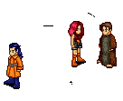

Let's face it, there isn't really a lack of women in Temuair! In fact, many new women come to Temuair each and every sun! However, just in case yer still having a problem finding the right Aisling girl for ye... here is yer section...

### Location, Location, Location!

Now, logic dictates that most women are going to live inside the Mileth province. Simply because there are many more Aisling that reside there. Do not... I repeat... DO NOT just stand around, sharpening your sword like a tough man, and expect some girl to come up to ye... because chances are going to be rather slim or none at all.

To find the women, yer going to have to get up off the ground and look for one! It's best to begin yer search in Mileth.

### Popular Hang Outs

A Few of the more likely places that ye will find single women include, but are not limited to the following:

+ Religious Temples, especially Glioca Temple  
+ Main Entrance of Mileth  
+ East Woodlands entrance  
+ Main Entrance of Abel  
+ Mileth Crypt  

### Guilds and Religions

Joining an established and populated guild will increase social awareness of ye, and in turn, allow ye to get to know more women in a non-dating atmosphere. Although it is deemed inappropriate to beg for dates on guild chat.

The same applies for religions, however, joining a religion solely based on the idea of getting to know the women in that religion is... frowned upon.

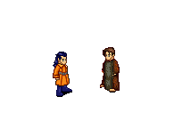

### Politics 

Holding a political position will allow ye to expose yerself to a wide range of Aislings in the form of interaction with officials, victims, and... even criminals. There is no law against dating a felon! Thank Gramail for that.

### Dating the Bonded/Dating the Married

This becomes a very touchy subject, but as a good rule of thumb... try and stay away from married or Fae bonded women. It's a big no-no, and should be avoided at all costs... ye don't want to be on the bad end with a master warrior...

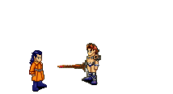

## First date and dates after that


Now that ye have chosen a target, ye should start to gather up all that stuff, that I like to call courage, and ask her out on a date! What? Afraid? Rejection? What if she says yes? No problem! All that and more is covered in this section!

### Preparing for the First Date

Sweating? Yeah, ye should be. Yer about to go on a date that is going to end up in ruin at the end...that is, if ye don't follow some of these simple pointers for getting ready for the date...

#### Flowers, the backdoor to a woman's heart

If it be either a bouquet of roses or a single Tulsi Blossom, the flower has a mysterious effect on the female of almost any species. On yer first date and dates to follow, it's would be a nice gesture to bring along a flower of some sort and give it to yer date. Flowers won't quite get ye the key to her inn room, but it'll at least get her thinking about it.
Some types of flowers are as follows...

+ Tulsi, Nila, Sevti Blossoms

+ Rose Bouquet

+ Man's Bouquet

+ Spring Bouquet

#### Don't over dress... don't underdressed

Clothing isn't a very big deal, but the wrong type of clothing can break the mood of the date.

Wearing a tux or a wedding dress is, obviously, overdressing. 

Any type of heavy armor should be avoided, for the simple reason that a woman doesn't want to look at yer dirty, worn out plate mail. Warriors should stick to a Jupe at the most.

Also, do not wear anything that connects ye to the dark side or has been worn by a monster before ye got it...that means no Pentagram Suits! (note: of course, if ye both are dark in nature, then it would be all right, but this is the first date!)
Don't wear any political uniform on a date, a uniform only reminds ye of yer job, not of leisure time.

Never wear a ragged shirt on a date, this is a classic example of under dressing

#### Tune Out Whispers and Guild Chatting

Train yerself, before the date, to tune out any whispers or guild chatting that may come yer way. Ye can't focus on yer date if ye are taking to others through whispers.


### Places to Take Yer Date

Temuair has a wealth of sights and wonders to behold to a dating couple. Sadly, most of us have been around too long and have started to take some of these places for granted, and often would not think of them as good spots to have a date. A date can take place almost anywhere, with the exception of hostile areas and inn rooms. Yer not a hunting party, yer a dating group and also yer not going to need a bed on the first date, so don't even bother innkeeper Maria, cause yer not gonna use that room.
Some nice suggestions for a date location:

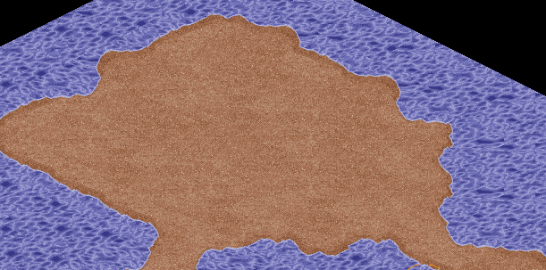  
Abel Beach - The beach is the ideal location for any first date. During the daylight hours ye can lounge around near the water edge and play. During the night time hours ye can sit back away from the water and look at the beautiful view of the sky that nowhere else but the beach has. The beach is also somewhat secluded from Aislings, except for a few crypts bound hunters.

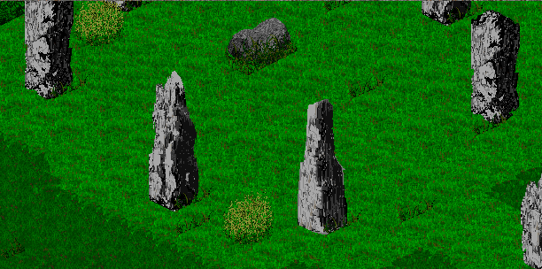  
Druid Circle - Perhaps one of the most mysterious places in all of Temuair. The Druid Circle has the atmosphere of the garden, without any of the mantis or bee attacks. The Circle almost always peaceful, for many Aisling do not explore the area and many don't even know of its existence! The friendly druid will always spark up a conversation of ye ask him a question, or he'll go about his business if ye only with to talk with yer date.

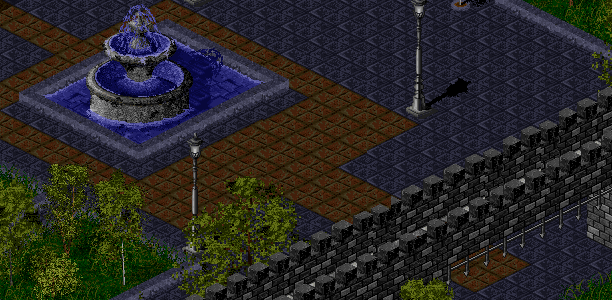  
Loures Castle - The Castle of Loures is the architectural masterpiece of Temuair. Many locations inside the castle can provide insight on pre-Deoch dating history, as well as provide an intellectual couple with a most enjoyable date. Many of the servants are willing to allow Aislings to stay a night in one of the many rooms. Some things to avoid in the castle are the king's throne room and Master Jean's work area...other than that, the Castle of Loures will keep ye busy with its sights.

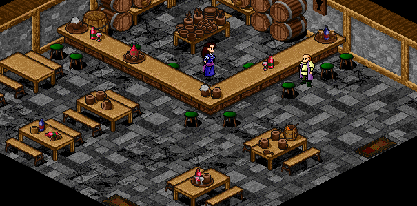  
Any Tavern - Basically speaking, every tavern in Temuair can provide a wonderful dating experience. I always say...nothing like getting drunk with the girl ye love. Be careful not to drink too much, and then make a fool out of yerself in front of yer lady friend. Some taverns are of higher standards than others...the Tavern of Abel as well as the Tavern of Suomi have strict rules that ye would be wise to memorize.

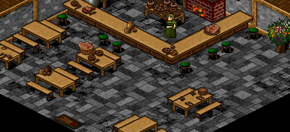  
Any Eatery- Same with the Taverns, the eatery is a great place to get together. The provider of great food and high-class entertainment. Higher quality eateries can be found in Abel and Piet.

### On the Actual Date

Yer on yer own with this one, boy. Every woman is different, so that means that not even I can predict and guide yer way with yer lady. Just remember to be yerself and get a kiss at the end!

### Getting a Second Date

If ye didn't get a kiss, or a hug, or a handshake at the end of yer first date, then don't even try to get a second one, it's over buddy, it just wasn't meant to be. If ye DID get one of these, then by all means, whisper her next time she's awake and roaming Temuair...but not right away. Ye'll appear desperate, and just cause ye are desperate, doesn't meant that ye have to appear that way.

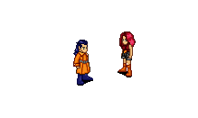

## Fae Love

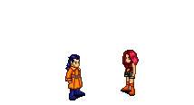

Let's set the scene... Ye have been on several dates now, and yer starting to have this weird feeling when yer around her. Guess what? That feeling is the elusive LOVE emotion. Now what do ye do? Ye go and get fae bonded at the lover’s glade! Don't know how? That's what this guide is for! Read on for all yer Fae bonding needs...

### The Lover's Glade

The Lover's Glade is located in the enchanted garden... once ye enter, turn to yer right and walk straight, ye will eventually end up inside of the Lover's Glade. The glade is a place for a couple to be bonded by the fae. This bonding in a ritual of love and must be started by a priest. There is room inside of the glade for family and friends to watch, but usually, the bonding is done with only the couple and the priest.


### Decorating the Glade

This is just a fun little thing that adds a little spice to the ol’ glade. Decorating the glade can be done with almost anything, but the most used items are coins and flowers... and just to save ye time... don't even try and make a heart out of coin that ye both can stand in, it doesn't work.

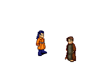

### Getting the Girl to the Glade

This seems rather straight forward, doesn't it? Well, not exactly. There is the 'just bring her to the glade' method, but that's not as much fun as the mystery method. Very simple actually... have the presiding priest ask yer lover to come to the glade, but don't have him say for what reason. Yer confused lover will be stunned to see ye standing there with a goofy grin on yer face!
The priest will then proceed to start the ritual, and soon ye both will be bonded

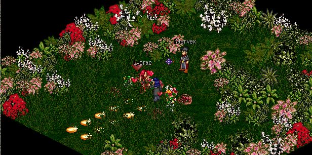

## Marriage


Ahhhh... Marriage... Defined in the dictionary of the male Aisling as 'a time of needless decoration and ceremony'. It's really not such a bad thing, but just be sure ye know what yer getting into. Marriage is a tight bond, one that will leave an everlasting scar if ye decide to break it.

### The Mileth Chapel

The Mileth Chapel is the only place in all of Temuair that can take two Aislings and make them husband and wife. It is located just south of the Mileth Inn, and is often decorated for an upcoming marriage. Naomhan, the Mundane priest, will assist an Aisling Priest that wishes to join a couple in marriage.

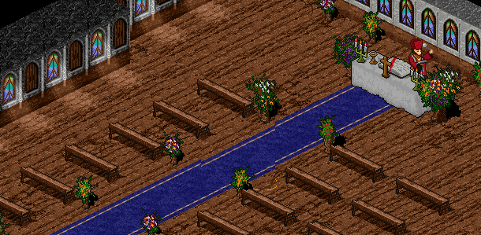

### Proper Wedding Clothing

Proper wedding attire can be purchased in the town of Piet. The wedding suits, the tux and the gown, are five hundred thousand gold pieces each! The bride can either add a headband or veil to her attire, but it is not required. Wedding clothing is not a requirement to be married, but it is a welcome addition to ceremonies.

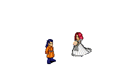

### Decorating the Church

This is pretty much the same as decorating the glade. Use coin and flowers mostly. A common method is laying down one coin on all the wood work, then placing two coin on the carpet area, as well as flowers at the end of isles and near the altar. It is also common practice to offer all the decorations to the guests after the ceremony.

### Guards

With all the fancy decorations, ye'll want a few guards to keep watch at the door. Offer guards a cash payment for their services, and most likely they will do their job as ye would want them to do it. Supply them with a guest list and instructions to keep all youngins out of the chapel. Guards can guard against theft of the decorations and disruptions of the ceremony, itself.

### Invitations

Be sure to send out a little invitation to all the people that ye want to attend the wedding. If ye are looking for a large-scale wedding, then post on the community boards of both Rucesion and Mileth. Yer invitation should include date of wedding, parties to be wed, and location of the wedding ceremonies.

### Ceremony Types

There are 3 basic types of Ceremonies, and all three are summarized here...

+ Quick and painless - The quick and painless ceremony involves none of the above, two couples just go into the church with a priest and do their thing. No planning, no outfits, no decorations.

+ Small scale - A few, very close friends are invited. The chapel is sparsely decorated, and bride and groom both have outfits. There is no exchange of words, the priest immediately starts the vows and then the wedding is over as soon as it started

+ Traditional (large scale) - The wedding is advertised on community boards, the chapel is decorated with expensive flowers, there are guards watching for thieves and hooligans. There is a long ceremony, with an exchange of words, a prayer for the couple lead by the priest, and the vows follow shortly after. (In the traditional wedding, the ceremony and exchange of words can be done in some place other than Mileth chapel, but the couple must return to the chapel for the vows.)


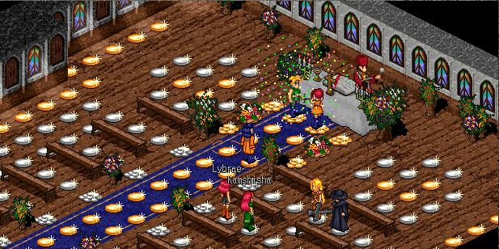

## Conclusion

Well, that's the guide. I hope that this has somehow given some Aisling the courage to go out and get a woman for himself and maybe someday I'll come across his wedding... who knows? It could happen! Good luck!

_Landon Lockheart, Deoch 22_  
_Revised, Deoch 27_

***

```
*Librarian Notes*

This entry has been edited to conform to Library formatting.
The original can be found at http://www.darkages.com/2002/community/lore/Landon_Relationships/index.html .
```
