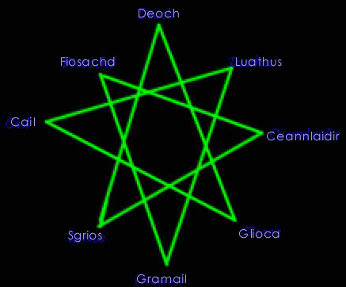

# Lioarlan de Ynsagh

_by Lethalia in_ ___Dark Ages___

_Welcome to me library of information on Temuair. Please choose from the scrolls below to learn of our land. Please be sure to return the scroll to it's place when ye have completed ye studies so others may learn as well. If ye wish to leave me any notes, ye can do so by scribing in the book next to the door._ 

_Thank ye and Deoch bless ye!_  
_Lethalia Horidre_  
_Priestess of Deoch_

## General Useful Knowledge

A collection of useful knowledge about Aisling Paths, Magic, Religion, and Theology

### Aisling Paths

>_Note from Lethalia, Priestess of Deoch_: 
>I would like to thank the following people, past and present, for their guidance and assistance in writing this scroll: 
>
>__Warriors__: Xeonis  
>__Rogues__: Dartanian, Paraiyan, and Loness  
>__Monks__: Mandril, Dresden, and Xandria  
>__Priests__: Elecktra, Angelic, and Sakura  
>__Wizards__: Xilan  
>
>I would also like to offer ye a chance to add ye comments or suggestions by scribing a note in the open book next to the scroll shelves.

There are 5 paths (really 6) that any Aisling can choose from: 

1. __Warrior__ - Warriors are the strong type that like the feel of straight combat. They rely upon their strength to keep them from harm. In addition to learning the basic assail skills of combat, they can also learn specialized fighting maneuvers known exclusively and passed down through the generations by great warriors. They can use (as far as I know so far) almost any weapon, armor, or item known to Aislings. (Excluding certain items that are specifically constructed for other paths.) After quite a bit of experience as a warrior, they can learn the skills of mending armor and weapons. They can also learn lore of armor and other items and tell ye information about them that ye may not be able to recognize on ye own. They also like to hunt in parties for company and also for the fact that they cannot heal themselves without the aid of scarce potions or use magic of any kind to improve their own performance. (Until they have gained enough skill and understanding.)

2. __Rogue__ - Rogues rely mainly on their wits. A rogue's life seems to be one, for the most part, of solitude. Because some people view them as thieves or other "unwanted" company, although this is not the case of most rogues, some people may tend to keep their distance. They also tend to like fighting on their own as it allows them to work better using their skills of setting traps. Rogues' weapons of choice are either fine knives or swift surigams (star shaped weapons that have very sharp edges). Rogues can wear armor, even full body armor if they choose to do so, but most prefer to wear only what is necessary, as it hinders their ability to set traps. They also have the ability to taunt a creature into following them to distract it from a wounded friend. Rogues can also prove to be quite helpful in certain situations, such as opening chests to find treasure when their pockets are empty. 

   They can also learn the skills of gem appraisal and polishing, which can also prove useful when selling gems. Early on, while some other paths may find it hard to fight alone, ye may find that rogues do well in combat alone by use of traps. At higher levels rogues can learn the skills of mending armor and weapons and also smithing weapons to make ye weapon better, a term that they refer to as "good" or even better. With the help of a skilled wizard to make something known as blue powders, rogues are able to make smokey spheres, a bomb type contraption that sells for quite a nice profit. (Be sure to share ye profits with the kind wizard that makes ye blue powders *smile*) 

   Rogues have been given a new skill to learn, hairstyling. It is very tiring for a rogue to do this, so if ye happen to ask one to do it for ye, please remember that they can only do so much so often. It also takes away from their ability to perform other tasks they may also need to perform, so remember to thank them generously. Rogues can also tailor clothing specific to different regions of Temuair with the help of a respected citizen. I think the variety is very nice. Rogues can find many useful items, including weapons, as well as a trainer in the village of Suomi. Other weapons can be found in the castle of Loures. They can also find trainers in Mileth and Rucesion.

3. __Monk__ - Monks are welcome to join groups of hunting parties, but they also travel alone well. While a monk relies upon strength as do warriors, their skills can, in some instances, make them even more powerful than warriors. They not only rely upon their physical strength, but also on their concentration, as they study martial arts. Monks have a strong knowledge of anatomy and is close to nature and hence have more vitality than most others do. An experienced monk can even purge themselves (and others?) of poison if the need arises. Monks can only use armor tailored specifically for them. Because of a great conflict between certain gods, they cannot use weapons or wear normal boots. This may be one reason they are able to be so skilled in martial arts. 

   Monks are able to learn to take on an animal form for extra protection and help in the hunt. There are four forms which ye can choose from. They are Draco, Kelberoth, White Bat and Scorpion. Ye can go about learning these forms in two ways. Ye can either have another monk skilled in the form to teach ye or ye can wait until ye are strong enough in all required aspects of life to learn on ye own. The founding town of monks is Undine and their deity is Cail. As Cail is the god of nature, monks can also learn at an early age the skill of herbal lore which can prove quite helpful in the survival of the hunt.

4. __Priest__ - A priest's role is primarily to heal and help others. If ye like to fight a lot on ye own, or are not the friendly type, I wouldn't suggest choosing this path. While priests do have the ability to fight, they are most useful by staying back and healing and helping others fight by magic shielding or other magical protection. A priest should choose a religion and a deity to follow. Ye should find an experienced priest of that religion to initiate ye into ye chosen religion. Priests worship their deity and try to teach and convert others to their religion. With regular prayer and faith, sometimes the god of the priest chooses to reward the priest with a miracle. (Some can even remove scars of Sgrios, but please don't just ask any priest ye see to do this for ye, it has been deemed against the law. This is a very personal and tiring feat for priests.) 

   Priests are driven, it might seem, by something inside, to sacrifice to the great Altar in Mileth. With persistance and faith in donating, sometimes a god will appear to the priests and grant them gifts. Sometimes an extra push toward a new insight, an item, or even just a ride back to the outside of Mileth. But beware, do not try to throw just anything in the altar to gain favor, the Gods do not wish their altar to be a dumping ground, ye must make sure ye donation is worth a god's acknowledgement. They seem to be very fond of wine. Priests can make potions with the help of the Fae that give life back to someone who is extremely injured. Priests can use many weapons and armor, although these things hinder their healing abilities. There are special staves that priests may use after they have reached the 19th insight. These staves help with spell casting abilities. 

   A priest should be kind and understanding and always ready to help others as they are the only ones that can heal. They are asked for help more often than one might imagine and they live a very busy life. On starting out as a priest, ye should not try to join parties that are too large as a lone healer, but try to ask other healers to join ye. It may seem to someone that ye let them fall into the clutches of Sgrios out of non-concern, when that is not the case at all. For the most part, as ye are starting out, ye ability to heal is far less than the amount of wounds given out by creatures, but as ye use ye abilities, ye will be able to do more. Ye should try to learn to manage ye spells in different ways, or ask ye party to allow ye time to rest to gather back ye will to perform healing. Most people are understanding and will gladly wait with ye, for if ye do not have the will to heal, ye group will be in much danger. Also, always remember to watch ye own health, if ye perish, ye party will have a very small chance of surviving the damages of the current fight. Priests also perform mass for their god. All who worship that god, or a god within that trinity, are welcome to attend the mass and gain insight and knowledge by doing so.

5. __Wizards__ - Wizards rely on their magical powers. They do not wear armor or use weapons as it hinders their performance. Wizards have four choices of magic to learn: Sal (Water), Creag (Earth), Athar (Wind), and Srad (Fire). Each choice has its own good and bad points. After some insight, wizards are able to do "research" on certain subjects. Some research produces items that are very helpful or valuable to all Aislings. They are able to make earrings, blue powders for rogues to make smoke bombs with, and even special scrolls called "songs". These songs can be sung by Aislings to go from one town to another, without walking, but through the rips in time. At higher insights, wizards can enchant items to hold magical properties which are useful in many different ways. 

   They can also find and make potions that will renew their will or mana depending on the element they study. Wizards can also learn a skill called magic lore which will tell ye of all the magical properties of items ye may find. Wizards can also wield staves at the 19th insight. The most common is the Magus Ares, which is just for looks I believe; the Magus Kronos, which shortens the time consumed in casting a spell called dachaidh, which sends ye home through the rips in time; and the most sought after is the Magus Zeus, which halves the time consumed in casting ye elemental spells, for example beag sal or sal.

6. __Peasants__ - Peasants are the normal folk of Temuair. We all start out as peasants before we choose our path in life. Too similar to a Mundane for my liking, but still, some choose to remain peasants. I don't believe this is something I would recommend.

### Magic

This scroll will help ye to understand a bit about the theory of Graymayre and the basic terms of the tuatha seen in magic and miracles in Temuair.

>I have written this scroll as exactly as was told to me by the dark wizard, Dar, in Mileth.  
>`This information is exactly stated as it appears in the game and property of Nexon`  
>
>_Lethalia Horidre_  
>_Priestess of Deoch_

#### Graymayre

These terms are meant for wizards and priests alike to learn of their magical abilities.

__History__  
The tuatha brought magic to the world. Their tongue lives on as the language of magic and miracles.

__Beag : Little__  
Most spells have a "beag" form, which is a lesser effect. The base spell or miracle has no prefix.
Example: beag srad

__Mor__  
Some spells have a "mor" form, which is a grater effect.  
Example: mor srad

__Ard : Great__  
A few spells and a few great wizards or priests learn an "ard" form which is astounding.  
Example: ard srad

__Fein : Self__  
The spell or miracle only affects yourself.  
Example: beag ioc fein

__Comlha : Companions__  
The spell or miracle only affects your group.  
Example: beag ioc comlha

__Lamh : Hand, touching__  
This applies to the range of the spell or miracle.  
Example: beag srad lamh

__Meall__  
The spell or miracle affects a cluster instead of one creature.  
Example: creag meall

__Gar : Near__  
A few rare spells affect those that are near you.  
Example: beag srad gar

__Deum or Deur : Liquid__  
Combined with a magical effect this is a potion.  
Example: beothaic deum 

#### Elemental Graymayre

Elemental Graymayre is a secret that wizards alone can understand, but I have scribed this scroll as instructed by Xilan, exactly as it was taught him by Dar, the dark wizard of Mileth.

__Introduction__  
The elements compose everything. Everything has combinations of the elements. A wizard wields them in their purer forms. An element is not only a physical manifestation. It is spiritual and emotional. Srad feels exciting. Athar feels analytical. Creag feels stable. Sal feels empathic and engrossing.

__History__
In the olden days of Hybrasyl, the tuatha de danaan, "Children of Goddess of Light", danced with the elements. The elements enveloped mortals and existed in harmony. The tuatha learned to harness the elements. From this, the magic we know and wield sprang.

__Srad__  
Arcane fire  
Srad is hot, quick and dry. It begins things. It has no staying power.  
Srad dominates athar.

__Athar__  
Arcane air  
Athar is fast and nimble. It is often cruel, while eating away.  
Athar dominates creag.

__Creag__  
Arcane earth  
Creag is stable. It is slow to move. It is, therefore, confident and traditional.  
Creag dominates sal.

__Sal__  
Arcane water  
Sal is fluid, accepting. It is enduring and immortal. When opposed it gives way and envelopes. It smothers and drowns, sometimes with kindness, sometimes with cruelty. Sal reflects whatever looks into it.  
Sal dominates srad.

__Relationships__
Every element is weak against itself. This is the cycle of elements:  
srad fas athar  
athar fas creag  
creag fas sal  
sal fas srad  

Here is the cycle of elements shown in their ancient positioning. The arrows show the directions of dominance. Each element is weak against itself.


Here is the table of elements showing the useful attacks and defense. "Fas" is the tuatha's word for "increase".


__Creatures__
Elements are the fabric of nature. Creatures are affected by different elements. There are several creatures which have been touched, or can touch the pure elements. This makes them very dangerous. You may find yourself assaulted by a wolf who summons a shock of athar upon you. However, knowing which element the creatures is kin to is your advantage.

Kinship is not always formed by species. Two members of a species may have different elements. Observe the creature. A rogue is keener than our lot. The rogue can directly sense which element a creature belongs to.

__Artifacts__
Necklaces, embued with an element, generally change the assault element of the wearer. Belts, embued with an element, generally change the defense element of the wearer.

### Religion in Theory and Practice

This scroll will help you to understand a bit about the religions of Temuair

>I have written this scroll exactly as was told to me by the Fae priestess, Bertil, in Suomi.  
>`This information is exactly stated as it appears in the game and property of Nexon`  
>  
>_Lethalia Horidre_  
>Priestess of Deoch 

#### Worshipping a God 

To worship a god you should find a priest of the god to initiate you. When worshipping a god, you may pray to that god. The first time you give thanks to the god in seven Temuairan days you increase your faith in the god. If you faith is great enough, the god may respond directly to your prayer. Priests must have faith in their god in order to accept new worshippers. With the spread of faith, each priest's powers grows. 

#### Gods of Temuair 

__Cail__

Cail is the god of Nature. He is a fortuitous god. He watches over nature, and, himself is in many ways like a piece of nature. He is peaceful, yet strong, like a mountain. Cail was born in the mountains from the union of Ceanlaidir and Glioca. At one time the moon passed too closely to the mountains. Glioca was seduced by Ceannlaidir to approach closer. Cail was denied the art of arms by Ceannlaidir who recognized he would overcome Ceannlaidir if he were armed. Cail's allies are Glioca and Luathas. Cail's enemies are Fiosachd and Sgrios. Cail's shrine lies peacefully nestled between sea and lake at Undine. 

__Ceannlaidir__

Ceannlaidir is the god of war. He lives by glory. In the heat of a large battle, his presence is never too far. Ceannlaidir leapt out of a primordial fire. His presence has hung over every major battle. Ceannlaidir's allies are Fiosachd and Sgrios. Ceannlaidir's enemies are Glioca and Luathas. Ceannlaidir's shrine is found at Piet. 

__Deoch__

Deoch was originally the god of debauchery. He was a dubhaim god, born from the Great War between Danaan and Chadul. It was after the Shadows War that something miraculous occurred. Deoch fell in love with Danaan. Some believe that Deoch gave the element of Light to humanity. It is certain that the first Spring after the sacrifice of Danaan, Deoch carried on Her work. Deoch created the first Aisling in the Fall of the same year. In honor of Him, we date our calendar. Deoch's allies are Sgrios and Glioca. Deoch's enemies are Luathas and Fiosachd. Deoch's shrine lies outside the vineyards of Suomi. 

__Fiosachd__

Fiosachd is the god of swiftness and wealth. He is sometimes deceptive and silent. He cultivates treasure. He is prayed to for luck. Fiosachd was cast out of Aosda. He wandered, surviving the transformations of the aeons. Fiosachd's allies are Gramail and Ceannlaidir. Fiosachd's enemies are Cail and Deoch. Fiosachd's shrine lies outside the port of Abel. 

__Glioca__

Glioca is the goddess of compassion. She loves all that is. Glioca is the daughter of Danaan. She sprang from Danaan. As Danaan is the sun, Glioca is the moon. She is gentle, like a swan gliding upon water. She sees the reflection of all of the tuatha in everything. Her love is complete and eternal. She does not know hate. Glioca's allies are Deoch and Cail. Glioca's enemies are Ceannlaidir and Gramail. Glioca's shrine lies outside of Mileth. 

__Gramail__

Gramail is the god of laws, natural and artificial. He is worshipped in times when judgments must be passed. Gramail was an old Aosda that studied much yet never acted. During the drowning of hy-brasyl he saw what was happening to the tuatha and made himself known. He is the weakest and least known of the gods. Gramail's allies are Luathas and Fiosachd. Gramail's enemies are Glioca and Sgrios. Gramail's shrine lies outside of Loures, capitol of Loures. 

__Luathas__

Luathas is the god of gnosis: divine knowledge. Luathas is worshipped by seekers of lore and arcane knowledge, as well as those trying to make their way, whether lost in the woods, or lost in the hustle of a city's chaos, or lost without a purpose in their life. Luathas was an Aosda that studied intensely and was touched by Danaan to study even more. Luathas' allies are Cail and Gramail. Luathas' enemies are Deoch and Ceannlaidir. Luathas' shrine lies near the magical town of Rucesion. 

__Sgrios__

Sgrios. Never mention that name! Sgrios is an abomination, and kin of the dubhaimid and Other Gods. Sgrios is the god of destruction and decay. It is Sgrios that scars your soul and body each time you perish. Sgrios feeds on you when you die. He is a plague to all that is holy, and the god of all plagues. Sgrios' allies are Ceannlaidir and Deoch. Sgrios' enemies are Gramail and Cail. Sgrios' shrine is rumored to lie buried in the cracks within the casgle of the dubhaimid. Do not go to the abominable place. 

#### Other gods

___Chadul___

Chadul is an abomination. Do not mention that name! Chadul is a slumbering being which must never be disturbed. It has struck Temuair and torn it asunder. It is a vile, writhing chaos of ultimate darkness. The dubhaim are mere fragments of Chadul. When the element of Darkness was discovered, the key to reaching Chadul was made. It was the gravest mistake ever made. 

___Danaan___

Danaan is our race's samesake. For on Temuair, we are the "tuatha de danaan". That is "the Children of Danaan". Danaan is the goddess of all that is under the Sun. She is loving and giving, as the Sun. She is the giver of Light. Some believe that she aided us to discover the element of Light. She certainly sacrificed herself for the creation of the Aisling. 

#### Theology

This scroll will help you to understand a bit about the religions of Temuair

>I have written this scroll exactly as was told to me by the Fae priestess, Bertil, in Suomi.  
>`This information is exactly stated as it appears in the game and property of Nexon`  
>  
>_Lethalia Horidre_  
>Priestess of Deoch 

Allow me to arrange some pebbles into an octagram and then correspond the deities to one point of the octagram. (This is what she said to me, I will use my sketch.) If you were to trace lines from each point, you would find the two allies. If you were to look at the neighbors of the octagrams, you will find the enemeies of that diety. Examine the allies and enemies of the gods and then consult the octragram. 



Each god is the head of a particular trinity. Their allies are the lesser members of the trinity. As the faith in the god, its allies grows, the strength of the god's influence grows. As the faith of the god's enemies grows, the god's inluence wanes. The power of a priest is dependent on the god's influence. Faith grows with the initiate worshippers. 

## Weapons and Armor

A collection of useful knowledge about Aisling Paths, Magic, Religion, and Theology

### Armor

This scroll will help ye to understand a bit about the armor available in Temuair

Please know that this list is not complete and it seems as if it will take quite some time for me to investigate all armor that is known to exist and the requirements for usage. There are also variations of the armor that is listed below. Most armor has the properties that allow for tailoring, which will make the protection better. There is also other armor that cannot be bought, but must be found. This list contains only amor which can be bought from the Mundanes in Temuair, unless otherwise stated.

For the time being, I hope what I have had the chance to research will be of some use to ye. If ye wish to leave me any notes or information, ye may do so by scribing in the open book next to the entrance of the library.

I have also listed which insight ye must be in order to wear them, how much they will cost ye, and also their weights in cases where that information is available to me. As I am not sure as to exactly how to state weights, I will express them in the weight measure of "stones". There may be more class specific special armor that I have not listed here, but that should be a personal journey for ye. Also know that the information I have been given on 41st insight armor may not be exact, that is something ye will have to experiment with when it is time for ye to do so. Good luck and may the gods of Temuair bless ye.

#### Female Armor

|Monk|Armor|Insight|Cost/Help|Protection|Weight|Purchase Location|
|-|-|-|-|-|-|-|
||Earth Bodice|1st insight|850 coins|-7|4 stones|Hali's Goods - Undine|
||Lotus Bodice|11th insight|8,850 coins|-14|4 stones|Hali's Goods - Undine|
||Moon Bodice|41st insight|Respected Citizen|N/A|N/A|Undine - Cail's Temple|
||Lignting Garb|71st insight|Blessed Mithril Bracer|N/A|N/A|Sylvan in Woods|

|Priest|Armor|Insight|Cost/Help|Protection|Weight|Purchase Location|
|-|-|-|-|-|-|-|
||Gorget Gown|1st insight|800 coins|-8|4 stones|Brody's Goods - Mileth|
||Mystic Gown|11th insight|8,300 coins|-17|5 stones|Jean's Magic - Loures|
||Elle|41st insight|Respected Citizen|N/A|N/A|Any Temple|
||Dolman|71st insight|Holy Kronos|N/A|N/A|Sylvan in Woods|

|Rogue|Armor|Insight|Cost/Help|Protection|Weight|Purchase Location|
|-|-|-|-|-|-|-|
||Cotte|1st insight|800 coins|-8|4 stones|Brody's Goods - Mileth|
||Brigandine|11th insight|8,300 coins|-17|5 stones|Jean's Magic - Loures|
||Corsette|41st insight|Respected Citizen|N/A|N/A|Lamont's Storage - Abel|
||Pebble Rose|71st insight|Blessed Mithril Bracer|N/A|N/A|Sylvan in Woods|

|Warrior|Armor|Insight|Cost/Help|Protection|Weight|Purchase Location|
|-|-|-|-|-|-|-|
||Leather Bliaut|1st insight|950 coins|-11|4 stones|Brody's Goods - Mileth|
||Cuirass|11th insight|9,450 coins|-17|9 stones|Leo's Armor - Piet|
||Cotehardie|26th insight|3rd Skill Tailor|N/A|N/A|Alexios's Armor - Undine|
||Kasmanium Hauberk|41st Insight|3rd Skill Tailor|N/A|N/A|Leo's Armor - Piet|
||Surplice Bodice|56th insight|6 Finished Rubies|N/A|N/A|Dwarf - Abel Crypt|
||Labyrinth Mail|71st insight|22 Jade Rings|N/A|N/A|Dwarf - Abel Crypt|

|Wizard|Armor|Insight|Cost/Help|Protection|Weight|Purchase Location|
|-|-|-|-|-|-|-|
||Magi Skirt|1st insight|750 coins|-5|4 stones|Arnljot's Goods - Mileth|
||Benusta|11th insight|7,750 coins|-9|5 stones|Huberto's Goods - Loures|
||Stoller|41st insight|Respected Citizen|N/A|N/A|Jean's Magic - Abel|
||Clymouth|71st insight|6 Finished Talos|N/A|N/A|Sylvan in Woods|

#### Male Armor

|Monk|Armor|Insight|Cost/Help|Protection|Weight|Purchase Location|
|-|-|-|-|-|-|-|
||Dobok|1st insight|850 coins|-7|4 stones|Hali's Goods - Undine|
||Culotte|11th insight|8,850 coins|-14|4 stones|Hali's Goods - Undine|
||Earth Garb|41st insight|Respected Citizen|N/A|N/A|Undine - Cail's Temple|
||Wind Garb|71st insight|Blessed Mithril Bracer|N/A|N/A|Sylvan in Woods|

|Priest|Armor|Insight|Cost/Help|Protection|Weight|Purchase Location|
|-|-|-|-|-|-|-|
||Cowl|1st insight|800 coins|-8|4 stones|Brody's Goods - Mileth|
||Galuchat Coat|11th insight|8,300 coins|-17|5 stones|Huberto's Goods - Rucesion|
||Mantle|41st insight|Respected Citizen|N/A|N/A|Any Temple|
||Hierophant|71st insight|Holy Kronos|N/A|N/A|Sylvan in Woods|

|Rogue|Armor|Insight|Cost/Help|Protection|Weight|Purchase Location|
|-|-|-|-|-|-|-|
||Scout Leather|1st insight|900 coins|10|4 stones|Huberto's Goods - Rucesion|
||Dwarvish Leather|11th insight|9400 coins|-20|5 stones|Jilt's Storage - Piet|
||Paluten|41st insight|Respected Citizen|N/A|N/A|Lamont's Storage - Abel|
||Keaton|71st insight|12 Finished Rubies|N/A|N/A|Sylvan in Woods|

|Warrior|Armor|Insight|Cost/Help|Protection|Weight|Purchase Location|
|-|-|-|-|-|-|-|
||Leather Tunic|1st insight|950 coins|-8|4 stones|Brody's Goods - Mileth|
||Jupe|11th insight|9,450 coins|-17|9 stones|Lowell's Weapons - Loures|
||Lorica|26th insight|3rd Skill Tailor|N/A|N/A|Alexios's Armor - Undine|
||Chain Mail|41st Insight|3rd Skill Tailor|N/A|N/A|Leo's Armor - Piet|
||Iplet Mail|56th insight|6 Finished Rubies|N/A|N/A|Dwarf - Abel Crypt|
||Platemail|71st insight|12 Jade Rings|N/A|N/A|Dwarf - Abel Crypt|

|Wizard|Armor|Insight|Cost/Help|Protection|Weight|Purchase Location|
|-|-|-|-|-|-|-|
||Magi Skirt|1st insight|750 coins|-5|4 stones|Huberto's Goods - Loures|
||Benusta|11th insight|7,750 coins|-9|6 stones|Huberto's Goods - Loures|
||Stoller|41st insight|Respected Citizen|N/A|N/A|Jean's Magic - Abel|
||Clymouth|71st insight|12 Magic Cordovan Boots|N/A|N/A|Sylvan in Woods|

### Miscellaneous Armor

This scroll will help ye to understand a bit about the miscellaneous armor found in Temuair

|Belt|Name|Insight|Cost|Weight|Purchase Location|
|-|-|-|-|-|-|
||Dark Belt|12th insight|Found|1 stone|Found|
||Earth Belt| 4th insight|10,000 coins|1 stone|Leo's Armor - Piet|
||Fire Belt|4th insight|10,000 coins|1 stone|Valdemar's Armor - Suomi|
||Hy-brasyl Belt|12th insight|Found|1 stone|Found|
||Leather Belt|12th insight|Found|1 stone|Found|
||Mythril Belt|12th insight|Found|1 stone|Found|
||Sea Belt|4th insight|10,000 coins|1 stone|Alexios's Armor - Undine|
||Wind Belt|4th insight|10,000 coins|1 stone|Carlos's Armor - Rucesion|

|Belt|Name|Insight|Cost|Magic|Weight|Purchase Location|
|-|-|-|-|-|-|-|
||Boots|1st insight|1,000 coins|N/A|2 Stones|Torrance's Armor - Mileth|
||Grey Boots|11th insight|10,000 coins|N/A|2 Stones|Torrance's Armor - Mileth|
||Cured Boots|24th insight|5,000 coins|+1 Dexterity|2 Stones|Torrance's Armor - Mileth|
||Shagreen Boots|24th insight|10,000 coins|+2 Dexterity|2 Stones|Torrance's Armor - Mileth|
||Cordovan Boots|50th insight|Found|+3 Dexterity|2 Stones|Found|
||Lapis Boots|56th insight|5,000 coins|N/A|2 stone|Jilt's Storage - Piet|
||Saffian Boots|66th insight|Found|+4 Dexterity|2 stone|Found|
||Magma Boots|82nd insight|found|+5 Dexterity|2 stone|Found|

|Bracers|Name|Insight|Cost|Protection|Weight|Purchase Location|
|-|-|-|-|-|-|-|
||Leather Bracers|9th insight|Found|-1|2 stone|Found|
||Iron Bracers|33rd insight|15,000 coins|-2|3 stones|Alexios's Armor - Undine|
||Mythril Bracers|63rd insight|Found|-3|4 stones|Found|

|Gauntlets|Name|Insight|Cost|Protection|Weight|Purchase Location|
|-|-|-|-|-|-|-|
||Leather Gauntlet|9th insight|2,000 coins|-1|2 stone|Torrance's Armor - Mileth|
||Iron Gauntlet|33rd insight|8,850 coins|-2|3 stones|Found|
||Mythril Gauntlet|63rd insight|Found|-3|4 stones|Found|

|Greaves|Name|Insight|Cost|Protection|Weight|Purchase Location|
|-|-|-|-|-|-|-|
||Leather Greaves|9th insight|Found|-1|2 stone|Found|
||Iron Greaves|33rd insight|15,050 coins|-2|3 stones|Alexios's Armor - Undine|
||Mythril Greaves|63rd insight|Found|-3|4 stones|Found|

|Helmets|Name|Insight|Cost|Weight|Special|Purchase Location|
|-|-|-|-|-|-|-|
||Holy Cap|11th insight|10,000 coins|1 stone|Male Priest|Jean's Magic - Loures|
||Holy Chief|11th insight|10,000 coins|1 stone|Male Priest|Huberto's Goods - Rucesion|
||Holy Conical|11th insight|10,000 coins|1 stone|All Priests|Underground Jail - Loures|
||Holy Toque|11th insight|10,000 coins|1 stone|Female Priest|Lamont's Storage - Abel|
||Holy Vermillion|11th insight|10,000 coins|1 stone|Female Priest|Jean's Magic - Loures|
||Holy Wimple|11th insight|10,000 coins|1 stone|Male Priest|Lamont's Storage - Abel|
||Magus Cap|11th insight|10,000 coins|1 stone|Male Wizard|Huberto's Goods - Rucesion|
||Magus Chief|11th insight|10,000 coins|1 stone|Male Wizard|Huberto's Goods - Rucesion|
||Magus Conical|11th insight|10,000 coins|1 stone|All Wizards|Jean's Magic - Loures|
||Magus Toque|11th insight|10,000 coins|1 stone|Female Wizard|Leo's Armor - Piet|
||Magus Wimple|11th insight|10,000 coins|1 stone|Female Wizard|Huberto's Armor - Rucesion|
||Labyrinth Helmet|71st insight|N/A|N/A|Female Warrior|Made With Armor|
||Iplet Helmet|71st insight|N/A|N/A|Male Warrior|Made With Armor|
||Iplet Helmet|86th insight|N/A|N/A|Male Warrior|Made With Armor|

|Shield|Name|Insight|Cost|Purchase Location|
|-|-|-|-|-|
||Wooden Shield|1st insight|100 coins|Torrance's Armor - Mileth|
||Leather Shield|15th insight|750 coins|Leo's Armor - Piet|
||Bronze Shield|31st insight|3,750 coins|Valdemar's Armor - Suomi|
||Iron Shield|45th insight|Found|Found|
||Mythril Shield|61st insight|Found|Found|
||Hy-Brasyl Shield|77th insight|Found|Found|
||Talos Shield|90th insight|Found|Found|

### Weapons

This scroll will help ye to understand a bit about the weapons available in Temuair

I have arranged the lists on this scroll to reflect what weapons can be bought in each town of Temuair. Please understand that some weapons can be purchased in more than one location so they will be listed more than once. I have also listed which insight ye must be in order to wield them, how much they will cost ye, and also their weights. As I am not sure as to exactly how to state weights, I will express them in the weight measure of "stones". There may be more class specific special weapons that I have not listed here other than the weapons for rogues, but that should be a personal journey for ye. Good luck and may the gods of Temuair bless ye.

#### Weapons

__Mileth__ - Callough's Weapon Shop - Honest man's weapons big and small

|Weapon|Name|Insight|Cost|Weight|
|-|-|-|-|-|
||Stick|1st insight|100 coins|3 stone|
||Dirk|2nd insight|600 coins|4 stone|
||Claidheamh|14th insight|1,300 coins|8 stone|

__Abel__ - Vidar's Weapon Shop

|Weapon|Name|Insight|Cost|Weight|
|-|-|-|-|-|
||Dirk|2nd insight|500 coins|4 stone|
||Loures Saber|14th insight|1,500 coins|7 stone|
||Claidheamh|14th insight|1,300 coins|8 stone|

__Rucesion__ - Marcelo's Weapon Shop

|Weapon|Name|Insight|Cost|Weight|
|-|-|-|-|-|
||Dirk|2nd insight|500 coins|4 stone|
||Eppe|2nd insight|500 coins|5 stone|
||Claidheamh|14th insight|1,300 coins|8 stone|
||Broad Sword|17th insight|1,700 coins|9 stone|
||Long Sword|56th insight|12,200 coins|18 stone|

__Loures__ - Marlon's Weapon Shop

Normal Weapons

|Weapon|Name|Insight|Cost|Weight|
|-|-|-|-|-|
||Eppe|2nd insight|500 coins|5 stone|
||Loures Saber|14th insight|1,500 coins|7 stone|
||Templar|29th insight|4,500 coins|12 stone|
||Masquerade|31st insight|5,500 coins|15 stone|
||Bramble|41st insight|9,200 coins|12 stone|
||Black Death|45th insight|8,800 coins|18 stone|
||Long Sword|56th insight|12,200 coins|18 stone|
||Stilla|61st insight|11,800 coins|25 stone|

Soori (Rogue Only)

|Weapon|Name|Insight|Cost|Weight|
|-|-|-|-|-|
||Snow Dagger|1st insight|1,000 coins|3 stone|
||Center Dagger|4th insight|3,000 coins|5 stone|
||Blossom Dagger|14th insight|7,000 coins|7 stone|
||Moon Dagger|30th insight|12,000 coins|9 stone|

__Piet__ - Gunnar's Weapon Shop - Fine Northern Ardmagh Blades

Normal Weapons

|Weapon|Name|Insight|Cost|Weight|
|-|-|-|-|-|
||Loures Saber|14th insight|1,500 coins|7 stone|
||Broad Sword|17th insight|1,700 coins|9 stone|
||Battle Sword|26th insight|5,000 coins|10 stone|
||Templar|29th insight|4,500 coins|12 stone|
||Bramble|41st insight|9,200 coins|12 stone|
||Black Death|45th insight|8,800 coins|18 stone|
||Long Sword|56th insight|12,200 coins|18 stone|

__Suomi__ - Gunnar's Weapon Shop - Fine Northern Ardmagh Blades

Normal Weapons

|Weapon|Name|Insight|Cost|Weight|
|-|-|-|-|-|
||Dirk|2nd insight|500 coins|4 stone|
||Eppe|2nd insight|500 coins|5 stone|
||Claidheamh|14th insight|1,300 coins|8 stone|

Secrets (Rogue Only)

|Weapon|Name|Insight|Cost|Weight|
|-|-|-|-|-|
||Snow Secret|1st insight|1,500 coins|3 stone|
||Center Secret|7th insight|4,000 coins|5 stone|
||Blossom Secret|21st insight|10,000 coins|7 stone|
||Moon Secret|39th insight|15,000 coins|9 stone|
||Light Secret|52th insight|23,000 coins|11 stone|

__Suomi__ - Gunnar's Weapon Shop - Fine Northern Ardmagh Blades

Argus: Higgler of Undine and Livestock Devices  
and  
Hali - Humble Higgler of Undine

|Weapon|Name|Insight|Cost|Weight|
|-|-|-|-|-|
||Whip|26th insight ROGUE Only|20,000 coins|10 stone|

## Jewelry

A collection of useful knowledge about Earrings, Necklaces, and Rings

### Earrings

This scroll will help ye to understand a bit about the magical earrings of Temuair


|Earrings|Name|Insight|Cost|Magic|Purchase Location|
|-|-|-|-|-|-|
||Beryl Earrings|8th insight|3,000 coins|+1 Intelligence|Torrance's Armor Shop - Mileth <br> Jilt's Storage - Piet|
||Coral Earrings|8th insight|8,000 coins|+2 Intelligence|Torrance's Armor Shop - Mileth <br> Cian's Magic Shop - Piet|
||Silver Earrings|8th insight|3,000 coins|+1 Strength|Leo's Armor Shop - Piet <br> Valdemar's Armor Shop - Suomi|
||Gold Earrings|8th insight|10,000 coins|+2 Strength|Leo's Armor Shop - Piet|
||Ruby Earrings|8th insight|10,000 coins|+1 Intelligence <br> +1 Strength|Valdemar's Armor Shop - Suomi|
||Pearl Earrings|14th insight|Found|+200 Mana|Found|

### Necklaces

This scroll will help ye to understand a bit about the magical necklaces of Temuair

|Necklace|Name|Insight|Cost|Magic|Purchase Location|
|-|-|-|-|-|-|
||Fire Necklace|8th insight|10,000 coins|Srad Offense|Carlos's Armor Shop - Rucesion|
||Wind Necklace|8th insight|10,000 coins|Athar Offense|Carlos's Armor Shop - Rucesion|
||Earth Necklace|8th insight|10,000 coins|Earth Offense|Carlos's Armor Shop - Rucesion|
||Sea Necklace|8th insight|10,000 coins|Sal Offense|Carlos's Armor Shop - Rucesion|
||Pearl Necklace|9th insight|800 coins|+5 Hit|Valdemar's Armor Shop - Suomi|
||Gold Jade Necklace|10th insight|800 coins|+1 Hit|Leo's Armor Shop - Piet|
||Jade Necklace|13th insight|1,600 coins|+10 Hit|Valdemar's Armor Shop - Suomi|
||Amber Necklace|14th insight|1,600|+1 Damage|Torrance's Armor Shop - Mileth|
||Bone Necklace|15th insight|1,500|+5 Hit|Torrance's Armor Shop - Mileth|
||Prayer Necklace|1st insight|Join a Temple||Any Temple|
||Nadurra Necklace|11th insight|5,000 coins||Kiril's Magic Shop - Undine|

### Rings

This scroll will help ye to understand a bit about the magical rings of Temuair

|Ring|Name|Insight|Cost|Magic|Purchase Location|
|-|-|-|-|-|-|
||Small Spinel Ring|1st insight|Found|+300 Health <br> +2 Damage |Raghnall the Wizard - Tutorial|
||Small Emerald Ring| insight|Found|+300 Health <br> +2 Hit |Raghnall the Wizard - Tutorial|
||Talos Ring|4th insight|3,000 coins|+100 Health|Leo's Armor Shop - Piet|
||Beryl Ring|5th insight|3,000 coins|+50 Mana|Alexios's Armor Shop - Undine|
||Ruby Ring|6th insight|20,000 coins|+200 Health|Torreance's Armor Shop - Mileth|
||Coral Ring|7th insight|20,000 coins|+100 Mana|Steiner's Armor Shop - Abel <br> Alexios's Armor Shop - Undine|
||Lapis Ring|8th insight|50,000 coins|+300 Health <br> +2 Damage|Alexios's Armor Shop - Undine|
||Red Jade Ring|10th insight|5,000 coins|+200 Health <br> +100 Mana|Leo's Armor Shop - Piet|
||Spinel Ring|11th insight|5,000 coins|+500 Health <br> +2 Hit|Leo's Armor Shop - Piet|
||Amethyst Ring|12th insight|50,000 coins|+200 Health <br> +100 Mana|Torreance's Armor Shop - Mileth|
||Emerald Ring|12th insight|6,000 coins|+500 Health <br> +2 Damage|Valdemar's Armor Shop - Suomi <br> Black Market <br> Mentor|
||Jade Ring|16th insight|100,000 coins|+300 Health <br> +150 Mana|Valdemar's Armor Shop - Suomi <br> Black Market|
||Grave Ring|9th insight|Found|+150 Mana|Found|

## Curiosities, Gifts and Gems

A collection of useful knowledge about Curios, Food, Gems, Gifts, Spoils and Weddings

### Curios

This scroll has useful information on some items that did not quite fit into other categories in the library. However, they are important parts of our everyday lives in Temuair. 

#### Scrolls

Parchment Scrolls - These scrolls are used by wizards to scribe songs of different towns in Temuair. They can be bought from Dar's magic shop in Mileth for 500 coins.

Songs - Songs are magical tunes about specific towns scribed by wizards onto Parchment Scrolls. They can also be made through prayer to a god of Temuair. These scrolls are called songs because when you sing the words that are scribed onto them, you will be magically transported through time to the town that the song was written about.


#### Tools

Cloth Gloves - Cloth gloves must be worn in order for herbalists to gather necessary ingredients to produce potions. They can be bought from Bertil, the Fae priestess, in Suomi for 250 coins.

Lockpicks - Lockpicks are very handy tools designed specifically for rogues. They are used in connection with the unlock skill to open chests ye will find in the crypts. Ye must be of the 3rd insight to use them and they can be purchased from the rogue trainer in Mileth, Rucesion, or Suomi. They cost 5,000 coins and weigh 1 stone.

Blue Powders - These powders are used by rogues to construct a blinding bomb called a smokey sphere. These powders can only be made by wizards. Components needed to make them are eyes, wolf teeth or skulls.

Smokey Spheres - These spheres are actually more of a bomb than a plain ol' sphere. When thrown by a rogue they will blind all Aislings or creatures within a specified area. They can be constructed by rogues or bought from either Huberto's goods shop in Rucesion or Hali's goods shop in Undine for 5,000 coins.

### Food and Drink

There are many good things in Temuair to eat. Take someone out on a dinner date, have a party. Be social! The best thing about Temuair is the people who live there. No better way to meet people than with some good food and drink. 

#### Drinks

Brandy - This is a great drink for a romantic dinner by candlelight or serve it at a party. You can buy Brandy from Cassidy's storage shop in Mileth, Aingeal's tavern in Mileth, Frida's tavern in Abel, or Bella's tavern in Piet for 200 coins.

Rum - This hearty drink is a welcome refreshment for a warrior coming back from the battle. Ye can buy rum from Aingeal's tavern in Mileth, Frida's tavern in Abel, or Viveka's tavern in Suomi for 100 coins.

Wine - The drink of the gods is what I say. So much can be done with wine. Ye can sacrifice it to the gods in the Mileth Altar, give it to friends, or give it to herbalists to make potions with. An all round good drink. It's a little more expensive than the other beverages of Temuair though, and most of the time scarce due to the massive use in making potions. Ye can buy wine from Frida's tavern in Abel, Bella's tavern in Piet, Chloe's tavern in Undine, or Viveka's tavern in Suomi for 500 coins.


#### Foods

Apples - A great hearty snack. Try Keegan's apples, he grows the biggest, juiciest apples anywhere in Temuair. If ye have trouble finding Keegan awake, ye can also buy them from Oona's restaraunt in Mileth, or Aud's restaurant in Abel for a mere 5 coins.

Baguette - A nice filling home baked roll and a nice change from sliced bread. Ye can buy baguettes from Oona's restaurant in Mileth or Alleen's restaurant in Piet for 10 coins.

Beef - Hearty for a meal indeed, but when ye walk by those poor friendly cows next to Cian's magic shop in Mileth, it just makes ye want to stick to eatin' ye veggies. If ye must know, ye can buy beef from Oona's restaurant in Mileth, Alleen's restaurant in Piet, or Gudny's restaurant in Suomi for 35 coins.

Bread Slice - A must have for any meal. Ye can buy sliced bread from Aud's restaurant in Abel, Damara's restaurant in Undine, or Gudny's restaurant in Suomi for a mere 5 coins.

Cherry - A great fruit, not only good for you but useful as well. A bit expensive if ye ask me, but I'd say they're worth it. Cherries are one of the key ingredients used by priests in making the life giving potion called Beothaich deums, or as they are affectionately called, "Reds". Ye can buy cherries from the farmer Goran in Suomi. Ye can either buy them for 50 coins each, or ye can harvest 3 dozen of them ye'self for 1000 coins. Ye can also buy cherries from Alleen's restaurant in Piet, Damara's restaurant in Undine, or Gudny's restaurant in Suomi for 50 coins.

Chicken - Another great part of a hearty meal, although I do wonder where they keep or find these chickens since I've never seen any before. Ye can buy chicken from Oona's restaurant in Mileth, Aud's restaurant in Abel, Alleen's restaurant in Piet, Damara's restaurant in Undine, or Gudny's restaurant in Suomi for 20 coins.

Grapes - Another delicious fruit that's quite useful and greatly needed as well. Grapes are the second ingredient needed in creating the life giving potions, Beothaich deums, or as they are affectionately called, "Reds". Grapes can be bought from Alvar, the farmer in Suomi for 10 coins a bunch, or ye can harvest 18 bunches ye'self for 100 coins. Ye can also buy grapes from Alleen's restaurant in Piet for 10 coins a bunch.

Vegetables - A vital part of all meals. Vegetables will help with vitality and help keep ye strong in battle. Ye can buy vegetables from Oona's restaurant in Mileth or Aud's restaurant in Abel for a mere 5 coins.

### Gems

This scroll will give ye a little information on gems found about Temuair.

Gems are most commonly found in a raw state. They can, however, be polished to beautiful and valuable stones by rogues. In order to find out what ye gem is worth, ye can have a rogue appraise it for ye. Ye can also have a priest properly identify it so ye know what state the gem is in. Be aware though, whatever a gem is worth, ye will only get half that amount from the Mundanes when selling it. Most mundanes will offer a price before buying it from ye. 

Beryl - This gem can be sold for a profit or used by rogues to craft Beryl and Emerald Rings. It is also needed to learn specific spells or skills.

Coral - This gem can be sold for a profit higher than beryl. It can also be used by rogues to craft Coral and Lapis rings.

Ruby - This gem can be sold for a profit higher than coral. Rubies are needed to learn specific higher insight spells as well. They can also be used by rogues to craft Amethyst, Red Jade, Ruby, and Spinel rings.

Talos - This can be sold for a profit. If not a good one from the Mundanes, ye can get quite a bit from eager Aislings as this gem is so rare. It is needed to craft certain armors and can also be used by rogues to craft Talos Rings.

Hybrasyl - This gem is very rare and sought after. I'm not certain if there are any Mundanes who will buy it, but I do know ye can make a great profit by selling it to another Aisling. I belive these gems are also needed to craft a specific armor.

### Gifts

Welcome to me gift list. These gifts are extravagant so if ye cannot afford them, wine is always nice *smiles*. And don't forget there are other appropriate gifts for different situations, use ye imagination.

Rose Bouquet - These beautiful rose bouquets are the perfect gift for an engagement. They also look nice at weddings. *winks* They can be bought from Viveka's tavern in Suomi for 50,000 coins.

Spring Bouquet - These beautiful spring bouquets are perfect to give someone ye love in honor of the changing of the seasons and the ever blooming of relationships. As rose bouquets, they also look nice at weddings. *winks* They can be bought from Saskia's inn in Piet for 100,000 coins.

Hair Band - These hair bands are very extravagant and are a nice accessory to wear to social gatherings. They also look very nice on a bride in place of the veil at weddings. They can be bought from Leo's armor shop in Piet for a steep 1,000,000 coins.

### Spoils

This scroll is specially dedicated to ye younger Aislings out there who are looking for spoils to sell to earn a living, or looking for components to learn skills or spells in ye studies. This list may not be complete, but it will help ye greatly if help is what ye seek. I have arranged these spoils, more or less, in order of difficulty of the creature which drops them. Also, in some of the more dangerous hunting areas, creatures drop useful items such as jewelry, weapons, and armor, most of which are listed on another scroll here in the library.

#### Mileth Crypt

Be careful in the Mileth crypt. There are many creatures there that will attack on sight. They will also follow ye around the crypt attacking ye until ye leave the area if they have their sights set on ye. Also, once ye reach the 3rd level of the crypt, the creatures start to conjure the elements and will cast devistating spells on ye. Be sure to bring companions for help. 

Mold - Mold can be found on the 1st and 2nd levels of the Mileth crypt. It is dropped by rats or centipedes after battle. Mold might seem worthless to ye, but the alchemist, Cian, in Mileth, will buy this mold from ye for a nice profit.

Moldy Baguette - Moldy baguettes can be found on the 1st and 2nd levels of the crypt. They are dropped by rats after battle. Ye may think it worthless, but the alchemist, Cian, in Mileth, will buy this moldy bread from ye for a nice profit.

Rotten Apple - Rotten fruit can be found on the 1st and 2nd levels of the crypt. They are dropped by rats after battle. Ye may think it worthless, but the alchemist, Cian, in Mileth, will buy these rotten fruits from ye for a nice profit.

Rotten Cherry - Rotten fruit can be found on the 1st and 2nd levels of the crypt. They are dropped by rats after battle. Ye may think it worthless, but the alchemist, Cian, in Mileth, will buy these rotten fruits from ye for a nice profit.

Rotten Grapes - Rotten fruit can be found on the 1st and 2nd levels of the crypt. They are dropped by rats after battle. Ye may think it worthless, but the alchemist, Cian, in Mileth, will buy these rotten fruits from ye for a nice profit.

Rotten Vegetable - Rotten vegetables can be found on the 1st and 2nd levels of the crypt. They are dropped by rats after battle. Ye may think it worthless, but the alchemist, Cian, in Mileth, will buy these rotten vegetables from ye for a nice profit.

Spider Eye - These eyes can be found in the 1st to 4th levels of the Mileth crypt. They are dropped by spiders after battle.

Spiders Silk - This silk is dropped by spiders beginning on the 2nd level of the crypt. It is somewhat rare and sought after by young Aislings who are learning the ways of Arcane Magic.

Centipede Gland - These glands are dropped by centipedes in the Mileth Crypt. They come in handy to learn numerous skills and spells. Be careful though, even though a centipede is only a bug, it's got a mean bite.

Bat's Wing - These wings are dropped by bats after battle. Ye can find them beginning on the 3rd level of the crypt. Be careful though, it could prove deadly to try to find them. There are also other wings that ye can find, those of the Great Bat and White bat. These are found deep within the crypt.

Scorpion Sting - These stings are dropped by scorpions after battle. Scorpions can be found beginning on the 5th level of the Mileth Crypt. Aside from being valuable, they are sought after to learn skills and spells as well.

Succubus Hair - These hairs are dropped by a Succubus after battle. Succubus are creatures of the dubhamid that are summoned from another realm by followers of Sgrios to destroy lives and claim souls for their god. They are beasts that look almost like a human woman with wings. If you ever see a Succubus, it would be a good idea to run the other way. They are vile creatures who cast fatal magic upon all those within sight. I have listed this spoil here because often, these followers of Sgrios summon them in the crypt.

#### East Woodlands

Vipers Gland - These glands can be found in the Enchanged Garden area and the Wastlands area of the East Woodlands. They are dropped by the tiny vipers after battle.

Wax - There are two types of natural wax, raw wax and royal wax. They are dropped after battle by bees or wasps in the Enchanted Garden area, the Wastelands area, and the Woodland Trail areas of the East Woodlands. This wax can be used to make fire protection belts by herbalists. Before these belts are properly identified, they will seem to be speckled wax. Wax is also needed by priests to learn healing spells.

Bee Stings - Bee stings are dropped after battle by bees or wasps in the Enchanted Garden area, the Wastelands area, and the Woodland Trail areas of the East Woodlands. These stings can be sold for a profit and they are sometimes needed to learn skills. ((I think))

Honey - There are two types of natural honey, raw honey and royal honey. Raw honey is useful to eat if ye are hurt as it will give a little vitality back to ye. It's best not to rely on honey for healing though as it doesn't give much vitality. Honey is dropped after battle by bees or wasps in the Enchanted Garden area, the Wastelands area, and the Woodland Trail areas of the East Woodlands.

Mantis Eyes - These eyes are dropped after battle by mantises in the Enchanted Garden area, the Wastelands area, and the Woodland Trail areas of the East Woodlands. They may be needed for skills or spells. They can be sold for a nice profit or given to a wizard to make blue powders as well.

Wolf Skin - These skins are dropped after battle by wolves in the Woodland Trail areas and the Kobold's Vale areas of the East Woodlands. They can be sold in Abel for a nice profit.

Wolf Fur - These furs are dropped after battle by wolves in the Woodland Trail areas and Kobold's Vale areas of the East Woodlands. They can also be found in the sacrificial grounds known as Astrid. They can be sold in Abel for a nice profit.

Wolf Locks - These tiny locks of hair are very rare and valuable. They are dropped after battle by wolves in the Woodland Trail areas and Kobold's Vale areas of the East Woodlands. They are sometimes needed to learn spells or skills. They can also be sold for a very nice profit.

Skulls - There are 3 types of skulls that can be found. They are Kobold Skulls, Goblin Skulls, and Hobgobblin Skulls. They are found in the Kobold's Vale areas and Goblin's Way area of the East Woodlands. They can also be found in the sacrificial area known as Astrid. These skulls can be used by wizards to make blue powder and can also be sold for a nice profit.

Flowers - These flowers are dropped after battle by a mushroom-type creature called a Shrieker in the Goblin's Way area of the East Woodlands. I'm not quite sure what they are used for and I do not belive ye can sell them, but they do make a nice decoration at weddings or a nice gift to friends.


#### Pravat Caves

Draco Jaw - These jaw bones are sometimes dropped after battle by Draco Hatchlings in the Pravat Caves. Ye may also be able to find them in the Kasmanium Mine, but I'm not quite certain about that since I have yet to understand the mysteries of that place.

### Wedddings

Marriage is a sacred event and a wonderful day in any Aislings life who decides to join in love with another. A marriage is a bond that is not meant to be broken, therefore it should be a special day to be remembered. There have been clothes specifically tailored for these special times. There is also another joining of love in Temuair - Fae Love. Fae love is different from the traditional wedding in the sense that any two people can be joined in Fae Love. Fae Love is a binding of souls. It does not have to be a man and woman joined in fae love, any two Aislings can be joined, but ye should make sure that the love is true, even if it is not a more traditional romantic love. These garments are not usually worn for a ceremony of Fae Love, but it is your day and ye should wear what will make ye happy.

White Satin Gown - These beautiful gowns are for your special day, although costly, they will add a great memory to ye life in Temuair. Look as beautiful as ye feel on ye wedding day. Ye can buy these gowns from Jilt's storage shop in Piet for 500,000 coins.

Wedding Veil - These delicate veils are the perfect companion for the beautifully tailored wedding gown on your special day. The traditional lifting of the veil to kiss the bride can make your new husband fall to his knees. Ye can buy these veils from Jilt's storage shop in Piet for 50,000 coins.

Hair Band - Add a little spark of diversity to your traditional wedding by wearing this hair band in place of the veil. A nice touch in spring or summer. Ye can buy these hair bands from Leo's armor shop in Piet for 1,000,000 coins. A little pricey, but if a complete traditional look is not for ye, this is a great look.

Tuxedo - These luxuriously crafted tuxedos are a perfect match for the White Satin Gown of the wife to be. Who says wedding days are more for a bride than a groom? Enjoy ye day and look as special as ye bride. Ye can buy these tuxedos from Jilt's storage shop in Piet for 500,000 coins.

## Places of Interest

A collection of useful knowledge about Abel, Loures, Mileth, Piet, Rucesion, Suomi and Undine

### Abel

Ye may be wondering where to do certain things in the different towns of Temuair. This scroll will give ye an idea of what can be done, and where, in Abel.

#### Abel Tavern

Inside the Abel Tavern ye can speak with Aricin concerning motley and guild matters including creating one, joining one, or leaving one. The owner of the tavern, Freida, will also tell ye how to forgive someone who has been a nuisance to ye in the past.

#### Arnljot's Goods Shop

Here Arnljot will let those skilled in the craft of tailoring use his tools to make armor stronger.

#### Egil's Magic Shop

Here Egil will tell ye which Mundanes recognize which talent contest. Be sure to bring along some mold, rotten apples, or moldy baguettes for him though, his knowledge is not free.

#### Lamont's Storage Shop

Here, Lamont will allow ye to deposit or withdraw items and money, for a fee of course. Once ye reach the 5th insight, ye can also labor for someone here. If they have spent all their craft time for the day or even the week, ye can lend a friend a hand. Rogues also have the ability to higgle for scarce items here including cherries, grapes, Parchment Scrolls, wine, or wolf's skin. They can also have Lamont identify an item for them.

#### Steinar's Armor Shop

Here ye can have Steinar repair ye weapons and armor after a tiring hunt in the crypts or woods. Steinar also has tools that rogues who are experienced in gemsmithing can borrow to craft rings.

#### Vidar's Weapon Shop

Here ye can have Vidar repair ye weapons and armor after a tiring hunt in the cryts or woods. Vidar also has tools here that those skilled in the craft of weapon smithing can borrow to strengthen swords and soori.

### Loures

Ye may be wondering where to do certain things in the different towns of Temuair. This scroll will give ye an idea of what can be done, and where, in Loures.

#### Blanchfleur of Loures

While on ye way to Lowell's Weapon Storage on the second floor of the castle, ye may meet a young lady by the name of Blanchfleur. Ladies, be weary of her, she is quite arrogant and snooty. She will only speak to the gentlemen of Temuair. She rambles on about being shut away from the world and would like some token to allow her to smell the fragrances of Glioca's blessings.

#### Jay the Court Jester of Loures

On the third floor, in the king's room, Jay will tell ye bits about the sewers of Piet. They are in terrible condition and perhaps there is something ye can do about it. But do be careful, it is very dangerous there and not somewhere for a young Aisling to venture.

#### Jean's Magic Room

On the third floor of the castle, Jean will tell ye of Aisling nobility and how to acquire the garments of such a stature. He will also teach ye of the Flowers of Mehadi, for a price of course. He asks for a spiders silk, centipede gland, viper's gland, or mantis eye for each flower he speaks of.

#### Loures Library

On the third floor of the castle, ye can speak with the acting librarian, Blaise. He will not say much out of fear of being jailed with Marlin, but will hint about a bookshelf where ye can learn of Conix lore.

#### Loures Underground Jail

On the first floor of the castle, ye can speak with the jailed librarian, Marlin. He will tell ye where to search to learn of the calling stone.

#### Lowell's Weapon Storage

On the second floor of the castle, ye can have Lowell repair ye weapons and armor after a tiring hunt in the crypts or woods while taking a look at his abundant weapon collection.

#### Marlon's Weapon Storage

On the first floor of the castle, ye can have Marlon repair ye weapons and armor after a tiring hunt in the crypts or woods. Marlon also has tools here that those skilled in the craft of weapon smithing can borrow to strengthen swords and soori.


#### Paulin of Loures

On the second floor of the castle, Paulin guards Jacqueline's room. With quite a few hefty bribes, he will give ye a small amount of information on Jacqueline and Cyril. Here ye can also offer Mehadi Flowers to aid in Jacqueline's illness.

### Mileth

Ye may be wondering where to do certain things in the different towns of Temuair. This scroll will give ye an idea of what can be done, and where, in Mileth.

#### Brody's Goods shop

Here Brody will let those skilled in the craft of tailoring use his tools to make armor stronger. Ye can also have ye armor regionally tailored to the style of Mileth. Most people call this regional tailoring "dyeing" but this is a misconception. Brody will only let a respected citizen use his tools and study his patterns. The respected citizen must then guide a tailor while creating the style. This takes much craft time so don't be discouraged if it is a little hard to find someone to do this for ye.


#### Callough's Weapon Shop

Here ye can have Callough repair ye weapons and armor after a tiring hunt in the cryts or woods. Callough is a master of weaponry and can teach ye of arms and the like. Callough also has tools here that those skilled in the craft of smithing can borrow to strengthen swords and soori.


#### Cassidy's Storage Shop

Here, Cassidy will allow ye to deposit or withdraw items and money, for a fee of course. Ye can come here with a skilled rogue to have ye hair styled or dyed. Here ye can also labor for someone, if they have spent all their craft time for the day or even the week, ye can lend a friend a hand. Rogues also have the ability to higgle for scarce items here including cherries, grapes, Parchment Scrolls, wine, or wolf's skin. They can also have Cassidy identify an item for them.


#### Cian's Magic Shop

If ye go into Cian's shop sometimes he starts babbling on about this and that. If ye talk to him nicely, he might just ask ye to run some errands and complete a task for him. If ye find what he needs to complete his experiments for the day, he will reward ye for ye efforts. Another point of interest at his shop is that he will allow experienced wizards to use his tools to create blue powder. Ye must bring ye own ingredients though which consist of either eyes, skulls, or teeth. These blue powders are used by rogues to make smokey spheres, a blinding bomb.


#### Colm's Messenger Shop

Here, if ye are a citizen of Mileth, Colm will send parcels to other Aislings anywhere in Temuair. This is also where ye need to go to pick up ye own parcels sent to ye from someone else.


#### Dar's Black Magic Shop

Dar is the Black Magic Master of Mileth. Sometimes he speaks of dark things and may need an item or two. If ye can find what he is looking for, he will reward ye for ye efforts. There is also a magical bookshelf in Dar's shop that will allow ye to mentor someone or be mentored when ye read the books. Dar also has many tables set up in his shop for wizards to research and do experiments. These experiments and research ventures should not be done alone. It is always best to have a partner or assistant.


#### Devlin's White Magic Shop

Devlin is the resident Fae priestess of Mileth. She is very wise and can teach many things. She will teach ye about honey, the woods, Faery love, Graymayre, and mentoring. When asking her about honey, ask her what she needs and she will give ye a small quest to complete for her. In doing this quest, ye learn skills in finding things and being efficient in the hunt and therefore she will reward ye with some insight.


#### Keallach's Fighter Training Shop

Here Keallach will teach ye the beginning lessons of combat. He will tell ye which creatures would be suitable to start out hunting and which ones to stay away from. He also gives a few pointers on how to form a group and he will let ye know quickly that it is much safer in groups than alone.

#### Mileth Church

Here, Priest Naomhan will teach ye about the Mileth Altar where sacrifices are made to the gods of Temuair. He will also join with an Aisling priest to perform marriages.

#### Mileth College

The college of Mileth was built to educate all Aislings on many different aspects of life in Temuair. There are classes held on History, Literature, Lore, and Art. Surely in at least one of these classes ye will find something of some interest to ye. Class schedules are posted outside the classrooms.

#### Mileth Courthouse

The Mileth Courthouse is where trials are held to prove innocence or sentence punishment for crimes. Only a judge may enter the judge's chambers. A judge may summon ye from anywhere in Temuair to be a witness, plaintiff, or defendant in a case. Only a citizen of Mileth may enter here unless summoned by a judge.

#### Mileth Tavern

There is an old beggar that has pretty much made the Mileth tavern his home. Teague is his name. He rambles on about the terrors and nightmares that have driven him to drink and keeps him from sleep. If ye can gather a party together and give him 1,000 coins, he will tell ye where to find one of these terrors. If ye are able to complete this quest for him, ye will gain insight and put his nightmares to rest for the night.

#### Mileth Town Hall

Here in the town hall of Mileth, ye can speak with Cedric about politics. Only citizens of Mileth may enter here. Ye can support a citizen of Mileth who is seeking office, or ye can seek office ye'self. Ye can widdle or attack an opponent's clout or remove someone unfit for the position from office. Politics are not something to be taken lightly, so be sure ye are sure about what ye do.

#### Temple of Choosing

The Temple of Choosing in Mileth is where all must go when they decide to end their Mundane lives to become an Aisling. Ye must find a skilled Aisling within the path ye choose to guide ye into ye new life.

#### Torrance's Armor Shop

Here ye can have Torrance repair ye weapons and armor after a tiring hunt in the crypts or woods. Torrance is a master of arms and will teach ye a thing or two about armor and the like. Torrance also has tools that rogues who are experienced in gemsmithing can borrow to craft rings.

### Piet

Ye may be wondering where to do certain things in the different towns of Temuair. This scroll will give ye an idea of what can be done, and where, in Piet.

#### Alleen's Restaurant

Here Alleen will tell ye the sad story of her daughter's illness. Ye can help her by finding a cure and returning it to her.

#### Appie's Magic Shop

Appie requires some assistance in acquiring elemental nodes. These are potions that can either be found or perhaps an insightful wizard can assist ye in creating what is needed.

#### Gunnar's Weapon Shop

Here ye can have Gunnar repair ye weapons and armor after a tiring hunt in the crypts or woods. Gunnar also has tools here that those skilled in the craft of weapon smithing can borrow to strengthen swords and soori.

#### Jilt's Storage Shop

Here, Jilt will allow ye to deposit or withdraw items and money, for a fee of course. Here ye can also labor for someone, if they have spent all their craft time for the day or even the week, ye can lend a friend a hand. Rogues also have the ability to higgle for scarce items here including cherries, grapes, Parchment Scrolls, wine, or wolf's skin. They can also have Jilt identify an item for them. Here ye can also have ye armor regionally tailored to the style of Loures. Most people call this regional tailoring "dyeing" but this is a misconception. Jilt will only let a respected citizen use his tools and study his patterns. The respected citizen must then guide a tailor while creating the style. This takes much craft time so don't be discouraged if it is a little hard to find someone to do this for ye.

#### Leo's Armor Shop

Here ye can have Leo repair ye weapons and armor after a tiring hunt in the crypts or woods. Leo also has tools that rogues who are experienced in gemsmithing can borrow to craft rings.

#### Saskia's Inn

Here Saskia will tell ye a story of her mother's injuries and ask ye to help by finding a soothing cure.

### Rucesion

Ye may be wondering where to do certain things in the different towns of Temuair. This scroll will give ye an idea of what can be done, and where, in Rucesion.

#### Carlos' Armor Shop

Here ye can have Carlos repair ye weapons and armor after a tiring hunt in the cryts or woods while ye look around at his nice collection of armor.

#### Marcelo's Weapon Shop

Here ye can have Marcelo repair ye weapons and armor after a tiring hunt in the crypts or woods. Marcelo also has tools here that those skilled in the craft of weapon smithing can borrow to strengthen swords and soori.

#### Huberto's Goods Shop

Here Huberto will let those skilled in the craft of tailoring use his tools to make armor stronger. Ye can also have ye armor regionally tailored to the style of Rucesion. Most people call this regional tailoring "dyeing" but this is a misconception. Huberto will only let a respected citizen use his tools and study his patterns. The respected citizen must then guide a tailor while creating the style. This takes much craft time so don't be discouraged if it is a little hard to find someone to do this for ye. Huberto also allows Rogues to use his tools to make smokey spheres, a blinding bomb type device. Don't forget ye blue powders though!

#### Antonio's Storage Shop

Here Antonio will allow ye to deposit or withdraw items and money, for a fee of course. Ye can come here with a skilled rogue to have ye hair styled or dyed. Here ye can also labor for someone, if they have spent all their craft time for the day or even the week, ye can lend a friend a hand. Rogues also have the ability to higgle for scarce items here including cherries, grapes, Parchment Scrolls, wine, or wolf's skin. They can also have Antonio identify an item for them. Also, if ye are a citizen of Rucesion, Angelo will send parcels to other Aislings anywhere in Temuair. This is also where ye need to go to pick up ye own parcels sent to ye from someone else.

#### Rucesion Town Hall

Here in the town hall of Rucesion, ye can speak with Eduardo about politics. Only citizens of Rucesion can enter here. Ye can support a citizen of Rucesion who is seeking office, or ye can seek office ye'self. Ye can widdle or attack an opponent's clout or remove someone unfit for the position from office. Politics are not something to be taken lightly, so be sure ye are sure about what ye do.

#### Rucesion Courthouse

The Rucesion Courthouse is where trials are held to prove innocence or sentence punishment for crimes. Only a judge may enter the judge's chambers. A judge may summon ye from anywhere in Temuair to be a witness, plaintiff, or defendant in a case. Only citizens of Rucesion may enter here unless summoned by a judge.

### Suomi

Ye may be wondering where to do certain things in the different towns of Temuair. This scroll will give ye an idea of what can be done, and where, in Suomi.

#### Berg's Combat Skill Shop

Here, Berg, the Combat Skill Master of Suomi will teach monks an animal form to aid in their hunting skills. Ye can either learn the skill on ye own or ask a monk skilled in that animal form to teach ye. It is much easier to have a teacher though. If ye learn it on ye own, ye will need to have all attributes of ye personality developed to the tenth level. ((All attributes, strength, wisdom, intelligence, constitution, and dexterity need to be at least 10.)) If ye have a teacher, ye personality attributes only need to be developed to the fifth level.

#### Alvar's Grape Farm

Alvar will allow ye to enter his grape farm and harvest 18 juicy bunches of grapes for only 100 coins. This is a bit cheaper than buying them in single bunches. Grapes are one of the components needed by priests to make the life saving potions, Beothaich deum, or more affectionately known as "Reds".

#### Bertil's White Magic Shop

Bertil is the Fae priestess of Suomi. She will teach ye of the gods of Temuair and about guiding other Aislings into the path ye follow. Also, if ye are a monk or insightful priest or wizard, she will teach ye the lore of herbalism to be able to create potions.

#### Goran's Cherry Farm

Ye can speak with Goran here, whose family is a bit down on their luck. For only 1,000 coins ye can harvest 3 dozen cherries, which is a bit cheaper than buying them in single portions. Cherries are one of the components needed by priests to create the life saving potions, Beothaich Deum, or more affectionately known as "Reds".

#### Torbjorn's Weapon Shop

Here ye can have Torbjorn repair ye weapons and armor after a tiring hunt in the crypts or woods. Torbjorn also has tools here that those skilled in the craft of weapon smithing can borrow to strengthen swords and soori.

#### Valdemar's Armor Shop

Here ye can have Valdemar repair ye weapons and armor after a tiring hunt in the crypts or woods. Valdemar also has tools that rogues who are experienced in gemsmithing can borrow to craft rings. Ye can also have ye armor regionally tailored to the style of Suomi. Most people call this regional tailoring "dyeing" but this is a misconception. Valdemar will only let a respected citizen use his tools and study his patterns. The respected citizen must then guide a tailor while creating the style. This takes much craft time so don't be discouraged if it is a little hard to find someone to do this for ye.

#### Viveka's Tavern

If ye go into the tavern and speak with Viveka, she will tell ye a tale about her daughter's terrible nightmares. Perhaps ye can help by finding something that will calm her dreams.

### Undine

Ye may be wondering where to do certain things in the different towns of Temuair. This scroll will give ye an idea of what can be done, and where, in Undine.

Be careful in Undine, the guards are out on watch and they will stop ye if ye have a weapon armed. If ye do not unarm ye'self they will have their way with ye and send ye home crying. This will also cause ye to lose some insight for disobeying the law.

#### Alexios' Armor Shop

Here ye can have Alexios repair ye weapons and armor after a tiring hunt in the cryts or woods while ye look around at his nice collection of armor.

#### Argus' Storage Shop

Here, Argus will allow ye to deposit or withdraw items and money, for a fee of course. Here ye can also labor for someone, if they have spent all their craft time for the day or even the week, ye can lend a friend a hand. Rogues also have the ability to higgle for scarce items here including cherries, grapes, Parchment Scrolls, wine, or wolf's skin. They can also have Argus identify an item for them.

#### Damara's Restaurant

When ye stop for a bite to eat, Damara will tell ye a heartbreaking story of her daughter's nightmares. Perhaps ye can find something to help keep them away.

#### Hali's Goods Shop

Here Hali will let those skilled in the craft of tailoring use his tools to make armor stronger. Hali also allows Rogues to use his tools to make smokey spheres, a blinding bomb type device. Don't forget ye blue powders though!

#### Undine Tavern

Inside the Undine Tavern, Kalliope stands vigil in her father Hesperos' place. She is here to teach of the lore of the goblins and the so called sacred grounds of Astrid.

## Philosophy, Literature and Lore

A collection of useful knowledge about Philosophy, Literature and Lore

### Arcane Lore

__Artis Mystiklan: Volume I__

_Secrets of the Mystic Arts_

_Honorable Mentions: Korda - for being a great guy and helping me compile this lore._

#### Section 1

##### Mileth Research

Speakin with the great dark wizard of Mileth, Dar, ye will discover there are many different types o research ye can study. Dar only allows ye to research alchemy, sorcery, and enchantment, at the lab he has set up on-site in his shop. Ye can research up ta four times every six Temuairan days. Our minds can only take so much though, therefore ye must rest them every six Temuarian days ((18 real-life hours)) after research. Be aware, ye should always perform research with an assistant. Ye assistant improves the chance of ye completing the research properly, as well as stayin alive. Ye can die from the strain which research causes, so be wary.


##### Alchemy

First, theres Alchemy. Alchemy is the ancient art of bringing together different materia into one useful whole. Apparently, we as wizards ave the ability to create things once thought to be exclusive to other classes. Due to our quest for knowledge and everlasting diligence, this however, is no longer the case. With the aid of a vipers gland, ye can create a red potion, known as a "beothaich deum," normally created by priests. First, place the vipers gland in the vices in the lab. Then, proceed to squeeze the extract into a potion bottle. It will be a bright-green color, similar to that of the viper. Then, find a reactant on the table called "beovapaid." Place 3 drops of this into the potion bottle with the viper gland extract. 

If the potion becomes distinctively red, ye ave successfully created a beothaich deum. These can be used to revive your group members when they are in the clutches of Sgrios in the middle o heated battle. To use these potions, when ye partner is unconscious ((theres a little skull/crossbones floating over their head)), ye must stand next to them and pour the potion down their throat ((double-click to use the potion)). It will revive them, with lil health, but alive nonetheless. Another way ye can research alchemy is through the creation of Smokey Spheres, once thought to be crafted solely by rogues. To craft these, ye must ave blue powder. Wizards are the only ones that can make blue powder, with the elp of Cian the alchemist. He is right across the way from Dars, and all he asks to make the powders are either wolfs teeth, spiders eyes, mantis eyes, kobold or goblin skulls, or bats wings. The easiest of all ta get would be the spiders eyes, for those who are not yet strong enough to kill a kobold or goblin. All ye must do is use the grinding tool Cian keeps behind his counter to grind ye materia into a fine powder.

After it is able to be sifted through a sheet with many pinholes, add a bit of dried hemloch root, which Cian keeps a large supply of because e needs it for is pipe. From this, ye get blue powder. Take the blue powders over to Dars immediately and pack it tightly into the hollow black balls he keeps under the table. Seal it with fire and there ye ave ye Smokey Sphere. Ye know ye ave performed the task correctly if inside there is smoke swirling in a definitive clockwise pattern. These smokey spheres can only be used by rogues, however, they turn a nice profit at the higglers in Rucesion and Undine. They sell for a hefty 2500 gold and are a nice way to make some easy money.

##### Sorcery

Sorcery is the art of making magical connections. There is no money to be made from sorcery, but very useful tools can be created. These tools are songs of home. With them, ye can transport to the entrances of every town in Temuair, if ye are lucky enough to correctly scribe the magical incantations upon a parchment scroll. These scrolls can only be purchased from Dar, for 500 gold a scroll. After ye attain a scroll, there will be a pen on the lab table. It looks ordinary, but dip it into the contents of the test tube filled with a red liquid. Write where ye wish to go onto the scroll, then utter the words "Transportan daichaidi van" over the scroll. When correctly done, they become arcane scrolls and the magic which is written upon them causes them to change to a greyish color instead of orange. Wizards, however, cannot identify these scrolls. This makes absolutely no sense to me, but I spose the gods know best. Ye must seek out a priest with perish lore to get them identified. Otherwise, when ye use an arcane scroll, ye will ave no idea where ye are goin which is not always a good thing.

##### Enchantment

Lastly, there is Enchantment, the art of leaving a magical mark on something from the natural world. This is the simplest of all the types of research ye can do. Dar makes it a point ta tell ye that ye need a perfect item to enchant before ye even attempt it. Firstly, we apparently are skilled in jewelry, so we can research earrings. To make the earrings ye wish to make, ye must have the proper materia to do so. To make coral earrings, ye must have a piece of raw coral to work with. Coral earrings raise ye intelligence a bit and are very useful to those of our profession. Then, ye ave beryl, the less powerful version of coral, for which ye need a raw beryl gem. Then there are ruby earrings, for which, you need a raw ruby. We can also make silver and gold earrings. All ye need to make these is the sufficient amount of gold in your inventory. For gold, tis 500 gold at least, for silver, I believe tis 250. All the earrings ave molds on the lab table. Use the candle to melt down the materia ye wish to make into a pair of earrings, place into the mold and allow to cool for 1 Temuairan Day. Ye can also enchant gauntlets. The enchantment done at Dars is but a small taste of the possible enchantments ye can do, which will be later referred to in section 2. To enchant gauntlets, ye need a unenchanted leather or iron gauntlet. Speak the words "Blessan armano accuvan" over the gauntlets. If successful, the gauntlet will become "blessed," giving +5 to your hit percentage.

#### Section 2

##### Enchantment

Ere we ave real enchanting. Not to put down Dars or anything, but ere ye get to experience a variety of different types of enchanting. There are four different types: magic, blessed, might, and abundance. For all of these enchantments, ye will need an assistant of another class, and a specific item. Items which ye can enchant include: greaves, gauntlets, earrings, boots, and shields. Similar to Mileth Research, ye must rest ye mind before and after ye perform these enchantments for a total of 6 Temuairan Days. I will list the enchantments ye are capable of in order of increasin difficulty.

__Blessed Enchantments__

Blessed enchantments make ye aim more accurate ((+5 to your to hit percentage)). This is useful to monks, warriors, and rogues, for they are the ones that are dependant on their physical prowess and battle skills to prosper. Ye must be of the 2nd circle of insight, the 20th at least. Ye must ave a rogue of the 11th insight or greater ta assist ye in ye enchantment. Also, ye must ave a tuft of wolfs fur, which can be gained in the Eastern Woodlands from wolves. To perform the enchantment, ye must go to the alchemist in Abel. All 3 of ye must say, while all touching the item ye wish to enchant, " Blessan armano accuvan". If all goes well, ye will ave a blessed item ta do whatever ye wish.

__Abundance Enchantments__

Abundance enchantments are valuable to those who depend on their melee skills as well, because it increases the strength of your attack ((adds 1 point of damage)). Ye must be the 28th insight and bring along a monk ta assist in the deed. Also, ye need a scorpions sting from a scorpion in the crypt. The legendary strength of the scorpion makes it apparent why ye may need such a gland. Ye should ead to the Undine wizard. Ere, e may ave a nextraction mechanism similar to the one at Cians. Extract the essence from the scorpion sting, and rub it all over the item ye wish ta enchant. Then, similar ta the others, all 3 of the participants must lay hands on the item, and chant the incantation "Itemos abunduzi." As always, if ye all do it in sync, the item will be enchanted with the magical properties of abundance.


__Might Enchantments__

Might enchantments ave the ability to make ye a bit ealthier ((give ye 100 more vitality points)). This is useful to all classes, as always is with health. Ye must be 35th insight to perform this feat, and a warrior must assist ye in doin so. Also, ye must ave a bats wing, which can be attained from bats in the crypt anywhere below the 2nd level. To perform this enchantment, ye must go to Piet, to the alchemist in the south-east corner of town, near the Piet Dungeons. Once inside, ye must use the warriors blade to slice up the bats wing finely. Then, using resin from the alchemist, apply pieces of it sparingly to the item ye wish to enchant. After doin so, all 3 of ye must hold the item and say over it "Durabliz fas spinemra," hopin ye said it correctly; of course if ye did, then ye ave yeself a item enchanted with might.

__Magic Enchantments__

Perhaps the most difficult of all to perform, the magic enchantment requires that ye be in touch with the mystic arts beyond ye average wizard. Properly enchanting an item with magic allows the wearer ta ave more will, depending on the item. For example, Magic Boots give ye a small amount of will ((50 more mana points)). Ye must be of the 60th insight to perform this miracle upon an item, as well as ave a finished ruby to work wit. Ye must also ave a priest or priestess ta assist ye. The ruby tis needed because of the magical beauty it posseses, especially when properly polished. To enchant the item, ye must take the ruby and imbed it into the item, not only for decorative purposes, but also to imbue the item with the magical properties of the ruby. Then, ye, the priest/ess, and the alchemist all chant over the item with ruby in mind, "Mystiklan inchlan endowus." If properly focused, all of ye magic energies will be focused into the item, enchanting it with magic.

#### Section 3

##### Elementalism

Recently, the grand wizards of Temuair discovered that by collecting the essence of the elements they studied, they could harness them, allowing them to recover will from their use. In Undine, ye can go speak with Kiril, the dark wizard. He sells somethin ye need ta even sense these nodes of elemental power: the Nadurra necklace. This necklace is sold for a mere 500 gold, and allows ye to sense all elemental nodes. Kiril will also offer ta teach ye leasaich spells if ye are great enough insight. Ye learn the spell which coincides with ye element of study of course. So, the respective elements are :sal, athar, srad, and creag. ere is an idea of what ye need ta learn these leasaich spells. Be aware that ye can only attempt ta collect elements 18 times every 6 Temuairan Days, and it does take up ye efforts so ye cannot do anything else which requires them.

|Table|Sal|Athar|Srad|Creag|
|-|-|-|-|-|
|Strength|7|5|42|10|
|Intelligence|7|7|7|10|
|Wisdom|52|7|5|7|
|Constitution|7|5|7|50|
|Dexterity|30|52|5|7|

After ye learn ye leasaich spell and equip ye Nadurra necklace, ye are on ye way to creating fiors, the bottled element. These fiors give ye a random amount of will, anywhere from 1000 to 5000. ere is a listin of the places ye can find ye elemental nodes.

- Creag: Ye can find ye element outside of crypts, and at large rocks.
- Sal: The best place to find ye element is in the wells of Temuair.
- Srad: There are flames to be found near torches as well as hearths.
- Athar: Ye can find ye athar elements a few paces back from trees. We all know that lightnin as a abit of strikin trees, hence the ability to locate it here.

#### Miscellaneous Information

Some things are rarely put out there ta elp a young wizard with their decisions. I will tell ye of a few things ye usually do not discover until ye ave gained great amount of insight. First, sal is the hardest element ta master, as srad is the easiest. Sal, however, gives ye wisdom which is a bit more useful ta a wizard than strength is. In decreasing order of difficulty ta master, it goes like this: sal, creag, athar, then srad. Secondly, there is a spell that is unknown ta most wizards, including meself. Strioch bais, a spell which uses all ye will at once, but supposedly strikes a fatal blow ta anything ye cast it upon is a spell most Aislings do not know of. Ye must train hard in every possible category of ye being ta learn it. `You need 40 in str/int/wis/con/dex, all of them.` Thirdly, we as wizards can learn erbal Lore, but it takes a master ta learn it. `The stats are 5 str, 40 int, 30 wis, 20 con, 10 dex.` tis all I ave ta share with ye of most things that go unknown in the brethren of wizardry.

#### Conclusion

Tis the end of the first volume of "Artis Mystiklan." tis only a sampling of what wizards are capable of, but tis more than has been offered in a long while. Ta discover the basics of wizardry, read master wizard Kedians guide. tis all I ave to offer up now young Aislings; may the "Artis Mystiklan" elp ye in ye journeys, and may Deoch find favor with ye.

_Xilan Horidre_  
_Summer of Deoch 6_

### Philosophy of Caroun

_Caroun: The Sacrifice_  
_As viewed by Lethalia Horidre, Priestess of Deoch_

Today I must have felt at least a small spark of peace from the recent days as I found myself sleeping much later than usual. Or, perhaps it was just an unseen force attempting to keep me from my daily chores, or from discovering and uncovering more knowledge than I should. It's Deoch 7, 2nd moon, 4th sun, 1 PM. A voice came to me upon awakening and said to me, "Praise Deoch, Ceannlaidir, Cail, Luathas, and Fiosachd." But where did this voice come from, and from whom?

There are many things here that cannot be explained and perhaps there should be no meddling in the events that are taking place. I fear I do not know. What I will do, though, is attempt to explain what is within the grounds of Astrid and raise some other questions that may have never entered your mind. Once you have thought about these questions, you may wish I had never brought them to your attention. This writing is not for the weak of heart or the frail of mind.

Sadly, Hesperos has given his own life in the ancient ritual of Caroun, but in this sacrifice, has saved his child. The inspirational flames of light that are Deoch, the unconditional love and compassion of Glioca, and even the destruction and knowledge of death of Sgrios were certainly with Hesperos on this grim day. This trinity of gods is a most extreme one, yet most understandable when viewed in a situation such as his sacrifice.

I have read the words of, and spoken in person with the child Kalliope, daughter of the brave and loving Hesperos. She wrote that she saw a star, shining more brightly than it had ever been seen. She believes that this was the light and love of her father, Hesperos, to shine on us for eternity. As I looked up into the evening sky last night, I too saw this star and for some strange reason, my heart believes he, a form of him, or some other being altogether, watches over us now. Perhaps this being always has, but without our notice.

Many children were saved in this time of grief. I can only assume by the voice of praise I heard that this legend will live on with us until the end of time. Be that good or bad, I cannot yet say. Even so, lest we forget the gruesome details, I would like to write a few thoughts. These children are still in danger and need your help as long as these creatures such as kobolds and goblins are interested in Astrid. But as a priestess and a skeptic, I will not request your help, this must be your decision alone.

As you walk into the ancient grounds of Astrid, a stench flows throughout your senses, seeming to attack every part of your body leaving you vulnerable. Is this an unseen attack in itself? An almost eerie stillness surrounds you except for the occasional cry for help or the clanking of swords. Let me say that I believe these "creatures" to be at least somewhat intelligent at the very least. Unless there is some unseen god or force behind their brilliant plan of defenses. The order of power and defenses are arranged in a most educated way as you will see in this discussion. They leave no area unprotected and are even more protected the farther inside Astrid you travel. I'm not quite sure that anything here is as it appears, so these are only my views and I will be stating that things "seem" a certain way throughout my writing.

As you move farther in, you notice dirt paths that seem to have been etched into the ground without the slightest hint of grass ever growing over them. It's as if the grass avoids the very aura emanated by the roads. Upon examining the roads closely and wanting to find what important fact they led to, we discovered only two things thus far; the roads seem to form some sort of hexagram and directly in the center of these roads there was a great dirt mound with yet another hexagram etched into it. I'll discuss more on that in a moment.

From studying the creatures within the grounds of Astrid, it seems we can divide this ancient place into three areas. The top points of the hexagram, middle points, and lower points. The first area of Astrid, I'll call the lower levels. It is the area where you can find the lower points of the star if it were viewed from above. These creatures are seemingly less strong than the creatures of the other areas. This could be a decoy. Creatures that seem to be easy to overtake so that you do not know the next area could be fatal. I think their weakest creatures are used as front-line sacrifices. There are creatures here that do conjure the elements, but nothing in comparison to the creatures you will meet in the next two areas.

The second area would seem to be the mid-point of danger for Aislings. This area is dirty and overrun by kobolds and other creatures seeming to be wolves. In actuality, these creatures are shamans in wolves disguise, a rather old and timeless trick that has once again seemed to confuse the Aislings. They will fight you seeming to be a weak wolf and at what you would think is the point of their death, shed the wolves skin and heal themselves. They show their true forms and will stop at nothing to cast numerous spells on you and your party, seemingly trying to keep you from finding the ancient hexagram in the center spot of this area. Within this hexagram, it appears that with your faith in your god, or some other force, you can summon familiars to fight with you. They will fight for you to the death, but know that you can also heal and help these familiars to show your thanks to them. The help is welcome, although I do not know the long-term consequences of these summonings. Do realize though that they do not stay in our world for long, they have been summoned from another plane. Also, they cannot follow you from area to area. Also realize that just as you are able to summon, the creatures of this area are able to summon as well.

___But, use this hexagram with caution!___ We do not yet know of the origination of the hexagram, nor do we know the magics worked within. This could all be a ploy! This could be some evil doings by the creatures of Astrid, or even worse. These familiars may not be from your god at all, but an evil trickery. They could have you summon these creatures to lose faith in your god. Or worse yet, to anger your god. I think the creatures of Astrid would most certainly sacrifice their own lives to have Aislings sink to a level of evil. Also be aware of the magic arts practiced here in this area, they can sometimes prove fatal as well.

It seems that at the top points of the star, the creatures are the most dangerous and protective of their territory. We'll call this the upper area. We can only assume that the strongest and most efficient creatures are here to guard the children they wish to use for sacrifice. This is the place that the children are brought. There are small, dirty, fenced in cages that the children are stored in by the creatures. These cages must be dug deep into the land as sometimes all you can hear are muffled cries and pleas for help. These areas are very dangerous and you should never travel alone there. There are powerful shamen that will poison, blind and injure you in what seems like one swift flash. Their warriors are strong and well educated in the art of fighting. There are traps all around that will send a shock through your body and leave you frozen and defenseless for quite some time. There are traps that will leave you blind trying to make your way back to safety. Traps of needles, daggers or other pointed weapons are abundant as well. The habitants of this area also have the ability to summon familiars, but they do not seem to come from the hexagram, rather a power they have been given, perhaps by their god. These creatures and their familiars alike are powerful and can prove to be the creature who will send you to meet Sgrios.

Now you should have some view of the dangers that lie within the grounds of Astrid. Be certain that my writings do not even put a fraction of the actual horrors contained there within your mind. The only true way to experience these visions are to travel there yourself, but this is something I do not recommend. And if you are very young, I plead with you, for the safety of your own life, do not travel there! Neither alone nor with companions. If you do not think of your own safety, at least fear for the safety of your friends you intend to carelessly drag in there with you.

But now, as a priestess and also an objective observer, I think I must look at this situation from another point of view. The side of the races that inhabit the grounds of Astrid. How long have they been here? Obviously these grounds are ancient and sacred. At least it would seem so... Did we disrupt their ancient land by settling so close to them? Have they been in this area longer than Aislings have existed? These are questions that I cannot answer. Unfortunately, I do not know enough about this ancient ground to answer honestly. But I am not quite brave enough to try to talk to the creatures within to find out either. I just offer another point of view on the situation. Perhaps these races have been around far longer than we have. Perhaps they are only protecting their sacred areas. Maybe sacrificing the children of Undine was never in their plan. These rituals have obviously gone on for a very long time and never have the children been in such danger. At least that's what we think...

Perhaps Hesperos had uncovered something that was never to be seen or known by any of us. In defense, and to keep their secrets hidden, they had to silence him. Obviously, he escaped. We know he was safe, at least for a while, as he taught us the lore of the goblins. Was it that the only way they knew to silence him was to threaten him with his child? Perhaps what they wanted all along was his life, just to be sure their secrets would remain silent forever.

Could Deoch have been an enemy to this god that Astrid was created for? Is this part of Deoch's plan? To create us Aislings to overcome this unnamed god? It seems rather strange to me that our lord's Shrine lies just outside this ancient and sacred place. Which came first, our shrine to Deoch, or these seemingly ancient grounds? Perhaps Astrid is not ancient and sacred at all. Perhaps it is newly made by another god to attack Deoch's shrine. Was Astrid created for a god that is unknown to us? Or perhaps even to Chadul? My body shudders at this thought.

Was Hesperos' sacrifice more than just the salvation of his child? Within this star he seems to shine, will he return by the grace of a certain or even unknown god? Was all of this started by the hatred Hesperos held for these other races? A personal attack against them that he has brought us into? Was this the reason they took his child? Was this the reason he sacrificed himself? This is something that will remain a mystery to us now, as Hesperos has given them what they wanted, his life... unless... Perhaps somewhere, sometime, something from Hesperos will be uncovered explaining the full story of what has happened to cause all this disruption and destruction. Knowing Hesperos, as the bard he was, there must, MUST, be something, somewhere, that he has written and hidden for someone to find. The only question now, is where and when will these writings be found, if ever.

Until something more is known of Astrid, be safe and blessed. If you must travel to Astrid, for whatever reason, may the gods watch over you and keep you from harm.

In conclusion, I would like to thank Xilan, Makaveli, Pashura, BlackStone, Ashura, Ash, Miriamele, Nakayla and all other friends and fellow guild members who risked their lives venturing with me as I studied these areas and tried my best to keep them safe in their hunts and quests to save the children. I would also like to thank all the Aislings of Temuair who helped save the innocent children who were taken from their families. And a special thank you to a very special young priestess Talshaya, and the other priests of Glioca, who made the great potions of life for all who were in need.

_Lethalia Horidre_  
_Priestess of Deoch_

### Mentorship and Insights

_A Priestess's views on Insight and Mentorships_

In the damp corners of Dar's dark magic emporium, or within the magically glowing walls of Deviln's priestly shop, me Elder eyes watch. It grabs me heart with slight pain and nervousness as I anticipate the outcome of the new bond about to be set in stone.

The shopkeeper asks of the seemingly wiser Aisling, "You wish to mentor a novice Aisling? You may mentor an Aisling who has two to five insights. You must continue to mentor that student every day, or the student might choose another mentor. After his or her 11th insight, you may end mentorship. If your student died very few times, you will both receive a large experience reward."

The Mundane then proceeds to ask the name of the student and then turns to the student to say, "This Aisling wishes to be your mentor. If you sincerely belive this Aisling will teach and take care for your well-being, consider accepting the Aisling as your mentor. Otherwise, don't be lured into a trap. This Aisling wishes to be your mentor. You should only accept if this person has proven helpful in teaching you of Temuair and your legend, that of the Aisling." If the student accepts, then the shopkeep will turn back to the teacher and speak the other all important words, "This Aisling has accepted you as mentor. Teach the Aisling the way. Keep the Aisling safe from the cold clutch of Sgrios, where all the dead go, and you will learn much. When your student has had the 11th insight, then shall the knowledge be known. If it be that your student does not perish in that time, then you will both have insight. Mentorship should be completed within one Temuairan year." The shopkeeper then turns back to the duties they were interrupted from completing.

Tears well up in me priestly eyes and me heart is forced to drop in pain, once again.

"Now go to the crypt or the Enchanted Garden and hunt." "But where is that?" "Just follow a bridge, cross it, and cross another one and you'll find it." (The young Aisling looks puzzled and ponders for a moment.) "Be careful and don't die. Remember my name and whisper to me when you are 11th insight and you can get some rings and insight." "Rings?" "Yes, don't worry about that now, I'll tell you about them when you get them." "Well what do I do now?" "Well, someone needs me now, so I have to leave you. You'll be ok though, just stay away from centipedes." (The young Aisling tries to mutter a question about just what a centipede is, but is abruptly cut off.) "Just find someone your own insight to hunt with, and remember, don't die." With those final words a young Aisling's mentor walks off in pursuit of his own concerns, without so much as buying the student some proper armor. This poor young Aisling is left, new and alone, wondering what he is to do next. *sigh*

These words seem all too familiar to me as they pierce me very soul every day amongst the researching wizards in Dar's shop or the ever busy priests running through Devlin's shop with no time to spare. Perhaps 'tis not that these wizards and priests are as busy as they seem. Perhaps they get so involved in their research or other duties so they do not hear those harsh words, so carelessly uttered from the mouths of some of the so called "most insightful" Aislings known in Temuair. In mine eyes, some of the youngest and most inexperienced Aislings seem to be more wise, knowledgeable and understanding than some of the more insightful and ever arrogant "older" ones. Do not get me wrong, this is not a debate against the Elders, I am seeing too many of our Elders just simply fading away into oblivion, never to be seen again, for lack of respect from the newer, "very insightful" Aislings. I do not believe that all extremely insightful Aislings are this way, not even a half perhaps, but I am not a mathmetician, I am a mere servant of Deoch. But, we cannot blind ourselves of this behavior merely because of someone's outward insightful appearance. I must say that most of these seemingly insightful Aislings do not even know the history of Temuair, much less have the heart of a great mentor. I, myself, considered by some as an Elder, am but a moderately young priestess, and can only pray to Deoch and Glioca that they will never take away from me all signs of unconditional love and great compassion that flow through me veins this day.

By the will of our great gods, we are all allowed at the young insight of 15, to become a mentor of another newborn Aisling. To our great and truly insightful Aislings, this is another opportunity to help others in need and to teach of our heritage as an Aisling. To some greedy, self-absorbed, power-hungry Aislings, this is just the great opportunity to quickly gain outward insightful appearance.

Why do I say "outward insightful appearance"? Perhaps 'tis because of all the naivete I observe every day in Temuair. Some young Aislings seem to have never known what was meant by the term of insight, and some of the Elders, seem to have forgotten it. I spend much of me days, and nights for that matter, quietly observing the actions and mannerisms of other Aislings. It does seem to me that our land is going mad, as if the darkness is growing ever stronger. There are petty arguments amongst the Aislings. The Elders seem to think that the young Aislings have no good points to be learned, and the young seem to think that the Elders are rude, arrogant and stuck in their ways. As an elected Guard of Mileth, I only see that much more of it. Just this week, in my travels to Rucesion, I watched as the newly appointed guards of Rucesion used illegal trickery to keep the citizens of Rucesion, and all those of Temuair, out of Antonio's shop because they did not want anyone to vote, as this is also temporarily the new town hall of Rucesion. They were threatening Temuairan citizens saying they would be banished from Rucesion if they did not leave and if they continued to plead to be let in. I did let them know that this was a disgrace! Ah, I could go on about this for an entire Deoch, but I seem to be drifting away from me points. Ah yes, *mumbles* the differences between outward insightful appearances and actual insightfulness..

Aislings were created in the image of love. What we have is a gift that should be shared with all. I believe what our insight should be used for is to take back from the darkness what is rightfully ours, the light. In this quest for the light, we must also teach new Aislings the way. Spend time with ye students. Walk amongst the petty rats and spiders, if for no other reason as apparent as saving ye young student from harm, just to converse with them and to be a friend. Walk with them, teach them techniques, protect them if the need arises. Even to hide in the shadows and watch their learnings from afar without notice is the least ye should do. But do more! Teach them of the histories of Temuair. How did we come to be? Who is Danaan? How many gods do we have? What do those gods stand for? How many Aislings out there can answer these few simple questions? Not many that I have met. Perhaps this is from lack of instruction. Perhaps out of lack of yearning for knowledge. This, I do not know, but I do try to teach all that I meet. I have even met many Aislings that have had over 20 insights now that do not know what Suomi is, much less how to get there. Disgraceful! The reasons for this, I do not know either. I do try to teach all that I meet, but this cannot be held on one Aisling's shoulders alone. 'Tis the responsibility of the mentor, but what do I do? Do I let these Aislings go on with their life seeming to be insightful when it is all a lie? I cannot. Sadly, me heart grows dimmer each day.

The young ones can, will and should seek guidance from a respectable Aisling willing to lend their time to help another. If an Aisling is orphaned, by all means, take them under ye wing, but beware, do not tread lightly. A title is only a title and can be ripped away from ye just as swiftly and thoughtlessly as it was given. A title turns into something more when love, compassion and instruction is added. Do the unknowing, young, trusting Aislings deserve to be taken advantage of for ye own gain? Nay, I should think not. They deserve a warm smile, gentle hand and wise words to help them grow. They should not have to go venturing out on their own. Ye are their mentor, prove ye'self worthy. Will ye not reap the rewards when ye fledgling has come of age? Do not foolishly believe ye deserve to revel in the rewards of what ye have not sown with ye own time, tired limbs and blood. But do let me clarify, I do not under any circumstances whatsoever, condone Aislings trying to swoon a student away from any mentor for their own gain. I have also seen this happen to the very best of mentors. Greedy Aislings have a way of convincing some rather trusting young Aislings that if they will have them as a mentor, the rewards will be greater. This is a disgrace! Never ever take a student from another unless that student asks ye first and ye know the student to be honest in feeling abandoned. This defeats our purpose in our quest for the light. We let the darkness win with greed instead of the light shining through with compassion and knowledge.

In conclusion, I should think that there is more an ethical role in all of this jibber than anything. We are all children of the light. As such, we should act accordingly. There is compassion and concern in all our hearts and we should not forget this. I understand, as I've said before, we're on a quest for knowledge and to live for the light. But in helping others do we not gain even more valuable insight and understanding of our world? I would say that what we learn from others, by helping them, is a most important lesson in our growth. Let us teach the young ones this also. Let us preserve what we know to be our Temuair and the way of truth.

_Lethalia Horidre_  
_Priestess of Deoch_  
_Self appointed keeper of the peace and the old ways_

### Poetry

This scroll is a collection of poetry about Temuair.

#### The Path I Walk

Wit' childlike eyes I see me world  
How fresh and new and clear  
An' wit' me love 'ere by me side  
There's nothin' that I fear  

We as Aislin's travel far  
To open up our mind  
And in th' Mundane's storybooks  
No tellin' what ye'll find  

Me path is tha' o' healin'  
Me love's o' magic might  
Our vow's ta keep young Aislin's safe  
In th' crypt throught th' night  

Wit' our noble knights and nature friends  
An' friends tha' are most swift  
We thank ye, most rapturous Deoch  
For ye most perfect gift  

Through ye great love for th' loving Danaan  
Wit' ye swirling flames o' might  
Ta carry on her goodness  
Ye've given us our life  

Through crypt and wood and mines we walk  
In our quest for light an' love  
We will triumph o'er darkness  
As th' gods watch from above  

_Lethalia Horidre_  
_Priestess of Deoch_  
_Deoch 6_

#### Me Tears of Blood

Chadul's kiss of death on me  
Opened mine eyes for me to see  
Those thought as friends are not at all  
From Deoch's light I start to fall  

Fiery rain falls on me skin  
A darker age for me begins  
Me heart pumps only pain in this disguise  
So me blood spills as tears from me eyes  

Me trials as kind and just are done  
Me side of revenge and wrath begun  
No more priestess of light I'll be  
What now will I do? Ye shall see  

Rise up from the darkness and take me pain  
I call thee, yet dare not utter thy name  
I feel ye awakening as it comes in waves  
Blast be Glioca and all she saves  

_Lethalia Horidre_  
_Priestess of Deoch?_  
Deoch 7


## Biographies

A collection of biographies of Xilan and Lethalia Horidre

### Lethalia Horidre

My name is Lethalia. I do not know how I came upon such a name and I have never known my true ancestral name, although this may be a blessing. There are only parts of my past that I remember, as the memories come in waves, more often than not, in the form of nightmares. I have chosen to write these memories as small notes upon awakening from each of my dreams and now put them together as one writing on this parchment, to remind myself of the blessings I have received through the hands of the gods of Temuair and also to hopefully stop this journey of dreams I have endured for some time.

I began my past life as an orphan babe with not even a simple fragment of information left from my kinship to unveil the mystery of my heritage. I was abandoned, cold and alone in the woods, with my eldest brother who was but a child himself. It had always been unknown to me if we had other siblings that we were separated from. We were found by a kind and gentle woman and raised as her own. She later married a brave man who also accepted us as his own and always affectionately attended to our needs. Almost as abruptly as I had been given a family to call my own, I was swept away from them at a fairly early age. My parents' names were etched in the back of my mind in all my dreams, perhaps to remind me of a burning sorrow, painfully revealed, knowing that I cannot save those who once loved me. My mother, who's name was Purity, a gentle and kind woman, so appropriately named, with the heart as beautiful as the softest first winter snow. My father Caedmon, a strong, brave and noble warrior, always venturing out to save the people of our humble town from the occasional beast that wandered in from the wood. I vaguely remember two other brothers that were later born, one a mere babe, but sadly I cannot remember their names.

Our town was a small quiet place for quite some time. As people heard of our town, they appeared from who knows where. Some came for peaceful reasons, to live in a quiet land rich in simplicity. The others, I cannot even begin to fathom the reasons, perhaps greed, perhaps to spread chaos to our naive and peaceful lives. I remember that slowly, as more people came, more hardships followed. There were numerous creatures, always more monstrous and vile than the last, that appeared more frequently as time went on. I learned the ways of bandaging and healing others, and more often than my mother would have liked, I ventured out with the hunting parties to care for their wounds. Studying all I could from those that I was with, I learned many skills and fine arts, although I was still fairly young as age is explained. Naively thinking that I was capable of taking care of myself, I sometimes foolishly ventured out alone, knowing that I had the ability to travel though the rips in time to escape a fatal attack.

I suppose though, not all creatures were as they appeared. I was lured into the trap of a vile creature that I only vaguely remember to be called a vampire. He presented himself to me as a caring mentor and friend. As time passed, I was convinced to leave my family to follow him. Much too late though, I learned of his true nature. He was a selfish beast that manipulated me solely for his own amusement and as a way of satisfying his need for blood, while his actual concern was with himself. While I believed he cared for my well being, I eventually found that he was a cold and seemingly heartless creature. He stole my innocence and took of my blood as he desired, to keep the evilness known as his life-light burning. Eventually, all my human existence had withered away and I too had become a vampire. This original creature was a presumably ancient being who was theorized by some tales and fables to have some sort of connection with bats and the like, a creature of the dark. How strange that sounds to me now. Even as the creature I had become, I often times still longed to see my family and friends, who I thought were forever lost to me and were progressively becoming fading memories in the back of my mind. 

One day I happened across a beautiful man. Memories had started to flood my mind of knowing him long ago. With my new eyes and understanding, I realized that he too, had part of the bloodline that flowed within my veins, but he came to be part of what I was in a different manner than I had. He was only half vampire, still half human, as he was born from a very rare and almost impossible union between a vampire and a human. I was unaware before this time that he had the gifts, skills, strengths, and understanding of a vampire, but so much more wondrously, he had the love, compassion, and life of a human. His gentle nature and kindness was so great that I, as a human, would never have known that he was not fully human himself. As he knew me, and also my family, he tried to show me the way back to my loved ones, but I was either too stubborn and confused, frightened, or even too ashamed to return to them. I do know that I loved him, long before I was willing to admit it, even to myself. Eventually, I did return with him to what was once my home, although my life was never to be the same again. Some of my family and friends were apprehensive, or even terrified of me. Others said I was an abomination and should not be trusted or accepted back into their lives even in the smallest proportion.

Perhaps, as I was cursed by this blood reaping creature, even though I do not know, nor do I wish to know where, or even if he exists now, and I am now in a different place, I can still at times feel the bloodlust rise up within the pit of my soul. Still to this day I crave the excitement and blood of a good fight, although I no longer consume it, nor do I require this blood to survive. Eventually, this love of my life broke me from the spell of the creature that had made me what I was. We were married and together from that time until the last day I can remember of that horrendous past life. With his love for me, he drove away that vile creature that stole my life, never to be heard from again.

I have a love in this life also. His name is Xilan. As I sit here pondering, I can only come to the conclusion that Xilan must have been my love in my past life. I believe that a love as strong as ours could only happen once in a lifetime of many. I also believe that our love has spanned between worlds and we have found each other again with the help of the gods. Nevertheless, this does not matter to me now. The only thing that matters is that thanks to the gods of Temuair, I am with him now and I know we shall be together always, in this lifetime or another.

After some time had passed, something happened in that world. No one knew quite what went wrong. There was always a mist surrounding our world. There was only so far that a person could venture before reaching an impenetrable boundary. It appeared likely that with all the creatures that emerged, there was most undoubtedly a way in, but seemingly no way out. One day, chaos befell our town. The mists appeared to be partially lifting, or expanding our boundaries in the least. New areas had appeared that were never before seen. New people appeared as if they were but summoned by the gods of that realm. But with this new beginning, also came mass destruction. Many well known people were then lost to us, never to be seen or heard from again. 

There seemed to be an unimaginable and destructive battle amongst the gods of our realm. Even though new towns, deserts, wooded areas, and caves appeared almost as if out of thin air, our founding town was divided in two. About a third of the town was blazing in an unending fire that will burn on for eternity never to be put to rest, that is, if that realm still exists. Maybe this fire was to remind the citizens of the town that there were gods there that were never recognized, but this is contemplation only, as I cannot say for sure. Everyone was ripped of their belongings and loved ones were lost. All of the skills that the people had acquired throughout their lives were lost, as if forgotten in a flash of lightning. The memories of all this remained, but even though the knowledge was there, the abilities were not. By way of our dreams we could still reach our old home for short periods of time, but after a while, this ability was also torn from us. Perhaps this ability was not real, but a mass gathering of memories and dreams. As everyone was attempting to start over and beginning to practice the skills they had once mastered, there were still numerous creatures to deal with, many more in fact, than could easily be restrained.

As time passed on, many lives were mended as best as could be expected, and reconstruction was begun on everyone's surroundings. Again, new faces appeared and our world was never the same. Hate, torment, and despair rose within the people, mostly new, but also some old. People lied, cheated, stole from one another, and began to kill others for their own evil satisfaction. Not that it would have made the carnage any better in my eyes, but not even vengeance played a part in this heinous bloodshed. It was simply hate and malicious attacks of covetousness, greed, and envy, and the desire to be well known and feared, in my humble opinion. I suppose they believed that fame and fortune would be their prize for their hostile and offensive ignorance and inexperience. Who knows from where this maliciousness sprang forth. The new inhabitants of the land were just simply not of the same variety as the original founders were. I was growing older and wiser and saw many changes. The new citizens of that realm were for the most part, indecent beings who lacked honor and dignity. They consciously chose not to offer respect and appreciation to those who founded this land for them. This hatred and demoralizing way of life led me to extreme despair. I found myself crying uncontrollably and bellowing out for help, to no one in particular, for the salvation of myself and my beloved husband from this life of hopelessness and melancholy. In my deliberation, I can only assume at this moment, that the gods of Temuair heard my pleas for help and offered me an escape from my torment.

As I awoke one morning, I was in a bed in a strange new place. Vague memories that I could not steady or even begin to comprehend were dizzying my mind. I stumbled out of the bed and found some clothing at hand and wearily dressed myself. I wandered out of the room and realized I must have been at an inn. Not knowing where I was or how I came to be in this place, I spoke with the keep, Riona, I believe was her name, and immediately and almost instinctively left the inn. I met several people that were unfamiliar to me, yet most kind, standing around a large altar. I learned that I was in a town I had never before heard of, called Mileth. As I was in such a state, I do not remember the name of the kind person that introduced me to the most kindhearted and understanding Elecktra, priestess of Glioca, the goddess of compassion. Elecktra told me of my new found home and guided me through the ways of the people. I also learned that our calendar year was created to honor one of the gods, Deoch. I had arrived in Mileth in summer of Deoch 4. I spoke with many people of Temuair and found that there were different paths I could choose to follow in my new life. I spoke with Fae priestesses and other townspeople and learned many things. I traveled to other places in my new world, some on foot, others by ship. Once I had gained some insight on my new world, I decided to study more about the different paths that were offered to me and found that there was only one choice to be made, as if through divine intervention.

With the salvation of the gods of Temuair, and the love of the man that I can only hope to never forget, but almost inevitably will, I had learned compassion. Out of respect for them, and my new found love for others, I am always willing to lend a helping hand to those in need. I have decided to follow my path in my Aisling life as a priestess, to spread the love and compassion of all the gods and to help those who need guidance and understanding as I once did. I was initiated as a priestess, by oath of Elecktra, in fall of Deoch 4. I can only hope that I will someday be as great a priestess as she. I also pray I do not anger the gods by following one who may not have delighted in bringing me here, although, I do not think that I would have arrived in Temuair if not for a mutual decision of all of the gods. I have chosen to follow the ways and teachings of Deoch. As I was educated in the ways and teachings of the gods I was overwhelmed by his love for Danaan and the way it changed him, and I honor him in the highest regard. For one to love another so much as to see that their name and work lives on, and to go so far as to create a race of beings to honor their name is a most perfect love to me.

My winter of Deoch 4 has been very active and fulfilling. Although my life in Mileth has been brief, shortly after my awakening, I met a wonderful and loving man here by the name of Xilan, as I have mentioned before. He seemed to have arrived in Mileth at about the same time as I had, and under almost remarkably similar circumstances. I fell deeply in love with him instantly, and in winter of Deoch 4, we professed Fae love for one another and are still as inseparable as the day we met. I have, also this winter, initiated two priests, Paleo and Lupaz, who I will guide, and pray they will know the love of the gods and that they too will help all those who are in need to the best of their ability. Although it is more a personal thing for myself than something to share with others, I would like to write that I was delighted and grateful to be recognized by the gods as a Mileth Altar worshiper this winter also.

Together with my love, Xilan, I have explored many lands of Temuair. I try to learn all I can about others so that in a time of need, I may help them. There are many places where creatures roam free that should be cleared out. As young Aislings, we try the best we can to remove these creatures, but there are still many places that we are not yet strong enough to venture. I do my best to create potions with the help of the Fae that will bring back precious life to companions who are injured in these quests. I still have much to learn.

Perhaps I will hide this parchment where it shall never be found. Only out of fear, but, of what I do not know, do I choose not burn them and watch my memories go up in the rising smoke as an offering of my past from which I was so mercifully removed. I have read these memories completely through in their entirety, and partially and temporarily understand where I have come from, but I realize now that I do not wish to keep this knowledge that I had struggled so strenuously to remember. Perhaps after some time has passed, I will add some writings of my life as an Aisling to my library of other Temuairian information, but I will not have the times of my past weighing down upon my mind. It will be only of my life in Temuair, without even so much as a faint memory of this desecrated scroll.

### Xilan Horidre

Upon entering the Mileth Tavern, they sat and ordered their drinks. "A round of brandy!" Nyxojaele exclaimed, eager to begin conversation with this new and intriguing Aisling. "So, I have yet to happen by your name.. what do you call yourself?" questioned Nyxojaele. "The name is Xilan. Xilan Horidre."

"Ah, so what brings you to the fair realm of Temuair?" Nyxojaele asked.

"I couldnt tell ye honestly, I vaguely remember hunting dark ogres and suddenly I awoke in a bed at Rionas Inn" Horidre explained.

"You too? Apparently, weve all been dreaming until we awoke and arrived here; or quite possibly, it could be the exact opposite.." Nyxo wondered.

"That is all immaterial to tell ye the truth Nyxo" said Xilan. "All I know is life ere in the realm of Temuair holds nothing but surprises and I cannot wait til I experience even more."

"Oh really? Whats happened to you to make you so eager to stay here?" Nyxo questioned enthusiastically.

"With all that brandy in ye, Im not sure yell be able to remember any of this, but why not?" said Xilan. "As ye know, I awoke in a room upstairs at Rionas, I cannot seem to find me way back there as clearly as I remember it.. anyways.. I walked outside ignorant of my surroundings. There stood a huge gray statue in front of me, with no markings or engravings whatsoever.. What a strange place this is I said to meself. As the day progressed, I discovered many things from the mundanes of the realm, those who have committed to helping Aislings, and nothing more. So, Ive learned of combat, weapons, magic and the like, but Im not sure what Id like to do wit me life. After pondering the many professions, I realize the path of wizardry would fit me most. Now twas time to look for a guide. Many Aislings were too busy to elp lil ol me out, but I ran into one that wasnt by the name of shaman. ello there young Aisling he said, require any assistance? Funny ye should ask I replied, Im lookin for a wizard such as yeself to guide me upon the path of the mystic arts. Right this way! he exclaimed, always looking for another student. So, into the temple of choosing we ventured. Many options were presented to me, but me eart as I had expected chose to become a wizard. So, there I was, speaking with Logan, preparing to become a wizard. This was a turning point in me very young life, but I was willing to embrace it. Logan turned to shaman, asking if I was a wizard at heart, and with shamans of yes, I was well on me way."

"Well then, before you were a wizard, you led a somewhat eventful life, wouldnt you say?" asked Nyxo, smiling.

"Ye can say that again, but I had not even had a taste of what was to come" Xilan replied.

"Oh really? Wow, tell me more! Hold on though.. ANOTHER ROUND! Sheesh, the service here is terrible wouldnt you say?" said Nyxojaele laughing.

"Aye, tis that, but the brandy is well up to par" Horidre responded.

"That it is, well continue friend Aisling.."

"So, there I was.. a wizard with no spells, and not a clue of which element I wished to master. One in particular called me though, twas sal. It struck me as powerful, but yet calm at the same time, I knew it was for me. So, after bringing the proper materials to Dar, I was on me way, armed with beag sal and ready to take on the world alone, or so I so naively thought. After speaking with Dar further, he requested that I bring him things from the crypt, a dark and dank dungeon in Mileth. I agreed, willing to do anything at the time, and was on my way. I entered the crypt, and a mouse approached me slowly. Ah, cute lil thing ye are lil mousey. I said. And with that, the mouse jumped and dug its filthy fangs into me knee. What the? I exclaimed. Why you little no good. I said, mustering up all the concentration I could to strike it down with the fury of sal. Minimos, Summarian Liquidan, Swirlion Targitus, beag sal! I said. And would ye believe, it barely put a mark on the lil bugger? Apparently the wizard needs a bit more strategy than whack whack, like the warrior I thought to myself. The strategy, was hit n run, and it worked quite well. So, there I was, minding me own, when I happened upon a young priestess by the name of Lethalia. A beauty she was, from crown to heel. ello young Aisling, how are ye? I said amiably. Fine, and you? she replied grinning. I had met this young Aisling somewhere else, some other time, some other realm, but I knew I had met her. In that other life, she was me love, and here she was destined to be as well. So, we hunted as a pair for a long while, living the life the Aisling was born to live, full of adventure. Slowly, I came to know more and more of the realm of Temuair, gaining insight slowly but sure. I made many acquaintances, spanning from Dartanian to Sakura. I began to notice my control over the minor element of sal, becoming stronger and stronger. It was time for me to move on to bigger and better things I thought to meself. So, I went to Dar, and he taught me of sal, in its purest elemental form. It made beag sal pale in comparison, and I realized I had happened upon something great. The more I practiced, the better I became, sometimes able to smite creatures in three, two, or sometimes one cast. Finally, I reached the second circle of nsight, along with Lethalia. We both rejoiced, as we could finally make a full commitment of fae love to one another. The ceremony was beautiful, as expected, and well presented by the likes of a lovely priestess by the name of Angelic. At the end of the ceremony, we culminated it with a kiss, which began another saga which I will not go nta at this time, maybe some other time.

"Bah, to lead a man on like that should be deemed illegal by the Demagogues.." said Nyxojaele growling.

"Hah, indeed it should" Horidre said smiling.

"Well, you know what time it is MORE BRANDY!" said Nyxojaele.

"For the gold spent here, youd figure theyd at least remember you were sitting here.. but look at this ol Aisling, hes been here for at least 30 Deoch" said Xilan.

"Anyways, more story.." as he gulped down his third glass of brandy.

"So, Lethalia and I gained more and more insight, and finally decided to orship a god. Deoch seemed the most compassionate but also one which wielded power, so he became the obvious choice. Slowly, we gained insight and became knowledgeable enough to teach young Aislings the ways of Temuair while still learning ourselves. Now, me friend, we are starting a motley titled Shee Onnoroil which means "peace with honor" in an ancient tongue. We will be the peacemakers, the scholars, and the people which give aid to the young Aislings in the realm of Temuair. Hopefully, it will flourish and our good deeds will be recognized by many. Until then, the legend is far from over, and I hope to be seeing ye again."

"Ah, a fine storyteller you are friend Xilan, we shall meet once again hopefully, and I will once again lend a willing ear" exclaimed Nyxojaele with a wide grin on his face.

"Twas my pleasure if anyones, glad to know someone is nterested in the life I lead" said Xilan smiling.

"Till we meet again Nyxojaele" Xilan said, with his jet-black cloak flowing behind him.

***

```
*Librarian Notes*

This work is one of the greatest treasures of Temuair.

This entry has been edited to conform to Library formatting.
The original can be found at http://www.darkages.com/2000/community/lore/Lethalia_Library/library.htm .
```
