# Rogue's Guide to Chaos

_by Lokee in_ Dark Ages

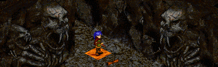

_You pick up a leather scroll and untie the strap that binds it_

# Introduction

This guide is meant for a rogue who has little or no experience in Chaos. You must be at least insight 99 or master to enter. I realize that a rogue experienced in chaos may have different methods, and a difference of opinion. I write with the interest of the one who lacks experience, as a beginning method, or even for an experienced rogue to learn new methods. Some of the techniques I use there now, I intentionally leave out, because they should not be attempted by the group this guide is intended for.

The role a Rogue plays a very important role in the realm of Chaos, one that is very different then what it would be anywhere else. Chaos is a definite challenge, and a rogue must be swift and confident in his decisions, as the whole party depends on him. Many inexperienced groups have perished in the depths of chaos, because of lack of knowledge and lack of respect in assuming chaos is no different than anywhere else that they have hunted. Many Aislings avoid this place all together and one cannot blame them, but for those who wish to live on the edge, teasing Sgrios and his hunger for flesh, Chaos is ideal. Aislings are drawn to Chaos despite its horrible inhabitants, for items of great value, at least to a master Aisling.

## Treasure of Chaos

||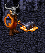|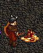|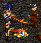|
|-|-|-|-|
|Bent Crux|Talos Ore|Hybrasyl Boots|Mythril Boots|

The known treasure in this dungeon is the Bent Crux, Talos Ore, Hybrasyl Boots, and Mythril Boots. I will only cover what each item does, and not their individual value because the economy of Temuair is constantly changing.

First you will find Bent crux on the Batuss and Aisean Draco in levels one through four. This item alone does nothing, and it must be straightened which can be done only with Talos Ore by the Abel armor smith Steinar.

Talos Ore is another treasure you will find while hunting the levels of three through six. This item is used to repair a bent crux into a straight crux.

The straight crux is very valuable to master Aislings, as it is needed to repair their weapon, as well as empowering and enchanting the weapon. It is also used to make a new master mantle, or a master weapon if one should somehow break theirs.

You can also find Hybrasyl boots by killing Porboss in levels nine through eleven. These boots are extremely valuable to masters who tend to be in a line of attack like monks, warriors, and basher type rogues. They add one thousand health points to an Aisling as well as improving one’s grace by ten, and strength by one. ((many feel they should also have some -ac as well, and hopefully someday they will as mythril boots will add magic resistance)) Do not die with these boots in your possession, as they are perishable.

Mythril boots can be found only in the deepest known area in this hideous place. When master Aislings put on these boots, they will receive one thousand magic points, added grace of ten, one point of wisdom, and magic resistance of ten percent. Because of all they offer mythril boots are beneficial to all classes, and they do not perish when the bearer dies so there is less risk in losing this very valuable item.

## What is Chaos?

I was told a story at Mileth tavern, by an old mundane in a dark hooded robe, the likes of which I have never seen before, or since. His presence felt mysterious and unreal, but then Aingeal the Barkeeper was doing a wonderful job at keeping my goblet full with Milethian Brandy.

Long ago, before the calendar of Deoch and the first Aisling, Chaos was a Draco settlement. Because of the secluded area, and the fruitfulness of the Draco, they quickly ran out of space, and were forced to expand their living quarters. They tunneled deep into the earth, finding huge open caverns in the greater depths, already formed for them. The unbearable heat from the presence of lava had little effect on them, if any at all. It was when they tunneled past the twelfth depth that an evil so powerful and twisted caused a panic in the powerful beasts. They all sensed the terror, and only a few had the willpower to stay and seal the entrance to the thirteenth depth, while the others fled for their lives. At the first level the Draco combined their magic to encase the last level before the exit of the caverns, prevent any beast from crossing. While exiting they discovered an evil Monolith had already formed outside the caverns, and hastily sealed it off from the outside world. But this was not enough to hold back the dark forces for long.


## Preparing for the Hunt

A dark belt is a must, for the deity here attack with the power of darkness and deal a very strong blow. They are also protected by darkness, so be ready for a long battle. A wizard with the magic of mor fas nadur, one or two strong bashers, and a priest is an acceptable group. I usually hunt with a sub path priest-wizard, and a sub path monk-warrior. This is beneficial in two ways, one being the one, you have less ways to split the awesome treasure you will find two, with fewer Aislings the less chance you have for a bad incident. Take heed, not to cripple the group and not providing enough strength and power. Even the strongest of pure path warrior and monk sadly cannot compare to the extended training of one who has learned two paths. Be sure your group is a patient one, and be sure they know what to do in a special situation. If they seem to not want to listen to you, take this as a bad sign, and rethink your party. Be sure they are willing to fall back and sing a song of their temple or dachaidh and come back again. It may take time, but not near the amount of time a rescue or death pile recovery will take. There are specifics, depending on what you want to hunt for.

If you wish to hunt for Bent Crux or Talos Ore, there are few preparations more then what has been covered already.

If you seek boots of Hybrasyl or Mythril, preparation must begin long before a worthy group is selected. Only with the veil blessing of Fiosachd can a group make it past the evil of the seventh level without incident. It is best the rogue have divine faith in his god, because the group must remain hidden for quite some time.

```
((I also recommend you pre-download the chaos maps. Look on the Dark Ages web site 
to find them. Also remember to turn off your overhead map when you enter a new level. 
This will help to prevent you from being disconnected every time you climb down, and 
save your valuable time if you have been veiled))
```

## Fiends in the Realm of Chaos

|Image|Description|
|-|-|
||The Batuss is the smallest and weakest of the opponents you will encounter, but do not let that lead you to believe they are weak. While they have no magical ability they have a very powerful arm, and attack in mass, often surrounding its prey. It is believed they once were a servant of the Draco, and easily succumbed to the evil that overcame the cavern. I recommend confusing them to attack each other, so save damage to your group and their armor as well as yours if you assist in the bashing. These little beasts also hold a Bent Crux from time to time.|
|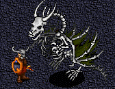| An Aisean Draco is the skeletal remains of the brave Draco who sealed the thirteenth floor, and were left behind and sealed to their fate by their panicked brethren. Sadly they made it to the top, and may have escaped, but here is where they perished and became servant to the evil forces. In their death they gained greater magical power and can cast Ard Srad Ionid, the most powerful of the srad spell will affect every Aisling in the area, even after the group has left the sight of one. <BR><BR>I have also seen them use Ard Pramh, which will put an Aisling to sleep for a seeming long time unless physically attacked. Only when you have left the area entirely will you be safe from their magic. They will also become enraged when their prey becomes invisible, and rely on senses other than sight meaning dall and blind traps will be rendered useless. <BR><BR>I would also recommend not confusing these or confusing anything to attack them. They will attempt to use ard srad ionid on other Aisean Draco in the area, and enrage them so they will also use the powerful spell, all the time the spells will affect Aislings. These Draco also hold a Bent Crux on occasion.|
||The Craidhneach are said to be the remains of warriors summoned by the Draco to slow the pursuing evil and aid in their escape. Their mission has been changed however to serve the dark. They have no magical ability, but attack in great numbers. It is very useful to trick these into attacking each other. Their sword is crafted by Talos Ore, and occasionally they hold a spare fragment.|
||The Clogad Craidhneach are what remains of more powerful warriors summoned by the Draco. These have more armor then their brothers so they are more difficult to kill. They also have no magical ability and will attack in mass with their smaller brothers. It is also useful to breisleich these into attacking each other as well. Their sword, armor and shield are crafted by Talos Ore, and they more often hold a fragment of this treasure.|
|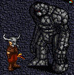| The Artan Deamhans are the big brother to the Batuss. Created by the Draco in their haste to expand their settlement, they are much stronger and more powerful and have more abilities. They speak in the tongue of the Draco, and have the ability to poison opponents from any distance. While they normally attack alone, they have a powerful swing and are a very formidable opponent. While made of stone, their body is also armored with Talos Ore, of which a piece may remain behind when they are destroyed.|
|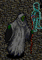|The Sgraidht the first pure evil you will encounter, are believed to be the minion of Chadul himself but this cannot easily be proven. Their senses rotted away so many aeons ago, they now rely on a sense unknown to Aislings. They do not see their opponent, nor do they walk or move by physical means. Because of this blind, and suain have no effect on them. If you attempt to attack them they will flee, and keep a distance between you and themselves and attack with magic only. <BR><BR>A combination of Ard Pramh and Water Dragon, a backward spinning ioc in appearance it is perhaps the most powerful attack any Aisling has yet encountered, it will affect all within the area, this making the Sgraidht a deadly opponent. It is strongly recommended you are invisible in the presence of these beings. <BR><BR>If for any reason your hide is broken near one of these, do not hide in their presence! If you do so, they will attack relentlessly until you have left the area (if you even make it out of the area), also hurting the other members of your group on that floor. Do not ever attempt to trick these with breisleich, it will have catastrophic results. As deadly as they are, a few have managed to kill them and no one has found anything of use from them.|
|| The Srad Deamhans perhaps lava brought to life from a twisted and evil force, or summoned by the Sgraidht, these to have abnormal senses, so they cannot be blinded or suained. They have the same attack as the Sgraidht, Ard Pramh, and Water Dragon. And you should treat them exactly the same as you do with the Sgraidht, hide and don't let your hide break in front of them, as well as remembering not to hide in front of one. If by chance you do hide in the presence of one, and you cannot make it to an exit in a fair amount of time; its best to sing out fast. `((you can also just exit the game, and return... while easier this seems to be cheating the system))` And once again, do not confuse this abomination. They also have nothing of value at least that we know of.
||The Porboss is a worthy opponent, blind will affect them, but they will only act blind when suained by a warrior but will still attack if you are near it. A monk's suain will completely paralyze it, which is very useful. It has been my experience if you can time assassin strike with a monk's wolf fang fist, its accuracy and effect is increased. They have no magic at their disposal, but have one heck of an arm; combined with that claw they can really cause some damage. You will sometimes find the coveted Hybrasyl boots after killing one of these.|
|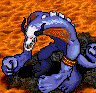|The Losgann uses both its big powerful arms to smash its opponents. It has no magical abilities, and is effected by blind and suain much the same way as the Porboss. No item of use has ever been found on this monstrosity.|
| <br><br>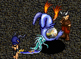|The Kabungkl may look cute, but I don't recommend blowing them a kiss. Possibly the most deadly being in the known lands of Temuair, they target instantly so there is little time to get away, they attack with Ard Pramh, and Water Dragon. Once again, do not hide in front of them! They will not let you get close to them unless they are distracted, they are unaffected by blind and suain. They can be killed, but it would be better if there were a few things left to learn on your own, so I won’t spoil anyone's fun. The few that have been killed in my presence left nothing behind, nor have I been told of them ever having anything.
||The Aog Ridir only found in the lowest known level of the Realm of Chaos, these dark knights is said to be the protection of the evil deity that lies below. Very heavily armored and armed, these take some time to kill. One good point to remember when fighting them, blind works normally and suain will fully paralyze them. This saves an Aisling from an intense beating, as that sword they carry is very sharp. If you are lucky, you will find a pair of Mythril boots after killing him.|

## Tips for Each level

### General Tips

It is always a good idea, for the rogue to check the next level hidden, to ensure an ambush is not waiting for the group. Things can get nasty very quickly, its worth the short amount of time it takes to check. Another thing to remember: if it floats it has the potential to wipe out everyone in the area at once so you must call upon Fiosachd to veil your group and then hide yourself.

Do not allow your hide to break in front of something that floats. If this does happen, either hide and leave the floor right away, try to run out of the abomination's view before you hide, or read a song and get out of there. Tell your group you will catch up with them, its better than being responsible for wiping them out. 

`((another option is to hide, and exit the game. But when you return you will no longer have the protection of being in a group))`

If another member of the group loses their hide, and they are in a safe area, have them wait so you can veil them again. If they lose their hide in front of a 'floater' and can get away from it quickly have them do it. Otherwise they need to sing out, and you must meet them at the beginning to bring them back.

|Image|Floor|Notes|
|-|-|-|
||Chaos 1| In an attempt to keep the evil of chaos inside, this level was enchanted. No beast can enter here, so it's empty. That makes it a good meeting place for your group.|
|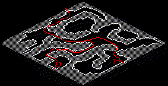|Chaos 2| You will encounter Batuss and Aisean Draco here, a fairly simple level with two exits, both leading to the same entrance of three. This is a good place to hunt for some Bent Crux.|
|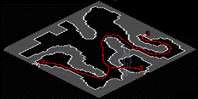|Chaos 3| Batuss, Aisean Draco, and Craidhneach live here. Still no serious challenge here. If you are in Chaos to hunt for Talos Ore, then you want to go to 5. If you are just passing through, you can go through four or five, I prefer five myself. Very often an ambush awaits at the entrance of levels four and five as well. Be sure to tell your group to let you hide and check it out first!|
|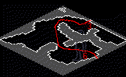|Chaos 4|There is a high population of Aisean Draco here, as well as Batuss and Craidhneach. Because the magic Aisean Draco can use, I would spend as little time here as possible, and I don’t recommend hunting here.|
|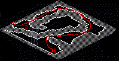|Chaos 5|Craidhneach, and Clogad Craidhneach occupy this area. Things here start to get a little tricky, many hunts have ended premature here so be patient. You should have made sure there was no ambush prior to bringing your whole group into this area. Lay a few blind snares while you are still hidden if anything is around, and be aware in this level you have passages only wide enough for one Aisling or monster, so make sure you don't blind something to block your way. <br><br>If an ambush is waiting, you should lure them away from the entrance, and blind enough so that your party can get by safely. This floor remains narrow for quite some time, and the monsters in here chasing your group will make it very difficult to move around. <br><br>You may want to try to lure them out where the group can dispose of them. There is often an ambush waiting for you at the end of the narrow passage, and may block a group, or a single Aisling in. Remember don't hesitate to tell your party to scroll, and meet back at the first level if things start to get out of control. The heavy population of Craidhneach here provides an excellent area to search for Talos Ore.|
|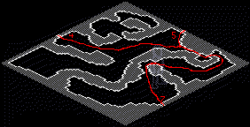|Chaos 6|The Artan Deamhans make their first appearance here, and a few scattered Clogad Craidhneach will be here as well. Not much of a place to hunt but the end before you enter seven is a good place to get your group together.
|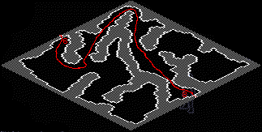|Chaos 7|From here, there is no way to safely travel further, unless you veil your group. It may be possible to get into the beginning part of seven without being in the presence of any Sgraidht. If you can do this it may be a better option to veil your group here, to give them more time to make their destination of ten or eleven. If you plan to go all the way to twelve you should regroup in either the beginning of ten, or the center of eleven. <br><br>Accept that your hide will not last as long as the Fiosachd blessing you placed on your group. Take every opportunity to renew your hide, even if it seems you just did. <br><br>`((press f5 first, with your map on, that way you will be sure nothing is around))` <br><br>You can renew your hide just before you move on to the next level, because you should be gone before anything has time to react.|
|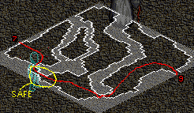|Chaos 8|Here you will find many Sgraidht, and now Srad Deamhans are present. This is not a good place to lose your hide, or a member of you group to lose theirs. If this happens leave the instant you realize your hide is broken, if you still can. A rescue here is VERY difficult to get, and even harder to do successfully. There is one place on this level to seek safety for a member whose hide is running out, and for the rogue to renew his hide. This is mid-way on the west wall. ((west being the left arrow on your keyboard)) For you, your next opportunity to hide is just before you move on to the next cavern.|
|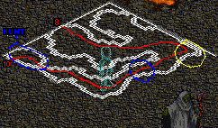|Chaos 9|Just like chaos eight, but the Porboss make their presence here, and there are two safe places to hunt them here. The ideal place is just before the entrance to ten, and the other is somewhat risky you are surrounded on both sides by floaters. The safe place here to renew your hide is in the south east corner, you can also renew your hide in the hunting areas, because the Porboss have no idea you were even there once you hide, even if you do it in front of them. <br><br>If you are in Chaos to hunt for Hybrasyl boots, and your group can not kill extremely fast then your best option is here. You have a couple benefits: the safety of the first part of ten is near, and there are no Losgann here to waste your time and beat up on you and your armor.|
|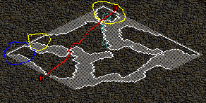|Chaos 10|The beginning of ten is a refreshing spot to take a break, let your heart beat normalize, and get your group together to reveil them if their hide is low, or if you intend to go hunt in twelve. If you want to hunt the Porboss on nine, have your group meet here, and go back up to nine alone and hidden. This way you can blind the Porboss before they have a chance to target anyone. Here in ten you will find the Losgann for the first time, but there is not much else of interest here. No really good places to hunt, its mostly just passage to eleven.|
|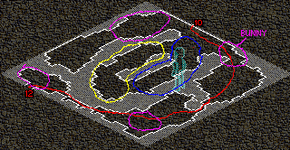|Chaos 11|Without a doubt, this is the best place to hunt for Hybrasyl boots, if you can handle the mass Porboss, and Losgann that rise from destruction here, rather quickly. This is also where the infamous Kabungkl 'Killer Bunny Rabbit' make their first appearance. They tend to stay within certain areas, and don’t wander beyond that, which is very nice. The middle of eleven has a huge safe area. This is a good place to lead several of the Losgann and leave them, because they may slow you down from killing the Porboss and getting your treasured boots. Don’t get too wrapped up in leading them here and leaving them, because the Porboss quickly return, and your group will be left to struggle without you.|
|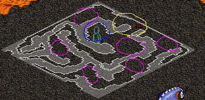|Chaos 12|As it stands, this is the lowest you can go in this ancient accursed realm. The Aog Ridir reside here there are only a few, but once they fall they will rise again quickly. You can find one dark knight a little to the south and to the west after you enter (note the part of the map circles in blue); this is the best place to take your group. There should not be a bunny near, but there is one to the east, so don’t wander too far. All the rest of the Aog Ridir here are accompanied by a Kabungkl, which will make things more difficult (every area colored in violet has a group of Losgann, Kabungkl, and only one Aog Ridir, the rest of this level has nothing). <br><br>One option you have, although it may seem risky, is to have a member of the group move just close enough so the Bunny can barely see him. If this works, the Kabungkl should move back and forth one space at a time, ignoring anyone who gets close to it. Do not attack it! Use this technique just to distract the bunny so you can lure the Aog Ridir away. If this sounds a little risky for you, there is nothing wrong with sticking to the northeast center area and killing Losgann while waiting for the dark knight to rise again!|

_Lokee, Master Rogue and Citizen of Rucesion._  
_Deoch 27, 4th moon_

***

```
*Librarian Notes*

This entry has been edited to conform to Library formatting.
The original can be found at http://www.darkages.com/2000/community/lore/Lokee_Chaos/index.htm .
```
