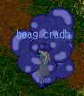
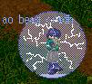
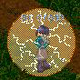
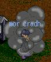
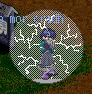
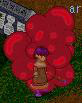
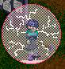
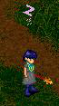
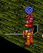
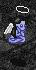

# The Priest's guide to Curses Conditions and Remedies

_by Mayheart in_ ___Dark Ages___

The world is filled with all kinds of spells, it is the very nature of the priest to be a master of both that of cause and effect. Every cause has an effect and every effect has a cause. The great wisdom and intelligence of the priest are used to master this knowledge in varies ways. Some master that of causing ailments while others in removing them, but all priest's at some time learn a bit of both. This guide is to help identify and teach those whom wish to know the conditions I myself have run across.                                     
 
## Curses

Curses come in all sizes and strengths... the key is recognizing the curses being placed to truly remove a curses of the same type. Removing a curses that isn't there can cause slight confusion among your fellow aislings, but has no serious side effects of the receiver of the removal.

|Image|Spell|Meaning|Description|
|-|-|-|-|
||beag cradh|Curses of the Dubhaimid|This curse causes a cloud of blue gas to appear around the victim. A curse such as this rattles the nerves of the victim causing a slight loss of direction and increases the attackers ability to damage the victim.|
||ao beag cradh|_None_|To remove this curse only one spell can be used in this case. Ao Beag Cradh is the arsenal a priest has to remove this quickly. This spell specially designed to remove the blue powder left on the victim and return him/her to a state of alertness.|
||cradh|Curse of hatred|Cradh, such a curse has the very power to drive a aisling into a state of fear, drastically lowering their ability to defend themselves. The attacker uses a spell which covers the victim with a cloud of orange dust.|
||ao cradh|_None_|Ao Cradh is the only spell that has the power to remove this fear from the heart of a victim. Casting this spell requires more mental energy to cast this remedy.|
||mor cradh|Curse of death|Rumors of this curse say that it is used only in the deepest areas of the dungeons and forests. This curse causes a gray hays to focus around a victim. This places the poor victim into a state of utter doom and a feeling of hopelessness.|
||ao mor cradh|_None_|With such a horrific curse haunting your fellow aislings swift and quick acting can save them from this feeling of death. Ao Mor Cradh must quickly be administered to drive out the curse.|
||ard cradh|Curse of hell|Only the eternal damnation of hell itself could reach out and grasp the heart and mind of an aisling and send them into a state of near death. This living nightmare forces itself into a form unspeakable in horror. Covered in the blood of curses, be warned certain doom awaits any who carry this curse.|
||ao ard cradh|_None_|Only the quickest of reflexes can possibly remove a curse like this in time... only by using Ao Ard Cradh on the spot can the victim be saved.|
 
## Conditions

Not only are the monsters and aislings armed with curses, they are also armed with an array of conditions to infect and slow you and your group down...

|Image|Name|Meaning|Description|
|-|-|-|-|
||puinsein|poison|This poison acts quickly spreading itself through an aislings body. Symptoms include a red swirl above the head of the victim, and the slurring of speech. " *el* m* " <br> <br> Removal is down by one of two ways... the spell Ao Puinsein or by using a potion named <br><br>  Personaca Deum (this potion is created with Herbal Lore)|
||pramh|sleep|Casting a large amount of mental energy, this spell promptly places its victim into a light slumber. Even in mid combat or while casting a spell there is nearly no escape. <br><br>There is no spell to release a victim of this spell, on by actually causing damage can one be woken from this sleep. This spell also has only a very short time span, one can wake in a matter of just a short time.|
||dall|blind|What a horrid fate in mid combat... being blinded by the very enemy your after. This spell sends its victim into a state of temporary blindness. During this time the victim can only seem themselves and nothing else, not even the ground their standing on. <br><br> To remove, one can either wait for the spells short time span to pass or to cast Ao Dall as food for thought try not to run around aimlessly you might run into your attacker. `((instead click "tab" and avoid the red dots))`|
||beag suain|slumber/skill|Warriors are given a helpful skill known as beag suain. This Skill will stun a monster from being able to make any physical attacks, nor be able to move around. The victim can still cast spells, but ultimately the victim is unable to remove themselves from this condition unless they to are a warrior armed with another skill. This skill is known as Ao Beag Suain, offered only to Warriors and only to be used upon themselves.|
||suain|frozen/spell|This sleep like spell is nasty in its very nature. Causing the victim to instantly freeze solid, leaving them wide open to any and all forms of attack. Because of the magical nature of this spell its effects are only temporary and short in time. To remove a victim of this utter cold, cast Ao Suain. This will instantly thaw him/her and return them as was before the spell was cast.|
|<br><br><br><br>|death|_none_|Death, the very end of it all... or is it? There are two states one can be in when all their vitality has been removed. This is affected by whether or not the aisling is in a group or not. A group adds mental support and since of worth letting them hold on those last few seconds for a rescue. <br><br> #1, The state in which an aisling awaits rescue from his/her group mates <br> #2, Either the time has expired from #1 or the aisling was not in a group and didn't have the support to hang on. <br><br>In the #1'st state to remove this "on-the-line" condition, only a potion called Beothaich Deum must be administered while standing next to the near dead aisling. This causes the sprit of the near dead aisling to swirl back into its body.<br><br> Beothaich Deum is the Fae's Drink of life, made while only in their midst with the right ingredients|

_MayHeart Merathai_

***

```
*Librarian Notes*

This entry has been edited to conform to Library formatting.
The original can be found at http://www.darkages.com/2000/community/lore/Mayheart_ccr/index.html .
```
