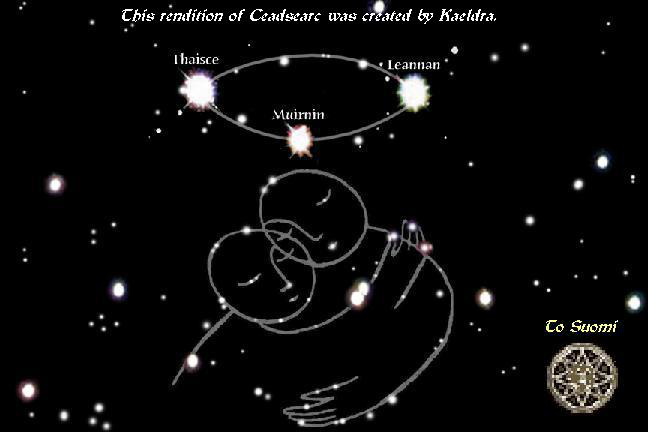

# Realto i Laiocht fior na Speire: A guide to Temuair's Constellations

_by Solanalein in_ ___Dark Ages___

_Blaise, Librarian of Loures looks up from a steaming mug of twiggy-smelling tea, and lowers his glasses skeptically. "May I.. help you? Oh!" He smiles at you and puts his reading down; a red leather cover inscribed with thick gold embossing. The words are in an unfamiliar language. He folds his hands. "An Aisling. Can I help you find something in particular to-day? A novel on the exploits of the Marauder perhaps?" As you respond, he raises his eyebrows, "Research, you say?" and smiles knowingly._ 

_Blaise alights on surprisingly spry feet and leads you, enthusiastically, to the Maps section. "You're looking for astronomy charts? Indeed! I'm a map enthusiast myself." You notice several maps of the Wilds of Temuair, beautifully framed, hanging over his desk. He searches the shelves with his eyes. "We only just received this copy a few moons ago... A gift, from one of our many benefactors. It came out of his private collection." Blaise speaks with solemn importance. He takes a handbook with a torn and faded cover from a high shelf and hands it to you. The book has obviously been well-used, and well-loved. He lowers his voice and speaks meaningfully. "Its actually the only copy of Temuair's astronomical charts in existence. I would have to request you remain in the Library to read it. Well, lets take it into the light!")_

## Using this Guide: A Preface
By day, the Light of Danaan guides our working hours, helping us to see, to tell time by sundial, and encouraging plants and flowers to grow. In the evening, the darkening, purpling sky reveals stars.

Aislings never stay in one place for very long. The night sky has traditionally been used as both a map and as a calendar. This guide will show how the constellations indicate accurately the season and time of the deoch. This guidebook is also a tool to tradesmen who rely on the consistency of trade routes: During certain seasons, some roads become impassable or overgrown.

To the casual astronomer, finding a constellation in the night sky can be an exciting event. For more dedicated observers, charting the movement of the stars throughout the seasons can be a fulfilling hobby. And still some of us, the travelers and tradesmen, depend on the night sky as a map to lead us home and clear of danger. As well as remaining a steadfast and accurate map, the stars tell the story of Temuair, long ago; our most beloved legends and histories.

## On the Seasons

Temuair's natives keep track of hours and days through a system called the Theology of the Octave. A Temuairan season lasts approximately 1 1/2 to 2 doublemoons. There are four seasons to a deoch: Spring, Summer, Fall, Winter. Climate in Temuair is very mild, and the harshness of winter is seen mostly on mountaintops. In the valleys where Aislings live, the plants and animals are unaffected by the seasonal changes. The star pattern in the night sky shifts along with the seasons.

```
Temuair time is 8 times faster than Real Life time.
   8 Temuairan hours = 1 RL hour 
   8 Temuairan days = 1 RL day 
   24 Temuairan days = 3 RL days 
   1 Moon = 3 RL days 
   1 Doublemoon = 6 RL days (1 week) 
   1 Season = Roughly 1 1/2 - 2 Real Life weeks 
   1 Deoch = Roughly 1 1/2 - 2 Real Life months, since months have varying   
   amounts of days in them.
```

## On Compass Points:
This lorekeeper acknowledges that a compass is costly, and often mislaid by those lacking their wits in the dark. Because of this, I have removed all reference of North, South, East, and West, and replaced them with the following. There are no compass points on this common map of Temuair. With the interests of the average Aisling in mind, references to directions will be based on the location of well-known trade routes. 


Sea captains, Rangers, mail carriers, pigeon trainers, and Loures scouts all carry a compass by necessity. Here is a typical compass. Under the glass window in the center is a pin which spins under the influence of magik. As you can see, there is very little glass used in making a compass. Glass must be manufactured in Oren where there is plenty of sand, which makes it an expensive import. A compass is also expensive due to the complicated enchantments on the pin to ensure accuracy.


## The Octogram

Let us begin with the constellation found overhead while walking through Mileth Proper, for this is where all Aisling begin their journeys. Directly above Mileth is the Octagram, this symbol of beginnings and fellowship so often impressed upon our minds as Aislings. In any temple, one can ask the attendant to explain the theology of Temuair. She or he will draw for you an Octagram in pebbles on the temple floor. The pebble-Octagram was first used by Conn, Mundane Philosopher of Mileth College, when his frequent travels to teach abroad required him to carry only necessities.


The most prominent stars in this constellation are Torthai, Feoil and Donnacadh, each pointing in a compass direction of Undine, Abel, and Piet, respectively. The constellation consists of these three bright stars and five smaller and dimmer stars, each having the name of one the Mundane saints; Neal, Donnan, Keefe, Erin, and Logan. `See Translations from Gaelic to English, at the end of this guidebook.`  The Octagram can be seen from the towns surrounding Mileth Proper: Abel Port, Kasmanium Mines, Pravat Crossing, and through the treetops of the East and West Woodlands. 

This constellation remains in the same basic location in the sky throughout the spring and summer, shifting over the ocean dividing Abel and the Isle of Dawn in the winter.

To find a path to Mileth from the towns mentioned above, first locate a footpath for travelers. These paths are easy to find for they are widened and edged each spring with black onyx and granite. Once on the path, locate Feoil and trace a line to the left until you see Keefe. Walk with the two over the right shoulder until you begin to see signposts that will direct you to Mileth. 

### Mairtina: _(formerly Na Drochsheasamh)_

Over Loures, the constellation Mairtina graces the sky. This female warrior of old leans on her shield with her sword upraised. The legendary soldier Mairtina was chased by demons to the cliff's edge at the cold ocean brink. Mairtina cried out to Gramail with her last breath of strength to lift her from the demons' clutches. Ultimately Mairtina took her place in the heavens above Loures Castle. A song, celebrating Gramail's miracles, [can be found in the care of Camille, temple attendant to Gramail.](../Literature/Lobokia-Mighty-Gramail.md "Mighty Gramail") It is written by Lobokia, of Gramail.


In the olden days of Atavism the constellation was called "Na Drochsheasamh." The name Mairtina was later given to this grouping of stars as a sign of new beginnings for King Bruce. Prominent stars in this constellation are Colg, Dhroma, Sciath, and Buaileam. "Sciath," which means 'shield,' has also been spelled "Sgiath" and "Sgath."  Mairtina's constellation is rather large, and can be seen over the ocean dividing Loures and Tagor. In winter, the constellation can also be seen over Piet. Mairtina's sword points out a path from Loures to Piet. Following this path will help a traveler to avoid the marshy sandbars and wetlands of Mehadi in the dark. 

### Ceadsearc

Over the cold sea which between Abel Port and Undine is an array of stars named "Ceadsearc." In the old tongue this term means Sweethearts. The following is an excerpt from a very ancient scroll in the protective care of Kiril, Dark Wizard of Undine and Magus Philosophicus of Temuair.



>_"Here follows the account of the first experimental forms of matter. In days long gone, gods and demons experimented with primitive life. They created crude beasts which walked awkwardly, shunned light, and had no language or culture ("Flesh Gollum," see Reanimation and its Uses). However these monsters had no capacity for love. Finally the gods desired to see creatures interact with the emotion of love. Two crude animals were created and were granted a heart to love and care for one another. These creatures, being very innocent of the world, so fiercely loved one another that they never were apart for longer than a few moments at a time._
>
>_One day, the one said to the other, "I realize now that some day one of us will die, and leave the other to be alone in this world." The lovers were so overcome with sadness at this thought that they cursed the ground and the animals and the gods above them. They mourned and wailed, smashed trees and broke rock in their sorrow and anger. In time, the gods wearied of this behaviour. The two were given a choice: Either come to terms with the prospect of death or be destroyed. The two creatures clung to each other and would not commit to the gods. They flung themselves into Undine Lake and perished there. The gods took pity on them at last, and lifted them to an eternal place in the skies above, forever locked in each other's arms."_
>
>_Radicus Arturan, of Finach_

The most notable stars in this constellation are Thaisce, Muirnin, and Leannan, which form a halo of light over the bodies of the lovers. To locate a walking path to Suomi, face the ocean and point to Muirnin. Sweep your hand to the left until you see Bandearg of the constellation Mean Oiche. Bandearg lies over the mountain pass between Suomi and Tagor. Travelers who stray from this path may find themselves suddenly in the heart of Astrid. 

### Mean Oiche
                                  
Mean Oiche is often depicted in childrens' texts as a cloaked Aisling with a campfire at his feet. This image has been designed to lessen curiosity about Tagor and the House Macabre, but it is the opinion of this lorekeeper that perhaps the real story would deter Aislings more effectively from blackened and cursed places.


Four prominent stars in this constellation are Leathuair, Bandearg, Clar Dubh, and Slaghdan. Mean Oiche depicts a priest summoning the spirit of the Dark Cleric. Bandearg is a prominent body located between Undine and Suomi, and indicates the rising wisps of the Cleric's unholy form. In general the names of the stars brought together indicate the Aisling, at the witching hour, drew in the cleric possession into his heart. 

I was permitted to study an old guide to astrology belonging to Blaise of Loures. The text indicates that in ancient times there was another star in this constellation. Bheilin was located below Leathuair and above Bandearg. According the text entitled _Odhubh Godubh_, "Bheilin grows enormous. It guides as a moon would by night, and in broad daylight, is likened to a bright pinpoint." A later entry in the star journal indicates that the enlargened star finally disappeared, leaving a smear of misty stardust positioned over the Aisling's chest. 

### The Wandering Boatman of Kadath

This final constellation forms a silent reminder of an Aisling's agreement with the Gods never to sail to Kadath's icy, coveted shores. A lost boat sails forever in the black of night, its captain driven mad. There have been many failed, tragic attempts to sail to Kadath safely, and it is not known, at the writing of this guidebook, that there have been any successful arrivals by boat. To reach Kadath, an Aisling must leave the grey realm of the living. At insight 99, by burning a Succubus' hair on the Mileth Altar, an Aisling may be transported to Gramail and Deoch, where they entreat for miracles. Here lies the fate of those seeks Kadath before they are worthy. Such an Aisling will be victim to violent winds, rain, and razor-sharp rocks that come out of the waves like great fish, on their own accord, and slice at boats. 


>_"The traveler of old was most likely full of his own sense of purpose. Perhaps he was a rogue. Always ridiculed by others for his inadequacies at swordplay, and never given proper thanks for his smithing skills. None could live without his expert tailoring and bladework, yet none gave him the thanks he was due. Or so he thought. He felt very different from the others, as if there were an untapped power inside him that no one could see or feel. His mother felt it too, and she always encouraged him to be the best and to rise above all others. The rogue sought a way to prove the bullies wrong. By becoming one with the gods, he would return to Temuair and destroy all his former enemies._
>
>_The rogue possibly sought directions to Kadath from the High Priests, who would have tossed him out on his nose. He may have gone to the Library, and sought literature on Kadath. Finding no help there either, he convinced himself that he could do anything with the skills he had honed in the alleyways. He would have stolen a boat to sail with, believing he would return it when his task was over. It would not have been long before the shores of Rucesion were far from sight. It would not have been long before he knew that there was no turning back. The madness would begin before the storms, I'd wager. He fought with fear of the unknown, and a desire to turn back. Returning, and facing ridicule at another failure, was unthinkable. I can't imagine he would ever find sleep on that little boat, once the storms began. And at that point he would be convinced that his journey was nearly over: 'Just a little further, just through this storm. Just another night and I'll be there.' And eventually, 'What a mess I'm in now! It's horrible being all alone. I shall never see my mother again. Oh, why had I not listened to the warnings of the High Priests?' And at that, he would torture his mind trying desperately to remember anything they could have told him, but in the Madness, remembering nothing but their faces mouthing silent words of protest."_
>
>_A theoretical supposition, as told by Gabriela, Luathas temple attendant_

This grouping of stars shines over Rucesion through all seasons. Prominent stars in this constellation are Eile and Suile, two beautifully bright lights that serve as the boatman's eyes. Others are Talamhdia, the ship's prow. Follow your eyes to the right of this star and you will find Oll Peaca; the boatman's hand, clutching the boat's oar. Above this is Marcaiocht; his shoulder. Na Rabhah and Na Flaitheas shine below these, and can be draw as the underside of the boat. They have also been drawn to symbolize fish or waves. During the winter this constellation moves towards Oren, Karlopos, and Loures. In the Summer, it shines over Rucesion and Castle Dubhaim. Towards the end of summer, a shower of shooting stars will pass through this constellation. Astronomers should look for six to ten shooting stars every minute for a moon. 

## Author's Afterward: 

While writing this guidebook, I often went to open meadows at dusk to sketch, and measure distances. Farmers asked me what I was up to, and when I replied, they would laugh. "What do Aislings need with star charts?" they would say. "And who can see the pictures anyway? All I see are dots," they argued. This only served to spur me on to my task all the more. My hope is these drawings will inspired Aislings to imagine and dream like they first did. It is my hope that more constellations will be welcomed into our colleges and story circles. 
Dancers stumble merrily into the street after a long night in Oren tavern. They cannot help but gaze upward, searching to identify Eile and Suile. Awakening from sleep in the dead of night, an Aisling slips out of bed. Stumbling over to the window, she pulls aside the curtains and peers into the blackness above. What is so reassuring about seeing the twinkling lights of Mairtina's sword shining over Piet? By night, the ancients of Temuair watch over us, for we carry the seeds of to-morrow's legendary heroes.

__Glossary__:  
+ Aisling: A dreamer  
+ Bheilin: In the old tongue, "honey."  
+ Buaileam: Bravado.  
+ Ceadsearc: _ibid_. In the old tongue, "Sweethearts."  
+ Clar Dubh: Simplified means "darkness consuming the heart."  
+ Colg: The word means sword, bitter anger, and the verb "to bristle."  
+ Dhroma: Fallen on one's back.  
+ Eile: In the old tongue, "day," or "bright as day."  
+ Leathuair: In the old tongue, "the Dark Hour," or the witching hour.  
+ Marcaiocht: A type of boat designed by the first shipwrights with two seats, in front and in back, with one long oar that tilted from  one side of the boat to the other.  
+ Na Drochsheasamh: In the old tongue, "Failed Strength." King Bruce demanded the name be changed when he gained control of Loures because he considered it to be a bad omen.  
+ Na Flaitheas: Utopia, trancendental beauty, named for its pure light.  
+ Na Rabhah: In the old tongue, "a warning" or beacon.  
+ Oll Peaca: A grave and serious sin, or a serious act against the Gods.  
+ Sciath: Shield. It can also be the verb, "to shield."  
+ Slaghdan: In the old tongue, a variation on the word "possession."  
+ Suile: In the old tongue, "Eye."  
+ The Saints: When this term is used in the guidebook, it is intended to reference the five Mundanes who spend endless, sleepless hours in the Path Temple (located in Mileth).  
+ Talamhdia: Star of Heaven.  
+ Thaisce, Muirnin, and Leannan: In the constellation Ceadsearc. In the old tongue, meaning, "joy," "tenderness," and "love."  
+ Torthai, Feoil, Donnacadh: Three stars in the Octagram constellation, so named for their varying degrees of brightness.

***

```
*Librarian Notes*

This entry has been edited to conform to Library formatting.
The original was lost.  An archive can be found at http://web.archive.org/web/20090829093303/http://geocities.com/solanalein/starlight.html .
```
