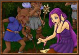

# Artis Mystiklan

  
_Kamiomi's "Mor Strioch Bais"_
## Volume I - Secrets of the Mystic Arts

_by Xilan Horidre in __Dark Ages__._

_Acknowledgement: Korda - for being a great guy and helping me compile this lore._

## Section 1

### Mileth Research

Speakin’ with the great dark wizard of Mileth, Dar, ye will discover there are many different types o’ research ye can study. Dar only allows ye to research alchemy, sorcery, and enchantment, at the lab he has set up on-site in his shop. Ye can research up ta’ four times every six Temuairan days. Our minds can only take so much though, therefore ye must rest them every six Temuarian days `((18 real-life hours))` after research. Be aware, ye should always perform research with an assistant. Ye assistant improves the chance of ye completing the research properly, as well as stayin’ alive. Ye can die from the strain which research causes, so be wary.

#### Alchemy

First, there’s Alchemy. Alchemy is the ancient art of bringing together different materia into one useful whole. Apparently, we as wizards ‘ave the ability to create things once thought to be exclusive to other classes. Due to our quest for knowledge and everlasting diligence, this however, is no longer the case. With the aid of a viper’s gland, ye can create a red potion, known as a "beothaich deum," normally created by priests. 

First, place the viper’s gland in the vices in the lab. Then, proceed to squeeze the extract into a potion bottle. It will be a bright-green color, similar to that of the viper. Then, find a reactant on the table called "beovapaid." Place 3 drops of this into the potion bottle with the viper gland extract. If the potion becomes distinctively red, ye ‘ave successfully created a beothaich deum. These can be used to revive your group members when they are in the clutches of Sgrios in the middle o’ heated battle. To use these potions, when ye partner is unconscious ((there’s a little skull/crossbones floating over their head)), ye must stand next to them and pour the potion down their throat ((double-click to use the potion)). It will revive them, with lil’ health, but alive nonetheless. 

Another way ye can research alchemy is through the creation of Smokey Spheres, once thought to be crafted solely by rogues. To craft these, ye must ‘ave blue powder. Wizards are the only ones that can make blue powder, with the ‘elp of Cian the alchemist. He is right across the way from Dar’s, and all he asks to make the powders are either wolf’s teeth, spider’s eyes, mantis’ eyes, kobold or goblin skulls, or bat’s wings. The easiest of all ta’ get would be the spider’s eyes, for those who are not yet strong enough to kill a kobold or goblin. All ye must do is use the grinding tool Cian keeps behind his counter to grind ye materia into a fine powder. After it is able to be sifted through a sheet with many pinholes, add a bit of dried hemloch root, which Cian keeps a large supply of because ‘e needs it for ‘is pipe. From this, ye get blue powder. 

Take the blue powders over to Dar’s immediately and pack it tightly into the hollow black balls he keeps under the table. Seal it with fire and there ye ‘ave ye Smokey Sphere. Ye know ye ‘ave performed the task correctly if inside there is smoke swirling in a definitive clockwise pattern. These smokey spheres can only be used by rogues, however, they turn a nice profit at the higglers in Rucesion and Undine. They sell for a hefty 2500 gold and are a nice way to make some easy money.

#### Sorcery

Sorcery is the art of making magical connections. There is no money to be made from sorcery, but very useful tools can be created. These tools are songs of home. With them, ye can transport to the entrances of every town in Temuair, if ye are lucky enough to correctly scribe the magical incantations upon a parchment scroll. These scrolls can only be purchased from Dar, for 500 gold a scroll. After ye attain a scroll, there will be a pen on the lab table. 

It looks ordinary, but dip it into the contents of the test tube filled with a red liquid. Write where ye wish to go onto the scroll, then utter the words "Transportan daichaidi van" over the scroll. When correctly done, they become arcane scrolls and the magic which is written upon them causes them to change to a greyish color instead of orange. Wizards, however, cannot identify these scrolls. This makes absolutely no sense to me, but I ‘spose the gods know best. Ye must seek out a priest with perish lore to get them identified. Otherwise, when ye use an arcane scroll, ye will ‘ave no idea where ye are goin’ which is not always a good thing.

#### Enchantment

Lastly, there is Enchantment, the art of leaving a magical mark on something from the natural world. This is the simplest of all the types of research ye can do. Dar makes it a point ta’ tell ye that ye need a perfect item to enchant before ye even attempt it. Firstly, we apparently are skilled in jewelry, so we can research earrings. To make the earrings ye wish to make, ye must have the proper materia to do so. 

To make coral earrings, ye must have a piece of raw coral to work with. Coral earrings raise ye intelligence a bit and are very useful to those of our profession. Then, ye ‘ave beryl, the less powerful version of coral, for which ye need a raw beryl gem. Then there are ruby earrings, for which, you need a raw ruby. We can also make silver and gold earrings. All ye need to make these is the sufficient amount of gold in your inventory. For gold, ‘tis 500 gold at least, for silver, I believe ‘tis 250. 

All the earrings ‘ave molds on the lab table. Use the candle to melt down the materia ye wish to make into a pair of earrings, place into the mold and allow to cool for 1 Temuairan Day. Ye can also enchant gauntlets. The enchantment done at Dar’s is but a small taste of the possible enchantments ye can do, which will be later referred to in section 2. To enchant gauntlets, ye need a unenchanted leather or iron gauntlet. Speak the words "Blessan armano accuvan" over the gauntlets. If successful, the gauntlet will become "blessed," giving +5 to your hit percentage.

## Section 2

### Enchantment

‘Ere we ‘ave real enchanting. Not to put down Dar’s or anything, but ‘ere ye get to experience a variety of different types of enchanting. There are four different types: magic, blessed, might, and abundance. For all of these enchantments, ye will need an assistant of another class, and a specific item. Items which ye can enchant include: greaves, gauntlets, earrings, boots, and shields. Similar to Mileth Research, ye must rest ye mind before and after ye perform these enchantments for a total of 6 Temuairan Days. I will list the enchantments ye are capable of in order of increasin’ difficulty.

#### Blessed Enchantments

Blessed enchantments make ye aim more accurate ((+5 to your to hit percentage)). This is useful to monks, warriors, and rogues, for they are the ones that are dependent on their physical prowess and battle skills to prosper. Ye must be of the 2nd circle of insight, the 20th at least. Ye must ‘ave a rogue of the 11th insight or greater ta’ assist ye in ye enchantment. Also, ye must ‘ave a tuft of wolf’s fur, which can be gained in the Eastern Woodlands from wolves. To perform the enchantment, ye must go to the alchemist in Abel. All 3 of ye must say, while all touching the item ye wish to enchant, " Blessan armano accuvan". If all goes well, ye will ‘ave a blessed item ta’ do whatever ye wish.

#### Abundance Enchantments

Abundance enchantments are valuable to those who depend on their melee skills as well, because it increases the strength of your attack ((adds 1 point of damage)). Ye must be the 28th insight and bring along a monk ta’ assist in the deed. Also, ye need a scorpion’s sting from a scorpion in the crypt. The legendary strength of the scorpion makes it apparent why ye may need such a gland. Ye should ‘ead to the Undine wizard. ‘Ere, ‘e may ‘ave an extraction mechanism similar to the one at Cian’s. Extract the essence from the scorpion sting, and rub it all over the item ye wish ta’ enchant. Then, similar ta’ the others, all 3 of the participants must lay hands on the item, and chant the incantation "Itemos abunduzi." As always, if ye all do it in sync, the item will be enchanted with the magical properties of abundance.

#### Might Enchantments

Might enchantments ‘ave the ability to make ye a bit ‘ealthier ((give ye 100 more vitality points)). This is useful to all classes, as always is with health. Ye must be 35th insight to perform this feat, and a warrior must assist ye in doin’ so. Also, ye must ‘ave a bat’s wing, which can be attained from bats in the crypt anywhere below the 2nd level. To perform this enchantment, ye must go to Piet, to the alchemist in the south-east corner of town, near the Piet Dungeons. Once inside, ye must use the warrior’s blade to slice up the bat’s wing finely. Then, using resin from the alchemist, apply pieces of it sparingly to the item ye wish to enchant. After doin’ so, all 3 of ye must hold the item and say over it "Durabliz fas spinemra," hopin’ ye said it correctly; of course if ye did, then ye ‘ave yeself a item enchanted with might.

#### Magic Enchantments

Perhaps the most difficult of all to perform, the magic enchantment requires that ye be in touch with the mystic arts beyond ye average wizard. Properly enchanting an item with magic allows the wearer ta’ ‘ave more will, depending on the item. For example, Magic Boots give ye a small amount of will ((50 more mana points)). Ye must be of the 60th insight to perform this miracle upon an item, as well as ‘ave a finished ruby to work wit’. Ye must also ‘ave a priest or priestess ta’ assist ye. The ruby ‘tis needed because of the magical beauty it possesses, especially when properly polished. To enchant the item, ye must take the ruby and imbed it into the item, not only for decorative purposes, but also to imbue the item with the magical properties of the ruby. Then, ye, the priest/ess, and the alchemist all chant over the item with ruby in mind, "Mystiklan inchlan endowus." If properly focused, all of ye magic energies will be focused into the item, enchanting it with magic.

## Section 3

### Elementalism

Recently, the grand wizards of Temuair discovered that by collecting the essence of the elements they studied, they could harness them, allowing them to recover will from their use. In Undine, ye can go speak with Kiril, the dark wizard. He sells somethin’ ye need ta’ even sense these nodes of elemental power: the Nadurra necklace. This necklace is sold for a mere 500 gold, and allows ye to sense all elemental nodes. Kiril will also offer ta’ teach ye leasaich spells if ye are great enough insight. Ye learn the spell which coincides with ye element of study of course. So, the respective elements are :sal, athar, srad, and creag. ‘ere is an idea of what ye need ta’ learn these leasaich spells. Be aware that ye can only attempt ta’ collect elements 18 times every 6 Temuairan Days, and it does take up ye efforts so ye cannot do anything else which requires them.

|Attribute|Sal|Athar|Srad|Creag|
|-|-|-|-|-|
|Strength|7|5|42|10|
|Intelligence|7|7|7|10|
|Wisdom|52|7|5|7|
|Constitution|7|5|7|50|
|Dexterity|30|52|5|7|

After ye learn ye leasaich spell and equip ye Nadurra necklace, ye are on ye way to creating fiors, the bottled element. These fiors give ye a random amount of will, anywhere from 1000 to 5000. ‘ere is a listin’ of the places ye can find ye elemental nodes.

Creag: Ye can find ye element outside of crypts, and at large rocks.  

Sal: The best place to find ye element is in the wells of Temuair.  

Srad: There are flames to be found near torches as well as hearths.  

Athar: Ye can find ye athar elements a few paces back from trees. We all know that lightnin’ ‘as a ‘abit of strikin’ trees, hence the ability to locate it here.  

#### Miscellaneous Information

Some things are rarely put out there ta’ ‘elp a young wizard with their decisions. I will tell ye of a few things ye usually do not discover until ye ‘ave gained great amount of insight. First, sal is the hardest element ta’ master, as srad is the easiest. Sal, however, gives ye wisdom which is a bit more useful ta’ a wizard than strength is. In decreasing order of difficulty ta’ master, it goes like this: sal, creag, athar, then srad. Secondly, there is a spell that is unknown ta’ most wizards, including meself. Strioch bais, a spell which uses all ye will at once, but supposedly strikes a fatal blow ta’ anything ye cast it upon is a spell most Aislings do not know of. Ye must train hard in every possible category of ye being ta’ learn it. ((You need 40 in str/int/wis/con/dex, all of them.)) Thirdly, we as wizards can learn ‘erbal Lore, but it takes a master ta’ learn it. ((The stats are 5 str, 40 int, 30 wis, 20 con, 10 dex.)) ‘tis all I ‘ave ta’ share with ye of most things that go unknown in the brethren of wizardry.


## Conclusion

‘Tis the end of the first volume of "Artis Mystiklan." ‘tis only a sampling of what wizards are capable of, but ‘tis more than has been offered in a long while. Ta’ discover the basics of wizardry, read master wizard Kedian’s guide. ‘tis all I ‘ave to offer up now young Aislings; may the "Artis Mystiklan" ‘elp ye in ye journeys, and may Deoch find favor with ye.

_~ Xilan Horidre_  
_Summer of Deoch 6_

## Volume II

The piece is written on 100% recycled parchment. Keep Temuair clean! And not only with the trash and paper, but heretics too!(_thanks Lethalia for the inspiration_)

### I. Introduction   
Hail fellow Aislings. Within this piece, Artis Mystiklan, Volume II, I hope to enlighten you in only a way that Deoch himself could. The path of the wizard, unquestionably the most difficult path one can embark upon in Temuair, is very trying. We lack the comfort of decent armor, seeing as the metals found in most of them, conflict with our ability to summon the essence of the elements; on top of that, most wizards are frail and cannot handle such equipment. We have no proficiency with weaponry, a Great Kindjal means about the same to us as say, a dulled oaken stick We have one true asset, one that when harnessed is more powerful than any weapon, can withstand more than any armor: our minds. 

Less we forget, the mind is what crafted these implements of protection and destruction, alike. A true wizard will not only master the elements, but attempt to perfect his mind. You cannot teach perfection, much less attain it; it is, however, a goal worth striving for. If the mind is strong, the rest of you will follow. You will attain grand strength with brute force, discuss grandiose matters with other mages and Aislings; you might even climb atop the political mountain to help your fellow citizens of Temuair. In all seriousness, the path of the wizard is one that will be well-trodden, so begin your journey cautiously.

### II. A Wizard's Etiquette
Being or at least hoping to be knowledgeable, a true wizard thinks before he speaks and can legitimately support what he says with empirical evidence. In a matter of speaking, we are scientists. Granted, this does not mean avoid religious matters, as the gods are responsible for our abilities. Luathas is the patron god of the wizards, being the god of "gnosis" or knowledge. That of course, is history. The life-threatening research we conduct is a search for such knowledge. `((It should be looked at as more than a vessel for experience.))` There is much more to be learned outside of Dar's, than within his mildewed halls. (Sorry Dar.)

#### a. The Wizard Behind the Wizard
Though we are titled as wizards, there is much more to being a wizard than just casting spells and alchemy. You can always refine yourself, being just a wizard is a very broad term. I myself, am a Seer as well as a Mage. I was taught by an older Seer, Velet Horidre, who adopted me as his son and took me in. His lessons, which expand far past what I can tell you in a lore piece, were geared towards one thing: awareness. Be aware of your surroundings, know them, understand them. Oft in attempting to understand, do we venture places that we may not necessarily want to go; as a Seer, however, your heart calls you to it. 

The Seer makes a good politician as he watches situations and disputes from as many perspectives as he can, to determine the proper action to be taken; s/he is the master of gathering empirical evidence. The Mage part of my being is simple in concept as well. I am always looking to better myself, to increase my skills, to discover new things. Practicing your spells without killing the creatures of the forests and the sewers is ok. Many prefer to use a kobold's head for a target, which is fine too if that is your desire. These are called Warlocks. The Warlock is somewhat like a warrior in spirit; a mage with a bloodlust if you will. A lot of wizards have explored being a Warlock, without even knowing it. Once again, whatever fits you is fine. I do not necessarily pray for the deaths of furry woodland creatures, but what you do with your business is precisely that. Lastly, which I also consider myself, there is the Tutor/Teacher. I believe this is self-explanatory. Wizards, who are sometimes selfish with their knowledge do not have to be. It is your job to make sure that younger wizards coming up have the same opportunities as we did. 

I had no mentor, nor a very "guiding" guide, but he was a great friend; shaman, that is. You can read up on teaching in Lethalia's and my library on the scroll about "Mentors." The Tutor shows students the ways of Temuair, not only of the path of wizardry. This makes way for a better Aisling on top of a better wizard to boot. Now, let's examine the woodland analogy from the four different perspectives.

A Seer: In the woodlands, would probably watch the creatures roam, defend himself if need be. He may study the culture, or watch Aislings interact with each other as they oft do in the forest. He also may question why the Aisling ventures into the woodlands to kill the creatures, wonders what purpose it serves, and what good really comes of it.

A Warlock: A Warlock would kill all the beasts. For glory, for fame, for experiencing the feeling of taking one's life; who knows. 

A Mage: A Mage would stand in the woodlands, and chat with other people while practicing his spells. Uttering the arcane Graymayre is as effective as the Warlock's killing of a goblin; only it lacks the death in the after-effect.A Tutor: A Tutor may stand, helping the younger Aislings find their things in the woodlands themselves. They may also give advice as how to approach combat, through specific techniques and tactics.There are many different things to explore, embark upon one of these paths yourself. Maybe even make a new one. We have yet to see a true Necromancer here in Temuair, not that I'd want to, but we haven't seen one yet.

### III. Getting Started
In the tutorial, it tells you the general description of a wizard. I will place it here for you as well.

Wizard: Master of Arcane Elements  
Advantages: Ranged elemental attack Research, enchant items  
Disadvantages: Must specialize attributes carefully Weakest armor. Most vulnerable to damage

All this is true, and somewhat spoken to already in the introduction. The first step is exploring Mileth. It is good to know where you are and how to get around before finding a guide/mentor. This makes the job of the mentor/guide a whole lot easier as well as gives you a sense of adventure in exploring your new surroundings. Of course, you don't have to do it this way, the mentor should be willing to show you around. The place that you should be most familiar with is Dar's shop. This is where you will learn all of your spells as a young wizard. As you progress and age, you will find your spells in Undine and Suomi, which I will talk about later. You will recognize the wizards of villages by the green cloak they wear and their hidden faces. 

Also at Dar's, you will need to study up on the Graymayre, but you cannot do that until you are guided as a wizard. If you wish to read it, you can always visit Lethalia's and my library, once again, as it is transcribed there as well. The second step is finding a suitable mentor and a suitable guide. A mentor is not required, though I suggest it. The rewards in learning are as greater than those received when the mentorship is completed in a technical sense. Now, there is Lifelong Mentorship, in which a teacher is your teacher for life. This will also be helpful, as many new things will arise later on in your lives, and a person that is bit more knowledgeable that is willing to help will be very useful and convenient. Now you have a teacher and you know where you are, sort of. This is very good. 

Your first armor will be the Gardcorp. The gods have chosen some of the strangest looking armors for wizards, but then again, they aren't really 'armor' which is probably why they look so "unique."All the armor is found in Lethalia's and my library, along with memories of them and their defense statistics. So, you've donned your big yellow sweater, read up on the Graymayre, and are chatting up about arcane things with Dar.. and you think that makes you a wizard?! Of course it doesn't, but it sure is fun. Still want to be a wizard? Alright then. You will not be able to do much in regards to research/enchantment yet as they are done at higher insights when your mind is more capable of withstanding the stress. So, you will probably head over to the Mileth Crypts or the Wastelands of the Eastern Woodlands. Your mentor should show you where these places are. 

The Crypts look like a large rock that rose out of the ground, with dragons' heads sitting on top of it and the entrances cut into the rock; here you will find mice, spiders, and centipedes.. Oh my! Avoid the centipedes, similar to mantises until you are sure that you can handle their deadly sting. The wastelands are directly to the east of the entrance to the Eastern Woodlands; here you will find vipers, mantises, and wasps. Avoid the mantises until you're positive you can handle them and have honed your spells, because they pack quite the wallop. A bit of advice if I will; always hunt in groups. Wizards are extremely ineffective alone, unlike the monk or the warrior, the rogue, or even the priest with deo saighead/naomh aite/mor cradh/pramh. 

So you still want to be a wizard? You should hunt down some vipers for their glands, and take them to sell at Cian's, the alchemist that works next door to Dar. He pays nicely for such things, and will tell you what he needs; he also buys rotten fruit. We have yet to figure out precisely what he does with these items, similar to Dar and the wings of bats... who knows. Either way, you will need one viper's gland to hear either your mentor lecture on the elements, or Dar himself. There are 6 elements, 4 which the wizard can master.. I've appealed to the gods to master all 6 as that's all wizards CAN do.. Light, Darkness, Creag, Srad, Athar, and Sal. 

Out of the Graymayre, into more everyday language they are Light, Darkness, Earth, Fire, Wind, and Water. As stated previously, wizards must specialize their attributes. The need to master the elements, are precisely why we must do so. Creag requires constitution, which in turn gives you a great deal of health. Sal requires wisdom, which in turn gives you a great deal of will (mana). Srad requires strength, which allows you to do your best to fight with a weapon though using one depletes your will and sort of negates your magehood. The spells of srad are more ranged than that of creag and sal, because the rewards you receive are not given by strength. Athar requires dexterity, which allows for the ability to dodge proficiently; similar to srad, the spells of athar have a wider range. 

The elements are all related in one way or another. Srad and creag are sibling elements as they both have an affinity for strength and constitution as you will see later. Sal and athar are the same, both requiring wisdom and dexterity. This means that you will gain minor benefits from the sibling element of the one you choose to study. For example, an athar wizard will have a bit more will than srad and creag, but will still be weak like a wizard of sal. From these choices, you must decide upon an element to study. It is very hard to master more than one due to the specialization of elements, therefore you must be SURE you want to use the one that you end up choosing; otherwise, in the long run you will most likely be disappointed and desire a change, and it might be too late. So now, you have your Gardcorp, your first spell, a bit of insight under your belt.. So you STILL.. Oh wait, you're a wizard now, and there's no turning back so enjoy it.

### IV. The Knowledge and Wisdom of the Wizard 
I think this is obvious. Our minds, being the most important thing to us - apparently knowledge and wisdom wouldn't be very far behind. Knowledge is most often found in books, wisdom is found in experiences. Wisdom is more important to the wizard as it is what guides you in effective use of knowledge. To obtain knowledge, find books, works (like this one) about anything and everything. Wizards are by nature striving "know-it-alls" so live up to your reputation by Deoch. Good wizards will know about the hunt, about all the other professions. They will know about themselves and others like them, as well as the Aisling race and the history of it. Finally, they will know about Temuair and its inner workings, its depths (because it has many) and existence in it. 

There are many people that have written for the libraries of Temuair, however there aren't enough wizards doing so and they should be the main ones! So, write something! Now, to gain wisdom. No one can teach you to be wise, like previously stated, only experiences can do so. You cannot have experiences without interaction. I do not mean, stay in the woods constantly and interact solely with the group of people standing in front of the entranceways to the more dangerous areas. I mean, read the boards, post your opinions, join a religion, commit to Fae love.. All of these things provide experiences and all can teach you a whole lot about Aisling life.

#### a. Mastering the Elements 
These are some simple tables I've put together that tell you what you will need to train in to be able to learn certain spells.

##### Sal Spells

|Spell|Strength|Intelligence|Wisdom|Constitution|Dexterity
|-|-|-|-|-|-|
|beag sal|3|4|7|3|5|
|beag sal lamh|4|5|3|4|7|
|sal|4|7|18|5|13|
|sal lamh|3|8|24|5|4|
|mor sal|10|14|52|10|24|
|sal meall|11|19|60|11|26|
|ard sal|16|35|72|68|12|
|sal gar|22|34|84|22|43|

##### Creag Spells

|Spell|Strength|Intelligence|Wisdom|Constitution|Dexterity
|-|-|-|-|-|-|
|beag creag|3|4|3|7|3|
|beag creag lamh|5|5|3|13|3|
|creag|7|7|3|20|3|
|creag lamh|8|8|3|24|3|
|mor creag|14|14|8|44|8|
|creag meall|14|19|9|51|9|
|ard creag|19|32|12|19|12|
|creag gar|25|34|15|84|15|

##### Athar Spells

|Spell|Strength|Intelligence|Wisdom|Constitution|Dexterity
|-|-|-|-|-|-|
|beag athar|3|4|3|3|7|
|beag athar lamh|3|5|4|3|12|
|athar|3|7|6|3|20|
|athar lamh|3|8|7|3|24|
|mor athar|8|14|14|8|42|
|athar meall|9|19|15|9|46|
|ard athar|12|32|19|12|62|
|athar gar|14|34|31|14|78|

##### Srad Spells

|Spell|Strength|Intelligence|Wisdom|Constitution|Dexterity
|-|-|-|-|-|-|
|beag srad|6|4|3|3|3|
|beag srad lamh|11|5|3|4|3|
|srad|17|7|3|6|3|
|srad lamh|20|8|3|7|3|
|mor srad|36|14|8|14|8|
|srad meall|40|19|9|15|9|
|ard srad|54|32|12|19|12|
|srad gar|22|34|84|22|43|

#### b. Perfecting your Studying Technique
While seemingly simple to do in words, it is a much different task in real life. The wizard studies his libraries, and normally writes himself. Whether or not he ask the mundanes recognize him is irrelevant, as long as he allows his mind to pour out onto parchment; a wizard may just go insane if he does not, considering the only other things we do are hunt, study, and research even more. I've come rather close myself in many of these last moons. You know what they say: _"Cleachdadh dè an foirfe¹"_ translated "Practice makes perfect." 

`¹ - Editor's note: the original text was garbled and may not accurately represent what was written`

The only way to increase your knowledge is through studies. The same is true with your skills, you must use them. Do not expect to be able to craft Lorums if all you go to Dar's to do is sell centipede's glands. You must practice as habitually as you study. It takes a long, long, long while for are actually worthy of such a legend for all to see. This includes elementalism, research, and herbalism. Research will be the first you do, elementalism, then herbalism. Herbal Lore is very hard to master, especially for the wizard. 

To practice herbal lore, you find different herbs in different areas. Betony, Personaca, and Hydele are found in the Enchanted Garden in the Eastern Woodlands and are mixed with wine to complete their transformation into useful . Betony gives you sanctuary, similar to the priest's spell naomh aite. Personaca is a cure for poisons, oft procured from chests by rogues but also have it cast upon them as a deadly curse in the form of puinsein. Hydele is an herb that has great healing capabilities. As far as I've seen, it will store one to full health. When engulfed. Hemloch is found in green bushes in Suomi as well as along iron fences; hemloch is used to seriously injure Aislings ((brings your health down to 1 point)). Warriors find the most use for this with the skill crasher, and a priest friend with a lot of beothaich deum potions. Fifleaf, used to mix a healing potion is found on the roads in Abel as well as in bushes along the sides of buildings. Ancusa, for protection against burns and fire is found in mosses and such on grey stone. If you tie twine around it then around your waist, you can wear it as a belt. Study these things solely because it is within your capabilities to do so, as it is in your nature as well.

#### c. Gear
The clothing of the wizard does not serve as armor, nor are the male garments that becoming. Even still, it is good to know where to find them. Remember, a tailor can always improve your garment so it will give a bit more armor. Here is a chart regarding the wizards' clothing.

|Name|Gender|Insight|Location|Cost
|-|-|-|-|-|
|Garcorp|Male|1st|Rucesion Tailor|750 gold|
|Magi Skirt|Female|1st|Abel Tailor|750 gold|
|Journeyman|Male|11th|Rucesion Tailor|7750 gold|
|Benusta|Female|11th|Rucesion Tailor|7750 gold
|Lorum|Male|41st|Jean (Loures)¹|Respected Citizen, Researcher (3), Labor, Assistant|
|Stoller|Female|41st|Jean (Loures)²|Respected Citizen, Researcher (3), Labor, Assistant|
|Mane|Male|71st|The Sylvan in the Eastern Woodlands³|Magic Cordovan Boots (12)⁴, Labor, Assistant|
|Clymouth|Female|71st|The Sylvan in the Eastern Woodlands³|Finished Talos (6)⁵, Labor, Assistant|
|Unknown|Male|97th|Unknown|Unknown|
|Unknown|Female|97th|Unknown|Unknown|

_¹ - If you meet Jean's standards, he will ask you to help him embue a robe with magic. With the 2 of you laying hands on the robe, the magic works alone and creates beautiful designs._  
_² - If you live up to his standards, he will request that you hold a normal cloth dress by the straps. If successful, the dress will begin undulating in an almost hypnotizing manner and transform._  
_³ - The Sylvan in the Eastern Woodlands `((15-1, north from entrance until you hit the wall))`_  
_⁴ - If you have the boots, give them to her; both of you will un-sew then reassemble them into the Mane, hence the rough but soothing interior and exterior._  
_⁵ - The Sylvan in the Eastern Woodlands will request 6 pieces of finished talos from you. Taking these gems, she will melt them in a kiln, until the consistency is almost "fluffy." She will allow it to cool, pressing it into a flattened "fabric" almost, from which you assist her in crafting the garment from._

Wizards cannot wear accessory armor in any manner that is useful. There is one exception to this rule, however. Leather gauntlets and greaves, enchanted with the qualities of "magic" are not detrimental to your will. So, without paying the decrease in will, you get the increase in armor. There is also the issue of rings. If you do not have a lot of will, I would suggest the Jade Ring. It increases your health as well as your will. All wizards can benefit from this, however the sal master should try Emerald or Spinel rings. They great increase in health is very beneficial to them, seeing as they have a very minute amount of constitution. Athar would benefit from an emerald and a jade ring, seeing as they do not have the will of a sal wizard nor the health of a creag wizard. 

Common necklaces do not aid those who do not use weapons, however, the Nadurra necklace is a vital tool to the wizard. It allows them to cultivate elemental nodes, into more useful potions called fiors. These fiors can be used to restore will. Refer to "Artis Mystiklan: Vol. I" for more information regarding elementalism. Lastly, there is deciding on a belt. The element of the belt, weakens you to that elemental spell, but strengthens you against the one it dominates. Example: A water belt, weakens you to sal spells but increases your defense again srad spells. All beasts all over cast similar spells, however, certain places use specific elements more often. Mehadi Swamp and the sewers, for example, are prone to sal. I believe the Kasmanium Mines favor srad.The only "weapons" a wizard can use that does him/her some good is the staff. There have been 3 discovered in Temuair for wizards, though legends speak of more such as the Trident Orb and the Cresent Beam. There is the Magus Ares, which has no specific purpose to just about anyone's knowledge.

#### d. Miscellaneous Information
There are a few spells that do not fall under the basis attack/elemental spell category. These spells are lectures, leasaich spells, dachaidh and strioch bais. Lecture spells are very useful. They save a trip to Dar's for your student and are fairly simple to use. You do, however, use your will when casting them as you are reciting a lecture. To hear/give a lecture, cast the lecture spell. Drop a coin directly in front of where you stand. Anyone who wishes to hear can do so as well. `((You can do it in the 8 space grid around a person, but I find it always works to drop it in front of the person.))` 

There are also leasaich spells that are used in elementalism which is explained in "Artis Mystiklan: Vol. I." Then there is dachaidh, which will return you home, whether it be the Mileth Inn or in the middle of Rucesion, depending on your citizenship. Finally, there is strioch bais, a spell which is an all-will consuming spell that does a hefty amount of damage to any creature it is cast upon. Acinorev is the only Aisling that has it today, if you have specific questions pertaining to it, I am sure she will help you. Here is a chart of the miscellaneous spells.

|Spell|Strength|Intelligence|Wisdom|Constitution|Dexterity
|-|-|-|-|-|-|
|leasaich sal|7|7|52|7|30|
|leasaich srad|42|7|5|7|5|
|leasaich athar|5|7|7|5|52|
|leasaich creag|10|10|7|50|7|
|strioch bais|40|40|40|40|40|
|dachaidh|5|36|5|5|5|
|Mentor|3|17|36|3|3|
|Guide Lecture|4|10|4|4|4|
|Herbal Lore|5|40|30|20|10|
|Graymayre Lecture|3|10|3|3|3|
|Elements Lecture|3|20|3|3|3|

### V. Hunting Tactics
Yes, I think it is safe to say that all wizards are not the greatest hunters. We do, however, serve a purpose contrary to popular belief. If a wizard knows what s/he are doing, and have practiced as they should.. they should be useful to a group.

Hunting with a Warrior: Not the most effective group due to lack of a healer. Of course, wizards can supply hydele deum if need be and the wizard is insightful enough. The warrior would bash away as the wizard hid and cast their spells. Corners are very good for this, seeing as most creatures are not intelligent enough to figure out all they have to do is walk around. Well the beast is trapped, the warrior can do their damage, hopefully not distracting the beast allowing the warrior to whack away at it mercilessly.

Hunting with a Priest: The arcane masters of Temuair in one group. The strategy is dependant upon the insight of the priest. If they have pramh and cradh/mor cradh, then a mor cradh/pramh/ard or mor combination would work beautifully. A Zeus would help the priest as they could pramh as well as use deo saighead pretty quickly, almost making the wizard obsolete. The wizard should be the one to take the brunt of the blows solely because they should be the main attacker. Hiding for the wizard works well in all situations, but at it's best in this one. Both the wizard and the priest can position themselves so that the attacker will not be able to reach them allowing for melee tactics. 

Hunting with a Rogue: This group serves to be entertaining if nothing else. Possibly the two most useless in combat in all of the realm, they are not very effective at all together. The rogue would serve as the melee/throw attacker. Also, if it is a more advanced rogue, their use of traps is vital to the success of the group in any fashion. If they have the sleep and blind traps, they are best for hunting. The sleep would be similar to a pramh, only it is like a small tranquilizer that is jabbed into the fit when stepped on. This trap renders the attacker unable to attack or cast spells. Blind, does somewhat of the same thing only they are able attack, but cannot move. If a creature is blinded, they stand in the same area but if you go within their reach, they will attack you. This is just so wizards do not get brash and stand near the beast without fear of it inflicting any serious damage.

Hunting with a Monk: Very similar to the warrior/wizard combination. The wizard casts while in hiding and allows the monk to attack as well. There is not much more to it than that.

Hunting with other wizards: It is all about strategy, and even then, it is still possible to fall rather swiftly. Like the priest/wizard combination, both of the wizards should find a hiding place and utter their arcane words from a distance. If there is nowhere to find safe haven, behind a wall or in a corner, then the group is nowhere near as effective. If the wizards know their capabilities and are knowledgeable of how long it takes to cast their spells, then it will simply matters. One wizard would attack, and run away from the attacker. This would allow the other wizard to attack. 

Normally, the attacker would go after the other wizard considering they were the last attack them. If they do not, the wizard that is getting attacks runs around until the other wizard distracts it. This saves taking unnecessary damage as well as wasting willpower.Hunting in Groups: The wizard only serves to attack the main beasts with their ranged attacks. If attacked by numerous targets, the wizard can distract one and allow the melee fighters to work their own magic, without having to worry about being killed in the process. Also, if hunting with a knowledgeable group, the members of the party would know how to strategically place themselves so that they would form a wall against the attacker, allowing the wizard go attack unscathed.

#### VI. Conclusion
I hope that all have gained a suitable amount of knowledge from this writing, and maybe are inspired to record some things for our guild of wizards as well. Hopefully, this is only a gateway to the world of mystic arts. All a teacher can do is light the path, it is the student's job to begin to tread. I thank you for taking time to read my piece, as it is an attempt to pour my flasks of knowledge in the form of writing onto parchment scrolls at Dar's. Oh, and he does not mind people using his desks to study, so do not ever avoid his building in fear that the paranoid green wizard will snap and possibly hurt you.

_~Xilan Horidre_  
_Deoch 8, 5th moon, 26th sun, 3 p.m._

_The piece is written on 100% recycled parchment. Keep Temuair clean! And not only with the trash and paper, but heretics too!(thanks Lethalia for the inspiration)_

```
*Librarian Notes*

This entry has been heavily edited to conform to Library formatting.
The original can be found at http://www.darkages.com/community/lore/Xilan_Mystiklan.html .
```
