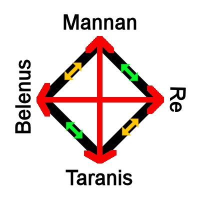

# Concordantia Divinitatis
_by Sabrael in_ ___Dark Ages___

## Preface
In my many travels throughout these lands, the study of the divine has always fascinated me.  A gift, inquisitiveness, the torment and delight of those licked by the flames of Deoch. Inspiration has lead me through many a daring adventure, delving the deepest of ruins and conquering the most formidable of libraries, all in a quest to record the nature of our cosmology for all to observe, wonder over and seek inspiration from.

In this work, several references will be made to Aphrodite’s [_Sects of Temuairan Faith_](../../../loures/Philosophy/Aphrodite-Sects-of-Temuairan-Faith.md), Angelique’s [_Obscurum ac Luminarium_](../../../loures/Philosophy/Angelique-Obscurum-ac-Luminarium.md), and Chloe’s [_Reflections on the Interactions Between the Gods_](../../../loures/Philosophy/Chloe-Reflections-on-the-Interactions-Between-the-Gods.md).  These three works show the most relevance to finalizing and detailing all we know about the divine, and will be quoted often.  As such, where relevant, citations for these three entries will be marked with a † - typically all three will apply.  Additionally, illustrations will be provided when possible, but be warned that my humble gifts lie with the pen and harp, not with the brush.

The origins and details of many of these deities have been gathered from folklore and handed down tales, as little can be found in the written works of Aislings for many of these lesser known deities.  In addition, the nature of the divine will be examined through a discussion of the what and why of the Octagram, what the relation is between faith and power, and lastly, a cursory introduction to the path of ascension.

## Octagram Theory
For a moment, indulge me in this flight of fantasy.  Picture if you will, the vastness of the night sky, but with the familiar grounds we walk a far distant memory.  We will call this great emptiness "space", where one can see the stars and moons and suns that make up familiar figures that greet us from the night sky ([_Solanalein's "Realto I Laiocht Fior Na Spiere_](../../../loures/Lore/Solanalein-Realto-I-Laiocht-Fior-Na-Speire.md)).  In this vast darkness, lit only by the twinkling of stars, see the Octagram as a flat plane.

It is there, on this plane, that Danaan made the great sacrifice to seal away Chadul for all eternity.  What is speculated though, is the nature of this seal.  How does it work?  Many would say that Danaan has perished, but as we look around us, we can see her influence.  Her light still shines.  It is here that Danaan is chained, on this great seal, her light shining brightly to keep the darkness at bay.  In this, in her wisdom and glory, Danaan enlisted the aid of what we now know as the Gods of the Octagram.  Ever at vigil, each for a different reason and purpose, the Gods of the Octagram stand in ritual, strengthening both Danaan and the ward which keeps the great darkness from arising.

For millennia they have stood, in silent vigil, channeling their will into the prison that has kept the dark lord from returning.  In turn, we, as the inspired dreamers, so too channel our faith, prayers, pleas and thanks to each God of the Octagram.  Such is the forging of the chain that binds the darkness, let us never forget.  For should we fall, the Gods of the Octagram will diminish as well, and then too will Danaan's sacrifice be for naught.  

One surmises that this theory can be evidenced by direct review of the lands of Temuair.  All around us, in this the one hundred and seventy first deoch, faith is in decline.  The minions of Chadul brush against the borders of Chaos as the temples collect dust from disuse.  Should this course not be corrected, I fear the darkness will envelop us all.

## On the Relations of Faith and Power
As described previously, our faith is the fuel of a great cosmic engine.  However, it not only empowers the great seal, but also seems to flow in and around us.  Who hasn't felt the ecstasy of communion, the surge of power, after desecrating a holy artifact of an opposing deity?  The rites to consume and purify a prayer necklace, in particular, fill one with such an energy that it is almost as if you have been marked by the divine.  Likewise, even in holy communion during mass, one can argue that even the stoic Gramailians can't help but smile as they briefly glimpse the nature of the divine.

So then, one can imagine Aislings as small, in the grand scheme of things, but inexhaustible containers, filled to the brim with this divine power.  Should you look within yourself, and picture your spark, shining as brightly as the sun, you know this to be true.  Deoch's gift to us was twofold - one, to raise us from the depths of mundanity, but also two, to enlist our help in the sealing of Chadul.

By his gifts, you, I, and indeed all Aislings engage in an ebb and flow of power refinement and transfer.  One can see the effects on the land when the worship of Luathas is high, as magic also shimmers in the air.  Or when the love of Glioca flows freely, the kindness is nearly palpable in every touch, every gift, every song.  With the waxing of one faith, it too seems a different faith wanes.  As one can see today, worship of Gramail is but a shade of its former self, and the effects can be seen on the land as apostates and their practice of forbidden magic remains at an unprecedented level.

Of importance, however, is the understanding that while the power flow may shifts and collect at one point of the Octagram or another, the total balance should remains the same.  However, what if that energy is directed in a different direction?

## Theorem of Divine Ascension
Far before my time, although some of the elders may remember, a group of Aislings gathered and formed what became the Cult of Enigma.  Following no god, these Aislings left a mark on the lands.  Whilst nominally pledged to Sgrios, as his summons were still a force of power at the time, this was quite different.  When a faithful of the Octagram calls upon the deity for aid,  creatures come to the aid of the supplicant as an ally, taking suggestions but operating of their own will.  Not so, for the Cult of Enigma.  These creatures were enslaved, used skillfully and with intent to commit atrocities not since seen on these lands.

How was this done?  It is the point of this theorem to demonstrate that the power of the spark, which strengthens the prison of Chadul, can, through force of will, be directed to forces and ideas outside of the Octagram.  Indeed, had the cult not been stopped, we Aislings may have witnessed the birth of a new God, one perhaps even as dark and terrible as Chadul.

This redirection of power can also be seen in various other cults that have appeared.  The sometimes "Cult of Danaan" appears without warning, gathering followers for a rush of exaltation to the goddess of light, and then mysteriously vanishing just as quickly.  Indeed, the chosen of the cult has often been described as being able to perform miracles, normally reserved for those pledged to the Gods of the Octagram.  Decried as a charlatan by many leaders of the Octagram faiths, perhaps this cult also strengthened Danaan in their own way.  As discussed previously, however, the purpose of the worship of the Octagram gods is to refine and enhance power before transference.  Without this process, one is left to wonder of the effectiveness of this Cult's efforts, even if they are able to produce miracles as such.

More troubling, however, are those of the Anaman Pact.  Begun by Lord Tenes and councilors of Loures, this thousand year pact rose to prominence and fell to mystery before the rise of Aislings.  Forever, it seemed, to remain relegated to the realms of fairy tale imagination, all of this changed when the Pact was renewed by the Aisling Hollie and her cohorts in the 8th Deoch.  Since then, followers of this cult too have shown their propensity for miracles, though they are dark and shadowy.  It is said the whispers of these cultists can bring even the most noble and kind hearted Aisling down into the depths of cruelty and pain.  Students of the history of Mileth Politics will see how this small group of Aislings, with their rumored sacrifices, have been able to topple the government there time and again.  It is the sincere hope that, like the cult of Danaan, this transference of raw power to Chadul in exchange for gifts is ineffective.

In each of these scenarios, we see the transference of divinity into places surely unintended by Deoch in his grand design.  These events, while rare, are likely to be the source of the occasional breakthrough for the minions of Chadul to enter Temuair once more.  It is with great fortune, however, that these instances seem few and far between.  I worry for us all should they become more commonplace.

## Gods of the Octagram
With the discussion of the dynamics of faith, power, divinity and ascension behind us, now too shall we learn of each of the deities, both real and assumed, that shape these lands.  With hope, a more complete view of the cosmology of Temuair will help rekindle an interest in the divine.  In many instances, the worship of some deities exists only in the past, or in some cases, are assumed to exist and remain undiscovered.  

`((Begin OOC))`  
Information relevant to the 5th edition of Dungeons & Dragons SRD will be included as well!  As this content includes references to OGL content, please review the WOTC Fan Content Policy [here](https://company.wizards.com/fancontentpolicy).  Additionally, information about the OGL (Open Game License) can be referenced on each site that is linked in this document.  
`((End OOC))`

### __Gramail__ 
Influence: Order, Law, Justice, Science, Vengeance†  
Symbol: Evenly balanced golden scales  
Temple Location: Loures City  
Worshippers: Judges, Politicians, Scholars  

`((Begin OOC))`  
Domains: Order [(SRD)](http://dnd5e.wikidot.com/cleric:order), Unity [(UA)](http://dnd5e.wikidot.com/cleric:unity-domain-ua)  
Alignment: Lawful Neutral  
Power Level: Greater God  
Channel Divinity: Choose between Order and Unity; for 2nd level, choose between Order, Unity and Judgment - By expending one charge, your hold spells are now cast as if they were 5 levels higher and work on any living creature.  
`((End OOC))`

#### History  
Gramail began life as an Aosdic scholar, and later was elevated to godhood by Danaan [_(NitroTFD's "Gods de Temuair")_](../../../loures/Philosophy/NitroTFD-Gods-de_Temuair.md).  Though several stories around his awakening and ascension exist, it is theorized that Gramail was chosen due to his complete embrace of Justice and Order during his time as the First Judge (a position in ancient Hy-brasyl's legal system) prior to the city sinking beneath the waves.  Legend holds that Gramail himself held the trial over the first murderer, and sentenced him through sheer reason and logic, as no laws existed at the time to cover the heinous act.  Interestingly, his trinity also represents the first to fall against Chadul, as well as the only evidence of mortals ascending to deity.

#### Orders & Champions
No current orders exist in the Gramail fellowship that I was able to determine, save rumors of a sect of Gramailians who follow his aspect of Vengeance.  I was unable to locate any follower of this aspect, as Gramailians themselves are rare indeed.  Even Angelique, High Priestess of Gramail for over one hundred Deochs, laughed and said they were tales to scare small children, and that she had never seen evidence of such a sect existing in reality.

Of Champions, one exists in Aisling memory, that of Miramele DuBalde, known as the Fist of Gramail.  The first Acolyte, the founder of the Rucesion government, Miramele was a paragon of Gramail in her time. 

#### Relationships
Gramail allies with Luathas and Fiosachd, holds enmity with Glioca and Sgrios, and is the opposite of Deoch†.  Gramail is a god beset on all sides, due to his adherence to order in a world full of chaos†.

### __Glioca__
Influence: Compassion, Healing, Love, Herbalism, the Fae†  
Symbol: A bouquet of red roses  
Temple Location: Mileth  
Worshippers: Lovers, Priests, Children  

`((Begin OOC))`  
Domains: Life [(SRD)](http://dnd5e.wikidot.com/cleric:life), Protection [(UA)](http://dnd5e.wikidot.com/cleric:protection)  
Alignment: Chaotic Good  
Power Level: Greater God  
Channel Divinity: Choose between Life and Protection.  For second level, choose between Life, Protection and Rebirth - By expending one charge, you may empower Healing Word to fully heal an ally, and additionally heal the closest two allies for half the amount healed.  
`((End OOC)) `

#### History  
Glioca is the only daughter of Danaan, and mother of Cail [_(NitroTFD's "Gods de Temuair")_](../../../loures/Philosophy/NitroTFD-Gods-de-Temuair.md).  It is said that she created the Fae as she walking by a dying flower in her garden one day.  With a kiss, her love of all things living caused the flower to bloom and the first Fae emerged from the unfolded petals.  Matron of the Eldar [_(Nenya's "A Short History of the Eldar")_](../../../loures/History/Nenya-A-Short-History-Of-The_Eldar.md), it is said that the heavy spring rains in Mileth come from her tears as she weeps for her slain children.

#### Orders & Champions
The Gliocan faith has always had a large following, due to her shrine being located in Mileth.  The numerous sects and ideologies within the temple are more than can be committed to paper, yet none have achieved much prominence due to the chaotic nature of the Goddess.

If any could be called a champion of Glioca, the priest Deksar surely fits that role.  Renowned for the literal volumes he could speak on the goddess, I am told that his masses would last for several days at a time.  As the first arena host, he even took his compassion to the field of Aisling glory, tending to the fallen and bruised after each match. 

#### Relationships
Glioca allies with Deoch and Cail, holds enmity with Gramail and Ceannlaidir, and is opposed by Fiosachd†.  A popular goddess, even the dark and foreboding Sgrios holds no particular ill will towards her.  If any could unite the Octagram against a threat, it would be the daughter of the one who first united them.

### __Luathas__
Influence: Gnosis, Magic, Craftsmanship, Divination, History†  
Symbol: A green quill  
Temple Location: Rucesion  
Worshippers: Wizards, Scholars, Blacksmiths  

`((Begin OOC))`  
Domains: Knowledge [(SRD)](http://dnd5e.wikidot.com/cleric:knowledge), Arcana [(SRD)](http://dnd5e.wikidot.com/cleric:arcana) 
Alignment: Lawful Neutral  
Power Level: Greater God  
Channel Divinity: Choose between Knowledge and Arcana.  For second level, choose between Knowledge, Arcana and Gnosis - By expending one charge, you or an ally automatically gain an advantage on your next two skill checks, and treat such checks as if you had proficiency in the skill.  
`((End OOC))`

#### History  
Luathas was an Aosdic scholar known for his wisdom to such a degree that he was raised to divinity by Danaan [_(NitroTFD's "Gods de Temuair")_](../../../loures/Philosophy/NitroTFD-Gods-de-Temuair.md).  His detailed histories, advanced studies of magic, and deft philosophical musings are the fodder for legend, as only mere scraps were recovered from the sinking of Hy-brasyl.  It is rumored that the Loures library was founded by his inspiration as an act of his divinity.

#### Orders & Champions
Of all religious orders, perhaps none is more known, and more peculiar, than the Academie Arcanus [_(Veneficus's "History of the Academie Arcanus")_](../../../loures/History/History-Of-The-Academie-Arcanus.md).  An order of wizards dedicated to the God Luathas, the Acedemie was created in times before Aislings, destroyed and shamed into exile, and then reborn as an institute of learning.  What truer dedication could there be?  The only strange part would be the complete lack of priests among their midst!

With that, Veneficus bears mention as the scion of Luathas.  No other Aisling has done more to further his name, or have created such a lasting impression on the minds of Aislings as to the importance of the God Luathas. 

#### Relationships
Luathas allies with Gramail and Cail, holds enmity with Deoch and Ceannlaidir, and is opposed by Sgrios†.  Luathas's trinity has the misfortune of perhaps being the least worshipped in the lands, while also being the most needed.

### __Fiosachd – Luck, Fortune__
Influence: Luck, Fortune, Prosperity, Desire, Shadows†  
Symbol: A single silver coin  
Temple Location: Abel  
Worshippers: Rogues, Merchants, Adventurers   

`(( Begin OOC))`  
Domains: Trickery [(SRD)](http://dnd5e.wikidot.com/cleric:trickery), Twilight [(UA)](http://dnd5e.wikidot.com/cleric:twilight)  
Alignment: Lawful Neutral  
Power Level: Greater God  
Channel Divinity: Luck - By expending one charge, you or an ally may reroll a saving throw with advantage, or automatically stabilize if downed.  
`((End OOC)) `  

#### History  
While he and his fellow mortals share ascension to the divine, Fiosachd was no Aosdic scholar  [_(NitroTFD's "Gods de Temuair")_](../../../loures/Philosophy/NitroTFD-Gods-de-Temuair.md)!  Tales of his daring adventures, love of coin and gems, and silvered tongue survived even the drowning of Hy-brasyl. Indeed, he is called the first Rogue, patron of quick deals and coin.  Legend has it that as an observer to the ascension of both Gramail and Luathas, Fiosachd convinced Danaan to raise him to deity as well.  Surely, a bargain of some kind had to have been struck to accomplish such a feat.

#### Orders & Champions
As both the patron of Rogues and shadows, if any orders exist in the Fiosachd faith, they hide well.  No particular orders come to mind, but perhaps the many merchants that congregate in Rucesion have a secret allegiance.

While Fiosachd has no known champions of renown, infamy and his temple go hand in hand.  One Aisling in particular meets this level of notoriety, but I will not add to their legend. 

#### Relationships
Fiosachd allies with Gramail and Ceannlaidir, holds enmity with Deoch and Cail, and is opposed by Glioca†.  Ever popular with the down on their luck, Fiosachd's limitless wealth seemingly comes for free.  Little do the desperate know that the God of Fortune always gets his due.

### __Ceannlaidir__
Influence: Honor, War, Carnage, The Hunt, Conquest†  
Symbol: A bloodied and ragged pennant  
Temple Location: Piet  
Worshippers: Warriors, Soldiers, Huntsmen   

`((Begin OOC))`  
Domains: War [(SRD)](http://dnd5e.wikidot.com/cleric:war), Blood [(CR)](http://dnd5e.wikidot.com/cleric:blood)  
Alignment: Chaotic Neutral  
Power Level: Greater God  
Channel Divinity: Choose between War and Blood.  For 2nd level, choose between War, Blood and Smite - By expending one charge, you may add 2d8 damage to any melee attack that hits.  This bonus increases to 3d8 at level 5, 4d8 at level 10, and 5d8 at level 20.  
`((End OOC))`  

#### History  
Another of the original Gods, Ceannlaidir has long been worshipped by those who do battle  [_(NitroTFD's "Gods de Temuair")_](../../../loures/Philosophy/NitroTFD-Gods-de-Temuair.md)!  An truly complex being, Ceannlaidir is often painted as a brute, but this is also the same being that seduced Glioca and fathered Cail.  As these lands have known nothing but turmoil since Hy-brasyl sank beneath the waves, Ceannlaidir is always nearby, basking in the delight of battle.  It is said that he even materialized for the final confrontation between the demi-gods Ealagad and Tenes, to observe first hand the most glorious of all battles.

#### Orders & Champions
Caennlaidir is perhaps the most prolific of deities who inspire orders, as many have existed throughout the ages.  Both the Warrioth Clan and Aegis Knights were Aisling organizations dedicated to the glory of Ceannlaidir.  Arguably, it could also be said that Tiarnach, that bed of heresy and later apostasy, was perhaps the most notable of clans dedicated to Ceannlaidir.  This designation, I am sure, would have been hotly contested by the heretical members of the clan, but in the end no other order has done more to praise the God of Battle.

If any Aisling embodies the idea of the Champion of Ceannlaidir, none other than "The Warrior" himself, Vamistle, could be better qualified.  While he is an acolyte of Luathas, Vamistle's dedication to his craft is a true homage to the patron of Warriors. 

#### Relationships
Ceannlaidir allies with Sgrios and Fiosachd, holds enmity with Luathas and Glioca, and is opposed by Cail†.  Whenever swords clash or glory is to be found, Ceannlaidir and his worshippers will not be far behind.  With his name evoked by soldiers before battle, or hunters before a hunt, Ceannlaidir remains one of the more popular gods in Temuair.

### __Sgrios__
Influence: Decay, Entropy, Famine, Disease, Death†  
Symbol: A skeletal hand pointing downward  
Temple Location: Dubhaim Castle  
Worshippers: The ill, the wretched, the unfortunate   

`((Begin OOC))`  
Domains: Death [(SRD)](http://dnd5e.wikidot.com/cleric:death), Grave [(SRD)](http://dnd5e.wikidot.com/cleric:grave) 
Alignment: True Neutral  
Power Level: Greater God  
Channel Divinity: Choose between Death and Grave.  For second level, choose between Death, Grave and Sgrios's Scar - By expending one charge, you mark a creature with -1 to all attributes, checks and saving throws.  This lasts until the creature has been blessed by a follower of Cail, Glioca or Deoch.  
`((End OOC))`  

#### History  
Ascension, it seems, is not only for mortals [_(NitroTFD's "Gods de Temuair")_](../../../loures/Philosophy/NitroTFD-Gods-de-Temuair.md).  Sgrios is perhaps the most curious case of ascension from one form to another.  In a lost work I discovered in the ruins north of Dubhaim Castle, a somewhat mad chronicler detailed the birth, growth and eventual rise of the entity we call Sgrios.  Starting as the most small of dubhaimid larva, the creature came into existence with an insatiable hunger.  As he ate, he grew and evolved in form, moving from larva, to gaunt, and then finally to night gaunt.  What is undetermined is how he transitioned to his current form, but the chronicler speculated that in exchange for ascension, he tore his own wings and horns off, and consumed them.

Even in his endless hunger, Sgrios knew the alliance with Chadul would be his undoing.  With the destruction of all life, Sgrios would devour all that remained and eventually starve.  With this in mind, out of necessity for survival, Sgrios struck a bargain with Deoch.  Instead of wholly consuming each spark that came to him, he would instead nibble ever so slightly before sending the spark back to grow in power.

It is with this eternal bargain that we as Aislings will feel the excruciating pain of Sgrios delicately tasting our essence before he sends us away to grow stronger.  Having secured a means to temper his endless hunger, he now maintains vigil alongside the other Gods of the Octagram, his eternal banquet secured as long as Chadul remains imprisoned.

#### Orders & Champions
Sgrios is perhaps the most misunderstood and maligned Gods of the Octagram.  Any orders devoted to his name are persecuted and stamped out of existence, most often by the zealotry of Gramailians and Gliocans.  While historical records exists of secret sects of the followers of Sgrios, no trace of these orders remain today.

One would be remiss in discussing Sgrios without the mention of two Aislings - Ginger, and Enclave.  Ginger, the wretched, claimed scores of souls in Sgrios's name, seeking to send every Aisling to Sgrios to feed on in short order.  It was only through the efforts of Enclave, the Dark Father, that control of the Sgrian religion was wrestled from Ginger the iconoclast and returned to the true worship of Sgrios as the regulator of the Octagram.  To this day, the Enclavian Dogma, and its many branches, still hold sway in the temple of Sgrios.  As for Ginger, her teachings and dissident views have long been removed from the public eye.  I fear for the lands if these views should ever return to prominence.

#### Relationships
Sgrios allies with Ceannlaidir and Deoch, holds enmity with Gramail and Cail, and is opposed by Luathas†.  The worship of decay and entropy had been mostly driven underground by zealotry, but curious alliances have existed since the time of the Dark Father. What truer testament to the rightfulness of his leadership, which has since allowed the faith to grow and flourish, exists outside of this?

### __Cail__ 
Influence: Nature, Balance, Agriculture, Forests, Mountains†  
Symbol: An oak tree  
Temple Location: Undine  
Worshippers: Monks, Druids, Farmers   

`((Begin OOC))`  
Domains: Nature [(SRD)](http://dnd5e.wikidot.com/cleric:nature), Martyrdom [(Homebrew)](https://www.dandwiki.com/wiki/Martyrdom_Domain_(5e_Subclass))  
Alignment: True Neutral  
Power Level: Greater God  
Channel Divinity: Choose between Nature and Martyrdom.  For 2nd level, choose between Nature, Martyrdom and Ring of Peace - By expending one charge, you may cause an aura of peace to emanate in a 60 yard radius for 1 turn per cleric level.  Any hostile action will result in a creature within the radius being thrown forcibly outside of it upon failing a wisdom saving throw, suffering 1d8 force damage.  Succeeding on a wisdom saving throw will cause all attack rolls to be at a disadvantage.  
`((End OOC))` 

#### History  
Ah, Cail.  Born of violence and cursed by his father, an interesting discussion is to be had around this deity of the wild  [_(NitroTFD's "Gods de Temuair")_](../../../loures/Philosophy/NitroTFD-Gods-de-Temuair.md).  In quoting a famous mundane scholar, "Life finds a way", one indeed finds a most whole summary of the deity Cail.  Forbidden by his father from bearing arms, Cail subverted this curse to inspire the founding of the Monk path we see today.  No weapon is required for these warriors to shatter stone or break bone, but they also lean on the influence of his mother, with their gentle touch known to heal minor wounds.  Indeed, the inevitability of the slow moving mountain, the patience of the winding stream, all belong to Cail.  Long known for his peaceful nature and stewardship of the wilds, Cail strives to see this balance maintained across the lands.  Peace and balance do not come without cost, however; just as a raging forest fire cleanses the land for new growth, so too does Cail correct imbalances in the natural order.

#### Orders & Champions
As the patron of both Monks and nature, Cail boasts perhaps the only mundane order to any deity - the Druids of Temuair.  Aislings who follow Cail, however, tend to loosely affiliate, preferring the solitude and wisdom of the forests to the bustle of chaotic guild halls.  In all my searching, no record of any Aisling order devoted to Cail could be found.

One would be remiss, and likely castigated, should the name Pashura not be mentioned with discussion of Cail.  From the legends of earlier times, it would seem Pashura acted as a protective vine, growing steadily and shielding the temple of Cail from heresy and apostacy.  However, without balance, even a vine can grow from a shield to a stranglehold, causing the host to wither and die.  Such seems to be the case for the temple of Cail, as the footsteps of barefooted clergy seldom echo in those halls in these times.

#### Relationships
Cail allies with Glioca and Luathas, holds enmity with Fiosachd and Sgrios, and is opposed by Ceannlaidir†.  In these times, the absence of the apostles of balance is felt most stingingly, as equilibrium could not be found in these lands even if one were to overturn every stone.  If the past is any predictor, we may be in for a great storm of fury as Cail rights things back to their natural order.

### __Deoch__
Influence: Creativity, Chaos, Passion, Rebirth, Songs†  
Symbol: Brightly burning flame  
Temple Location: Suomi  
Worshippers: Bards, Artists, Revelers   

`((Begin OOC))`  
Domains: Chaos [(Homebrew)](https://www.dandwiki.com/wiki/Chaos_Domain_(5e_Subclass)), Flames [(Homebrew)](https://www.dandwiki.com/wiki/Chaos_Domain_(5e_Subclass))  
Alignment: Chaotic Neutral  
Power Level: Greater God  
Channel Divinity: Select from either Chaos or Flames  
`((End OOC))`

#### History  
In another curious case of ascending to the divine, Deoch was not always an ally to what are now known as the Gods of the Octagram  [_(NitroTFD's "Gods de Temuair")_](../../../loures/Philosophy/NitroTFD-Gods-de-Temuair.md).  Originally what passes for a deity among the dubhaimid, Deoch the Corruptor whispered seductions into the ears of men, causing them to forsake the righteous path and descend into unholy debauchery.  All of this changed upon his first encounter with Danaan.  So brightly did the light of Danaan touch Deoch, that he shed his old ways and took up the mantle of inspiration.  It is through this transformation that Deoch ascended into our savior, and took his rightful place in the Octagram.  No other being, mortal or immortal, changed the balance between Darkness and Light more than Deoch.  Likewise, it is his grand design which keeps Chadul imprisoned.

Truly, without Deoch, we would all be lost to the darkness.

#### Orders & Champions
Given the chaotic nature of Deoch, finding something resembling an organized group established in his name was somewhat difficult.  However, my tireless research stumbled upon some old manuscripts, detailing the founding of the Garamonde Theater Group.  While members of this original group are rarely seen, the Suomi Troupe has taken up the mantle of keeping the traditions and ways of the playwrights alive to this day.

No other Aisling exemplified the brilliance of our lord of fire, than Paladine Meatha, first High Priest to Deoch.  Tales tell that simply being in his presence inspired some of the mightiest Aisling minds to pen the greatest works of Temuair.  As a young Deoch priest, tales of his spark filled me with the greatest of imaginations.  Without that early inspiration, who knows if this work would have ever been created!

#### Relationships
Deoch allies with Glioca and Sgrios, holds enmity with Luathas and Fiosachd, and is opposed by Gramail†.  Much like Gramail, the worship of Deoch has faded into obscurity, an telling sign of the times.  As the spark fades, so too does the seal holding Chadul at bay.

## Intermediate Deities
With the review of Gods well known and established in Temuair, now we move on to another exciting piece of this work.  From this section forward, I will detail all I have gathered on the lost gods of Temuair.  Whether rumor or fact, evidence of these deities exists in fragments, scattered throughout the lands.

With such an introduction, we now move on to what I have coined the "Intermediate Deities".  These beings, powerful in their own right, could have stepped into the pact of the Octagram, but for whatever reasons did not.  Ancient as the earthsea itself, their worship seems relegated only to insular remote communities, if any worshippers can be found at all.

### __Belenus__
Influence: The Sun, Dawn   
Symbol: An emblazoned golden eye   
Temple Location: Near Eingren Manor, in the Filth Forest   
Worshippers: Currently none   

`((Begin OOC))`  
Domains: Light [(SRD)](http://dnd5e.wikidot.com/cleric:light)  
Alignment: Lawful Good  
Power Level: Intermediate  
Channel Divinity: Standard  
`((End OOC))`

#### History  
Noble Belenus, lord of the sun.  His worship was once widespread, shown by the evidence of his markings around Temuair.  A particular foe of the undead, Belenus's main shrine was located near Eingren Manor in what is now the Filth Forest.  While the tale of how the Filth Forest came to be is one for another day, it is of particular importance to the saga of Belenus.

With the rise of the Necromancers, the stirrings of the undead threatened to overwhelm the farmlands outside of Tagor.  Indeed, as this most brilliant of suns began to set, Eingren Manor and the Shrine of Belenus were entirely cut off from the outside world by hordes of the undead.  Braving my way through the forests after discovering a reference to the location in a book I found in a shop in Piet, I set to discover what I could of this lost shrine.

After many days of searching, I found a small journal, wrapped in some sort of treated hide that I was unable to identify, hidden beneath a pile of rubble.  While mostly water damaged and decayed, some of the text remained legible:
```
Danaan, 2964, Fall

It has been nearly a month since Vasile left to try to get aid from Tagor.  I fear sweet
Vasile is dead, Belenus take him.  I warned him not to go, as the undead swarm with a
frenzy as of late.  Our food supplies dwindle further each day, as with the recent surge 
of the undead it is no longer safe to forage in the forests.

Luca, Cristian, Nicolae and myself are all that remain.  The foul creatures no longer
appear to fear my rebukes, and Belenus himself grows distant.  What have we done for
him to forsake us?  If only master Ishgar were here.  His faith was a shining beacon
in the night, and would easily drive out these monstrosties!

For now, we rest.  At dawn, we shall set out for Tagor, as Eingren village is lost.
Bitterly, the dead no longer line the streets, as they too have risen.  Even the scant
few I managed to give rites to have joined the horde.  I know not what hope we have,
but we must press for Tagor.  There is nothing left to save.

Yours,
Sabrinus, Acolyte of Belenus
```

This corroborates with history discovered by Vendes [_(Vendes's "The Night Of Tagor")_](../../../loures/History/Vendes-The-Night-Of-Tagor.md), and was an exciting, and tragic, find.  I searched for days after locating this treasure, but I could find no trace of the shrine.  On occasion I make the journey back there, wandering through the remains of the village.  Questioning the insane priest who has inhabited the only building still standing has turned up no leads.  On my first visit, I had thought perhaps this building had been built over the shrine, but if this were the case, no traces of it remain.

#### Speculations
The findings of the journal were troublesome.  What could possess more power than a god?  As Vendes contemplated, the idea that the Pact of Anaman could conceal an entire city, rivaling the size of Loures or Mileth, from all eyes for so long is indeed worrisome.  Perhaps it is this shrouding which led to the diminishing of Belenus?  From various sources I've been able to piece together, shrines to Belenus outside of the boundaries of Tagor tended to be small, generally nothing more than short obelisks inscribed with his symbol.

Indeed, even in the great Library of Loures, I was only able to find a footnote here or there, referencing tomes that were no longer in the library's possession.  A cover-up, perhaps?  To think the Pact of Anaman could end the existence of a deity is truly troubling.

#### Relationships
Belenus was allied with Taranis, held enmity with Mannan, and was opposed by Re.  There are some scant mentions of Belenus in the texts located in the Deoch temple, so it appears there may have been a relationship there as well, but I was unable to determine anything specific.

#### Blessing
In legend, the blessing of an item by Belenus increased the potency of healing spells.


### __Re__
Influence:  The Moon, Secrets 
Symbol: A closed eye on a crescent moon  
Temple Location: Niara  
Worshippers: None currently   

`((Begin OOC))`  
Domains: Moon [(Homebrew)](https://www.dandwiki.com/wiki/Moon_Domain_(5e_Subclass))  
Alignment: Lawful Neutral   
Power Level: Intermediate  
Channel Divinity: Standard  
`((End OOC))`

#### History  
Re was perhaps the most interesting of the intermediate gods to track down.  Ruler of the cold-hearted orb that burns the night, mistress of secrets, queen of the night, many are her names in plentiful sources.  Indeed, while references to Belenus appear to have been systematically eradicated from existence, I could barely turn a page without running across a reference to Re.  Her temple, magnificent according to the works referencing it, was located in the heart of the mighty City-State of Niara, which as we know, was destroyed sometime around Danaan 1703 [_(NitroTFD's "Niaran History")_](../../../loures/History/NitroTFD-Niaran-History.md).  

Never one to shrink from a challenge, I sat out on the long journey from Loures to the ruins of Niara.  After several days journey, I came to the cliffs of Faodhail Abhainn [_(Evenue's "Iodhnadh De A Luaithre")_](../../../loures/History/Evenue-Iodhnadh-De-A-Luaithre.md).  Pausing briefly, I cursed my inability as an artist - the beauty of the vista is quite breathtaking.  From far away, one can still see the spires of the great city, glinting at sundown.  All of this is an illusion though, for upon approaching, the ruins of the city are devastating to behold.

The very land seems cursed, soaked in the blood of dubhaimid over a millenia ago.  Even still, while abandoned, I could not help but feel I was being watched.  Locating the temple itself was easy enough, the structure in remarkably good condition compared to the ruins around it.  It took several attempts to open the door, as it appears to have been barred from the inside.

What I discovered inside was breathtaking - nary a drop of dust or thing out of place inside the entire temple.  Candles still burned on the altar, and the air was chill and fresh.  I searched thoughout the temple, careful to not disturb anything lest I incur the wrath of the Night Queen.
My search of the temple was fruitless.  Not only were there no written records, but there was no sign of life anywhere in the vicinity.  I can only conclude that someone from a nearby village must make the dangerous trek to maintain this shrine, as no other explanation exists.

I recall most vividly the chill ran down my spine as I prepared to leave the temple.  Glancing above me, at the rough hewn marble above the doorway, there was something I missed upon entering.  Jaggedly slashed into the mantle was the phrase "_My glory preserved - One day, I will return for you_".  It was at this moment that I decided discretion was indeed the better part of valor, and in a most dignified manner, quickly made my way back to Loures. Extra precautions were taken to make sure the temple was sealed tightly behind me - there may also have been a small piling of rubble in front of the door.

#### Speculations
Even though we have detailed accounts of Re the goddess, from the many books, scrolls and tomes that escaped the destruction of Niara, all mentions of her, her faith and her temple vanish from written record after approximately Danaan 1650.  Could the Night Queen have forseen what was to come and prepared?  From the message carved into the mantle of the temple door, one can only surmise that indeed she did.

#### Relationships
Re was allied with Mannan, held enmity with Taranis, and was opposed by Belenus.  Again, Re was a very popular subject in the Loures library, but only as a mention.  Nothing of concrete was discovered on her religion, her followers, or what happened to them.

#### Blessing
In legend, the blessing of an item by Re reduced the mana required to cast spells.

### __Mannan – Seas, Depths__
Influence: The Sea  
Symbol: A silver trident   
Temple Location: Oren  
Worshippers: Fishermen, Sailors   

`((Begin OOC))`  
Domains: Oceanic [(Homebrew)](https://www.dandwiki.com/wiki/Oceanic_Domain_(5e_Subclass))  
Alignment: Neutral Good  
Power Level: Intermediate  
Channel Divinity: Standard  
`((End OOC))`

#### History  
Mannan, lord of the oceans.  A name still invoked this day by sailors and fishermen alike, although I wonder if they understand why.  His temple was rather trivial to find, or what was left of it anyway.  The ruined rubble of his temple is located just as one enters the town of Oren.  Very few references were found in the Library of Loures to Mannan, but Old Baldo, a rather talkative resident of Oren, was more than happy to tell me all about what happened.

The Sea Priests of Mannan were once a welcome addition to any ship leaving the port of Oren.  Their communion with the lord of the seas made for swift journeys across a calm ocean, with their endless prayers and chanting calming even the most turbulent of storms.  Indeed, unlike the other intermediate gods, Mannan's sect was uninvolved in any of the mainland wars.

That is, according to Old Baldo, until the blight began.  As he recounts it, his grandfather's grandfather's grandfather (_I'll admit here I lost track of how many times the old man said grandfather_) was a young boy when the blight came.  At the time, Oren was a lush and green land, similar to the verdant valleys of Suomi.  Fish were plentiful in that time as well, as the sea was willing to give up much of its bounty.  All of that changed however, the day an emissary from Loures came.  He demanded tribute from the Lord of Oren, and was rebuffed.  On his way back to the harbor, the emissary chuckled as he indicated dark things would come for refusing to pay tribute to Loures, boarded his ship, and set sail.

Within a week, the seas and gone from a sapphire blue to a pale green.  Fish pulled from the ocean were bitter and covered in oozing wounds.  Likewise, the land itself began to shudder and heave, as the verdant green hills gave way to the near barren ground we see today.  Indeed, much of the rubble of the earthquakes that rocked the island are still seen today - Oren was once a walled, seaside kingdom.  Now its walls lay in ruin, and its seas hostile to all who dare them.

The first building to fall was the temple of Mannan.  Old Baldo recounts that nearly every one of the sea priests had gathered for mass, when the great quaking rocked the island.  It was almost as if the earth opened up to swallow the temple whole - no bodies were ever recovered.

With the temple gone, and the clergy missing, the worship of Mannan fell by the wayside in favor of the Gods of the Octagram.  Even today, his name is muttered more as an oath than that of an invocation for aid.

#### Speculations
Again, the work of the Pact.  Could they really have caused a temple and all its priests to be swallowed up by the earth?  Even so, what dark magicks could cause a whole realm of people to turn their back on a once trusted deity?  What of Mannan himself?  Old Baldo's tale left me with more questions than answers.  I attempted to access the library in Oren, but I have been told it is closed for repairs, which is troubling, as I have received this same answer for the last ten Deochs.

Perhaps one day the archives will open and more will be discovered of the fate of Mannan's worshippers.  Until then, chalk up yet another tragic victory for the Pact of Anaman.

#### Relationships
Mannan was allied with Re, held enmity with Belenus, and was opposed by Taranis.

#### Blessing
In legend, the blessing of an item by Mannan slightly increased the rate at which Aislings gained insight.


### __Taranis__
Influence: Sky, Storms  
Symbol: A green lightning bolt  
Temple Location: Somewhere near the fallen Dwarven Kingdom   
Worshippers:  Dwarves?   

`((Begin OOC))`  
Domains: Tempest [(SRD)](http://dnd5e.wikidot.com/cleric:tempest)  
Alignment: Neutral Good  
Power Level: Intermediate  
Channel Divinity: Standard  
`((End OOC))`

#### History  
While the other three temples had some interesting challenges in learning more about them, the temple of Taranis was both the easiest and most difficult:  I know exactly where it is.  However, between myself and the temple of Taranis is a sheer mountainside where the entrance to the dwarven kingdom Khoreduhr once stood [_(Angelique's "Àraidhe")_](../../../loures/History/Angelique-Àraidhe.md).  Diagrams of the Khoreduhr were provided in great detail to the Library of Loures, including several maps dated just prior to the fall of the Kingdom in the fifth Aeon.

What is unfortunately not available is a method to actually enter Khoreduhr.  After many fruitless days searching the location of the former entrance, I was forced to give up after being attacked by a band of wraiths just beyond midnight - my mistake for choosing to venture there so close to the anniversary of the last battle and inevitable demise of the dwarven stronghold.

Taranis, however, is the most peculiar of the intermediate gods, if not indeed all the gods.  A dwarven deity, of the sky?  Worshipped by mundanes and Aislings?  I surmise that perhaps a settlement in close proximity to the Khoreduhr would have perhaps picked up the faith through trade with the kingdom, blossomed and grown, and eventually vanished alongside any villages.  When the dubhaimid attacked Khoreduhr, they cut a swath of destruction through the landscape - I saw no traces of settlements along the trail I followed to the entrance.

Of interest, it seems liturgical chaning was a part of the faith. Scribed on the back of a map in the Loures Library, I discovered what is called the "Litany of Storms":
```
Blessed is the lord of storms
for his is the way of salvation
Blessed is his hammer
for it is the path to purification
Blessed is the north wind
for it brings the cool air in the summer
Blessed is the south Wind
for it brings the warm air in the winter
Blessed are the rains
for they are his gifts to us
Blessed are the those who rise before us
for they are his challenge
Blessed are those who fall before us
for they are our gifts to him
```
#### Speculations
With the fall of Khoreduhr and the annhilation of the countryside leading to it, it is hard to imagine that the worship of Taranis has survived in any meaningful form.  Still, no one has set foot inside of Khoreduhr for countless generations - perhaps some of the dwarves survived and worship him still.

#### Relationships
Taranis was allied with Belenus, held enmity with Re, and was opposed by Mannan.

#### Blessing
In legend, the blessing of an item by Taranis allowed its wielder to slightly overcome a creature's resistance to magic.


### __Relations between Intermediate Deities__
Much like the deities of the Octagram, the interactions between intermediate gods takes a rational shape:  


Key:
|Color|Meaning|
|-|-|
|Red|Opposition|
|Green|Allied|
|Orange|Enmity|

Through this simple chart, we can see the alliances, enmities and oppositions each of the intermediate gods represent in this microcosm of theology.  Unlike the Gods of the Octagram, however, this diagram serves no other purpose than educational - these gods are not standing on top of some form of medium evil!  At least, let us hope so, as they have seemingly vanished.

## Lesser Deities
One of the more fascinating finds I discovered on my journeys was tucked away in an old book I purchased from a merchant I met on the road during one of my many trips to Deochs Temple. Folded neatly and stuffed in the back of the book, there was a chart of several lesser deities that are bound in service to the Gods of the Octagram.  In several detailed diagrams, the unknown author described both their relation and function!  Even more exciting was to discover that these deities seemingly matched up to the various sects described by Aphrodite’s [_Sects of Temuairan Faith_](../../../loures/Philosophy/Aphrodite-Sects-of-Temuairan-Faith.md):

|Name|Influence|Symbol|Servitor To|Trinity|
|-|-|-|-|-|
|Dioltas|Vengeance|Executioner's Hood|Gramail|Order|
|Ceartas|Justice|Blindfold|Gramail|Order|
|Ailceimic|Alchemy|Potion|Gramail|Order
|Goibhniu|Smithing|Hammer|Luathas|Esotericism|
|Oghma|Chronicles|Open Book|Luathas|Esotericism|
|Andraste|Divination|Blue Star|Luathas|Esotericism|
|Aine|Love|Rose|Glioca|Life|
|Luibhlia|Herbalism|Sevti Blossom|Glioca|Life|
|Eriu|Fae|Green Heart|Glioca|Life|
|Rathunas|Prosperity|Sack of Coins|Fiosachd|Adventure|
|Ciocras|Desire|Red Slash|Fiosachd|Adventure|
|Oiche|Shadows|Purple Mask|Fiosachd|Adventure|
|Cernunnos|The Hunt|Bow|Ceannlaidir|Victory|
|Nemain|Carnage|Dagger|Ceannlaidir|Victory|
|Nuada|Conquest|Pennant|Ceannlaidir|Viictory|
|Balor|Death|Scythe|Sgrios|Entropy|
|Elphane|Disease|Yellow Skull|Sgrios|Entropy|
|Arawn|Famine|Sack of Grain|Sgrios|Entropy|
|Viridios|Agriculture|Corn|Cail|Nature|
|Dunatis|Mountains|Talos|Cail|Nature|
|Sucellus|Forests|Fern|Cail|Nature|
|Branwen|Passion|Wine Cask|Deoch|Chaos|
|Arianrhod|Rebirth|Orange Circle|Deoch|Chaos|
|Taliesen|Songs|Lute|Deoch|Chaos|

These various lesser deities seem to be the primary way in which interactions with Aislings are conducted currently.  With much of their attention focused on maintaining the great seal, these gods serve as messengers of sorts.  Locating examples of their direct worship was not successful, which leads me to wonder - are these separate beings, or simple avatars taken on by the Gods of the Octagram?  In truth, each seems to represent a different aspect of the god they serve.  However, whether separate beings or simply forms taken, there is definitive proof they exist.

Various oaths and exclaimations from throughout the lands invoke these deities, such as the phrase "That one has been kissed by Aine", when describing a young person in love, or "By Oghma, what was I just going to write down?" - a phrase I have often used myself!  Small signs of each god can be seen throughout Temuair - each smith hangs the symbol of Goibhniu outside their door.  In taverns, Branwen's name is not far from the lips of drunkards and revelrers alike.  Any who have ventured into the Shinewood forest can tell you of the fae that abound there, even one that will speak to Aislings.  Is this Eriu?  She did not seem to respond to that name when I called out to her, but the fae, ever capricious, could have simply been toying with me.

A relatively obscure, but fortunate find on my part - I still endeavor to research more of each of these gods as I find the topic fascinating!

## Gods of the Wilds
### __The Seasons - Earrach, Spring, Caithim, Winter, Fomhar, Autumn, Samradh, Summer__
### __The Elements - Tine, Fire Spirit, Uisce, Water Spirit, Ithir, Earth Spirit, Gaoth, Air Spirit__
### __The Morrigan – Ana, Mabd and Macha__

## Deceased Gods
### __Dagdha – Gramail replaced__
### __Mathonwy – god of magic – Luathas replaced__
### __Lugh - god of arts, travel, and commerce – Fiosachd replaced__

## Gods of Kadath
### __Oraithe Ridire – “Gilded King” – Hastor – The unspeakable__
### __Dubh-gabhar – “Black Goat” – Shub-Niggurath – Black Goat of the Woods__
### __Codlaim – “Slumber” - Hypnos – Lord of Sleep__
### __Duibheagan – “Abyss” - Dagon – Ruler of the Deep Ones__
### __Adhnann – “Flames (Passion)” - Cthuga – The Living Flame__
### __Tochaltoir ar iochtar – “Burrower Beneath” - Shudde M’Ell – The burrower beneath__
### __Neamhghlan – “Unclean” - Aboth – Source of Uncleanness__

## Demi-Gods
### __Ealagad__
### __Tenes__
### __Phailin__
### __Tyr__