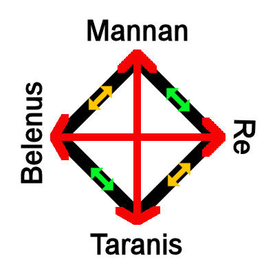

# Concordantia Divinitatis
_by Sabrael in_ ___Dark Ages___

## Prologue
In my many travels throughout these lands, the study of the divine has always fascinated me.  A gift, inquisitiveness, the torment and delight of those licked by the flames of Deoch. Inspiration has led me through many a daring adventure, delving the deepest of ruins and conquering the most formidable of libraries, all in a quest to record the nature of our cosmology for all to observe, wonder over and seek inspiration from.

### __Quotations__
In this work, several references will be made to Aphrodite’s [_"Sects of Temuairan Faith"_](../../../master/Philosophy/Aphrodite-Sects-of-Temuairan-Faith.md), Angelique’s [_"Obscurum ac Luminarium"_](../../../master/Philosophy/Angelique-Obscurum-ac-Luminarium.md), and Chloe’s [_Reflections on the Interactions Between the Gods_](../../../master/Philosophy/Chloe-Reflections-on-the-Interactions-Between-the-Gods.md).  These three works show the most relevance to finalizing and detailing all we know about the divine, and will be quoted often.  As such, where relevant, citations for these three entries will be marked with a † - typically all three will apply.  When possible, direct attribution and reference will be made to a score of notable works throughout the library.  Additionally, one should note that the idea of theological "Opposites" differs from Chloe's work - Several contemporaries of Chloe (Angelique, [Stella](../../../master/Philosophy/Stella-Marble-Figures.md), [Reynnard](../../../master/Philosophy/Reynnard-Fiosachd-and-His-Place-in-the-World.md)) see oppositions in a far different light, making it one of the more contested theological concepts.  For this work, I take the much more adopted approach of Glioca being in opposition to Fiosachd, rather than Sgrios as Chloe dictates; likewise with Sgrios opposing Luathas, rather than Glioca.

A special note on another notable quotation - NitroTFD's [_"Gods de Temuair"_](../../../master/Philosophy/NitroTFD-Gods-de-Temuair.md). Each of these references will be called out separately, as the work itself is problematic.  Notable for his love of propaganda, NitroTFD's Lords de Niara organization was primarily geared towards undermining order in the Mileth kingdom, in some misguided attempt for revenge over the centuries old downfall of Niara at the hands of Dorch Tenes [_("The Birth of the Daemon Anaman")_](../../../master/History/Swanberg-The-Birth-Of-The-Daemon-Anaman.md).  Primarily, many of the speculations about the natures of the gods, including some rather... curious and citation-needed nicknames, are out of alignment with other established works.  These small hints are often found in Niaran propaganda, so one remains curious as to which pieces ring true, and which are hollow.

### __Contents__

The first step of any journey begins with preparation!  So too then, shall we prepare for our journey through this expanded cosmology by first examining some basic principles behind the inner workings of faith.  The nature of the divine will be examined through a discussion of the what and why of the Octagram, what the relation is between faith and power, and lastly, a cursory introduction to the path of divine ascension.  Armed with this knowledge, one is well equipped for the long journey through the fascinating and rich breadth of the Temuairan pantheon.

Beginning with the Gods of the Octagram, as they are perhaps the most pertinent of Lord Deoch's grand design, we will then examine lesser known deities.  The origins and details of those outside the octagram have been gathered from folklore and handed down tales, as little can be found in the written works of Aislings.  A number of my sources have been gathered from my personal collection, which includes numerous unpublished works I've found in my travels, as well as a generous donation of the family library from the de Winter estate, saved from the ravages of war and the destruction of the ancestral home previously located in Niara. 

## Faith
The concept of faith is one often discussed in Aisling philosophy, but no work is more relevant than Makre's [_"An Aibheis de Caochail"_](../../../master/Philosophy/Makre-An-Aibheis-de-Caochail.md).  By picturing faith as an actual commodity, one can begin to understand the grand design Lord Deoch has wrought.  While Makre rightly raises concerns about one God growing too powerful, I will address and counter these concerns in this section.  To say that all of Makre's concerns are unfounded would be incorrect, but the danger is nowhere near what he describes. Indeed, VanMorgan's [_"On the Death of Gods"_](../../../master/Philosophy/VanMorgan-On-the-Death-of-Gods.md) raises similar questions on the extremities of faith that Makre warns of.  Siding with VanMorgan, I believe that Lord Deoch's grand design capitalizes on this existing natural framework for a higher purpose.

### __Octagram Theory__
For a moment, indulge me in this flight of fantasy.  Picture if you will, the vastness of the night sky, but with the familiar grounds we walk a far distant memory.  We will call this great emptiness "space", where one can see the stars and moons and suns that make up familiar figures that greet us from the night sky ([_Solanalein's "Realto I Laiocht Fior Na Spiere"_](../../../master/Lore/Solanalein-Realto-I-Laiocht-Fior-Na-Speire.md)).  In this vast darkness, lit only by the twinkling of stars, see the Octagram as a flat plane.

It is there, on this plane, that Danaan made the great sacrifice to seal away Chadul for all eternity.  What is speculated though, is the nature of this seal.  How does it work?  Many would say that Danaan has perished, but as we look around us, we can see her influence.  Her light still shines.  It is here that Danaan is chained, on this great seal, her light shining brightly to keep the darkness at bay.  In this, in her wisdom and glory, Danaan enlisted the aid of what we now know as the Gods of the Octagram.  Ever at vigil, each for a different reason and purpose, the Gods of the Octagram stand in ritual, strengthening both Danaan and the ward which keeps the great darkness from arising.

For millennia they have stood, in silent vigil, channeling their will into the prison that has kept the dark lord from returning.  In turn, we, as the inspired dreamers, so too channel our faith, prayers, pleas and thanks to each God of the Octagram.  Such is the forging of the chain that binds the darkness, let us never forget.  For should we fall, the Gods of the Octagram will diminish as well, and then too will Danaan's sacrifice be for naught.  

One surmises that this theory can be evidenced by direct review of the lands of Temuair.  All around us, in this the one hundred and seventy first Deoch, faith is in decline.  The minions of Chadul brush against the borders of Chaos as the temples collect dust from disuse.  Should this course not be corrected, I fear the darkness will envelop us all.

### __On the Relations of Faith and Power__
As described previously, our faith is the fuel of a great cosmic engine.  However, it not only empowers the great seal, but also seems to flow in and around us.  Who hasn't felt the ecstasy of communion, the surge of power, after desecrating a holy artifact of an opposing deity?  The rites to consume and purify a prayer necklace, in particular, fill one with such an energy that it is almost as if you have been marked by the divine.  Likewise, even in holy communion during mass, one can argue that even the stoic Gramailians can't help but smile as they briefly glimpse the nature of the divine.

So then, one can imagine Aislings as small, in the grand scheme of things, but inexhaustible containers, filled to the brim with this divine power.  Should you look within yourself, and picture your spark, shining as brightly as the sun, you know this to be true.  Deoch's gift to us was twofold - one, to raise us from the depths of mundanity, but also two, to enlist our help in the sealing of Chadul.

By his gifts, you, I, and indeed all Aislings engage in an ebb and flow of power refinement and transfer.  One can see the effects on the land when the worship of Luathas is high, as magic also shimmers in the air.  Or when the love of Glioca flows freely, the kindness is nearly palpable in every touch, every gift, every song.  With the waxing of one faith, it too seems a different faith wanes.  As one can see today, worship of Gramail is but a shade of its former self, and the effects can be seen on the land as apostates and their practice of forbidden magic remains at an unprecedented level.

Of importance, however, is the understanding that while the power flow may shift and collect at one point of the Octagram or another, the total balance should remain the same.  However, what if that energy is directed in a different direction?

### __Theorem of Divine Ascension__
Far before my time, although some of the elders may remember, a group of Aislings gathered and formed what became the Cult of Enigma.  Following no god, these Aislings left a mark on the lands.  Whilst nominally pledged to Sgrios, as his summons were still a force of power at the time, this was quite different.  When a faithful of the Octagram calls upon the deity for aid, creatures come to the aid of the supplicant as an ally, taking suggestions but operating of their own will.  Not so, for the Cult of Enigma.  These creatures were enslaved, used skillfully and with intent to commit atrocities not since seen on these lands.

How was this done?  It is the point of this theorem to demonstrate that the power of the spark, which strengthens the prison of Chadul, can, through force of will, be directed to forces and ideas outside of the Octagram.  Indeed, had the cult not been stopped, we Aislings may have witnessed the birth of a new God, one perhaps even as dark and terrible as Chadul.

This redirection of power can also be seen in various other cults that have appeared.  The sometimes "Cult of Danaan", founded by the priestess Nuit, appears without warning, gathering followers for a rush of exaltation to the goddess of light, and then mysteriously vanishing just as quickly.  Indeed, the chosen of the cult has often been described as being able to perform miracles, normally reserved for those pledged to the Gods of the Octagram.  Decried as a charlatan by many leaders of the Octagram faiths, perhaps this cult also strengthened Danaan in their own way.  As discussed previously, however, the purpose of the worship of the Octagram gods is to refine and enhance power before transference.  Without this process, one is left to wonder of the effectiveness of this Cult's efforts, even if they are able to produce miracles as such.

More troubling, however, are those of the Anaman Pact.  Begun by Lord Tenes and councilors of Loures, this thousand-year pact rose to prominence and fell to mystery before the rise of Aislings.  Forever, it seemed, to remain relegated to the realms of fairy tale imagination, all of this changed when the Pact was renewed by the Aisling Hollie and her cohorts in the 8th Deoch.  Since then, followers of this cult too have shown their propensity for miracles, though they are dark and shadowy.  It is said the whispers of these cultists can bring even the most noble and kind hearted Aisling down into the depths of cruelty and pain.  Students of the history of Mileth Politics will see how this small group of Aislings, with their rumored sacrifices, have been able to topple that government time and again.  It is the sincere hope that, like the cult of Danaan, this transference of raw power to Chadul in exchange for gifts is ineffective.

In each of these scenarios, we see the transference of divinity into places surely unintended by Deoch in his grand design.  These events, while rare, are likely to be the source of the occasional breakthrough for the minions of Chadul to enter Temuair once more.  It is with great fortune, however, that these instances seem few and far between.  I worry for us all should they become more commonplace.

## Gods of the Octagram
With the discussion of the dynamics of faith, power, divinity and ascension behind us, now too shall we learn of each of the deities, both real and assumed, that shape these lands.  Curiously, one may notice that   

`((Begin OOC))`  
_Information relevant to the 5th edition of Dungeons & Dragons SRD will be included as well!  As this content includes references to OGL content, please review the WOTC Fan Content Policy [here](https://company.wizards.com/fancontentpolicy).  Additionally, information about the OGL (Open Game License) can be referenced on each site that is linked in this document._  
`((End OOC))`

### __Gramail__ 
Influence: Order, Law, Justice, Science, Vengeance†  
Symbol: Evenly balanced golden scales  
Temple Location: Loures City  
Worshippers: Judges, Politicians, Scholars  

`((Begin OOC))`  
Domains: Order [(SRD)](http://dnd5e.wikidot.com/cleric:order), Unity [(UA)](http://dnd5e.wikidot.com/cleric:unity-domain-ua)  
Alignment: Lawful Neutral  
Power Level: Greater God  
Channel Divinity: Choose between Order and Unity; for 2nd level, choose between Order, Unity and Judgment - By expending one charge, your hold spells are now cast as if they were 5 levels higher and work on any living creature.  
`((End OOC))`

#### History  
Gramail began life as an Aosdic scholar, and later was elevated to godhood by Danaan [_(NitroTFD's "Gods de Temuair")_](../../../master/Philosophy/NitroTFD-Gods-de-Temuair.md).  Though several stories around his awakening and ascension exist, it is theorized that Gramail was chosen due to his complete embrace of Justice and Order during his time as the First Judge (a position in ancient Hy-brasyl's legal system) prior to the city sinking beneath the waves.  Legend holds that Gramail himself held the trial over the first murderer, and sentenced him through sheer reason and logic, as no laws existed at the time to cover the heinous act.  Interestingly, his trinity also represents the first to fall against Chadul, as well as the only evidence of mortals ascending to deity.

#### Orders & Champions
No current orders exist in the Gramail fellowship that I was able to determine, save rumors of a sect of Gramailians who follow his aspect of Vengeance.  I was unable to locate any follower of this aspect, as Gramailians themselves are rare indeed.  Even Angelique, High Priestess of Gramail for over one hundred Deochs, laughed and said they were tales to scare small children, and that she had never seen evidence of such a sect existing in reality.

Of Champions, one exists in Aisling memory, that of Miramele DuBalde, known as the Fist of Gramail.  The first Acolyte, the founder of the Rucesion government, Miramele was a paragon of Gramail in her time. 

#### Relationships
Gramail allies with Luathas and Fiosachd, holds enmity with Glioca and Sgrios, and is the opposite of Deoch†.  Gramail is a god beset on all sides, due to his adherence to order in a world full of chaos†.

### __Glioca__
Influence: Compassion, Healing, Love, Herbalism, the Fae†  
Symbol: A bouquet of red roses  
Temple Location: Mileth  
Worshippers: Lovers, Priests, Children  

`((Begin OOC))`  
Domains: Life [(SRD)](http://dnd5e.wikidot.com/cleric:life), Protection [(UA)](http://dnd5e.wikidot.com/cleric:protection)  
Alignment: Chaotic Good  
Power Level: Greater God  
Channel Divinity: Choose between Life and Protection.  For second level, choose between Life, Protection and Rebirth - By expending one charge, you may empower Healing Word to fully heal an ally, and additionally heal the closest two allies for half the amount healed.  
`((End OOC)) `

#### History  
Glioca is the only daughter of Danaan, and mother of Cail [_(NitroTFD's "Gods de Temuair")_](../../../master/Philosophy/NitroTFD-Gods-de-Temuair.md).  It is said that she created the Fae as she walking by a dying flower in her garden one day.  With a kiss, her love of all things living caused the flower to bloom and the first Fae emerged from the unfolded petals.  Matron of the Eldar [_(Nenya's "A Short History of the Eldar")_](../../../master/History/Nenya-A-Short-History-Of-The-Eldar.md), it is said that the heavy spring rains in Mileth come from her tears as she weeps for her slain children.

#### Orders & Champions
The Gliocan faith has always had a large following, due to her shrine being located in Mileth.  The numerous sects and ideologies within the temple are more than can be committed to paper, yet none have achieved much prominence due to the chaotic nature of the Goddess.

If any could be called a champion of Glioca, the priest Deksar surely fits that role.  Renowned for the literal volumes he could speak on the goddess, I am told that his masses would last for several days at a time.  As the first arena host, he even took his compassion to the field of Aisling glory, tending to the fallen and bruised after each match. 

#### Relationships
Glioca allies with Deoch and Cail, holds enmity with Gramail and Ceannlaidir, and is opposed by Fiosachd†.  A popular goddess, even the dark and foreboding Sgrios holds no particular ill will towards her.  If any could unite the Octagram against a threat, it would be the daughter of the one who first united them.

### __Luathas__
Influence: Gnosis, Magic, Craftsmanship, Divination, History†  
Symbol: A green quill  
Temple Location: Rucesion  
Worshippers: Wizards, Scholars, Blacksmiths  

`((Begin OOC))`  
Domains: Knowledge [(SRD)](http://dnd5e.wikidot.com/cleric:knowledge), Arcana [(SRD)](http://dnd5e.wikidot.com/cleric:arcana) 
Alignment: Lawful Neutral  
Power Level: Greater God  
Channel Divinity: Choose between Knowledge and Arcana.  For second level, choose between Knowledge, Arcana and Gnosis - By expending one charge, you or an ally automatically gain an advantage on your next two skill checks, and treat such checks as if you had proficiency in the skill.  
`((End OOC))`

#### History  
Luathas was an Aosdic scholar known for his wisdom to such a degree that he ascended to divinity with a quickness unforeseen in any other case of ascension [_(NitroTFD's "Gods de Temuair")_](../../../master/Philosophy/NitroTFD-Gods-de-Temuair.md).  A unique case, one can only speculate that the cunning Mathonwy, lord of magic, held a contingency in case his battle with Chadul should fail.  While no record exists of any sort of affiliation to Mathonwy, Luathas assumed his spheres of influence almost in entirety.  As the newly fledged deity of divine inspiration, what could be more fitting that the catalyst for his ascension came from the touch of a dying god?

His detailed histories, advanced studies of magic, and deft philosophical musings are the fodder for legend, as only mere scraps were recovered from the sinking of Hy-brasyl.  Most revered in the kingdom of Gear Inbhir, Luathas's temple survives through this day in the city of Rucesion, the same place in which the element of light was discovered.  In the founding of the grand Library of Loures library, the blessing of Luathas was invoked to consecrate the grounds to the preservation of knowledge.

#### Orders & Champions
Of all religious orders, perhaps none is more known, and more peculiar, than the Academie Arcanus [_(Veneficus's "History of the Academie Arcanus")_](../../../master/History/Veneficus-History-Of-The-Academie-Arcanus.md).  An order of wizards dedicated to the God Luathas, the Academie was created in times before Aislings, destroyed and shamed into exile, and then reborn as an institute of learning.  What truer dedication could there be?  The only strange part would be the complete lack of priests among their midst!

With that, Veneficus bears mention as the scion of Luathas.  No other Aisling has done more to further his name, or have created such a lasting impression on the minds of Aislings as to the importance of the God Luathas. 

#### Relationships
Luathas allies with Gramail and Cail, holds enmity with Deoch and Ceannlaidir, and is opposed by Sgrios†.  Luathas's trinity has the misfortune of perhaps being the least worshipped in the lands, while also being the most needed.

### __Fiosachd__
Influence: Luck, Fortune, Prosperity, Desire, Shadows†  
Symbol: A single silver coin  
Temple Location: Abel  
Worshippers: Rogues, Merchants, Adventurers   

`(( Begin OOC))`  
Domains: Trickery [(SRD)](http://dnd5e.wikidot.com/cleric:trickery), Twilight [(UA)](http://dnd5e.wikidot.com/cleric:twilight)  
Alignment: Lawful Neutral  
Power Level: Greater God  
Channel Divinity: Luck - By expending one charge, you or an ally may reroll a saving throw with advantage, or automatically stabilize if downed.  
`((End OOC)) `  

#### History  
While he and his fellow mortals share ascension to the divine, Fiosachd was no Aosdic scholar  [_(NitroTFD's "Gods de Temuair")_](../../../master/Philosophy/NitroTFD-Gods-de-Temuair.md)!  Tales of his daring adventures, love of coin and gems, and silvered tongue survived even the drowning of Hy-brasyl. Indeed, he is called the first Rogue, patron of quick deals and coin.  Legend has it that as an observer to the ascension of both Gramail and Luathas, Fiosachd convinced Danaan to raise him to deity as well.  Surely, a bargain of some kind had to have been struck to accomplish such a feat.

#### Orders & Champions
As both the patron of Rogues and shadows, if any orders exist in the Fiosachd faith, they hide well.  No particular orders come to mind, but perhaps the many merchants that congregate in Rucesion have a secret allegiance.

While Fiosachd has no known champions of renown, infamy and his temple go hand in hand.  One Aisling in particular meets this level of notoriety, but I will not add to their legend. 

#### Relationships
Fiosachd allies with Gramail and Ceannlaidir, holds enmity with Deoch and Cail, and is opposed by Glioca†.  Ever popular with the down on their luck, Fiosachd's limitless wealth seemingly comes for free.  Little do the desperate know that the God of Fortune always gets his due.

### __Ceannlaidir__
Influence: Honor, War, Carnage, The Hunt, Conquest†  
Symbol: A bloodied and ragged pennant  
Temple Location: Piet  
Worshippers: Warriors, Soldiers, Huntsmen   

`((Begin OOC))`  
Domains: War [(SRD)](http://dnd5e.wikidot.com/cleric:war), Blood [(CR)](http://dnd5e.wikidot.com/cleric:blood)  
Alignment: Chaotic Neutral  
Power Level: Greater God  
Channel Divinity: Choose between War and Blood.  For 2nd level, choose between War, Blood and Smite - By expending one charge, you may add 2d8 damage to any melee attack that hits.  This bonus increases to 3d8 at level 5, 4d8 at level 10, and 5d8 at level 20.  
`((End OOC))`  

#### History  
Another of the original Gods, Ceannlaidir has long been worshipped by those who do battle  [_(NitroTFD's "Gods de Temuair")_](../../../master/Philosophy/NitroTFD-Gods-de-Temuair.md)!  A truly complex being, Ceannlaidir is often painted as a brute, but this is also the same being that seduced Glioca and fathered Cail.  As these lands have known nothing but turmoil since Hy-brasyl sank beneath the waves, Ceannlaidir is always nearby, basking in the delight of battle.  It is said that he even materialized for the final confrontation between the demi-gods Ealagad and Tenes, to observe first-hand the most glorious of all battles.

#### Orders & Champions
Ceannlaidir is perhaps the most prolific of deities who inspire orders, as many have existed throughout the ages.  Both the Warrioth Clan and Aegis Knights were Aisling organizations dedicated to the glory of Ceannlaidir.  Arguably, it could also be said that Tiarnach, that bed of heresy and later apostasy, was perhaps the most notable of clans dedicated to Ceannlaidir.  This designation, I am sure, would have been hotly contested by the heretical members of the clan, but in the end no other order has done more to praise the God of Battle.

Even beyond those organizations outside of his Temple, Ceannlaidir boasts perhaps the most recognizable order within any Temple in the lands - the Knights Templar.  Organized by the High Priestess Solanalein sometime around the 40th Deoch, the fledgling order of Warriors pledged to Ceannlaidir's aspect of honor grew slowly, until the great reforms initiated several decades later by the High Priestess Reyakeely.  Boasting a charter, membership roster, rites, rituals and more, this is perhaps the definitive example of a holy order completely independent of any guild or fellowship.

If any one Aisling embodies the idea of the Champion of Ceannlaidir, none other than "The Warrior" himself, Vamistle, could be better qualified.  While he is an acolyte of Luathas, Vamistle's dedication to his craft is a true homage to the patron of Warriors. 

#### Relationships
Ceannlaidir allies with Sgrios and Fiosachd, holds enmity with Luathas and Glioca, and is opposed by Cail†.  Whenever swords clash or glory is to be found, Ceannlaidir and his worshippers will not be far behind.  With his name evoked by soldiers before battle, or hunters before a hunt, Ceannlaidir remains one of the more popular gods in Temuair.

### __Sgrios__
Influence: Decay, Entropy, Famine, Disease, Death†  
Symbol: A skeletal hand pointing downward  
Temple Location: Dubhaim Castle  
Worshippers: The ill, the wretched, the unfortunate   

`((Begin OOC))`  
Domains: Death [(SRD)](http://dnd5e.wikidot.com/cleric:death), Grave [(SRD)](http://dnd5e.wikidot.com/cleric:grave) 
Alignment: True Neutral  
Power Level: Greater God  
Channel Divinity: Choose between Death and Grave.  For second level, choose between Death, Grave and Sgrios's Scar - By expending one charge, you mark a creature with -1 to all attributes, checks and saving throws.  This lasts until the creature has been blessed by a follower of Cail, Glioca or Deoch.  
`((End OOC))`  

#### History  
Ascension, it seems, is not only for mortals [_(NitroTFD's "Gods de Temuair")_](../../../master/Philosophy/NitroTFD-Gods-de-Temuair.md).  Sgrios is perhaps the most curious case of ascension from one form to another.  In a lost work I discovered in the ruins north of Dubhaim Castle, a somewhat mad chronicler detailed the birth, growth and eventual rise of the entity we call Sgrios.  Starting as the smallest of dubhaimid larva, the creature came into existence with an insatiable hunger.  As he ate, he grew and evolved in form, moving from larva, to gaunt, and then finally to night gaunt.  What is undetermined is how he transitioned to his current form, but the chronicler speculated that in exchange for ascension, he tore his own wings and horns off, and consumed them.

Even in his endless hunger, Sgrios knew the alliance with Chadul would be his undoing.  With the destruction of all life, Sgrios would devour all that remained and eventually starve.  With this in mind, out of necessity for survival, Sgrios struck a bargain with Deoch.  Instead of wholly consuming each spark that came to him, he would instead nibble ever so slightly before sending the spark back to grow in power.

It is with this eternal bargain that we as Aislings will feel the excruciating pain of Sgrios delicately tasting our essence before he sends us away to grow stronger.  Having secured a means to temper his endless hunger, he now maintains vigil alongside the other Gods of the Octagram, his eternal banquet secured as long as Chadul remains imprisoned.

#### Orders & Champions
Sgrios is perhaps the most misunderstood and maligned Gods of the Octagram.  Any orders devoted to his name are persecuted and stamped out of existence, most often by the zealotry of Gramailians and Gliocans.  While historical records exist of secret sects of the followers of Sgrios, no trace of these orders remain today.

One would be remiss in discussing Sgrios without the mention of two Aislings - Ginger, and Enclave.  Ginger, the wretched, claimed scores of souls in Sgrios's name, seeking to send every Aisling to Sgrios to feed on in short order.  It was only through the efforts of Enclave, the Dark Father, that control of the Sgrian religion was wrestled from Ginger the iconoclast and returned to the true worship of Sgrios as the regulator of the Octagram.  To this day, the Enclavian Dogma, and its many branches, still hold sway in the temple of Sgrios.  As for Ginger, her teachings and dissident views have long been removed from the public eye.  I fear for the lands if these views should ever return to prominence.

#### Relationships
Sgrios allies with Ceannlaidir and Deoch, holds enmity with Gramail and Cail, and is opposed by Luathas†.  The worship of decay and entropy had been mostly driven underground by zealotry, but curious alliances have existed since the time of the Dark Father. What truer testament to the rightfulness of his leadership, which has since allowed the faith to grow and flourish, exists outside of this?

### __Cail__ 
Influence: Nature, Balance, Agriculture, Forests, Mountains†  
Symbol: An oak tree  
Temple Location: Undine  
Worshippers: Monks, Druids, Farmers   

`((Begin OOC))`  
Domains: Nature [(SRD)](http://dnd5e.wikidot.com/cleric:nature), Martyrdom [(Homebrew)](https://www.dandwiki.com/wiki/Martyrdom_Domain_(5e_Subclass))  
Alignment: True Neutral  
Power Level: Greater God  
Channel Divinity: Choose between Nature and Martyrdom.  For 2nd level, choose between Nature, Martyrdom and Ring of Peace - By expending one charge, you may cause an aura of peace to emanate in a 60 yard radius for 1 turn per cleric level.  Any hostile action will result in a creature within the radius being thrown forcibly outside of it upon failing a wisdom saving throw, suffering 1d8 force damage.  Succeeding on a wisdom saving throw will cause all attack rolls to be at a disadvantage.  
`((End OOC))` 

#### History  
Ah, Cail.  Born of violence and cursed by his father, an interesting discussion is to be had around this deity of the wild  [_(NitroTFD's "Gods de Temuair")_](../../../master/Philosophy/NitroTFD-Gods-de-Temuair.md).  In quoting a famous mundane scholar, "Life finds a way", one indeed finds a most whole summary of the deity Cail.  Forbidden by his father from bearing arms, Cail subverted this curse to inspire the founding of the Monk path we see today.  No weapon is required for these warriors to shatter stone or break bone, but they also lean on the influence of his mother, with their gentle touch known to heal minor wounds.  Indeed, the inevitability of the slow-moving mountain, the patience of the winding stream, all belong to Cail.  Long known for his peaceful nature and stewardship of the wilds, Cail strives to see this balance maintained across the lands.  Peace and balance do not come without cost, however; just as a raging forest fire cleanses the land for new growth, so too does Cail correct imbalances in the natural order.

#### Orders & Champions
As the patron of both Monks and nature, Cail boasts perhaps the only mundane order to any deity - the Druids of Temuair.  Aislings who follow Cail, however, tend to loosely affiliate, preferring the solitude and wisdom of the forests to the bustle of chaotic guild halls.  In all my searching, no record of any Aisling order devoted to Cail could be found.

One would be remiss, and likely castigated, should the name Pashura not be mentioned with discussion of Cail.  From the legends of earlier times, it would seem Pashura acted as a protective vine, growing steadily and shielding the temple of Cail from heresy and apostacy.  However, without balance, even a vine can grow from a shield to a stranglehold, causing the host to wither and die.  Such seems to be the case for the temple of Cail, as the footsteps of barefooted clergy seldom echo in those halls in these times.

#### Relationships
Cail allies with Glioca and Luathas, holds enmity with Fiosachd and Sgrios, and is opposed by Ceannlaidir†.  In these times, the absence of the apostles of balance is felt most stingingly, as equilibrium could not be found in these lands even if one were to overturn every stone.  If the past is any predictor, we may be in for a great storm of fury as Cail rights things back to their natural order.

### __Deoch__
Influence: Creativity, Chaos, Passion, Rebirth, Songs†  
Symbol: Brightly burning flame  
Temple Location: Suomi  
Worshippers: Bards, Artists, Revelers   

`((Begin OOC))`  
Domains: Chaos [(Homebrew)](https://www.dandwiki.com/wiki/Chaos_Domain_(5e_Subclass)), Flames [(Homebrew)](https://www.dandwiki.com/wiki/Chaos_Domain_(5e_Subclass))  
Alignment: Chaotic Neutral  
Power Level: Greater God  
Channel Divinity: Select from either Chaos or Flames  
`((End OOC))`

#### History  
In another curious case of ascending to the divine, Deoch was not always an ally to what are now known as the Gods of the Octagram  [_(NitroTFD's "Gods de Temuair")_](../../../master/Philosophy/NitroTFD-Gods-de-Temuair.md).  Originally what passes for a deity among the dubhaimid, Deoch the Corruptor whispered seductions into the ears of men, causing them to forsake the righteous path and descend into unholy debauchery.  All of this changed upon his first encounter with Danaan.  So brightly did the light of Danaan touch Deoch, that he shed his old ways and took up the mantle of inspiration.  It is through this transformation that Deoch ascended into our savior, and took his rightful place in the Octagram.  No other being, mortal or immortal, changed the balance between Darkness and Light more than Deoch.  Likewise, it is his grand design which keeps Chadul imprisoned.

Truly, without Deoch, we would all be lost to the darkness.

#### Orders & Champions
Given the chaotic nature of Deoch, finding something resembling an organized group established in his name was somewhat difficult.  However, my tireless research stumbled upon some old manuscripts, detailing the founding of the Garamonde Theater Group.  While members of this original group are rarely seen, the Suomi Troupe has taken up the mantle of keeping the traditions and ways of the playwrights alive to this day.

No other Aisling exemplified the brilliance of our lord of fire, than Paladine Meatha, first High Priest to Deoch.  Tales tell that simply being in his presence inspired some of the mightiest Aisling minds to pen the greatest works of Temuair.  As a young Deoch priest, tales of his spark filled me with the greatest of imaginations.  Without that early inspiration, who knows if this work would have ever been created!

#### Relationships
Deoch allies with Glioca and Sgrios, holds enmity with Luathas and Fiosachd, and is opposed by Gramail†.  Much like Gramail, the worship of Deoch has faded into obscurity, a telling sign of the times.  As the spark fades, so too does the seal holding Chadul at bay.

## The Ancient Earthsea Gods
With the review of Gods well known and established in Temuair, now we move on to another exciting piece of this work.  From this section forward, I will detail all I have gathered on the lost gods of Temuair.  Whether rumor or fact, evidence of these deities exists in fragments, scattered throughout the lands.  Indeed, both Maerista [_("The Book of the Black Cow")_](../../../master/History/Maerista-Book-Of-The-Black-Cow.md) and Lethalia [_("Alternate History of Temuair")_](../../../master/History/Lethalia-Alternate-History-Of-Temuair.md) reference "seven beings ", which lead the spirits of Aosda to Temuair.  With the deceased gods (discussed later in this work) numbering three, and these four ancient, missing Gods, the connection is hard to miss.

Speculation abounds, but with this introduction, let us examine the state of the pantheon.  We know from several compiled works by Aislings that the current pantheon of Earthsea gods rose to prominence after the arrival of Danaan and the Tuatha.  Yet, curiously, the ancient Aosdans also boasted a full pantheon of deities, who have seemingly vanished from existence. 

With such an introduction, we now move on to the missing deities of the Earthsea.  These beings, powerful in their own right, could have stepped into the pact of the Octagram, but for whatever reasons did not.  Ancient as the lands themselves, their worship seems relegated only to insular remote communities, if any worshippers can be found at all.  Of special note, the following four deities have not been confirmed deceased - discussion of the deceased gods of the Earthsea will follow beyond this section.

### __Belenus__
Influence: The Sun, Dawn   
Symbol: An emblazoned golden eye   
Temple Location: Near Eingren Manor, in the Filth Forest   
Worshippers: Currently none   

`((Begin OOC))`  
Domains: Light [(SRD)](http://dnd5e.wikidot.com/cleric:light)  
Alignment: Lawful Good  
Power Level: Intermediate  
Channel Divinity: Standard  
`((End OOC))`

#### History  
Noble Belenus, lord of the sun.  His worship was once widespread, shown by the evidence of his markings around Temuair.  A particular foe of the undead, Belenus's main shrine was located near Eingren Manor in what is now the Filth Forest.  While the tale of how the Filth Forest came to be is one for another day, it is of particular importance to the saga of Belenus.

With the rise of the Necromancers, the stirrings of the undead threatened to overwhelm the farmlands outside of Tagor.  Indeed, as this most brilliant of suns began to set, Eingren Manor and the Shrine of Belenus were entirely cut off from the outside world by hordes of the undead.  Braving my way through the forests after discovering a reference to the location in a book I found in a shop in Piet, I set to discover what I could of this lost shrine.

After many days of searching, I found a small journal, wrapped in some sort of treated hide that I was unable to identify, hidden beneath a pile of rubble.  While mostly water damaged and decayed, some of the text remained legible:
```
Danaan, 2964, Fall

It has been nearly a month since Vasile left to try to get aid from Tagor.  I fear sweet
Vasile is dead, Belenus take him.  I warned him not to go, as the undead swarm with a
frenzy as of late.  Our food supplies dwindle further each day, as with the recent surge 
of the undead it is no longer safe to forage in the forests.

Luca, Cristian, Nicolae and myself are all that remain.  The foul creatures no longer
appear to fear my rebukes, and Belenus himself grows distant.  What have we done for
him to forsake us?  If only master Ishgar were here.  His faith was a shining beacon
in the night, and would easily drive out these monstrosities!

For now, we rest.  At dawn, we shall set out for Tagor, as Eingren village is lost.
Bitterly, the dead no longer line the streets, as they too have risen.  Even the scant
few I managed to give rites to have joined the horde.  I know not what hope we have,
but we must press for Tagor.  There is nothing left to save.

Yours,
Sabrinus, Acolyte of Belenus
```

This corroborates with history discovered by Vendes [_(Vendes's "The Night Of Tagor")_](../../../master/History/Vendes-The-Night-Of-Tagor.md), and was an exciting, and tragic, find.  I searched for days after locating this treasure, but I could find no trace of the shrine.  On occasion I make the journey back there, wandering through the remains of the village.  Questioning the insane priest who has inhabited the only building still standing has turned up no leads.  On my first visit, I had thought perhaps this building had been built over the shrine, but if this were the case, no traces of it remain.  Even still, something about the insane old man and his love of Deoch shields does not sit right with me, given the connection between Belenus and Deoch I discovered in the Deoch temple records.  Perhaps with enough time (and shields!), Belenus will return?

#### Speculations
The findings of the journal were troublesome.  What could possess more power than a god?  As Vendes contemplated, the idea that the Pact of Anaman could conceal an entire city, rivaling the size of Loures or Mileth, from all eyes for so long is indeed worrisome.  Perhaps it is this shrouding which led to the diminishing of Belenus?  From various sources I've been able to piece together, shrines to Belenus outside of the boundaries of Tagor tended to be small, generally nothing more than short obelisks inscribed with his symbol.

Indeed, even in the great Library of Loures, I was only able to find a footnote here or there, referencing tomes that were no longer in the library's possession.  A cover-up, perhaps?  To think the Pact of Anaman could end the existence of a deity is truly troubling.

#### Relationships
Belenus was allied with Taranis, held enmity with Mannan, and was opposed by Re.  There are some scant mentions of Belenus in the texts located in the Deoch temple, so it appears there may have been a relationship there as well, but I was unable to determine anything specific.

#### Blessing
In legend, the blessing of an item by Belenus increased the potency of healing spells.


### __Re__
Influence:  The Moon, Secrets  
Symbol: A closed eye on a crescent moon  
Temple Location: Niara  
Worshippers: None currently?   

`((Begin OOC))`  
Domains: Moon [(Homebrew)](https://www.dandwiki.com/wiki/Moon_Domain_(5e_Subclass))  
Alignment: Chaotic Good   
Power Level: Intermediate  
Channel Divinity: Standard  
`((End OOC))`

#### History  
Re was perhaps the most interesting of the intermediate gods to track down.  Ruler of the cold-hearted orb that burns the night, she was called the Mistress of Secrets and the Night Queen, among many other plentiful names from various different sources.  Indeed, while references to Belenus appear to have been systematically eradicated from existence, I could barely turn a page without running across an obscure reference to Re.  Her temple, magnificent according to the works referencing it, was located in the heart of the mighty City-State of Niara, which as we know, was destroyed sometime around Danaan 1703 [_(NitroTFD's "Niaran History")_](../../../master/History/Nitrotfd-Niaran-History.md).  

Never one to shrink from a challenge, I sat out on the long journey from Loures to the ruins of Niara.  After several days journey, I came to the cliffs of Faodhail Abhainn [_(Evenue's "Iodhnadh De A Luaithre")_](../../../master/History/Evenue-Iodhnadh-De-A-Luaithre.md).  Pausing briefly, I cursed my inability as an artist - the beauty of the vista is quite breathtaking.  From far away, one can still see the spires of the great city, glinting at sundown.  All of this is an illusion though, for upon approaching, the ruins of the city are devastating to behold.

The very land seems cursed, soaked in the blood of dubhaimid over a millennia ago.  Even still, while abandoned, I could not help but feel I was being watched.  Locating the temple itself was easy enough, as the structure is in remarkably good condition compared to the ruins around it.  It took several attempts to open the door, as it appeared to have been barred from the inside.

What I discovered inside was breathtaking - nary a drop of dust or thing out of place inside the entire temple!  Candles still burned on the altar, and the air was chill and fresh.  I searched throughout the temple, careful to not disturb anything lest I incur the wrath of the Night Queen, but my search of the temple was fruitless.  Not only were there no written records, but there was no sign of life anywhere in the vicinity.  I can only conclude that someone from a nearby village must make the dangerous trek to maintain this shrine, as no other explanation exists.

I recall most vividly the chill that ran down my spine as I prepared to leave the temple.  Glancing above me, at the rough-hewn marble above the doorway, there was something I missed upon entering.  Jaggedly slashed into the mantle was the phrase "_My glory preserved - One day, I will return for you_".  It was at this precise moment that I decided discretion was indeed the better part of valor, and in a most dignified manner, quickly made my way back to Loures. Extra precautions were taken to make sure the temple was sealed tightly behind me - there may also have been a small piling of rubble in front of the door.

#### Speculations
Even though we have detailed accounts of Re the goddess, from the many books, scrolls and tomes that escaped the destruction of Niara, all mentions of her, her faith and her temple vanish from written record after approximately Danaan 1650, save for one veiled reference by Nephthys  [_("Mythology of Temuair")_](../../../master/Philosophy/Nephthys-Mythology-of-Temuair.md).  In her work, Nephthys speculates that the rise of Glioca was reminiscent of an older Earthsea goddess of the moon.  Given Glioca's rise in Danaan 1523, could the Night Queen have foreseen what was to come and prepared?  What greater secret to hold than the assumption of a new identity!  Indeed, if the message carved into the mantle of the temple door is any sort of indication, one can only surmise that she did make some sort of preparation and vanish from sight.

#### Relationships
Re was allied with Mannan, held enmity with Taranis, and was opposed by Belenus.  Again, Re was a very popular subject in the Loures library, but only as a mention.  Nothing of concrete was discovered on her religion, her followers, or what happened to them.

#### Blessing
In legend, the blessing of an item by Re reduced the mana required to cast spells.

### __Mannan__
Influence: The Sea  
Symbol: A silver trident   
Temple Location: Oren  
Worshippers: Fishermen, Sailors   

`((Begin OOC))`  
Domains: Oceanic [(Homebrew)](https://www.dandwiki.com/wiki/Oceanic_Domain_(5e_Subclass))  
Alignment: Neutral Good  
Power Level: Intermediate  
Channel Divinity: Standard  
`((End OOC))`

#### History  
Mannan, lord of the oceans.  A name still invoked this day by sailors and fishermen alike, although I wonder if they understand why.  His temple was rather trivial to find, or what was left of it anyway.  The ruined rubble of his temple is located just as one enters the town of Oren.  Very few references were found in the Library of Loures to Mannan, but Old Baldo, a rather talkative resident of Oren, was more than happy to tell me all about what happened.

The Sea Priests of Mannan were once a welcome addition to any ship leaving the port of Oren.  Their communion with the lord of the seas made for swift journeys across a calm ocean, with their endless prayers and chanting calming even the most turbulent of storms.  Indeed, unlike the other intermediate gods, Mannan's sect was uninvolved in any of the mainland wars.

That is, according to Old Baldo, until the blight began.  As he recounts it, his grandfather's grandfather's grandfather (_I'll admit here I lost track of how many times the old man said grandfather_) was a young boy when the blight came.  At the time, Oren was a lush and green land, similar to the verdant valleys of Suomi.  Fish were plentiful in that time as well, as the sea was willing to give up much of its bounty.  All of that changed however, the day an emissary from Loures came.  He demanded tribute from the Lord of Oren, and was rebuffed.  On his way back to the harbor, the emissary chuckled as he indicated dark things would come for refusing to pay tribute to Loures, boarded his ship, and set sail.

Within a week, the seas had gone from a sapphire blue to a pale green.  Fish pulled from the ocean were bitter and covered in oozing wounds.  Likewise, the land itself began to shudder and heave, as the verdant green hills gave way to the near barren ground we see today.  Indeed, much of the rubble of the earthquakes that rocked the island are still seen today - Oren was once a walled, seaside kingdom.  Now its walls lay in ruin, and its seas hostile to all who dare them.

The first building to fall was the temple of Mannan.  Old Baldo recounts that nearly every one of the sea priests had gathered for mass, when the great quaking rocked the island.  It was almost as if the earth opened up to swallow the temple whole - no bodies were ever recovered.

With the temple gone, and the clergy missing, the worship of Mannan fell by the wayside in favor of the Gods of the Octagram.  Even today, his name is muttered more as an oath than that of an invocation for aid.

#### Speculations
One of the few lost Gods to have mention in an Aisling written work, Maerista discussed Mannan in [_"The Book of the Black Cow"_](../../../master/History/Maerista-Book-Of-The-Black-Cow.md).  With the discovery of this text, Mannan predates all of the Gods of the Octagram by quite some time. Clearly a powerful being, he ventured into the depths of Kadath and returned safely. However, this leads to more questions. The work of the Pact is clear in the destruction of the temple of Mannan.  Could they really have caused a temple and all its priests to be swallowed up by the earth?  Even so, what dark magicks could cause a whole realm of people to turn their back on a once trusted deity?  What of Mannan himself?  Old Baldo's tale left me with more questions than answers.  

After locating a reference to a grand library in the city of Oren, I once again made journey to the barren island.  In retrospect, I should have recruited a Gramailian to come with me, as they are well versed in the boorish and monotonous tongue of bureaucrats.  Try as I might, my requests to visit the library (even angrily smashing my finger into the passage which referenced the library, in the tome I borrowed from Loures), was met by curious gazes from the mundanes, and a very trying, very vexing, very infuriating roundabout to various different paper shuffling, unhelpful clerks.  I've finally been given notice that the library in Oren is closed for repairs.  

This is, entirely, troubling, as every few Deochs I attempt to visit, only to be unceremoniously shoved away.  Perhaps one day this archive will reopen, lest I end up throttling the entire staff of clerks on the island.  Without such access, I fear I will never discover the fate of  Mannan's worshippers.  Until then, I must allocate yet another tragic victory for the Pact of Anaman.

#### Relationships
Mannan was allied with Re, held enmity with Belenus, and was opposed by Taranis.

#### Blessing
In legend, the blessing of an item by Mannan slightly increased the rate at which Aislings gained insight.


### __Taranis__
Influence: Sky, Storms  
Symbol: A green lightning bolt  
Temple Location: Somewhere near the fallen Dwarven Kingdom   
Worshippers:  Dwarves?   

`((Begin OOC))`  
Domains: Tempest [(SRD)](http://dnd5e.wikidot.com/cleric:tempest)  
Alignment: Neutral Good  
Power Level: Intermediate  
Channel Divinity: Standard  
`((End OOC))`

#### History  
While the other three temples had some interesting challenges in learning more about them, the temple of Taranis was both the easiest and most difficult:  I know exactly where it is.  However, between myself and the temple of Taranis is a sheer mountainside where the entrance to the dwarven kingdom Khoreduhr once stood [_(Angelique's "Àraidhe")_](../../../master/History/Angelique-Àraidhe.md).  Diagrams of the Khoreduhr were provided in great detail to the Library of Loures, including several maps dated just prior to the fall of the Kingdom in the fifth Aeon.

What is unfortunately not available is a method to actually enter Khoreduhr.  After many fruitless days searching the location of the former entrance, I was forced to give up after being attacked by a band of wraiths just beyond midnight - my mistake for choosing to venture there so close to the anniversary of the last battle and inevitable demise of the dwarven stronghold.  Indeed, a proper, well-funded expedition is in order, but I have been unsuccessful in attracting the patronage of a wealthy nobleman, despite my wiles and charms - other offers by the same noblemen would not be fitting to discuss here.

Taranis, however, is the most peculiar of the intermediate gods, if not indeed all the gods.  A dwarven deity, of the sky?  Worshipped by dwarves and mundanes?  I surmise that a settlement in close proximity to the Khoreduhr would have perhaps picked up the faith through trade with the kingdom, blossomed and grown, and then eventually vanished alongside any villages.  When the dubhaimid attacked Khoreduhr, they cut a swath of destruction through the landscape - I saw no traces of settlements along the trail I followed to the entrance.

Of interest, it seems liturgical chanting was a part of the faith. Scribed on the back of a map in the Loures Library, I discovered what is called the "Litany of Storms":
```
Blessed is the lord of storms
for his is the way of salvation
Blessed is his hammer
for it is the path to purification
Blessed is the north wind
for it brings the cool air in the summer
Blessed is the south wind
for it brings the warm air in the winter
Blessed are the rains
for they are his gifts to us
Blessed are the those who rise before us
for they are his challenge
Blessed are those who fall before us
for they are our gifts to him
```
#### Speculations
With the fall of Khoreduhr and the annihilation of the countryside leading to it, it is hard to imagine that the worship of Taranis has survived in any meaningful form.  Still, no one has set foot inside of Khoreduhr for countless generations - perhaps some of the dwarves survived and worship him still.

#### Relationships
Taranis was allied with Belenus, held enmity with Re, and was opposed by Mannan.

#### Blessing
In legend, the blessing of an item by Taranis allowed its wielder to slightly overcome a creature's resistance to magic.


### __Relations between Intermediate Deities__
Much like the deities of the Octagram, the interactions between intermediate gods takes a rational shape:  


Key:
|Color|Meaning|
|-|-|
|Red|Opposition|
|Green|Allied|
|Orange|Enmity|

Through this simple chart, we can see the alliances, enmities and oppositions each of the intermediate gods represent in this microcosm of theology.  Unlike the Gods of the Octagram, however, this diagram serves no other purpose than educational - these gods are not standing on top of some form of medium evil!  At least, let us hope so, as they have seemingly vanished.

## Lesser Deities
One of the more fascinating finds I discovered on my journeys was tucked away in an old book I purchased from a merchant I met on the road during one of my many trips to Deoch's Temple. Folded neatly and stuffed in the back of the book, there was a chart of several lesser deities that are bound in service to the Gods of the Octagram.  In several detailed diagrams, the unknown author described both their relation and function!  Even more exciting was to discover that these deities seemingly matched up to the various sects described by Aphrodite’s [_"Sects of Temuairan Faith"_](../../../master/Philosophy/Aphrodite-Sects-of-Temuairan-Faith.md):

|Name|Influence|Symbol|Servitor To|Trinity|
|-|-|-|-|-|
|Dioltas|Vengeance|Executioner's Hood|Gramail|Order|
|Ceartas|Justice|Blindfold|Gramail|Order|
|Ailceimic|Alchemy|Potion|Gramail|Order
|Goibhniu|Smithing|Hammer|Luathas|Esotericism|
|Oghma|Chronicles|Open Book|Luathas|Esotericism|
|Andraste|Divination|Blue Star|Luathas|Esotericism|
|Aine|Love|Golden Tear|Glioca|Life|
|Luibhlia|Herbalism|Sevti Blossom|Glioca|Life|
|Eriu|Fae|Green Heart|Glioca|Life|
|Rathunas|Prosperity|Sack of Coins|Fiosachd|Adventure|
|Ciocras|Desire|Red Slash|Fiosachd|Adventure|
|Oiche|Shadows|Purple Mask|Fiosachd|Adventure|
|Cernunnos|The Hunt|Bow|Ceannlaidir|Victory|
|Nemain|Carnage|Dagger|Ceannlaidir|Victory|
|Nuada|Conquest|Halberd|Ceannlaidir|Victory|
|Balor|Death|Scythe|Sgrios|Entropy|
|Elphane|Disease|Yellow Skull|Sgrios|Entropy|
|Arawn|Famine|Sack of Grain|Sgrios|Entropy|
|Viridios|Agriculture|Corn|Cail|Nature|
|Dunatis|Mountains|Talos|Cail|Nature|
|Sucellus|Forests|Fern|Cail|Nature|
|Branwen|Passion|Wine Cask|Deoch|Chaos|
|Arianrhod|Rebirth|Orange Circle|Deoch|Chaos|
|Taliesen|Songs|Lute|Deoch|Chaos|

These various lesser deities seem to be the primary way in which interactions with Aislings are conducted currently.  With much of their attention focused on maintaining the great seal, these gods serve as messengers of sorts.  Locating examples of their direct worship was not successful, which leads me to wonder - are these separate beings, or simple avatars taken on by the Gods of the Octagram?  In truth, each seems to represent a different aspect of the god they serve.  However, whether separate beings or simply forms taken, there is definitive proof they exist.  Of particular note, the demi-god "Miraedus" is claimed to have created masterful armors and weapons to battle the creatures of darkness [_(Evenue's "Iodhnadh De A Luaithre")_](../../../master/History/Evenue-Iodhnadh-De-A-Luaithre.md) - this was more likely a guise assumed by Goibhniu, the Smith.

Various oaths and exclamations from throughout the lands invoke these deities, such as the phrase "That one has been kissed by Aine", when describing a young person in love, or "By Oghma, what was I just going to write down?" - a phrase I have often used myself!  Small signs of each god can be seen throughout Temuair - each smith hangs the symbol of Goibhniu outside their door.  In taverns, Branwen's name is not far from the lips of drunkards and revelers alike.  Any who have ventured into the Shinewood forest can tell you of the fae that abound there, even one that will speak to Aislings.  Is this Eriu?  She did not seem to respond to that name when I called out to her, but the fae, ever capricious, could have simply been toying with me.  Indeed, Reibecca Shi [_(Napie's "Shadows of Aosda")_](../../../master/History/Napie-Shadows-Of-Aosda.md) was transformed into this creature [_(Evenue's "Iodhnadh De A Luaithre")_](../../../master/History/Evenue-Iodhnadh-De-A-Luaithre.md) by a kiss from Glioca.  If she is not Eriu, perhaps she knows of her?

A relatively obscure, but fortunate find on my part - I still endeavor to research more of each of these gods as I find the topic fascinating!

## Spirits, Elementals and More
An odd collection of deities will be discussed here, who appear to be even further removed from the Octagram than the intermediate deities.  Spanning from elemental spirits, manifestations of the seasons, and the spinners of fate, these beings seem to care only for what is their domain.

### __The Seasons__ 
These seasonal deities represent an interesting cycle - only two of them are ever awake at the same time, and even then, only in passing.  I read an interesting text about how these deities hold a spectacle for the Fae Court, passing the crown of time from one to the other as the seasons move forward.  Only in the most remote of farming villages have I come across any sign of worship for these deities by Aisling or Mundane - you will know you have found their shrine when you find a cairn encircled in a mushroom ring.

|Name|Influence|
|-|-|
|Earrach|Spring|
|Samradh|Summer|
|Fomhar|Autumn|
|Caithim|Winter|

From a recount of what was clearly a drunkard, the Rite of Passing Seasons, as performed for the Fae Court:

```
When Caithim draws near,
Fomhar will fear
and sleep this night

When Earrach does appear,
So does Caithim leer,
to withdraw from sight

As Samradh calls,
Earrach too falls,
bending to his might

Once Fomhar sings,
Samradh too brings,
the fading of light

Old Caithim once more,
as Fomhar does snore,
the circle is right
```

A simple poem?  The mead stained pages offered little insight other than "them faerie things did dancing".  Truthfully, the rest of the writing in the account was strikingly different than this poem, so I am left with little choice but to accept this is indeed the "Rite of Passing Seasons".

In another fragmented tale, there is tell of how the lands once stagnated, with very little variation in temperature or weather.  Seeing this, the Daghda crafted a mighty crown from the heart of a rowan tree, and adorned it with the eyes and feathers of a crow.  Intricate in design, the Daghda exhaled on the crown, and with that breath it began to bloom.  

From there, he sang a song of creation and struck the earth four times.  With each blow, a being sprang forth from the ground, fully grown and perfect in form.  To the first, Earrach, he handed the crown and commanded the four siblings to share it in equal measure.  But the siblings fought, each wanting to wear the crown at all times, wreaking great havoc upon the lands as winter changed into summer as Samradh stole the crown from Caithim, only to be changed to spring as Earrach wrestled the crown from Samradh the very next day.  Seeing this cycle of change far beyond what he had intended, the Dagdha's anger grew.

In a rage as terrible as the burning of the sun, the Dagdha cursed the siblings to slumber.  From there, he chose Earrach, his favored first born, to wear the crown first.  As he placed the crown on Earrach's head, she awoke, and he told her of the curse he had placed on them for their insolence.  Each would wear the crown in equal measure, but as the time grew closer to the next sibling, the crown would dig into the flesh, making it eventually unbearable to wear.  Thus, we see the creation of the seasons, and the quick passage between them.  As each season begins in glory, we see the fading of the old season away.  

### __The Elemental Spirits__ 
Tales of the far away land of Medenia tell of the spirits that hold sway there.  Truth be told, I sometimes wonder if Medenia is nothing more than the cabin-fevered dreams of Aislings deep in their cups of mead while sailing in a circle outside the Loures Harbor - that, however, is a tale for a different time.  In this land of Medenia, Aislings tell of three spirits - Earth, Fire and Water spirits, each of which accept reverence from Aislings.  This coincides with a tome I was gifted by an anonymous admirer, _"The Elements"_, which claims to have been recovered from Hy-brasyl - I remain completely skeptical of the source of this tome, but the contents were intriguing. 

Indeed, while the history of elemental magic is rich in depth and broad in scope across the Earthsea, very little is written of these beings in theology.  Indeed, all that I know comes from _"The Elements"_, which references how Mathonwy, lord of magic, cast a great spell to chain these elements to this world for his bidding.  As Aeife [_("Grinneal - Beginning")_](../../../master/History/Aeife-Grinneal-Beginning.md) writes, the ancient Aosdans had begun to tap into the powers of higher entities.  The author of this tome indicates that through communion with Mathonwy, the first to chain the elements and bend them to his will, scholars made the discovery and subsequent mastery of these elements.

#### Tine
Tine, Lady of Fire.  A curious being, as described in _"The Elements"_, she was both warm and nurturing, but also destructive and violent.  Described as being the one to most resist the chains which bind her, evidence of her displeasure can be seen in fires that start across the lands, or the belching of lava from the bowels of the earth.  In communion with Lord Deoch, no special insight was granted to me on her nature, which seems quite odd as if any would understand such a creature, it would be him.  Likewise, no reference to Tine can be found in the temple archives.

#### Uisce
Uisce, fluctuating mistress of the depths, is described in _"The Elements"_ as the bride of Mannan.  At times nurturing and others smothering, the rage of Uisce for her imprisonment comes in the form of the mighty storms that rock the Farriage Ocean.  Once quelled by the songs of the Sea Priests of Mannan, these mighty tempests rise up without warning, sinking ships beneath the waves into her cold embrace.  Indeed, were the damnable Oren Library available, I suspect a great amount of detail into her nature could be uncovered, but I am doomed to suffer at the hands of those wretched paper shufflers in Oren.  Between this infuriating lack of access to the library, and no priests of Mannan to be found, her mysteries may forever remain in the depths with her.

#### Ithir
Ithir, the guardian, paints a much different picture.  Slow, methodical, the lord of earth shows a similar duality in his nature - while both supportive and a source of growth, his violence is legendary.  Indeed, his displeasure can often be felt in the very shaking of the ground as he struggles against his imprisonment from millennia ago.  The various writings of the Dwarves before their descent into madness describe countless tales of _"ithircrith"_, or literally "quaking earth".  Countless diagrams and charts illustrate the potential damage these phenomena could cause, and the preventative measures that had to be taken in their underground kingdom.  As I noticed what should be his obvious connection to Cail, I attempted to see if there were any mentioned of Ithir in Caillite dogma, but once again came up empty-handed.

#### Gaoth
Gaoth, empress of the winds and matriarch of the zephyrs, is credited with _at least_ 72 other titles in _"The Elements"_.  It would seem that vanity and air spirits are like mead and mutton - one can always be found near the other!  Mercurially vacillating from a gentle breeze to a fearsome cyclone, the gale winds which sweep across the plains of Ardmagh when Samradh rules are the clearest sign of her struggle against Mathonwy's chains.  One can see the obvious connection to Taranis, but there is no mention of him in _"The Elements"_.  With the Dwarves all gone mad and his temple buried beneath a mountain, her mysteries may also remain uncovered.

#### Speculations
I was unable to locate any evidence of worship for these Temuairan elemental spirits.  If these beings accept worship, they must not require it like other gods.  In theory, as the elements were discovered here in Temuair... perhaps their "worship" comes from the studious practice of Wizards?  Perhaps one more studied in the arts of wizardry would be able to investigate this further.

In any case, one can only begin to imagine the fury and destruction that would be wrought on these lands should the elemental spirits ever break free of their prisons.  Disturbing too is that with Mathonwy gone, will the chains weaken?  One can only hope that Luathas is aware and maintains these prisons as the successor of the first god of magic.

### __The Morrigan__
The Morrigan are perhaps the most interesting of these unconnected deities, as they appear to exist outside of our world and yet seemingly know all that is to come.  Female priests sometimes dream of these beings at upon reaching the 80th insight, although I am told the dream is more of a nightmare.  In these dreams, the three appear, Maiden, Mother and Crone.  Spinner, Weaver and Cutter.  Ana, Mabd and Macha.  

These three weave a majestic tapestry, each thread a single Aisling or Mundane life.  As they weave, they cross paths, cut and even remove the thread from the tapestry in entirety.  For what purpose they do this, or who they pay homage to, none know.  While interesting, little is known about them other than what has been pieced together from the fevered dreams of female priests, often scattered fragments of incoherent visions.  Perhaps it is best we not delve too deeply into their affairs, lest old Macha get her scissors at the ready.

## Deceased Gods
On a sadder note, this section is devoted entirely to gods which have ceased existing, confirmed casualties of the war between the Light and Darkness.   Whether hubris, valor or sacrifice, each of these deities ceased to be at the hands of Chadul.  Interestingly, there seems to have been a plan behind these deaths, as each would have taken a place on the Octagram.  Only through the miracle of ascension was the Octagram able to be completed due to the deaths of these deities.

### __The Dagdha__
Influence: Law, Order, Rulership, Time, Harvest  
Symbol: A silver crescent  
Temple Location: Unknown  
Worshippers: Rulers, Judges   

`((Begin OOC))`  
Domains: Time [(Homebrew)](https://www.dandwiki.com/wiki/Time_Domain_(5e_Subclass)), Strength [(Homebrew)](https://www.dandwiki.com/wiki/Strength_Domain_(5e_Subclass))  
Alignment: Lawful Good  
Power Level: Greater God  
Channel Divinity: Standard  
`((End OOC))`

#### History
Ancient and terrible, the Dagdha was also known as the all-father, and was surmised to be the first god of the Earthsea pantheon. There are conflicting accounts of the rise of the Dagdha - in some instances, he is said to have risen from the corpse of Grinneal; while in others, he is claimed to have always existed.  In both instances, however, he is called the son of Grinneal - whether this is a factual description of his lineage or yet another of his many titles is unclear.

As the ruler of the Earthsea gods, the Dagdha was the first to rise to the challenge of Chadul.  Answering his call to battle, the Daghda and Chadul waged war for over a decade, with the night sky filled with flashing lights, and meteors raining down upon the lands.  In the end, it was for naught, as Chadul severed the Dagdha's head from his body, and consumed him.  The records I located chronicling this battle have no date, but the librarians assure me this happened in the Sixth Aeon.  Like his father before him, the Daghda perished at the hands of Chadul.  

#### Speculations

Little is known about the worship of the Dagdha, save an interesting connection to the Druids of Temuair.  It is speculated that prior to the rise of the Gods of the Octagram, the Druids of Temuair worshipped the Daghda, but the records of such ancient history are either lost or destroyed.  Old Coibhi, of the Druid Circle [_(Phalos's "Grinneal - Beginning")_](../../../master/Philosophy/Phalos-Revelations-of-Druidic-Prophecies.md), stands at a circle of seven stones, one for each of the elements we know (Fire, Air, Earth, Water, Light and Dark), and one last stone which is associated to an unknown element.  While Phalos indicates this element is called "Soul", I am of the firm belief this is the element of Time, the domain of the Daghda.  Coibhi, however, grows hushed and changes the topic any time the Dagdha is mentioned in his presence.

While a few references in ancient texts seem to point to the Daghda as the deity of kings and other such rulers, there exists hundreds of citations on dominion over time as lead of the ancient pantheon.  Generally found in scholarly articles, many references to Aosdic treatises on the nature of time and the stewardship of the Daghda over it cement his place as the "Lord of Time".  Oddly, the Daghda is also referenced in several liturgical texts as a harvest deity, with many prayers calling for his blessings over crops.  An eclectic mix, to be sure - how much was attributed to him and how much he actually held influence over are difficult without being able to converse with one of his priests, who are sadly all now long gone.  However, with the tie-in to the Druids of Temuair, this supposed mismatch of influence makes the most perfect of sense.

### __Mathonwy__
Influence: Magic, Cunning, Knowledge, Miracles  
Symbol: Three black stars  
Temple Location: Unknown  
Worshippers: Wizards, Diplomats, Scholars   

`((Begin OOC))`  
Domains: Miracle [(Homebrew)](https://www.dandwiki.com/wiki/Miracle_Domain_(5e_Subclass)), Arcana [(SRD)](http://dnd5e.wikidot.com/cleric:arcana)  
Alignment: Chaotic Good  
Power Level: Greater God  
Channel Divinity: Standard  
`((End OOC))`

#### History
While Farrah will tell you, in her work [_"En Delfisto Ne Garren de Porhal"_](../../../master/History/Farrah-En-Delfisto-Ne-Garren-De-Porhal.md), that the creation of the wastelands was the result of the death of an evil wizard, nothing could be further from the truth.  Yes, the wastelands were created by the death of a wizard, but he was far from evil, and no mere wizard.  Mathonwy was the god of magic, rumored to have released the elements on to the Earthsea as Aosdic scholars searched out their meaning.  He too fell at the hands of Chadul, but not as the Daghda, who valorously strode forth in battle.  No, Mathonwy had sought to trap Chadul, drawing upon the great magics at his command, to save the fledgling Earthsea from the ravages of darkness.  Sensing the great power in Garren de Porhal, Mathonwy taunted Chadul and lured him to his trap.

Arrogantly grinning as the lord of Darkness entered into his trap, his smile cracked and faded away as Chadul brushed off the expertly crafted magical chains as if they were so much spider silk.  His fight with the Daghda had increased his power tremendously.  With a sneer, Chadul snapped his fingers, and reversed the flow of magic directly back into Mathonwy.  It was this that caused the great explosion which destroyed Garren de Porhal, turning it into what we know now as the wastelands.  With that explosion it seemed that all hope had been lost against Chadul, as yet another of the Earthsea gods fell to his power.  While the second to fall, Mathonwy was the first to be replaced in the pantheon, by the young god Luathas.  For a time, the all-consuming threat of darkness only simmered instead of roared. 

#### Speculations
Farrah's story [_("En Delfisto Ne Garren de Porhal")_](../../../master/History/Farrah-En-Delfisto-Ne-Garren-De-Porhal.md) is an interesting example of how the passing down of verbal stories from generation to generation gradually changes the recollection of truth.  Instead of a heroic, if foolish, tale of one of the gods challenging Chadul head on, we instead see a minor "every man" character challenging some amalgamation of Chadul and Mathonwy combined.  Several key points illustrate how Farrah's tale suffered some sort of corruption by the time she had discovered it.  

In example, the reference point of the story is "long ago", which would be sometime prior to the rise of Aislings, and yet the hero of the tale is identified as an Aisling.  This inconsistency is no doubt due to the eventual scribing of the verbal tale into written form, with the author filling in pieces to make sense of the story. Additionally, how could any have predicted the great works of Lord Deoch "long before" Deoch 12? While I do not doubt Farrah's veracity, even the simplest of examinations show that her uncovered story leans more towards fiction than reality.

For Mathonwy himself, he too shows an eclectic mix of dominions.  One would surmise that earlier gods of the Earthsea pantheon must have acquired areas of influence through the well-intentioned, if not misguided, efforts of their faithful - eventually if enough faith is directed at a being, they will take on that characteristic.  Would that I could speak to one, as this deity seems to be one who would have generated many stories of wonder and delight.  

### __Lugh__
Influence: Merchants, Travel, Commerce, Beauty, Art  
Symbol: A winding road  
Temple Location: Tir Iath  
Worshippers: Merchants, Travelers, Artists   

`((Begin OOC))`  
Domains: Beauty [(Homebrew)](https://www.5esrd.com/classes/cleric/domains/beauty-3pp/), Prosperity [(Homebrew)](https://www.5esrd.com/classes/cleric/domains/prosperity-domain-3pp/)  
Alignment: Lawful Good  
Power Level: Greater God  
Channel Divinity: Standard  
`((End OOC))`

### History
Lugh, the beautiful, was the final god to fall at the hands of Chadul.  Unlike hubris and valor before him, Lugh's death was one of sacrifice.  Recorded in a recovered journal, we are told the tale of the city of Tir Iath, a small island kingdom located off the eastern coast of the Tagor region.

Tir Iath was the shining star of the West, rivaling Rucesion in the level of commerce and trade that occurred both within its borders and without with the ten kingdoms of the Earthsea.  Sun-kissed and balmy in temperature, it was also a popular destination for idle nobility to squander hours socializing and making merry.  Home to the shrine of Lugh, the city was beloved by its deity and he did often manifest there to speak directly to his followers.  This is perhaps the most telling reason why it drew the eye of the dark lord Chadul, nurturing a sordid mixture of hatred and desire in his belly.

The journal speaks of the appearance of Chadul, who called Lugh to battle as he arrogantly laid claim to the structure and soul of Tir Iath itself for his dark army.  Knowing of the fate that had befallen the Daghda and Mathonwy, Lugh faced a difficult choice.  He could abandon the most shining example of his virtue and escape, damning the residents to be twisted into creatures of darkness.  Or, he could stand and fight the now doubly empowered Chadul, and surely lose.  After seven suns of contemplation, Lugh set out to face Chadul.

Lugh the shining, patron of the arts, was not without recourse.  Pulling upon the very fabric of reality as he marched through the streets of Tir Iath, he sang the song of creation known only to the Gods of Earthsea.  With each step, the city behind him shimmered and slowly vanished from view, until he stood before Chadul, with nothing but empty ocean behind him.  Screaming in fury, Chadul lunged at Lugh, who simply smiled and met his end without flinching or regret.

### Speculations
The recordings in this journal are somewhat incredible.  Surely, this could not be a first-hand account?  What captivated my attention with this seemingly tall tale is the song that Lugh sang.  Could it be that Tir Iath was moved somewhere else?  Indeed, very few mentions of Tir Iath exist in the Library of Loures, but not much written history exists from the times prior to the arrival of Danaan.  Of all the "deceased" Earthsea gods, Lugh is perhaps the one most likely to possibly return.

### __Grinneal__
Of all the gods I write about in this work, none are as mysterious as Grinneal.  As there so few written works addressing Grinneal the deity, versus Grinneal the measurement of time, I have refrained from providing concise information about influences, worshippers and temple location, as this information was not able to be located.  

Described as the first God, the all and the nothing [_(NitroTFD's "Niaran History")_](../../../master/History/Nitrotfd-Niaran-History.md), Grinneal existed for thousands of years before perishing at the hands of Chadul.  From his corpse rose the Daghda, all-father of the Earthsea gods, who also fell at the hands of Chadul.  Records of his worship exist as recently as Danaan 1785 [_(Chogal's "Seals of Darkness")_](../../../master/History/Chogal-Seals-Of-Darkness.md), but no evidence of miracles, temples, or clergy exist beyond or before that.  If there is any one great mystery, it is that of Grinneal.

## Demi-Gods
These mortals, whether through actual power or the strength of their myth, have been deemed demi-gods.  If the theory of ascension is correct, they may one day birth new gods.  The effect of their appearance would be both glorious to behold and terrifying to contemplate, as this could very well upset the delicate balance of the Octagram.

### __Ealagad__
The steel swan, Empress of Loures. Perhaps one of the most written about individuals in the library, Ealagad is a legend even today, though she has long since perished.  No work about deity would be complete without mention of her, but authors greater than I have written works on her.  Please review the following works for a complete and fascinating story of the Steel Swan:
* [_Chloe's "Blood of the Forgotten Empire"_](../../../master/History/Chloe-Blood-Of-The-Forgotten-Empire.md)
* [_Xibalba's "Power Unleashed"_](../../../master/Literature/Xibalba-Power-Unleashed.md)
* [_Cronus's "Before the Shadows Dance"_](../../../master/History/Cronus-Before-The-Shadows-Dance.md)
* [_Cliona's "The History of Undine"_](../../../master/History/Cliona-The-History-Of-Undine.md)
* [_Lethalia's "Alternate History of Temuair"_](../../../master/History/Lethalia-Alternate-History-Of-Temuair.md)
  
### __Tenes__
The dark lord, General of Chadul.  If Ealagad is the most written about, Lord Tenes comes in at a close second.  The darkness to her light, Tenes could also not go without mention for this work.  Once again, greater authors than I have penned volumes on him, so I invite you to peruse the following:
* [_Rookerin's "The League and Its Pact of Anaman"_](../../../master/History/Rookerin-The-League-And-Its-Pact-Of-Anaman.md)
* [_Ayshilin's "Dorcha Reannan A Chadul"_](../../../master/History/Ayshilin-Dorcha-Reannan-A-Chadul.md)
* [_Cronus's "Before the Shadows Dance"_](../../../master/History/Cronus-Before-The-Shadows-Dance.md)
* [_Seara's "The Betrayal"_](../../../master/History/Seara-The-Betrayal.md)
* [_NitroTFD's "The Journals of Tenes"_](../../../master/History/Nitrotfd-The-Journals-Of-Tenes.md)

### __Phailin__
Interestingly enough, as seen with the Dubhaimid, other races appear to be eligible to participate in the faith exchange and enhancement.  While Phailin and her clan pay homage to Adranuch, the Grimlok aspect of Danaan, Phailin herself appears to be some sort of immortal.  As old as the stones that are mined from the Pravat Cave, Phailin leads her people as a warrior queen, rising against the tide of both Goblin and creature of Chaos alike.  One could speculate that she may be the Ealagad of the Grimlok, or perhaps something more.  Nevertheless, the Grimlok appear to funnel their faith into her much as we do with the many gods detailed in this work.  Perhaps one day, a new God will arrive in Temuair, and she will be unlike any before her.

### __Tyr__
Tyr, the timeless guardian of the Coliseum Arena.  Rumored to be yet another son of Ceannlaidir, he opened his Coliseum for Aislings to battle in for sport and amusement nearly two centuries ago.  Yet still, he remains vigorous, greeting visitors with a hearty hello before throwing them to the proverbial lions.  With as much activity as the arena sees, it is no wonder he maintains his energy - I suspect he, of all the demi-gods listed, will soon ascend to deity.  Soon, that is, being a relative term in the lifespan of Gods.  You and I will be long dead before then.  Probably.

### __The Mundane Saints__ 
Lastly, we come to what are known as the "Mundane Saints" [_(Solanalein's "Realto I Laiocht Fior Na Spiere")_](../../../master/Lore/Solanalein-Realto-I-Laiocht-Fior-Na-Speire.md): Keefe, Neal, Donnan, Erin, and Logan.  These guides in the Temple of Choosing, have always existed - no one can recall a time when they were not present.  However, very little is known of the guides themselves.  Indeed, Keefe is the only of the five to have any recorded history at all [_(Hollie's "The History of Keefe Tenes")_](../../../master/History/Hollie-The-Journal-Of-Keefe-Tenes.md).  The dating of this work puts him at well over a thousand years old, which seems a bit long for a mere mundane.  

Long have I pondered the rumbling heard beneath the stones of the Temple of Choosing, which saps the energy of all Aislings that wander its endless halls - where does this energy go?  Perhaps yet another deal was struck, this time by these five with some other power, to ascend to Godhood with the sapped power of the tens of thousands of Aislings they have guided to paths.  A benevolent lot to choose, as their kindness is legendary.  If these are to be the next gods of the Earthsea, we should consider ourselves so fortunate.

### __The Creants__
In her seminal work [_"History of the Southern Isles"_](../../../master/History/Topic-History-Of-The-Southern-Isles.md), Topic writes of the fallen demi-gods, known as the creants.  Each representing one of the four prime elements, these champions of the elemental spirits were worshipped as gods by the Aosdans.  However, with the disappearance of the Aosdic civilization in Danaan 902 [_("Timeline of Temuair")_](http://www.darkages.com/community/his/Timeline.html), these deities waned and power and eventually fell dormant.

As an interesting example of _reverse_ ascendance, these former deities are now classified as demi-gods due to their return from slumber, corruption by darkness and eventual defeat at the hands of Aislings.  So too does this mark one of the few times the Gods of the Octagram paused in their sacred duty to act in unison, sealing away a threat which could have overwhelmed the world.  Pray that such a threat does not rise again with worship of the Gods of the Octagram dwindling into obscurity as it does today.

#### Medusa
Once known for her kindness, and perhaps an ally or minion of Mannan, a great temple to the Medusa was found on the island of Nobis in the Kingdom of Oren [_(Topic's "History of the Southern Isles")_](../../../master/History/Topic-History-Of-The-Southern-Isles.md).  Indeed, the Medusa is one who appears to have served two masters, as her connection to Uisce, the Water Spirit, is undeniable.  The great tragedy of our time is the loss of such a benevolent creature.  Even today, one can witness the glory and compassion of her deeds on the broken frescos in her temple.  A goddess of healing, rejuvenation and compassion, she perhaps rivaled even Glioca in popularity, if the size and scope of her temple is anything to measure by.

While Topic detailed the history of Medusa in some detail, the story of her corruption is indeed curious - could it be that starved of faith for so many millennia, she attempted to absorb darkness to restore herself to her former glory?  This does not bode well for any other deity who may yet return, or ascend.  The only hope we may have against her rise again, is to see if an infusion with the Light of Danaan would return to us this wondrous deity, and forever put to rest the monster she has become.

#### The Shamensyth
As fickle and capricious as a dancing flame, the Shamensyth is surely the scion of Tine, the Fire Spirit.  Just as a fire rages and burns, ever hungry, the Shamensyth too starved for his former power.  Of all the corrupted demi-gods, perhaps only the Shamensyth knew what would happen in consuming the darkness, and did so with glee.  Indeed, what little records remain of his former worship by the Aosdans paint a cruel and indiscriminate deity, more feared than beloved.

Curiously, even though followers of Deoch are said to have awoken this ancient spirit [_(Topic's "History of the Southern Isles")_](../../../master/History/Topic-History-Of-The-Southern-Isles.md), I was unable to locate any mention of this creature, nor of his patron Tine, in the temple archives.  Perhaps given Lord Deoch's affinity to the flame, a rivalry of sorts?  An area that bears further investigation assuredly, even though the Shamensyth itself lays dormant for the time being.

#### Tauren
Of all the corrupted demi-gods, the Tauren is the most tragic.  A gentle, noble creature, this guardian of the Earth, champion of Ithir, was awoken by some well-intentioned Caillites [_(Topic's "History of the Southern Isles")_](../../../master/History/Topic-History-Of-The-Southern-Isles.md).  Braving the treacherous, icy slopes of Mount Giragan, the ancient rite was performed, and for a time, spring blossomed as if Earrach herself danced across the once frozen slopes of the mountain.  However, just as with the Medusa, the darkness called to the Tauren, turning him cold and cruel.  

Flying into a rage one day, the Tauren summoned mighty earth elementals by stomping his cloven hoof into the ground, slaughtering the small community of Caillites that had grown around him.  As the icy winds returned to howl once more across the forsaken slopes of Giragan, the corpses of the Caillites rose in undeath to serve the Tauren in a new, accursed form.  In a twisted mockery of his former self, the Tauren found Medusa's possession of so many artifacts to be an affront, and he sat out to correct this imbalance of power.  The Tauren was so determined to recapture these artifacts that he blindly walked headfirst into Ceannlaidir's trap, and joining his fellow creants in being sealed away from the world once more.

#### Lady Phoenix
If any illustrate the dangers of vanity and pride, it is the Lady Phoenix.  Once as beautiful as cool breeze on a summer's eve, this gentle servant of Gaoth, the Air spirit, also fell to the corruption of darkness [_(Topic's "History of the Southern Isles")_](../../../master/History/Topic-History-Of-The-Southern-Isles.md).  Summoned from her slumber atop the ruins of the temple Beal na Carriage, the Lady Phoenix rose once more as a splendid symbol of hope in a region ravaged by the undead.  

Relocating to the Shinewood Forest, her heart grew cold as the darkness corrupted her veins, tainting her once gold and red plumage to a sickly green.  Covetous of the treasures of the Medusa, most of her time was spent idly tossing her worshippers from the height of Beal na Carriage for displeasing her, screeching about the injustice of Medusa having whatever trinket had caught her eye that day.  In the end, her downfall was sealed by her single-minded focus on stealing the treasures of Medusa, allowing the Gods of the Octagram to seal her away with ease.

### __Balor of the Evil Eye__
The tale of Bres, now known as Balor of the Evil Eye, is best retold by Maerista [_("The Book of the Black Cow")_](../../../master/History/Maerista-Book-Of-The-Black-Cow.md).  Of note is the unique singularity of the Book of the Black Cow, as no other works can validate the story presented within.  Indeed, according to this black book, if Balor still roams these lands, he remains trapped in the Mag Mell with his love, Breo.

## Gods of Kadath
As I pen this section, my very hand trembles at the thought.  Far to the north, in the frozen wastes, lies ancient Kadath [_(Dryst's "The Appearance of the Dubhaimid")_](../../../master/History/Dryst-The-Appearance-Of-The-Dubhaimid.md).  Said to be of both the most singular glory and most abject of horror [_(Swinky's "Histories Reawakening")_](../../../master/Literature/Swinky-Histories-Reawakening.md), those who seek out and study this horrible place are soon driven mad by the secrets they uncover within [_(Klaudaryn's "The Coming Dawn")_](../../../master/Philosophy/Klaudaryn-The-Coming-Dawn.md).  Indeed, just with this brief overview, I can already feel the tugging on my mind.  Let us make haste through this portion.

While Kadath is indeed home to the horrors we will visit below, it is of importance to note that the Earthsea gods also made their home there.  Truly, this is a land not meant for mundane or Aisling - if you value your life and sanity, do not seek out the ill-fated north. Of interest, just as the ancient pantheon of the Earthsea numbered seven, so too number the gods of Kadath.  One may hope that the Gods of the Octagram numbering eight are enough to keep these horrors at bay.

### __Oraithe Ridire__
None are filled with more mystery and secret horror than Oraithe Ridire, the Gilded King.  At once both muse and destroyer, the Gilded King favors the creativity of Aislings.  Indeed, the creation of any great work of art, be it play or painting, has a chance to draw his baleful glare - some say that his whispers can whip an Aisling into an ecstatic frenzy, pouring their lifeblood into the perfect masterpiece, as a means to summon him to this realm.  Always he appears at the site of the unveiling of a great work, dressed in tattered, gilded robes and wearing the visage of _Melpomene_, an ancient Undine tragedy mask, upon his face.  

Unsettling and charismatic, no Aisling can speak an untruth to a direct question from the Gilded King.  It is said that if one were to touch the tatters of his robe that the flesh will sizzle and bear his mark.  It is through this mark that the Gilded King will transmit poisonous truths from that night on, until the he comes to claim the poor soul for his entourage.

If by chance, at the stroke of midnight, one passes a procession of carnival wagons on the road, make haste.  While it may just be some of the Navarre [_(Hihaku's "The Trials of the Navarre")_](../../../master/History/Hihaku-The-Trials-Of-The-Navarre.md), one must not risk meeting the carnival of the Gilded King.  For all the horror he entails, no one has visited his monstrous circus and lived to tell the tale.

### __Dubh-gabhar__
Woe be unto those who encounter the beast of a thousand maws, for she is Dubh-gabhar, the mother of monstrosities.  Her twisting, writhing form, bloated with unborn young and possessed of a hundred tentacles with gaping maws, she is the source of all that is monstrous and unnatural in the Earthsea.  Being in her presence is said to create both a frenzy for blood and lustful strength - those who would foolishly dedicate themselves to the mother of monstrosities are said to be able to lift and toss wagons as if they were mere branches.  

Her coming is always heralded by her son, the first monstrosity, the Johm-gabhar.  While the mother is a twisted semblance of fertility and birth, her son is the manifestation of pain and misery, and is particularly terrifying to women.  Rumored to be the progenitor of both the goblin and kobold races, the black beast sleeps in the frozen woods of Kadath.  Content with the slow and steady growth of her influence, attempts to waken her are thankfully able to be halted before they come to fruition.

### __Codlaim__
In the night as you lay dreaming, so too does Codlaim, the deep sleeper, slumber.  Of all the Gods of Kadath, Codlaim is perhaps the most simple - he exists to feed.  For a race known as Dreamers, Codlaim presents a unique danger to Aislings as he feasts on dreams.  Vaguely resembling a giant crab, its sinewy limbs number in the dozens, each ending in wicked claws. he rends the nascent dreams directly from the minds of the slumberous, leaving them in a catatonic state.  Codlaim spends most of his time in hibernation, slowly feasting on the collected dreams he has stolen, using them to nurture his ageless form.  Should he ever awaken, I fear the consequence, as we would be prime targets for his gluttony.

### __Duibheagan__ 
Far beneath the placid seas, in the cracks of the sea floor, lurks Duibheagan, lord of the abyss.  Should one ever see Duibheagan and live to tell the tale, one would find an amalgamation of sea life wrapped into one twisted hellish fiend.  With the head of a fish, body of a seal, and appendages of a squid, Duibheagan is covered in all manner of mollusks and snails, all writhing in some hideous dance as he glides through the darkest oceans.  The most active of the Gods of Kadath, Duibheagan is the progenitor of the malicious Sea Skrulls, known to attack Aisling and Mundane alike without provocation.  

The notes I've discovered on this dark deity reference a village called "Beal Osta" on the Isle of Dawn as the last known sighting of the monstrosity, but no record of such a village exists.  With the absence of Mannan, the corruption of Medusa, and the chaining of Uisce, this horror remains free to lurk the depths for whatever nefarious purposes it dreams of next.

### __Adhnann__
At first glance, Adhnann, the burning flame, would seem to be similar to Lord Deoch - perish the thought from your mind immediately.  While Lord Deoch is of the flames, Adhnann is something much darker.  Master of arson and senseless violence, Adhnann appears in the sky as a ball of brightly burning green fire, rivaling the brightness of the sun.  In truth, Adhnann is not a singular being, but instead a frenzied mass of corrupted fire elementals joined in an unholy union and given sentience.  In truth, should Adhnann awaken from his slumber, the whole world may perish in his flames.  Thankfully, Lord Deoch must keep the foul being at bay, for there has been no sighting of Adhnann mentioned in recorded history.

### __Tochaltoir__
Known well by the Dwarves, but feared by mundane and Aisling as well, is Tochaltoir, called Ar Iochtar, the Burrower Beneath.  For those who have braved the depths of the Cthonic Remains, the familiar scratching of his children, the Dhole Larvae, are a sound one cannot soon forget.  Massive in size, Tochaltoir burrows endlessly deep beneath the earth, feeding on the bones of the Earthsea for his sustenance.  Indeed, legends tell of times Tochaltoir has come too close to the surface, and swallowed whole villages without a trace.  Most likely, some dark pact was made by the councilors of Loures to lure the creature to Oren and destroy the temple of Mannan.

Legend states that the Dwarves were created by the Dagdha, whose purpose was to follow behind Tochaltoir and repair the earth, lest the whole world collapse.  With the passage of the Dwarves, it is no wonder that the Cthonic Remains opened near Tagor, as the creature burrows deeper and deeper into the bowels of the earth.  I fear that one day, the creature may consume the interior of the Earthsea in entirety, and we shall all perish.

### __Neamhghlan__
Of all the foul gods of Kadath, none hold more horror than Neamhghlan, the unclean.  Patron of Salachar, Neamhghlan represents the sum of all filth and detritus that was and will once be.  Should one encounter this disgusting abomination, the stench of rot will overtake you long before you see him.  While Sgrios represents decay as a process, Neamhghlan represents what Sgrios leaves aside after his countless meals.  Taking the form of a writhing pool of half chewed extremities and body parts, this foul creature perverts all of creation with its touch, rotting into putrescence what was once pure.

How fortunate for us that in joining the Gods of the Octagram, Sgrios seemingly keeps this horrible entity at bay, distracting it with scraps from his endless meals.  Should something ever happen to Sgrios, all that is good in the world may rot and decay away into filth and emptiness.

## Prime Gods
No discussion of theology would be complete without addressing the two deities which have most shaped the recent world.  As many works have discussed both deities in some detail, I will provide a selection of works which cover both deities in far greater detail than this work could, and focus on both deities' position in the cosmology instead.  

* [_Eochaidh's "The Annals of Dawn"_](../../../master/History/Eochaidh-The-Annals-Of-Dawn.md)
* [_Miakado's "Scrolls of Danaan"_](../../../master/History/Mikado-Scrolls-Of-Danaan.md)
* [_Etienne's "De Obscurite et Lumiere"_](../../../master/Philosophy/Etienne-De-Obscurite-et-Lumiere.md)
* [_Etienne's "Penombre"_](../../../master/Philosophy/Etienne-Penombre.md)
* [_Daravon's "Treatise on the Nature of the Dark Masters"_](../../../master/Philosophy/Daravon-Treatise-on-the-Nature-of-the-Dark-Masters.md)
* [_Xilan's "Dusgadh de Chadul"_](../../../master/Philosophy/Xilan-Dusgadh-de-Chadul.md)
* [_Etna's "The Evolution of the Daemon Anaman"_](../../../master/History/Etna-The-Evolution-Of-The-Daemon-Anaman.md)
* [_Klaudaryn's "The Coming Dawn"_](../../../master/Philosophy/Klaudaryn-The-Coming-Dawn.md)
* [_Swanberg's "The Birth of the Daemon Anaman"_](../../../master/History/Swanberg-The-Birth-Of-The-Daemon-Anaman.md)
* [_Arachne's "Medenia: Genesis"_](../../../master/History/Arachne-Medenia-Genesis.md)
* [_Napie's "Shadows of Aosda"_](../../../master/History/Napie-Shadows-Of-Aosda.md)

### __Danaan__
The arrival of Danaan began a new age on the Earthsea [_("Timeline of Temuair")_](http://www.darkages.com/community/his/Timeline.html).  The eternal question though, is where did she arrive from?  Clearly not one of the seven spirits guided here by the ancient Aosdans, her arrival appears to be a mystery.  In Arachne's work [_("Medenia: Genesis")_](../../../master/History/Arachne-Medenia-Genesis.md), a tale of a young maiden making an exodus from the land of Medenia to the West, with followers in tow, strikes an interesting parallel between the arrival of Danaan and the Tuatha.  Indeed, no map in all of recorded history, that is still available to us shows anything that remotely resembles the land of Medenia.  I would speculate that Medenia is not just a long journey across the ocean, but indeed to an entirely different world.  Even with this speculation, Arachne's work indicates that Dana appeared in those lands mysteriously as well.  Perhaps then, an eternal chase was had, with Chadul following her from world to world, until she reached the Earthsea.

Why these lands were chosen for her final confrontation is unknown, but surely the Gods of the Octagram must have played a part in the decision.  The lands of Medenia are godless, with only token stewardship by a handful of elemental spirits, but here, in the Earthsea, divinity abounds.

### __Chadul__
In the [_"Timeline of Temuair"_](http://www.darkages.com/community/his/Timeline.html), we are told that the birth of Chadul occurred in Danaan 1813.  How then, did he dispose of the Dagdha, Mathonwy and Lugh prior to this date?  Indeed, the defeat of the Dagdha was said to have occurred in the Sixth Aeon - Chadul was birthed in the Seventh Aeon.  Likewise, a figure that one would unarguably identify as Chadul was seen in Medenia, prior to the Sixth Aeon, if one is to believe the two figures in Arachne's work are indeed Chadul and Danaan.

As a proposition, I surmise that the entity we know as Chadul followed a similar trajectory to Sgrios's evolution.  Perhaps chosen as the avatar of Chadul from... hatching, I suppose?  This would empower the creature to devour its kin, and eventually consume the essences of the Dagdha, Mathonwy, and Lugh, leading to its ascension, or "birth", in Danaan 1813.  Interestingly, the timeline indicates Danaan 1813 as the same year of "The decay of the Grinneal" - is it possible that what remained of the dead deity was fully consumed by Chadul's ascension?

Of caution, this theory presents a nice tying up of aeons of loose ends into a neat, easily understood package.  If I've learned anything from being bored to tears by the lecturing of Gramailians, it is that complex problems require complex solutions.  Yet all of this points towards Lord Deoch's grand design.  Surely, if any could provide such a marvelous solution to last through the aeons, it would be our Lord Deoch.

## Other Gods
In this work, we have focused on the gods of Aosdans, Mundanes and Aislings alike, with a brief nod to an arguably dwarven deity and one demi-god of the Grimlok.   Dozens of other races abound throughout Temuair - the Goblin, the Kobold, the Eldar, the Fae, the Dwarves, and so on and so forth.  If we, the inheritors of Aosda and children of Danaan have so many deities, it would be incredulous to think that these other races do not as well.  However, for this great work, the understanding of our own divinity is paramount.  Indeed, how can we begin to understand the divine of the other races, if we do not understand our own?

With that, some reference to the gods of other races exist in the library today.  Ramanayan, in his work [_"Chaos Ascendant"_](../../../master/History/Ramanayan-Chaos-Ascendant.md), tells us of the worship of an "all-mother" by the Kobolds (Arpina), the "lady of gold" by the Grimlok (Adranuch), and the "Sun-Heart" by the Mukul (Matrika).  Ramanayan speculates that that each of these is only an incarnation or translation of Danaan, but I did not see much rigor in this speculation beyond a footnote.  Likewise, Dartanian, who has studied the Mukul in detail [_( "The Greater Evil";_](../../../master/History/Dartanian-The-Greater-Evil.md)[_"Conjectures on Mukul Society")_](../../../master/Philosophy/Dartanian-Conjectures-on-the-Mukul-Society.md), tells of the Mukul deity Natesh, the guardian of the flowers within the Mehadi swamp.  A terrible deity, Natesh demands sacrifices, both from the living and the flowers under his care, or shares his displeasure.  He is speculated, with perhaps much more rigor, to be Chadul, but is he?

Perhaps my next journey will be to examine the divine from the eyes of the other races of the Earthsea.  Or, perhaps, to chastise the gaggle of Oren clerks that keep me from the library!

## Epilogue
Thank you, dear reader, for coming with me on this whirlwind tour of the divine.  While I have strived for this to be an all-encompassing work detailing all we know of the Gods, it does indeed represent all we currently know.  We are but one fortunate happenstance away, be it the discovery of another lost work, or the final ending of the infuriatingly obstinate Oren bureaucracy, from uncovering even more deities lost to the passage of time.  Likewise, so much more can be discovered from the other races that inhabit Temuair - through this exploration of the divine, we grow ever closer to realizing the full beauty and masterpiece of Lord Deoch's great work.

Until then!  

_Sabrael de Winter_  
_Priest of Deoch_  
_Sixth Sun, Fifth Moon, Deoch 172_  

```
*Librarian Notes*

This entry was a product of the Library of Loures, and is in its original formatting.  
This work was awarded Aisling recognition in Philosophy in Deoch 172, 9th Moon, 1st Sun.
```