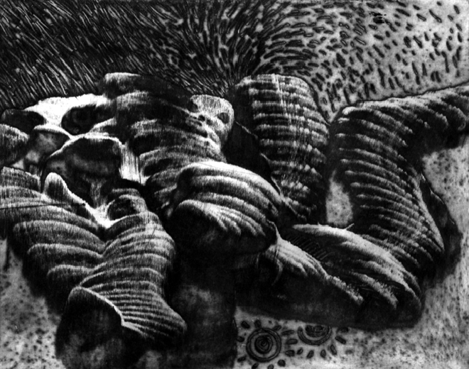
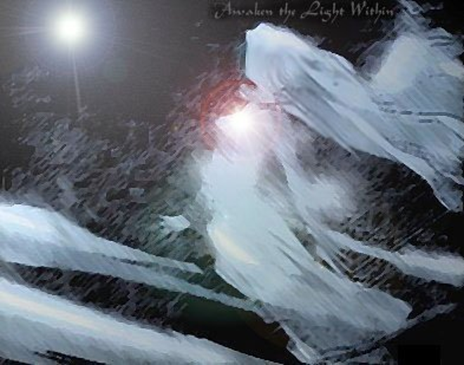
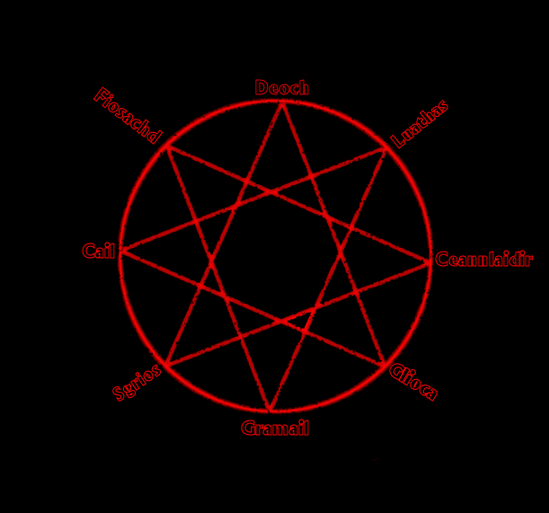
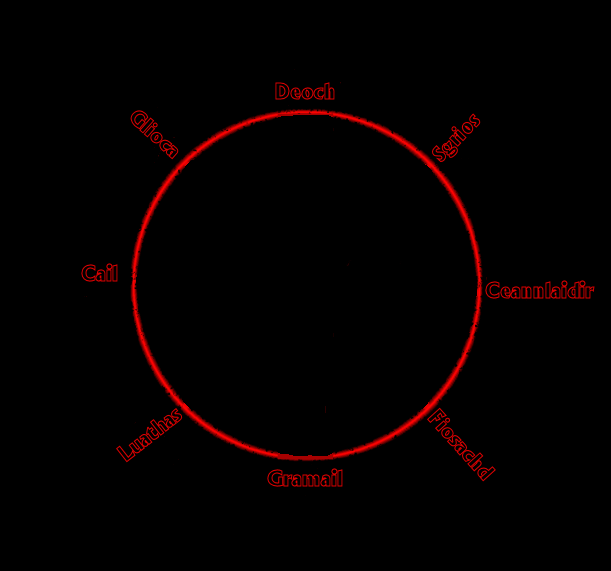
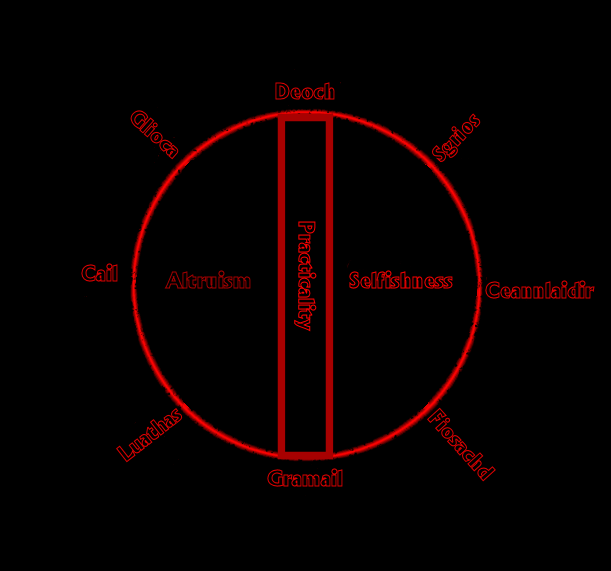
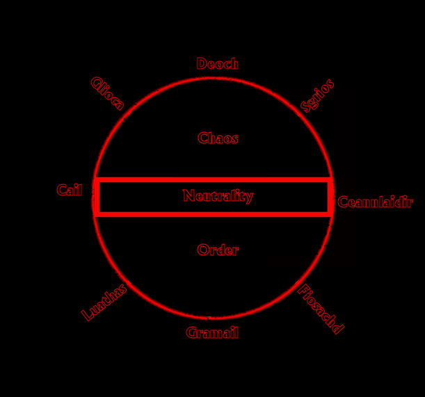
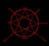

# Obscurum ac Luminarium: A Treatise on Theological Alignment

_by Angelique in_ ___Dark Ages___

 Darkness|Light
 --------|-------
 | 

## Gnosis

_Over the Grinneals, Danaans, and even Deochs, theology has played a major role in the formation of society.  The eternal struggle between the Light and the Darkness has seen the rise of great wars and the sinking of mighty cities.  The octagram, long held sacred by Aisling priests, remains somewhat of a mystery, with only the very surface of knowledge explored.  Herein, the depths of these mysteries will be found, and their secrets revealed._

---

Octagram|Figures
--------|-------
Figure 1: The Traditional Octagram|Figure 2: Theoretical Arrangement
[](images/ange_obscurum_octagram_traditional.png)|[](images/ange_obscurum_octagram_new.png)
Figure 3: Altruism against Selfishness|Figure 4: Order against Chaos
[](images/ange_obscurum_octagram_good_evil.png)|[](images/ange_obscurum_octagram_chaos_order_small.png)

---

## The Octagram

The default basis of training in any of Temuair's temples comes in the form of study of the Octagram (Figure 1).  As evidenced by previous Lore (Chloe), the Octagram is aligned in such a fashion that the alliances amongst Gods are clearly shown.  Herein priests learn of the virtue of the Trinity, worshipping both their patron deity as well as that deity's allies, spreading the truths and teachings across the lands.  It is also here, in the Octagram, that the presence of conflict in the form of enmity occurs, granting priests and acolytes the ability to desecrate holy relics of opposing deities to gain succor with their own.  Debate has oft been heard over whether the Gods are truly at war, or if such enmity exists in order to keep balance amongst the governing forces of our world.  As we will examine later, maintaining the delicate balance between the various oppositions in our world is key to our survival.  Tracing a path on the octagram, one can easily see the alliances between deities, formed by triangles.  When one draws a straight line bisecting the octagram, from one point to the point opposite on the circle, the "opposite" of the deity is discovered.  This theory is one which receives far less attention than those of alliances and enmities, but is perhaps more important for the understanding of Temuairan theology.

The Octagram, as studied by theologians, is arranged in a fashion which is not conducive to this treatise.  As such, a theoretical rearrangement of the Octagram (Figure 2) is presented, which rearranges the deities by association.  In this figure, allies are placed near one another, with deities of enmity placed directly across, and the triangulation removed, in order to more clearly analyze the relationships between the deities.  When arranged so, the commonalities shared by allied deities can be seen (Figures 3 and 4).


### Altruism against Selfishness

In the first division of the rearranged octagram, the primary axis of Practicality can be analyzed clearly.  A vertical line, placed directly in the center of the octagram, represents the lineage of the first of the great conflicts.  Altruism can be defined as giving without expectation, action without focus on personal gain, and acquisition without greed, and as such, is clearly represented by the Trinity of Nature (Aphrodite).  Each aspect of the Trinity displays a form of altruism.  In the realm of the Trinity Goddess (Aphrodite), we see above all generosity in the form of limitless compassion.  The Lady of Compassion gives freely to those who ask of her, and asks nothing in return, sharing her healing gifts with those most in need.   Cail, the Shaper, represents another form of altruism, that of action that is required.  The forces of nature cannot be contained by tears or pleas, but instead gently caress the lands as necessity dictates.  Even through raging forest fires, drought or flooding, Nature completes its cycle without heed to the wants of Aisling or Mundane.  In Luathas, Keeper of Knowledge, learning and wisdom is held sacred solely for its merit.  The enhancement of the self through the study of Gnosis is not done for purposes of conquest, but instead, as a means to share enlightenment with those less attuned to the divinity of Knowledge.

Across the line, lays a far less noble, but nonetheless necessary form of Practicality.  Here we see the satiation of desire through whatever means necessary, an attempt to quench the endless hunger, and the exertion of power solely for its own sake, as represented by the Trinity of Victory (Aphrodite).  Nothing more exemplifies selfishness than the never ending hunger of Sgrios, decay personified.   Labeled as evil by many, Sgrios represents a necessary part of the cycle.  Without decay and destruction, there can be no rebirth;  without hunger, for nourishment, power or even affection, there can be no satisfaction.  Ceannlaidir, Lord of Battle, shows us the virtue of glory and conquest.  Here, might is expressed solely because it can be, and to the victor goes all the spoils.  The need for excitement, even at the cost of others, can be seen daily in Aisling life, through political battles and even all out slaughter within the confines of the Arena.  Bloodlust and gore, all these things belong to the Warlord.  Through Fiosachd we see the epitome self-gratification, through the blessings of the Wanderer.  Herein is a God, once a mortal, who's wanderlust and thirst for adventure, treasure and fame lead him to deification.  How fitting that he now serves as patron of the exiled, giving his blessing to those who seek the unknown.

Each of the virtues of the six can be taken to extreme.  In Glioca, we run the risk of corruption, as the need for forgiveness can overcome the need for rationality and justice.  Luathas brings us to arrogance at extremes, the haughtiness of knowledge abused as power.  Those who follow the path of stone, under the watchful hand of Cail, all too often fall to the sweet whispers of wrath, meting out corrections against the artificial world without discrimination.  Even the selfish may fall from grace, for no Aisling is truly altruistic.  Those who fall to the wiles of Sgrios become the devoured themselves, their insides eaten up by gluttony.  Even Ceannlaidir himself was unable to resist the call of power and domination, where lust holds sway over discernment.  Those of Fiosachd perhaps have the most difficult path to follow, as the alluring song of greed can be heard, ever so quietly, even in his Temple.

It is through the blessing and guidance of Gramail and Deoch that Aislings and Mundanes alike may resist these siren calls, and that balance between a world of sloth through altruism, or hedonism through selfishness is maintained.  Neither altruism nor selfishness are inherently evil; it is the extremity of either which can lead to ruin.

### Order against Chaos

In the final division of the octagram, the forces of Law and Chaos continually wage against one another, each seeking to establish dominance over the other.  Here (Figure 4), when a horizontal line is placed, from Cail to Ceannlaidir, we see the division of Law and Chaos amongst the pantheon.  In the northern sphere, Chaos holds sway in the most aptly named Trinity of Chaos (Aphrodite), while in the south, cold and unfliching, the Trinity of Law (Aphrodite) rests.  Calculated, cool and collected, the Trinity of Order is headed by Gramail, the Lawgiver.  With rationality reigning supreme, there is no room for emotion or care when decisions are to be made.  Austere in environs, those who follow the Lawgiver work tirelessly to counter the efforts of Discord, in a manner that is most foreign to Aislings.  To his left sits Luathas, in the aspect of the great Librarian, tirelessly cataloguing the knowledge of both Man and God for use.  Mysteries of the arcane, rituals of power, all these fall under the strict and arranged methods of Luathas, through which the power of the divine can be channeled in the form of Magic.  To the right of Gramail sits Fiosachd, in the aspect of the Merchant.  Oaths and currency abound in this domain, as the accumulation and maintenance of wealth flourishes under watchful eyes.  Neatly kept records of transactions, totaling the wealth of lifetimes, represent the greatness of humanity in the form of coin.

Across this equator lies a world completely foreign, one of whimsy and spontaneity.  The Trinity of Chaos (Aphrodite), headed by Deoch the Spark, epitomizes life and all of its random wonderfulness.  It is through the blessing of Deoch that Aislings came to be, and creativity was let loose upon the world.  Artists, poets, drunkards and whores, all can be found under the arms of Deoch.  On the right of Deoch, sits Glioca, in the form of passion.  Here we see fervor for life, love, and all that can be offered, through the giving and taking of experiences.  The heat of a moment, the quiver of a lip, all these things belong to her, and the whimsy of such fantasies only await a chance encounter or brief encounter.  However, there is a darker side to the Trinity of Chaos.  To the right of Deoch sits Sgrios, in the aspect of Entropy.  Hatred, anger, frustration, and sadness all take roost in the deep recesses of the the soul, each a gift from the father of fear.  It is this motiviation, fear, that drives men to feats of great atrocity, without any apparent reason or sense to their actions.

Once again, the balance of forces can be seen in the octagram, through the influence of Neutrality, as represented by Cail and Ceannlaidir.  Both War and Nature touch on each aspect, and through this unity of opposition, discernment can arise.  Following the path of Order to strictly leads to the squelching of creativity and expression, in favor of logic overruling sense.  On the reverse, letting oneself be captured by flights of whim would lead to the undermining of society and the destruction of the very fabric which holds our world together.

### Light against Darkness

[](images/ange_obscurum_octagram_traditional_with.png)

Curiously enough, both Light and Darkness enter the Octogram through the influence of the Trinity of Chaos.  Our Lady of Light, Danaan, gave us her daughter Glioca, and through her love of Deoch, allowed the creation of the Aisling.  However, the Lord of Darkness, Chadul, was once served by Deoch, with Sgrios as his means of defeating mankind.  It is this reason that Gramail is called the weakest of all the Gods, for he is beset on both sides by Light and Dark.  Those of Glioca chide him for his lack of compassion, while those of Sgrios chafe under his rules and measures which stifle the decay of both the land and its people.  However, given the current state of indisposition held by both Danaan and Chadul through the Great Sacrifice, Gramail has been given more room in which to seek out his goals.

### Abstraction

As evidenced by this brief discourse on the theology of Temuair, it is apparent that this is but a mere drop in the pond of knowledge.  It is but the effort of this humble scholar to spark an interest in the deeper meaning of Temuairan theology, in the hopes that the Gods will once again be given their proper dues.  In these times, when Aislings have believed themselves to have outgrown the teachings of the Gods, it is most vital to record the teachings and traditions of the faiths, to save them for a time in the future when Aislingkind recognizes that they are indeed necessary.

_Angelique de Winter  
High Priestess of Gramail  
Knight of Temuair  
Scribed in the Fall of Deoch 58_

---

Works Cited

- Chloe, "[Reflections on the Interactions Between the Gods](http://www.darkages.com/community/phi/Chloe_Theology.html)"  
- Aphrodite, "[Sects of Temuairan Faith](http://www.angelfire.com/wizard2/angelique/aphrodite.html)"  
- Erenthar, "[Chadul: Darkness Lord](http://www.darkages.com/community/art/Erenthar_Chadul.gif)"  
- Katrionah, "[Awakening](http://www.darkages.com/community/art/Katrionah_Awakening.jpg)"  

***

```
*Librarian Notes*

This entry has been edited to conform to Library formatting.
The original can be found at http://loureslibrary.aisling-spark.de/phi/angelique_obscurum/Angelique.htm .
```
