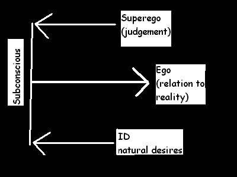

# Aisling Hunting Mentalities

_A study of aisling psychology_

# Introduction

It is a true thing most aislings hunt some point in their lives. But why do
aislings feel compelled to participate in this activity? I intended to study
and observe the most basic roots of aisling hunting mentalities and how they
relate to an aisling's overall psychology. I discovered one's psychology could
be described by three distinct,but conflicting entities.

# Three basic factors to an aisling's psychology

## Id

This consists of an aisling's most primitive urges and drives it has since
birth; including: hunger, thirst, comfort, and faerie love. This factor can be
deduced as a raw pleasure principle.

## Ego

As an aisling develops and matures in temuair, his or her _id_ grows to become
in synchronization with the circumstances of the real world. The _ego_ is
created to relate the desires of the _id_ with these circumstances. An example
could be an aisling whose greed temps him or her to steal the experience from
another's kill. The ego would identify the possibility of punishment, benefits,
and as well as morals.The ego could be deduced as the reality principle.

## Superego

Also, as an aisling grows, he or she adheres to the morals, values, ethics, and
judgments of a guide, mentor, and society itself. The superego is one's judge
of behavior, deeming what is good or bad, ethical or unethical. It can be
deduced as one's conscience.

# Summary of Principles

The _ego_ represents an aisling's actual day-to-day behavior in society, the
face on presents to the world of temuair. The _id_ and the _superego_ are
factors that influence the overall ego; the _id_ temps the ego toward
pleasurable urges, while the superego enforces judgments, advocating "correct"
behavior and ethics. These forces dueling in the subconscious, cause internal
conflicts.  

  

# How psychology principles relate to hunting mentalities

Through observation over many deoches, I could deduce where each principle fits
in with the three most basic hunting mentalities.

## Barbarians (id)

These aislings are dominated by a raw instinct that enjoys to slay other
beings. Barbarians usually take great pride and glory in combat victories.
While this mentality is generally associated with the warrior class, that is
not always the case, it has been known of even humble priests to fill with
vigor in war. Barbarians could be deduced as having the true hunting mentality
of Ceannlaidir.

## Status Seekers (ego)

They seek fame and attention of society through conquest to gain experience. An
aisling dominated by this hunting mentality hopes for fortune and to be
recognized in the higher ranks by his or her peers, this mentality in the most
raw form, could be associated with self desires, yet still civil to society.
Status Seekers could be deduced as having the true hunting mentality of
Fiosachd.

## Helpers (Superego)

These aislings are dominated by the hunting mentality to serve good. This spark
of kindness lies within all aislings as we continue our ongoing battle against
Chadul. Helpers hunt to force creatures of darkness to bay. This hunting
mentality could be deduced as the true mentality of Glioca.

# Conclusion

The Aisling’s will to hunt has persisted pass many deoches. For many of us, it
is a combination of the three most primitive hunting mentalities, however, in
some aislings one of the three dominates over the rest. In conclusion, these
three distinct components control the hunting mentalities of our aisling minds.

_Scribed and published for use of the Loures Library._

_Good fortunes of Fiosachd,_  
_Azov_

***

```
*Librarian Notes*

This entry has been edited to conform to Library formatting.
The original can be found at http://www.darkages.com/community/phi/Azov_Hunting.htm .
```
