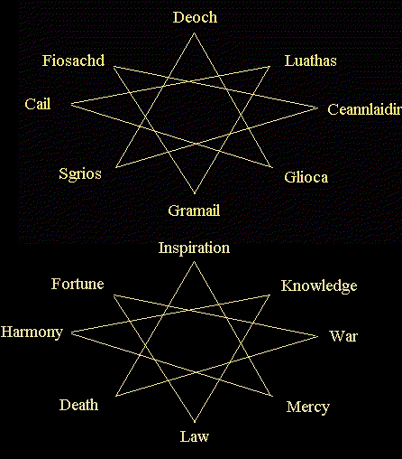

# Reflections on Interactions between the Gods

_by Chloe in **Dark Ages**_

As Aislings, many of us strive to understand our place within this world, as
well as how we can best serve the deities that help us in our struggle against
Chadul's realm. Yet as the shock of Danaan's sacrifice is still fresh, and our
own race new and unformed, understanding the depths of our inter-relatedness
with the world can be confusing. Our texts are fragmentary, the knowledge
scattered, and time is not on our side. To succeed in our struggles, a deep
understanding of our chosen paths and deities is necessary, but time for
reflection is not given to us : we must take what we can spare and hope for the
best. As I watch the Mundanes erect great temples to each deity, and Aislings
struggling to understand how best to harness what powers the gods consent to
grant them, it came upon me that the true philosophy of each god, as well as
humanity's own history of our interactions with them, is nowhere available.
Aislings are a pious lot, generally, but it can be difficult to be religious if
we do not understand what it is we worship!

I therefore have studied the documents I have access to that speak of the gods,
and have compiled general guidelines of each god's philosophy and place, as
well as some examples of how Aislings live with their deities.

Our Pantheon consists of the Light, the Dark, and those caught between :
humanity.

```
Danaan                            (From Mortality)         Chadul
(light herself)  (from fire)                           (darkness itself)
         |                |
     Glioca   ----   Ceannlaidir                           Sgrios
               |
              Cail
                                  <---------------         Deoch
Fiosachd          	                   Luathas
                                       Gramail
```

The two octagrams below contain much information useful to the curious Aisling.
They contain the natural affinities of each deity, their opposites, and gods to
which each deity clashes with as they attempt to resolve their purpose on
earth. The higher will be familiar, while the lower merely substitutes the
gods' names for their respective domains.

Each deity's polar force is opposite them on the diagram, but this does not
imply enmity, necessarily : merely contrast. The deities that flank each god
are those, which they strive with most commonly on a daily basis.



# Deoch: The Creative Spark

* Opposite : Gramail : The law of man. Creativity does not flourish in a land
  of rigidity.
* Enmities : Fiosachd, pure luck, and Luathas, divine knowledge. The chaos of
  pure luck leaves the creative impulse with a myriad of unfinished projects,
  while divine inspiration, dictated from above, leaves no room for the
  imagination to roam.
* Alliances: The creative spark interacts most explosively where the friction
  between death and love is strongest, for Deoch turned from the hatred of
  death when touched by his love for Danaan.
* Alignment : No particular path, but it is said that Aislings sprang from a
  vision or dream of Deoch's in the hope of justifying his love, Danaan's,
  sacrifice. Deoch's light shines brightest outside Suomi.

In Suomi, I chanced along a rogue who worships Deoch, and I asked him how he
follows this path. He explained that, in Suomi, Deoch is well known, for it was
through worshipping him that the smiths discovered how to harness the
properties of the emerald, which bestows a greatly increased constitution to
all who wears it. As this rogue diligently practiced his gem-cutting abilities,
we spoke of his path. He spoke this rhyme to me :

> _All who toil for love  
> Who once loved only the dark  
> Grasp the fire above  
> Pull from your spirit a spark  
> Close your eyes and you shall see  
> The vision of light which follows thee._  

# Glioca: Compassionate Love

* Opposite : Sgrios, Death. Love of life is forever against the hatred of
  Death.
* Enmities : Ceannlaidir, warfare, and Gramail, human law. Ceannlaidir entirely
  lacks Glioca's capacity for mercy, and causes the suffering of all, and
  Gramail's search for only justice also denies the capacity to forgive or show
  mercy.
* Alliances : Compassion flourishes when surrounded by Cail's natural strength,
  and Deoch's love for her mother, as well as his zest for sparking life, draws
  Glioca.
* Alignment : Patron guide of Priests, her temple resides just outside Mileth,
  where all who are weary of the battle with the dark can come for renewed
  strength and aid.

Glioca is our light in the darkness, the moon we follow on the darkest of
nights. Her followers, the kindest and most merciful of the pantheon, are
strangely often the least gifted at explaining their path to another. Hate is
something they simply cannot understand, and so meet it with only compassion
and care. Even those you would most think opposed them, such as the strictest
lawgiver or the most bloodthirsty warlord, meet only shock or pity from
Glioca's worshippers, for they cannot fathom how one could neglect to see the
beauty of the life which fills everything. If you ask them to say why they act
as they do, they will only smile, or perhaps hum a tune, before going on their
way to engage in their never-ending struggle to save all from Sgrios' cruel
grip. They are not innocents, for they see the dark, they are simply mirrors,
which reflect the light and so outshine the dark.

# Cail: Nature

* Opposite : Ceannlaidir, Warfare. Human strategies to wipe out life using
  artificial means have no place in the natural scheme of Cail.
* Enmities : Sgrios, death, and Fiosachd, pure luck. Nature is continually
  healing itself from Sgrios' attempts to destroy or control it, and Fiosachd's
  haphazard games have no place in Cail's well-ordered realm.
* Alliances : Cail combines the pure form of divine inspiration, in nature's
  design, with Glioca's gift of compassion, in nature's quiet balance of
  justice towards itself.
* Alignment : Patron guide of Monks, his temple holds sway outside Undine, the
  natural city who first gave birth to the union of nature and fighting.

> _Deep within a wooded glen  
> Train a race of quiet men.  
> Moss to keep the movements quick,  
> Chants within to cure the sick.  
> Know the order of all things,  
> Peace of mind the vision brings.  
> Strength within turns night to day,  
> Will without shall find the way._  

\- Overheard at a Mass of Cail

# Luathas: Divine Knowledge

  * Opposite : Fiosachd, Pure luck. Heavenly inspiration, and its use, has no
    place for chance.
  * Enmities : Deoch, the creative spark, and Ceannlaidir, warfare. You do not
    embrace fancy when dealing with deities, and study or meditation is
    impossible in times of war, which is the victory of might, not mind.
  * Alliances : Luathas combines the natural depths of Cail with the tempering,
    grounding effects of Gramail.
  * Alignment : Patron guide of Wizards, his temple is located outside of
    Rucesion, whose scholars first discovered the element of light.

As I sought to learn the ways of this god, I chanced upon a wizard, bent with
long hours of research. I inquired of him, but he merely handed me a blue
powder, and went back to his desk. I gently sniffed the powder, wondering what
secrets it contained, and my senses were immediately assaulted with a whirl of
sensations. Deep seas, cold winds, burning fires, and suffocating earth
surrounded me. I realized, just before losing consciousness, that when the
elements are combined heedlessly utter destruction is the only result. With
this insight, the onslaught subsided, leaving only a vision of a paradise, now
submerged, which I realized was the remains of Hy-brasyl. Opening my eyes, I
found that no time had passed, yet aeons had to me, and as I gazed at the
scholars, I sensed what they sought : balance with ultimate control.

# Gramail: Law and Justice

  * Opposite : Deoch, the Creative Spark. Facts are not imagined or created.
  * Enmities : Glioca, compassionate love, and Sgrios, death. Showing too much
    mercy will defeat justice, as will too much hate, and human law has no
    power over death.
  * Alliances : Justice, when dealt quickly, is most effective and chance
    breakthroughs can reveal truth, as can divine inspiration : therefore,
    Gramail is friendly with both Fiosachd and Luathas.
  * Alignment : No particular path, as he serves all humanity. His worshippers
    reside outside Loures, the seat of government and law for all Temuair.

Gramail's temple is not filled with fevered prayer or emotional offerings. His
worshippers instead choose to show it through continual actions that forward
the cause of justice, even-mindedness, and the balance of all things. They are
an even-tempered lot, who will calmly discourse to you for hours on the
politics of a particular region or the intricacies of the balance between
nature and man. They do not look to other gods for inspiration or affection,
following only Gramail, for they see only his advice as neutral and reliable.
Gramail's devotees toil to maintain peace so that Aislings may most effectively
counter the chaotic effects of the darkness.

# Fiosachd: Wealth, Luck

* Opposite : Luathas, Divine Knowledge. The followers of Luathas are slow,
steady, and reliant on the gods for their well-being, while Fiosachd prefers to
take hasty chances and trust in the unsure.
* Enmities : Deoch, creative spark, and Cail, natural power. Deoch's creations
have little apparent material use to Fiosachd, so he dislikes them, and Cail's
ability to control seeming chaos and his dislike of man-made things frustrates
both Fiosachd's wish to beat fate and his art in using all tools available to
do so.
* Alliances : The wars of Ceannlaidir are a great boon to Fiosachd's treasure
hunting tendencies, and the world of Gramail's law both dares Fiosachd's luck
to new heights, as well as providing loopholes to encourage his activities.
* Alignment : Patron guide of Rogues, his is a free-spirited worship, and his
friendship with merchants and trade endear his followers to the port of Abel.

Fiosachd combines most of the gods' talents and has a natural quickness and
affinity for the untamed world, at least as far as he finds it useful for his
purposes. He is close to mankind as well, using humanity's talents to seek
greater treasure, adventure, and perhaps most of all, wealth. He loves nature
as long as it benefits him personally, and he loves humanity as long as we give
him new challenges and new conquests. He delights in the art of the chase and
the dash, excelling in discovering hidden mysteries, exploiting weaknesses, and
trapping all who oppose him with their own weapons. He is not evil, for he
despises anything that seeks to control him or destroy what he considers
valuable, yet his delight in trickery and illusion has separated him from the
pure forces of the light. He is perhaps the most "human" of all the gods.

# Ceannlaidir: The Art of War

* Opposite : Cail, the Natural. Successful wars depend on planning and weapons,
  not the unharnessed powers of the earth.
* Enmities : Luathas, divine knowledge, and Glioca, pure compassion. War has
  nothing to do with either scholars or lovers.
* Alliances: For success in war, Ceannlaidir enlists Fiosachd's quickness and
  natural luck as well as Sgrios' appetite for destruction.
* Alignment : Patron guide of Warriors, his temple is found outside Piet, whose
  strength and close proximity to Loures makes it an ideal headquarters.

Ceannlaidir's followers are most easily found wherever Sgrios is closest to
earth. They are not easy of speech, for they speak from the body, not the mind.
Their strategy concerns physical might, and the minds, which control it, as
well as the artistry of weapons, humanity's most enduring talent. To understand
them, you must fight alongside them, or with them. They do not kill for the
purpose of death, as Sgrios does, nor do they delight in the quibbles over
ideals. They act for the sake of action, the delight in life and their
manipulation of it, for tempting death is also a way of celebrating life.

# Sgrios: Death and Destruction

* Opposite : Glioca : Compassionate Love. Death has no use for it.
* Enmities : Gramail, human law, and Cail, the power of nature. Nature has long
  cultivated ways to defeat death and heal from Sgrios' wounds, and Gramail's
  attempts to decide who should die and how foil Sgrios' attempt to control
  all.
* Alliances : Deoch, as he was once an ally of Sgrios, remains so, for after
  all the Aislings that Deoch created often come within his grip. Also,
  Ceannlaidir's wars are a great donator to Sgrios' ever-hungry jaws.
* Alignment : None, he is the enemy of all living. His worshippers linger
  somewhere dark, and conceal the location from prying eyes.

No Aisling may long think on the subject of Sgrios before either being repulsed
in both body and spirit or enraptured to his service. His temples are
deceptive, dark, strange, and twisted, like his own designs, for Sgrios is no
simple god : his ways of luring mankind to his realm are nearly infinite, and
as complex as are the veins of the earth. His followers write no literature,
master no arts, or erect useless statues. All their efforts are directed
towards creating traps for the living and unwary, strengthening Sgrios' grip,
or currying his favor so that their own power over the living will increase.
Yet he is not the end, for Aislings escape him every day, albeit not unscathed.
The battle for souls continues.

_Composed by Chloe, Priestess of Mileth_

***

```
*Librarian Notes*

This work is considered one of the greatest treasures of Temuair.

This entry has been edited to conform to Library formatting.
The original can be found at http://www.darkages.com/community/phi/Chloe_Theology.html .
```
