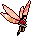
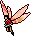

# An Aisling's Guide to Faeries

_by Cliona Malkier, in **Dark Ages**_

 

In Temuair, mention of the fae is likely to bring but one thing to mind: The
Tuatha. Of course, some will argue that we ourselves are the Tuatha, but such
is not the case. We are the ancestors of the Tuatha, children of the union of
the corporeal and the mundane. The Timeline, that venerable and ancient fresco
so lovingly painted upon the walls of the most ancient libraries of Loures,
tells of mundanes in Temuair long before the Tuatha
appeared.

It was the Tuatha who brought with them the love of the goddess Danaan, and
their masterful elemental magic. This enlightened the mundanes and led to their
becoming the great civilization of Hy-brasyl, while the Tuatha happily carried
on in the land of Finach, now modern day Mileth. Following the beginning of
Danaan dating, little is said of the Tuatha, but it is then that their history
begins, a rich tapestry of song and dance, of ancient scrolls in their unique
languages, of beautifully sewn rugs and the explosion of faery culture. In
their wisdom, they saw the slow turn that Hy-Brasyl was taking to their own
destruction, and the oral tradition of the fae speaks of their
turning to the ground for refuge.

They made their homes beneath the burghs and whatever small and grassy bits of
land they felt comfortable. It was there that they hid when the darkness came,
and the water rushed over the lands, drowning the foolish Hy- brasyl. There
they lived for close to three hundred years, coming out once again in the year
Danaan 1815, returning the wise to the worship of the goddess, only to once
more slip away, out of the realm of darkness. But, like all cultures, the
Tuatha were not without their rebels, and fae slipped out, to breed and to
learn, some to even turn to darkness in those trying times. It
is from the Tuatha that all fae come, to populate Temuair with their magick.

There are many different types of fae populating today's Temuair. There are
good fae, such as the seasonal faeries known only as the Fae, and there are bad
fae, like the demonic and perverted Succubi. We are driven to some fae, and
pushed away by others. Temuair swarms with them, both visible and unseen. The
fae make their home in the plane known as Dùthaich de Sidhe, the fairy land.
This land lies across two worlds, with one foot in the solid world of Temuair,
the mundane world, and with the other in the world of magick, that venerable
land where all the knowledge of Hy-Brasyl lives on in all its glory. That is
the same place we tap into whenever we make an invocation and cast a spell, it
is there from which we draw our mana, our magickal energy. It is in
this land that the fae make their home.

Because of this, the fae can, like us, work their own magick (as so aptly
demonstrated by the destructive powers of Succubi). They can work to help, to
harm, or, in most cases, to make mischief.

The most widely recognized bit of fae magick is the Tuatha's beothaich deum,
more commonly called Red Potions, or, "reds". The potions are mixed in the
faery glades within the Enchanted Woodlands, in an age-old ritualized mixing of
the two blessed Ardmagh berries, cherries and grapes. The glades where they are
mixed are said to be the sites of the faery revels, where the fae dance in the
moonlight, waiting for the early dawn, where their footsteps paint the dew upon
the flowers. The mixing of this crimson elixir is said to be the direct recipe
of Danaan herself, giving Aislings one last chance to escape the realm of
Chadul, who no faery ever, in the history of time, has
ever served.

At times, though, the faeries work for their own agenda, which may prove
harmful to us, whether the Little People realize it or not. Many stories passed
through my home of mundane children being stolen from their beds and replaced
by changelings, the sickly children of the fae. While most believe the child is
better off in the magick land of the fae, the loss of a child is never easy,
and my family has even lost a child to this age-old practice. Fortunately,
though, in recent ages, since the spark of Deoch reached us all, reports of
these changelings has dramatically decreased for the first time in aeons, as
more and more children are born with the flame of Deoch burning bright inside
of them. Instead of hearing the heartbreaking tales of children waking
glassy-eyed and unresponsive, we hear of mothers finding their children playing
with licks of flame or balls of light, things which they have created for
themselves with the magick flowing through our veins. And, if you ever have a
chance, watch a child at play in nature. See them talking to that which
you can not see? I have no doubt it is the fae they speak with.

Benevolent faeries surround us every day, making their presence known in wee
ways, from a rumpled blanket, a sweet scent without explanation, or a bag of
food gone from the table. Many Aislings take the presence of these fae to be a
sign of light blessing their home, and lure these fae to take up residence with
bits of bread, wine, butter, or milk set out specifically for these folk. One
can also place small bundles of twigs from the sacred trees, ash, elm, and
elder, and place them throughout the home. The fae also love the smell of apple
candles, but do not let the wick burn long, for fae loath the presence of smoke
(I'm told that it make their wings heavy). Also, be sure that, when you put up
your bundles of sticks, do not put the ash, elm, and elder together, for that
is considered a fae insult, undermining the power that each holds on its own.
Also, wizards take note that the fae are elemental creatures, also, so do your
best to ally with those of your own or an allying element.

The fae of Temuair live in three very distinct areas. Of course as individuals
they are known to stray, just as we all do, but generally, the races keep to
one of the triad, Mileth, Undine, and the Isle of Man, across the sea from
Loures. I have researched and tried to make contact with nearly every types of
fae living, and made many interesting discoveries about their culture. In
recent ages, almost all of these fae reside solely on the plane of magick a
world almost physically identical to ours, only on rare occasions, and usually
without their knowledge, appearing to Aislings. Priests, due to their constant
interactions with their fae teachers and the wielding of Danaan's Light in
magick, are most likely to see them, but the faeries themselves do not
discriminate. I have made these discoveries mostly through the act of Dreaming,
an ancient faery art taught to me by the tribes outside of Undine, but that is
something different altogether.

Remember, always, in your dealings with the fae, that they are individuals much
like yourself, so please be respectful.

_Cliona Malkier al' Fae_  
_Spiorad Acair_

## Mileth

_The oldest land in Temuair, the first populated, and the home of the Tuatha who landed on their journeys from the north._

### The Tuatha

The quintessential faeries, from whom all fae derive, are the Tuatha de Danaan.
They led to the enlightenment of Hy-Brasyl, and in their wisdom escaped the
same fate by hiding beneath the burghs of Finach, later named Mileth. They are
the fae who come to the call of summoning Gliocans, and are the first
worshippers of the goddess Danaan, also known as Danu in their faery tongue.
They are benevolent towards Aislings and mundane alike, but will fight
dubhaimid if they come in contact with them. They possess equal strength in all
elements, but are partial to light and athar, through which they flit on
gossamer wings. They can be called upon at any time by a Glioca worshipper, and
will gladly help any Aisling who beseeches their assistance.

### The Beansidhe

Also known as the Banshee, the Beansidhe (translated as "Woman Faery"), of
which there is only one, is well known throughout northern Temuair for her
tormented cries. It is said that her scream foretells the final death of an
Aisling or mundane. She has been sighted as a woman veiled in black, who treads
on bare feet through the river woods north of Riona's inn. Her element is
unknown, and she is a shy and otherwise silent woman.

### Brownies

These benevolent faeries are perhaps more elves than anything else. They appear
as little men in gaily colored suits who happily take upon themselves the task
of adopting a house or cottage, and seeing that it is well cared for. They will
also chase away evil fae who seek to come down upon your house. They are creag
elementals, and seek to return the earth of the land back to whence it came,
even if it means sweeping up. Legend says that these nocturnal creatures are
called to bed by roosters, who some arrogantly believe crow only for the
purpose of waking every Aisling in the village out of a sound sleep. *winks*

### Buachailleen

These mischievous little male faeries are well known among all sheep herding
families. They take delight in frightening the herds by waving their little red
caps and playing pranks, like leaving gates unlatched and smearing mud across
the sheep's coats the day before they are to be sheared. As the daughter of a
shepherd, I myself have seen these little men running about at night for ages.
The best method to keep them away is to hang iron bells around the necks of the
sheep, not only for their protection (for all fae are known to dislike metals),
but also so that, should the Buachailleen get to them and unlock the gates,
they are easily found. Fortunately, as creag elementals, they will show up
during a bad storm, but by then the sheep are sopping wet, so it doesn't matter
anyway.

### Dinnshenchas

These small fae work in the service of Aine, their patron faery-goddess, in the
service of women and cattle. They are said to guide the cloven hooves of cattle
away from molehills and thorn bushes, and ease the newborn calf's muzzle to
their mother's teat. They guard women in the name of their goddess Aine, who
was raped by an angry ancient mundane king, seeking to prevent another such
occurrence. They burn with anger towards those who might harm a woman, and are
of the element of srad.

### Dryads

Have you ever laid in the grasses at night, watching the stars through the
leafy treetops, only to find yourself watching soft yellow lights as they pass
amongst the branches? If you have, you have probably seen the Dryads at play.
These small faeries are rarely seen as more than dancing spheres of light, and
thy are particularly fond of the highest willow boughs. These female fae are
keepers of the secret tree magick, as they call it, where it is said that they
can alight upon the ground and there a tree will grow. Ancient legends tell
that it was they who created the huge eastern woodlands which lie not far from
Mileth's borders. They are also often heard singing their odes to the trees and
some say that their breathy songs are the origination of the winds, and that it
is they who channel athar into fresh air.

### Flower Faeries

These tiny, winged spring faeries live among the flowers of the faery glade,
and are, unlike most other types of fae, totally disinterested in the acts of
humans. Though they have often mimicked the Aisling dances and weddings, they
are content to flit about on currents of athar and ride on the backs of
honeybees from flower to flower. They come out in the spring in order to aid
the spring goddesses in their creation of new life. They, like the Dryads, are
fond of song, as well as white stalks of betony, drawn by their sweet smell.
They've also been seen among the Mukhul civilization at the center of their
Sevti glades, though there they go by the name of Pillywiggins.

### Gianes

These pleasant wood elves are known for their masterful weaving skills, though
they weave only for the pure enjoyment of it. They are earthbound creag elves,
known only by their old manners of dress and the spinning wheels they keep in
their pockets. They are masters of divination, and protectors of the wool
stocks, so often known to catch afire in the dry summer season. Despite their
benevolence, however, they will not hide the truth to their divinations, which
may often come across as harsh and frightening. They are found often in
enchanted woodlands, weaving both cloth and potent spells of earth.

### Nymphs

These tiny fae are known for one thing and one thing only: their sexuality.
These small fae have long been known for their feminine wiles, often seducing
wizards and witches for their own gain. There are many different kinds of
nymphs, such as wood nymphs and water nymphs, sea nymphs, and tree nymphs. They
may be of any element. In the ancient ages, before the ways of fae were fully
understood by mundanes, men were plagued by these fae almost to the point of
exhaustion. Many a faithful husband was scorned when his wife accused him of
infidelity, when in reality he was simply plagued by these randy nymphs. It is
common practice in modern times to repel these gossamer beings with a trio of
bells on the back of the bedroom door of any male who has come of age. In
addition, in the case of married couples, a small bottle of ash (an empty herb
bottle will do fine) placed upon the windowsill closest to the husband's bed
will keep any daring nymph from encroaching a wife's territory.

### Pixies

These small, pointy-eared fae are notoriously carousing folk, often rejoicing
for days the mere pleasure of existence and the return of spring flowers. These
are most notably the fae who bless the proclamations of fae love. They peek out
from beneath the flowers while Aislings are present, anxious to return to their
delightful Pixie Faires. These fae are very natural folk, with only toadstool
caps and the petals of blooming flowers to cover them. Ancient tales tell of
pixie dust, the silver-gold dust that remains where they have been celebrating.
It has been decided that this is their joyous confetti, thrown about during
their revelry. They are of the element of athar, which they ride on
translucent, almost dragonfly-like wings.

### Sylvans

Sylvan is the common name for the tiny faery horses kept by almost all
different types of earthbound fae. There are Sylvan Nymphs and Sylvan Tuatha
and Sylvan Pixies. Some are winged, like their masters, but most are miniature
versions of common Temuairan horses. They have no element, but have been
sighted in most every color of the rainbow, but are usually white. It has been
said by some that they are able to sing as well as their faery masters, and
tales speak of young men lured into the woods by their song, only to be found
days later, gibbering with madness over their mistake.

### Will o' the Wisp

These commonly hunted creatures have never been fully explained by faery
scholars, and the fae themselves are stumped by their existence. It is unknown
whether they are fae themselves or the lights of fae travelers too small to be
seen, or even, when seen from a distance, to be the lights of Pixie Faires.
Currently, their nature is unclear, but their element is srad, for at times
they can be seen as a great lick of flame, if not the commonly seen sparkle.

From this basic crop of fae, all other spawned. The faeries of Mileth are the
oldest and most clearly recognized races.

## Undine

_So densely populated that even its name is that of the first fae inhabitants._


### Undines

These playful water-borne fae are indigenous only to the many rivers and lakes
of Undine. They are very magical, stoic creatures, with small stature and a
strange appearance. They look as if the seahorses of the inner bays of Temuair,
with small almost human faces. Legends tell that for each Aisling and mundane
there lives one Undine with the same face, but that if you meet this creature,
you both shall perish. They are of course of the element of sal.

### Gwragedd Annwn

These fae are distinctive because of their large size. They are lovely blonde
women who prefer to keep to the water, coming out only by the moonlight for
their dancing revels. Human-sized, many a man has fawned over one of these
women, only to learn later that they are, in fact, of the other realm. The
oldest known group of fae in Undine, they are related directly to the Tuatha
and will mate only with humans they find to be of pure Tuathic blood. These fae
are the patrons of mothers, children, and the poor, but, while generous with
their favors, they lack something in the human realms of intelligence, being
able to count only up until the number of five. They are, as all water fae, of
sal.

### Ashrays

These fae are known from all other water fae by their white, almost translucent
skin. Men and women no older than perhaps twenty deochs, they are believed to
be descendants of the Gwragedd Annwn who mated beyond the Tuathic blood, and
banished into the sea, which they can, under no circumstances, leave. Their
revels take place just under the water on the night of the full moon, and
legend tells that it is not the reflections of the clouds, but the swimming
bodies of the Ashrays which flit just under the water's surface on this night.

### Bunyips

While still of sal, these fae do not keep completely to the water, but,
instead, prefer to make their home in the swamps and marshes at the sea's edge,
far to the west. These fae are thought to look like the Kardis of the Mileth
Crypts, but are rarely seen. They are said to bark at the presence of
intruders, then immediately escape beneath the reeds and ferns. They are
excellent craftspeople, and it is said that they are the first to design the
leather bracer, but, since the introduction of Loures soldiers into Undine's
territories, they have made themselves hidden, taking the ancient craft with
them. These fae love to help, and are known to make themselves present at the
monk training not far from their home. They also love to catch fish, and many
lost Aislings owe their lives to these fae.

### Drakes

Little is known about these fae, as they have never been seen, but, they are
known to be benevolent, and will bless a home and hearth, keeping precious
firewood dry through the long winter months. These fae do not stray from the
wood's edge, and prefer not to be near the prolific watersheds. These fae are
known only by their foul stench, but most matrons believe that the service and
company they provide is worth that minor inconvenience.

### Heather Pixies

These fae are the same as the previously mentioned pixies, however, instead of
keeping to the woodlands, they prefer the open fields of heather than can be
found in the West of Temuair. They are said to enjoy spinning flax, and
flitting through athar on wings of gold.

### Limniades

Very little is known about these fae. They are of srad, and their orbs of color
are often seen passing over fields at twilight. Some say they are Dryads who
have 'fallen' and wander now near the ground, unable to make their way back
into the treetops.

### Moss People

These athar fae are distinctive because of their beautifully colored butterfly
wings, but they are hard to spot, for as the Deochs progress, they learn more
and more that they are better off hiding from humans or, more specifically, the
Loures soldiers who patrol Undine's streets. These men of Loures, unaccustomed
to the ways of faeries, often used to slash at these folk with their swords,
sometimes harming their delicate wings and contributing, inevitably, to their
demise, in fact, the near extinction of their race. These days, the Moss People
hide in the swamps among the moss and lichens, however, on rare occassions,
they will venture out to the home of a trusted resident farmer and ask to
borrow, of all things, a farming tool or two. They have not yet forgotten to
bring one back, and whenever they do, it is carefully kept, cleaned, oiled, and
placed upon a bed of moss which was not there when night fell.

### Well Spirits

These fae live in the many wells of Undine, often taking shape of Aislings
whose bodies they admire. They are intensely beautiful, but dangerous. They are
not belligerent, but if you allow one to embrace you, it is said that they will
take you down into the well to make you one of their own. Many stories
circulate Undine telling of "Owen's boy" or "Catriona's girl" being taken to
live in these wells. (though it is more likely that, in truth, they ran off
together) It is to these spirits that one calls upon when tossing a coin into
the well for luck. They will very generously serve an Aisling calling out in
need for them, but their prices are high, and bartering with these fae is
advised against by native monks.

## Isle of Man

_Home to the dark fae._

### Sleigh Beggy

These faeries, much like Mileth's Tuatha and the Gwragedd Annwn, are thought to
be the first inhabitants of the Isle of Man. These small earthbound fae prefer
to go nude, and hop about of crow's feet, leaving very distinct footprints.
Hating artificial light, they stay out of the town of Rucesion, but swarm
between the town and the Castle Dubhaimid. They are known for their strange
habits, and hate the taste of salt and any presence of ash. It is said that
after Hy-Brasyl burned, they sought refuge on the Isle of Man, for no other
reason than to avoid the ashes which rained upon the whole of Temuair. They are
quite easily brought to anger, though no legend tells of what an angered
"Beggy" (as the Rucesion citizens call them) will do. Also, they are partial to
snow, and might even enter the city if it means a chance to frolic in some
wayward snowflakes.

### Bocan

Only two things are known about these fae. They are of athar, and their only
purpose is to attack and mutilate travelers making their way through the Isle
from Rucesion to Dubhaim. Protection is hard to come by, but it is best to take
all proper precautions, with ashes and metal upon your person at all times. Of
course when traveling that way it is best to carry a sword, for who knows what
undesirables lurk there, so close to Sgrios' lair.

### Devas

These faeries are related closely to the Tuatha and Dryads, perhaps more so
than any other race of fae living on the Isle. They can be of any element, and
are visible only as bright spheres of light. They are playful and are extremely
fond of nature, constantly seeking to immerse themselves in natural
surroundings. They can be found closer to Rucesion, the home of elemental
magick, which they are heavily credited for aiding in the discovery of, and
swarm at night in the small islands of nature which rise up from the tiles,
most notably near the docks.

### Fae

These nature faeries are the patrons of the four seasons. It is said that they
assist the earth in changing throughout the seasons, by dancing to raise energy
for newly budding flowers in spring, or gently shaking the leaves off the
shedding trees in fall. They are very capricious and do not trouble themselves
with humans very often, but they will not willingly avoid human contact while
going about their business.

### Gancanagh

There is only one of him, and he is not a nice fellow. This faery is akin to
the Incubus, it seems, but without the inertia to "go all the way", so to
speak. He is a handsome man known for always carrying (but never smoking), and
old-style clay pipe. He likes to seduce women and then to disappear, leaving
them to pine forever away for him. Some "modern" Aislings wonder if this isn't
simply the archetype for the average wandering drifter, as he hasn't been seen
since the opening of Rucesion for citizens.

### Sea Water Guardians

The Sea Water Guardians are thought to be Undines who made their way to the
open sea. With blue-green auras surrounding them, the sail upon the stormy sea
in eggshells, playing with the dolphins and healing ailing fish with their
skill in sal. Long ago, many Loures sailors refuse to sail to the Isle for all
of the faeries in the water.

### Leanansidhe

There is only on Leanansidhe. She lives in the castle Dubhaim, but is not
dubhaimid herself. A poet, she gives inspiration to other poets, but her price
is high: death or captivity in her kingdom. She sucks the blood of those she
assists, but rather than drink it, she gathers it in a huge black cauldron
which is said to be the source of her great beauty and literary inspiration.
However, it is said that she will be unable to gain power over you if you pray
for protection from one of the lesser gods of the sea. She is of the element of
sal, perhaps tying her to the water which feeds one's blood.

### Succubi and Incubi

Before they became the bedfellows of Sgrios, Succubi were a faery form, joined
by Incubi, their male counterpart. Of air, these fiendish creatures see humans
as being here only for their sexual amusement. They come upon those in sleep,
having sexual relations with them in the night. Unfortunately, there is no
longer any way to repel a Succubus now that they've made their deadly pact with
Sgrios, but an Incubus can be kept away by keeping a peony flower near your
bed.

### Water Leaper

Appearing more as bats skipping across the surface of the water off the Isle,
Water Leapers look for sailors whom they wish to lure into joining them. They
are quite vicious and prone to murder, for as they lure these sailors into the
sea, they almost immediately drown them.

## Miscellaneous

### Clurichauns - Loures/Piet

Only one of these wine-guarding fae will take up residence in your house at a
time. These elven fellows are the self-appointed guardians of a wine cellar.
Almost always intoxicated, but always impeccably well groomed and courteous, if
aloof, he will chase away all who seek to drink uninvited by the master of the
house. If he is neglected, he will wreak havoc and spoil your wine stock, but
if he is welcome, he will be there to stay.

### The Seelie Court

These faeries travel all over Temuair. They are said to appear as a benevolent
cloud of the most heroic and beautiful faeries in the land as they ride over
the earth looking for good to do. They are called the Court because they
additionally work to settle disputes among other faery troops. It is said that
their Queen removed a curse from a man destined to live the remainder of his
life appearing as a hobgoblin. When not searching for good to do, some stories
place them underground in a great court, with jesters, feasts, and the like.

### The Unseelie Court - Spriggans

In an unexpected show of complete opposites, so rare in the fairy world, the
Unseelie Court is the antithesis of the Seelie. They are said to present
themselves as a dark cloud of malevolence passing over Temuair. Members of the
Seelie who fell from grace. Their unnerving howls and cackles are heard as they
seek to enslave those who could become one of them. They are aided in their
travels by Spriggans, bodyguards who blight crops and commit theft. They are
quite greedy, but despise humans who display the same quality. There is also,
of course, the Unseelie Court, an Aisling founded on the ideals of working in
the name of these evil fae, thieving and wreaking havoc upon all who wander
past.

***

```
*Librarian Notes*

This work is considered one of the greatest treasures of Temuair.

This entry has been heavily edited to conform to Library formatting.
The original can be found at http://www.darkages.com/community/phi/Cliona_Fae .
```
