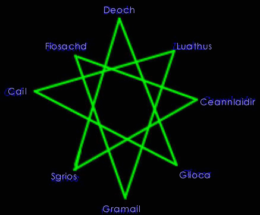
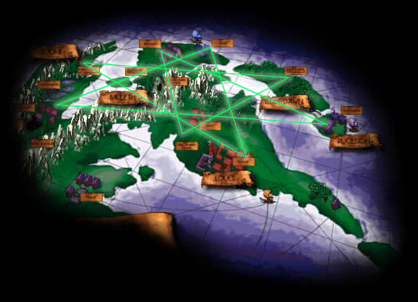
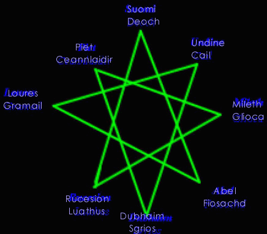

# The Holy Star

_The Fall and Restoration of the Temuairan Shrines_  
_By Dartanian Lestor in **Dark Ages**_  

## Introduction

In the age when gods used men as mere pawns, there was, nevertheless, a strong
attachment and respect for those beings given more vision and power than mere
mortals. I gather there always will be a deep respect for them. Gods do change
over time though as does man. People always interpret the messages of their
gods differently, and thus conflict and religious wars begin over petty
incidents that no one remembers how they had begun. The enmity men hold in
their hearts becomes a tradition. It was the same when these temples and
shrines were first created. It happened at, what I like to call, "The Great
Rift." That is rather to say, when Deoch fell in love with Danaan in Danaan
3113..

## The Great Rift

Now one would not normally attribute a name such as "The Great Rift" to the
joining of two hearts, but in truth it caused much more turmoil than the gods
had imagined they could. Followers of Deoch felt betrayed. They were sickened
that their beloved debauchery could turn to the light. Followers of Glioca were
shocked and suspicious, as Glioca was as Danaan's right hand and closely tied
to her. They could not believe that a follower of Chadul could change heart so
easily. They did not think one of Chadul even had a heart. Followers of Sgrios
had murder fill their eyes, as not only did Deoch now threaten to shake the
balance towards the light, but they felt Deoch was like their brethren, a
fellow servant of Chadul. They felt hatred towards Glioca and Danaan as well
for they felt that Danaan had seduced the old debaucher, not that he chose
Danaan willingly. Followers of Ceannlaidir, who loved the war that was already
occurring and thirsted for more, spurned on the three groups into conflict. A
fatal flaw as it turned out.

The old followers of the Deoch church actively went out in inquisition, burning
and torturing any they felt were heretics and blasphemers to their cause by
supporting the new Deoch. The Gliocan church too was torn asunder by those who
would accept the new follower of light and those that believed Deoch too
sinister to turn. Then Sgrios spurned on destruction. A massive hailstorm
filled the sky and tore down both the temple of Glioca and Deoch. Something
snapped in all the groups at that point, and a massive sweep "purged" the land.
Now listening to Sgrios's theory, Gliocans found themselves thinking the
opposite: that Deoch seduced Danaan. Spurned by the memory of seduction, their
thoughts turned to Ceannlaidir who seduced Glioca. The temple was torn.
Deochians now thought that Deoch had learned of something, and knowledge was
evil. Thus the Luathans became involved.

The guards were overwhelmed by this onslaught, but no one bothered to see them
making the effort. The Luathans as well as Ceannlaidir stated that the law was
to blame for the destruction of their shrines and destroyed the Gramailians
place of worship. Cail followers tried to calm the masses, but those of
Ceannlaidir accused them of trying to overthrow them as the god himself feared.
Then hysteria spread, and they blamed the cursed rogues of Fiosachd, who had
swiftly went into hiding over this war. Luckily, all the worshippers escaped
but the last of the temples was destroyed. It wasn't until the Dubhaimid
launched their largest assault 2 Danaans later that the blood feud that had
begun would end. The damage had already been done, and all religions were left
without a place of worship.

## Planning for the Restoration

It was not until Danaan sacrificed herself, and Deoch took over Her works that
people slowly started to see the fools they'd been. Simply because they
stopped fighting was no reason for them to look back in retrospect and see
their folly. There was simply a greater threat then and differences were put
aside temporarily. Now that most of the threats were gone and strange new
creatures named aislings were beginning to populate the world, people actually
started to see what Deoch was aiming to accomplish. So in the middle of Deoch
1, they agreed to all put their heads and efforts together to restore the
temples, a project that would in the end last for 3 years.

The first year went into planning. Some may look at the temples and simply
think them thrown together, but I believe there was rather a lot of thought
put behind them. I would not remember discussions during this period, so what
follows is a bit speculation but it is sound.

Now the first temple do decide upon was the one dedicated to the new gift
shared. This was the Shrine to Deoch. Since Deoch was now the newly born god
of light, this area was chosen because it is the farthest known land that sees
the last light of day. The sun sets later in Suomi than anywhere else and
hides behind the mountains, which spray red light through the shrine's pillars
and into the main chamber. The shrine was specifically built to best catch
this effect.



Going from here, the other temples seem to somewhat reflect the nature of the
god. Fiosachd is placed at the center of commerce, Gramail at the center of
the kingdom's law, Sgrios in the castle of the Dubhaimid. However, this is
not the only order to the planning  If we look at the octagram that the
mundane priestesses give us, we come up with this:

This star was covered quite thoroughly in Chloe's philosophical work,
[Reflections](Chloe-Reflections-on-the-Interactions-between-the-Gods.md). The
gods next to each other are enemies, while the one with lines drawn connecting
are allies. Also, ones directly across from each other are opposites. However,
some of these seem a bit less direct opposites than others. As I looked at it
further, it seemed that these were more and more how the gods related with each
other.

I was looking over a map one day when it dawned on me...a new theory. I
looked closer at the eight temple areas and their arrangement drew me. I
eventually took out a brush and lightly made a few marks on the maps to all
the towns and places which had a temple. I had to draw to the outskirts of
some but I came up with the figure that ye see here:



It is rough (since the map is flat but our world is not so clear cut) but an
octagram is formed! The placing of the temples was indeed not a coincidence.
It seems this position holds the most power for religion. Now we can organize
the temples of this octagram the same way we did the priestial lecture, by
placing Deoch on top. With that, we achieve this octagram:



## Interpretations of the Star

Now this octagram is quite different from the other, and is sometimes
difficult to see how it relates. It is important to remember, though, that
the other is the interaction of the gods with each other. The mundanes
building the shrines saw them as a bridge. This bridge was one that tied the
gods with man. And thus this octagram creates its pattern and begins to make
sense.

At the poles of each points are the opposing elements of the society:

Rebirth and creation (Deoch) versus death and destruction (Sgrios),
Natural instinct and impulse (Cail) versus cold reason and logic (Luathas),
Indifferent mercy (Glioca) versus legal punishment (Gramail),
And pure luck (Fiosachd) versus military tactics and planning (Ceannlaidir).

Although they might not have a direct enmity against each other as far as
gods, the elements in society contrast each other.

I further observed this second star and noticed the connection. Each line was
an equation, and they converged to a point where the elements combined to some
element of that other god. This is a bit more difficult to see. On the left
side, I shall put the statement and on the right, I shall put the equation of
the gods that statement refers to:

* Chance and luck when attributed to facts can yield creativity. (Fiosachd +
Luathas = Deoch)

* Nature's law (survival of the most fit) can be defined as an order or law
attributed to death. (Cail = Gramail + Sgrios)

* When someone obtains knowledge of their military enemy, this can lead to
mercy. (Luathas + Ceannlaidir = Glioca

* If one is creative in interpreting law, they see it as the luck of them not
being caught. (Deoch + Gramail = Fiosachd)

* Nature's survival instinct in war leads to someone's death. (Cail +
Ceannlaidir = Sgrios)

* Love of creativity is what spurns the quest for knowledge. (Glioca + Deoch =
Luathas)

* Nature paired with dexterity and luck is also Nature's law (Cail + Fiosachd =
Gramail)

* Love of country paired with death is what can start a war (Glioca + Sgrios =
Ceannlaidir)

Looking at it this way, the planning makes a bit of sense. The gateway to the
gods also shows how mundanes interpreted the gods' messages. This would
explain well the pattern that is seen.

## The Holy Divide

In addition, there is a split by the mountains between the two, that has been
called "The Holy Divide". The "warmer" gods (Deoch, Cail, Glioca, and
Fiosachd) are divided in the north while the "colder" gods (Ceannlaidir,
Gramail, Luathas, and Sgrios) are on the southern end.

I use these terms "warmer" and "colder" loosely. The "warmer" gods are those
that seem concerned with humanity, while the "colder" ones take a more
indifferent view towards aislings and mundanes. The warm elements are
Glioca's concept of mercy and love, Fiosachd's concern with things of chance
and wealth (animals have no need of wealth), Deoch's want of the creative
spark and aislings, and Cail's look at harmony in people and all things. The
cold elements are then Sgrios' unyielding grip on death, Luathas's facts
forgoing emotion, Gramail's hard and fixed view on law, and Ceannlaidir
indifference towards the sides in battle.

## The Construction

After a Deoch of planning where the temples should be built, the mundanes
began to work. The construction went surprisingly well. The stones were
picked carefully and the religions worked together. Enmities were put aside
as the foundation and pillars were set. The only ones who refused to help
were the Sgrios worshippers, since construction was utterly opposed to the
destruction they prayed for. They went about creating their temple in an
opposite manner, by destroying some of the rock below the Dubhaim castle to
build their shrine. Construction was finished within 2 Deochs (At Deoch 4)
and the shrines of worship were complete once more.

***

```
*Librarian Notes*

This entry has been edited to conform to Library formatting.
The original can be found at http://www.darkages.com/community/phi/Dartanian_Star .
```
