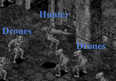

# The Society of the Dubhaimid: The final notes of Teirsaes

_by Deksar in **Dark Ages**_

## Introduction

The darkness that fills the void, this is the dubhaimid. Teirsaes spent over 2
Deochs studying the acursed creatures in the Castle of Dubhaim. He was certain
that there was some semblence of intelligence in these things. I have collected
and edited his findings into this document, as Teirases was not exactly great
at keeping orderly notes in his diaries. In fact, it took me 6 moons just to
figure out the way Teirsaes wrote in order to "translate it" into a real work.
Anything in quotations is an approximate "translation". Note that there may be
gaps in this collection, for Teirsaes's complete diary was never found. The
last parchments were torn off of their placeholders. But what we do have is
quite interesting, and remarkable if it is indeed true. Note that though
Teirsaes might have been a brilliant philosopher, he is highly opinionated so
he sometimes adds theories which may totally contradict with the main beliefs.
From here on out it will be Teirsaes's work, with comments from me in
parathenses.

``` 
((OOC Note: The character "Teirsaes" does not exist anywhere in Dark Ages.
I made him up so I could say he researched this for 2 Deochs. Deksar himself
has only been around for 2 Deochs, so he could not do it himself. But I am not
copying someone else's work, this is all original.)) 
```

## What are the Dubhaimid?

To understand why the dubhaimid could even have a society, first we must first
understand what the dubhaimid are. Many believe them to be evil incarnate, the
result of something's hate for this world. However, that is a simplified
explanation. Evil is an emotion, not something that could create a living,
sentient, creature. I believe the dubhaimid to be sentient creatures, their
form warped by the power of darkness, but sentient none-the-less. Deoch,
Sgrios, and Chadul were all once, or still are, dubhaimid. And they show great
signs of intelligence and power. Chadul is the greatest threat to the gods as
Aislings can tell. No mere mathmatical process based on instinct can defeat the
gods, it takes intelligence and cunning. Chadul may be the ultimate form of a
dubhaimid, but this does not mean there are not lesser, still intelligent,
dubhaimid.

Exactly where these dubhaimid come from, I can still only theorize that they
are, in fact, made up mostly of evil. They warp a creature coming into this
world and, by the power of darkness, corrupt perfectly mundane and unsentient
animals twisted into the first dubhaimid. I cannot believe darkness could
create form. Evil has always symbolized the power of chaotic destruction and
the end of life, while Good has always symbolized the order of creation and the
beginning of existance.

## Dubhaimid Life and Death

The dubhaimid do not give birth like other creatures. The dubhaimid are
asexual, they do not need anyone else to reproduce. First they gather up enough
**"dark energy"** (Note: see Teirsaes's diary collection for more information
on **" dark energy"**) to reach their full capacity. From here they have two
options - morph themselves into a being of even greater power, or create an
offspring. Many yeng dubhaimid choose to continue warping their forms until it
is too difficult to obtain that next stage of being without great strains, at
which point they usually settle down _(note: parallel to Aisling life?)_ and
seek to start propogating.

The first stage of a dubhaimid brought to life _is not_ , in fact, the stage of
pupa as many tend to believe. The first stage is cocoon, in which the dubhaimid
are subjected to intense but brief stimuli of light. Where this light comes
from is unknown, but its effect is greatly needed, for it allows the dubhaimid
to have a small immunity to the element of light. Without this, the dubhaimid's
form would start to disenegrate as light touched it. This could be why the
dubhaimid took so long in corrupting Temuair, they needed to develop the cocoon
stage to create small immunities to the natural element of light.

Next comes the well-known stage, the pupa stage. A dubhaimid pupa is a totally
un-evolved being, with rudementiary abilities based solely on instinct. An
unguided pupa has a short life-span, for its instincts aren't very well-honed
and will get it into big trouble by the end of a sword. A pupa has many choices
to what to evolve into when it collects enough dark energy. However it is
almost impossible to evolve past the state its parent was at, for some reason
unknown to me at this time. _(note: More about the pupa-stage later)_

When a dubhaimid dies, it leaves behind whatever **" dark energy"** it has
collected and not used. Being this some sort of etheral energy, it cannot be
viewed by mortal eaye. However the dubhaimid seem to know where this energy is,
and feed off of it to increase their own reserves. Exactly why this happens is
quite a mystery, and I can only offer an outstanding theory. It is known that
**Sgrios** , the god of death and chaos, feeds off the death of Aislings and
scars them somehow before letting them return to the mortal world. It is quite
possible that Aislings, being of both light and darkness, have this **"dark
energy"** inside of their bodies and **Sgrios** , being kin to the dubhaimid,
feeds off of this to keep his ultimate evolved form of a dubhaimid from
expiring back into a more mortal form. However this theory suggests that the
**" dark energy"** is part of one's soul, so that would mean that the dubhaimid
are made up of whatever souls are made of, an interesting thing to ponder.

## Section 3: Classifications of a society

A "society" is created when a certain type of creature's patterns of life have
any resemblence to a community, with certain tasks and status to each type of
creature. There are certain levels of society, a low-end society, a medium-
result society, and a high-intelligence society. The first is mainly the work
of such industrious creatures like the little tiny insect ants. They work and
toil with certain tasks, but their overall intelligence and originality is
lacking, they are compeletely uniform. The medium-result society is very
typical of a Mundane society, although perhaps not perfect in its mundane
qualities, it gets the job done when needed. And last is the Aisling society,
the high-intelligence society. This society is based on a premise on a state of
reason and science instead of whims and beliefs, and has the most potentional
of the three to create a productive society.

There are many different classifications of the dubhaimid society. I have
struggled my entire life to create these theories and write these notes, for I
believe above all other "truths" that the dubhaimid are, indeed, sentient. The
classifications are: pupa, drone, hunter, guard, scholar, creator, leader, and
priest.


An unevolved dubhaim is at its pupa stage. It has not collected enough **" dark
energy"** to evolve past the stage right after cocoon. A dubhaimid has a strong
aggressive instinct, so a little pupa may attack anything it sees, even other
dubhaimid. In fact, one of the ways a pupa can gain **" dark energy"** is by
killing its own kind. The strongest dubhaimid might have killed more of their
own kind then Aislings and Mundanes. For this reason, the pupa are extremely
territorial and vicious. Only the strongest evolve into higher dubhaimid then
"drone". Most common pupa-stage dubhaimid is usually refered to as a **" Fiend
Pupa"**.

Many times I have seen a "drone" dubhaimid. They are the most common and the
most unintelligent of the dark beings. However they make up the backbone of the
dubhaimid society, for their tasks range from commonplace working to taking up
tasks usually reserved for higher-evolved dubhaimid like hunting and guarding.
In fact, many of the higher-evolved dubhaimid try to command a small to large
force of "drone" dubhaimid to protect themselves in case of danger and to do
work they wish not to do. The "drones" choose to obey their masters, for I have
seen small drone-only colonies in which none of the dubhaimid have evolved much
at all. Here the "drones" have no leaders, but they work fine by themselves and
seem to be more harmonious without complicated directions (although I could
never totally decipher how the dubhaimid communicate with each other). Most
common "drones" are known as **" Gast"** and **" Cruel"**.



Be wary if ye see a "hunter" dubhaimid. Their job is to kill all Aislings and
Mundanes on sight to collect **" dark energy"**. They then bring the **" dark
energy"** back to their community and divide it up for consumption and possible
evolution. "Hunters" usually command quite a bit more power then the average
dubhaimid, and surround themselves with "drones" to protect themselves.
"Hunters" are designed by nature to be able to traverse all terrain, and so
have the gift of flight. The most common "hunters" are known as the **"
Gargoyle"** and **" Nightgaunt"**, although the latter is divided between
hunting and another function.

I suggest retreat is in order if ye meet up with a "guard" dubhaimid. They are
especially strong dubhaimid picked by their leaders or priests to guard certain
important locations, such as the main community or an alternate place of
worship. All "guards" are very intelligent and vary with the importance of the
location. Places of mild important but still valuable may have a **"
Nightgaunt"** guarding it. Places of great importance may have a powerful **"
Succubus"** guarding it. **" Nightgaunts"** assigned to guarding are much
stronger then their "hunting" counterparts, but still not as strong as the
**Succubus** , hence why it is usually placed guarding regions are great
importance. "Guards" become extremely vicious if ye enter into the region they
are guarding. Otherwise, **" Nightgaunts"**, having many charistics of a
warrior with loyalty to their leaders, will not abandon its post for any
reason. A **" Succubus"**, on the other hand, gets bored easily and may start
wandering a little bit looking for some "fun".

A dubhaimid who researches mysticism and philosophy is a "scholar". Only one
type of "scholar" dubhaimid exists besides the "leaders", that being a **"
Succubus"**. The **" Succubus"** is highly intelligent, and has learned to warp
its form into that of an attractive female form. A **" Succubus"** does not
have to worry about killing anything for **" dark energy"** again, for they can
trick yeng male Aislings and Mundanes into giving up **" dark energy"** with
their illusion of feminine charm and power. In reality there is absolutely
nothing feminine about a **" Succubus"**, however. All it cares about are its
own interests, which usually do not include helping its fellow dubhaimid. It
mainly cares about having fun, which it accomplishes by sucking **" dark
energy"** from yeng Mundanes and Aislings and by practicing its power over the
elements on anything that moves. **" Succubi"** are extremely dangerous when
provoked, for they are the only common dubhaimid that have spells, which are of
a Wizard's "Mor" rank and know the secrets of the eternal curse **" Cradh"**.
Because the **" cradh"** type of spells are the curse of the dubhaimid by use
of nightmarish visions, it is quite possible someone learned this from a **"
Succubus"** to bring this to the Aislings...at the price of their soul.
Worshippers of Sgrios can pray to **Sgrios** for a curse of extreme power, for
as known **Sgrios** is kin to the dubhaimid. Infact, **Sgrios** itself may have
been a **" Succubus"** at one point, for a **" Succubus"** is one the highest
evolved forms of a dubhaimid.

Since dubhaimid cannot just create other dubhaimid out of nothing, there are
some who dedicate their existance to creating new dubhaimid for their
community. These are known as the "creators". It takes a bit of a dubhaimid's
own **" dark energy"** to create an offspring. Any type of dubhaimid can do
this, even one still in the pupa stage. However its offspring cannot evolve
beyond its parent without a tremdous amount of effort, so the "creators" are
usually higher evolved dubhaimid. The closer a new dubhaimid gets to evolving
into its parent's state, the harder it is for this dubhaimid to evolve. Many
would think that a **" Succubus"**, having a female form, would produce the
most offspring. This untrue, a **" Succubus"** produces only one or two
offspring in its entire life. As well, it seems to have no "parental instinct",
for it leaves its offspring to fend for itself. The dubhaimid that survive a
**" Succubus's"** neglect often evolve into much higher states. Also note that
the "scholars" helped develop the dubhaimid pictograph writings.

One of great charismatic appeal is declared a "leader" of a dubhaimid
community. The "leaders" vary, and there may be more then one. Usually the
highest evolve dubhaimid becomes the "leader", as their intelligence surprasses
that of their lesser kin. **" Gargoyles"**, **" Nightgaunts"**, and **"
Succubi"** are all common "leaders". However a **" Succubus"** makes a terrible
"leader", for they care only about themselves. Usually they act more like a
spoiled ruler then a charismatic leader. However with the introduction of
religion into the dubhaimid community about a Deoch ago, more and more of their
communities are being run by "priests".

Upon a Deoch ago _(note: 3rd Deoch when Teirsaes wrote this)_ , a new evolution
of dubhaimid was somehow created. This new evolution is very rare and I might
have been the only person to seen them, they are the **" Lich"**. Decayed in
form, they wear a ragged cloak over themselves to prevent themselves from
falling apart and carry a long staff with a hollow metal upside-down pentagram
with a hollow metal pentagram in its center and 3 parts of the upside-down
pentagram filled with a jade-like crystal. These are the new "priests" of the
dubhaimid, they worship either fear and death or hate and evil. The two
theologies are seperated by close tensions, for I have seen dubhaimid of
opposite faith attack each other many a time. It is quite interesting that the
"Lichs" resembles the mortal form of **Sgrios** , as **Sgrios** , as said
before, is kin to the dubhaimid. It is quite possible **Sgrios** was the first
**" Lich"**, and all the dubhaimid now reaching the state of **" Lich"** are
**Sgrios's** offspring. But then there is also always the possibility of
intervention by the dark god, **Chadul**. A **" Lich"** has the ultimate power
of darkness, a spell which causes instant death. It is quite possible the **"
Lich"** has evolved past the state of a **" Succubus"**. Note that the
"priests" also serve another very important purpose, for they are responsible
for the teaching of the dubhaimid pictograph writings, which I refer to as
"Eclipse", because it is usually refered to with an "eclipse"-type of drawing.
_(note: See the "Forenote" for a brief explanation of the writing system as I
see it)_

 

**Note by Deksar:** If you are reading this
in the Loures Library, you should see a copied drawing made by Teirsaes to the
right of the previously unknown dubhaimid, **" Lich"**. This drawing is banned
in normal libraries because they fear the image to be cursed by the same power
that brought down Teirsaes.

## Section 4: The Dubhaimid Religion

About a Deoch ago _(note: 3rd Deoch)_ , an organized religion was starting
through the work of the "priests". It is the worship of the dark god,
**Chadul**. The theology is split into two main sects, that "Chadul is fear,
death" and "Chadul is hate, evil".

The dubhaimid that believe **Chadul** is "of fear and death" worship both
**Chadul** and **Sgrios**. They seem believe **Sgrios** is the greatest prophet
of **Chadul** , and will follow **Sgrios** into their own deaths. Supposedly
**Deoch** to them was once a prophet of **Chadul** , but turned over to the
other side when he stopped fearing the consequences of love and the power of
**Chadul** , which makes **Deoch** extremely "unholy" to them. However they
mainly believe **Chadul** is of "fear", with "death" being a subset of "fear".
They seem to say that "death" is the one thing all beings have in common with
their "fear", so it must be the strongest "fear" of all time. They believe that
Aislings and Mundanes were created by **Chadul** to satisfy his hunger for
"fear", and it is the will of **Chadul** that these beings be horrified. The
**" dark energy"** that comes from all creatures when they die is considered to
be their "fear escaping", for death is the final terror. A dubhaimid that feeds
off of **" dark energy"** becomes stronger because they grow more and more
afraid of death, and the "fear" gives them power. They are in constant fear of
their master **Chadul's** powers, which is what their theology seems based
around.

The other main sect believe **Chadul** is "of hate and evil" see both
**Sgrios** and **Deoch** as betraying **Chadul's** will. They believe that "The
End" will come through the pure hate and evil within everything's soul, the **"
dark energy"** that the dubhaimid can feed off of. A "Final Battle" between the
great power of **Chadul** and his enemies will one day happen if enough **"
dark energy"** is given up to **Chadul**. Anything that is living must be
either turned over to the side of darkness or tortured then released. Through
this process, they hope more and more beings will either hate the other beings
or hate the dubhaimid. Either way, they feel that "hate" brings "power" to
**Chadul** and all his followers. These dubhaimid worshipping this sect are
extremely aggressive, dangerous, and fight with extreme zeal. They are
currently the strongest sect because they have killed off whoever disagrees
with them out of sheer hate for their differences.

The ritual they preform is usually refered to either by the symbol of
**Chadul** or **" Fate"**. Both religions preform a very similiar ritual, as
they both believe **Chadul** to be the master of fate and the final victor of
any battle. For the "Fear" sect the ritual involves preforming horrifying
experiences to please their master, like jumping into a small fire and coming
close to death by burns. For the "Hate" sect the ritual is very similiar,
except they do the horrifying experiences to other beings. All the while the
"priests" form a circle and stare downward at an upside-down pentagram and
randomly touch the end of their staff against the end of the "priest" next to
them. The end, however, cannot be documented. I have tried again and again to
stay through the whole ritual, but something inside of me start burning with
fear of the ritual's end. I can only theorize that the end of the ritual
involves looking upon the true essence of **Chadul** , which is said to cause
instant total corruption of the soul to whatever mortal gazes upon this.
_(note: Teirsaes's writings from here suggests he does not believe that he can
be "corrupted", and desperately wants to see the end of the ritual. This is a
possible cause of Teirsaes's disappearance. See: Teirsaes's Diary, complied by
me)_

## Conclusion

_by Deksar_

To make sure the astounding theories Teirsaes writes are true, I spent 2 moons
in the Castle of Dubhaim using the tunnels I found Teirsaes had dug. The more I
looked for Teirsaes's findings, the more I found out he could very well be
true. With all of this information that I have recorded and translated and
tested, I still cannot safely say I am the expert on the true nature of the
dubhaimid. Perhaps both Teirsaes and I are mad, perhaps we both are seeing what
we are looking for just because we are looking for it. But I cannot doubt at
this moment that the dubhaimid are not just creatures, that there is at least
some semblence of sentience in the dubhaimid and a soceity in their midsts.
Take this work with a grain of salt, and then wash that down with a little bit
of reality: go to the Castle of Dubhaim and various other dubhaimid-populated
regions form your own opinions. Thank you for reading this work, it does honour
to both my name and the name of Teirsaes.

_Deksar math-K'sull_
_Gliocan Priest_

### Reference: Eclipse, the symbols of the dubhaim

Teirsaes took many a scribbled and disorderly note about their language. I
cannot give ye his exact words, best I can do is tell ye what I can figure out
from his notes. About a Deoch ago _(note: 3rd Deoch)_ with the appearance of
the first *Lich*, an organized religion started developing in the
dubhaimid society. To tell about *Chadul*, the *Lichs*, with the help
of the *Succubi*, developed a very primitive language based on symbols. I
will show ye a copy of his drawings by hand, and the possible meaning it has.
Note that I am forbidden to show the copies of Teirsaes's drawings anyplace in
Temuair. Ye must locate the Loures Library `(( e.g. where you are now ))` to see 
the drawings.

  

*Eclipse*: the moon, a large arc over the sun, an
arc with "beams of light" coming from it.

  

*Death*: a broken circle trying to "eat" something which
resembles a snake.

 
  

*Fear*: A swiggly line broken at the top, with another
swiggly line coming out of it and little things inside of them. 

  

*Hate*: Multiple sharp-looking tringles pointing in every
direction except one, where a large line encompassed by a circle with an arc
in it. 
 


*Dubham*: 3 large vertical swiggly lines with 4
broken triangles on 4 different sides. 


*Foreign* or *Enemies*: 2 large horizontal swiggly lines with a thin line 
going through them. The line has 2 "flags" near either ends, and a 
"radiating" circle in its middle. 


*Fate*: "The End", "The Last Day", "The Final Battle", or
"Ritual": A helmet-looking object in the middle, intersected by two lines
which go out to two wing-like things. Below are two broken circles. 


*Chadul*: "The Dark God", or "Ritual": A upside down
pentagram with 3 triangles filled in and a normal pentagram in the middle.

  These are the symbols Teirsaes talks most about in his notes, so I assume they
are very important to the dubhaimid and major symbols in their primitive
writings.

  
_Work by Deksar math-K'sull  
Original notes by Teirsaes  
Originally Scribed in Loures Library with the assist of Jean Caterouge and Lars Tembli  
9th Deoch, 4th Moon, 23rd Day_

***

```
*Librarian Notes*

This entry has been edited to conform to Library formatting.
The original can be found at http://www.darkages.com/community/phi/Deksar_Dubhaimid .
```
