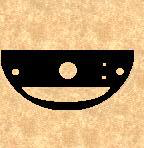

# The Aisling Belief of Evil

_by Enclave in **Dark Ages**_



For many Deochs the Aisling has battled evil. Some battle the evil by hunting
it, vanquishing any creature that proves unpleasant to the eye. Others battle
the evils of society with their laws and regulations. In all this battling have
we forgotten just what evil is? Did we ever know what evil was in the first
place? These are the thoughts that plague me as I scribe this, sitting on a
bench in suomi. It is true what they say; about the perfect silence of this
town holding more meaning than every written word in the library of loures. It
is my hope that by the time you find the end of this parchment, you look upon
temuair with a new, more enlightened confusion.

First off, I will attempt to give the best description I can conjure of what we
know as evil. Evil is considered an action, or an entity that is prone to such
an action that violates our morals and values in extreme. This leads to the
question of how do we form morals and values. I could spend deochs scribing on
that topic. The morals and values of every individual are seemingly random.
Certain sets conflict or run parallel more than others but all are essentially
unique. My point is this, there is no unanimous concept of exactly what evil
is. What one would consider evil in its most foul form could be necessary and
just to another.

For example: A community of poor farmers that murders the kings tax collector.
The farmers believe the tax collector to be evil because of his intention to
kill those unwilling to pay the king's tax. The king's tax collector believes
those unwilling to pay there tax's evil because he knows that without tax's to
fund the king's army they would be invaded and left to the mercy of less
hospitable rulers. Which act holds the most evil? The murder of a poor farmer
that is unwilling to pay the king's tax to persuade the rest of the farmers
into paying there tax's to prevent invasion; or the murder of the tax collector
to prevent the murder of the farmer. The answer to this question is pure
opinion.

When one thinks of evil a few names instantly come to mind. Chadul, Sgrios,
Anaman, Dubhamid. We associate these things with evil because they, for the
most part, are unknown to us. This is the tendency of aislings, to fear the
unknown, to label what we fear evil.

The vast majority of temuair believes Sgrios to be evil. This is once again, a
matter of opinion. It is true that death, decay, and destruction goes against
the morals and values of some, but they are few in numbers. With very few
exceptions all aislings hunt. Not for food, not for survival but for
entertainment and the betterment of there skills. Aislings kill each other
routinely in the arena. How can we call death evil, against our morals and
values, when we partake in such acts frequently. Death is a major part of
aisling culture and is widely accepted as normal. I believe a more suitable
term for Sgrios would be indifference. Sgrios is not the cause of death, but
entirely the result of death.

The aisling has proven to be a most destructive force. We claim many things to
be great evils without taking ourselves into consideration. Who are we to
declare something 'evil' when we are just as guilty as those we accuse, maybe
more so at times. These benches are deceptively inviting. They become hard and
uncomfortable after just little while. It appears I've worn out my welcome
here. The silence of suomi has ceased to be meaningful to me, now it only
speaks of madness.

_Enclave_  
_Servant of Sgrios_  
_Deoch 18_  

***

```
*Librarian notes*

This piece was acquired from a merchant who claimed it was found in "the very
lowest depth of the mysterious crypt of Mileth" or perhaps "the very lowest
depth of the dreaded Cthonic remains".

Neither of these claims could be verified.

This entry has been heavily edited to conform to Library formatting.
The original can be found at http://www.darkages.com/community/phi/Enclave_Evil.html .
```
