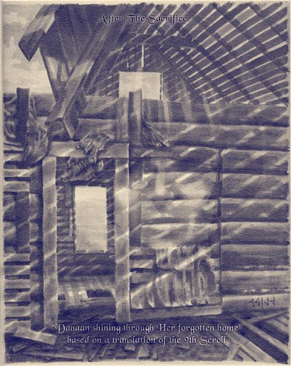
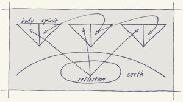
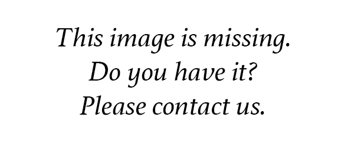

# A Treatise for the Acceptance of the Aisling

_by FristVire in **Dark Ages**_

# Foreword

A score parchments were unearthed from beneath the substructure of what had
been a brazier's workshop under a copse of coiled trees on the western fringe
of the West Woodlands. Apart from the two most deeply interred, the documents
were too burnt to salvage.

Among the recovered works the first, an illustration titled "Danaan’s Folly"
serves as befitting cover for the second, an unfinished draft for some greater
almagest from the observant and remarkably objective mind of a Mundane scholar,
Cleirach Parthalan, and appears never to have been completed before the
invasion.

By means of a devoted hunt for understanding, this text presents the Temuairan
society’s early characterization of the Aisling and, though not termed
outright, may be the oldest extant reference to the notion of Spark without any
tie to Deoch’s passion. It strikes the reader how the author, using pure
Atavism Arcanum, the only science available to him, interprets his
observations without benefit of the openness of thought we indulge today.

The shock to the inhabitants of Temuair when these self-possessed newcomers
first emerged has concerned me since my Mundane days; the transformation must
have mystified those living then. It is no wonder the Aisling interlopers were
greeted by mixed feelings, if not blamed outright for the tumult that tolled
their arrival: the greed, the decay, violent death, and the unspeakable
scourges of Dubhaimid.

However, without these changes and the urgent pursuits they gave rise to,
curiosity, theory, and knowledge, we would surely not have this record, in its
own right a treatise for the acceptance of the theretofore-outcast Aisling
populace.

Cleirach not only struggles to explain the new Aisling gift - or reflection as
he calls it - he unwittingly expresses a social climate, suspicious if not
horrified. It is easy to forget that, so soon after the division of Temuair,
Aisling "meddling" did not enjoy the reputation it has today. Indeed, parts of
his draft waver as Cleirach wrestles with his own prejudice and jealousy.

I grant that many of the topics on which his theories find footing are now
firmer grasped, even if their sources still are not. Nonetheless, Cleirach
raises issues still unrequited today. Namely, from what is this Spark? Need we
understand it? Or is it enough merely to harness it?

It is my view that, were _Scaan_ as he calls it fuller understood, its power
would be more expertly commanded. Perhaps this outsider's wary viewpoint sheds
light on those things we are so close to as to be blinded by them. I share it
with ye for this reason.

_Frist Vire, Deoch 31, 9th Moon_

## Danaan's Folly



### Abstract

_(from the quill of Cleirach Parthalan)_

Aisling, once a denigrating and dismissive moniker, is becoming so enticing an
aspiration that sensible young Mundanes gripped with the _ashlish aislinge_ now
study for deochs to take on this name and its associated gifts.

Now held by some to be a gift of the gods, it is still reviled in areas of
Temuair as a sort of communicable madness. We have accounts of so-called
spiritual epidemics in ages past, but this premise offers naught to explain the
ordered and potent nature of the Aisling condition. I intend to prove that
these oddities are not emblems of affliction, but rather are forces channeled
through our energetic allies.



Figure 1: clannach deartháir (three Aislings shown)

Be it said that Eachann, my friend and mentor, and I were prior divided on
countless issues, but this one has irreversibly cleft our partnership.

It is his unswerving belief that the powers Aislings beckon are derived somehow
from within the earth, that their vital force and fraternity are allied there.
He terms this relationship _clannach deartháir_ , or earthen kin. This
manuscript will show that the _clannach deartháir_ model, as illustrated
above (Figure 1), does little to clarify much of the conduct of the Aislings.

My model, which I believe a more fitting paradigm of Aisling personae and their
host of birthmarks, is crudely illustrated below (Figure 2). It demonstrates a
distinct ethereal essence and can account for those aspects Eachann's model
cannot.



Figure 2: clannach athar (three Aislings shown)

When one examines the _clannach athar_ , or sky kin model, one is impressed by
its liberation from terran constraints; instead the _aislinge scaan_ (or
reflection or spectre) which I will hereinbelow attempt to define, dwells from
without the earth in what may be a spirit plane of sorts. There may be no
dependence on the body's confines whatsoever and represents the only viable
grounds I have yet found for the various phenomena we associate with the
gifted Aisling.

### Thesis

Whether Aislings maintain absolute control of their faculties I can only stab
at an answer, but unquestionably they maintain exacting control of their
bodies, a control drawn as Eachann conjectured from a source detached from our
material surroundings. He termed this source _Scaan Prosnaich Annym Riaghail
Keillit:_ in essence, the "unseen reflection that stirs the will."

I offer eight proofs for the existence of _Scaan Prosnaich Annym Riaghail
Keillit_ , and where it holds advantage, I aim to apply the _clannach athar_
model to make plain its implications.

Widely held for a generation that the Aislings had brought with them the
plagues of darkness, their potency against the Dark Ones increasingly suggests
that they are instead the remedy. Principal to this potency is their
irrepressible appetite for the hunt and the upgrowth it affords. _Smachdaich’re
agus dàn _ or simply _’re_ , occurs almost without exception as soon as an
Aisling protege is inducted into the Aisling subculture.

More than a mere "coming of age", the pressing need for a young Aisling to
wrest dominion over not only the body, but also the fauna, the elements, and
the future, evinces an urge to become in step with the _Scaan_ 's boundless
nature and marks thenceforth an unyielding divergence from the old culture.
_Clannach athar_ theory is lent credence by the stark margin and
irreversibility of this transfiguration.

"The Aisling Threat" once meant that we Mundanes (an appellation I detest)
withheld the secrets of the five Paths, now all but dominated by these new
savants who are on the contrary proving themselves quite the opposite: a
safeguard to our way of life. While I cannot speak for the community at large,
many a Mundane now accepts, yea reveres, the Aisling capacity for learning.

It has taken the greater part of my life to reach this level of proficiency in
but one discipline, yet even the meekest Aisling boasts far greater flair for
commanding talent after talent! In the number of moons a vintner takes turning
vine to wine, an Aisling nearly masters one Path, only to take on another
wholly unrelated study, a faculty known as _astar aistrigh_. The only
explanation I can conceive for this unusual and - I must confess - enviable
virtue is that it too springs from the _Scaan_.

We all know of mothers who, with their child beset with the spark of Aisling
insight, are unable to comprehend - in scarcely the course of the moon - their
own child's sudden acquisition of foreign tongues.

For some this gift often carries the irresistible tendency to speak no other
way, _shaghrynys mallaich_ , again overnight with the onset of this inner (or
outer) endowment. Ordinarily this coarse language in unintelligible dialects
goes ignored, and I myself do not find it exceedingly worrisome. It is however
so unsettling to many townspeople that, as I pen this, laws are being drawn up
to prohibit in public this manner of speech.

It is easy to see the _Scaan_ at work here, but only with the application of
the _clannach athar_ model do we arrive at a reasonable depiction of how this
might be.

Discounted for deochs as elaborate trickery, the ability to communicate with
other Aislings without the use of one's voice, or _sanas ainbi_ , is now
widely established. Even at impossible distances, the conveyance of civil
actions, the coordination of attacks, and even I speculate casual banter is all
accomplished with no outward discourse of any kind.

I myself have witnessed two Aislings standing side by side staring vacantly
for an hour only to depart company with an, "I agree. I will afterward meet ye
there." I can only feebly imagine the form this language takes. One need only
compare the two models to settle on _clannach athar_ as the likely basis for
_sanas ainbi_.

This brings us to another notable if less laudable trait of Aisings, _dreamal
'sy laa_ , the predilection to idly stand for lengthy periods in a reflective
muse transfixed on some otherworldly affair without even the shifting of feet.

That any Aisling is able somehow to accomplish half his exploits, despite this
languor, at once fascinates and frustrates me. To what cause can we ascribe
such disembodied idleness? Both _Scaan_ models account for certain features,
but _clannach athar_ theory holds the advantage in deriving an origin of the
_dreamal 'sy laa_ phenomenon.

It has been noted that in remote areas of Temuair, Aisling hunters can be found
in dreamlike absentmindedness locked in melee with desperate beasts. The adroit
Aislings toy with the animal, injuring it enough only to provoke further
attacks, never undertaking to finish it off. This feat, called _shelgeraght
scart_ , would be remarkable enough outside the arresting realization that the
beast is fighting with all its mettle, while the entranced Aisling barely
exerts himself to fend off every blow with impassive ease!

When willing game is scarce, they may likewise duel those of their own kind
under this same expressionless trance. That these Aislings can repeatedly
outwit an opponent (the while themselves completely absent of wits) offers
further support to the _clannach athar_ model. ---

There are occasions when an Aisling's corporeal form abruptly dissipates
without so much as a wisp or a breath. "Leaving this land," they are in the
habit of saying. Look sharp for a change in an Aisling’s comportment. Ye may
notice an Aisling’s usually alert aspect degrade to one of vacancy before
blinking out.

If one manages to stand composed after a disquieting episode of _skellal
roish_ , he can spy the vanished Aisling’s footprints. The watchful and sober
observer may catch the subject’s re-emergence on that very spot! Clearly, the
Aisling has traveled nowhere, and discussions with the more mannerly of their
number have confirmed what I suspected: they remember not a thing during the
interlude. Given that fact, the _clannach athar_ model is again substantiated.

Were it not for the number of citizens who witnessed _eug as eugais eug_ , I
would have hastily dismissed this so-called "dying without dying" as mere
hearsay.

During a recent Goblin incursion several townsfolk were dismayed to spot a
dozen Aisling conscripts, outflanked and outnumbered four-fold, perish under
the weight of the attack, only to return in scant minutes from an adjacent
field to retrieve their armor and carry on the fight!

Was this _clannach athar_ in action? After rigorous questioning of the
witnesses separately, I have concluded that they saw something otherwise
unexplainable on the battlefield that day. To "fall in battle" to an Aisling
may mean merely that!

I cannot in fair conscience proffer the following roughhewn account of _rach
air t'suas_ as impartial proof, for I have neither seen nor adequately
researched this claim to gauge its legitimacy, but if borne legitimate it would
constitute the single greatest Aisling endowment.

_Rach air t'suas_ , literally "to go up", an alleged journey through death
itself, is rumored to culminate in a sort of face-to-face covenant with the
gods, where an Aisling barters mind for body. I find it an objectionably
contradictory notion that one must become unimaginably frail in order to become
immensely powerful. Howbeit, we know the Aisling is rife with
contradiction, and this astonishing potential demands further study.

### Postscript

If my theories are accurate, what the Aislings claim may be true; their power
may in fact flow from the gods. This would mean that the gods are not only
awake in Temuair, but intensifying their influence. If I am to validate these
assertions, it may prove necessary to join their number in order to complete my
studies. My advancement in years I am told stands in my way, but the lure of
intimate understanding, which swells with every day I investigate the
Aisling, will grant me passage.|

_(remainder of manuscript omitted)_

***

```
*Librarian Notes*

The original copy of this document has been lost. It has been reconstructed from fragments.

This entry has been heavily edited to conform to Library formatting.
```
