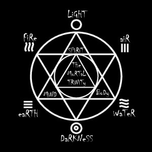

# The Hexagram : The Inversion of Balance

_as explained by philosopher and theologian Grim of the Neverlands_



Within the universal map of creation we find several simple and quintessential
elements that define the very pattern that is existance. Within the very
defined and simplistic hexagram we can better illustrate these properties.

## Six Basic Elements

The six basic elements (and their individual effectual energy projections) of
creation and world energy are as follows in no particular order:

_Light_ : Blessing, Summoning, Positive, Good, Life

_Darkness_ : Cursing, Summoning, Negative, Dark, Death

_Earth_ : Positive effects, Protection, Invisibility, Haste, Enchantments
(weapons, armor, clothes etc...)

_Air_ : Negative Effects, Paralysis, Confusion, Illusion, Teleport

_Fire_ : Damage, Rebirth, Poison, Enchantment (weapons, armor, clothes etc...)

_Water_ : Healing, Illusion, Teleport, Enhance (Body, Mind and Spirit)

As you can see on the attached diagram, the more positive and progressive
aspects of nature can be seen as the first trinigram. They deal with the more
uplifting aspects of nature and her forces of influence. They also point in an
upward manner and ascend through the hexagram as will be explained later.

The more negative and degressive aspects of nature can be seen as the second
trinigram. They deal with the more abrasive and descending aspects of nature
and her forces of influence. These point in a downward manner and descend
through the hexagram as will be explained later.

Within the Hexagram itself is the Third and perfect trinigram, the aspect of
man. This trinigram sits within what is referred to as the dual inverted
trinigrams or hexigram. Sitting within the main intersection shows mans place
in the middle of nature and his focus as the balancing factor that manipulates
the forces within a balanced and neutral existance. Without man to manage these
powers all chaos would break loose and existance would turn into a paradox of
constantly changing non-existance.

As we look at the Hexagram we can see that even though water and earth are part
of the upper and first trinigram they sit beside and surrounding the point
aspect of the dark trinigram. In literal terms these two forces are the most
chaotic of the 4 minor elements (Light and Dark being the Major elements).
Within them is randomness and derrision. Fire and Air sit astride the point
aspect of the Light trinigram showing a more leniancy towards the Lawful aspect
of the trinigram. How can this be you ask? Here is where the inversion of
balance comes into play. I will not attempt to explain all the woprkings of the
trinigram at this time. That will be addressed at a later date. What I wish to
explain in this tome is the balance within all the forces that surround us and
the fact that without one another, there would be no perfect balance and that
each force must work within and in laterality to the others in order to
function within the sphere of existance on this plane. Man sits within and
encompassed by the six elements of completion. Man may manipulate and move
these forces as far as they will allow and may create several cross aspects
within the layout of the patterns within the hexagram which can be displayed as
circles within the seal. man must keep this in check however for he has the
ability to push the balance in one direction or another, but, as the laws of
reality would have it, when one force rears its head an opposite and equally
powerful and able force arises. Man has the decision as to which way to bend,
the forces just ARE...

As confusing as this all may be, you can see with the diagram and simple
inspection that the intertwinement of the pattern lines and the layout of the
forces suggest a weave that plays upon itself and connot exist without all
parts, for, if the pattern was to ever be broken, the stability of existance
would crumble...I have found in this simple explination the fact that was must
fight against the uprisings of either side whichever may be migher to keep the
balance. One side is not right and one side is not wrong, they both are equally
important and if the time arises where man must take upon himself the aspects
of "evil" and "choas" to keep the balance then it is justly so. We, as
aislintgs and creatures of the creation have the responsibility of the balance.
I fear the time is at hand when the forces are becoming unbalanced and man must
take action. I will write more at a later date if required, for now these eyes
have seen sites that tire not only the mind and body but the soul as well. Be
well and wise...see you in the after...

***

```
*Librarian Notes*

This entry has been edited to conform to Library formatting.
The original can be found at http://www.darkages.com/community/phi/Grim_Hexagram.html .
```


