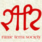
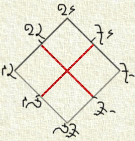
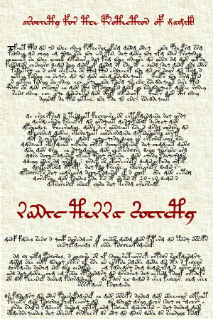

# Aosdic Mystic Theory

_by Kedian in **Dark Ages**_

_Presented By_  
_Kedian Ta'Null, Royal Scholar_  
_Runic Terra Society_  

_First Edition_  
_Published in Rucesion Kingdom_  
_Fall, Deoch Six_  

_(Library Copy by The Loures Library Markdown Subcommittee)_  



## Introduction

This guide is intended to explain the recent discoveries I have made regarding
the Aosda civilization and its mystical theory.

To begin, I shall explain a bit about the Aosda for those not familiar with
them. It is suspected that the Aosda were a great civilization that existed in
perfect harmony, until they began to abuse magick and use it in warfare. Their
folly was to attempt to control nature by brutally forcing it to their will
(written of in detail in "Mystic Theory").

The Aosdans failed to use magic properly, and paid dreadful consequences.

This guide is also my attempt at explaining their mystical theories, and how we
may follow the path of the Aosda without resorting to the destruction that they
encountered.

In it, you will find explanations for the arising of the dubhaimid; the source
of magick power; and an explanation of who the Runic Terra Society is and what
our goals are.

It is my hope that, by learning more and more about the Aosda civilization, we
can continue to better ourselves while avoiding the avarice and pride that
eventually led to the destruction of the Aosdans.

## Discovery of Shamshiel’s Works

Sometime after I had met my dear friend Katrionah Rosalette, we set off to
explore the Kasmanium Mines. Not intending to actually tread into the dread
mines, we were content to explore around the surrounding mountains.

On our expedition, we found an alternate entrance to what seemed to be an
abandoned mine shaft. Entering with trepidation lest we be destroyed by the
powerful monsters within, we began to explore the interior. Strangely enough,
it was free of monsters, and yet, we sensed very powerful energies, energies
which grew stronger as we ventured further into the cave.

Eventually, after passing massive rock formations, the remnants of a Goblin
camp, and a underground river, we arrived at a plateau. A black dais rose from
the center of the room...the oddest bit was, it had a perfect spherical shape
that I do not think could have been possibly created with even the most
talented human hands.

Katrionah and I approached the dais with trepidation. The energy I was sensing
was growing stronger, and I was beginning to hear whispers coming from the
darkness. As we grew closer to the dais, we could make out a glow that was
coming from its center. It turned out to be a massive crystal! It had to have
been at least the size of a man in diameter. I could barely make out an object
in the center of the crystal.

Katrionah and I decided that hell or high water, we were finding out what was
in the crystal. With the help of my monk sister, Twila, we excavated the
crystal. With one mighty blow, Twila smashed the crystal along one of its axes,
and it began to crack. With a hissing sound, the crystal began to dissolve,
until only a largish brown leather bag was left.

I slowly approached the bag. It was covered with runes in a language that I did
not know. I asked Katrionah, who had studied ancient languages as a child, if
she could read them, but to no avail. I opened up the bag, revealing three very
ancient leather-bound books (the binding surprised me, as it was of an
incredible quality for such an obviously ancient document). Each of the books
was adorned and written in the same strange ruins that were on the bag. Also in
the bag was a small parchment note

I knew I had a long task ahead of me, and I wrote to my mother in Rucesion to
send me my father's notes and papers that he had collected related to Aosda.

As I sat in my study at the Runic Terra embassy, poring over the documents, a
knock on my door interrupted my thoughts. Four or five mundanes were standing
at the door, struggling with a large chest and boxes upon boxes of documents. I
soon learned that these were my father's writings and study of the Aosdan
civilization; all of the knowledge that he had ever collected.

This was in the Fall of Deoch 1.

It is now the Fall of Deoch 6 - five years later, almost to the day, and I have
just now finished translating one of Shamshiel's scrolls. These scrolls, and
the theories within, are discussed in this document.

Shamshiel wished to establish a "Magick Preservation Society" to preserve,
protect, and guard mystical knowledge. He enumerated the Aosdan mystic theories
so that anyone finding the document could begin to return, and to advance
magick back to where it was during the crest of the Aosdan civilization.

We are here, nearly twenty millenia after Shamshiel's passing. We are here, to
carry on his wish - to establish a society to protect magic; to serve the
common good; and to further mystic and metaphysical knowledge.

We seek a return to the knowledge level of the Aosda.

We seek unity, peace, and advancement of mankind through magick.

It is my goal that we always uphold Shamshiel's wishes, and never disappoint
him. And by Luathas, we will not fail.

## Aosdic Mystic Theory



We know there to be four elements: Air, Earth, Fire, and Water. But what we do
not know is that there is a deeper meaning to their ancient positioning.

Shamshiel's theory is that the elements align with the gods themselves. He was
not specific, but we know there are four elements, but it is known that certain
elements cancel each other out; fire and water for example. This can be related
to what occurs between order and chaos; being total opposites, they cancel one
another. The elements align thusly; water and earth are vast, highly ordered;
air and fire are fleeting and changing, chaotic.

Shamshiel, in the diagram found as the cover of this manual, indicates that
when all the different components are brought together and cancel each other
out, the gate to dreamspace can open. It seems fitting that the gate to
dreamspace e can only be created through the annihilation of both order and
chaos, since dreamspace refuses to be classified by such limited terms (it
perhaps is “above” those classifications).

The relationship between “order” and “chaos” and the gods of Temuair are
enumerated below (a mixture of my own theory and Shamshiel’s writings)

_Deoch_ - chaos

_Creativity may strike at any time, and has no boundaries or limits, just as
the human imagination has no limits._

_Glioca_ - chaos

_Love is fickle, and fleeting. It disappears and comes with no prediction or
predilection towards a harmonic schedule._

_Cail_ - order

_Cail represents harmony, and the ordered pattern of all things._

_Ceannlaidir_ - chaos

_Although war uses strategy and order to achieve its goal, it gives rise to the
chaos of the battle and the randomness of the outcome. No man, when on the
battlefield, can ever be assured of his victory. Ceannlaidir gives rise to the
order of Death._

_Luathas_ - order

_Divine knowledge is immutable as well, related to law. There is no chaos when
one is omnipotent, and knows the outcome of all things._

_Fiosachd_ - chaos

_Luck and fortune are fleeting and constantly changing. One moment you are on
top of the world, and the next you are in the depths of despair._

_Gramail_ - order

_Justice and laws are meant to be immutable, unbreakable - the order of
society, theology, and philsophy - the order of Reason and Logic._

_Sgrios_ - order

_There is nothing chaotic about death. Death is precise, cold, calculating, and
exact._

The annihilation of order and chaos, Shamshiel writes, “gives rise to that
which is unclassifiable - Dreamspace”. He writes that the abuse of the natural
classifications by the Aosda left the barrier between reality and fantasy
permeable - which explains the ability of the dubhaimid to go and come as they
please. I believe the Castle outside of Rucesion is in fact a gateway, a
residual focus point, to dreamspace.

The energy of the gods is associated with the elements, as illustrated in the
figure above. Glioca burns with fire. Luathas has the stability of the earth.
Cail has the harmony and order of the water. Deoch, the spark and quickness of
the air.

It is obvious that Terra has elemental energy. But what perhaps is not obvious
is that the interactions between the elements also represent the interactions
between the gods.

The reason why dreamspace arises from the “cancellation” of all the other gods
(who represent emotions) is unclear, except for the fact that dreamspace has
no definite emotion or alignment; it is neither good nor evil; caring nor
cold. It is defined by our own fantasies and imagination, allowing it to shift
and change at will.

The odd thing however is that by gathering extreme amounts of elemental energy
in one place, you can also trigger a gateway to dreamspace, whereas the
ancient Aosda used the technique of “emotional” or psychic energy. This is due
to the fact that the elements are related to the gods and thus the
metaphysical energy that they represent can be channeled and converted in a
different form.

We know that elemental magick arises from energy. I believe that this energy
comes from the gods but is also a reflection of the universe around us. The
energy around us is “elementless” - we channel it and harness it to cast srad,
athar, etc.

The energy maintains itself at a constant level. We know that mages cannot go
indefinitely without a rest. I believe that our mana represents our contact
with that energy. When we cast spells, we drain our own resources, which
replenish themselves from the background energy that Terra possesses.

This energy, if abused, can lead to deadly consequences. I believe that the
energy is much like a four way pendulum - if you use too much of it, the
balance shifts to that specific element. Our individual athar and srad isn’t
enough to shift the balance, but I believe that the drowning of Hy-Brasyl was
caused by the abuse of srad, leading to a cascading effect creating tremendous
amounts of sal energy, which manifested themselves in giant, cascading waves.

The relationship to order and chaos that we discussed earlier is also related
to this discussion. The cancellation that we are referring to is the
destruction between order and chaos. Dreamspace can be categorized as neither,
so in the lack of both, dreamspace arises. Does that make sense? *smiles* In
our world, there is balance between both order and chaos. Neither one
dominates. In dreamspace, there is an absence of both.

I believe that when there is a lack of either, the opposite fills the gap. For
instance, when there is a lack of chaos, order prevails, and so forth. This is
why dreamspace is not readily accessible (except for at the Castle of the
Dubhaimid, which I explained earlier). This is related to the elements as well
since the elements themselves “align” with a specific category (srad and athar
being chaos, creag and sal order).

So, in conclusion, we have shown that the gods themselves can be represented by
a specific element. Dreamspace, that which cannot be classified or defined, is
the absence of “all”. Thus, gateways to dreamspace can be opened wherever
elemental energy completely cancels, or where the metaphysical “emotional”
energy associated with each god cancels (the octagram portal built by the
Aosda).

The relation between order and chaos, of course, is that the elements, and the
metaphysical assocations of the gods, represent the conflict between order and
chaos (as discussed above). It is the absence of order and chaos which gives
rise to dreamspace.

The problem with this is that neither is possible at the present time (which
isn’t really a problem!). We have not arisen to the sophistication necessary to
present a threat to the elemental balance (even ard forms of elements pose an
insignificant threat). And not only that, but you would have to drain all four
elements simultaneously. It would require four wizards of godlike talents, and
fortunately, no one is that evil nor that talented.

As for the “emotional” energy, the Aosdans labored for centuries to create the
naladars. Their technique is documented in detail by Shamshiel, but by our
current level of civilization, replicating these crystals would be completely
impossible.

This is a good thing.

## A "Society of Magick Preservation"



_A page detailing the foundations of "The Society of the Runic Terra"_

Later, in an essay titled "The Preservation of Magick", Shamshiel describes the
aftermath of the fury of Kadath. He describes "a people walking the Earth,
feeling no emotions, nothing at all, but knowing that they had a duty in Life,
and that it was necessary to fulfill it". His desire had been to create a
"Magick Preservation Society" to preserve the remaning knowledge of the Aosda,
while at the same time preventing the same foolish mistakes that destroyed
them. He lays out five guiding principles for this society:

1. _No member shall again abuse nature for his own means_.
2. _No member shall ever strike another member with anger in his heart_.
3. _Each member shall strive to further knowledge of the Mystic arts_.
4. _Each member shall strive to instill this knowledge in others whenever possible_.
5. _Every member shall strive to prevent the darkness released by our folly
from claiming the land._

In the few attached pages, he outlines the foundations of our Society, which
are encapsulated in our Runic Rede. I believe that we continue on the work of
Shamshiel, and it is best written in our mission:

**We are the Society of the Runic Terrans. We strive to protect nature, and to
learn more about the world around us. We uphold the values of Shamshiel and
defend the common good of the people. We strive to advance knowledge of
metaphysics, mystic arts, and religion to the height of the Aosda civilization.
We seek an end to the darkness and that which comes from Dreamspace.**

We are a family dedicated to advancing our knowledge of the world around us. We
carry out Shamshiel's works in this dark era, trying to impart culture and
knowledge unto our followers and those who would listen to us.

I think Shamshiel would have been proud. I hope that he is.

## The Destruction of the Aosda

Have you ever had a horrible nightmare?

Sure you have, we all have at one point or another. We see hideous creatures,
a twisted, dark world....and yet in dreams, we are also capable of seeing
wonderful fantasies beyond our wildest dreams.

Look at the dubhaimid sometime. Though this may be a difficult thing because
of their hideousness, you will realize that they are not natural creatures,
and could not have developed normally like mantises, mundanes, and Aislings.

The dubhaimid are the product of our dreams. How, you ask yourself, did they
get here?

Shamshiel speaks of a "Gateway of Inordinate power" that was built in the
center of the Aosdan capital. It was the pinnacle of all their achievements,
the results of hundreds of years of study and work by thousands of scientists.

Through some irony, the gateway was in the shape of a octagram. Shamshiel
indicates that the gateway was gigantic; nearly "two Hundred paces from End to
End".

Each point of the hexagram contained a magic crystal infused with the power of
the given point. Shamshiel includes a diagram of the crystals and their
meaning below. I have tried to provide a useful translation for their meanings
(i.e. their associations with the modern octagram)

| Crystal        | Description                             | Associated God |
|----------------|-----------------------------------------|----------------|
| Lor Naladar    | The essence of death and destruction    | Sgrios         |
| Pualh Naladar  | The essence of the pursuit of knowledge | Luathas        |
| Shasha Naladar | The essence of strategy and planning    | Ceannlaidir    |
| Milor Naladar  | The essence of compassion               | Glioca         |
| Tua Naladar    | The essence of invention and creativity | Deoch          |
| Seela Naladar  | The essence of justice                  | Gramail        |
| Nota Naladar   | The essence of harmony and purity       | Cail           |
| Pusa Naladar   | The essence of chance                   | Fiosachd       |

It is said that the crystals were created by infusing human emotions with a
type of crystal which could "absorb" the emotions and fuse them into the
structure of the "naladar" (crystal). The Aosdans labored for nearly hundred
and twenty years to generate the emotions necessary. Staged gladitorial deaths
were used to create Lor and Shasha, whereas a mother's love was used to create
Milor. Tua and Pualh were created artificially, through the human sacrifice of
scientists and researchers (who _willingly_ volunteered, if you can believe
that), whose natural curiosity of the world around them was infused into the
crystal.

Shamshiel seemed to believe that the Aosdan researchers were trying to infuse
the gods themselves into the crystals - to create a godlike essence with
tremendous power.

No one knew quite why the Aosdans were so keen on building this device, but it
was built, against many people's objections. However, the guiding theory,
proposed by one of Aosda's finest scientists, was that the unity of all human
emotion; the loci of "cancellation", as it were, would allow the Aosda to
ascend to a new level of existence. The cancellation refers to the ascension of
logic over all emotions - an emotional "nullspace". The Aosda believed that
they would be "illuminated" by the creation of the gate.

So, on the first day of the new Grinneal (15053) the Aosdans began an eight day
ceremony. One at a time, the crystals were placed into their holders on the
octagram gate, and slowly, energy began to flow between them.

Shamshiel remarks that ironically, the death crystal was the last one to be
placed.

Upon the placement of the last crystal, all eight began to resonate. They began
"to glow with an entirely Unnatural light; a pestilential, destructive Light; a
Light that was not Light but ultimate, crushing, insane Darkness."

A giant tower of dark-Light rose from the center of the octagram, rising
through the heavens. Shamshiel remarks that the "men and women that saw the
dark-Light were driven mad by it; and were never to be human again; their Souls
dulled by the Darkness, driven to create inpenetrable shields between
themselves and the World around them".

The Aosdans desperately tried to remove the crystals, but a magick field of
incredible power had arisen around the octagram, preventing all entry.

And then, slowly, the fabric of space began to rip. The sound, "was that of
hideous, cracking bone and ripping flesh". A sphere of pure Darkness arose
from the center of the hexagram, and slowly grew with intensity.

Wisps of blackness flowed from the gate, ensnaring the nearby observers.
Shamshiel said "their Skin flowed with Darkness, their hideous screams of
terror only giving rise to more of the Tendrils".

A warrior came through the gate, "gilded in the armor of Darkness, with
hideous runes and Mystic Drawings throughout".

The warrior was Kadath. I am somewhat confused by his description, as I
believed Kadath to be a place (because the ancient documents are not
specifically clear, but Shamshiel says clearly: "Kadath was a place and a
person....and here, was indeed, its physical Manifestation. The manifestation
of that place's evil."

Kadath appeared, and he was very, very, angry: "His eyes boiled with a holy
Anger, redder and brighter than the greatest iron forge of the Day".

Kadath brought with him the Dubhaimid, whose figures swarmed out of the gate.
They ran rampant through the city, slaying everything that dared to oppose
them or even caught their attention. "It all began so quickly; the hideous
beings with their claws and eyes...the streets ran Red with blood...their
preciseness and Efficency chilling the bones of anyone that was there.".

And then, as quickly as it had started, it was over. Kadath and the Dubhaimid
were sucked back into the gate, and the crystals shattered and exploded, their
explosion cascading through the hills and valleys of the Aosda, incinerating
everything they came into contact with with holy fire.

Shamshiel was at a loss to explain why Kadath had appeared, only to perhaps
hint that it was because the Aosda had finally learned the secret to control
him - to cross over into "dreamspace", the world created by our dreams and
nightmares. It is said that if one realizes they are dreaming, they posess
incredible power in the Otherworld; Shamshiel believed that the Aosdans would
have been gods in dreamspace because they would have consciously made the
decision to cross over. This, he says, is "the Much-touted Illumination they
sought".

Shamshiel tells of how he survived: "I was far Underground, in a Mine of
ancient composition...the fire could not penetrate that deep." I believe that
"mine" to be the Kasmanium Mines of modern-day Temuair.

When he arose, he reports "the Cities, the trees, the people...had been burnt
to ash. In their place were...a people possessing no emotion, nothing but cold
routines and logic...they called themselves..The Mundanes." Shamshiel also
notes that "the abuse of the Terrible power...had rendered open into the Land,
monsters of terrible kinds..a residual effect of the Rift opened to the world
of Dreams."

The Aosdans had learned, at a terrible price, that their "Illumination" made
anyone who had survived a shell of their former self. The horror of the Gate
eroded their soul and forced mystic barriers of incredible power to arise so
that they could survive before they went completely and totally mad.

Only one man had survived that had not been "illuminated". The things he had
seen had driven him mad, but before he hurled himself off of a cliff,
Shamshiel was able to calm him enough to get him to tell the story that he
captured in his scrolls.

Shamshiel's last note: "One day, perhaps, the Gods will allow these barriers
to be Burnt away; allowing the true Aosdan within to arise, but I suspect they
have Forsaken us; who wouldn't, for our terrible sins."

I believe these "true Aosdans" may be Aislings. For are we not without
barrier, learning and theorizing about the world around us, while the Mundanes
are still locked in their cold logic?

## Conclusions and Final Thoughts

In this document, we have now started to revive, albeit slowly, the knowledge
of Aosda. We have seen the price that the Aosda paid for their foolish desire
to control dreamspace - we continue to see that price today, in the fiendish
visages of the dubhaimid.

Whether there is a way to reverse the damage that the Aosda did is unknown, but
I feel that we should instead seek a return to their advanced knowledge level.
Shamshiel's descriptions of the Aosda civilization are incredible....he
describes floating cities, great glittering towers, and their ability to cross
between spaces in Temuair at the blink of an eye.

Clearly, their society was advanced and was beyond our current level of
understanding - but I believe that if we work together, as Aislings, and as a
culture...we too can begin to return to their knowledge level.

Their metaphysics, philosophies, and religions were capable of great things. It
is up to us to reverse the mistakes made by the Aosda. We must strive to
re-learn the lost knowledge while at the same time not straying into the path
of heresy or destruction that they followed.

We must remain vigilant against abuse. The university system provides a great
opportunity for the knowledge of the Aosda to be shared and spread...but Danaan
help us if we cannot control ourselves. I believe that because of the abuse of
the Aosdans, the fabric which separates dreamspace and our percieved reality
have grown thin. Another abuse of a great magnitude could lead to that fabric
ripping apart completely - a world in which dream and reality have no meaning -
a world of constant horrors, fear and terror.

It is our responsibility, as the Tuatha de Danaan, to return Temuair to a
glorious, cultured state. We must strive to unify the diverse groups of
Aislings into one group, having one focus: the advancement of our culture and
civilization. The mundanes are not capable of doing it - We must do it, and we
must do it because it is the right and just thing to do.

Glory be to Luathas. Walk in the path of Knowledge and Faith, Aisling.


_Kedian Ta'Null_
_(written in the Script of the Aosda, entitled "Lunar Hand")_

***

```
*Librarian Notes*

This entry has been heavily edited to conform to Library formatting.
The original can be found at http://www.darkages.com/community/phi/Kedian_Mystic .
```
