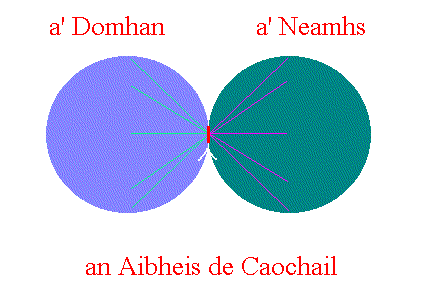

# An Aibheis de Caochail

_by Makre in **Dark Ages**_

## Cosmic Composition

Everything around us in this Aisling world is made of two primary parts, these
being Neart (energy) and a' Falamh (space). Falamh is eternal nothingness it is
infinite. The things we see and sense around us are merely energy occupying
space. Neart is not a variable it does not change or fluctuate. There is a
finite amount of energy, none is either gained or lost. However it is
constantly being exchanged, transformed into various states. Take this for
example:

When an Aisling is born a certain amount of Neart is taken from the cosmic pool
and is used to bring this Aisling into being. This energy is stored in the
Aisling through his lifetime. When, however the Aisling dies and his body
succumbs to the ravage of decomposition this energy will be transferred into
nutritious salanns (salts) which may be used by a Hydele to grow. A monk would
come along and take this plant and mix it with wine to produce Hydele Deum.
This potion could be used to regain another Aislings energy.

You see Neart is constantly being exchanged, however none is wasted it is
**all** transferred.

## Faith

Faith is, strictly speaking one of the various states of Neart. It is a power
that forms from an Aislings ailleas (will). The gods nourish and become strong
on this faith and without it they would be weaker than the Aislings that follow
them. The gods however do not live in this same world that us aislings live in.
No, they live in the heavens. This ailleas is not transferred into faith within
the Aisling. It travels towards the heavens until it reaches a small yet
infinite layer that lies on the furthermost reaches of both, a' Neamhs and a'
Domhan (Heavens and the World). This thin layer is called an Aibheis de
Caochail (Abyss of Change). It is at this point that raw Neart is transferred
into faith. This process however works in the reverse also. When an Aisling
prays and entreats a miracle the gods faith travels back towards a' Domhan and
passes through an Aibheis de Caochail. It is at this point it is transferred
into pure Neart once again where it can be arranged to form whatever the
Aisling had prayed for. This occurs constantly in a' Domhan so the transfer of
energy into faith and vice versa is constantly occurring in an Aibheis de
Caochail.



## The significance of an _Aibheis de Caochail_

As we have already seen Neart and Faith in their purest forms are converted
within an Aibheis de Caochail. We must therefore assume a compound of the two
is formed in the abyss while the change is occurring (a kind of half
transformation). This compound will be comprised of one part Faith to one part
Neart. I will for now (in the absence of a defined name) call this compound a'
Fionn Faileas (the White Shadow). We have seen that Neart in the form of an
Aislings will can travel to an Aibheis de Caochail it is then, theoretically
quite possible for an Aisling to travel to an Aibheis de Caochail. Upon
reaching the abyss the aisling will first become quite overwhelmed by the power
and exuberance of a' Fionn Faileas. The Aisling will, however over time, be
able to adapt to such power. The Aisling will be able to nourish on this power
in a similar way that the gods nourish on faith because it contains pure Neart.
The Aisling will also in turn nourish on the faith that is contained in this
compound, this is where the greatest powers comes from. Because this compound
energy contains Faith and pure Neart it will give the Aisling great power. So
much power in fact that it will overshadow that of any of the gods. This power
comes from the ability to harness a Fionn Faileas and divine singularly its
great power. The Aisling can harness all of this power if they are the only one
present in a' Aibheis de Caochail. If more than one Aisling is present in the
abyss then it is equally shared between all of them. This is what happens with
Neart, on this world there are many 'living' things so the power has to be
shared amongst many, this means no Aisling is ever truly 'powerful'. With this
power now harnessed the Aisling will be able to call great powers. They will be
able to perform great miracles and summon great creatures. The Aisling will
also have the power to heal and resurrect fallen Aislings. A' Fionn Faileas
contained within a' Aibheis de Caochail is virtually limitless and it is formed
all the time as the exchanges of Faith and Neart take place. This will give the
Aisling great limitless power. I truly hope I never see this day.

## The Dangers

There is a great danger to the Aisling making this epic journey. If the Aisling
is not in tune with the flow of Neart and is not truly faithful the Aisling
will die immediately. This is because their will be a much higher concentration
of Neart/Faith outside of their body and a lower concentration of Neart/Faith
inside their body. By a process I have named cosmosis this energy will be
ripped from their body in an effort to bring the powers into equilibrium. This
process will undoubtedly destroy the Aisling and his sole. They will never be
able to be resurrected, as their soul will have perished.

Up until now we have talked about Aislings harnessing this power, however by
the same token we must realise it is equally possible for a god to do the same
thing. This would be truly horrific as one god would be far more powerful than
any other god. This would give the power to such a god to effectively destroy
the other gods. It does not matter if this is Sgrios or even Glioca because the
great power will twist the thoughts of the gods and could make them 'evil',
this is true more so when applied to Aislings. I think I should leave this
there, as I am sure your imagination can tell you more of what this would mean
than I ever could.

## Conclusion

Now, for my conclusion. As I have showed it is possible to harness a' Fionn
Faileas contained within an Aibheis de Caochail. It is, however very unlikely
that any god or aisling will ever be able to safely complete this journey. It
must, however be recognised that this journey is theoretically possible. We as
Aislings have no control over an Aibheis de Caochail so cannot prevent such a
journey taking place. The thing we could do is to make sure no Aisling becomes
powerful or truly faithful, but we cannot do this. To do this would be akin to
taking away an Aislings inspiration, the Aisling would become no more than a
mundane. So I suppose what I'm really saying is that we should all be
constantly aware of this ever present threat and at least make sure everybody
has knowledge of its danger. It is from this knowledge, wisdom will be born,
and from wisdom comes self discipline. This is why I am writing this and not
making the epic journey myself .

_Makre_

***

```
*Librarian Notes*

This entry has been edited to conform to Library formatting.
The original can be found at http://www.darkages.com/community/phi/Makre_Energy.html .
```

