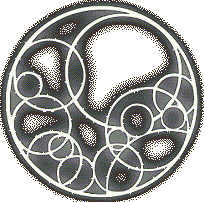
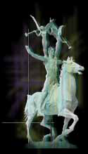
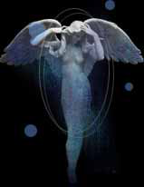
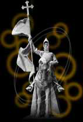

# Gods de Temuair

_Back before this land was named the earth-sea. Before the sinking of Hy- Brasyl
and before the Shadows War, there was one single entity, a god. Grinneal was
his known name. He was the first of many gods who would awaken within this
realm for many different reasons. Most gods represent the surroundings they
awakened in or they are awakened by a great calamity. Chadul awoke because of
all the chaos in the world. Continual deaths and the decay of Temuair itself
awoke Sgrios. A time in need of guidance and hope awoke Danaan. Also, with the
arrival of new gods, new abilities are found in aislings and other Temurian
peoples. With the arrival of Fioschad came the first rouge, a master of
obtaining wealth and fortune. As Cail came, monks were born. Mortals with the
ability to become one with nature. Please, the following is an explanation to
the gods of this land, know it well and know the gods that keep you alive, or
take your soul..._


| God Name      | Representation                   | Time of Awakening             |
|---------------|----------------------------------|-------------------------------|
| Grinneal      | All and nothing. The first god   | Grinneal 1. First known being |
| Danaan        | Everything under the sun         | Danaan 1                      |
| Chadul        | Chaos, Evil, Darkness            | Danaan 1813                   |
| Cail          | Nature, Harmony                  | Danaan 2988                   |
| Ceannlaidir   | War, Warriors, Strength          | Danaan 1117                   |
| Deoch         | Beginning, Creation, Debauchery  | Danaan 2573                   |
| Fioschad      | Wealth, Fortune, Luck            | Danaan 2342                   |
| Glioca        | Love, Compassion, Mercy          | Danaan 1523                   |
| Gramail       | Law, Mathematics, Justice        | Danaan 3004                   |
| Luathas       | Wisdom, Intelligence, Philosophy | Grinneal 26945                |
| Sgrios        | Death, Decay, Destruction        | Danaan 1711                   |

##  Grinneal

Grinneal was the first known god and being. Although his name is not fluent on
the lips of the people of temuair for he was not known for representing
anything or getting involved in the peoples' lives, he was an ancient god,
undoubted by anyone that he was the first and he may have been the reason the
first mortal was created. 9000 years later mortals discovered Kadath, home of
the gods, and discovered Grinneal. This is when they began to pray to the Other
Gods. These were the gods known as today, but not yet awakened. They prayed to
"sleeping" gods one might say. Many years later after this, everyone who knew
of Kadath and its sleeping gods died. Grinneal was wise, and knew that too much
knowledge for an undeveloped mind could be dangerous. The memory of Kadath was
lost and Grinneal once again watched as mortals developed. Through the ages
Grinneal continued to watch and look upon the people, unfortunately he came to
an end as Chadul was born into the world and decayed him away. It is said that
Grinneal could not take the violence of his once coexisting people, greatly
weakened by wars and the arrival of the dark entity he could no longer exist in
the world and his existence was ended...



## Danaan

Danaan, sometimes known as the god of the people, awoke in Danaan 1 (we are the
tuthe de Danaan). She was protective of her people and guided them when they
needed guidance. Gave them hope when they needed hope. But soon, for an unknown
reason, people slowly lost touch with Danaan and fell from her. Soon after they
discovered new powers and greed took over. With no guidance they fought and
warned and destroyed the great plains of Hy-Brasyl. They prayed to other Kadath
gods and worshiped the few gods of Temuair who had awoken. Still with no
guidance they unwisely toyed with the dark element and soon brought the fury of
the Dubhaimid upon them. With all the chaos Chadul was born and with the
realization of what they had done, mortals quickly prayed to seek guidance from
Danaan, And they got it. She battled Chadul that ravaged all of Temuair and
sent him back to the underworld where he lay trapped to this day. When Chadul
manipulated Tenes to make the Pact of Anaman, Danaan was the one who blessed
Ainmeal to victory over Tenes, ending the Pact of Anaman. However. Danaan in
the end sacrificed herself so that we may continue. Through our hardest times
she was there, and always will be there one way or another...


## Chadul

Ahh yes, the dark god. Mortals' greatest mistake which cost them their lives
and souls. When Chadul arrived he saw the chaos and fed the flames using the
Dubhaimid as his coals and a dark desire for total darkness and chaos for his
persistence. He drove the Dubhaimid into great powerful hordes and sent them
after the helpless and innocent. He ravaged Temuair such as no one has and
caused it to fall into Darkness. When he faced Danaan, he lost, yet Temuair
would never be the same. Broken and battered, mortals would fall into his
realm, making him stronger. He influenced the Pact of Anaman and caused the
Dark Ages of Temuair Lets take a step back. He arrived during the days of chaos
caused by the Dubhaimid. The dark element was recently discovered (which
released the Dubhaimid) and Hy-Brasyl had just finished going through chaos.
Times were bad, drubbed the eon of darkness and known for the greatest
destruction of Temuair ever. Although after the Shadows war, the Dubhaimid were
scattered and the dark element lost. Chadul banished to the underworld and a
sleeping god. You can't help but realize, the dark elements are still out
there. The Dubhaimid are still alive. And Chadul still sleeps, awaiting the day
of his awakening...

## Cail

Cail is the god of nature and believes all natural things can be slowed, but
not stopped. He was born when Glioca was seduced by Ceann. One might call him
their child, but he seems to be quite the opposite. He has a great power, and
even though Ceann took away his ability to bear arms in fear of being
outmatched, Cail is still a powerful force indeed. His awakening brought about
the first monks, mortals who could find peace and be at one with nature. With
his arrival also came a silent rebellion of Undine. Cail felt that to beat down
and conquer your own kind is not a natural process and influenced by Ceann.
Cail is also known for peace and has not raised a weapon at anyone even (Ceann
being part of thr reson). Cail still guided minks and represents nature today
in Undine. His shrine is found on Undine's outskirts and is a place of worship
for his followers. Although some say Cail became weak when he could not bear
arms and counld not stand up Ceann I believe this to be untrue. What is a
warrior to do if he had to fight a tidal wave, hmm?


## Ceannlaidir

Ceannlaidir, more commonly called CAE, is the god of war and there has never
been a battle since his awakening he has not witnessed and watched over. Fueled
by the powers of war, he is sometimes dismissed as a "bad" god. This being
untrue for although he thrives from war, he guides warriors and helps them with
their ways. He also brings strength to his followers and in times of need will
protect them. He was awakened by the building war in Hy-Brasyl which under his
influence destroyed Hy-Brasyl. Although it is believed his original intent was
to fuel the war longer and gain more from it, but Hy-Brasyl could no longer
take the punishment upon its lands and thus sunk to the bottom of the sea. When
the Dubhaimid ravaged the world, he guided mortals to battle them, knowing a
war is better than a slaughter. When the Shadows War arrived, he stayed away
knowing that the war did not need his influence, so he watched on as the 2
sided destroyed each other Back before all that, CAE was also known for pride
and dignity and even seduced Glioca which was a reason for Cail's existence,
but I'm sure the mundanes know about that better then I. When Glioca saw CAE
for what he truly was, she grew angered and even with compassion and mercy in
her she vouched she would never grace war again and from this day has been
Ceann's enemy. CAE still guided warriors and other today and his temple can be
found in Piet.


## Deoch

Although it may not have seemed to be the case at first, but aislings owe their
"awakenings" to Deoch. Back before he created the first aisling, Deoch was born
a Dubhaimid god. He represented Debauchery and would corrupt minds and scatter
mortals where he came and went. However, he left his dark ways when he fell in
love with Danaan and thus forsoke his servitude with Chadul. As time went on he
assisted Danaan in her quests and help with the discovery of the element of
light. After the Shadows War, Danaan sacrificed herself and Deoch continued on
her work. He created the "spark" or the first aisling (dreamer) and thus began
the greatest epic of the Dark Ages, now is the time of the aisling, but will
our past deeds become the present? Will we resurrect Chadul or perhaps destroy
another civilization? Only time can tell. Deoch's temple can be found in Suomi
and it is said if you are a devout follower to the Altar in Mileth, you can
speak with Deoch, and he will give you a dark jade ring. Dark and Jade
represent Dark and Light. It is a symbol of his love for Danaan and it is said
that he still mourns her death and will do so for all eternity..

## Fioschad

Fioschad, or better known as Fio, represent luck and wealth. Fio is what one
would call a chance taker or a god who enjoys the wealth of life. Although he
is sometimes called the god of greed, he has been known to be generous and
increase your gold when you pray to him. He was awoke in a time that in no real
way represent wealth and luck. So why did hen awaken at this time? Like Danaan
it was a time of need, and money was no acceptation. When Fio awoke he gave the
people a little luck to ride on and would bless those who followed him with
riches beyond measure. His arrival spawned the first rouge, who through his
teachings could polish rocks into gems and turn a normal item into an
extraordinarily crafted one. Rouges were skillful in all aspects and were
experts at getting wealth and riches. Fio soon realized that chance was his
favorite risk and wars caused him to take greater chances than ever. He soon
befriended and allied with CAE Soon after Gramail came he realized that law
also tested his luck and skill, thus he also befriended and allied with
Gramail. Fio still thrives today and his temple can be found in Abel, where to
this day he still guides rouges and offers wealth to his followers.



## Glioca

Glioca is the only child of Danaan and has many of her traits. She awoke as an
innocent compassionate godess and represents love and compassion to this day.
She is said to have some way influenced Deoch into his love of Danaan but it
has yet to be clarified. Although once seduced by Ceann, she is now an enemy of
war. One day, after Gramail awakened, she witnessed 2 lovers broken apart by
the 2 different laws of the lands. From that moment on she has been an enemy
with Law also. She stayed away from the wars in the early days preaching peace
instead. When Chadul and the Dubhaimid appeared she seemed to vanish from sight
until many Dananas later. Glioca also influenced the first priests that true
power lies in peace, on contraire to Ceann's belief. She has also been said to
have helped Ainmeal defeat Tenes through the Fae but this is also unsure.
Glioca still influences love and compassion and her shrine can be found in
Mileth. Weapons of war are not allowed in her temple and trying to bring one in
is futile...



## Gramail

Gramail since his awakening has been called the weakest of all the gods. He
started off as an Aosdic scholor and wanted to learn more about the world. When
he saw what was happening in Hy-Brasyl, he let his power be known by trying to
bring justice and law to the chaos. Since that day Gramail has been the god of
law. He represents law and justice and through him we can find protection in
some aspects and persecution in others. Gramail was awakened as a god and not
as an Aosdic scholor just as order seemed to flourish in Temuair. Wars had
ended, and the emperors of Loures kept peace in the land. There was something
missing. A guideline if you will had not been established. Algid, through
Gramail's guidance, enforced an new moral found power called law. Through this
law the people could better establish right and wrong. These laws not needed in
the early days of Hy-Brasyl for all was pure and just, but in times like these
mortals didn't seem to be able to establish this and thus Gramail established
it for them. Even during the the Shadows War he enforced his laws and did not
back down from the dark force, always bringing order to the people he may have
given them some insight in the war. Perhaps he is called the weakest god
because his work is so unrecognized. Remember, with no law there is no justice;
with no justice there is no order, and with no order there is absolute chaos.
Gramail still preaches order and justice in Loures to this day and his temple
can be found in Loures. Never fall from the grace of justice, for it will
protect you.



## Luathas

Luathas, regarded as the most intelligent god, he shows that true power can lay
in knowledge, not war. He was born as an Aosdic sholor like Gramail. Unlike
Gramail he awoke as a god almost immediately. When he saw Hy-Brysil in turmoil,
he also let himself be known by preaching logic and all he represents today.
Late in Grinneal 26900 during a time of insight and discovery was Luathas'
greatest times. Logic and knowledge ruled above all and the people used this to
find new ways of life and prosperity. Even when the mortals began to chain the
elements, Luathas regarded it as a sign of willing to know more, until the war
that destroyed Hy-Brasyl. Since then she had taught wizards to use their powers
wisely and not foolhardy. If you look at the wizard, s/he shows intelligence,
logic and the desire to learn. He also, like his ancestors, chains the elements
for his bidding. Although the great elemental war destroyed an entire
civilization, Luathas teaches wizards quickly not to do the same mistake as
their ancestors did before them. His guidance led through the ages, and
although he could not influence the dismissal of the dark element that released
the Dubhaimid, he did influence the fighting of them to rid the world of them.
Through the years he has influenced intelligence and logic and he still does so
in Rucesion where his temple lies. There is no knowledge that is not power...


## Sgrios

Sgrios is called by the mundanes an abomination. He is a Dubhaimid god who was
awakened in a time of death. Chadul had been released and the Dubhaimid were
slaughtering people left and right. Sgrios drew from this power, silently
manipulating this war, he soon realized that with destruction also came death,
and mortals offer the most power for death. Thus he joined with Chadul and
together they ravaged Temuair and created a dark cloud that slowly covered the
land. Danaan fought this and one, Chadul was sent back to the underworld and
Sgrios.... wait, what of Sgrios? Mortals had just realized his existence and
believe for a very long time this is when he awakened (untrue, he sat back for
a long time embracing the death in the world). Well as I said, he was
manipulative and deceptive. He went to the underworld as Chadul did with one
exception, he could escape at any time. The gods not knowing that the souls in
Chadul's realm gave Sgrios power, enough power to leave, thought he was trapped
Sgrios did leave and went in search of a sanctuary. A while away from Rucesion
he found the ancient castle used by Niara after the sinking of Hy-Brasyl. He
claimed it for his own, and immediately, the remaining Dubhaimid flocked there,
where for many years gained in number and power. Then with the influence of
Sgrios and Chadul, were unleashed upon the world one again, this was known as
the Shadows War. After the war was over, Sgrios had gained substantial power
from the deaths. He sat back in his dark kingdom and awaited the time of the
aisling, and still today he will scar your soul with his mark, each scar
weakening you and strengthening him. His dark shrine is within the Dubhaimid
temple, where some aislings serve him. All life ends in death...

## Conclusion

Take into mind that these are the awakened gods. There may be more gods yet to
awaken or the last of the gods may already have. Only those who have greatly
studied and gained knowledge of Kadath know the truth. Also take into mind that
Sgrios still lives, and aislings worship him even today bringing death and
decay in his name. Chadul, the dark god, still slumbers in the underworld and
with the wrong step in history, he can be awakened to once again bring chaos to
this world. Ask yourself this. If he returns, who will combat him? Danaan has
sacrificed herself and she can no longer guide us against him. Deoch perhaps?
He is originally a Dubhaimid god, remember that. Perhaps the other gods will
unite to fight him? Well, Glioca is a goddess of love, her abilities in war are
not suitable to battle the god of chaos. Perhaps Ceannlaidir? He is an ally of
Sgrios, who would support Chadul. Would his alliance outlast the life of
Temuair? Then you take that Chadul knows of the dark element. His powers could
re-flourish the Dubhaimid, and without the current power of Niara or Mileth as
they once were we would have to rely on Loures, who through an Undine rebellion
and an ancient war with Tenes no longer has the power it once was. If Chadul is
awakened it is doom for all, and this time we may not find salvation...

_NitroTFD_  
_Leader of the Lords de Niara_  

***

```
*Librarian Notes*

This entry has been heavily edited to conform to Library formatting.
The original can be found at http://www.darkages.com/community/phi/Nitrotfd_Gods .
```
