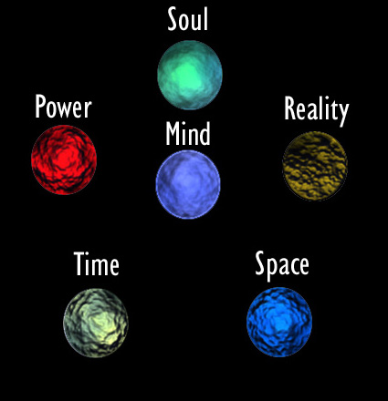

# The Sgreataidh Helm

_by Slothien in **Dark Ages**_

All knowledge concerning the Sgreataidh Helm is based on hearsay. At no point
has this information been proven to be true. Please understand these scrolls do
not speak truth, nor do they speak falsehood.

The following work has been recorded to spark interest in others on this plane
of exsistance. And also to provide new ideas to dream about. Now that I have
explained why am I inspired to write this, please read onward about the
Sgreataidh Helm.

The Sgreataidh Helm is commonly described as 'a decorative crown-like helmet
embedded with gems.' Each gem holding intense power of Space, Time, Power,
Mind, Reality and Soul. When brought together, the gems and helm, the wielder
is said to be able to hold sway over all. As they can be used to do anything.

I have recorded what each gem is said to do below:

## Mind

The Mind Gem is said to increase the power of the wielder's mind. Granting the
average person power to do what is listed below,

_Telepathy:_ The Mind Gem grants the wielder to converse with anyone via a
direct mental link. Depending one the wielder's original mind power, distant
limitations come into effect.

_Mind Probe:_ The wielder has the power to search for any desired information
in the target's mind.

_Sensory Link:_ Rather than bluntly probing the mind, the wielder can simply
'listen' in on his or her target's mind. 'Hearing' all that they are thinking.

_Mind Control:_ With this ability, the wielder can over-ride the will of
others. Causing them to do things they normally would not do.

_Telekinesis:_ Finally, the Mind Gem can grant the wielder power to move
objects with his mind, without coming into physical contact. The wielder's
original mind power determines how heavy of an object he or she can lift.

## Space

This gem wields power over the very fabric of space itself. Powers of the
space helm include,

_Teleportation:_ One of the most obvious aspects of the space gem is the
ability to teleport. The wielder may transport himself instantly between two
points. The range is only limited to the imagination of it's wielder. It is
said with enough concentration, the wielder may also teleport a number of
others depending on this imagination level.

_Space Altering:_ The wielder may simulate the gravity of the imediate area
around him or her. The intensity of the alteration depends on the imagination
level of the wielder.

## Time

The Time Gem wields power over the dimensions of time.

_Temperal Window_ : The gem can be used to peer into other times or timelines.
No temporal period is immune to this viewing, nor are any divergent or variant
timelines. The wielder must know what he is looking for.

_Age-Shifting:_ The gem can be used to alter the age of either the wielder or
another being, altering their age by a number of years equal to his own will.

_Suspended Animation:_ The gem can halt biological functions completely, by
placing a target in a null-time bubble, a bubble that will last until the
target is released.

## Reality

This gem has control over reality itself. Perhaps the most difficult gem to
explain this powerful artifact allows one to alter, or even ignore, laws of
nature as we know them.

_Reality Manipulation:_ this far reaching power allows the wielder of the
reality gem to muck with the laws of reality themselves. The gem may modify or
repeal aspects of a causality as he see fits, within the wielders will power.
Any changes made will last for a maximum number of time equal to his or her
will, unless the gem wielder is specifically concentrating on maintaining the
alteration. When the change is no longer maintained, normal reality will bounce
back into place at once. However, if the reality gem is working harmoniously
with its wielder, it may be convinced to make some small changes permanent.
This will only be a change affecting a single person, object, or small
location.

## Power

This gem is a source of Power, truly infinite in scope.The gem has the ability
to draw power from the totality of existence itself, and is the exception to
the rules of how the other gems work.

_Energy Generation:_ A source of infinite power, the power gem can be used to
emit energy, of an intensity equal to the current power rank. This may energy
may come in any form the gem wielder desires, but will be in a raw, unfocused
state.

_Energy Sponge:_ With his or her control over energy, the holder of the power
gem is rarely affected by harmful energies. The gem can be used to simply
absorb any offending energy attack, up to a rank equal to the will power of the
wielder.

_Power Enhancement:_ By tapping the power of this gem, the wielder may
increase anyones strength to the gem's current power. This enhancement lasts
as long as the gem wielder can will it.

## Soul

This gem wields power over the souls of all beings.

_Internal Limbo:_ The soul gem itself either contains, or is the doorway to, a
pocket dimension of the largest size. This reality can be used to store as many
souls as the wielder likes, for an indefinite period of time.

_Soul Absorption:_ The soul gem can be used to literally absorb the soul of
another, storing it in the pocket dimension inside itself. While so holding a
soul, the wielder can make use of any talent said soul may have had knowledge
of.

_Linguistics:_ Using the soul gem, the wielder can understand the spoken
languages of others, and communicate with others in their own tongues as well.

_De-evolution:_ One of the stranger powers of the soul gem, this ability allows
the wielder to reverse artificially induced evolution. This doesn't seem to fit
in the general class of powers this gem seems to hold, but has been mentioned
many times.

The complete Sgreataidh Helm allows their wielder power over all. However, the
wielder of the Helm must know he is able to do so, otherwise the gems will work
independently of one another. The gem's arangment is commonly thought of as
this:



The main piece of the Sgreataidh Helm is the headband, a thin metallic band
that wraps around the forehead area. It holds the Power, Mind, and Reality gems
in place. The Helm has two more bands of alloy, that extend down from the
temple area to the cheek area. The Time and Space gem are placed on the bottom.
In the center of the forehead, a small fin extends out to hold the Soul gem.
The Helm is said to shrink and expand to fit its current wielder's head. The
exact alloy in which the Sgreataidh Helm is composed is unknown, but in many
accounts the Helm is mentioned to be an orange color, with small vine-like
lines carved in. It is said to be very durable, and could even be classified as
invincable. Perhaps even older and more durable than Hy-brasyl.

The quantity of the Gems vary from account to account. Many say that there are
only one of each gem in exsistance, but many others say there are numerous gems
spread out across the land. I have included in this, two accounts from two
seperate people:

> _'Later this day,
> As I stepped into the sunlight, Zhocryon, better known as the
> godly gemsmith, had a large colorful gem before him.
> There were six statues surrounding him, not
> of people, but objects. Two of which I have singled out
> to represent Space and Time. Zhocryon lifted his
> great hammer, which seemed to emit an aura of
> unknown power. The Great Smith tensed his arm, and
> struck the Gem hard. Swirls of light and darkness
> enclosed the gem, and slowly it began to
> break apart, into six pieces. As I looked upon the
> gems, I noticed they were giving off strange
> relections, of everything, but yet or nothing. I tore my eyes away
> for they were too much for my mind to handle...'_

The author of this account will not be told to public. He speaks of Zhocryon,
an ancient gem smith, smashing a gem into six parts. And also sees six statues,
two of which represent Time and Space.

> _'I have been lost too long to remember this day's date.
> The once trusted spell, nis no longer seems to tell me.
> I stumbled upon a group of travellers, they were
> cloaked in brown robes. No more than six of them.
> They were like no Priest or Wizard I have seen.
> I asked them for assistance, but they replied that
> they had more important events to take care of.
> They allowed me to follow them, and said they
> would be making their way back to a town soon.
> We walked into a stange cave, about a few hours later,
> Torches lit even the darkess corners. In the
> Center of the room, there was a large flat
> disk of stone, with erire carvings on it. Mayhap
> these strange people were holding a religous event.
> The six of them posistioned themselves directly
> behind each of the carvings. They extended their
> arms, holding small rocks in their palms. After
> uttering some bug-like language, the stones
> became alive with power. They glowed of colors
> and almost seemed to float above their hands...'_

In this second account, she had bumped into a group of people after being lost
for days. These travellers seemed to enchant mere rocks into the Sgreataidh
Gems. Meaning their could be many of these gems across Temuair. My personal
thought, is that there are only one of each gem. To attain such power, you must
seek out the seven pieces, the six gems, and the Helm itself.

Many people have said you can use each Gem alone. But more say they must be
used in unison, to unlock their powers. Frankly, I too agree that they must be
together, even though it is possible to use each one seperatly. You could
consider the Sgreataigh Helm a weapon, but I would rather it be considered an
artifact. It can be used as a weapon, it could alter this very world so much,
that we would not even reconize it. Infact, it could very well cease our
exsistance. But could also be used as a tool of learning.

Is the Sgreataidh Helm dangerous? is a question I have been asked many a time.
The answer I give is Yes, and No. If the wielder has evil intentions, the Helm
will too become evil, but if it's wielder is of good heart, the Helm will work
to help better lives. The Sgreataidh Helm is a tool, and will do what it's
wielder commands to a ceratin extent.

I have seen many accounts proclaiming that the Helm has a mind of it's own. And
once placed on someone's head, gains control of him or her. The Helm does have
the power to do so, and might even retain thoughts and intentions of previous
owners. This theory is untested, and I hope to one day write about it.

The word 'Sgreataidh' is a word from the old tongue. It roughly translates to
'Horrible' or 'Terrible.' I would not consider this artifact horrible at all.
Although I suppose it could be used for evil purposes. I reffered to the Helm
and titled this write up Sgreataidh since more than ninty percent of the
information I have gathered use that word to describe the Helm.

So ends my write up of the Sgreataidh Helm, I hope this leaves you inspired by
it's wonder. In the future, I hope to write about the Sgreataidh Helm's myths.
Meaning about the information that doesn't appear to be repeated in serveral
other accounts.

***

```
*Librarian Notes*

This entry consists of multiple references to grossly out of character elements
and should not be interpreted as part of the Library canon, or indeed, as
existing within Temuair.

This entry has been edited to conform to Library formatting.
The original can be found at http://www.darkages.com/community/phi/ .
```
