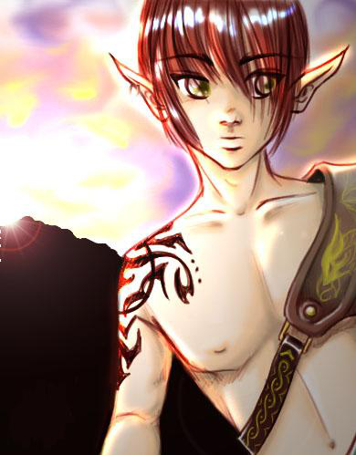
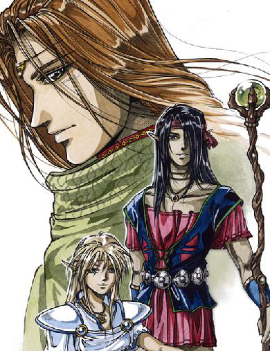
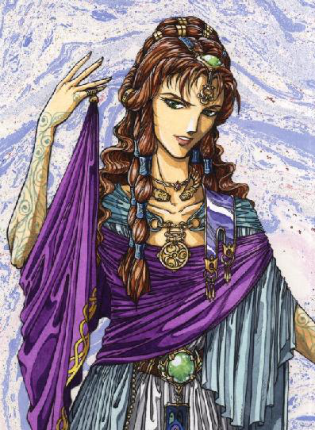
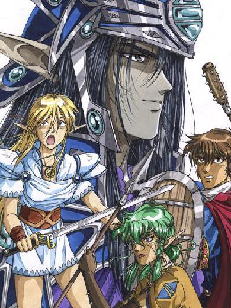

# Ceannlaidir's Truest Nature

_by Solanalein in **Dark Ages**_

_The differing perspectives of Ceannlaidir's essence from culture to culture,
through the eyes of Ceannlaidir's High Priestess._

The High Clergy of all temples have certain obligations to the god they serve,
the most important duty being to teach. Any priest will be challenged to teach
the doctrine of a temple when faced with publically accepted misconceptions
about their faith. Indeed it can become a daily struggle for a priest to teach
in the midst of texts or historical documents that contradict
their temple's teachings.

There are four works on Ceannlaidir in the Loures Library that contradict each
other in certain ways. These works surround the details of the relationship
between Ceannlaidir, Glioca, and Cail. This subject has been endlessly debated
and argued. It has been the cause of much dissent and anger, in some cases. The
problem is, depending where you go and who you talk to, the stories will
change. A priestess of Glioca has a very different conception of historical
events than does an acolyte of Cail. That in mind, which of these works is the
nearest to the modern teachings of the Ceannlaidir faith? Due to the biased
quality of some of these writings, how can any worshipper know the truest
nature of the Lord Ceannlaidir? Let us examine these works to uncover
what truth we can.

## A note on the term "False"

How can a historical work in the Library of Loures be 'false'? There are a few
factors that influence the 'truth' of a historical work. For instance, what may
have been accepted by a culture in the distant past may no longer have any
significance now. Also, over time, across the lands, different fellowships have
taught different versions of their own God's history. This leaves a void open
where miscommunication can creep in. The purpose of this philosophical
treatise, therefore, is to compare ancient historical writings, some penned by
Aislings who did not worship Ceannlaidir, to the modern teachings of the
Ceannlaidir faith; thereby leaving doors open for Ceannlaidir to maintain some
dignity in the midst of prejudice.

* [Gods of Temuair](NitroTFD-Gods-de-Temuair.md) by NitroTFD;

* [The Mark of Cail](../History/LatentAura-The-Mark-Of-Cail.md) by LatentAura;

* [The Birth of Cail](../History/Dryst-Historic-Legends-The-Birth-Of-Cail.md) by Dryst;

* [The Last Stand](http://web.archive.org/web/20090829114558/http://home.comcast.net/~undeadbard/html/contest.html) by Undeadbard, Cleric of Ceannlaidir.

## On Historical Quotation

 In order to focus on areas of comparision, I have truncated certain sections
and removed anything that was outside the subject of this essay. The portions
that have been edited out are replaced by an elipsis [...]. `(( To view the
full content of the works, click the links above. Briefer versions are below
for clarity of reading. ))`

  
_(( Art by Aereis ))_

## The Cailite Prespective

First let us begin with one of the earliest writings on Ceannlaidir. The
following is a portion from _Gods of Temuair,_ by NitroTFD. It is a summary of
all the Gods and lends some insight into what may be a Cailite's beliefs about
Ceannlaidir. First, we will examine the first portion which is a description
of Ceannlaidir's behaviour toward Glioca:

> _"Ceannladir... is the god of war and there has never been a battle since
> his awakening he has not witnessed and watched over. Fueled by the powers of
> war, he is sometimes dismissed as a "bad" god. This being untrue for although
> he thrives from war, he guides warriors and ... brings strength to his
> followers and in times of need will protect them. ...When the Dubhaimid
> ravaged the world, he guided mortals to battle them, knowing a war is better
> than a slaughter. ... Ceannlaidir was also known for pride and dignity and
> even seduced Glioca which was a reason for Cail's existence ... When Glioca
> saw [Him] for what he truly was, she grew angered and even with compassion and
> mercy in her she vowed she would never grace war again."_

This small segment does accurately describe Ceannlaidir as a protector and the
ideal for warriors to emulate. However, small shrift is given here to
Ceannlaidir's association with Glioca and Cail. The author states that Glioca
grew angry and resentful towards Ceannlaidir after being seduced. We must ask
ourselves if this is truly possible. I think we can all agree that a God, the
embodiment of a specific virtue, cannot be 'fooled' or 'tricked', nor behave in
a way contrary to Their nature. What's more, the very reason Glioca and
Ceannlaidir are incompatible is Glioca posesses none of Ceannlaidir's war-
hungry traits, so it would not be possible for Her to resent Him. NitroTFD goes
on to discuss Cail:

> _"Cail is the god of nature and believes all natural things can be slowed,
> but not stopped. He was born when Glioca was seduced by Ceannlaidir. One might
> call him their child, but he seems to be quite the opposite. He has a great
> power, and even though Ceannlaidir took away his ability to bear arms in fear
> of being outmatched, Cail is still a powerful force indeed. ... Cail felt that
> to beat down and conquer your own kind is not a natural process and influenced
> by Ceannlaidir. ... Although some say Cail became weak when he could not bear
> arms and counld not stand up Ceannlaidir. I believe this to be untrue. What is
> a warrior to do if he had to fight a tidal wave, hmm?"_

Here the author begins by stating Ceannlaidir's motives to hinder Cail's
strength were born of fear. Ceannlaidir indeed prevented Cail from using
weapons but was this done out of fear for dominance? Or was it done to prevent
a much more heinous outcome? As the ideal warrior, Ceannlaidir must acknowledge
that two fighters of equal power will duel. A father pitted against a son
produces an ugly scene. How can any father fight - and slay - his own son? How
can any son go up against his own father? Ceannlaidir eliminates this
possibility from ever occurring by forbidding Cail to train with a blade. As a
warrior of Virtue, it is against His principles to duel an unarmed child.

What's more, the author juggles the notion of which god is weaker, which is
stronger. However, he does not mention a logical association between the gods
and their entreaties. Ceannlaidir's entreaty Primal Fire is a large-scale srad
attack. Though Cail may command Nature, fire destroys it, eating up trees,
grasses, even entire valleys. Cail as well has an entreaty, Stone Hands, to
make fists akin to man-made weapons. This being said, I do not believe it is a
logical assessment that either god is weaker or stronger: Each has their own
provision for battling in a foreign environment.

  
_(( Art by Kaetz Chen ))_

## The Gliocan-Cailite Perspective

Another work that discusses Ceannlaidir's relation to Glioca and Cail is "The
Mark of Cail" written by LatentAura. This is possibly the most damaging and
misleading text on Ceannlaidir and His dynamic relations with other gods. It is
written from a perspective that could be either Gliocan or Cailite but
certainly not of a follower of Ceannlaidir. It contains multiple contradictions
to the modern teachings of the Ceannlaidir faith. We will examine this work and
correct these misinterpretations systematically.

> _"Many moons ago,the God Ceannlaidir ravaged the lands with war and strife.
> As he harmed Aislings and aisling children, Glioca, goddess of compassion,
> called upon all her strength and love to heal the ailing world. Ceannlaidir,
> realizing that he could not dominate ... devised a plan to prevent her from
> having the fortitude to assist anyone else.
>
> Ceannlaidir retired to his haven in Piet amongst the drunkards and the
> braggards that were in the tavern, sat in a large wolf skinned chair and
> placed his hand on his chin. He pondered many ways to lessen the goddess'
> will. While watching a drunken warrior harassing a poor mundane lass, he
> decided that he must seduce her and fill her with himself to bring about a
> child. He decided ... to take her a small clearing ... under the guise of a
> dying Aisling.
>
> ... With all of her compassion she tended to his wounds and saw a spark in
> his eye that endeared him to her. ... Feeling that this Aisling was pure in
> thought and rightous in virtue she allowed herself to fall into the foliage
> with him, knowing that she would produce a child. ... He shook his disguise and
> revealed himself to her. Her reaction was calm and subdued and this disturbed
> Ceannlaidir, as he hoped he would drive her to lessened state of mind. He left
> swiftly to determine what to do next. ... Word soon reached Ceannlaidir that
> Glioca had bore a son. Ceannlaidir was furious for he knew that this son driven
> with the passion of his mother and holding the strength of his father could
> strike him down. So Ceannlaidir decided to punish the child Cail. He stripped
> him of the ability to bear weapons for one fell swoop of Cail's hand would
> bring Ceannlaidir to his knees. In his haste Ceannlaidir forgot to take Cail's
> ability to dominate.
>
> ... He watched as Cail caused storms and floods to stop his minions of
> warriors in their battles. Ceannlaidir could do nothing for Cail had reached
> full maturity rather quickly. Determined to keep Cail at bay, the god of war
> decided to plant spies in the town of Undine, spreading lies of terror to
> vulnerable, gullible Aislings. He felt that if the Aislings revolted against
> Cail, he would retire to the recesses of his mind never to be heard from
> again."

First, it is evident that the author is influenced by the teachings of the
Gliocan fellowship at the time of this writing. She believes Ceannlaidir to be
malicious because she believes war to be malicious. However, though war
contains aspects of malice and treachery, that is not the heart and soul of
war. War is waged to avenge wrongdoings, restore justice; in fact war is quite
necessary to maintain a flow of new ideas and to flush out old ways. War is not
always flashing blades, spattering blood and greiving widows. War takes place
on a small scale as well as a grand scale. Aislings and Mundanes alike are
constantly competing with each other for resources, fame, power, and so on.

We also see in this work that the author forgets or ignores the fact that while
she deplores Ceannlaidir's wars, she extols the wars of Cail. In this way we
also see biased slant from a Cailite's perspective. In this work, what is
different between the two gods, besides their methods of attack? First she
denounces war as brash and crude, indeed Ceannlaidir as sloven and brutish, yet
Cail is graceful in his martial ways. As we have said, this is contrary to the
teachings of the Ceannlaidir faith in many ways.

The author's reasoning behind Ceannlaidir's seduction of Glioca is biased if
not flawed. She states that Ceannlaidir sought to weaken Glioca through
treachery, and was inspired by the drunken acts of a crude aisling. This words
are completely contradictory when compared to the modern _Virtues of a
Warrior_, written in Deoch 32 by Ceannlaidir clergymen:


* _Loyalty to Fellowship_: Remain faithful in prayer, even through your
  hardships. Defend the fellowship if it is ever attacked by weapons or insults.
  Trust in your brothers and sisters in arms.

* _Respect Above All_: Both fellow worshippers, enemies, and prey. Speak in a
  civil tongue to both friends and strangers. Respect those who seek knowledge,
  and honour those with greater wisdom. Respect creatures slain in combat, and
  thank them for their sacrifice.

* _Honour in Friendship_: Respect the opinions and needs of friends, family, and
  peers. Never betray a friend to the enemy, and never leave a friend to die in
  battle. Keep your word always, for it is your honour. Never criticize a friend
  for failure.

* _Valor In Spirit_: Enter battle with determination, faith, and believe in the
  victory that shall come to you. Be courageous in all battles. Never fear to
  stand up for your values. Be strong in your convictions.

* _Self-Discipline_: This includes obedience to instructions from mentors,
  guides, the clergy, the high clergy, the laws of your homeland, and the Laws
  of the Temple. Do not bring yourself dishonour by being cast out of the
  temple, a classroom, or town.

* _Live for Honour and Justice_: Never flee from a fight; do not start something
  that you cannot finish. Fight with the greater good as your goal. Help those
  who honestly need assistance. Show beggars, and the lazy a better path so
  they may help themselves. Take on students and teach them thoroughly and
  loyally that they may better themselves, and in doing so, honour Him.

It is obvious, when these works are compared, that there is a serious
miscommunication between historians in other fellowships and the High Clergy of
Ceannlaidir. A warrior of dishonour, who would harass a barmaid and become
publicly drunk, embarrassing himself, would never be an inspiration to a God
who embodies the Virtues described above.

While on the subject of treachery and deceit, we must acknowledge that Fiosachd
is the ruler of stealth and spies, not Ceannlaidir. Although Ceannlaidir is
indeed influenced by Fiosachd, he does not work solely or directly through
Fiosachd. Nor does Ceannlaidir work through psychologically torturing his
enemies. Ceannlaidir is much more direct in his attacks. In fact, one of the
causes behind the Ceannlaidir-Luathas clash is Luathas being the brains behind
a mental attack, not Ceannlaidir. As Nephthys, High Priestess of Luathas once
stated, _"Ceannlaidir doesn't have the smarts for it."_

Another aspect of this work that contradicts modern teachings of Ceannlaidir is
the portion discussing Cail's inability to use weapons, which we have discussed
earlier. Here we see how previous biased teachings can spread to other
historians. Reinforcing a biased outlook on a historical event confounds a High
Clergy's attempt to preach good news about Ceannlaidir. With the publication of
this work, perhaps some of these misconceptions about Ceannlaidir can be
rectified.

  
_(( Art by Kaetz Chen ))_  

## The Gliocan Perspective

The third work we will discuss which concerning Ceannlaidir, Glioca and Cail is
_The Birth of Cail,_ by Dryst Ravenshroud. Portions this work do slightly
mirror the teachings of the Ceannlaidir faith. However other parts are totally
false in accordance to the modern teachings of the High Clergy. >

> _Ceannlaidir had long been scorned by Glioca, and he returned the scorn
> with ravenous wars across her precious lands. Destroying the lives which she
> held dear to protecting. However, deep down Ceannlaidir knew that the art of
> war could not fully prevail across the land with Glioca's protection over it.
> Ceannlaidir brooded for countless nights like an ever vulture over his prey,
> awaiting the moment of death. But Glioca was a God just like he. He knew she
> could not cease to exist, so the wheels of deceit turned in his head. To an
> ancient grove he travelled and searched out an ancient herb. The herb had been
> outlawed from use in Temuair, but who was to stop a Deity from procuring it.
> Ceannlaidir knew that the hallucinigenic power of the herb woudl allow him the
> time to trick Glioca. He would steal into her forest like a thief in the night
> and there he would lie with Glioca for one night. He knew of the fertility of
> the Gods and he knew she would bear him a child. He would return upon the
> child's birth and once again trick Glioca. The child was conceived and thus
> was born Cail. But Glioca would not be tricked twice. Ceannlaidir plan to
> control part of Glioca's power through the child would fail and he feared the
> child would upset his place in the order of power. Ceannlaidir denied any
> access of weaponry to the child and thus was born the art of the monk through
> Cail, from the unity of warfare and life, came a God with a unique
> understanding of the nature of Temuair.
> \- Dryst Ravenshroud

We can see evidence of this work being influenced by Gliocan teachings by the
statements that Glioca was tricked or wronged by Ceannlaidir. As was
questioned, is it possible for a Goddess of Glioca's power to be enslaved by
tricks? Is it possible to "pull a fast one" on a god? I believe that this type
of statement is meant to, for a reason unknown to me, engender sympathy for
Glioca. What is not clear to me is why a Goddess of Compassion would need
sympathy. To be compassionate does not necessarily mean to be weak or to be a
victim - Glioca is a _Goddess_ afterall. In many of these works, Glioca is
portrayed as a fool. This particular historical document also implies that
Ceannlaidir's plan to disrupt things backfired. However, it is illogical that
Ceannlaidir, Master of All Wars, would hatch a plan to create Cail and then not
take into consideration the full outcome of his actions.

This work begins by immediately making a statement contrary to logic:
_"[Ceannlaidir] travelled and searched out an ancient herb."_ Warriors are the
only Aisling path, aside from Rogues, who cannot work with plants. Ceannlaidir
is no exception. If Ceannlaidir could work with herbs, then so could his
followers, the Warriors. However warriors can only use a potion if an Herbalist
(Priest, Monk, or Wizard) makes it for them. It is incredulous to suggest a
priest (servant of Glioca, enemy of Ceannlaidir) or a wizard (servant of
Luathas, enemy of Ceannlaidir) would have provided Ceannlaidir with this herb
or potion. Could a monk, servant of Cail, who was not yet born, have
miraculously concocted this potion? What's more, at the time of this writing,
potions were not available for purchase in stores as they are now in some
regions of the lands. Therefore Ceannlaidir could not have used herbalism to
aid his conquest. By this token alone, the work is not taught to be scripture
in the Ceannlaidir temple.


_(( Art by Kaetz Chen ))_

## The Ceannlaidirite Perspective

The last work that we will discuss is _The Last Stand,_ by Undeadbard, Cleric
of Ceannlaidir. This is a recent addition to the Loures Library. This work is
very different from others in the Library on this subject. This is the nearest
version to what has been taught in our fellowship about the relationship
between Ceannlaidir, Glioca and Cail. Indeed it appears to be the only work
present in the Library that tells the story from a different perspective. Here
is a portion of the story, which we will discuss:

> _ ... [Glioca] looked around the once-beautiful landscape. It is now
> covered with death and decay. What has happened here?" She soon learned
> Ceannlaidir"s hordes had stormed the lands. They had seemingly come out of
> nowhere. In a instant they wiped out everything in their path. Only a few of
> her people remained. She could hear them calling for her. She went to their
> side; so many wounded, so many already dead. "Ceannlaidir's rage is fierce. My
> people cannot live like this."
>
> ... Knowing they did not stand a chance, Glioca yelled, "STOP!" A large
> impenetrable barrier formed around her people. Glioca appeared within feet of
> Ceannlaidir. "You shall not harm my people!" she ordered. Ceannlaidir"s rage
> flared. "Very well m"lady," he said with a sly grin, "Then I shall harm you!"
> He drew his sword, slashing it across her throat. The fatal wound glowed and
> mended itself back together. Ceannlaidir, in seeing this, grew all the more
> angry. He attacked her in a fury. Every wound, every cut, healed as fast as it
> was delivered.
>
>  "GRRR!" Ceannlaidir turned, "Men !! Surround the area and set up camp. She
> can not protect them forever." A cold shiver went threw Glioca. "He's right,
> even if I could, my people cannot live like this. Something has to be done,
> but how?" ... She could sense their fear. She raised her arm, and with little
> effort waved it across in a single motion. She watched as they calmed. A sense
> of peace came over them. At that moment she knew what had to be done.
>
>  Late in the night Glioca entered Ceannlaidir"s tent. Seeing this, he
> immediately drew his sword. Glioca extended her arms, revealing bottle of
> brandy. "A peace offering m"lord," she said. Ceannlaidir, caring nothing for
> peace, couldn't resist a good brandy. He reached out and snatched the jug. As
> he drank Glioca summoned all of her powers into her fingertips. She reached up
> and touched his chest, completely filling his heart with compassion . As he
> lowered the jug, their eyes met. And at that moment the two became one..
>
>  \- UndeadBard

This work is radically different from others in the Library as it describes
Ceannlaidir as having more dimensions to His personality. Here, Ceannlaidir is
not cruel and coniving, but posesses the traits seen in His followers: Drive,
passion, leadership, even a love for amusement; not only a warlord bent on
takeover at all costs. Another major difference between this work and the
others we have discussed is here, Glioca is the one who seduces Ceannlaidir.
Here, the true power of Glioca shines. Glioca is more than a mere girl lost in
a whirlwind of love and pathos: She is a warrioress unto herself, sacrificing
herself out of the deep love for her people.

Through these comparisons we can clearly see the contradictions and biased
nature of historical texts. However, there are a few parallels. Ceannlaidir, as
a warrior and having the same urges as all passionate soldiers, saw Glioca and
thought of her in many ways: A challenge to his powers of battle, for with one
sweep of her hand she can heal much of his damage; A challenge to his
concentration, for her beauty and grace distract the mind; A challenge to his
wits, for her confounding theories on kindness to all creatures baffles Him.
Taking this all into consideration, Glioca also has opinions. She looks at
Ceannlaidir and sees many different essences: A brute of a man who knows no
gentleness; A heart that suffers under the pressures of battle; An ignoramous
who misses out on the delights of love. Where Cail is concerned, everyone seems
to agree that his new essence brought both dischord and balance to the
Octagram

These previous works teach that Ceannlaidir, in an act of desperation and hate,
forcefully stole innocence from Glioca. Others teach that Glioca, in
compassion, merely allowed Ceannlaidir to believe his trick worked, and turned
the situation towards her advantage. Still others believe that Glioca had her
own plan in mind to steal something from Ceannlaidir: A portion of his power
and aggression.

It is interesting how different faiths write their own versions of how events
transpired. As a philosopher, I must acknowledge those differences. But as a
High Priestess, I must also acknowledge that teachings that are not present in
the Library are being taught on a grand scale in certain places. Therefore I
present them to you here and ask you to take them into your mind. At this
temple, we teach that Glioca, as a goddess and in all her power, could not have
been fooled and tortured as some might suggest. We teach that Ceannlaidir,
Father of Cail, could never bear to fight and slay his own son, and therefore
prevented Him from training with the weapons that would make Him an equal. We
teach that Ceannlaidir is multi-faceted and is the Lord of Honour, Truth, and
Clan-ship. It is honestly up to the individual, depending on their faith, to
decide which of the theories is most reasonable and most likely. Take into
consideration the source of such documents. Make your educated deductions from
there.

_Solana Lein Neclord_
_High Priestess of War_

## Author's Afterwords

By writing this philosophy entry, I sincerely do not intend to insult anyone in
the Cail or Glioca fellowship, nor anyone who is familiar with these oldschool
teachings of Ceannlaidir. In the time I have served Ceannlaidir, since Deoch
32, I have seen great misconceptions and confusion in Aislings over this
subject. Recognizing this, I feel that it has become my obligation as
Ceannlaidir's High Priestess to expose certain contradictions to Ceannlaidir's
doctrine; to disect them, analyze them, and attempt to demonstrate how an
Aisling's bias in certain situations will create confusion. My sole goal is to
present a different idea, a different way of thinking, which is the purpose of
Philosophy.

***

```
*Librarian Notes*

This entry has been heavily edited to conform to Library formatting.
The original copy of this document has been lost. It has been reconstructed from fragments.
```
