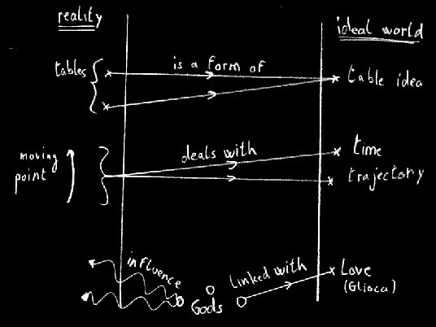

# Of Dual Theory: World and Gods

_by Zemial in **Dark Ages**_

## Foreword

This humble theory tends to give a reasonable organisation of reality and
ideas. It does not require high mathematical of philosophical skills, though
some definitions are supposed to be known. Those requisites are exposed in the
first part of this document, so are the reasons of existence of this theory,
and its goals.

This theory won't be proven. There will be no experiment, as I think nothing
can proove the theories about reality and life. You will have to trust the
theory. If someday an internal contradiction is shown, or if some experiments
can't be explained by the theory, it will just fall in the basket (full) of all
the precedent theories that were not able to well describe the world.

Furthermore, the theory will be explained for itself, not extracted from
reality, of from facts seen in the real world, as it would be foolish to try to
explain reality and use it as a basis for the explanation, it would, in my
opinion, be a risk of internal contradiction.

## The goals and basis of this theory

1. Why would one change the elemental theory?

  As described in Grim's essay "[Hexagram](./Grim–Hexagram.md)" or Kedian's
"[Aosdic Mystic Theory](./Kedian-Aosdic-Mystic-Theory.md)", the six basic
elements, that are Light, Darkness, Air, Earth, Water and Fire, are supposed to
be able to describe the world as a composition of those six entities. Each
object, idea, would be a special mixture or extract of these elements. The
reader may report to the many works on this in Loures library, as Kandolo's
"[Music Theory](Kandolo-Theory-of-Temuairan-Music.md)" or
Chaltier's "[Analysis of the Darkness, Light, and Soul](Chaltier-Analysis-of-the-Darkness-Light-and-Soul.md)".

  In my humble opinion, this theory is not able to describe the whole world
(though I am not sure it tends to). I am talking about some basic objects that
can't be said to be a mixture of the six elements : metals (that may be under
earth field though), circles, segments. I agree those are mathematical objects,
that are not of this world, but what to say about a circle drawn on a board, or
on the ground. In my opinion it takes a real form, and so should be described
not only by the real support on which it is represented, but also by the ideal
concept it deals with.

  So are some concepts, among Liberty, Gods, Will, that may enter some fields of
Light or Darkness sometimes, depending on which uses them, but that may not be
categorized definitively in one side of the balance. Those concepts are above
Light and Darkness, at least in the current definition Light and Darkness (I
will tend to explain later that darkness is no longer needed to be defined). As
a consequence of the two above remarks, i am ready to depict another theory of
the world, to answer the apparent non-fulfilment of the elemental theory.

  Even if my precedent objections are someday shown to be unjustified, my theory
would not be harmed by this discovery, as it is not based on those facts to
exist.

2. Prolegomena

  The existence of Light is required to establish the following theory. It is
supposed to exist, there can be no denial on this point. Nor there will be on
definition of ensembles (spaces), points, time, matter and ideas. Those
concepts are supposed to be known by all of us, they are basic concepts only,
that I can't define by myself (too difficult to understand for me, and to
explain in this essay). The reader is also supposed to know a little bit about
religions, gods and their essential values. Those will be used as examples
only.


## About Light and his role

1. Light as the constituent fiber and justification

  As explained in prolegomena, Light is supposed to exist. It is defined here as
the primordial element. I mean, it is the abstract so-called element that makes
everything existing. It is the only fiber of every object in this world, real
of ideal. As no explanation will be given about the existence of the world,
Light is supposed to be the cause of this being, and justify the being of every
object, living form, or fluid (this notion will be exposed later).

  I consider every element constituing of this world is called Light. So there is
no need for any other element, that even can't be defined. In some way; every
former element (Air, Earth..) is considered to be a component of Light. Light
is just the primary justification and material of everything in this world.
This given definition will enable us to define real and ideal spaces, without
bothering with the "why?" or "how?" problems.

  As I said, this definition is not to be justified, it is a personnal choice not
to place the world under a dual definition of Light and Dark, it may be
disagreed, but not denied. (I chose this solution maybe cause I am too
optimistic, As a worshiper of Glioca, I believe there is some goodness in every
Aisling heart. There is no need for darkness in my mind.)

2. The darkness no longer needed or defined

  Some people may say that the above defintion of Light is not what we currently
call Light, that is true of course. Some other people may say it contains good
and evil in one element, light and darkness became one in this only element,
that is not true. The Light I tend to define, cannot be called "good" or
"evil", as those concepts are a consequence of existence of light, a special
form (mixture) of it.There is no contrary to what I call "Light" cause it is
the only thing that will (has) ever exist(ed).

  To clarify the situation, I would say there would be no need for a "down"
concept, if just everything was related to "highness", so that the "down"
concept would be just null, empty, as is "Darkness" in my theory.  


## Dual spaces: reality and ideal world

Those following paragraphs are the heart of my theory. I will first define two
spaces, one that can be considered as our current definition of reality, and
the other that pools every concept and ideas in an abstract space. Then I will
expose how I consider objects and fluids in those spaces, and between those
spaces. It may seem heretical or too rationnal at the beginning, but it tends
to explain the life of each of us, and the links we have with gods, concepts,
the life around us.


1. Definition of the real and ideal spaces, and the links between them

  Let us consider a space, that is an ensemble of points. This is an eternal
notion of space, points are static forever (that is non-sence to talk about
time in this space cause time will be considered as an element of the space and
can't have any influence on it). This space can be considered as the ideal
world. It pools every object of thought: goodness, evilness, freedom,
compassion, hate, time.. and the dimensions we just talked about above.
Aislings can have a sight on this ideal world, this ability is called
"intelligence" (that will be defined in the following).

  Let us consider a space, that is, an ensemble made of points, that will be
called "reality". The points of this last space are bound to one of more
concepts in the ideal world. For example every table in reality is linked with
the "table" idea, so are some murders linked with "evilness" and "hate".
Intelligence is an ability, given to us to sense those links, between concepts
and their form in matter. Movements in reality can be interprated as a pool of
point of the reality, that is linked with Time. Furthermore, we can define
"Magic" as a movement, linked with "fire", or "water", then we find back the
former links between magical actions and former elements.


2. Movements between spaces: Gods

  There are movements between spaces, that mix real forms and concepts, those
movements are similar to what we call "Gods". They are between the two spaces,
so they can fit under a special concept (like Glioca for Love, or Sgrios for
Destruction), and a real form (incarnation, voices from gods..). These are
special objects, not of reality, nor of ideal world, they can influence the
life of all of us. This definition is just left out of the system of dual
spaces, it is very difficult to understand there can exist something out of the
spaces, but this part of unknown mistery must be left unknown, as are Gods
wishes, influence, and existence.

  This theory can be summarized in this following picture.Crosses are points in
the spaces, lines between spaces are the links. Gods in between have an
influence on reality, and a link with ideal world.



## Conclusion

1. Some definitions that meet the former system

  There are some facts from the former elemental theory that meet the new ones.
I will try in this section to clarify the situation of those in the new system
described above. This is a summarize of the whole theory in some examples.
This part is only an interpretation of the theory, that shall be
reinterpretated if needed.

1.1. Air, Earth, Water, Fire, "Light" and Darkness

  Those 6 elements are just a part of the ideal world. The interpretation of
movement in reality, and bounds to concepts can let us define Magical Arts as
the creation of a point in reality, linked with some these special concepts.
What we were used to call "Light" no longer describes the primary fiber called
"Light" in this system. It may be a pool of links, a pool of things or
movements described as being in "Light" or "Darkness". I wont define the rules
of this description, as it is left to the appreciation of everyone to consider
something as being Light or Darkness, as for Good or Evil.

1.2. Interactions between Gods, and religions

  There is no place in my system for interactions between Gods, as there is no
precise definition of them (I have to admit it). They can have contradictory
influences on reality, that we shall consider as good or evil. This may seem a
little bit heretical, but it is not in my mind, as it considers them as
components and actors of our world.

## Evolutivity of the system, and its limits

This system has just born, it is not supposed to replace the former elemental
system, but is it a proposition, for explanation that ask to be given, about
some facts that we cannot, apparently, explain in the other one. This is only a
model, trying to describe the reality and the ideas we have. It cannot be
considered as "proven" or "true", is can only be taken as a supposition to a
work that deals with the facts defined above.

_Zemial Sha-Kolaan_

***

```
*Librarian Notes*

This entry has been edited to conform to Library formatting.
The original can be found at http://www.darkages.com/community/phi/Zemial_Dualism.html .
```


